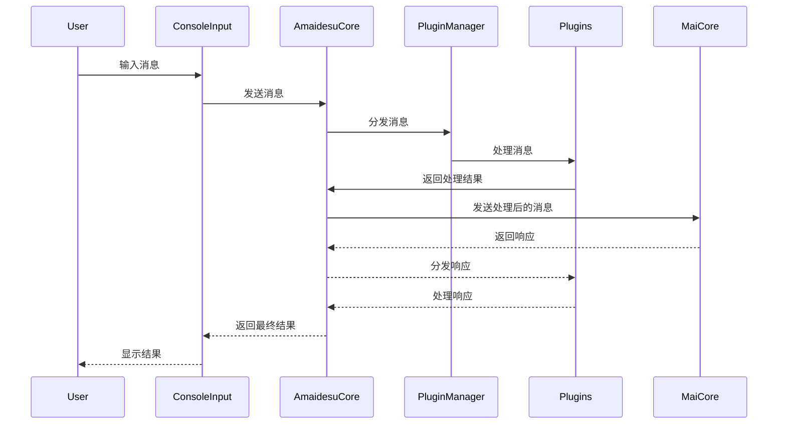
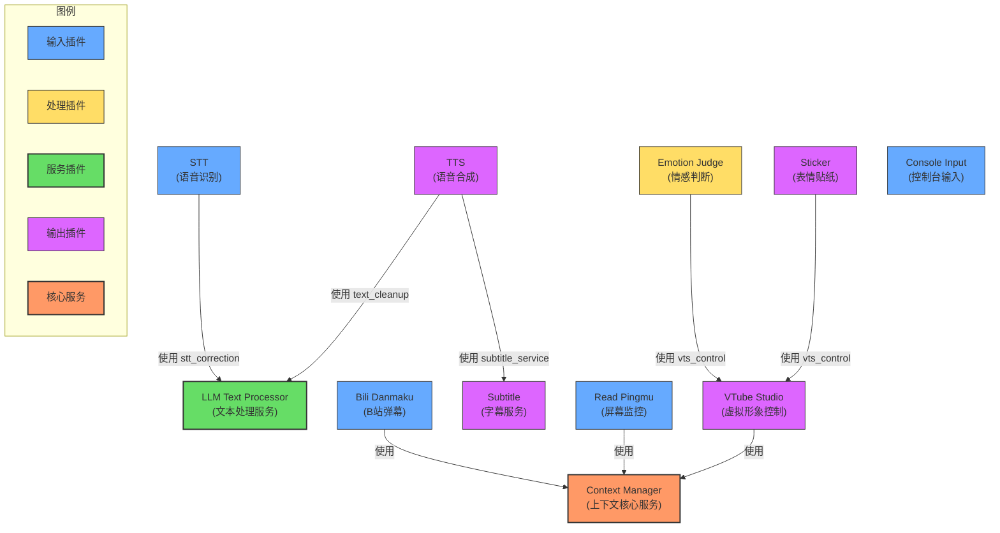

<br />
<div align="center">

# Amaidesu

Amadeus?

Amaidesu!


  
  
  
  
  
  
[](https://deepwiki.com/ChangingSelf/Amaidesu)


## 📝 项目简介


聊天机器人麦麦的[VTubeStudio](https://github.com/DenchiSoft/VTubeStudio) 适配器。
其聊天核心为[麦麦Bot](https://github.com/MaiM-with-u/MaiBot)，一款专注于 群组聊天 的赛博网友 QQ BOT。

</div>

## 注意：本项目即将重构

重构的设计文档在[重构设计文档](./refactor/design.md)

## 架构概述

### 5层核心数据流（2025年最新版本）

```
外部输入（弹幕、游戏、语音）
  ↓
【Layer 1-2: Input】RawData → NormalizedMessage
  ├─ InputProvider: 并发采集 RawData
  ├─ TextPipeline: 限流、过滤、相似文本检测（可选）
  └─ InputLayer: 标准化为 NormalizedMessage
  ↓ normalization.message_ready
【Layer 3: Decision】NormalizedMessage → Intent
  ├─ MaiCoreDecisionProvider (默认，WebSocket + LLM意图解析)
  ├─ LocalLLMDecisionProvider (可选，直接LLM)
  └─ RuleEngineDecisionProvider (可选，规则引擎)
  ↓ decision.intent_generated
【Layer 4-5: Parameters+Rendering】Intent → RenderParameters → 输出
  ├─ ExpressionGenerator: Intent → RenderParameters
  └─ OutputProvider: 并发渲染（TTS、字幕、VTS等）
```

### 核心组件

主要由以下几个核心组件构成：

1. **AmaidesuCore**: 核心模块，负责组件组合（Composition Root）
   - 管理 EventBus、LLMService、PipelineManager、DecisionManager
   - 不再负责数据流处理（已迁移到 FlowCoordinator）
2. **PluginManager**: 插件管理器，负责插件的加载和管理
   - 支持新旧两种插件架构（向后兼容）
   - 新架构：Plugin 协议（推荐），通过 event_bus 和 config 依赖注入
   - 旧架构：BasePlugin（已废弃），通过 self.core 访问核心功能
3. **EventBus**: 事件总线，提供发布-订阅机制，用于插件间通信
   - 支持优先级、错误隔离、统计功能
4. **Provider 接口**: 新架构的核心抽象，封装具体功能
   - InputProvider: 输入数据采集（如弹幕、控制台输入）
   - DecisionProvider: 决策处理（如 MaiCore、LLM、规则引擎）
   - OutputProvider: 输出渲染（如 TTS、字幕显示、VTS）
5. **PipelineManager**: 管道管理器，负责管道的加载和执行
   - TextPipeline: Layer 1-2 文本预处理（限流、过滤）
   - MessagePipeline: MaiCore 消息处理（inbound/outbound）
6. **ContextManager**: 上下文管理器，负责管理和聚合来自不同插件的上下文信息
7. **FlowCoordinator**: 数据流协调器，负责 Decision → Rendering 之间的数据流
8. **插件系统**: 各种功能插件，如 TTS、STT、LLM 等

详见：[架构设计文档](./refactor/design/overview.md)

### 插件架构迁移

系统已完成从 BasePlugin 到新 Plugin 架构的重构：

**新架构特点**：
- 不继承任何基类，通过 event_bus 和 config 依赖注入
- 使用 Provider 接口封装具体功能，更好的解耦和可测试性
- 支持事件总线通信，插件间通过发布-订阅模式交互

**迁移状态**：
- ✅ 已迁移：大部分插件（如 bili_danmaku、console_input、subtitle 等）
- ⏳ 待迁移：gptsovits_tts（仍在使用 BasePlugin）

**迁移指南**：
1. 新插件应使用 Plugin 协议（参考：src/core/plugin.py）
2. 查看已迁移插件示例：src/plugins/bili_danmaku/plugin.py
3. 旧 BasePlugin 将在未来版本中移除，现有插件无需立即迁移（向后兼容）

详见：[插件开发指南](#插件开发)

### 消息处理时序图



## 安装与运行

### 使用 uv（推荐）

本项目使用 [uv](https://docs.astral.sh/uv/) 作为包管理器，它比 pip 快 10-100 倍。

```bash
# 1. 安装 uv（如果尚未安装）
# Windows (PowerShell)
powershell -ExecutionPolicy ByPass -c "irm https://astral.sh/uv/install.ps1 | iex"

# macOS/Linux
curl -LsSf https://astral.sh/uv/install.sh | sh

# 2. 克隆仓库
git clone https://github.com/ChangingSelf/Amaidesu.git
cd Amaidesu

# 3. 同步依赖（自动创建虚拟环境）
uv sync

# 4. 如果需要语音识别功能，安装额外依赖
uv sync --extra stt

# 5. 配置（首次运行会自动生成配置文件）
uv run python main.py

# 6. 编辑生成的 config.toml 文件，填入必要配置

# 7. 启动在这之前已经部署好的 MaiCore（参见 MaiBot部署教程）

# 8. 再次运行
uv run python main.py
```

### 使用 pip（传统方式）

```bash
# 1. 克隆仓库
git clone https://github.com/ChangingSelf/Amaidesu.git
cd Amaidesu

# 2. 创建虚拟环境
python -m venv .venv
# Windows
.venv\Scripts\activate
# macOS/Linux
source .venv/bin/activate

# 3. 安装依赖
pip install -e .

# 4. 运行（后续步骤同上）
python main.py
```

详见 [MaiBot部署教程](https://docs.mai-mai.org/manual/usage/mmc_q_a) 了解 MaiCore 的部署方法。

## 运行与配置

1.  **首次运行与配置生成**: 
    - 在首次运行 `uv run python main.py` 之前，请确保根目录下存在 `config-template.toml`。
    - 首次运行会自动检查并根据 `config-template.toml` 创建 `config.toml`。
    - 同时，它也会检查 `src/plugins/` 和 `src/pipelines/` 下各个子目录，如果存在 `config-template.toml` 但不存在 `config.toml`，也会自动复制生成。
    - **插件配置加载**: 插件在运行时会加载其各自目录下的 `config.toml` 文件。您可以在这些文件中为插件设置特定的参数。如果需要在全局层面覆盖某个插件的特定配置项，可以在根目录的 `config.toml` 文件中的 `[plugins.插件名]` 部分进行设置（例如，对于名为 "tts" 的插件，配置段为 `[plugins.tts]`）。全局配置会覆盖插件目录下 `config.toml` 中的同名配置项。最终生效的配置会传递给插件实例。
    - **重要**: 自动生成配置文件后，程序会提示并退出。请务必检查新生成的 `config.toml` 文件（包括根目录和插件/管道目录下的），填入必要的配置信息（如 API 密钥、设备名称、房间号等），然后再重新运行程序。

2.  **启动程序**: 
    - 配置完成后，使用 `uv run python main.py` 启动应用程序。

3.  **命令行参数**:
    - `--debug`: 启用详细的 DEBUG 级别日志输出，方便排查问题。
      ```bash
      uv run python main.py --debug
      ```
    - `--filter <MODULE_NAME> [<MODULE_NAME> ...]`: 过滤日志输出，只显示指定模块的 INFO/DEBUG 级别日志。WARNING 及以上级别的日志总是会显示。可以指定一个或多个模块名。
      ```bash
      # 只显示来自 StickerPlugin 和 TTS 模块的 INFO/DEBUG 日志 (以及所有模块的 WARN+ 日志)
      uv run python main.py --filter StickerPlugin TTSPlugin 
      
      # 同时启用 DEBUG 并过滤
      uv run python main.py --debug --filter StickerPlugin
      ```
      *   模块名通常是 `src/utils/logger.py` 中 `get_logger("模块名")` 使用的名称，或者插件/管道的类名或目录名（取决于日志记录时如何绑定模块名）。可以通过查看日志输出中的模块名来确定。

## 模拟MaiCore

当你不方便部署麦麦时，可以用它启用一个ws服务端和一个控制台输入任务，便于模拟麦麦的回应来测试插件功能

使用方法：

```bash
uv run python mock_maicore.py
```

现在支持的简单命令：
- sendRandomEmoji: 发送一个随机的表情包（默认在"data/emoji"目录下查找表情包），用于测试VTubeStudio的表情包功能

## 已有插件

### 插件列表

以下是当前项目中包含的插件列表。对于有详细说明的插件，可以直接点击链接查看其 `README.md` 文件。

- [arknights](./src/plugins/arknights)
- [bili_danmaku](./src/plugins/bili_danmaku/README.md)
- [bili_danmaku_official](./src/plugins/bili_danmaku_official/README.md)
- [bili_danmaku_selenium](./src/plugins/bili_danmaku_selenium/README.md)
- [command_processor](./src/plugins/command_processor)
- [console_input](./src/plugins/console_input/README.md)
- [dg-lab-do](./src/plugins/dg-lab-do)
- [dg_lab_service](./src/plugins/dg_lab_service/README.md)
- [emotion_judge](./src/plugins/emotion_judge/README.md)
- [funasr_stt](./src/plugins/funasr_stt)
- [gptsovits_tts](./src/plugins/gptsovits_tts/README.md)
- [keyword_action](./src/plugins/keyword_action/README.md)
- [llm_text_processor](./src/plugins/llm_text_processor/README.md)
- [message_replayer](./src/plugins/message_replayer)
- [minecraft](./src/plugins/minecraft/README.md)
- [mock_danmaku](./src/plugins/mock_danmaku/README.md)
- [read_pingmu](./src/plugins/read_pingmu/README.md)
- [sticker](./src/plugins/sticker/README.md)
- [stt](./src/plugins/stt/README.md)
- [subtitle](./src/plugins/subtitle/README.md)
- [tts](./src/plugins/tts/README.md)
- [vtube_studio](./src/plugins/vtube_studio/README.md)


### 插件依赖关系

**注意: 此图表可能不是最新的，仅供参考。**
以下图表展示了主要插件之间的服务依赖关系：



## 插件开发

### 新架构（推荐）

新插件应使用 Plugin 协议，不继承任何基类：

```python
# src/plugins/my_plugin/plugin.py
from typing import Dict, Any, List
from src.core.plugin import Plugin
from src.core.providers.input_provider import InputProvider
from src.utils.logger import get_logger

class MyPlugin:
    """
    我的插件（使用新架构）

    不继承 BasePlugin，实现 Plugin 协议
    """

    def __init__(self, config: Dict[str, Any]):
        self.config = config
        self.logger = get_logger(self.__class__.__name__)
        self.logger.info(f"初始化插件: {self.__class__.__name__}")

        self.event_bus = None
        self._providers: List[InputProvider] = []

    async def setup(self, event_bus, config: Dict[str, Any]) -> List[Any]:
        """
        设置插件

        Args:
            event_bus: 事件总线实例
            config: 插件配置

        Returns:
            Provider列表
        """
        self.event_bus = event_bus

        # 创建 Provider
        from .providers.my_provider import MyProvider
        provider = MyProvider(config)
        self._providers.append(provider)

        return self._providers

    async def cleanup(self):
        """清理资源"""
        self.logger.info(f"开始清理 {self.__class__.__name__}...")

        for provider in self._providers:
            await provider.cleanup()
        self._providers.clear()

        self.logger.info(f"{self.__class__.__name__} 清理完成")

    def get_info(self) -> Dict[str, Any]:
        """获取插件信息"""
        return {
            "name": "MyPlugin",
            "version": "1.0.0",
            "author": "Author",
            "description": "My plugin description",
            "category": "input",  # input/output/processing
            "api_version": "1.0",
        }

plugin_entrypoint = MyPlugin
```

### 旧架构（已废弃）

⚠️ **BasePlugin 已废弃，仅用于向后兼容**

旧插件开发需要继承 `BasePlugin` 类：

```python
from src.core.plugin_manager import BasePlugin
from src.core.amaidesu_core import AmaidesuCore # 确保导入 AmaidesuCore
from typing import Dict, Any # 确保导入 Dict 和 Any
from maim_message.message_base import MessageBase

class MyPlugin(BasePlugin):
    def __init__(self, core: AmaidesuCore, plugin_config: Dict[str, Any]):
        super().__init__(core, plugin_config)
        # 此时，self.plugin_config 已经包含了此插件的最终配置
        # (已合并插件目录下的 config.toml 和根目录下 config.toml 中可能的覆盖项)
        # 例如，从插件的配置中获取一个设置：
        # self.my_specific_setting = self.plugin_config.get("my_key", "default_value")
        # self.logger.info(f"MyPlugin '{self.__class__.__name__}' loaded with config: {self.plugin_config}")

        # 自己的初始化逻辑
        # 例如:
        # self.api_url = self.plugin_config.get("api_url")
        # if not self.api_url:
        #     self.logger.error("api_url not configured for MyPlugin!")
        #     self.enabled = False # 可以根据配置决定是否启用插件

    async def setup(self):
        # 注册消息处理器
        await self.core.register_websocket_handler("text", self.handle_message)
        # 也可以将自己这个插件注册为服务供其他插件使用
        self.core.register_service("vts_control", self)

    async def handle_message(self, message: MessageBase):
        # 处理从 AmaidesuCore (通常是 MaiCore 转发) 传递回来的消息
        # self.logger.debug(f"MyPlugin received message: {message.message_segment.data}")
        pass

    async def cleanup(self):
        # 清理插件使用的资源，例如关闭网络连接、释放文件句柄等
        self.logger.info(f"MyPlugin '{self.__class__.__name__}' cleaning up...")
        await super().cleanup() # 调用父类的 cleanup 方法
        self.logger.info(f"MyPlugin '{self.__class__.__name__}' cleanup complete.")

plugin_entrypoint = MyPlugin
```

### 开发指南

- ✅ **新插件应使用 Plugin 协议**（参考：src/core/plugin.py）
- ✅ **查看已迁移插件示例**：src/plugins/bili_danmaku/plugin.py
- ⚠️ **BasePlugin 将在未来版本中移除**，但现有插件无需立即迁移（向后兼容）
- ⏳ **待迁移插件**：gptsovits_tts

详见 [AGENTS.md](./AGENTS.md) 获取完整的插件开发规范。

## 管道系统

管道系统用于在消息发送到 MaiCore 前进行预处理。管道可以用于实现各种功能，如消息过滤、限流、内容转换等。

### 管道配置方式

管道的启用、优先级以及全局配置覆盖均在根目录的 `config.toml` 文件中进行配置。

#### 基本配置与启用

在根 `config.toml` 文件中，管道的配置位于 `[pipelines]` 表（TOML section）下。每个需要启用和配置的管道都对应一个以其蛇形命名（snake_case）命名的子表。例如，名为 `ThrottlePipeline` 的管道，其配置节为 `[pipelines.throttle]`。

要启用一个管道，必须在其对应的配置节中定义 `priority` 项，它是一个整数，数值越小，管道的执行优先级越高。

```toml
# 根目录 config.toml 示例

[pipelines]
  # "throttle" 是管道的蛇形名称 (对应 src/pipelines/throttle/ 目录)
  [pipelines.throttle]
  priority = 100  # 必须: 定义此管道的优先级，并启用它
  # 可选: 全局配置覆盖，见下文
  global_rate_limit = 50 # 将覆盖 throttle/config.toml 中的 global_rate_limit
  user_rate_limit = 5    # 将覆盖 throttle/config.toml 中的 user_rate_limit

  [pipelines.message_logger] # 对应 MessageLoggerPipeline
  priority = 200 # 启用 message_logger，使用其内部默认配置或其自身 config.toml 中的配置

  # 要禁用一个管道，可以注释掉其 priority 行，或整个 [pipelines.pipeline_name_snake] 部分
  # [pipelines.my_experimental_pipeline]
  # # priority = 999 # 此行被注释，所以 my_experimental_pipeline 不会加载
  # some_option = true
```

1.  **命名规则**：管道的目录名和在 `[pipelines]` 下的配置节名使用蛇形命名法（例如 `my_pipeline`）。系统会自动查找名为 `MyPipelinePipeline`（驼峰式 + "Pipeline" 后缀）的类。
2.  **优先级**：`priority` 值越小，优先级越高（越先执行）。
3.  **启用**：只有在根 `config.toml` 的 `[pipelines.pipeline_name_snake]` 中定义了有效的 `priority`，该管道才会被加载和启用。

#### 管道特定配置与全局覆盖

每个管道可以有其自己的配置文件，通常位于其包目录下的 `config.toml`（例如 `src/pipelines/throttle/config.toml`）。

-   **管道独立配置**：管道在其自身 `config.toml` 文件中定义其特定的配置参数。这个文件可以是一个扁平的键值对集合，或者包含一个与管道蛇形命名同名的表（section）。如果存在同名表，则使用该表的内容作为其独立配置；否则，使用整个文件的内容。
-   **全局覆盖**：在根 `config.toml` 的 `[pipelines.pipeline_name_snake]` 表中，除了 `priority` 之外的其他键值对，将作为全局配置覆盖管道独立配置文件中的同名项。这允许在项目级别集中管理和调整管道行为，而无需修改管道内部的配置文件。

最终生效的配置（合并了管道独立配置和全局覆盖配置）将通过构造函数注入到管道实例的 `config` 属性中。

例如，对于 `ThrottlePipeline`：

管道独立配置文件 `src/pipelines/throttle/config.toml` 可能如下：
```toml
# src/pipelines/throttle/config.toml

# 可以是扁平结构，或者包含在 [throttle] 表中
# [throttle]
# 是否启用此管道 (注意：实际启用由根配置的 priority 决定)
enabled = true # 此处的 enabled 通常不起作用，因为启用由根配置的 priority 决定

# 全局消息频率限制（每分钟最大消息数量）
global_rate_limit = 100

# 每个用户消息频率限制（每分钟最大消息数量）
user_rate_limit = 10

# 时间窗口大小（秒）
window_size = 60
```
如果根 `config.toml` 中配置如下：
```toml
[pipelines.throttle]
priority = 100
global_rate_limit = 50 # 全局覆盖
```
那么 `ThrottlePipeline` 实例接收到的 `config` 字典中，`global_rate_limit` 将是 `50`，而 `user_rate_limit` 则是来自其独立配置的 `10`。

### 自定义管道开发

要创建自定义管道，需遵循以下步骤：

1.  在 `src/pipelines` 目录下创建新的包目录，如 `my_pipeline`。
2.  在包目录中创建 `__init__.py` 文件和 `pipeline.py` 文件。
3.  在 `pipeline.py` 中继承 `MessagePipeline` 基类并实现 `process_message` 方法：

```python
# src/pipelines/my_pipeline/pipeline.py
from src.core.pipeline_manager import MessagePipeline
from maim_message import MessageBase
from typing import Optional, Dict, Any # 确保导入 Dict, Any

class MyPipelinePipeline(MessagePipeline): # 类名约定：驼峰式 + Pipeline 后缀
    # 类属性的 priority 仅作为文档参考或未在根配置中指定时的极端回退
    # 实际运行优先级由根 config.toml 中的 priority 决定
    priority = 500
    
    def __init__(self, config: Dict[str, Any]):
        super().__init__(config) # 调用父类构造，传递配置
        # 初始化管道，可从 self.config 中读取参数
        self.param1 = self.config.get("param1", "default value from code")
        self.param2 = self.config.get("param2", 42)
        self.logger.info(f"MyPipelinePipeline initialized with param1='{self.param1}', param2={self.param2}")
    
    async def process_message(self, message: MessageBase) -> Optional[MessageBase]:
        # 处理消息的逻辑
        self.logger.debug(f"MyPipelinePipeline processing message with param1: {self.param1}")
        # 返回处理后的消息，或返回 None 表示丢弃该消息
        return message
```

4.  在 `__init__.py` 中导出管道类：

```python
# src/pipelines/my_pipeline/__init__.py
from .pipeline import MyPipelinePipeline # 使用相对导入

__all__ = ["MyPipelinePipeline"]
```

5.  （可选）创建管道配置模板文件 `config-template.toml` 和默认配置文件 `config.toml` 于 `src/pipelines/my_pipeline/` 目录下：

```toml
# src/pipelines/my_pipeline/config.toml (或 config-template.toml)

# 可以是扁平键值对，这些将作为此管道的默认配置
param1 = "default value from pipeline's own config.toml"
param2 = 100

# 或者，也可以将它们放在与管道同名的表中 (可选)
# [my_pipeline]
# param1 = "default value from pipeline's own config.toml section"
# param2 = 101
```

6.  在主配置文件 `config.toml` 中添加启用配置：

```toml
# 根 config.toml
[pipelines]
  # ... 其他管道 ...

  [pipelines.my_pipeline]  # 对应 MyPipelinePipeline 类和 my_pipeline 目录
  priority = 500
  # 可选：覆盖 my_pipeline/config.toml 中的配置
  # param1 = "overridden value from root config"
  # param2 = 999
```

### 管道执行流程

1. 系统初始化时，`PipelineManager` 加载所有已启用的管道
2. 管道按优先级排序（数字越小优先级越高）
3. 消息按优先级顺序依次通过各个管道处理
4. 如果任何管道返回 `None`，消息处理终止（消息被丢弃）
5. 最终处理后的消息发送到 MaiCore 
