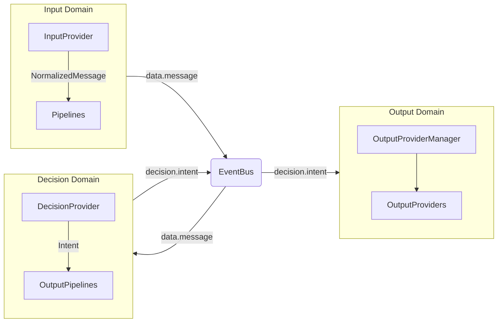

<br />
<div align="center">

# Amaidesu

Amadeus?

Amaidesu!


[](https://deepwiki.com/Mai-with-u/Amaidesu)


## 项目简介

聊天机器人麦麦的 [VTubeStudio](https://github.com/DenchiSoft/VTubeStudio) 适配器。
其聊天核心为 [麦麦Bot](https://github.com/MaiM-with-u/MaiBot)，一款专注于群组聊天的赛博网友 QQ BOT。

**架构状态**：✅ 核心架构重构已完成，采用 3域架构 + Provider 系统

如需了解重构前后的架构差异，可查看 [重构文档](refactor/README.md)。

</div>

## 架构概述

### 3域架构数据流

> **为什么叫"域"(Domain)而不是"层"(Layer)？**
>
> 传统"层"(Layer)代表**不同的抽象层级**，如表现层→业务层→数据层，每层都有不同的抽象级别。而"域"(Domain)强调的是**平等的业务边界**划分：
>
> - **层(Layer)**：有高低之分，上层调用下层，下层不知道上层存在
> - **域(Domain)**：平等边界，各自包含完整的抽象层次（自己的数据模型、Provider、处理逻辑）
>
> 每个域都有自己的：
> - **数据模型**：Input → NormalizedMessage → Intent → RenderParameters
> - **核心抽象**：InputProvider / DecisionProvider / OutputProvider
> - **处理逻辑**：数据采集 / 决策生成 / 渲染输出
>
> 域之间通过 EventBus 进行**松耦合通信**，而非直接的层级调用。这种划分允许各域独立演进，例如可以替换决策引擎（从 MaiCore 换成 LLM）而不影响输入输出。



**数据流**：
1. **Input Domain**：外部数据（弹幕、语音、控制台）→ NormalizedMessage → Pipelines 过滤
2. **Decision Domain**：NormalizedMessage → Intent（MaiCore / LLM / 规则引擎）
3. **Output Domain**：Intent → 渲染输出（TTS、字幕、VTS、表情等）

### 核心组件

| 组件 | 说明 |
|------|------|
| **EventBus** | 事件总线，跨域通信 |
| **Provider** | 功能封装：InputProvider / DecisionProvider / OutputProvider |
| **ProviderManager** | Provider 生命周期管理 |
| **Pipeline** | 消息预处理（限流、过滤等） |
| **LLMManager** | LLM 调用统一接口 |
| **AudioStreamChannel** | 音频流专用通道（TTS → VTS） |

### Provider 概览

- **InputProvider (8个)**：控制台、弹幕、语音识别等
- **DecisionProvider (4个)**：MaiCore、LLM、Maicraft、回放
- **OutputProvider (12个)**：TTS、字幕、VTS、OBS等

详见 [3域架构总览](docs/architecture/overview.md)

## 安装与运行

### 快速开始

```bash
# 1. 安装 uv
powershell -ExecutionPolicy ByPass -c "irm https://astral.sh/uv/install.ps1 | iex"

# 2. 克隆仓库
git clone https://github.com/ChangingSelf/Amaidesu.git
cd Amaidesu

# 3. 同步依赖
uv sync

# 4. 首次运行（自动生成配置）
uv run python main.py

# 5. 编辑 config.toml 填入必要配置

# 6. 再次运行
uv run python main.py
```

### 命令行参数

```bash
# 调试模式
uv run python main.py --debug

# 过滤日志（只显示指定模块）
uv run python main.py --filter EdgeTTSProvider SubtitleProvider
```

### Web Dashboard

项目内置 Web 管理界面，启动后访问 http://127.0.0.1:60214

```bash
# 后端自动启动（默认启用）
uv run python main.py

# 前端开发模式（需单独启动）
cd dashboard
npm install
npm run dev
```

详见 [快速开始](docs/getting-started.md)

## 文档导航

### 新手入门
- [快速开始](docs/getting-started.md) - 环境搭建和基本使用
- [开发规范](docs/development-guide.md) - 代码风格和约定

### 架构理解
- [3域架构总览](docs/architecture/overview.md) - 架构详解
- [数据流规则](docs/architecture/data-flow.md) - 数据流约束
- [事件系统](docs/architecture/event-system.md) - EventBus 使用

### 开发指南
- [Provider 开发](docs/development/provider-guide.md)
- [管道开发](docs/development/pipeline-guide.md)
- [提示词管理](docs/development/prompt-management.md)
- [测试指南](docs/development/testing-guide.md)

## Git 工作流

- **主分支**：`main`
- **提交规范**：使用 Conventional Commits（feat/fix/docs/refactor 等）
