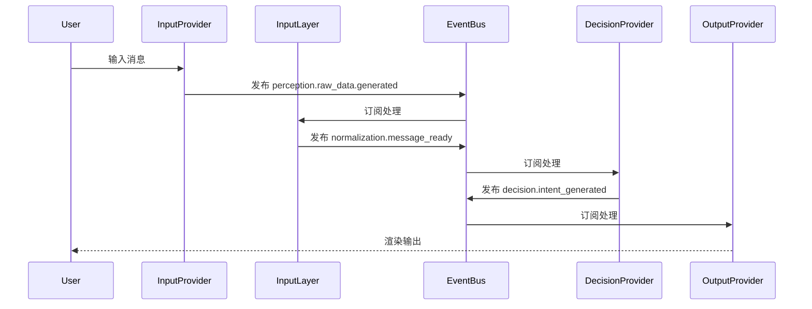
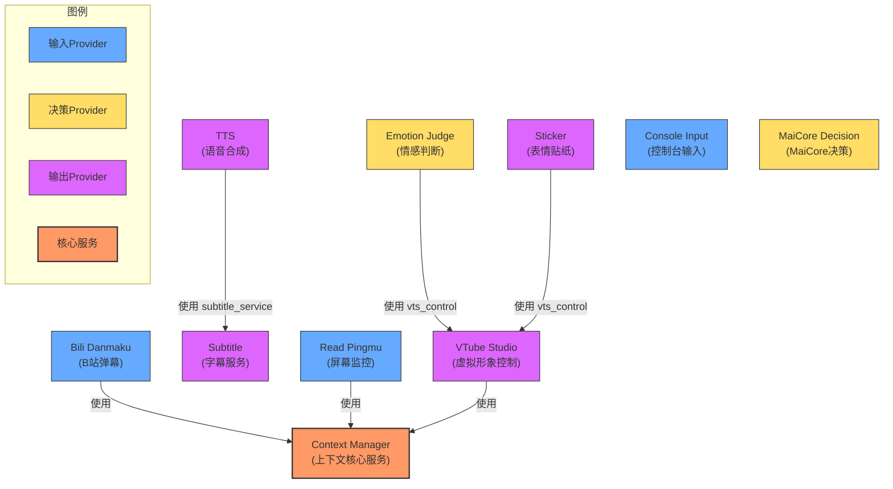

<br />
<div align="center">

# Amaidesu

Amadeus?

Amaidesu!


  
  
  
  
  
  
[](https://deepwiki.com/ChangingSelf/Amaidesu)


## 📝 项目简介


聊天机器人麦麦的[VTubeStudio](https://github.com/DenchiSoft/VTubeStudio) 适配器。
其聊天核心为[麦麦Bot](https://github.com/MaiM-with-u/MaiBot)，一款专注于 群组聊天 的赛博网友 QQ BOT。

**架构状态**：✅ 核心架构重构已完成（2026-02-02），采用3域架构+Provider系统

</div>

## 架构概述

### 3域架构数据流（最新版本）

```
外部输入（弹幕、游戏、语音）
  ↓
【Input Domain】外部数据 → NormalizedMessage
  ├─ InputProvider: 并发采集外部数据
  ├─ Normalization: 标准化为 NormalizedMessage
  └─ Pipelines: 预处理（限流、过滤）
  ↓ EventBus: normalization.message_ready
【Decision Domain】NormalizedMessage → Intent
  ├─ MaiCoreDecisionProvider (默认，WebSocket + LLM意图解析)
  ├─ LocalLLMDecisionProvider (可选，直接LLM)
  └─ RuleEngineDecisionProvider (可选，规则引擎)
  ↓ EventBus: decision.intent_generated
【Output Domain】Intent → 实际输出
  ├─ Parameters: 参数生成（情绪→表情、动作→热键）
  └─ OutputProvider: 并发渲染（TTS、字幕、VTS等）
```

### 核心组件

主要由以下几个核心组件构成：

1. **AmaidesuCore**: 核心模块，负责组件组合（Composition Root）
   - 管理 EventBus、LLMService、PipelineManager、DecisionManager
   - 不再负责数据流处理（已迁移到 FlowCoordinator）

2. **EventBus**: 事件总线，提供发布-订阅机制，用于组件间通信
   - 支持优先级、错误隔离、统计功能
   - 唯一的跨层通信机制

3. **Provider 接口**: 核心抽象，封装具体功能
   - InputProvider: 输入数据采集（如弹幕、控制台输入）
   - DecisionProvider: 决策处理（如 MaiCore、LLM、规则引擎）
   - OutputProvider: 输出渲染（如 TTS、字幕显示、VTS）

4. **ProviderManager**: Provider管理器，统一管理Provider生命周期
   - InputProviderManager: 管理输入Provider
   - DecisionManager: 管理决策Provider，支持运行时切换
   - OutputProviderManager: 管理输出Provider

5. **PipelineManager**: 管道管理器，负责管道的加载和执行
    - TextPipeline: Input Domain 文本预处理（限流、过滤）
    - MessagePipeline: MaiCore 消息处理（inbound/outbound）

6. **ContextManager**: 上下文管理器，负责管理和聚合来自不同Provider的上下文信息

7. **FlowCoordinator**: 数据流协调器，负责 Decision → Rendering 之间的数据流

8. **LLMService**: LLM服务，统一的LLM调用基础设施
   - 管理多个LLM客户端（llm/llm_fast/vlm）
   - 提供统一的调用接口

详见：[架构设计文档](./refactor/design/overview.md)

### Provider系统（替代插件系统）

系统已完成从插件系统到Provider系统的重构：

**新架构特点**：
- Provider由Manager统一管理，配置驱动启用
- 使用 Provider 接口封装具体功能，更好的解耦和可测试性
- 支持事件总线通信，组件间通过发布-订阅模式交互
- 职责边界清晰：Provider = 原子能力

**Provider管理**：
- InputProviderManager: 管理所有输入Provider（console_input, bili_danmaku等）
- DecisionManager: 管理所有决策Provider（maicore, local_llm, rule_engine等）
- OutputProviderManager: 管理所有输出Provider（tts, subtitle, vts等）

### 消息处理时序图



## 安装与运行

### 使用 uv（推荐）

本项目使用 [uv](https://docs.astral.sh/uv/) 作为包管理器，它比 pip 快 10-100 倍。

```bash
# 1. 安装 uv（如果尚未安装）
# Windows (PowerShell)
powershell -ExecutionPolicy ByPass -c "irm https://astral.sh/uv/install.ps1 | iex"

# macOS/Linux
curl -LsSf https://astral.sh/uv/install.sh | sh

# 2. 克隆仓库
git clone https://github.com/ChangingSelf/Amaidesu.git
cd Amaidesu

# 3. 同步依赖（自动创建虚拟环境）
uv sync

# 4. 如果需要语音识别功能，安装额外依赖
uv sync --extra stt

# 5. 配置（首次运行会自动生成配置文件）
uv run python main.py

# 6. 编辑生成的 config.toml 文件，填入必要配置

# 7. 启动在这之前已经部署好的 MaiCore（参见 MaiBot部署教程）

# 8. 再次运行
uv run python main.py
```

### 使用 pip（传统方式）

```bash
# 1. 克隆仓库
git clone https://github.com/ChangingSelf/Amaidesu.git
cd Amaidesu

# 2. 创建虚拟环境
python -m venv .venv
# Windows
.venv\Scripts\activate
# macOS/Linux
source .venv/bin/activate

# 3. 安装依赖
pip install -e .

# 4. 运行（后续步骤同上）
python main.py
```

详见 [MaiBot部署教程](https://docs.mai-mai.org/manual/usage/mmc_q_a) 了解 MaiCore 的部署方法。

## 配置体系重大更新 ⚠️

### 配置格式变更（v1.2.0）

系统已完成从插件系统到Provider架构的重构，**配置文件格式已全面升级**：

#### 新的配置结构
```toml
[providers.input]
enabled = true
enabled_inputs = ["console_input", "bili_danmaku"]

[providers.decision]
enabled = true
active_provider = "maicore"
available_providers = ["maicore", "local_llm"]

[providers.output]
enabled = true
enabled_outputs = ["subtitle", "vts", "tts"]
```

#### 运行与配置

1.  **首次运行与配置生成**:
    - 在首次运行 `uv run python main.py` 之前，请确保根目录下存在 `config-template.toml`。
    - 首次运行会自动检查并根据 `config-template.toml` 创建 `config.toml`。
    - **配置格式**：使用统一的 `[providers.*]` 配置格式管理所有Provider：
      - `[providers.input]` - 输入Provider配置
      - `[providers.decision]` - 决策Provider配置
      - `[providers.output]` - 输出Provider配置
    - **重要**: 自动生成配置文件后，程序会提示并退出。请务必检查生成的 `config.toml` 文件，填入必要的配置信息（如 API 密钥、设备名称、房间号等），然后再重新运行程序。

2.  **旧配置迁移**:
    - 系统会自动检测旧配置格式并自动转换为新的配置格式
    - 如果您有旧配置文件，系统会自动备份并生成新配置
    - 详细迁移说明请查看：[配置变更通知](./docs/CONFIG_CHANGES.md)

3.  **启动程序**:
    - 配置完成后，使用 `uv run python main.py` 启动应用程序。

4.  **命令行参数**:
    - `--debug`: 启用详细的 DEBUG 级别日志输出，方便排查问题。
      ```bash
      uv run python main.py --debug
      ```
    - `--filter <MODULE_NAME> [<MODULE_NAME> ...]`: 过滤日志输出，只显示指定模块的 INFO/DEBUG 级别日志。WARNING 及以上级别的日志总是会显示。可以指定一个或多个模块名。
      ```bash
      # 只显示来自 SubtitleProvider 和 TTSProvider 模块的 INFO/DEBUG 日志 (以及所有模块的 WARN+ 日志)
      uv run python main.py --filter SubtitleProvider TTSProvider

      # 同时启用 DEBUG 并过滤
      uv run python main.py --debug --filter TTSProvider
      ```
      *   模块名通常是 `src/utils/logger.py` 中 `get_logger("模块名")` 使用的名称，可以通过查看日志输出中的模块名来确定。

## 模拟MaiCore

当你不方便部署麦麦时，可以用它启用一个ws服务端和一个控制台输入任务，便于模拟麦麦的回应来测试功能

使用方法：

```bash
uv run python mock_maicore.py
```

现在支持的简单命令：
- sendRandomEmoji: 发送一个随机的表情包（默认在"data/emoji"目录下查找表情包），用于测试VTubeStudio的表情包功能

## 已有Provider

### Provider列表

以下是当前项目中包含的Provider列表。对于有详细说明的Provider，可以直接点击链接查看其 `README.md` 文件。

#### 输入Provider（InputProvider）

- [console_input](./src/domains/input/providers/console_input/README.md) - 控制台输入
- [bili_danmaku](./src/domains/input/providers/bili_danmaku/README.md) - B站弹幕（第三方API）
- [bili_danmaku_official](./src/domains/input/providers/bili_danmaku_official/README.md) - B站弹幕（官方WebSocket）
- [bili_danmaku_official_maicraft](./src/domains/input/providers/bili_danmaku_official_maicraft) - B站弹幕（Maicraft优化版）
- [mainosaba](./src/domains/input/providers/mainosaba/README.md) - Mainosaba输入
- [mock_danmaku](./src/domains/input/providers/mock_danmaku/README.md) - 模拟弹幕（测试用）
- [read_pingmu](./src/domains/input/providers/read_pingmu/README.md) - PingMu读取

#### 决策Provider（DecisionProvider）

- [maicore](./src/domains/decision/providers/maicore) - MaiCore决策（默认，WebSocket + LLM意图解析）
- [local_llm](./src/domains/decision/providers/local_llm) - 本地LLM决策
- [rule_engine](./src/domains/decision/providers/rule_engine) - 规则引擎决策
- [emotion_judge](./src/domains/decision/providers/emotion_judge) - 情绪判断决策
- [mock](./src/domains/decision/providers/mock) - 模拟决策（测试用）

#### 输出Provider（OutputProvider）

- [gptsovits](./src/domains/output/providers/gptsovits/README.md) - GPT-SoVITS TTS
- [omni_tts](./src/domains/output/providers/omni_tts/README.md) - Omni TTS
- [tts](./src/domains/output/providers/tts/README.md) - 通用TTS
- [subtitle](./src/domains/output/providers/subtitle/README.md) - 字幕渲染
- [vts](./src/domains/output/providers/vts/README.md) - VTS虚拟形象
- [avatar](./src/domains/output/providers/avatar/README.md) - Avatar控制
- [sticker](./src/domains/output/providers/sticker/README.md) - 贴图/表情
- [obs_control](./src/domains/output/providers/obs_control/README.md) - OBS控制
- [warudo](./src/domains/output/providers/warudo/README.md) - Warudo控制
- [remote_stream](./src/domains/output/providers/remote_stream/README.md) - 远程流输出
- [mock](./src/domains/output/providers/mock) - 模拟输出（测试用）

### Provider依赖关系

以下图表展示了主要Provider之间的依赖关系：



## Provider开发

### 新Provider开发指南

新Provider应继承对应的Provider基类：

#### 输入Provider开发

```python
# src/domains/input/providers/my_provider/my_provider.py
from typing import AsyncIterator
from src.core.base.input_provider import InputProvider
from src.core.base.raw_data import RawData
from src.utils.logger import get_logger

class MyInputProvider(InputProvider):
    """自定义输入Provider"""

    def __init__(self, config: dict):
        super().__init__(config)
        self.logger = get_logger("MyInputProvider")

    async def _collect_data(self) -> AsyncIterator[RawData]:
        """采集数据"""
        while self.is_running:
            # 采集数据逻辑
            data = await self._fetch_data()
            if data:
                yield RawData(
                    content={"data": data},
                    source="my_provider",
                    data_type="text",
                )
            await self._sleep_if_running(1.0)

    async def _fetch_data(self):
        """实现具体的数据采集逻辑"""
        # ... 实现细节
        pass
```

#### 决策Provider开发

```python
# src/domains/decision/providers/my_provider/my_decision_provider.py
from src.core.base.decision_provider import DecisionProvider
from src.core.base.normalized_message import NormalizedMessage
from src.domains.decision.intent import Intent
from src.utils.logger import get_logger

class MyDecisionProvider(DecisionProvider):
    """自定义决策Provider"""

    def __init__(self, config: dict):
        super().__init__(config)
        self.logger = get_logger("MyDecisionProvider")

    async def decide(self, message: NormalizedMessage) -> Intent:
        """决策逻辑"""
        # 实现决策逻辑
        return Intent(
            type="response",
            content="响应内容",
            parameters={},
        )
```

#### 输出Provider开发

```python
# src/domains/output/providers/my_provider/my_output_provider.py
from src.core.base.output_provider import OutputProvider
from src.core.base.render_parameters import RenderParameters
from src.utils.logger import get_logger

class MyOutputProvider(OutputProvider):
    """自定义输出Provider"""

    def __init__(self, config: dict):
        super().__init__(config)
        self.logger = get_logger("MyOutputProvider")

    async def render(self, parameters: RenderParameters):
        """渲染逻辑"""
        # 实现渲染逻辑
        self.logger.info(f"渲染参数: {parameters}")
```

### Provider注册

在Provider的`__init__.py`中注册到ProviderRegistry：

```python
# src/domains/input/providers/my_provider/__init__.py
from src.domains.output.provider_registry import ProviderRegistry
from .my_provider import MyInputProvider

ProviderRegistry.register_input("my_provider", MyInputProvider, source="builtin:my_provider")
```

### 配置启用

在配置文件中启用Provider：

```toml
# 输入Provider
[providers.input]
enabled_inputs = ["console_input", "my_provider"]

[providers.input.inputs.my_provider]
type = "my_provider"
# Provider特定配置
api_url = "https://api.example.com"

# 决策Provider
[providers.decision]
active_provider = "my_provider"
available_providers = ["maicore", "my_provider"]

[providers.decision.providers.my_provider]
type = "my_provider"
# Provider特定配置

# 输出Provider
[providers.output]
enabled_outputs = ["subtitle", "my_provider"]

[providers.output.outputs.my_provider]
type = "my_provider"
# Provider特定配置
```

详见 [AGENTS.md](./AGENTS.md) 获取完整的Provider开发规范。

## 管道系统

管道系统用于在消息发送到 MaiCore 前进行预处理。管道可以用于实现各种功能，如消息过滤、限流、内容转换等。

### 管道配置方式

管道的启用、优先级以及全局配置覆盖均在根目录的 `config.toml` 文件中进行配置。

#### 基本配置与启用

在根 `config.toml` 文件中，管道的配置位于 `[pipelines]` 表（TOML section）下。每个需要启用和配置的管道都对应一个以其蛇形命名（snake_case）命名的子表。例如，名为 `RateLimitPipeline` 的管道，其配置节为 `[pipelines.rate_limit]`。

要启用一个管道，必须在其对应的配置节中定义 `priority` 项，它是一个整数，数值越小，管道的执行优先级越高。

```toml
# 根目录 config.toml 示例

[pipelines]
  # "rate_limit" 是管道的蛇形名称 (对应 src/domains/input/pipelines/rate_limit/ 目录)
  [pipelines.rate_limit]
  priority = 100  # 必须: 定义此管道的优先级，并启用它
  # 可选: 全局配置覆盖，见下文
  global_rate_limit = 50 # 将覆盖 rate_limit/config.toml 中的 global_rate_limit
  user_rate_limit = 5    # 将覆盖 rate_limit/config.toml 中的 user_rate_limit

  [pipelines.message_logger] # 对应 MessageLoggerPipeline
  priority = 200 # 启用 message_logger，使用其内部默认配置或其自身 config.toml 中的配置

  # 要禁用一个管道，可以注释掉其 priority 行，或整个 [pipelines.pipeline_name_snake] 部分
  # [pipelines.my_experimental_pipeline]
  # # priority = 999 # 此行被注释，所以 my_experimental_pipeline 不会加载
  # some_option = true
```

1.  **命名规则**：管道的目录名和在 `[pipelines]` 下的配置节名使用蛇形命名法（例如 `my_pipeline`）。系统会自动查找名为 `MyPipelinePipeline`（驼峰式 + "Pipeline" 后缀）的类。
2.  **优先级**：`priority` 值越小，优先级越高（越先执行）。
3.  **启用**：只有在根 `config.toml` 的 `[pipelines.pipeline_name_snake]` 中定义了有效的 `priority`，该管道才会被加载和启用。

#### 管道特定配置与全局覆盖

每个管道可以有其自己的配置文件，通常位于其包目录下的 `config.toml`（例如 `src/domains/input/pipelines/rate_limit/config.toml`）。

-   **管道独立配置**：管道在其自身 `config.toml` 文件中定义其特定的配置参数。这个文件可以是一个扁平的键值对集合，或者包含一个与管道蛇形命名同名的表（section）。如果存在同名表，则使用该表的内容作为其独立配置；否则，使用整个文件的内容。
-   **全局覆盖**：在根 `config.toml` 的 `[pipelines.pipeline_name_snake]` 表中，除了 `priority` 之外的其他键值对，将作为全局配置覆盖管道独立配置文件中的同名项。这允许在项目级别集中管理和调整管道行为，而无需修改管道内部的配置文件。

最终生效的配置（合并了管道独立配置和全局覆盖配置）将通过构造函数注入到管道实例的 `config` 属性中。

### 自定义管道开发

要创建自定义管道，需遵循以下步骤：

1.  在 `src/domains/input/pipelines` 目录下创建新的包目录，如 `my_pipeline`。
2.  在包目录中创建 `__init__.py` 文件和 `pipeline.py` 文件。
3.  在 `pipeline.py` 中继承 `MessagePipeline` 基类并实现 `process_message` 方法：

```python
# src/domains/input/pipelines/my_pipeline/pipeline.py
from src.core.pipeline_manager import MessagePipeline
from maim_message import MessageBase
from typing import Optional, Dict, Any

class MyPipelinePipeline(MessagePipeline): # 类名约定：驼峰式 + Pipeline 后缀
    priority = 500  # 类属性的 priority 仅作为文档参考

    def __init__(self, config: Dict[str, Any]):
        super().__init__(config)
        # 初始化管道，可从 self.config 中读取参数
        self.param1 = self.config.get("param1", "default value")
        self.logger.info(f"MyPipelinePipeline initialized with param1='{self.param1}'")

    async def process_message(self, message: MessageBase) -> Optional[MessageBase]:
        # 处理消息的逻辑
        self.logger.debug(f"MyPipelinePipeline processing message")
        # 返回处理后的消息，或返回 None 表示丢弃该消息
        return message
```

4.  在 `__init__.py` 中导出管道类：

```python
# src/domains/input/pipelines/my_pipeline/__init__.py
from .pipeline import MyPipelinePipeline

__all__ = ["MyPipelinePipeline"]
```

5.  （可选）创建管道配置模板文件 `config-template.toml` 和默认配置文件 `config.toml` 于 `src/domains/input/pipelines/my_pipeline/` 目录下。

6.  在主配置文件 `config.toml` 中添加启用配置：

```toml
# 根 config.toml
[pipelines]
  [pipelines.my_pipeline]
  priority = 500
```

### 管道执行流程

1. 系统初始化时，`PipelineManager` 加载所有已启用的管道
2. 管道按优先级排序（数字越小优先级越高）
3. 消息按优先级顺序依次通过各个管道处理
4. 如果任何管道返回 `None`，消息处理终止（消息被丢弃）
5. 最终处理后的消息发送到 MaiCore

## 开发注意事项

### 添加新Provider
1. 在对应域创建Provider文件：`src/domains/{domain}/providers/my_provider/my_provider.py`
2. 继承对应的Provider基类（InputProvider/DecisionProvider/OutputProvider）
3. 在Provider的`__init__.py`中注册到ProviderRegistry
4. 在配置中启用：
   - InputProvider: 添加到 `[providers.input]` 的 `enabled_inputs` 列表
   - OutputProvider: 添加到 `[providers.output]` 的 `enabled_outputs` 列表
   - DecisionProvider: 添加到 `[providers.decision]` 的 `available_providers` 列表

### 事件使用规范
- **使用常量**：优先使用`CoreEvents`常量，避免硬编码字符串
- **核心事件用Pydantic Model**：确保类型安全
- **事件名分层**：使用点分层（如`decision.intent_generated`）

### 日志使用
```python
from src.utils.logger import get_logger

logger = get_logger("MyClassName")  # 使用类名或模块名
logger.info("信息日志")
logger.debug("调试日志", extra_context={"key": "value"})
logger.error("错误日志", exc_info=True)
```

**日志过滤**：使用`--filter`参数时，传入get_logger的第一个参数（类名或模块名）

### 不推荐的做法
- ❌ 不要创建新的Plugin（插件系统已移除）
- ❌ 不要使用服务注册机制，用EventBus
- ❌ 不要硬编码事件名字符串，使用CoreEvents常量
- ❌ 不要直接在main.py中创建Provider，用Manager + 配置驱动

## 架构设计文档

详细的架构设计文档位于`refactor/design/`：
- [架构总览](refactor/design/overview.md) - 3域架构概述
- [决策层设计](refactor/design/decision_layer.md) - 可替换的决策Provider系统
- [多Provider并发设计](refactor/design/multi_provider.md) - 并发处理架构
- [LLM服务设计](refactor/design/llm_service.md) - LLM调用基础设施

## 数据流关键事件

| 事件名 | 触发时机 | 数据格式 |
|--------|---------|---------|
| `perception.raw_data.generated` | InputProvider采集到数据 | `{"data": RawData, "source": str}` |
| `normalization.message_ready` | InputLayer完成标准化 | NormalizedMessage |
| `decision.intent_generated` | DecisionProvider完成决策 | Intent |
| `expression.parameters_generated` | ExpressionGenerator生成参数 | RenderParameters |

## 测试策略

**单元测试**：测试单个Provider或Manager
- 位置：`tests/domains/{domain}/test_*.py`
- 使用Mock隔离外部依赖

**集成测试**：测试多Provider协作
- 位置：`tests/domains/input/test_multi_provider_integration.py`
- 测试数据流完整性

**E2E测试**：测试完整数据流
- 位置：`tests/e2e/`
- 测试从输入到输出的完整流程

## 项目特定约定

- **中文注释**：代码注释和用户界面使用中文
- **配置优先**：所有可配置项都应通过配置文件控制，不硬编码
- **异步优先**：所有IO操作都应使用async/await
- **错误隔离**：单个Provider失败不应影响其他Provider
- **日志分级**：DEBUG用于开发，INFO用于正常运行，WARNING用于可恢复问题，ERROR用于严重问题

## 📚 更多资源

### 配置相关文档
- [配置变更通知](./docs/CONFIG_CHANGES.md) - 详细的配置迁移指南和新功能介绍
- [配置设计提案](./docs/CONFIG_DESIGN_PROPOSAL.md) - 配置体系的设计思路
- [配置统一总结](./docs/CONFIG_UNIFICATION_SUMMARY.md) - 配置统一的详细说明
- [配置升级指南](./docs/CONFIG_UPGRADE_GUIDE.md) - 手动升级配置的详细步骤

## Git工作流

- **主分支**：`main`
- **重构分支**：`refactor`（当前工作分支）
- **提交规范**：使用Conventional Commits格式（feat/fix/docs/refactor等）
