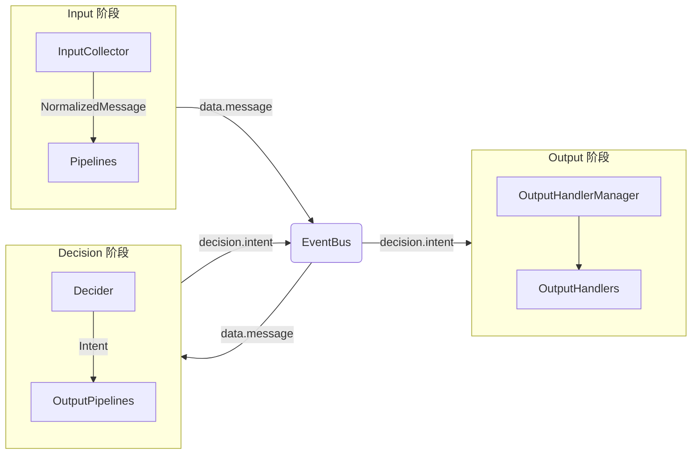

<br />
<div align="center">

# Amaidesu

Amadeus?

Amaidesu!


[](https://deepwiki.com/Mai-with-u/Amaidesu)


## 项目简介

聊天机器人麦麦的 [VTubeStudio](https://github.com/DenchiSoft/VTubeStudio) 适配器。
其聊天核心为 [麦麦Bot](https://github.com/MaiM-with-u/MaiBot)，一款专注于群组聊天的赛博网友 QQ BOT。

**架构状态**：✅ 核心架构重构已完成，采用 3阶段架构 + 阶段参与者系统

如需了解重构前后的架构差异，可查看 [重构文档](refactor/README.md)。

</div>

## 架构概述

### 3阶段架构数据流

> **为什么叫"阶段"(Stage)而不是"层"(Layer)？**
>
> 传统"层"(Layer)代表**不同的抽象层级**，如表现层→业务层→数据层，每层都有不同的抽象级别。而"阶段"(Stage)强调的是**平等的业务边界**划分：
>
> - **层(Layer)**：有高低之分，上层调用下层，下层不知道上层存在
> - **阶段(Stage)**：平等边界，各自包含完整的抽象层次（自己的数据模型、Collector/Decider/Handler、处理逻辑）
>
> 每个阶段都有自己的：
> - **数据模型**：Input → NormalizedMessage → Intent → RenderParameters
> - **核心抽象**：InputCollector / Decider / OutputHandler
> - **处理逻辑**：数据采集 / 决策生成 / 渲染输出
>
> 阶段之间通过 EventBus 进行**松耦合通信**，而非直接的层级调用。这种划分允许各阶段独立演进，例如可以替换决策引擎（从 MaiBot 换成 LLM）而不影响输入输出。


```mermaid
flowchart LR
    subgraph Input["Input 阶段"]
        IP[InputCollector] --> |NormalizedMessage| PIP[Pipelines]
    end

    EB(EventBus)

    subgraph Decision["Decision 阶段"]
        DP[Decider] --> |Intent| OPIP[OutputPipelines]
    end

    subgraph Output["Output 阶段"]
        OPM[OutputHandlerManager] --> OP[OutputHandlers]
    end

    Input --> |data.message| EB
    EB --> |data.message| Decision
    Decision --> |decision.intent| EB
    EB --> |decision.intent| Output
```

**数据流**：
1. **Input 阶段**：外部数据（弹幕、语音、控制台）→ NormalizedMessage → Pipelines 过滤
2. **Decision 阶段**：NormalizedMessage → Intent（MaiBot / LLM / 规则引擎）
3. **Output 阶段**：Intent → 渲染输出（TTS、字幕、VTS、表情等）

### 核心组件

| 组件 | 说明 |
|------|------|
| **EventBus** | 事件总线，跨阶段通信 |
| **阶段参与者** | 功能封装：InputCollector / Decider / OutputHandler |
| **Manager** | 阶段参与者生命周期管理 |
| **Pipeline** | 消息预处理（限流、过滤等） |
| **LLMManager** | LLM 调用统一接口 |
| **AudioStreamChannel** | 音频流专用通道（TTS → VTS） |

### 阶段参与者概览

- **InputCollector (8个)**：控制台、弹幕、语音识别等
- **Decider (4个)**：MaiBot、LLM、Maicraft、回放
- **OutputHandler (12个)**：TTS、字幕、VTS、OBS等

详见 [3阶段架构总览](docs/architecture/overview.md)

## 安装与运行

### 快速开始

```bash
# 1. 安装 uv
powershell -ExecutionPolicy ByPass -c "irm https://astral.sh/uv/install.ps1 | iex"

# 2. 克隆仓库
git clone https://github.com/ChangingSelf/Amaidesu.git
cd Amaidesu

# 3. 同步依赖
uv sync

# 4. 首次运行（自动生成 config/ 目录及默认配置）
uv run python main.py

# 5. 编辑 config/ 目录下的 .toml 文件填入必要配置

# 6. 再次运行
uv run python main.py
```

### 命令行参数

```bash
# 调试模式
uv run python main.py --debug

# 过滤日志（只显示指定模块）
uv run python main.py --filter EdgeTTSHandler SubtitleHandler
```

### Web Dashboard

项目内置 Web 管理界面，有**两种独立运行模式**：

| 端口 | 模式 | 前置条件 | 访问入口 | 适合场景 |
|------|------|---------|---------|---------|
| **60214** | 生产模式 | 需先 `npm run build` 生成 `dashboard/dist/` | http://127.0.0.1:60214 | 最终部署 / 给非开发者使用 |
| **60315** | 开发模式 | 需同时运行后端（端口 60214） | http://localhost:60315 | 前端开发 / 调样式 / HMR 热更新 |

#### 方式一：生产模式（单进程）

```bash
cd dashboard && npm run build   # 首次或前端改动后执行一次
uv run python main.py           # 一条命令搞定：后端 + 静态前端都在 60214
# 浏览器访问 http://127.0.0.1:60214
```

**注意**：未执行 `npm run build` 时，60214 仅提供 API（GET / 返回 JSON），不会显示 WebUI。

#### 方式二：开发模式（双进程）

```bash
# 终端 1：启动后端（提供 API + WebSocket）
uv run python main.py
# → Dashboard 后端运行在 http://127.0.0.1:60214

# 终端 2：启动 Vite 开发服务器（HMR 热更新）
cd dashboard
npm install      # 首次需要
npm run dev      # → Vite 启动在 http://localhost:60315
```

**浏览器访问 http://localhost:60315**（不是 5173、不是 60214）。

**开发模式说明：**
- Vite 自动代理 `/api` 和 `/ws` 请求到后端 60214
- 修改 `dashboard/src/**` 下的 .vue / .ts / .css 文件后浏览器自动热更新（无需刷新）
- 修改 `src/**/*.py`（后端）或 `config/*.toml` 需要重启主程序
- 只跑 `npm run dev` 而不跑 `uv run python main.py` 会因 WebSocket/API 无法连接而无法使用

详见 [快速开始](docs/getting-started.md)

详见 [快速开始](docs/getting-started.md)

## 文档导航

### 新手入门
- [快速开始](docs/getting-started.md) - 环境搭建和基本使用
- [开发规范](docs/development-guide.md) - 代码风格和约定

### 架构理解
- [3阶段架构总览](docs/architecture/overview.md) - 架构详解
- [数据流规则](docs/architecture/data-flow.md) - 数据流约束
- [事件系统](docs/architecture/event-system.md) - EventBus 使用

### 开发指南
- [阶段参与者开发](docs/development/component-guide.md)
- [管道开发](docs/development/pipeline-guide.md)
- [提示词管理](docs/development/prompt-management.md)
- [测试指南](docs/development/testing-guide.md)

## Git 工作流

- **主分支**：`main`
- **提交规范**：使用 Conventional Commits（feat/fix/docs/refactor 等）
