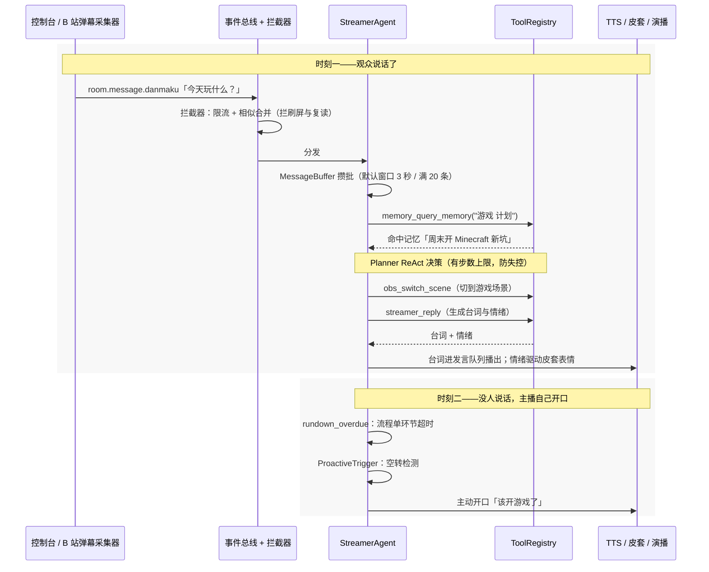
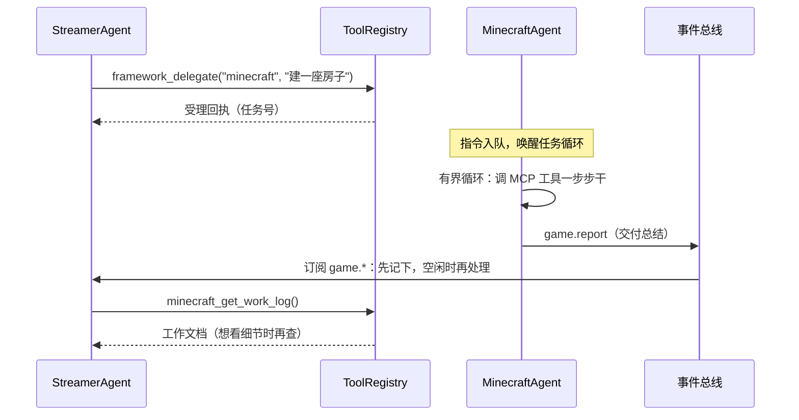

<br />
<div align="center">

# Amaidesu

Amadeus?

Amaidesu!


[](https://deepwiki.com/Mai-with-u/Amaidesu)

</div>

## 项目简介

Amaidesu 是一个 AI 虚拟主播框架：采集直播间弹幕与语音输入，由 LLM Agent 自主判断何时开口、说什么，再驱动 TTS、虚拟形象与演播设备完成表达。项目处于早期开发阶段，能力与行为都在持续变动。

**核心能力**

- **弹幕互动**：B 站弹幕与控制台输入汇入主播 Agent，由 Planner 决策、Replyer 表达，按置信度门槛自主决定是否回复
- **语音合成**：可插拔 TTS 引擎，云端服务与本地推理均可，按配置单选；主播每句回复自动合成播出
- **虚拟形象与演播**：VTube Studio / Warudo / VRChat 皮套控制、OBS 演播控制、字幕窗口
- **屏幕感知**：抓取屏幕（支持多显示器与指定区域）经 VLM 转为文本描述，供决策参考
- **记忆**：SQLite 持久化场次、消息、礼物、醒目留言与流程单；跨场关键词记忆召回并按相关性注入决策上下文
- **直播编排**：Rundown 流程单定义直播环节与节奏，可在 Web Dashboard 中编辑流程单库
- **游戏 Agent**：命令驱动型 Agent，任务完成即停（Minecraft 经 MCP 接入，另有一个文字冒险示例）
- **Web Dashboard**：直播控制台、实时事件流、观众数据、LLM 用量与请求历史、组件启停与健康状态、配置在线编辑

## 架构概述

一句话概括形状：**采集器把外部世界变成事件，事件总线把事件送出去，Agent 订阅事件做决策，工具被 Agent 调用来驱动外部设备。** 存储与基础设施在旁路——一个存状态，一个在装配期被直接注入。

### 直播中的两个时刻

一张时序图，两个时刻：观众说话的时候，和没人说话的时候。


```mermaid
sequenceDiagram
    participant 输入 as 控制台 / B 站弹幕采集器
    participant 总线 as 事件总线 + 拦截器
    participant 主播 as StreamerAgent
    participant 工具 as ToolRegistry
    participant 出口 as TTS / 皮套 / 演播

    rect rgb(248, 248, 248)
    Note over 输入,出口: 时刻一——观众说话了
    输入->>总线: room.message.danmaku「今天玩什么？」
    总线->>总线: 拦截器：限流 + 相似合并（拦刷屏与复读）
    总线->>主播: 分发
    主播->>主播: MessageBuffer 攒批（默认窗口 3 秒 / 满 20 条）
    主播->>工具: memory_query_memory("游戏 计划")
    工具-->>主播: 命中记忆「周末开 Minecraft 新坑」
    Note over 主播,工具: Planner ReAct 决策（有步数上限，防失控）
    主播->>工具: obs_switch_scene（切到游戏场景）
    主播->>工具: streamer_reply（生成台词与情绪）
    工具-->>主播: 台词 + 情绪
    主播->>出口: 台词进发言队列播出；情绪驱动皮套表情
    end
    rect rgb(248, 248, 248)
    Note over 主播,出口: 时刻二——没人说话，主播自己开口
    主播->>主播: rundown_overdue：流程单环节超时
    主播->>主播: ProactiveTrigger：空转检测
    主播->>出口: 主动开口「该开游戏了」
    end
```

时刻一是观众消息的来路：先过拦截器（拦掉刷屏与复读），再攒成一小批统一处理；开口之前主播可以先查记忆、看看游戏里的情况，然后决定这批说不说、怎么说。

时刻二是设计目标所在：没人说话时，主播也要能靠节目单与空转检测继续推进——还是同一个决策循环，输入换成了"此刻节目单走到哪、我是什么人设"。这一目标仍在打磨，实际效果依赖节目单与提示词的质量。

回复产出的是台词与情绪：台词送去合成播出，情绪驱动皮套表情；而要做的事（切场景、换装扮）不打包进回复，在决策循环里直接执行。按设计，加一档直播节目只需改节目单与提示词，不新增代码模块。

### 游戏 Agent：同一类，派活通道不一样

游戏 Agent（Minecraft、文字冒险）与主播的分工不同：主播自己找活干，游戏 Agent 等命令——拿到命令才启动自己的循环、做完即停、空闲时不运行。进展上报到事件总线，主播订阅后当作"游戏里发生了什么"纳入决策；状态从各自暴露的查询工具拿；彼此之间互不依赖。差别在"命令从哪来"：Minecraft 走委派，一整轮是这样跑的：


```mermaid
sequenceDiagram
    participant 主播 as StreamerAgent
    participant 注册表 as ToolRegistry
    participant MC as MinecraftAgent
    participant 总线 as 事件总线

    主播->>注册表: framework_delegate("minecraft", "建一座房子")
    注册表-->>主播: 受理回执（任务号）
    Note over MC: 指令入队，唤醒任务循环
    MC->>MC: 有界循环：调 MCP 工具一步步干
    MC->>总线: game.report（交付总结）
    总线->>主播: 订阅 game.*：先记下，空闲时再处理
    主播->>注册表: minecraft_get_work_log()
    注册表-->>主播: 工作文档（想看细节时再查）
```

文字冒险走另一条通道：不接委派，主播直接调它的专属工具驱动——启停它的观察循环、推进剧情、在选项间做选择；它的观察循环遇到选项屏会上报，等主播来选。

按设计，加一类游戏只需新增一个独立的 Agent 包和一份配置，不需要改框架。

### 工具：一张清单，各拿一份

主播和游戏 Agent 要用的能力——看屏、查记忆、控制皮套与 OBS、接外部 MCP——都做成被动工具：被调才干活，调用即返回结果，失败也是结果而不是异常，一次工具故障不会打断决策循环。所有工具注册进同一张清单，每个 Agent 按可见名单各拿一份，自带的工具只登记给自己；带外部连接的工具自己维护连接、接受健康探活，连续失败自动熔断、从所有工具列表里暂时消失，恢复后自动回来。想接入自己的工具，见[组件开发指南](docs/guides/component.md)。

以上是导览，画得比权威文档粗。架构的来龙去脉见 [v2 架构叙事](docs/architecture/v2-architecture.md)，数据如何流过每个组件见[数据流与边界规则](docs/architecture/data-flow.md)，想自己动手加组件见[组件开发指南](docs/guides/component.md)。

## 安装与运行

### 环境要求

- Python 3.12+，包管理使用 [uv](https://docs.astral.sh/uv/)
- Web Dashboard 的前端构建需要 Node.js + pnpm（不使用 Dashboard 时无需安装）
- Windows / macOS / Linux 均可

### 快速开始

```bash
# 1. 安装 uv（Windows PowerShell）
powershell -ExecutionPolicy ByPass -c "irm https://astral.sh/uv/install.ps1 | iex"
# macOS / Linux
curl -LsSf https://astral.sh/uv/install.sh | sh

# 2. 克隆仓库
git clone https://github.com/Mai-with-u/Amaidesu.git
cd Amaidesu

# 3. 同步依赖
uv sync

# 4. 首次运行：按 Schema 生成 config/ 六文件配置树后主动退出
uv run python main.py

# 5. 编辑 config/model.toml 填入 LLM API Key，在 config/agents.toml 选择要启用的 Agent

# 6. 再次运行
uv run python main.py
```

首次运行不会进入主循环——程序生成配置后打印提示框并主动退出，避免用占位 API Key 空跑产生无意义消耗。配置项说明与首次成功运行的最小必填集见[快速开始](docs/getting-started.md)。

### 命令行参数


| 参数                  | 说明                                                                            |
| ------------------- | ----------------------------------------------------------------------------- |
| `--debug`           | 输出 DEBUG 级别日志                                                                 |
| `--filter <模块名...>` | 只显示指定模块的 INFO/DEBUG 日志（WARNING 及以上始终显示）                                       |
| `--dev-webui`       | 自动启动 Vite 开发服务器（HMR 热更新），并打开 [http://localhost:60315](http://localhost:60315) |
| `--dry`             | 仅验证配置加载与组件构造，不订阅事件、不发起 LLM 调用                                                 |


### Web Dashboard

内置 Web 管理界面，生产模式下前后端同进程：

```bash
cd dashboard && pnpm run build   # 首次或前端改动后构建一次
uv run python main.py           # 后端 + 静态前端都在 60214
```

未构建前端时，60214 仅提供 API、不显示 WebUI。前端开发用 `--dev-webui` 一键起 HMR，或手工双进程（后端 + `cd dashboard && pnpm run dev`，访问 60315）。完整说明见[快速开始 - Web Dashboard](docs/getting-started.md#44-web-dashboard)。

## 文档导航

- [文档索引](docs/README.md)
- [快速开始](docs/getting-started.md)
- [v2 架构叙事](docs/architecture/v2-architecture.md)（理解本项目架构先读这篇）
- [组件开发指南](docs/guides/component.md)
- [开发规范](AGENTS.md)

## 许可证

本项目以 [MIT 许可证](LICENSE) 开源。