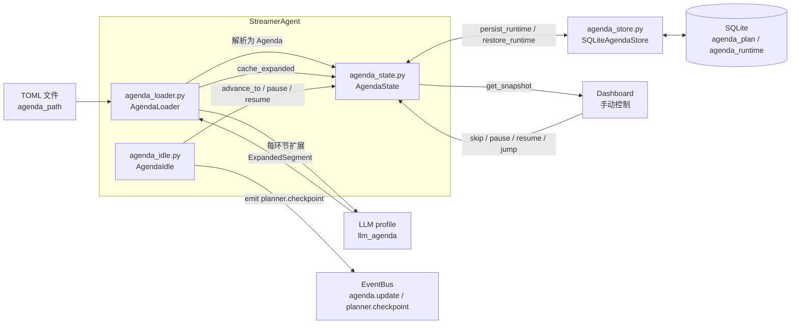

# 节目单编排机制（Agenda Mechanism）

> 本文档是 v2 Agenda 子系统的权威设计说明。
> 节目单给主播 Agent 增加"战略层"，让一场直播按预定义环节自动推进，零观众也能按计划直播，弹幕可打断但保持节目单对齐。
> 事件表、数据流规则等单一事实源不在此重复，见[事件系统](./event-system.md)与[数据流规则](./data-flow.md)。

> **历史沿革**：v1 称"直播大纲 Outline"（`StreamOutline` / `OutlineSegment` / `OutlineBranch`），v2 已整体重命名为 Agenda（`Agenda` / `AgendaSegment` / `AgendaBranch`）。旧文件名 `outline*.py` 已迁移为 `agenda*.py`。下文统一使用 Agenda 表述。

## 模块归属

Agenda 子系统全部位于 `src/agents/streamer/agenda/` 子包（主播 Agent 内部契约，不跨 Agent 共享）：

| 文件 | 职责 |
|------|------|
| `agenda.py` | 数据契约 `Agenda` / `AgendaSegment` / `AgendaBranch` + TOML 解析 `parse_agenda_toml` |
| `agenda_loader.py` | TOML 加载 + 每环节 AI 扩展（独立 profile `llm_agenda`） |
| `agenda_state.py` | 运行时状态机 + Storage 适配（duck-typed `AgendaStore` Protocol） |
| `agenda_idle.py` | 后台空转调度循环 + AI 顺带评估消费 |
| `agenda_store.py` | `SQLiteAgendaStore`，`AgendaStore` 协议的 SQLite 实现 |

模块间关系（mermaid）：



## 数据模型（`agenda.py`）

Pydantic BaseModel，`extra="forbid"`，严格拒绝未知字段。

### `AgendaSegment`

节目单中单个环节：

- `id`：环节唯一标识（节目单内唯一，分支跳转定位用）
- `title`：环节标题，面向人展示
- `task_description`：给 AI 的任务指引，允许自由发挥
- `duration_ms`：默认停留时长（毫秒），`>= 1000`（至少 1 秒）
- `min_duration_ms`：最少停留时长（可选），防御 AI 过早推进
- `key_points`：关键节点列表（可空）
- `branches`：可选分支列表，AI 在环节末尾根据直播情况选择跳转目标

### `AgendaBranch`

环节内分支：

- `branch_id`：在同一环节内唯一
- `description`：给 LLM 的分支触发条件描述
- `target_segment_id`：跳转目标环节的 `id`，必须指向 `segments` 中存在的 id

### `Agenda`

整场节目单：

- `agenda_id`：节目单唯一标识
- `title`：节目单标题
- `segments`：环节列表，非空，每个 `id` 唯一
- `fallback_segment_id`：分支未命中时的回退目标环节 id（可选）

### 跨字段校验（`_validate_integrity`）

1. `segments` 非空
2. `segments[].id` 节目单内唯一
3. 所有 `branches[].target_segment_id` 必须指向 `segments.id` 集合内
4. `fallback_segment_id` 若设置必须指向存在的 id
5. `min_duration_ms` 若设置不得大于 `duration_ms`

便捷方法：`Agenda.get_total_planned_ms()` 累加各环节 `duration_ms`，供 `AgendaState` 计算整场进度百分比。

## TOML 节目单格式

```toml
agenda_id = "live"
title = "通用直播节目单"
fallback_segment_id = "outro"  # 分支未命中时回退

[[segments]]
id = "opening"
title = "开场"
task_description = "欢迎观众，介绍今天主题"  # AI 自由发挥的任务指引
duration_ms = 300000                        # 默认时长（毫秒，ge=1000）
min_duration_ms = 120000                    # 最少停留时长（可选，防御 AI 过早推进）
key_points = ["自我介绍", "今日主题", "近况分享"]

[[segments.branches]]                       # 分支列表（可选）
branch_id = "hot_topic"
description = "观众提到热门话题时跳转"       # 给 LLM 的分支触发条件描述
target_segment_id = "deep_chat"
```

解析走 `parse_agenda_toml(path)`，使用 Python 3.12 内置 `tomllib`（只读无依赖）。校验失败抛 `pydantic.ValidationError`，错误信息含字段名（如 `duration_ms`）。

## 加载器（`agenda_loader.py`）

`AgendaLoader` 提供两类操作：

### TOML 加载

```python
agenda = await loader.load("config/agenda/live.toml")
```

轻量操作，Wave 6 不引入异步 IO。

### 每环节 AI 扩展

```python
expanded = await loader.expand_segment(segment)
```

流程：

1. 渲染 prompt（模板键 `agenda_expand`，内聚于 `src/agents/streamer/prompts/agenda_expand.md`）
2. 调 LLM，**独立 profile `llm_agenda`**（与 Planner/Replyer 隔离连接池）
3. 解析 JSON，三步清理（剥离 markdown 包裹 → 截取首末 `{ }` → 修复尾随逗号）
4. 失败 fallback：`opening_line=""`、`topic_guidance=segment.task_description`、`talking_points=[]`

容错策略：LLM 调用失败 / 脏 JSON / 解析异常 → 1 次重试 → 仍失败则 fallback，绝不抛异常中断环节。

LLM profile 字段读取顺序：`agenda_expand_client`（新命名）→ `outline_expand_client`（向后兼容）→ 默认 `llm_agenda`。

返回 `ExpandedSegment`，包含 `segment_id` / `opening_line` / `topic_guidance` / `talking_points`，缓存到 `AgendaState.expanded_cache[seg_id]` 供 Planner/Replyer 提示词注入。

## 运行时状态机（`agenda_state.py`）

`AgendaState` 是节目单运行时状态机，**只**回答"当前节目单跑到哪了、整场进度几分之几、能不能暂停/跳转/回退"，不实现调度循环、不调用 LLM、不订阅 EventBus。

### 状态机

```text
INACTIVE ──start()──▶ RUNNING ──skip()到末段──▶ COMPLETED ──unload()──▶ UNLOADED
                    │  ◀──rewind()──┘
                    ├─pause()──▶ PAUSED（status 仍为 RUNNING）──resume()──▶ RUNNING
                    │
                    └─unload()──▶ UNLOADED
```

- `INACTIVE`：未激活（初始 / 卸载后未启动）
- `LOADING`：加载中（保留位，由调用方在 `start()` 前置位）
- `RUNNING`：运行中（含 PAUSED 子状态，`is_paused=True` 标志位）
- `COMPLETED`：已完成（最后一段走完，`current_segment_id=None`）
- `UNLOADED`：已卸载（清除锚点，等下一次 `start()`）

### 转移语义

| 方法 | 来源 | 副作用 |
|------|------|--------|
| `start(agenda, *, now_ms=None)` | StreamerAgent.setup() | 重置运行时，置 RUNNING，整场锚点 `agenda_started_at_ms` 记录 |
| `pause(*, now_ms=None)` | Dashboard / StreamerAgent | 冻结 segment 时间，记录 `_paused_at_ms` |
| `resume(*, now_ms=None)` | Dashboard / StreamerAgent | 把暂停时长累加到 `paused_elapsed_ms`，清 `_paused_at_ms` |
| `skip(*, now_ms=None)` | Dashboard 手动 | 跳到下一段；末尾标记 COMPLETED；置 `_manually_overridden=True` |
| `rewind(*, now_ms=None)` | Dashboard 手动 | 回退到上一段；置 `_manually_overridden=True` |
| `jump_to(seg_id, *, now_ms=None)` | Dashboard 手动 | 跳到任意环节（不限方向），**不**把当前环节标记为完成 |
| `advance_to(seg_id, *, now_ms=None)` | 调度器自动路径 | 与 `jump_to` 区别：**不**设置手动覆盖标志，自动推进成功后调度器据此清零 |
| `unload(*, now_ms=None)` | StreamerAgent.cleanup() | 状态置 UNLOADED，清除锚点 |

### 整场时间轴

- 锚点 `agenda_started_at_ms` 在 `start()` 时记录，`unload()` 时清除
- `get_elapsed_live_ms()` = `now - agenda_started_at_ms`（**不**扣除暂停时长，与原 OutlineState 一致）
- `get_total_planned_ms()` = 委托 `agenda.get_total_planned_ms()`
- `get_progress_percent()` 夹取到 `[0.0, 100.0]`

### 暂停语义

`pause()` 时记录 `_paused_at_ms` 冻结 segment 时间，`resume()` 时把暂停时长累加到 `paused_elapsed_ms`。Segment 维度的"剩余时长"在暂停期间保持不变（不依赖 wall clock 推进），由 `get_current_segment_remaining_ms()` 暴露。

### 推进历史

`_transitions` 是 `deque(maxlen=50)`，记录最近 50 条状态机转移（event / segment_id / reason / timestamp_ms）。Dashboard 节目单调试页用于展示"为什么跳到这里 / 上一段停留多久"。

### 扩展内容查询

- `needs_expansion(seg_id)` / `get_expanded(seg_id)` / `cache_expanded(expanded)`：agenda_loader 通过这三个接口写入/读取 `expanded_cache`
- `manually_overridden` 属性：手动操作后调度器据此跳过下一次自动推进

### Storage 适配（duck-typed）

`AgendaState` 不直接访问 SQLite，通过 duck-typed `AgendaStore` Protocol 与 `SQLiteAgendaStore` 交互：

| 方法 | 用途 |
|------|------|
| `persist_runtime()` | 把当前 `completed_segment_ids` / `current_segment_id` 写回 `agenda_runtime` 表 |
| `restore_runtime(agenda)` | 从 `agenda_runtime` 表恢复状态机 |

注：`load_agenda_plan()` 在 `SQLiteAgendaStore` 中保留接口但返回 `None`，原始大纲走 TOML 解析，不入 SQLite。

## 空转调度循环（`agenda_idle.py`）

`AgendaIdle` 是后台 asyncio.Task，**只**回答"按既定节奏推进节目单"，不实现状态机、不调用 LLM、不订阅 EventBus、不直接 emit 事件。

### 生命周期

- `start()` 创建后台 Task，`_loop()` 周期调用 `_tick()`
- `stop()` 取消 Task（仿 `RoomStateLoop` 范式）
- 注入依赖：`config` / `state`（`AgendaState`）/ `loader`（可选 `AgendaLoader`）/ `on_advance` 回调（`(new_seg_id, reason)`）
- `attach_event_bus(event_bus)` 在 StreamerAgent 装配时调用，用于 emit `planner.checkpoint`

### 配置字段

- `agenda_scheduler_tick_ms`（默认 1000）：tick 间隔
- `agenda_advance_eval_enabled`（默认 True）：是否消费 Planner AI 评估

### tick 主流程

1. 检查状态（`status` 不在 `running/completed` → return）
2. 若 `state.needs_expansion(current_id)` 且未在 `_pending_expansions`：启动 `loader.expand_segment` 后台任务，完成后 `cache_expanded()`
3. 检查空转条件：`_is_idle()` 为真 → `emit planner.checkpoint`
4. 读取 `get_current_segment_elapsed_ms(now_ms=ts)` 与 `seg.duration_ms`
5. 检查 `manually_overridden`：置位 → 清零并 return
6. `elapsed < duration_ms` 或未达 `min_duration_ms` → return
7. 满足 → `_advance(current_id, _REASON_TIME)`

### AI 顺带评估消费（`note_plan_assessment`）

StreamerAgent 每轮决策后调此方法灌入 Planner 评估字段：

| Planner 字段 | 行为 |
|--------------|------|
| `need_more_time=True` | 延长当前段 duration 一次（重计时），记录 `_extended_extra_ms` |
| `may_advance=True` 且已达 `min_duration_ms` | 推进到下一段，触发 `on_advance` 回调（reason=`agenda:assessment`） |
| `branch_id` 命中 | 跳转到分支目标段；分支目标不存在 → fallback 到 `agenda.fallback_segment_id` → 无则顺序下一段（reason=`agenda:branch`） |

### 推进路径与回调

调度器**不**直接 emit 事件。`_advance()` / `note_plan_assessment()` 在状态变更后调 `on_advance(new_seg_id, reason)` 回调，由 StreamerAgent 走正常决策链触发一次 proactive 发言。

### 空转检查

`_is_idle()` 是 `status=="running" and current_segment_id is not None`，Wave 6 简化版仅条件 ④（Planner 自身维护其他三条件）。全过 → `emit planner.checkpoint`。

### `note_plan_assessment` 失败兜底

LLM 调用失败 / 解析异常 → 1 次重试 → fallback 字段，绝不抛异常中断环节。

## 持久化（`agenda_store.py` + storage schema）

### 存储表（`src/modules/storage/schema.py`）

`agenda_plan` 表：原始节目单基准，只读。

```sql
CREATE TABLE IF NOT EXISTS agenda_plan (
    id               INTEGER PRIMARY KEY AUTOINCREMENT,
    live_session_id  INTEGER NOT NULL,
    label            TEXT NOT NULL,
    "order"          INTEGER NOT NULL,
    starts_at_ms     INTEGER NOT NULL,
    expected_ms      INTEGER NOT NULL,
    note             TEXT,
    created_by       TEXT NOT NULL
);
```

`agenda_runtime` 表：运行进度，Agent 改。

```sql
CREATE TABLE IF NOT EXISTS agenda_runtime (
    id               INTEGER PRIMARY KEY AUTOINCREMENT,
    live_session_id  INTEGER NOT NULL,
    plan_id          INTEGER,
    label            TEXT NOT NULL,
    "order"          INTEGER NOT NULL,
    starts_at_ms     INTEGER NOT NULL,
    expected_ms      INTEGER NOT NULL,
    done             INTEGER NOT NULL DEFAULT 0,
    current          INTEGER NOT NULL DEFAULT 0,
    note             TEXT,
    inserted_by      TEXT NOT NULL
);
```

注：Wave 6 `SQLiteAgendaStore` 把 `Agenda.agenda_id` 映射到 `agenda_runtime.live_session_id`（约定沿用，避免引入新列）；后续可扩展独立的 agenda_id 列。

### `SQLiteAgendaStore` CRUD

| 方法 | 用途 |
|------|------|
| `load_agenda_plan(agenda_id)` | Wave 6 不实现（原始大纲走 TOML 解析），返回 `None` |
| `dump_agenda_runtime(agenda_id)` | 按 `order` 排序返回 runtime 行列表 |
| `save_agenda_runtime(rows)` | 覆盖式写入（先删后插，事务） |
| `append_agenda_runtime(rows)` | 追加新行（`INSERT OR REPLACE`） |
| `delete_agenda_runtime(agenda_id)` | 删除该 `agenda_id` 的全部 runtime 行 |

所有操作走 `SQLiteStore.execute()` / `execute_fetchone()`（线程安全 + async 友好）。

## 相关事件

### `agenda.update` / `AgendaPayload`

AgendaItem 变更事件。Payload 定义在 `src/modules/events/payloads/agenda.py`：

- `live_session_id`：场次 ID
- `action`：`done`（打勾完成）/ `schedule`（改时间表）/ `insert`（插入新条目）
- `item`：变更涉及的 `AgendaItem`（含 `plan_id` / `order` / `label` / `starts_at_ms` / `expected_ms` / `note` / `done` / `current` / `inserted_by`）
- `changed_at_ms`：变更时刻（Unix 毫秒）

发布者：Planner（调 `update_agenda_item` 工具后）→ 存储更新后发出。订阅者：空转探测器、观察器。

注：当前 Planner 工具链尚未完整接通 `agenda.update` 的 emit 路径（Wave 6 落库中），事件契约已锁定在 `AgendaPayload`，订阅方应按契约消费。

### `planner.checkpoint` / `CheckpointPayload`

空转检查点事件，纯提醒零决策。Payload 定义在 `src/modules/events/payloads/planner.py`：

- `timestamp_ms`：检查点发布时间（Unix 毫秒）
- `agenda_item`：`CheckpointAgendaPosition`（`active` / `next` / `expected_ms` 三元组）
- `timeline_summary`：时序摘要（人类可读）
- `duration_ms`：本检查点时间窗（毫秒）

发布者：`AgendaIdle._emit_checkpoint()`。订阅者：Planner（安静时问一句）、观察器。

## 混合推进机制

| 机制 | 触发 | 说明 |
|------|------|------|
| **时间驱动** | 环节 `duration_ms` 到期 | 零观众也能自动推进（`AgendaIdle._tick`） |
| **AI 顺带评估** | Planner 每次决策顺带输出 | `may_advance` / `need_more_time` / `branch_id`（零额外 LLM 调用成本） |

AI 评估字段由 `AgendaIdle.note_plan_assessment()` 消费：

- `need_more_time=True` 且未达硬超时 → 延长当前段 duration 一次（重新计时）
- `may_advance=True` 且已达 `min_duration_ms` → 推进到下一段
- `branch_id` 命中 → 跳转到分支目标段；分支目标不存在 → fallback 到 `fallback_segment_id`（无则顺序下一段）

## 与外部组件关系

| 组件 | 关系 |
|------|------|
| `StreamerAgent` | 装配者：构造 `AgendaLoader` + `AgendaState` + `AgendaIdle`，注入 `on_advance` 回调；每轮决策后调 `idle.note_plan_assessment()`；`cleanup()` 调 `idle.stop()` |
| `RoomState` | 弹幕态势（战术层），与节目单（战略层）正交，二者解耦 |
| `Planner` | 消费 `state.expanded_cache[seg_id]` 取扩展内容注入提示词；调 `note_plan_assessment()` 灌入 AI 评估 |
| `Replyer` | 同样消费 `state.expanded_cache`；回复始终挂在当前环节上下文上 |
| `Dashboard` | 只读 `state.get_snapshot()` 展示整场进度条 + 环节卡片；调 `skip()` / `pause()` / `resume()` / `rewind()` / `jump_to()` 实现手动控制按钮 |

## 配置入口

节目单配置在 StreamerAgent 的子段（`config/agents.toml` 的 `[agents.streamer]`）：

| 字段 | 默认 | 说明 |
|------|------|------|
| `agenda_enabled` | `false` | Agenda 总开关（默认关闭，显式开启） |
| `agenda_path` | `""` | Agenda TOML 文件路径（绝对路径或相对 `BASE_DIR`） |
| `agenda_auto_start` | `true` | setup 时自动加载并启动 Agenda |
| `agenda_expand_client` | `llm_agenda` | AI 扩展用 profile（独立连接池） |
| `agenda_scheduler_tick_ms` | `1000` | 调度循环 tick 间隔（毫秒） |
| `agenda_advance_eval_enabled` | `true` | Planner 顺带评估开关 |

**向后兼容**：仍可读取旧字段 `outline_enabled` / `outline_path` / `outline_auto_start` / `outline_expand_client`（由 `agenda_loader.py` / `streamer_agent.py` 同步支持）。新增配置文件推荐使用 `agenda_*` 命名。

AI 扩展提示词模板路径：`src/agents/streamer/prompts/agenda_expand.md`（frontmatter `name: agenda_expand`），由 PromptManager 按 `src/**/prompts/` 约定自动发现。

启用 StreamerAgent 主播 Agent（`config/agents.toml`）：

```toml
[agents]
enabled = ["streamer"]

[agents.streamer]
agenda_enabled = true
agenda_path = "config/agenda/live.toml"
agenda_auto_start = true
agenda_expand_client = "llm_agenda"
agenda_scheduler_tick_ms = 1000
agenda_advance_eval_enabled = true
```

`llm_agenda` profile 需在 `config/model.toml` 单独配置（仿 `llm_summary` 先例），与其他 profile 隔离连接池：

```toml
[llm_agenda]
provider = "<provider_name>"
model = "<model_name>"
temperature = 0.7
```

## 架构约束

- Agenda 子系统全部位于 `src/agents/streamer/agenda/` 子包（主播 Agent 内部契约），不跨 Agent 共享
- 不新增事件类型，复用 `agenda.update` / `planner.checkpoint` 语义域事件（事件表权威定义见[事件系统](./event-system.md)）
- `AgendaIdle` 不直接 emit 业务事件，通过 `on_advance` 回调通知 Agent 走正常决策链
- 不订阅 Output 事件（数据流红线，见[数据流规则](./data-flow.md)）
- 持久化失败隔离：`persist_runtime()` 异常被吞掉，返回 False，不影响 Agent 继续运行

---

*最后更新：2026-09-04（streamer 包子包化重组：Agenda 子系统收拢 `src/agents/streamer/agenda/` 子包，§模块归属与 §架构约束路径同步更新）*