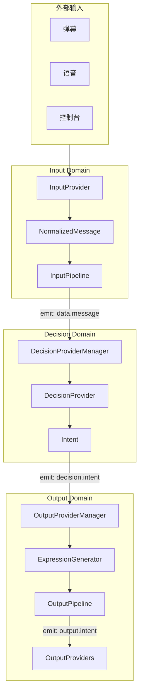
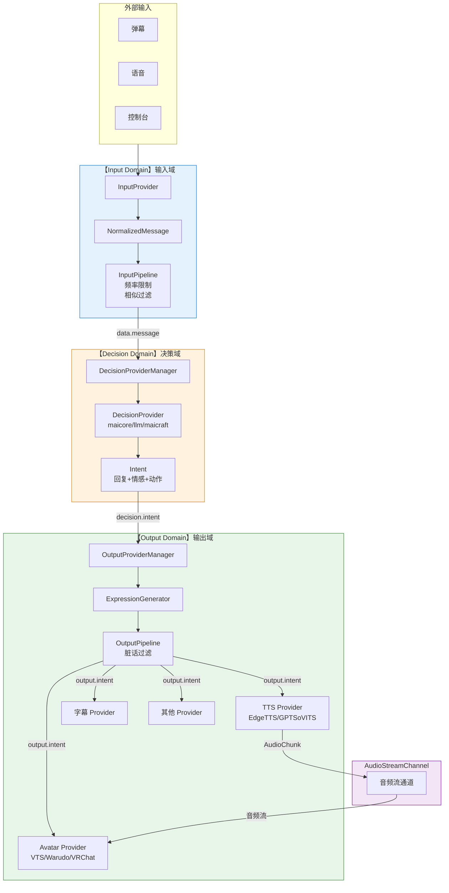
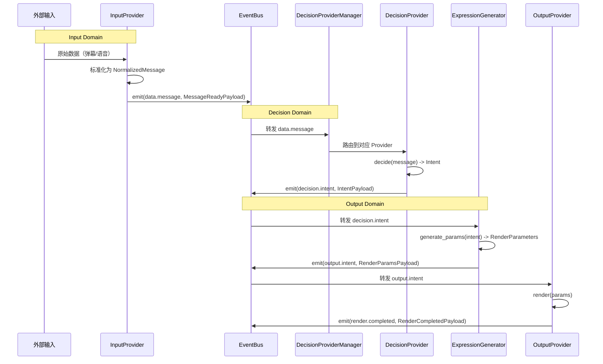
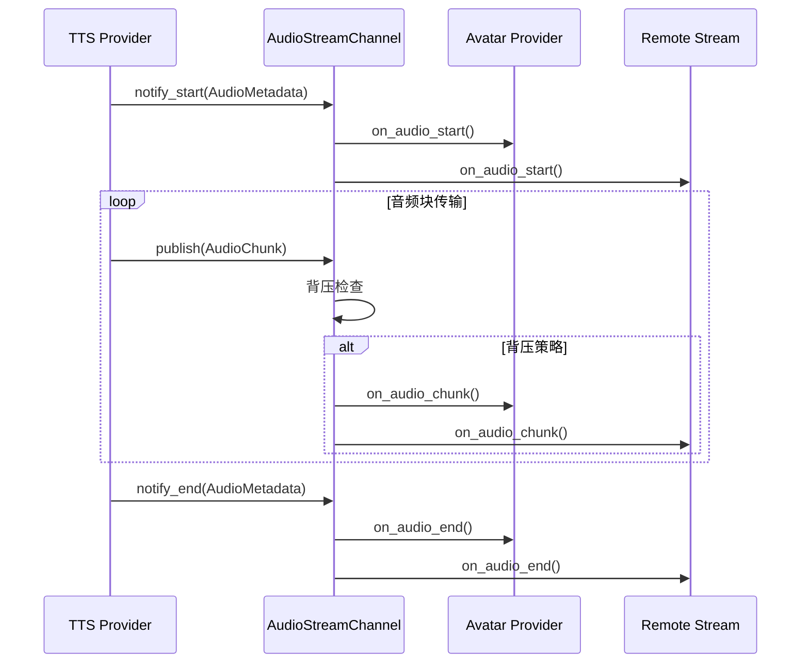
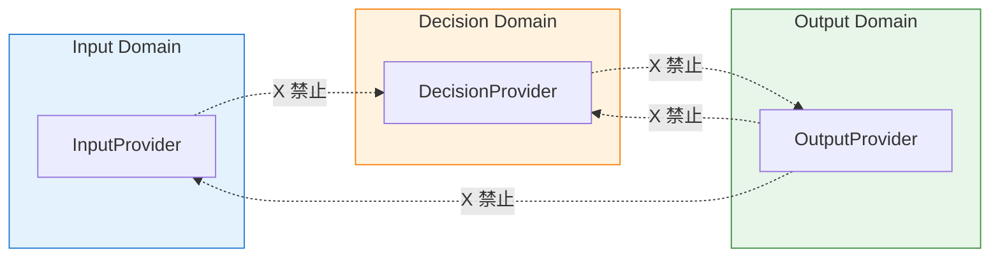

# 数据流规则

本文档定义了 Amaidesu 项目的数据流约束规则，确保 3 域架构的完整性和可维护性。

## 目录

- [单向数据流原则](#1-单向数据流原则)
- [禁止模式](#2-禁止模式)
- [事件流向](#3-事件流向)
- [AudioStreamChannel 与 EventBus 的区别](#4-audiostreamchannel-与-eventbus-的区别)
- [共享类型设计](#5-共享类型设计)
- [Mermaid 数据流图](#6-mermaid-数据流图)

---

## 1. 单向数据流原则

**严格遵守单向数据流：Input Domain -> Decision Domain -> Output Domain**

Amaidesu 项目采用 3 域架构（Three-Domain Architecture），数据在各个域之间按照固定方向流动：

```
外部输入（弹幕、语音、控制台）
        ↓
【Input Domain】数据采集 → 标准化 → Pipeline 过滤
        ↓ EventBus: data.message
【Decision Domain】处理消息 → 生成 Intent
        ↓ EventBus: decision.intent
【Output Domain】参数生成 → Pipeline 过滤 → 渲染输出
```

### 数据类型流

| 阶段 | 数据类型 | 所在域 | 说明 |
|------|---------|--------|------|
| 输入 | `RawData` | Input | 原始数据（弹幕、语音等） |
| 标准化 | `NormalizedMessage` | Input | 标准化消息 |
| 决策 | `Intent` | Decision | 决策意图 |
| 渲染 | `RenderParameters` | Output | 渲染参数 |
| 输出 | 实际输出 | Output | TTS 音频、字幕、动作等 |

---

## 2. 禁止模式

| 禁止模式 | 说明 | 违规原因 |
|---------|------|---------|
| Output Provider 订阅 Input 事件 | `data.message` | 绕过 Decision Domain，破坏分层架构 |
| Decision Provider 订阅 Output 事件 | `render.completed` 等 | 创建循环依赖，破坏单向流 |
| Input Provider 订阅 Decision/Output 事件 | `decision.intent` 等 | Input 应只发布，不订阅下游 |

### 详细说明

#### 为什么禁止 Output Provider 订阅 Input 事件？

Output Provider 如果直接订阅 `data.message` 事件，会绕过 Decision Domain，导致：
- 未经决策的原始数据直接输出
- 破坏了 3 域架构的分层原则
- 无法保证输出的可控性和安全性

#### 为什么禁止 Decision Provider 订阅 Output 事件？

Decision Provider 订阅 Output 事件会创建循环依赖：
- Decision 依赖 Output 的状态来做出决策
- 形成循环，打破单向数据流
- 增加系统复杂度和调试难度

#### 为什么 Input Provider 不应订阅下游事件？

Input Provider 的职责是采集和发布数据：
- 应该是数据的生产者，不应该是消费者
- 订阅下游事件会改变其角色定位
- 违反单一职责原则

### 违规示例

```python
# 错误示例：Output Provider 订阅 Input 事件
class MyOutputProvider(OutputProvider):
    async def _setup_internal(self):
        # 违规：不应该订阅 data.message
        self._event_bus.on(
            CoreEvents.DATA_MESSAGE,
            self._handle_raw_message,  # 直接处理原始消息
            model_class=MessageReadyPayload,
        )

# 正确示例：通过 Decision Domain 处理
class MyOutputProvider(OutputProvider):
    async def _setup_internal(self):
        # 正确：订阅 decision.intent
        self._event_bus.on(
            CoreEvents.DECISION_INTENT,
            self._handle_intent,
            model_class=IntentPayload,
        )
```

---

## 3. 事件流向

### 核心事件

| 事件名 | 发布者 | 订阅者 | 数据类型 | 说明 |
|--------|--------|--------|---------|------|
| `data.message` | InputProvider | DecisionProviderManager | `NormalizedMessage` | 标准化消息就绪 |
| `decision.intent` | DecisionProvider | OutputProviderManager | `Intent` | 决策意图生成 |
| `output.intent` | ExpressionGenerator | OutputProviders | `RenderParameters` | 过滤后的渲染参数 |
| `render.completed` | OutputProviders | - | `RenderCompletedPayload` | 渲染完成通知 |

### 完整事件流



### Provider 生命周期中的事件发布

#### InputProvider

```python
class MyInputProvider(InputProvider):
    async def start(self):
        """启动数据采集"""
        async for raw_data in self._fetch_data():
            # 标准化为 NormalizedMessage
            message = NormalizedMessage(
                text=raw_data.text,
                source=self.provider_name,
                data_type=raw_data.type,
            )
            # 发布到 EventBus
            await self._event_bus.emit(
                CoreEvents.DATA_MESSAGE,
                MessageReadyPayload(message=message.model_dump()),
                source=self.provider_name
            )
```

#### DecisionProvider

```python
class MyDecisionProvider(DecisionProvider):
    async def _setup_internal(self):
        # 订阅标准化消息
        self._event_bus.on(
            CoreEvents.DATA_MESSAGE,
            self._handle_message,
            model_class=MessageReadyPayload,
        )

    async def _handle_message(self, event_name: str, data: MessageReadyPayload, source: str):
        # 处理消息，生成 Intent
        intent = await self.decide(data.message)

        # 发布决策意图
        await self._event_bus.emit(
            CoreEvents.DECISION_INTENT,
            IntentPayload.from_intent(intent, provider=self.provider_name),
            source=self.provider_name
        )
```

#### OutputProvider

```python
class MyOutputProvider(OutputProvider):
    async def _setup_internal(self):
        # 订阅渲染参数
        self._event_bus.on(
            CoreEvents.OUTPUT_INTENT,
            self._handle_params,
            model_class=RenderParamsPayload,
        )

    async def _handle_params(self, event_name: str, data: RenderParamsPayload, source: str):
        # 渲染输出
        await self.render(data.params)

        # 发布完成事件
        await self._event_bus.emit(
            CoreEvents.RENDER_COMPLETED,
            RenderCompletedPayload(
                provider=self.provider_name,
                duration_ms=elapsed,
            ),
            source=self.provider_name
        )
```

---

## 4. AudioStreamChannel 与 EventBus 的区别

Amaidesu 项目使用两种不同的通信机制来处理不同类型的数据：

### 对比表

| 特性 | EventBus | AudioStreamChannel |
|------|----------|-------------------|
| **用途** | 元数据事件 | 音频数据流 |
| **数据传输** | 小型 JSON/Pydantic 对象 | 大型二进制音频块 |
| **传输方式** | 发布-订阅 | 回调注册 + 队列 |
| **背压控制** | 无（EventBus 级别） | 有（SubscriberConfig） |
| **典型场景** | 消息通知、状态变更 | TTS 音频流、Avatar 驱动 |
| **阻塞行为** | 异步非阻塞 | 可配置阻塞策略 |

### EventBus 适用场景

- `data.message`：标准化消息就绪
- `decision.intent`：决策意图生成
- `render.completed`：渲染完成通知
- `core.startup` / `core.shutdown`：系统生命周期事件

### AudioStreamChannel 适用场景

- TTS 音频块传输
- Avatar 口型同步驱动
- 远程流媒体传输

### 使用示例

#### EventBus 发布元数据事件

```python
# TTS 开始时发布元数据事件
await self._event_bus.emit(
    CoreEvents.RENDER_STARTED,
    RenderStartedPayload(
        provider=self.provider_name,
        text=text,
    ),
    source=self.provider_name
)
```

#### AudioStreamChannel 发布音频数据

```python
# TTS Provider 发布音频块
async def _generate_audio(self, text: str):
    # 通知开始
    await self.audio_stream_channel.notify_start(
        AudioMetadata(text=text, sample_rate=24000)
    )

    # 发布音频块
    for chunk in self._tts_engine.generate(text):
        await self.audio_stream_channel.publish(
            AudioChunk(
                data=chunk.audio_bytes,
                sample_rate=chunk.sample_rate,
                channels=chunk.channels,
            )
        )

    # 通知结束
    await self.audio_stream_channel.notify_end(
        AudioMetadata(text=text, sample_rate=24000)
    )
```

#### Avatar Provider 订阅音频流

```python
# Avatar Provider 订阅音频流
await self.audio_stream_channel.subscribe(
    name="avatar_provider",
    on_audio_start=self._on_audio_start,
    on_audio_chunk=self._on_audio_chunk,
    on_audio_end=self._on_audio_end,
    config=SubscriberConfig(
        queue_size=100,
        backpressure_strategy=BackpressureStrategy.DROP_NEWEST,
    ),
)

async def _on_audio_chunk(self, chunk: AudioChunk):
    # 重采样到目标采样率
    resampled = resample_audio(
        chunk.data,
        chunk.sample_rate,
        self.target_sample_rate
    )
    # 处理音频（口型同步等）
    await self._update_lipsync(resampled)
```

### 背压策略

AudioStreamChannel 支持多种背压策略：

| 策略 | 说明 | 适用场景 |
|------|------|---------|
| `BLOCK` | 队列满时阻塞等待 | 需要确保所有音频不丢失 |
| `DROP_NEWEST` | 丢弃最新数据（默认） | 不阻塞 TTS，最新音频更重要 |
| `DROP_OLDEST` | 替换最旧数据 | 历史音频不重要 |
| `FAIL_FAST` | 队列满时抛出异常 | 需要显式处理背压 |

---

## 5. 共享类型设计

### 为什么放在 src/modules/types/ 中？

以下类型被 Input/Decision/Output 多个 Domain 共享，如果放在任何一个 Domain 中，会导致其他 Domain 依赖它，造成循环依赖。放在 Modules 层可以避免这个问题。

### 共享类型列表

| 类型 | 用途 | 定义位置 |
|------|------|---------|
| `EmotionType` | 情感类型枚举 | `src/modules/types/intent.py` |
| `ActionType` | 动作类型枚举 | `src/modules/types/intent.py` |
| `IntentAction` | 意图动作模型 | `src/modules/types/intent.py` |
| `Intent` | 完整决策意图类 | `src/modules/types/intent.py` |
| `SourceContext` | 输入源上下文 | `src/modules/types/intent.py` |

### 类型定义

#### EmotionType（情感类型枚举）

```python
class EmotionType(str, Enum):
    """情感类型枚举"""

    NEUTRAL = "neutral"      # 中性
    HAPPY = "happy"        # 开心
    SAD = "sad"            # 悲伤
    ANGRY = "angry"        # 生气
    SURPRISED = "surprised" # 惊讶
    LOVE = "love"          # 喜爱
    SHY = "shy"            # 害羞
    EXCITED = "excited"    # 兴奋
    CONFUSED = "confused"  # 困惑
    SCARED = "scared"      # 害怕
```

#### ActionType（动作类型枚举）

```python
class ActionType(str, Enum):
    """动作类型枚举"""

    EXPRESSION = "expression"  # 表情
    HOTKEY = "hotkey"          # 热键
    EMOJI = "emoji"           # Emoji 表情
    BLINK = "blink"           # 眨眼
    NOD = "nod"               # 点头
    SHAKE = "shake"           # 摇头
    WAVE = "wave"             # 挥手
    CLAP = "clap"             # 鼓掌
    STICKER = "sticker"       # 贴图
    MOTION = "motion"         # 动作
    CUSTOM = "custom"         # 自定义
    GAME_ACTION = "game_action" # 游戏动作
    NONE = "none"             # 无动作
```

#### Intent（决策意图）

```python
class Intent(BaseModel):
    """决策意图 - Decision Domain 的核心输出"""

    id: str                           # 唯一标识符
    source_context: Optional[SourceContext]  # 输入源上下文
    original_text: str                # 原始输入文本
    response_text: str                # AI 回复文本
    emotion: EmotionType              # 情感类型
    actions: List[IntentAction]       # 动作列表
    metadata: Dict[str, Any]          # 元数据
    timestamp: float                  # 时间戳
```

### 如何添加新的共享类型

1. **评估必要性**：确认类型是否真的需要跨多个 Domain 使用
2. **选择位置**：如果是多个 Domain 共享，添加到 `src/modules/types/` 中的合适文件
3. **更新导入**：更新相关 Domain 的导入语句
4. **运行验证**：运行架构测试验证无循环依赖

```python
# 错误示例：放在 Domain 层会导致循环依赖
# src/domains/input/types.py -> 导入 Decision 的 Intent
# src/domains/decision/types.py -> 导入 Input 的类型

# 正确示例：放在 Modules 层
# src/modules/types/intent.py -> 所有 Domain 都可以导入
```

---

## 6. Mermaid 数据流图

### 完整数据流图



### 事件时序图



### AudioStreamChannel 数据流



### 禁止的跨域订阅



---

## 相关文档

- [3域架构总览](overview.md) - 3域架构详解
- [事件系统](event-system.md) - EventBus 使用指南
- [Provider 开发](../development/provider-guide.md) - Provider 开发详解

---

*最后更新：2026-02-15*
