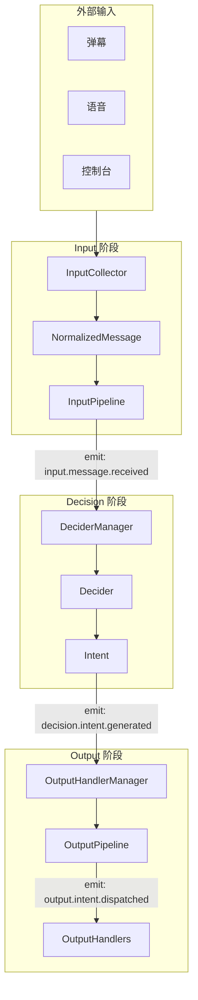
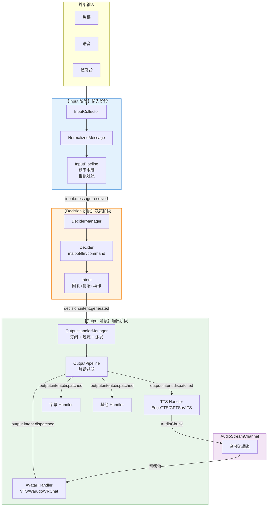
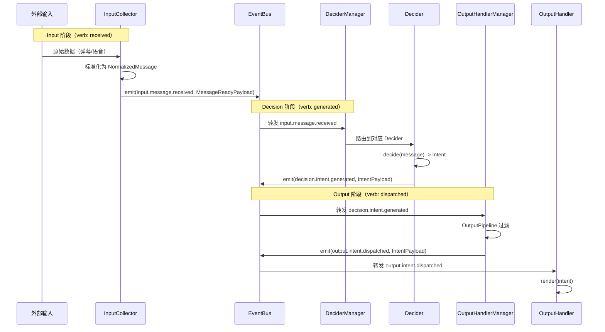
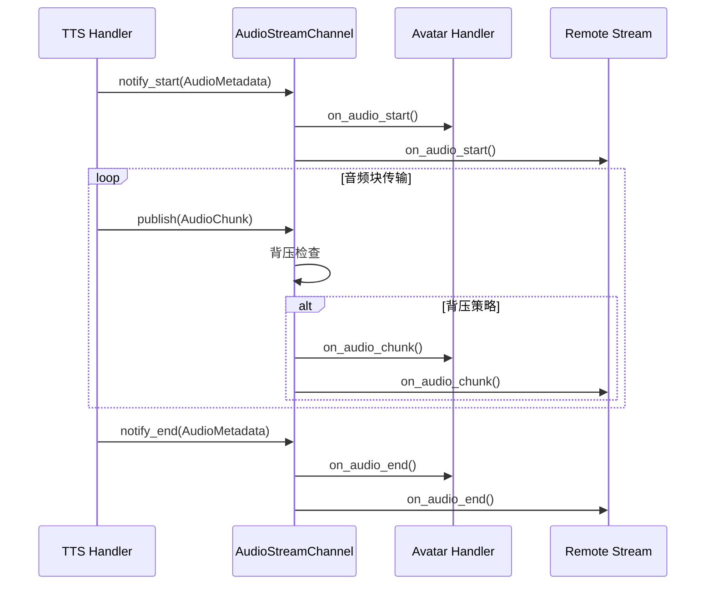
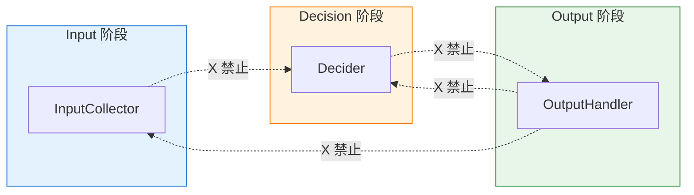

# 数据流规则

本文档定义了 Amaidesu 项目的数据流约束规则，确保 3 阶段架构的完整性和可维护性。

## 目录

- [单向数据流原则](#1-单向数据流原则)
- [禁止模式](#2-禁止模式)
- [事件流向](#3-事件流向)
- [AudioStreamChannel 与 EventBus 的区别](#4-audiostreamchannel-与-eventbus-的区别)
- [共享类型设计](#5-共享类型设计)
- [Mermaid 数据流图](#6-mermaid-数据流图)

---

## 1. 单向数据流原则

**严格遵守单向数据流：Input 阶段 → Decision 阶段 → Output 阶段**

Amaidesu 项目采用 3 阶段架构，数据在各阶段之间按照固定方向流动：

```
外部输入（弹幕、语音、控制台）
        ↓
【Input 阶段】数据采集 → 标准化 → Pipeline 过滤
        ↓ EventBus: input.message.received
【Decision 阶段】处理消息 → 生成 Intent
        ↓ EventBus: decision.intent.generated
【Output 阶段】参数生成 → Pipeline 过滤 → 渲染输出
        ↓ EventBus: output.intent.dispatched
OutputHandlers 渲染
```

### 数据类型流

| 阶段 | 数据类型 | 所在阶段 | 说明 |
|------|---------|--------|------|
| 输入 | `RawData` | Input | 原始数据（弹幕、语音等） |
| 标准化 | `NormalizedMessage` | Input | 标准化消息 |
| 决策 | `Intent` | Decision | 决策意图 |
| 渲染 | `RenderParameters` | Output | 渲染参数 |
| 输出 | 实际输出 | Output | TTS 音频、字幕、动作等 |

---

## 2. 禁止模式

| 禁止模式 | 说明 | 违规原因 |
|---------|------|---------|
| OutputHandler 订阅 Input 事件 | `input.message.received` | 绕过 Decision 阶段，破坏分层架构 |
| Decider 订阅 Output 事件 | `output.intent.dispatched` 等 | 创建循环依赖，破坏单向流 |
| InputCollector 订阅 Decision/Output 事件 | `decision.intent.generated` 等 | Input 应只发布，不订阅下游 |

### 详细说明

#### 为什么禁止 OutputHandler 订阅 Input 事件？

OutputHandler 如果直接订阅 `input.message.received` 事件，会绕过 Decision 阶段，导致：
- 未经决策的原始数据直接输出
- 破坏了 3 阶段架构的分层原则
- 无法保证输出的可控性和安全性

#### 为什么禁止 Decider 订阅 Output 事件？

Decider 订阅 Output 事件会创建循环依赖：
- Decision 依赖 Output 的状态来做出决策
- 形成循环，打破单向数据流
- 增加系统复杂度和调试难度

#### 为什么 InputCollector 不应订阅下游事件？

InputCollector 的职责是采集和发布数据：
- 应该是数据的生产者，不应该是消费者
- 订阅下游事件会改变其角色定位
- 违反单一职责原则

### 违规示例

```python
# 错误示例：OutputHandler 订阅 Input 事件
class MyOutputHandler(OutputHandler):
    async def _setup_internal(self):
        # 违规：不应该订阅 input.message.received
        self._event_bus.on(
            CoreEvents.INPUT_MESSAGE_RECEIVED,
            self._handle_raw_message,  # 直接处理原始消息
            model_class=MessageReadyPayload,
        )

# 正确示例：通过 Decision 阶段处理
class MyOutputHandler(OutputHandler):
    async def _setup_internal(self):
        # 正确：订阅 output.intent.dispatched（OutputHandlerManager 派发）
        self._event_bus.on(
            CoreEvents.OUTPUT_INTENT_DISPATCHED,
            self._handle_intent,
            model_class=IntentPayload,
        )
```

---

## 3. 事件流向

事件按阶段流转使用统一的动词链：`received → generated → dispatched`。

### 核心事件

| 事件名 | 发布者 | 订阅者 | 数据类型 | 说明 |
|--------|--------|--------|---------|------|
| `input.message.received` | InputCollector | DeciderManager | `MessageReadyPayload` (NormalizedMessage) | 标准化消息接收（received 动词） |
| `decision.intent.generated` | Decider | OutputHandlerManager | `IntentPayload` (Intent) | 决策意图生成（generated 动词） |
| `output.intent.dispatched` | OutputHandlerManager | OutputHandlers | `IntentPayload` (Intent) | 过滤后意图派发（dispatched 动词） |
| `output.obs.command` | Dashboard API / 外部组件 | ObsControlHandler 等 | `OBSCommandPayload`（按 `action` 区分） | OBS 统一命令入口 |

### 完整事件流


```mermaid
flowchart TB
    subgraph External["外部输入"]
        Danmaku["弹幕"]
        Voice["语音"]
        Console["控制台"]
    end

    subgraph Input["Input 阶段"]
        IP[InputCollector]
        NM[NormalizedMessage]
        Pipeline[InputPipeline]
    end

    subgraph Decision["Decision 阶段"]
        DM[DeciderManager]
        DP[Decider]
        Intent[Intent]
    end

    subgraph Output["Output 阶段"]
        OPM[OutputHandlerManager]
        OPipeline[OutputPipeline]
        OPS[OutputHandlers]
    end

    External --> IP
    IP --> NM
    NM --> Pipeline
    Pipeline -->|"emit: input.message.received"| DM
    DM --> DP
    DP --> Intent
    Intent -->|"emit: decision.intent.generated"| OPM
    OPM --> OPipeline
    OPipeline -->|"emit: output.intent.dispatched"| OPS
```

### 阶段参与者生命周期中的事件发布

#### InputCollector

```python
class MyInputCollector(InputCollector):
    async def start(self):
        """启动数据采集"""
        async for raw_data in self._fetch_data():
            # 标准化为 NormalizedMessage
            message = NormalizedMessage(
                text=raw_data.text,
                source=self.collector_name,
                data_type=raw_data.type,
            )
            # 发布到 EventBus
            await self._event_bus.emit(
                CoreEvents.INPUT_MESSAGE_RECEIVED,
                MessageReadyPayload.from_normalized_message(message),
                source=self.collector_name,
            )
```

#### Decider

```python
class MyDecider(Decider):
    async def _setup_internal(self):
        # 订阅标准化消息
        self._event_bus.on(
            CoreEvents.INPUT_MESSAGE_RECEIVED,
            self._handle_message,
            model_class=MessageReadyPayload,
        )

    async def _handle_message(self, event_name: str, data: MessageReadyPayload, source: str):
        # 处理消息，生成 Intent
        intent = await self.decide(data.message)

        # 发布决策意图
        await self._event_bus.emit(
            CoreEvents.DECISION_INTENT_GENERATED,
            IntentPayload.from_intent(intent, name=self.decider_name),
            source=self.decider_name,
        )
```

#### OutputHandler（Dispatcher 修复后）

> **重要**：OutputHandler 不再订阅 `decision.intent.generated`，而是订阅
> `output.intent.dispatched`。`OutputHandlerManager` 负责 Pipeline 过滤并
> 派发统一事件，避免每个 Handler 各自处理 pipeline 逻辑。

```python
class MyOutputHandler(OutputHandler):
    async def _setup_internal(self):
        # 订阅 OutputHandlerManager 派发的事件
        self._event_bus.on(
            CoreEvents.OUTPUT_INTENT_DISPATCHED,
            self._handle_intent,
            model_class=IntentPayload,
        )

    async def _handle_intent(self, event_name: str, data: IntentPayload, source: str):
        # 渲染输出
        intent = data.to_intent()
        await self.render(intent)
```

### Dispatcher 修复说明（Handler 订阅 OUTPUT_INTENT_DISPATCHED）

**问题**：早期版本中，OutputHandler 直接订阅 `decision.intent.generated`，
导致 OutputPipeline 过滤逻辑被绕过或重复执行。

**修复**：
- `OutputHandlerManager` 订阅 `decision.intent.generated`，统一运行 OutputPipeline
- 过滤完成后发布 `output.intent.dispatched` 事件
- 所有 OutputHandler 改为订阅 `output.intent.dispatched`

**收益**：
- Pipeline 过滤逻辑只在 Manager 中执行一次，避免重复
- Handler 不再关心 Decision 阶段的具体 Decider 来源
- 单测可以单独 stub Manager 的派发事件，无需 mock Decider

**示例代码**（参考 `src/stages/output/handlers/avatar/base.py`）：

```python
class AvatarHandlerBase(ABC):
    async def init(self):
        # 订阅 OUTPUT_INTENT_DISPATCHED（由 OutputHandlerManager 派发）
        self.event_bus.on(
            CoreEvents.OUTPUT_INTENT_DISPATCHED,
            self._handle_intent_dispatched,
            IntentPayload,
        )
        await self._connect()

    async def _handle_intent_dispatched(
        self, event_name: str, payload: IntentPayload, source: str
    ) -> None:
        intent = payload.to_intent()
        await self.handle(intent)
```

---

## 4. AudioStreamChannel 与 EventBus 的区别

Amaidesu 项目使用两种不同的通信机制来处理不同类型的数据：

### 对比表

| 特性 | EventBus | AudioStreamChannel |
|------|----------|-------------------|
| **用途** | 元数据事件 | 音频数据流 |
| **数据传输** | 小型 JSON/Pydantic 对象 | 大型二进制音频块 |
| **传输方式** | 发布-订阅 | 回调注册 + 队列 |
| **背压控制** | 无（EventBus 级别） | 有（SubscriberConfig） |
| **典型场景** | 消息通知、状态变更 | TTS 音频流、Avatar 驱动 |
| **阻塞行为** | 异步非阻塞 | 可配置阻塞策略 |

### EventBus 适用场景

- `input.message.received`：标准化消息接收
- `decision.intent.generated`：决策意图生成
- `output.intent.dispatched`：过滤后意图派发
- `output.obs.command`：OBS 统一命令入口
- `core.startup` / `core.shutdown`：系统生命周期事件

### AudioStreamChannel 适用场景

- TTS 音频块传输
- Avatar 口型同步驱动
- 远程流媒体传输

### 使用示例

#### EventBus 发布元数据事件

```python
# TTS 开始时发布元数据事件
await self._event_bus.emit(
    CoreEvents.RENDER_STARTED,
    RenderStartedPayload(
            provider=self.handler_name,
            text=text,
        ),
        source=self.handler_name
)
```

#### AudioStreamChannel 发布音频数据

```python
# TTS Handler 发布音频块
async def _generate_audio(self, text: str):
    # 通知开始
    await self.audio_stream_channel.notify_start(
        AudioMetadata(text=text, sample_rate=24000)
    )

    # 发布音频块
    for chunk in self._tts_engine.generate(text):
        await self.audio_stream_channel.publish(
            AudioChunk(
                data=chunk.audio_bytes,
                sample_rate=chunk.sample_rate,
                channels=chunk.channels,
            )
        )

    # 通知结束
    await self.audio_stream_channel.notify_end(
        AudioMetadata(text=text, sample_rate=24000)
    )
```

#### Avatar Handler 订阅音频流

```python
# Avatar Handler 订阅音频流
await self.audio_stream_channel.subscribe(
    name="avatar_handler",
    on_audio_start=self._on_audio_start,
    on_audio_chunk=self._on_audio_chunk,
    on_audio_end=self._on_audio_end,
    config=SubscriberConfig(
        queue_size=100,
        backpressure_strategy=BackpressureStrategy.DROP_NEWEST,
    ),
)

async def _on_audio_chunk(self, chunk: AudioChunk):
    # 重采样到目标采样率
    resampled = resample_audio(
        chunk.data,
        chunk.sample_rate,
        self.target_sample_rate
    )
    # 处理音频（口型同步等）
    await self._update_lipsync(resampled)
```

### 背压策略

AudioStreamChannel 支持多种背压策略：

| 策略 | 说明 | 适用场景 |
|------|------|---------|
| `BLOCK` | 队列满时阻塞等待 | 需要确保所有音频不丢失 |
| `DROP_NEWEST` | 丢弃最新数据（默认） | 不阻塞 TTS，最新音频更重要 |
| `DROP_OLDEST` | 替换最旧数据 | 历史音频不重要 |
| `FAIL_FAST` | 队列满时抛出异常 | 需要显式处理背压 |

---

## 5. 共享类型设计

### 为什么放在 src/modules/types/ 中？

以下类型被 Input/Decision/Output 多个阶段共享，如果放在任何一个阶段中，会导致其他阶段依赖它，造成循环依赖。放在 Modules 层可以避免这个问题。

### 共享类型列表

| 类型 | 用途 | 定义位置 |
|------|------|---------|
| `EmotionType` | 情感类型枚举 | `src/modules/types/intent.py` |
| `ActionType` | 动作类型枚举 | `src/modules/types/intent.py` |
| `IntentAction` | 意图动作模型 | `src/modules/types/intent.py` |
| `Intent` | 完整决策意图类 | `src/modules/types/intent.py` |
| `SourceContext` | 输入源上下文 | `src/modules/types/intent.py` |

### 类型定义

#### EmotionType（情感类型枚举）

```python
class EmotionType(str, Enum):
    """情感类型枚举"""

    NEUTRAL = "neutral"      # 中性
    HAPPY = "happy"        # 开心
    SAD = "sad"            # 悲伤
    ANGRY = "angry"        # 生气
    SURPRISED = "surprised" # 惊讶
    LOVE = "love"          # 喜爱
    SHY = "shy"            # 害羞
    EXCITED = "excited"    # 兴奋
    CONFUSED = "confused"  # 困惑
    SCARED = "scared"      # 害怕
```

#### ActionType（动作类型枚举）

```python
class ActionType(str, Enum):
    """动作类型枚举"""

    EXPRESSION = "expression"  # 表情
    HOTKEY = "hotkey"          # 热键
    EMOJI = "emoji"           # Emoji 表情
    BLINK = "blink"           # 眨眼
    NOD = "nod"               # 点头
    SHAKE = "shake"           # 摇头
    WAVE = "wave"             # 挥手
    CLAP = "clap"             # 鼓掌
    STICKER = "sticker"       # 贴图
    MOTION = "motion"         # 动作
    CUSTOM = "custom"         # 自定义
    GAME_ACTION = "game_action" # 游戏动作
    NONE = "none"             # 无动作
```

#### Intent（决策意图）

```python
class Intent(BaseModel):
    """决策意图 - Decision 阶段的核心输出"""

    id: str                           # 唯一标识符
    source_context: Optional[SourceContext]  # 输入源上下文
    original_text: str                # 原始输入文本
    response_text: str                # AI 回复文本
    emotion: EmotionType              # 情感类型
    actions: List[IntentAction]       # 动作列表
    metadata: Dict[str, Any]          # 元数据
    timestamp: float                  # 时间戳
```

### 如何添加新的共享类型

1. **评估必要性**：确认类型是否真的需要跨多个阶段使用
2. **选择位置**：如果是多个阶段共享，添加到 `src/modules/types/` 中的合适文件
3. **更新导入**：更新相关阶段的导入语句
4. **运行验证**：运行架构测试验证无循环依赖

```python
# 错误示例：放在阶段层会导致循环依赖
# src/stages/input/types.py -> 导入 Decision 的 Intent
# src/stages/decision/types.py -> 导入 Input 的类型

# 正确示例：放在 Modules 层
# src/modules/types/intent.py -> 所有阶段都可以导入
```

---

## 6. Mermaid 数据流图

### 完整数据流图


```mermaid
flowchart TB
    subgraph External["外部输入"]
        D[弹幕]
        V[语音]
        C[控制台]
    end

    subgraph Input["【Input 阶段】输入阶段"]
        IP[InputCollector]
        NM[NormalizedMessage]
        Pipeline[InputPipeline<br/>频率限制<br/>相似过滤]
    end

    subgraph Decision["【Decision 阶段】决策阶段"]
        DM[DeciderManager]
        DP[Decider<br/>maibot/llm/command]
        Intent[Intent<br/>回复+情感+动作]
    end

    subgraph Output["【Output 阶段】输出阶段"]
        OPM[OutputHandlerManager<br/>订阅 + 过滤 + 派发]
        OPipeline[OutputPipeline<br/>脏话过滤]
        TTS[TTS Handler<br/>EdgeTTS/GPTSoVITS]
        Sub[字幕 Handler]
        Avatar[Avatar Handler<br/>VTS/Warudo/VRChat]
        Other[其他 Handler]
    end

    subgraph AudioStream["AudioStreamChannel"]
        ASC[音频流通道]
    end

    External --> IP
    IP --> NM
    NM --> Pipeline
    Pipeline -->|input.message.received| DM
    DM --> DP
    DP --> Intent
    Intent -->|decision.intent.generated| OPM
    OPM --> OPipeline
    OPipeline -->|output.intent.dispatched| TTS
    OPipeline -->|output.intent.dispatched| Sub
    OPipeline -->|output.intent.dispatched| Avatar
    OPipeline -->|output.intent.dispatched| Other

    TTS -->|AudioChunk| ASC
    ASC -->|音频流| Avatar

    style Input fill:#e3f2fd,stroke:#1976d2
    style Decision fill:#fff3e0,stroke:#f57c00
    style Output fill:#e8f5e9,stroke:#388e3c
    style AudioStream fill:#f3e5f5,stroke:#7b1fa2
```

### 事件时序图（received → generated → dispatched）


```mermaid
sequenceDiagram
    participant Ext as 外部输入
    participant IP as InputCollector
    participant EB as EventBus
    participant DM as DeciderManager
    participant DP as Decider
    participant OPM as OutputHandlerManager
    participant OP as OutputHandler

    Note over Ext,IP: Input 阶段（verb: received）

    Ext->>IP: 原始数据（弹幕/语音）
    IP->>IP: 标准化为 NormalizedMessage
    IP->>EB: emit(input.message.received, MessageReadyPayload)

    Note over DM,EB: Decision 阶段（verb: generated）

    EB->>DM: 转发 input.message.received
    DM->>DP: 路由到对应 Decider
    DP->>DP: decide(message) -> Intent
    DP->>EB: emit(decision.intent.generated, IntentPayload)

    Note over OPM,EB: Output 阶段（verb: dispatched）

    EB->>OPM: 转发 decision.intent.generated
    OPM->>OPM: OutputPipeline 过滤
    OPM->>EB: emit(output.intent.dispatched, IntentPayload)

    EB->>OP: 转发 output.intent.dispatched
    OP->>OP: render(intent)
```

### AudioStreamChannel 数据流


```mermaid
sequenceDiagram
    participant TTS as TTS Handler
    participant ASC as AudioStreamChannel
    participant Avatar as Avatar Handler
    participant Remote as Remote Stream

    TTS->>ASC: notify_start(AudioMetadata)
    ASC->>Avatar: on_audio_start()
    ASC->>Remote: on_audio_start()

    loop 音频块传输
        TTS->>ASC: publish(AudioChunk)
        ASC->>ASC: 背压检查
        alt 背压策略
            ASC->>Avatar: on_audio_chunk()
            ASC->>Remote: on_audio_chunk()
        end
    end

    TTS->>ASC: notify_end(AudioMetadata)
    ASC->>Avatar: on_audio_end()
    ASC->>Remote: on_audio_end()
```

### 禁止的跨阶段订阅


```mermaid
flowchart LR
    subgraph InputStage["Input 阶段"]
        IP[InputCollector]
    end

    subgraph DecisionStage["Decision 阶段"]
        DP[Decider]
    end

    subgraph OutputStage["Output 阶段"]
        OP[OutputHandler]
    end

    IP -.->|X 禁止| DP
    DP -.->|X 禁止| OP
    OP -.->|X 禁止| IP
    OP -.->|X 禁止| DP

    style InputStage fill:#e3f2fd,stroke:#1976d2
    style DecisionStage fill:#fff3e0,stroke:#f57c00
    style OutputStage fill:#e8f5e9,stroke:#388e3c
```

---

## 相关文档

- [3阶段架构总览](overview.md) - 3阶段架构详解
- [事件系统](event-system.md) - EventBus 使用指南
- [阶段参与者开发](../development/provider-guide.md) - 阶段参与者开发详解

---

*最后更新：2026-06-23*
