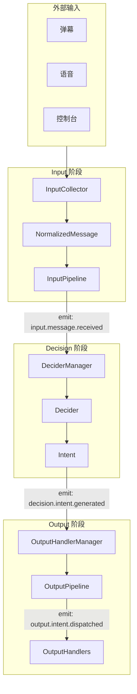
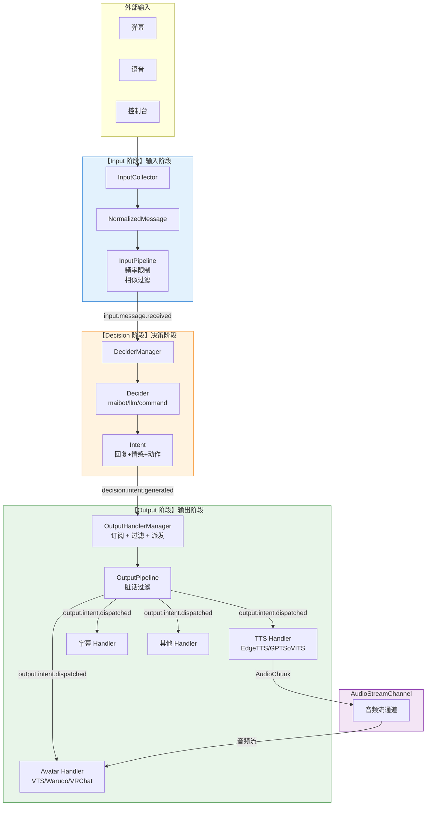
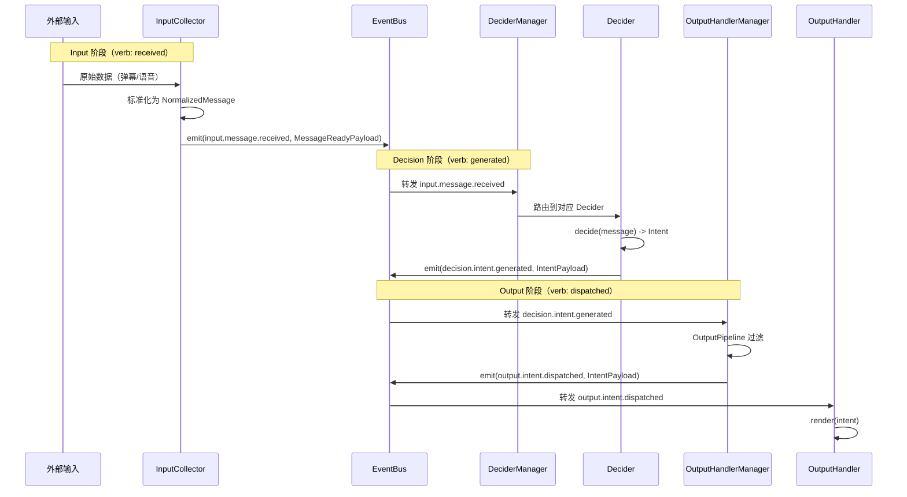
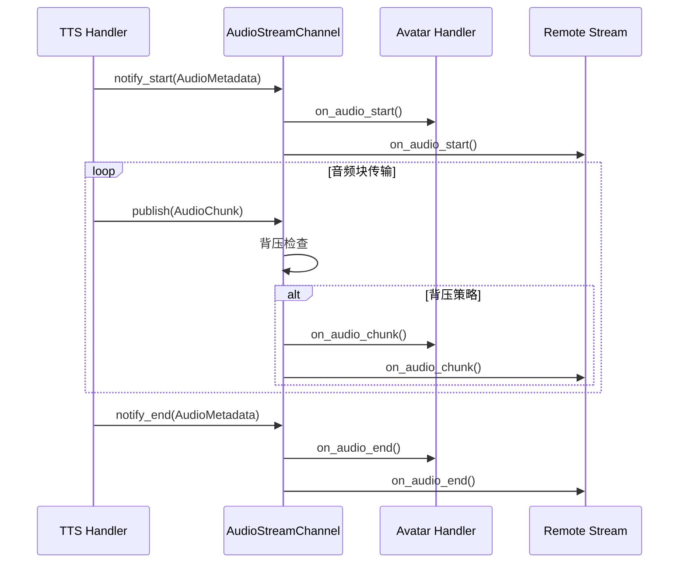
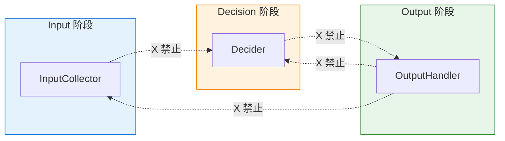

# 数据流规则

本文档定义了 Amaidesu 项目的数据流约束规则，确保 3 阶段架构的完整性和可维护性。

## 目录

- [单向数据流原则](#1-单向数据流原则)
- [禁止模式](#2-禁止模式)
- [事件流向](#3-事件流向)
- [AudioStreamChannel 与 EventBus 的区别](#4-audiostreamchannel-与-eventbus-的区别)
- [共享类型设计](#5-共享类型设计)
- [Mermaid 数据流图](#6-mermaid-数据流图)

---

## 1. 单向数据流原则

**严格遵守单向数据流：Input 阶段 → Decision 阶段 → Output 阶段**

Amaidesu 项目采用 3 阶段架构，数据在各阶段之间按照固定方向流动：

```
外部输入（弹幕、语音、控制台）
        ↓
【Input 阶段】数据采集 → 标准化 → Pipeline 过滤
        ↓ EventBus: input.message.received
【Decision 阶段】处理消息 → 生成 Intent
        ↓ EventBus: decision.intent.generated
【Output 阶段】参数生成 → Pipeline 过滤 → 渲染输出
        ↓ EventBus: output.intent.dispatched
OutputHandlers 渲染
```

### 数据类型流

| 阶段 | 数据类型 | 所在阶段 | 说明 |
|------|---------|--------|------|
| 输入 | `RawData` | Input | 原始数据（弹幕、语音等） |
| 标准化 | `NormalizedMessage` | Input | 标准化消息 |
| 决策 | `Intent` | Decision | 决策意图 |
| 渲染 | `RenderParameters` | Output | 渲染参数 |
| 输出 | 实际输出 | Output | TTS 音频、字幕、动作等 |

### 约束的精确定义：数据平面 vs 发现平面

"单向数据流"这一句容易被误读成"Decision 永远不许知道 Output 的任何东西"。这是不准确的。约束真正要守护的是三件事，应分三个层面精确表述：

#### ① 数据平面（硬规则，绝不能破）—— 运行时消息/结果严格单向

> Output 的**运行时产物**（渲染结果、成功/失败、状态、产物数据）**绝不可**成为 Decision 的输入，无论经 EventBus 还是直接调用。每条消息/意图的生命周期是一条直线：`Input → Decision → Output`。

这条守护的是**防环**：一旦 Output 的结果能回灌触发新决策，就会形成"输出→决策→输出"的无限循环。形式化约束：

- Decider **不订阅**任何 Output 阶段发布的事件。
- InputCollector **不订阅**任何 Decision/Output 的**数据事件**（`decision.intent.generated`、`output.intent.dispatched` 等携带决策/输出结果的事件）。
- **例外**：Output 阶段的**元控制信号**（如 `output.intent.finished`，仅表示"所有 handler 已完成"，不携带输出结果）允许 InputCollector 订阅。这类信号不含输出结果数据，不会形成回灌循环。
- OutputHandler **不订阅** Input 事件（必须经 Decision）。

#### ② 分层规则（防 import 环）—— 跨阶段只经共享抽象

> 阶段之间**不直接 import 对方的实现模块**；跨阶段契约（共享类型、Protocol）一律放在 `src/modules/`；模块依赖图必须无环。

这条守护的是**可替换 / 可测试 / 无编译期环**。Decision 不该认识 `OutputHandlerManager` 这种具体类，只该认识共享层的抽象。

#### ③ 发现平面（受限放行，允许上行）—— 只读能力元数据

> "**能做什么**"这类**只读、静态的能力/发现元数据**（有哪些动作、参数是什么），**允许**从 Output 流向 Decision（用于动作选择），但必须满足全部以下条件：
> - **只读**：Decision 只查询，不写、不触发 Output 行为；
> - **拉取式（pull）**：由 Decision 主动查询，**不是** Output 推送/广播事件给 Decision（推送会落回 ① 的禁区）；
> - **经反转抽象**：通过 `src/modules/` 层的只读 Protocol（如 `CapabilitiesProvider`），Decision 不 import Output 实现；
> - **组合根接线**：具体实现（`OutputHandlerManager`）只在 `main.py` 注入，组合根允许认识所有阶段。

**① 和 ③ 的一句话区分**：

> "你能挥手吗？" —— 可以问（发现平面，查询能力空间）。
> "你刚才挥手成功了吗？" —— 不能问（数据平面，结果回灌会成环）。

动作选择本质上要求决策器知道动作空间（MaiBot 的 Planner 做 tool calling 同理），因此发现平面的上行信息流是**必要且安全**的，只要严守上述四个条件即可。这不是对单向数据流的违反，而是对它的精确化。

---

## 2. 禁止模式

| 禁止模式 | 说明 | 违规原因 |
|---------|------|---------|
| OutputHandler 订阅 Input 事件 | `input.message.received` | 绕过 Decision 阶段，破坏分层架构 |
| Decider 订阅 Output 事件 | `output.intent.dispatched` 等 | 创建循环依赖，破坏单向流 |
| InputCollector 订阅 Decision/Output 的数据事件 | `decision.intent.generated` 等 | Input 应只发布数据，不订阅下游结果数据 |

### 详细说明

#### 为什么禁止 OutputHandler 订阅 Input 事件？

OutputHandler 如果直接订阅 `input.message.received` 事件，会绕过 Decision 阶段，导致：
- 未经决策的原始数据直接输出
- 破坏了 3 阶段架构的分层原则
- 无法保证输出的可控性和安全性

#### 为什么禁止 Decider 订阅 Output 事件？

Decider 订阅 Output 事件会创建循环依赖：
- Decision 依赖 Output 的**运行时结果/状态**来做出决策
- 形成循环（输出→决策→输出），打破单向数据流
- 增加系统复杂度和调试难度

> **注意区分**：这里禁止的是 Decision 消费 Output 的**运行时结果**（数据平面，见 ①）。
> Decision **拉取** Output 的**只读能力元数据**（发现平面，见 ③）是被允许的——
> 那是查询"能做什么"，不是订阅"做了什么"，不会成环。详见下方"允许模式"。

#### 为什么 InputCollector 不应订阅下游数据事件？

InputCollector 的职责是采集和发布数据：
- 应该是数据的生产者，不应该是**结果数据**的消费者
- 订阅下游的**数据事件**（携带决策/输出结果）会改变其角色定位
- 违反单一职责原则

> **例外**：Output 的**元控制信号**（如 `output.intent.finished`）仅表示"所有 handler 已完成"，不携带任何输出结果数据，InputCollector 可以订阅以触发下一轮采集。这种控制信号不会形成数据回灌循环。

### 违规示例

```python
# 错误示例：OutputHandler 订阅 Input 事件
class MyOutputHandler(OutputHandler):
    async def _setup_internal(self):
        # 违规：不应该订阅 input.message.received
        self._event_bus.on(
            CoreEvents.INPUT_MESSAGE_RECEIVED,
            self._handle_raw_message,  # 直接处理原始消息
            model_class=MessageReadyPayload,
        )

# 正确示例：通过 Decision 阶段处理
class MyOutputHandler(OutputHandler):
    async def _setup_internal(self):
        # 正确：订阅 output.intent.dispatched（OutputHandlerManager 派发）
        self._event_bus.on(
            CoreEvents.OUTPUT_INTENT_DISPATCHED,
            self._handle_intent,
            model_class=IntentPayload,
        )
```

### 允许模式：Decision 拉取 Output 能力做动作选择（发现平面）

决策器需要"挑动作"时，必须知道有哪些动作可选。这条能力元数据从 Output 上行到
Decision 是**允许**的，但要严格走"只读 Protocol + 组合根注入"的形态，**不得**让
Decision import Output 实现，也**不得**通过 Output 推送事件实现。

**第 1 步：共享层定义只读抽象**（`src/modules/types/capabilities.py`）

```python
@runtime_checkable
class CapabilitiesProvider(Protocol):
    """能力提供者协议（只读）。Decision 经此查询 Output 能力，不 import Output 实现。"""

    def get_all_capabilities(self) -> "UnifiedCapabilitiesView": ...
```

**第 2 步：Output 实现该抽象**（`OutputHandlerManager.get_all_capabilities()` 结构化满足 Protocol，无需显式继承）。

**第 3 步：组合根注入**（`main.py`，注意 Output 须先于 Decision 就绪）

```python
# main.py —— 组合根允许认识所有阶段
output_manager = OutputHandlerManager(...)
await output_manager.setup(...)          # 能力依赖 handler 加载完成
decision_manager = DeciderManager(
    event_bus, llm_service, ...,
    capabilities_provider=output_manager,  # 经类型匹配 DI 下发给各 Decider
)
```

**第 4 步：Decider 只依赖抽象，惰性拉取**（不 import `src.stages.output`）

```python
from src.modules.types.capabilities import CapabilitiesProvider  # 仅依赖共享抽象

class MyDecider:
    def __init__(self, ..., capabilities_provider: Optional[CapabilitiesProvider] = None):
        self._capabilities_provider = capabilities_provider

    def _ensure_capabilities(self) -> None:
        # 首次决策时拉取并缓存（此时 Output 已就绪）；provider 缺失则优雅降级
        if self._capabilities_provider is None:
            return
        view = self._capabilities_provider.get_all_capabilities()
        self._valid_action_names = {a.name for a in view.actions}
```

**依赖箭头**（永远没有 Decision → Output 的实现依赖）：

```
Output（实现）──▶ CapabilitiesProvider（抽象，在 modules）◀── Decision（使用）
```

> **代价提示**：此模式引入"Output 须先于 Decision 就绪"的时序耦合。`main.py` 已据此
> 调整启动顺序，Decider 也采用"首次决策时惰性拉取 + 缓存"，并在 provider 缺失/查询失败时
> 优雅降级为关闭动作选择。这是发现平面上行的固有成本，可接受。

---

## 3. 事件流向

事件按阶段流转使用统一的动词链：`received → generated → dispatched → completed → finished`。

### 核心事件

| 事件名 | 发布者 | 订阅者 | 数据类型 | 说明 |
|--------|--------|--------|---------|------|
| `input.message.received` | InputCollector | DeciderManager | `MessageReadyPayload` (NormalizedMessage) | 标准化消息接收（received 动词） |
| `decision.intent.generated` | Decider | OutputHandlerManager | `IntentPayload` (Intent) | 决策意图生成（generated 动词） |
| `output.intent.dispatched` | OutputHandlerManager | OutputHandlers | `IntentPayload` (Intent) | 过滤后意图派发（dispatched 动词），fire-and-forget |
| `output.handler.completed` | 各 OutputHandler（`handle()` 末尾 finally 里发） | OutputHandlerManager（聚合） | `OutputHandlerCompletedPayload`（含 `handler_name`、`intent_id`） | 单个 handler 完成通知（两层事件第一层） |
| `output.intent.finished` | OutputHandlerManager（聚合后发） | 任何需要"等所有输出完成"的组件（如 MainosabaCollector） | `IntentPayload` (Intent) | 所有 active handler 都干完的聚合信号（两层事件第二层） |
| `output.obs.command` | Dashboard API / 外部组件 | ObsControlHandler 等 | `OBSCommandPayload`（按 `action` 区分） | OBS 统一命令入口 |

#### 两层事件聚合模式（Output 完成时序）

`output.intent.dispatched` 默认是 fire-and-forget，emit 立刻返回而 handler 在后台 task 跑。要准确感知"所有 handler 真的干完了"，需要两层：

- **第一层（per-handler 完成）**：每个 OutputHandler 在自己的 `handle()` 末尾（`try/finally` 里以保证异常也发）emit `output.handler.completed`，声明"我干完了"。`handler_name` 用 `self.__class__.__name__`，`intent_id` 从 `intent.metadata.intent_id` 取。
- **第二层（聚合）**：`OutputHandlerManager` 订阅第一层，按 `intent_id` 关联，等所有 active handler 都报告完成后 emit `output.intent.finished`。
- **兜底**：watchdog 超时（`completion_timeout_ms` 默认 30000），防止某个 handler 漏发导致 FINISHED 永远不发。

任何关心"等输出全部干完"的下游组件应订阅 `output.intent.finished`，而不是 `output.intent.dispatched`。

**新增 OutputHandler 时必须遵守的契约**：

1. 在 `handle(intent)` 末尾（用 `try/finally` 包裹）emit `OUTPUT_HANDLER_COMPLETED`
2. `handler_name` 用 `self.__class__.__name__`（与 Manager 端 `type(h).__name__` 一致）
3. `intent_id` 从 `intent.metadata.intent_id` 取
4. 异常路径（`success=False`）也要发，否则 Manager 只能靠超时兜底

基类 `AudioHandlerBase` 和 `AvatarHandlerBase` 已自动 emit，子类无需重复。独立 handler（`StickerHandler` / `SubtitleHandler` / `DebugConsoleHandler` / `ObsControlHandler` / `GPTSoVITSHandler`）需自行实现 `_emit_completed` 并在 `handle()` finally 里调用。

### 完整事件流


```mermaid
flowchart TB
    subgraph External["外部输入"]
        Danmaku["弹幕"]
        Voice["语音"]
        Console["控制台"]
    end

    subgraph Input["Input 阶段"]
        IP[InputCollector]
        NM[NormalizedMessage]
        Pipeline[InputPipeline]
    end

    subgraph Decision["Decision 阶段"]
        DM[DeciderManager]
        DP[Decider]
        Intent[Intent]
    end

    subgraph Output["Output 阶段"]
        OPM[OutputHandlerManager]
        OPipeline[OutputPipeline]
        OPS[OutputHandlers]
    end

    External --> IP
    IP --> NM
    NM --> Pipeline
    Pipeline -->|"emit: input.message.received"| DM
    DM --> DP
    DP --> Intent
    Intent -->|"emit: decision.intent.generated"| OPM
    OPM --> OPipeline
    OPipeline -->|"emit: output.intent.dispatched"| OPS
```

### 阶段参与者生命周期中的事件发布

#### InputCollector

```python
class MyInputCollector(InputCollector):
    async def start(self):
        """启动数据采集"""
        async for raw_data in self._fetch_data():
            # 标准化为 NormalizedMessage
            message = NormalizedMessage(
                text=raw_data.text,
                source=self.collector_name,
                data_type=raw_data.type,
            )
            # 发布到 EventBus
            await self._event_bus.emit(
                CoreEvents.INPUT_MESSAGE_RECEIVED,
                MessageReadyPayload.from_normalized_message(message),
                source=self.collector_name,
            )
```

#### Decider

```python
class MyDecider(Decider):
    async def _setup_internal(self):
        # 订阅标准化消息
        self._event_bus.on(
            CoreEvents.INPUT_MESSAGE_RECEIVED,
            self._handle_message,
            model_class=MessageReadyPayload,
        )

    async def _handle_message(self, event_name: str, data: MessageReadyPayload, source: str):
        # 处理消息，生成 Intent
        intent = await self.decide(data.message)

        # 发布决策意图
        await self._event_bus.emit(
            CoreEvents.DECISION_INTENT_GENERATED,
            IntentPayload.from_intent(intent, name=self.decider_name),
            source=self.decider_name,
        )
```

#### OutputHandler（Dispatcher 修复后）

> **重要**：OutputHandler 不再订阅 `decision.intent.generated`，而是订阅
> `output.intent.dispatched`。`OutputHandlerManager` 负责 Pipeline 过滤并
> 派发统一事件，避免每个 Handler 各自处理 pipeline 逻辑。

```python
class MyOutputHandler(OutputHandler):
    async def _setup_internal(self):
        # 订阅 OutputHandlerManager 派发的事件
        self._event_bus.on(
            CoreEvents.OUTPUT_INTENT_DISPATCHED,
            self._handle_intent,
            model_class=IntentPayload,
        )

    async def _handle_intent(self, event_name: str, data: IntentPayload, source: str):
        # 渲染输出
        intent = data.to_intent()
        await self.render(intent)
```

### Dispatcher 修复说明（Handler 订阅 OUTPUT_INTENT_DISPATCHED）

**问题**：早期版本中，OutputHandler 直接订阅 `decision.intent.generated`，
导致 OutputPipeline 过滤逻辑被绕过或重复执行。

**修复**：
- `OutputHandlerManager` 订阅 `decision.intent.generated`，统一运行 OutputPipeline
- 过滤完成后发布 `output.intent.dispatched` 事件
- 所有 OutputHandler 改为订阅 `output.intent.dispatched`

**收益**：
- Pipeline 过滤逻辑只在 Manager 中执行一次，避免重复
- Handler 不再关心 Decision 阶段的具体 Decider 来源
- 单测可以单独 stub Manager 的派发事件，无需 mock Decider

**示例代码**（参考 `src/stages/output/handlers/avatar/base.py`）：

```python
class AvatarHandlerBase(ABC):
    async def init(self):
        # 订阅 OUTPUT_INTENT_DISPATCHED（由 OutputHandlerManager 派发）
        self.event_bus.on(
            CoreEvents.OUTPUT_INTENT_DISPATCHED,
            self._handle_intent_dispatched,
            IntentPayload,
        )
        await self._connect()

    async def _handle_intent_dispatched(
        self, event_name: str, payload: IntentPayload, source: str
    ) -> None:
        intent = payload.to_intent()
        await self.handle(intent)
```

---

## 4. AudioStreamChannel 与 EventBus 的区别

Amaidesu 项目使用两种不同的通信机制来处理不同类型的数据：

### 对比表

| 特性 | EventBus | AudioStreamChannel |
|------|----------|-------------------|
| **用途** | 元数据事件 | 音频数据流 |
| **数据传输** | 小型 JSON/Pydantic 对象 | 大型二进制音频块 |
| **传输方式** | 发布-订阅 | 回调注册 + 队列 |
| **背压控制** | 无（EventBus 级别） | 有（SubscriberConfig） |
| **典型场景** | 消息通知、状态变更 | TTS 音频流、Avatar 驱动 |
| **阻塞行为** | 异步非阻塞 | 可配置阻塞策略 |

### EventBus 适用场景

- `input.message.received`：标准化消息接收
- `decision.intent.generated`：决策意图生成
- `output.intent.dispatched`：过滤后意图派发
- `output.obs.command`：OBS 统一命令入口
- `core.startup` / `core.shutdown`：系统生命周期事件

### AudioStreamChannel 适用场景

- TTS 音频块传输
- Avatar 口型同步驱动
- 远程流媒体传输

### 使用示例

#### EventBus 发布元数据事件

```python
# TTS 开始时发布元数据事件
await self._event_bus.emit(
    CoreEvents.RENDER_STARTED,
    RenderStartedPayload(
            provider=self.handler_name,
            text=text,
        ),
        source=self.handler_name
)
```

#### AudioStreamChannel 发布音频数据

```python
# TTS Handler 发布音频块
async def _generate_audio(self, text: str):
    # 通知开始
    await self.audio_stream_channel.notify_start(
        AudioMetadata(text=text, sample_rate=24000)
    )

    # 发布音频块
    for chunk in self._tts_engine.generate(text):
        await self.audio_stream_channel.publish(
            AudioChunk(
                data=chunk.audio_bytes,
                sample_rate=chunk.sample_rate,
                channels=chunk.channels,
            )
        )

    # 通知结束
    await self.audio_stream_channel.notify_end(
        AudioMetadata(text=text, sample_rate=24000)
    )
```

#### Avatar Handler 订阅音频流

```python
# Avatar Handler 订阅音频流
await self.audio_stream_channel.subscribe(
    name="avatar_handler",
    on_audio_start=self._on_audio_start,
    on_audio_chunk=self._on_audio_chunk,
    on_audio_end=self._on_audio_end,
    config=SubscriberConfig(
        queue_size=100,
        backpressure_strategy=BackpressureStrategy.DROP_NEWEST,
    ),
)

async def _on_audio_chunk(self, chunk: AudioChunk):
    # 重采样到目标采样率
    resampled = resample_audio(
        chunk.data,
        chunk.sample_rate,
        self.target_sample_rate
    )
    # 处理音频（口型同步等）
    await self._update_lipsync(resampled)
```

### 背压策略

AudioStreamChannel 支持多种背压策略：

| 策略 | 说明 | 适用场景 |
|------|------|---------|
| `BLOCK` | 队列满时阻塞等待 | 需要确保所有音频不丢失 |
| `DROP_NEWEST` | 丢弃最新数据（默认） | 不阻塞 TTS，最新音频更重要 |
| `DROP_OLDEST` | 替换最旧数据 | 历史音频不重要 |
| `FAIL_FAST` | 队列满时抛出异常 | 需要显式处理背压 |

---

## 5. 共享类型设计

### 为什么放在 src/modules/types/ 中？

以下类型被 Input/Decision/Output 多个阶段共享，如果放在任何一个阶段中，会导致其他阶段依赖它，造成循环依赖。放在 Modules 层可以避免这个问题。

### 共享类型列表

| 类型 | 用途 | 定义位置 |
|------|------|---------|
| `Emotion` | 全局情感枚举(12 个值,str-Enum) | `src/modules/types/emotion_vocab.py` |
| `Intent` | 决策意图(平台无关,核心数据结构) | `src/modules/types/intent.py` |
| `IntentMetadata` | 意图元数据(来源 + 决策时间) | `src/modules/types/intent.py` |
| `IntentAction` | 意图动作(全限定名 `<handler>.<action>` + parameters) | `src/modules/types/intent.py` |
| `IntentEmotion` | 意图情绪(枚举名 + intensity 0-1) | `src/modules/types/intent.py` |

### 类型定义

#### Emotion（全局情感枚举，12 个值）

```python
class Emotion(str, Enum):
    """全局情感枚举（共享给所有 avatar handler）。"""

    NEUTRAL = "neutral"       # 中性
    HAPPY = "happy"           # 开心
    SAD = "sad"               # 悲伤
    ANGRY = "angry"           # 生气
    SURPRISED = "surprised"   # 惊讶
    SHY = "shy"               # 害羞
    LOVE = "love"             # 喜爱
    EXCITED = "excited"       # 兴奋
    CONFUSED = "confused"     # 困惑
    SCARED = "scared"         # 害怕
    THINKING = "thinking"     # 思考
    RELAXED = "relaxed"       # 放松
```

> **关键设计**:强制 12 个枚举值,`IntentEmotion.name` 通过 `field_validator` 校验
> 必须在枚举里（handler 不接受 LLM 自由发挥的情绪名）。

#### Intent（决策意图，结构化 Pydantic）

```python
class IntentMetadata(BaseModel):
    """意图元数据:只保留来源 + 决策时间（毫秒）。"""

    model_config = ConfigDict(extra="forbid")

    source_id: str          # 决策来源,如 'maibot_api' / 'command' / 'dashboard_debug'
    decision_time_ms: int   # 决策时刻（Unix 毫秒）

class IntentAction(BaseModel):
    """意图中的动作（结构化）:全限定名 + 任意 parameters。"""

    model_config = ConfigDict(extra="forbid")

    name: str                            # 全限定 action 名,格式 `<handler>.<local_action>`
    parameters: Dict[str, Any] = {}      # 动作参数（handler 内部 Pydantic 校验）

class IntentEmotion(BaseModel):
    """意图中的情绪（结构化）:枚举名 + 强度。"""

    model_config = ConfigDict(extra="forbid")

    name: str               # 必须是 Emotion 枚举值之一（由 field_validator 强制）
    intensity: float = 0.5  # [0.0, 1.0],默认 0.5（中等）

class Intent(BaseModel):
    """决策意图（平台无关,核心数据结构）。"""

    model_config = ConfigDict(extra="forbid")

    speech: Optional[str] = None             # AI 要说的话
    metadata: IntentMetadata                 # 元数据（必填）
    emotion: Optional[IntentEmotion] = None  # 情绪（可选）
    action: Optional[IntentAction] = None    # 动作（可选）
```

> **破坏性升级**:`context` / `structured_params` / `parser_type` / `llm_model` /
> `replay_count` / `extra` / `alias` / `model_config`（原 config 字段）全部删除。
> 全部 `BaseModel` 启用 `extra="forbid"`,HTTP / EventBus / CLI 入口**多层一致**
> 严格拒绝旧字段。
>
> **action.name 全限定**:`<handler>.<local_action>`（如 `warudo.wave`）。
> Manager 在 `get_all_capabilities()` 时自动加前缀;handler 内部 schema 只关心
> `local_action`。

### 如何添加新的共享类型

1. **评估必要性**：确认类型是否真的需要跨多个阶段使用
2. **选择位置**：如果是多个阶段共享，添加到 `src/modules/types/` 中的合适文件
3. **更新导入**：更新相关阶段的导入语句
4. **运行验证**：运行架构测试验证无循环依赖

```python
# 错误示例：放在阶段层会导致循环依赖
# src/stages/input/types.py -> 导入 Decision 的 Intent
# src/stages/decision/types.py -> 导入 Input 的类型

# 正确示例：放在 Modules 层
# src/modules/types/intent.py -> 所有阶段都可以导入
```

---

## 6. Mermaid 数据流图

### 完整数据流图


```mermaid
flowchart TB
    subgraph External["外部输入"]
        D[弹幕]
        V[语音]
        C[控制台]
    end

    subgraph Input["【Input 阶段】输入阶段"]
        IP[InputCollector]
        NM[NormalizedMessage]
        Pipeline[InputPipeline<br/>频率限制<br/>相似过滤]
    end

    subgraph Decision["【Decision 阶段】决策阶段"]
        DM[DeciderManager]
        DP[Decider<br/>maibot/llm/command]
        Intent[Intent<br/>回复+情感+动作]
    end

    subgraph Output["【Output 阶段】输出阶段"]
        OPM[OutputHandlerManager<br/>订阅 + 过滤 + 派发]
        OPipeline[OutputPipeline<br/>脏话过滤]
        TTS[TTS Handler<br/>EdgeTTS/GPTSoVITS]
        Sub[字幕 Handler]
        Avatar[Avatar Handler<br/>VTS/Warudo/VRChat]
        Other[其他 Handler]
    end

    subgraph AudioStream["AudioStreamChannel"]
        ASC[音频流通道]
    end

    External --> IP
    IP --> NM
    NM --> Pipeline
    Pipeline -->|input.message.received| DM
    DM --> DP
    DP --> Intent
    Intent -->|decision.intent.generated| OPM
    OPM --> OPipeline
    OPipeline -->|output.intent.dispatched| TTS
    OPipeline -->|output.intent.dispatched| Sub
    OPipeline -->|output.intent.dispatched| Avatar
    OPipeline -->|output.intent.dispatched| Other

    TTS -->|AudioChunk| ASC
    ASC -->|音频流| Avatar

    style Input fill:#e3f2fd,stroke:#1976d2
    style Decision fill:#fff3e0,stroke:#f57c00
    style Output fill:#e8f5e9,stroke:#388e3c
    style AudioStream fill:#f3e5f5,stroke:#7b1fa2
```

### 事件时序图（received → generated → dispatched）


```mermaid
sequenceDiagram
    participant Ext as 外部输入
    participant IP as InputCollector
    participant EB as EventBus
    participant DM as DeciderManager
    participant DP as Decider
    participant OPM as OutputHandlerManager
    participant OP as OutputHandler

    Note over Ext,IP: Input 阶段（verb: received）

    Ext->>IP: 原始数据（弹幕/语音）
    IP->>IP: 标准化为 NormalizedMessage
    IP->>EB: emit(input.message.received, MessageReadyPayload)

    Note over DM,EB: Decision 阶段（verb: generated）

    EB->>DM: 转发 input.message.received
    DM->>DP: 路由到对应 Decider
    DP->>DP: decide(message) -> Intent
    DP->>EB: emit(decision.intent.generated, IntentPayload)

    Note over OPM,EB: Output 阶段（verb: dispatched）

    EB->>OPM: 转发 decision.intent.generated
    OPM->>OPM: OutputPipeline 过滤
    OPM->>EB: emit(output.intent.dispatched, IntentPayload)

    EB->>OP: 转发 output.intent.dispatched
    OP->>OP: render(intent)
```

### AudioStreamChannel 数据流


```mermaid
sequenceDiagram
    participant TTS as TTS Handler
    participant ASC as AudioStreamChannel
    participant Avatar as Avatar Handler
    participant Remote as Remote Stream

    TTS->>ASC: notify_start(AudioMetadata)
    ASC->>Avatar: on_audio_start()
    ASC->>Remote: on_audio_start()

    loop 音频块传输
        TTS->>ASC: publish(AudioChunk)
        ASC->>ASC: 背压检查
        alt 背压策略
            ASC->>Avatar: on_audio_chunk()
            ASC->>Remote: on_audio_chunk()
        end
    end

    TTS->>ASC: notify_end(AudioMetadata)
    ASC->>Avatar: on_audio_end()
    ASC->>Remote: on_audio_end()
```

### 禁止的跨阶段订阅


```mermaid
flowchart LR
    subgraph InputStage["Input 阶段"]
        IP[InputCollector]
    end

    subgraph DecisionStage["Decision 阶段"]
        DP[Decider]
    end

    subgraph OutputStage["Output 阶段"]
        OP[OutputHandler]
    end

    IP -.->|X 禁止| DP
    DP -.->|X 禁止| OP
    OP -.->|X 禁止| IP
    OP -.->|X 禁止| DP

    style InputStage fill:#e3f2fd,stroke:#1976d2
    style DecisionStage fill:#fff3e0,stroke:#f57c00
    style OutputStage fill:#e8f5e9,stroke:#388e3c
```

> 上图禁止的是**事件订阅 / 运行时结果回灌**（数据平面 ①）。Decision **拉取** Output 的
> 只读能力元数据（发现平面 ③，经 `CapabilitiesProvider` Protocol + 组合根注入）**不在禁止之列**，
> 因为它不经事件、不回灌结果、不产生实现依赖。参见第 2 节"允许模式"。

---

## 相关文档

- [3阶段架构总览](overview.md) - 3阶段架构详解
- [事件系统](event-system.md) - EventBus 使用指南
- [阶段参与者开发](../development/provider-guide.md) - 阶段参与者开发详解

---

*最后更新：2026-06-30（约束精确化：区分数据平面/分层规则/发现平面，新增 Decision 拉取 Output 能力的"允许模式"）*
