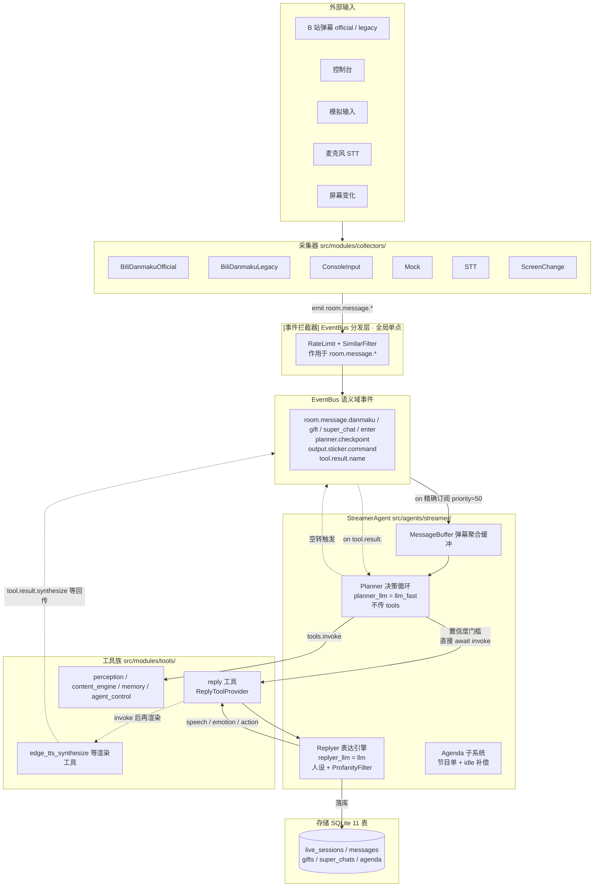

# 数据流规则（v2.0.0）

> **本文档是 Amaidesu v2 数据流与边界规则的权威定义。** 完整事件表见 [事件系统](event-system.md)，组件清单见 [架构总览](overview.md)。本文不复制事件表与组件清单，只约束数据怎么走、边界在哪里。

## 架构一句话

**Amaidesu 2.0.0 = Agent（自主主体）+ 工具（能力契约）+ 存储（状态/记忆）+ 编排（Agenda 节目单）。**

v2 不再有 Input/Decision/Output 三阶段流水线，组件通过**语义域事件**（`room.message.*` / `planner.checkpoint` / `tool.result.#` 等）直接互通：采集器持续推入房间消息，事件拦截器在分发层做语义净化，Agent 订阅消费，工具调用渲染输出，存储层落库。

| 我想…… | 查看文档 |
|--------|---------|
| 知道所有事件名、Payload 类型、订阅者 | [事件系统](event-system.md) |
| 知道组件清单与目录结构 | [架构总览](overview.md) |
| 知道事件命名规范 | [事件命名规范](event-naming-convention.md) |
| 知道怎么开发 Agent/工具/采集器 | [组件开发指南](../development/component-guide.md) |
| **知道数据该往哪儿流、哪儿不能流** | 本文档 |

---

## 1. 事件流向图


```mermaid
flowchart TB
    subgraph Ext["外部输入"]
        Bili["B 站弹幕 official / legacy"]
        Cons["控制台"]
        Mock["模拟输入"]
        Mic["麦克风 STT"]
        Screen["屏幕变化"]
    end

    subgraph Collectors["采集器 src/modules/collectors/"]
        direction TB
        C1["BiliDanmakuOfficial"]
        C2["BiliDanmakuLegacy"]
        C3["ConsoleInput"]
        C4["Mock"]
        C5["STT"]
        C6["ScreenChange"]
    end

    subgraph Interceptors["[事件拦截器] EventBus 分发层 · 全局单点"]
        IC["RateLimit + SimilarFilter<br/>作用于 room.message.*"]
    end

    subgraph Bus["EventBus 语义域事件"]
        EB["room.message.danmaku / gift / super_chat / enter<br/>planner.checkpoint<br/>output.sticker.command<br/>tool.result.name"]
    end

    subgraph StreamerAgent["StreamerAgent src/agents/streamer/"]
        MB["MessageBuffer 弹幕聚合缓冲"]
        Planner["Planner 决策循环<br/>planner_llm = llm_fast<br/>不传 tools"]
        Reply["Replyer 表达引擎<br/>replyer_llm = llm<br/>人设 + ProfanityFilter"]
        Agenda["Agenda 子系统<br/>节目单 + idle 补偿"]
    end

    subgraph Tools["工具族 src/modules/tools/"]
        RT["reply 工具<br/>ReplyToolProvider"]
        TTS["edge_tts_synthesize 等渲染工具"]
        Other["perception / content_engine / memory / agent_control"]
    end

    subgraph Storage["存储 SQLite 11 表"]
        DB[("live_sessions / messages<br/>gifts / super_chats / agenda")]
    end

    Ext --> Collectors
    Collectors -->|emit room.message.*| IC
    IC --> Bus
    Bus -->|on 精确订阅 priority=50| MB
    MB --> Planner
    Planner -->|置信度门槛<br/>直接 await invoke| RT
    RT --> Reply
    Reply -->|speech / emotion / action| RT
    Reply -->|落库| DB
    Planner -.->|空转触发| Bus
    Planner -->|tools.invoke| Other
    RT -.->|invoke 后再渲染| TTS
    TTS -.->|tool.result.synthesize 等回传| Bus
    Bus -.->|on tool.result.| Planner
```

> 图例说明：实线箭头是当前主链路；虚线箭头是辅助通道（空转检查点、工具异步结果回传、渲染工具后置调用）。AudioStreamChannel（TTS ↔ 皮套口型同步）见文末"通信机制选型"。

---

## 2. 三条约束层面

### ① 数据平面（硬规则，绝不能破）

运行时消息和工具结果严格单向流动。具体规则：

- **采集器只发布不订阅下游结果事件**。采集器订阅任何下游 Agent/工具结果事件 = 禁止。`BaseCollector.collect()` 只生产 `NormalizedMessage`，由 `_emit_semantic_events` 兜底映射到 `room.message.*` 后 emit 到 EventBus，然后退出。
- **工具异步结果走 `tool.result.<tool_name>`，不得回流到任何采集器**。`tool.result.synthesize` 之类的结果事件由需要它的 Agent（如 Planner）订阅以驱动后续动作；任何采集器订阅 `tool.result.#` = 禁止。
- **同步工具调用的返回值天然单向**。`await ToolRegistry.invoke(name, args)` 的返回值由调用方持有，工具实现不感知调用方后续动作，也不得反过来通过事件回灌。
- **Agent 内部子组件不跨子组件发"决策完成""输出完成"之类胶水事件**。`decision.intent.generated` / `output.intent.*` 一类事件在 v2 已删除（见 `names.py` Wave 6 迁移注释），因为 Planner→Replyer 是同 Agent 内部直接 await，不经事件中转。

这条守护的是**防环**：一旦工具结果或 Agent 内部产物能回灌触发新决策，就会形成"输出→决策→输出"的无限循环。

### ② 分层规则（防 import 环）

跨包只经共享抽象。具体规则：

- **业务包 `src/agents/` 与框架模块 `src/modules/` 不反向 import**。`src/agents/streamer/` 内的 Agent 可以从 `src/modules/` 导入（事件、工具、配置、LLM、存储），但 `src/modules/` 不得 import 任何 `src/agents/` 的实现。
- **共享契约放 `src/modules/types/`**。如 `NormalizedMessage`（`message_type.py`）/ `CapabilitiesProvider` Protocol（`capabilities.py`）/ `Emotion` 枚举 / `ToolProvider` 协议等。任何 Agent/工具都可能用到的基础类型都在这里。
- **框架层不得含直播/游戏内容特有逻辑**。"MC 怎么挖矿""主播怎么读弹幕"这类内容逻辑必须内聚到 `src/agents/<family>/<name>/` 包内。框架层只定义协议与基础设施，加新内容=加新 Agent 包+改配置，框架零改动。

这条守护的是**可替换 / 可测试 / 无编译期环**。Agent 不该认识具体工具实现类，只该认识 `ToolRegistry` 抽象和共享层的 Protocol。

### ③ 发现平面（受限放行，允许上行）

"能做什么"这类只读、静态的能力/发现元数据**允许**从工具层上行到 Agent（用于动作选择），但必须满足全部以下条件：

- **只读**：Agent 只查询，不写、不触发工具行为。
- **拉取式（pull）**：由 Agent 主动查询，不是工具推送/广播事件给 Agent。推送会落回 ① 的禁区。
- **经反转抽象**：通过 `src/modules/types/` 层的只读 Protocol（如 `CapabilitiesProvider`）或 `ToolRegistry.list_tools()` / `to_llm_definitions()`，Agent 不 import 工具实现。
- **组合根接线**：具体实现只在 `main.py` 注入，组合根允许认识所有层。

**① 和 ③ 的一句话区分**：

> "你能挥手吗？" —— 可以问（发现平面，查询能力空间）。
> "你刚才挥手成功了吗？" —— 不能问（数据平面，结果回灌会成环）。

动作选择本质上要求 Agent 知道动作空间，因此发现平面的上行信息流是必要且安全的，只要严守上述四个条件即可。这不是对单向数据流的违反，而是对它的精确化。

---

## 3. 防插件换皮红线

v2 不再有"插件系统"。所有新功能通过 Agent 包内聚实现，框架零改动。具体规则：

- **Planner/Replyer 是 StreamerAgent 的内部器官，不得注册为工具**。它们是 Agent 的决策循环与表达引擎（`planner.py` / `replyer.py` 同处 `src/agents/streamer/`），内部直接 await，不经 ToolRegistry 中转。"把 Planner 注册成工具"就是插件换皮的典型形态——把 Agent 内脏拆出来假装是工具。
- **内容特有逻辑全部内聚到 `src/agents/<family>/<name>/` 包内**。例：新增"MC Agent" → 在 `src/agents/game/minecraft/` 建包，内含 `agent.py`（继承 `BaseAgent`）、`engine.py`（实现 `ContentEngine` Protocol）、`state.py` 等。`AgentManager.register_all_tools` 会自动把 `list_tools()` 暴露到全局 ToolRegistry。
- **加内容 = 加包 + 配置**，框架层零改动。**禁止**为新功能在 `src/modules/` 加新域；**禁止**通过 monkey-patching 或 import 副作用往框架注入行为。
- **快照型能力是被调才干活的工具，持续流型才是采集器**。`look_at_screen`（截图感知，返回当前画面）是工具，因为它被 LLM 决策时才看一眼；屏幕持续变化检测（`ScreenChangeCollector`）才是采集器，因为它推"屏幕变了"事件流。判别口诀："谁驱动谁"——能自我维持状态/轮询/心跳的是 Agent，只在被调用时执行的是 Tool。

---

## 4. 禁止模式表

| 禁止模式 | 原因 | 替代方案 |
|---------|------|---------|
| 把 Agent 内脏注册为工具（如 Planner/Replyer） | 插件换皮 | 内脏留在 Agent 包内，经 `BaseAgent.list_tools()` 暴露 Agent 自有工具（如 StreamerAgent 暴露 `reply` / `should_speak_proactively` / `parse_command`） |
| 内容逻辑写进框架层（`src/modules/`） | 破坏"加包不加框架"红线 | `src/agents/<family>/<game>/` 自包含包；框架只保留协议、抽象、跨组件基础设施 |
| 采集器订阅 Agent/工具结果事件（如 `tool.result.#` / `planner.checkpoint`） | 防环；采集器角色定位为"数据生产者" | 采集器只 emit `room.message.*`，订阅交给 Agent 与 Observer |
| Agent import 具体工具实现类 | 耦合到具体实现 | 经 `ToolRegistry.invoke(name, args)` 调用；能力发现走 `ToolRegistry.list_tools()` 或 `CapabilitiesProvider` Protocol |
| 快照感知做成采集器（持续 emit "屏幕当前画面"） | 违反主体性判据（无自主循环、无持续事件流价值） | 实现 `ToolProvider` 接口，`invoke()` 时按需截图并返回；不主动推事件 |

---

## 5. 端到端链路示例

下面以"控制台输入 → 主播回复"为完整链路，逐函数核验数据如何流过各组件。该示例对应 `StreamerAgent` 启用 + `ConsoleInputCollector` 启用 + `reply` 工具在 ToolRegistry 中的默认配置。

```
1. 控制台原始输入
   └─ ConsoleInputCollector._run_input_loop         (console_input_collector.py L131)
      └─ await self._emit_semantic_event(message)   (L175)
         └─ 构造 RoomMessagePayload(message_type="danmaku", content, user, timestamp_ms)
         └─ await event_bus.emit(CoreEvents.ROOM_MESSAGE_DANMAKU, payload, source="ConsoleInput")

2. EventBus 分发（拦截器链 + 精确订阅）
   └─ 拦截器链：RateLimitInterceptor → SimilarFilterInterceptor
      └─ 任一返回 None 即丢弃（不更新统计、不调用任何 handler）
      └─ 放行 → 按 (priority ASC, specificity DESC) 收集 handlers
         └─ StreamerAgent._on_danmaku_received      (streamer_agent.py L462-467 订阅，L470 处理)

3. StreamerAgent 入口（弹幕 → 房间状态 + 缓冲）
   └─ 转 NormalizedMessage（text / source / data_type="text" / user_id / timestamp_ms）
   └─ await handle_message(msg)                     (L497)
      ├─ self._room_state.update(msg, now_ms=…)     # 房间热度信号
      ├─ forced = self._timing_gate.is_forced(msg)   # 强制发言判定
      └─ self._buffer.add(msg, arrival_ms=…, forced=forced)

4. 后台 flush 循环（周期性 tick）
   └─ _flush_loop                                   (L519)
      └─ await asyncio.sleep(tick_interval_ms / 1000)
      └─ await self._maybe_flush()
         └─ MessageBuffer.should_flush 判定（条数/时间窗口/forced）
         └─ 命中 → 取批次 → Planner.plan(planner_llm="llm_fast", 不传 tools)
            └─ 客户端：LLMManager.chat(prompt, client_type=planner_llm)  (planner.py L199)

5. Planner 决策出口
   └─ 结构化 JSON 输出 → DecisionPlan(should_reply, target, confidence, …)
   └─ 置信度 ≥ 0.3 → 进入回复路径
   └─ 直接 await self._reply_tool.invoke(…)         (经 ReplyToolProvider.invoke, reply_tool.py L170)
      └─ Replyer.generate(plan, persona, history, agenda_text)   (replyer.py)
         └─ 客户端：LLMManager.chat(prompt, client_type=replyer_llm="llm", 不传 tools)  (L148)
         └─ 解析 {speech, emotion, action} 三元组
         └─ ProfanityFilter 敏感词净化（替换/丢弃/放行三策略）

6. 结果落库 + 后续信号
   └─ ToolExecutionResult.success=True，content 为 JSON 字符串
   └─ 存储层写入 messages 表（danmaku → message；reply → 同表关联 user=bot）
   └─ 空转探测器（BackgroundMaintainer）定期触发 planner.checkpoint 检查是否漏回
   └─ 回复文本就绪 → 如需 TTS 渲染，需另行 await edge_tts_synthesize 工具
      └─ 工具完成后异步 emit("tool.result.edge_tts_synthesize", ToolExecutionResult)
      └─ Planner/Observer 按需订阅 tool.result.# 通配或具体名
```

链路关键性质：

- **每一步都是单向流动**。控制台输入 → EventBus → StreamerAgent → 工具调用 → 返回值，全程无环。Planner→Replyer 是同 Agent 内 await，不经事件中转（v2 删除 `decision.intent.generated` 的原因）。
- **拦截器层是全局单点**。RateLimit/SimilarFilter 作用于 `room.message.*`，所有订阅者共享净化后的结果。`core.*` / `live.*` / `planner.checkpoint` 等不经过拦截器。
- **TTS 渲染不绑死在 reply 工具内**。`reply` 工具只生成文本表达；如需合成语音，须在 Planner 决策后另行调用渲染工具（`edge_tts_synthesize` 等）。当前组合根的 `register_*_tools` 未自动调用，详见 [架构总览 - 已知缺口](overview.md#已知缺口)。
- **planner.checkpoint 是空转检查点**。由 `BackgroundMaintainer` 后台任务定期触发，不在主链路每轮都发，仅用于"主播长时间未发言"的提醒与 Agenda 推进。

---

## 6. 通信机制选型

v2 中不同数据走不同通道，不要混用：

| 通道 | 用途 | 数据特征 | 典型事件/调用 |
|------|------|---------|--------------|
| **EventBus** | 元数据事件（房间消息、状态变更、工具结果、规划检查点） | 小型 JSON/Pydantic 对象 | `room.message.danmaku` / `tool.result.synthesize` / `planner.checkpoint` |
| **ToolRegistry.invoke** | 同步/异步工具调用 | 调用方持有 `ToolExecutionResult` | `await registry.invoke("reply", args)` / `await registry.invoke("edge_tts_synthesize", args)` |
| **AudioStreamChannel** | TTS 音频块流（TTS ↔ 皮套口型同步） | 大型二进制音频块 + 背压策略 | `channel.publish(AudioChunk)` / `channel.subscribe("vts", callback)` |

**EventBus 与 ToolRegistry 的边界**：事件总线是"发生了什么事"的广播；ToolRegistry 是"我要做什么事"的直接调用。同一工具调用既可以同步等结果，也可以 fire-and-forget 后让工具异步 emit `tool.result.<name>` 由订阅者回收——这两种语义在 v2 都允许，工具实现侧在 `invoke()` 内自行决定。

---

## 7. 与其他文档的分工

本文档**只**约束数据怎么走、边界在哪里，不复制事件全表与组件清单。需要查表请走以下链接：

| 我想知道…… | 权威处 |
|----------|--------|
| 全部事件名 + Payload 类型 + 发布者/订阅者 | [事件系统 - 事件事实表](event-system.md#事件事实表) |
| 组件清单、目录结构、启动时序 | [架构总览 - 组件清单](overview.md#组件清单) |
| 事件命名规范与语义域分层 | [事件命名规范](event-naming-convention.md) |
| Agent/工具/采集器三范式开发详解 | [组件开发指南](../development/component-guide.md) |
| 拦截器开发指南 | [事件系统 - 事件拦截器](event-system.md#事件拦截器interceptor) |
| ADR 决策记录（Wave 1-6 各次重构） | [架构决策记录](adr/README.md) |

---

*最后更新：2026-08-25（v2.0.0 数据流规则重写：删除三阶段 Input/Decision/Output 叙事，改为 Agent+工具+采集器+拦截器+存储语义域事件流；保留三层面约束骨架与"能挥手吗/挥手成功了吗"口诀；新增 v2 禁止模式表与端到端链路核验（ConsoleInputCollector._run_input_loop L131 → _emit_semantic_event L175 → StreamerAgent._on_danmaku_received L462-467 订阅 L470 处理 → handle_message L497 RoomState.update + TimingGate.is_forced + MessageBuffer.add → _flush_loop L519 → Planner.plan planner_llm=llm_fast 不传 tools → 直接 await ReplyToolProvider.invoke reply_tool.py L170 → Replyer.generate replyer_llm=llm 人设+ProfanityFilter → {speech,emotion,action} → 落库+planner.checkpoint 空转检查；声明本文档为数据流与边界规则权威处并指向 event-system.md/overview.md 链接）*
