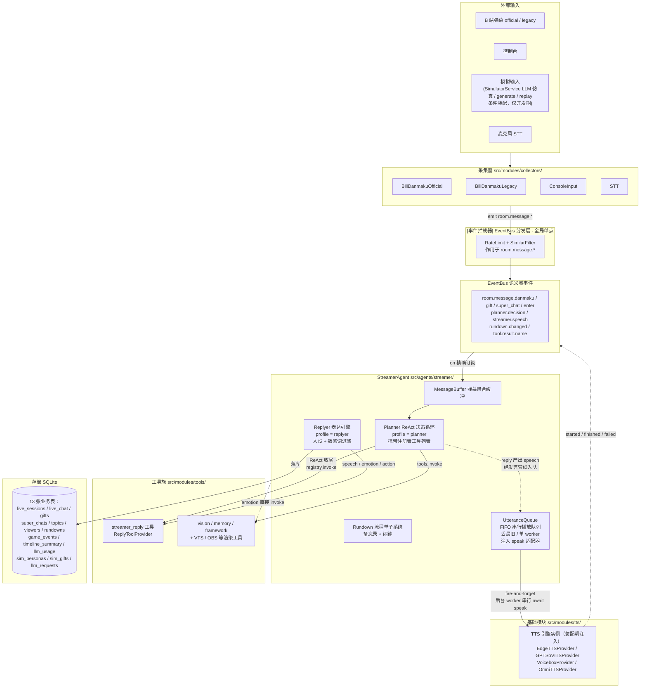

# 数据流规则

> **本文档是 Amaidesu v2 数据流与边界规则的权威定义。** 完整事件表见 [事件系统](event-system.md)；组件清单以代码为唯一事实源（`src/`、`ToolRegistry`）。本文不复制事件表与组件清单，只约束数据怎么走、边界在哪里。

## 架构一句话

**Amaidesu 2.0.0 = Agent（自主主体）+ 工具（能力契约）+ 存储（状态/记忆）+ 编排（Rundown 流程单）。**

v2 不再有 Input/Decision/Output 三阶段流水线，组件通过**语义域事件**（`room.message.*` / `planner.decision` / `rundown.changed` / `tool.result.#` 等）直接互通：采集器持续推入房间消息，事件拦截器在分发层做语义净化，Agent 订阅消费，工具调用渲染输出，存储层落库。

| 我想…… | 查看文档 |
|--------|---------|
| 知道所有事件名、Payload 类型、订阅者 | [事件系统](event-system.md) |
| 知道组件清单与目录结构 | （代码：`src/`、`ToolRegistry`） |
| 知道事件命名规范 | [事件命名](event-naming.md) |
| 知道怎么开发 Agent/工具/采集器 | [组件开发指南](../guides/component.md) |
| **知道数据该往哪儿流、哪儿不能流** | 本文档 |

---

## 1. 事件流向图


```mermaid
flowchart TB
    subgraph Ext["外部输入"]
        Bili["B 站弹幕 official / legacy"]
        Cons["控制台"]
        Sim["模拟输入<br/>(SimulatorService LLM 仿真 / generate / replay<br/>条件装配，仅开发期)"]
        Mic["麦克风 STT"]
    end

    subgraph Collectors["采集器 src/modules/collectors/"]
        direction TB
        C1["BiliDanmakuOfficial"]
        C2["BiliDanmakuLegacy"]
        C3["ConsoleInput"]
        C4["STT"]
    end

    subgraph Interceptors["[事件拦截器] EventBus 分发层 · 全局单点"]
        IC["RateLimit + SimilarFilter<br/>作用于 room.message.*"]
    end

    subgraph Bus["EventBus 语义域事件"]
        EB["room.message.danmaku / gift / super_chat / enter<br/>planner.decision / streamer.speech<br/>rundown.changed / tool.result.name"]
    end

subgraph StreamerAgent["StreamerAgent src/agents/streamer/"]
        MB["MessageBuffer 弹幕聚合缓冲"]
        Planner["Planner ReAct 决策循环<br/>profile = planner<br/>携带注册表工具列表"]
        Reply["Replyer 表达引擎<br/>profile = replyer<br/>人设 + 敏感词过滤"]
        Rundown["Rundown 流程单子系统<br/>备忘录 + 闹钟"]
        UQ["UtteranceQueue<br/>FIFO 串行播放队列<br/>丢最旧 / 单 worker<br/>注入 speak 适配器"]
    end

    subgraph Tools["工具族 src/modules/tools/"]
        RT["streamer_reply 工具<br/>ReplyToolProvider"]
        Other["vision / memory / framework<br/>+ VTS / OBS 等渲染工具"]
    end

    subgraph InFra["基础模块 src/modules/tts/"]
        TTSEng["TTS 引擎实例（装配期注入）<br/>EdgeTTSProvider / GPTSoVITSProvider<br/>VoiceboxProvider / OmniTTSProvider"]
    end

    subgraph Storage["存储 SQLite"]
        DB[("13 张业务表：live_sessions / live_chat / gifts<br/>super_chats / topics / viewers / rundowns<br/>game_events / timeline_summary / llm_usage<br/>sim_personas / sim_gifts / llm_requests")]
    end

    Ext --> Collectors
    Collectors -->|emit room.message.*| IC
    IC --> Bus
    Bus -->|on 精确订阅| MB
    MB --> Planner
    Planner -->|ReAct 收尾<br/>registry.invoke| RT
    Reply -->|speech / emotion / action| RT
    Reply -->|落库| DB
    Planner -->|tools.invoke| Other
    Planner -.->|reply 产出 speech<br/>经发言管线入队| UQ
    UQ -->|fire-and-forget<br/>后台 worker 串行 await speak| TTSEng
    TTSEng -.->|started / finished / failed| Bus
    StreamerAgent -.->|emotion 直接 invoke| Other
```

> 图例说明：实线箭头是当前主链路；虚线箭头是辅助通道（reply 产出的发言入队、TTS 生命周期事件广播、emotion 直调）。Planner 的全部工具调用（含收尾的 streamer_reply）都经 `registry.invoke`——ReAct 循环内同步持有返回值；`tool.result.<name>` 事件是终点广播，供 Dashboard 溯源，Planner 不订阅。reply 结果的 speech 字段由 StreamerAgent 解析后经 UtteranceQueue 串行送入装配期注入的 `tts_engine` 实例（`build_tts_infrastructure` 按 `infra.toml [tts].provider` 单选构造后直接注入 StreamerAgent），由其 `handle_speech(text, utterance_id)` 完成合成 + 播放——不再经 ToolRegistry；emotion 字段由 StreamerAgent 解析后**直接 invoke** `vts_set_expression` 工具，不经事件；TTS 引擎自身（基础模块）播放生命周期发布 `tts.utterance.*` 三事件。皮套口型同步不走数据流通道（见文末"通信机制选型"末段）。

---

## 2. 三条约束层面

### ① 数据平面（硬规则，绝不能破）

运行时消息和工具结果严格单向流动。具体规则：

- **采集器只发布不订阅下游结果事件**。采集器订阅任何下游 Agent/工具结果事件 = 禁止。采集器在 `collect()` 内自行构造 `RoomMessagePayload` 等事件载荷并 emit 到 EventBus（自产自发，基类零转换零兜底），然后退出。
- **工具异步结果走 `tool.result.<tool_name>`，不得回流到任何采集器**。`tool.result.choose_option` 之类的结果事件由需要它的 Agent（如 Planner）订阅以驱动后续动作；任何采集器订阅 `tool.result.#` = 禁止。
- **同步工具调用的返回值天然单向**。`await ToolRegistry.invoke(name, args)` 的返回值由调用方持有，工具实现不感知调用方后续动作，也不得反过来通过事件重新写入。
- **Agent 内部子组件不跨子组件发"决策完成""输出完成"之类胶水事件**。Planner→Replyer 是同 Agent 内部直接 await，不经事件中转。

这条守护的是**防环**：一旦工具结果或 Agent 内部产物能重新写入触发新决策，就会形成"输出→决策→输出"的无限循环。

### ② 分层规则（防 import 环）

跨包只经共享抽象。具体规则：

- **业务包 `src/agents/` 与框架模块 `src/modules/` 不形成运行期反向依赖**。`src/agents/` 可向下 import `src/modules/`，反向运行时不允许——`src/modules/` 不得在 import 时或运行时持有 `src/agents/` 任何实现的实例。两个显式例外：
  - **组合根装配**：装配函数（如 `src/modules/agents/factory.py:instantiate_agent`）在函数体内延迟 import 具体 Agent 实现，仅在构造期执行一次调用，不进入持续运行时依赖。
  - **配置 Schema 聚合**：Schema 聚合层（如 `src/modules/config/agents_schemas.py`）需在模块级 import 各 Agent 的 `Config` 类，以满足 Pydantic `model_rebuild()` 前向引用解析；Schema 仅作为类型引用持有，不实例化 Agent。
- **事件载荷是唯一的跨组件消息模型**：直播间消息统一用 `RoomMessagePayload`（`src/modules/events/payloads/`），采集器产出与 Agent 缓冲/决策消费同一形状，无中间转换。其余共享契约分散在各自域：`Emotion` 枚举在 `src/modules/types/`，`ToolProvider` 协议在 `src/modules/tools/provider.py`。
- **框架层不得含直播/游戏内容特有逻辑**。"MC 怎么挖矿""主播怎么读弹幕"这类内容逻辑必须内聚到 `src/agents/<name>/` 包内（目录名 = Agent 注册名）。框架层只定义协议与基础设施，加新内容=加新 Agent 包+改配置，框架零改动。

这条守护的是**可替换 / 可测试 / 无编译期环**。Agent 不该认识具体工具实现类，只该认识 `ToolRegistry` 抽象和共享层的 Protocol。

### ③ 发现平面（受限放行，允许上行）

"能做什么"这类只读、静态的能力/发现元数据**允许**从工具层上行到 Agent（用于动作选择），但必须满足全部以下条件：

- **只读**：Agent 只查询，不写、不触发工具行为。
- **拉取式（pull）**：由 Agent 主动查询，不是工具推送/广播事件给 Agent。推送会落回 ① 的禁区。
- **经只读抽象**：通过只读 Protocol 或 `ToolRegistry.list_tools()` / `to_llm_definitions()`，Agent 不 import 工具实现。
- **组合根接线**：具体实现只在 `main.py` 注入，组合根允许认识所有层。

**① 和 ③ 的一句话区分**：

> "你能挥手吗？" —— 可以问（发现平面，查询能力空间）。
> "你刚才挥手成功了吗？" —— 不能问（数据平面，结果重新写入会成环）。

动作选择本质上要求 Agent 知道动作空间，因此发现平面的上行信息流是必要且安全的，只要严守上述四个条件即可。这不是对单向数据流的违反，而是对它的精确化。

---

## 3. 防插件换皮红线

v2 不再有"插件系统"。所有新功能通过 Agent 包内聚实现，框架零改动。具体规则：

- **Planner/Replyer 是 StreamerAgent 的内部内部工具，不得注册为工具**。它们是 Agent 的决策循环与表达引擎（`planner.py` / `replyer.py` 同处 `src/agents/streamer/`），内部直接 await，不经 ToolRegistry 中转。"把 Planner 注册成工具"就是插件换皮的典型形态——把 Agent 内部件拆出来假装是工具。
- **内容特有逻辑全部内聚到 `src/agents/<name>/` 包内**（目录名 = Agent 注册名）。例：新增"MC Agent" → 在 `src/agents/minecraft/` 建包，内含 `agent.py`（继承 `BaseAgent`）、`tools.py`（自有工具 spec）、`state.py` 等；Agent 自有工具在 `_register_tools()` 中自己 `registry.register_provider(provider)`；avatar/studio 等公用域工具由装配根 `main.py` 的 `bind_core_tools(registry, tools_cfg)` 按域开关显式注册；启动结束 `audit_tools` 审计。
- **加内容 = 加包 + 配置**，框架层零改动。**禁止**为新功能在 `src/modules/` 加新域；**禁止**通过 monkey-patching 或 import 副作用往框架注入行为。
- **快照型能力是被调才干活的工具，持续流型才是采集器**。`vision_look_at_screen`（截图感知，返回当前画面）是工具，因为它被 LLM 决策时才看一眼；弹幕持续进入（`bili_danmaku` 持续推 `room.message.danmaku`）才是采集器，因为它推"新消息"事件流。判别口诀："谁驱动谁"——能自我维持状态/轮询/心跳的是 Agent，只在被调用时执行的是 Tool。

---

## 4. 禁止模式表

| 禁止模式 | 原因 | 替代方案 |
|---------|------|---------|
| 把 Agent 内部件注册为工具（如 Planner/Replyer） | 插件换皮 | 内部件留在 Agent 包内；LLM 可调的自有工具经 `BaseAgent.list_tools()` 声明并注册进 ToolRegistry（如 StreamerAgent 的 `streamer_reply` 与 `rundown_control`）；`parse_command` 等代码直连原语不是工具、不注册 |
| 内容逻辑写进框架层（`src/modules/`） | 破坏"加包不加框架"红线 | `src/agents/<name>/` 自包含包；框架只保留协议、抽象、跨组件基础设施 |
| 采集器订阅 Agent/工具结果事件（如 `tool.result.#` / `planner.decision`） | 防环；采集器角色定位为"数据生产者" | 采集器只 emit `room.message.*`，订阅交给 Agent 与 Observer |
| Agent import 具体工具实现类 | 耦合到具体实现 | 经 `ToolRegistry.invoke(name, args)` 调用；能力发现走 `ToolRegistry.list_tools()` 或只读 Protocol |
| 快照感知做成采集器（持续 emit "屏幕当前画面"） | 违反主体性判据（无自主循环、无持续事件流价值） | 实现 `ToolProvider` 接口，`invoke()` 时按需截图并返回；不主动推事件 |

---

## 5. 端到端链路示例

下面以"控制台输入 → 主播回复"为完整链路，逐函数核验数据如何流过各组件。该示例对应 `StreamerAgent` 启用 + `ConsoleInputCollector` 启用 + `streamer_reply` 工具在 ToolRegistry 中的默认配置。

```
1. 控制台原始输入
   └─ ConsoleInputCollector._run_input_loop         (console_input_collector.py)
      └─ 构造 RoomMessagePayload(message_type="danmaku", content, user, timestamp_ms)
      └─ await self._emit_semantic_event(payload)
         └─ await event_bus.emit(CoreEvents.ROOM_MESSAGE_DANMAKU, payload, source="ConsoleInput")

2. EventBus 分发（拦截器链 + 精确订阅）
   └─ 拦截器链：RateLimitInterceptor → SimilarFilterInterceptor
      └─ 任一返回 None 即丢弃（不更新统计、不调用任何 handler）
      └─ 放行 → 收集匹配 handlers（精确键 + 通配键并集），并发分发
         └─ StreamerAgent._on_room_message_received  (streamer_agent.py 订阅 room.message 四事件，转 handle_message 统一入口)

3. StreamerAgent 入口（弹幕 → 房间状态 + 缓冲）
   └─ 载荷直通（事件载荷即消息模型，零映射）
   └─ await handle_message(payload)
      ├─ self._room_state.update(msg, now_ms=…)     # 房间热度信号
      ├─ forced = self._timing_gate.is_forced(msg)   # 强制发言判定
      └─ self._buffer.add(msg, arrival_ms=…, forced=forced)

4. 后台 flush 循环（周期性 tick）
   └─ _flush_loop                                   (streamer_agent.py)
      └─ await asyncio.sleep(tick_interval_ms / 1000)
      └─ await self._maybe_flush()
         └─ MessageBuffer.should_flush 判定（条数/时间窗口/forced）
         └─ 命中 → 取批次 → Planner.plan(profile="planner", tools=注册表工具列表)

5. Planner ReAct 循环（查 → 想 → 说）
   └─ llm_service.generate(messages, tools=工具列表, profile="planner")
   └─ 循环：LLM 调注册表工具 → 经 registry.invoke 执行 → 观察以 tool 消息写回 → 再生成
      （有界：planner_max_steps 防失控；自然终止 = LLM 无工具调用 = 本轮不说话）
   └─ 调 streamer_reply → registry.invoke 收尾（ReplyToolProvider 执行）
      └─ Replyer.generate(plan, batch, history, rundown_text)   (replyer.py)
         └─ llm_service.generate(tools=[reply 函数定义], profile="replyer")——LLM 只见 reply
         └─ 解析 {speech, emotion, actions} 三元组
         └─ 敏感词净化（替换/丢弃/放行三策略）
   └─ 无置信度门槛：说与不说由 ReAct 循环内的工具调用行为直接表达（reply_tool 与 Replyer 之间经 `DecisionPlan` 契约传递表达意图）

6. 结果落库 + 发言管线分发
   └─ ToolExecutionResult.success=True，structured_content 为 dict（`{speech, emotion, actions, metadata}`）
   └─ 存储层写入 live_chat 表（danmaku → message；reply → 同表关联 user=bot）
   └─ 空转检测信号由 ProactiveTrigger 承载（BackgroundMaintainer 轻循环供周期 tick；流程单超时提醒走 rundown_overdue 触发源）
   └─ **发言管线消费 reply 结构化结果触发下游扇出**（`speech_dispatcher.py` SpeechDispatcher.dispatch，由 `decision_executor.py` 在决策收口处调用）：
      ├─ speech 非空 → 生成 `utt_{epoch_ms}_{seq}` → UtteranceQueue.enqueue（fire-and-forget）→ 后台 worker 串行 `await speak(text, utterance_id)`（`speak` 是构造期注入的适配器，绑定 `tts_engine.handle_speech`）
      │  └─ `tts_engine` 是装配期由 `build_tts_infrastructure(infra.toml [tts], event_bus)` 按 `[tts].provider` 选中的唯一引擎实例（edge_tts / gptsovits / voicebox / omni_tts），构造期直接注入 StreamerAgent
      │     └─ 引擎播放时按 `tts.utterance.*` 三事件发布生命周期（started / finished / failed）；事件是终点广播，消费者不得触发新决策
      └─ emotion 非空 → **直接 invoke** `vts_set_expression`（不经事件，不入 UtteranceQueue；VTS 仍是 ToolRegistry 中的工具，TTS 不再是）
      └─ actions 列表：逐条经 registry.invoke fire-and-forget 执行（Replyer 输出的动作类工具调用，失败仅记日志不影响决策循环）
```

链路关键性质：

- **每一步都是单向流动**。控制台输入 → EventBus → StreamerAgent → 工具调用 → 返回值，全程无环。Planner→Replyer 是同 Agent 内 await（经 registry 调用而非事件中转）。
- **拦截器层是全局单点**。RateLimit/SimilarFilter 作用于 `room.message.*`，所有订阅者共享净化后的结果。`core.*` / `live.*` / `planner.*` / `tts.utterance.*` 等不经过拦截器。
- **TTS 是基础模块而非工具**。每句 reply 落库即发声——reply 结构化结果的 `speech` 字段由 StreamerAgent 主动入 UtteranceQueue，不依赖 LLM 决策调用 TTS 工具；装配期 `build_tts_infrastructure(infra.toml [tts], event_bus)` 按 `[tts].provider` 单选构造引擎实例并直接注入 StreamerAgent，运行时由 UtteranceQueue 通过注入的 `speak` 适配器调 `engine.handle_speech`——零 Facade 路由层、零 ToolRegistry 条目。`infra.toml [tts]` 自包含（行为参数 + 四引擎子段），`tools.toml` 无任何 TTS 段，详见 ADR-007。
- **空转提醒不经事件**。空闲提醒职责归 ProactiveTrigger 自身（流程单超时提醒是其触发源之一）。

---

## 6. 通信机制选型

v2 中不同数据走不同通道，不要混用：

| 通道 | 用途 | 数据特征 | 典型事件/调用 |
|------|------|---------|--------------|
| **EventBus** | 元数据事件（房间消息、状态变更、工具结果、流程单变更、TTS 生命周期） | 小型 JSON/Pydantic 对象 | `room.message.danmaku` / `tool.result.choose_option` / `rundown.changed` / `tts.utterance.started` |
| **ToolRegistry.invoke** | 同步/异步工具调用 | 调用方持有 `ToolExecutionResult` | `await registry.invoke("streamer_reply", args)` / `await registry.invoke("vts_set_expression", args)` |
| **基础模块直调** | TTS 引擎由装配期注入，运行时绕过 ToolRegistry | 调用方持有引擎实例 | `await tts_engine.handle_speech(text, utterance_id)`（StreamerAgent 内部 speak 适配器；TTS 不在工具池中） |
| **REST 控制面直调** | 运营干预（递话/直派/硬取消；ADR-034） | 同步请求-响应、语义化错误码；意图递给归属组件，不代写账面 | `POST /api/v1/agents/{name}/prompt|delegate|tasks/{id}/cancel` → `AgentControl` |

**EventBus 与 ToolRegistry 的边界**：事件总线是"发生了什么事"的广播；ToolRegistry 是"我要做什么事"的直接调用。同一工具调用既可以同步等结果，也可以 fire-and-forget 后让工具异步 emit `tool.result.<name>` 由订阅者回收——这两种语义都允许，工具实现侧在 `invoke()` 内自行决定。

**TTS 消费者的通道三分法**：不同消费方与语音的时间耦合度不同，通道选择按耦合度匹配：

| 耦合度 | 通道 | 典型消费方 | 数据形态 |
|--------|------|-----------|---------|
| **帧级**（需要逐块 PCM 同步） | **播放器分接（AudioSink 协议）**——已建，详见 ADR-024 | 皮套口型分析（共享分析器） | 原始音频块 |
| **起止对齐**（与播放区间对齐） | **订阅 `tts.utterance.started` / `finished`** | （预留）字幕写入器、播放耗时记账器 | `UtteranceStartedPayload` / `UtteranceFinishedPayload` |
| **无耦合**（独立于播放时机） | **直接 invoke 工具**（不经 TTS 队列、不经事件） | emotion → `vts_set_expression`、action → （暂未接线） | 工具自身契约 |

设计要点：

- **帧级通道已建**：口型同步经播放器分接（AudioSink 协议）承接——播放器把音频复制递入共享口型分析器，各平台渲染器把口型信号翻译为本平台参数（ADR-024，ADR-007 决策 5 的留白已兑现）。
- **事件通道是终点广播**：消费者不得基于 `tts.utterance.*` 触发新一轮决策（"TTS→决策→TTS"会成环）；可做的记账 / 释放锁 / 字幕对齐不构成新决策。
- **直接 invoke 由 Agent 包内完成**：StreamerAgent 解析 `reply.result.content` 后，speech 走 UtteranceQueue → 注入的 `tts_engine.handle_speech`（装配期直连，零 ToolRegistry）；emotion 走直接 `vts_set_expression`（仍在 ToolRegistry 中）；action 当前范围明确不接入决策（独立议题）。

---

## 7. 装配纪律（两段装配）

组合根 `create_app_components`（`main.py`）把装配显式分为两段，这是启动顺序的硬约束：

| 段 | 职责 | 边界 |
|----|------|------|
| **第 ① 段 构造 + 接线** | 存储/LLM/EventBus/拦截器/场次管理/事件历史/StorageLedger/Collector、AgentManager 与全部工具 Provider 的 `event_bus.on` 订阅就位 | **不得改变业务运行态**——不发 `live.started` 等边界事件，不触发任何决策循环 |
| **第 ② 段 启动/触发** | `agent_manager.start_all()`（Agent 订阅生效）→ `simulator_service.setup()`（条件装配，末步 auto_start 可开播）→ DashboardServer | 触发类组件只能在本段启动 |

守护的问题：**边界事件不得漏订阅**。回放模式 `simulator.start()` 经 `open_session` 发 `live.started`——若它发生在 Agent 订阅之前，主播 Agent 的场次进行位（`_live_active`）不会置位，主动发言闸状态即错。因此触发源（simulator 开播、Dashboard 手动开播之外的任何启动期触发）必须排在 `start_all()` 之后；组合根内不允许出现"先触发后订阅"的装配顺序，也不允许组件用"启动时补读全局状态"来兜这类顺序窟窿。

---

## 8. 与其他文档的分工

本文档**只**约束数据怎么走、边界在哪里，不复制事件全表与组件清单。需要查表请走以下链接：

| 我想知道…… | 权威处 |
|----------|--------|
| 全部事件名 + Payload 类型 + 发布者/订阅者 | [事件系统 - 事件事实表](event-system.md#事件事实表与拓扑) |
| 组件清单、目录结构、启动时序 | （代码：`src/`、`ToolRegistry`） |
| 事件命名规范与语义域分层 | [事件命名](event-naming.md) |
| Agent/工具/采集器三范式开发详解 | [组件开发指南](../guides/component.md) |
| 拦截器开发指南 | [事件系统 - 事件拦截器](event-system.md#事件拦截器interceptor) |
| ADR 决策记录 | [架构决策记录](../decisions/README.md) |
