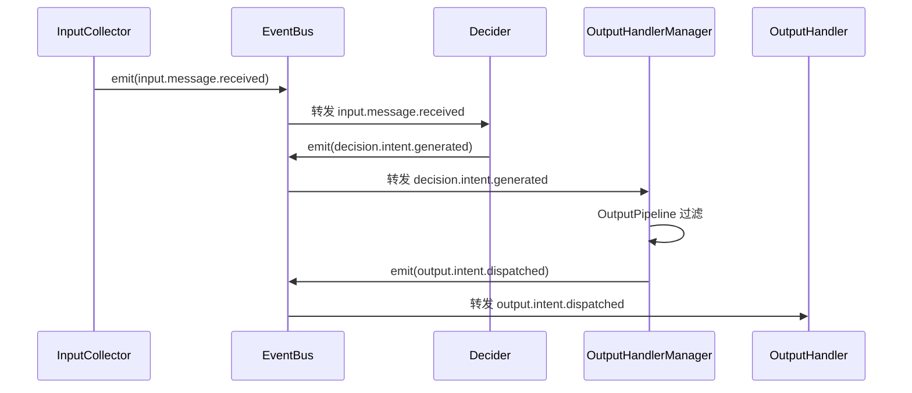

# 事件命名规范

本文档定义了 Amaidesu 项目中事件的命名规范，确保代码库中所有事件名称的一致性和可维护性。

## 命名格式

事件名称遵循以下格式：

```
{domain}.{entity}.{verb}
```

### 组成部分

| 部分 | 说明 | 示例 |
|------|------|------|
| `domain` | **必须** - 事件所属的阶段 | `input`, `decision`, `output`, `core` |
| `entity` | **可选** - 产生事件的实体 | `intent`, `obs`, `message` |
| `verb` | **必须** - 动作或状态描述 | `received`, `generated`, `dispatched`, `connected` |

### 分隔符

- **统一使用点号 (`.`)** 作为分隔符
- **不使用下划线 (`_`)** 作为分隔符
- 实体和动作内部可以使用下划线（如 `send_text`）

### 动词链（verb chain）

事件按阶段流转使用统一的动词后缀，形成清晰的链式语义：

| 阶段 | 动词后缀 | 含义 |
|------|---------|------|
| **Input 阶段** | `...received` | Collector 接收外部数据 |
| **Decision 阶段** | `...generated` | Decider 生成意图 |
| **Output 阶段** | `...dispatched` | OutputHandlerManager 派发渲染（fire-and-forget） |
| **Output 完成（per-handler）** | `...completed` | 每个 handler 在 `handle()` 末尾发，声明自身完成 |
| **Output 完成（聚合）** | `...finished` | OutputHandlerManager 聚合所有 handler 完成后发 |

完整示例：
```
input.message.received  →  decision.intent.generated  →  output.intent.dispatched
        ▲                            ▲                              ▲
   InputCollector                  Decider                  OutputHandlerManager
                                                                      │
                                                                      ↓
                                                   output.handler.completed × N
                                                   (每个 handler 在 finally 里发)
                                                                      │
                                                                      ↓
                                                   output.intent.finished
                                                   (Manager 聚合后广播)
```

> **动词链延伸**：基础流转是 `received → generated → dispatched`；在 Output 阶段内部还有 `dispatched → completed → finished` 的两层聚合时序，详见 [数据流规则](data-flow.md#两层事件聚合模式output-完成时序)。

### 前缀去重

阶段名已隐含组件类型，无需重复：

- ✗ `decision.decider.connected` → ✓ `decision.connected`
- ✗ `input.collector.connected`  → ✓ `input.connected`
- ✗ `output.handler.connected`   → ✓ `output.handler.connected`（保留 handler 以区分组件层）

## 阶段前缀定义

| 阶段 | 前缀 | 说明 | 发布者 |
|----|------|------|--------|
| **Input 阶段** | `input.` | 数据采集、消息接收 | InputCollector |
| **Decision 阶段** | `decision.` | 决策处理、意图生成 | Decider |
| **Output 阶段** | `output.` | 渲染、输出控制 | OutputHandlerManager, OutputHandler |
| **Core** | `core.` | 系统启动、关闭、错误 | 系统核心 |

## 常量命名规范

在 `CoreEvents` 类中定义事件常量时：

1. **使用全大写字母**
2. **使用下划线连接单词**
3. **前缀与阶段对应**

```python
class CoreEvents:
    # Input 阶段
    INPUT_MESSAGE_RECEIVED = "input.message.received"
    INPUT_CONNECTED = "input.connected"
    INPUT_DISCONNECTED = "input.disconnected"

    # Decision 阶段
    DECISION_INTENT_GENERATED = "decision.intent.generated"
    DECISION_CONNECTED = "decision.connected"

    # Output 阶段
    OUTPUT_INTENT_DISPATCHED = "output.intent.dispatched"
    OUTPUT_OBS_COMMAND = "output.obs.command"
```

## 当前事件列表

### Input 阶段

| 常量 | 值 | 说明 |
|------|-----|------|
| `INPUT_MESSAGE_RECEIVED` | `input.message.received` | 标准化消息接收，由 InputCollector 发布 |
| `INPUT_CONNECTED` | `input.connected` | Input 阶段组件连接成功 |
| `INPUT_DISCONNECTED` | `input.disconnected` | Input 阶段组件断开连接 |

### Decision 阶段

| 常量 | 值 | 说明 |
|------|-----|------|
| `DECISION_INTENT_GENERATED` | `decision.intent.generated` | 意图生成完成，由 Decider 发布 |
| `DECISION_CONNECTED` | `decision.connected` | Decider 连接成功 |
| `DECISION_DISCONNECTED` | `decision.disconnected` | Decider 断开连接 |

### Output 阶段

| 常量 | 值 | 说明 |
|------|-----|------|
| `OUTPUT_INTENT_DISPATCHED` | `output.intent.dispatched` | 过滤后意图派发，由 OutputHandlerManager 发布（fire-and-forget，emit 立即返回） |
| `OUTPUT_HANDLER_COMPLETED` | `output.handler.completed` | 单个 OutputHandler 完成通知（两层事件第一层），由各 handler 在 `handle()` 末尾 finally 里发，含 `handler_name` + `intent_id` |
| `OUTPUT_INTENT_FINISHED` | `output.intent.finished` | 所有 active handler 都干完的聚合信号（两层事件第二层），由 OutputHandlerManager 聚合 COMPLETED 后发出，订阅者靠它感知"输出真正结束" |
| `OUTPUT_OBS_COMMAND` | `output.obs.command` | OBS 统一命令入口（通过 payload.action 区分具体操作） |

### Output 阶段（DEPRECATED 兼容垫片）

> 这些常量保留是为了向后兼容外部代码（如 `broadcaster.py`），实际不再发射新事件。

| 常量 | 值 | 说明 |
|------|-----|------|
| `OUTPUT_HANDLER_CONNECTED` | `output.handler.connected` | **DEPRECATED**: 未发射，仅作向后兼容 |
| `OUTPUT_HANDLER_DISCONNECTED` | `output.handler.disconnected` | **DEPRECATED**: 未发射，仅作向后兼容 |

## OBS 统一命令事件（OUTPUT_OBS_COMMAND）

历史版本曾将 OBS 操作拆分为 4 个独立事件（`OUTPUT_OBS_SEND_TEXT`、`OUTPUT_OBS_SWITCH_SCENE`、`OUTPUT_OBS_SET_SOURCE_VISIBILITY`、`OUTPUT_OBS_REQUEST_IMAGE`）。当前重构后**合并为一个统一入口**：

```
output.obs.command
```

### Discriminated Union 设计

所有 OBS 操作共用一个 `OBSCommandPayload`，通过 `action` 字段（Literal 类型）区分具体操作：

```python
@register_event("output.obs.command")
class OBSCommandPayload(BasePayload):
    action: Literal["send_text", "switch_scene", "set_source_visibility", "request_image"]

    # send_text 字段
    text: Optional[str] = None
    source_name: Optional[str] = None

    # switch_scene 字段
    scene_name: Optional[str] = None

    # set_source_visibility 字段
    source_name: Optional[str] = None
    visibility: Optional[bool] = None

    # request_image 字段
    url: Optional[str] = None
    timeout_seconds: Optional[float] = None
    timestamp_ms: Optional[int] = None
```

### 各 action 必填字段速查

| `action` | 必填字段 | 可选字段 |
|---------|---------|---------|
| `send_text` | `text`, `source_name` | - |
| `switch_scene` | `scene_name` | - |
| `set_source_visibility` | `source_name`, `visibility` | - |
| `request_image` | `url` | `timeout_seconds`, `timestamp_ms` |

### 订阅者处理示例

```python
async def _handle_obs_command(self, payload: OBSCommandPayload):
    if payload.action == "send_text":
        await self._send_text_to_obs(payload.text)
    elif payload.action == "switch_scene":
        await self.switch_scene(payload.scene_name)
    elif payload.action == "set_source_visibility":
        await self.set_source_visibility(payload.source_name, payload.visibility)
    elif payload.action == "request_image":
        await self._request_image(payload.url, payload.timeout_seconds)
```

### 为什么合并？

- **接口面更小**：单一事件名，避免订阅者遗漏某一种 action
- **Payload 自描述**：`action` 字段直接表达意图，无需靠事件名推断
- **扩展容易**：新增 OBS 操作只需扩展 Literal，订阅端使用 `elif` 分支即可
- **Payload 集中管理**：所有 OBS 相关字段集中在一处，避免分散定义

## 事件流（verb chain）

```
【Input 阶段】           【Decision 阶段】         【Output 阶段】
      │                          │                          │
      │ INPUT_MESSAGE_RECEIVED   │                          │
      ├─────────────────────────►│                          │
      │                          │ DECISION_INTENT_GENERATED│
      │                          ├─────────────────────────►│
      │                          │                          │ OUTPUT_INTENT_DISPATCHED
      │                          │                          ├──► OutputHandlers
```

### Mermaid 时序图



## 添加新事件

添加新事件时，请遵循以下步骤：

1. **确定阶段前缀**：根据事件的发布者确定阶段前缀
2. **确定实体名**（可选）：如果事件来自特定实体，添加实体名
3. **选择动词后缀**：根据阶段选择 `received` / `generated` / `dispatched` 等
4. **在 `names.py` 中添加常量**：
   ```python
   # 在 CoreEvents 类中添加
   OUTPUT_NEW_ACTION = "output.entity.action_verb"
   ```
5. **在 Payload 模块中使用 `@register_event` 装饰器注册**：
   ```python
   from src.modules.events.registry import register_event
   from pydantic import BaseModel

   @register_event("output.entity.action_verb")
   class NewActionPayload(BasePayload):
       ...
   ```
6. **时间字段命名**：时刻字段以 `_ms` 结尾（int 毫秒），时长字段同样以 `_ms` 结尾（float 毫秒）

## 最佳实践

1. **使用常量**：始终使用 `CoreEvents` 中的常量，不要使用字符串字面量
2. **保持动词链一致**：同一类语义操作在不同阶段使用对应动词后缀（`received` → `generated` → `dispatched`）
3. **简洁明了**：名称应清晰表达事件的含义
4. **避免过度嵌套**：最多使用 3 层（domain.entity.verb）
5. **统一命令优先**：同类多事件可考虑合并为单事件 + discriminated union（参考 OBS_COMMAND）

## 迁移历史

### 2026-06-23：动词链重构 + OBS 合并

- 动词链：`ready → generated → ready` → `received → generated → dispatched`
  - `input.message.ready` → `input.message.received`
  - `output.intent.ready` → `output.intent.dispatched`
- OBS 事件合并：4 个独立事件 → 1 个 `OUTPUT_OBS_COMMAND`（通过 `action` 区分）
  - 删除：`OUTPUT_OBS_SEND_TEXT`、`OUTPUT_OBS_SWITCH_SCENE`、`OUTPUT_OBS_SET_SOURCE_VISIBILITY`、`OUTPUT_OBS_REQUEST_IMAGE`
- 阶段名前缀去重：
  - `decision.decider.connected` → `decision.connected`
  - `input.collector.connected` → `input.connected`

### 2026-02-16：事件命名规范化重构

- `data.message` → `input.message.ready`（后续再次演进为 `input.message.received`）
- `decision.intent` → `decision.intent.generated`
- `output.intent` → `output.intent.ready`（后续再次演进为 `output.intent.dispatched`）
- `obs.*` → `output.obs.*`
- `remote_stream.*` → `output.remote_stream.*`
- 删除了 22 个未使用的事件

---

*最后更新：2026-06-23*