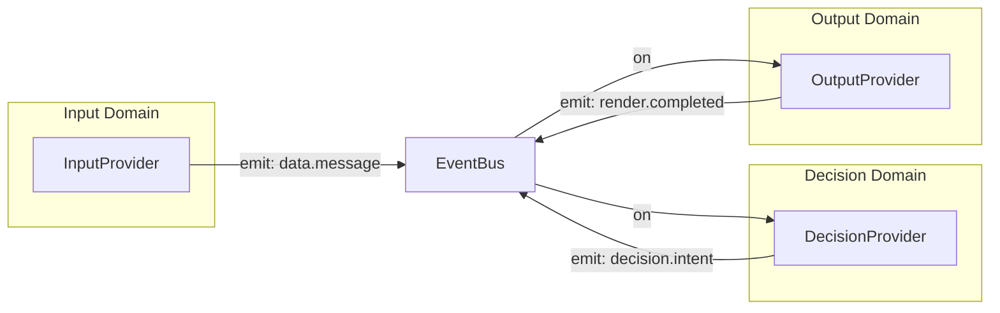
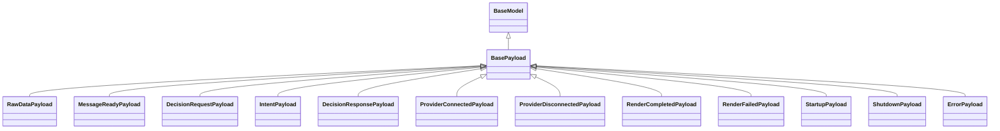
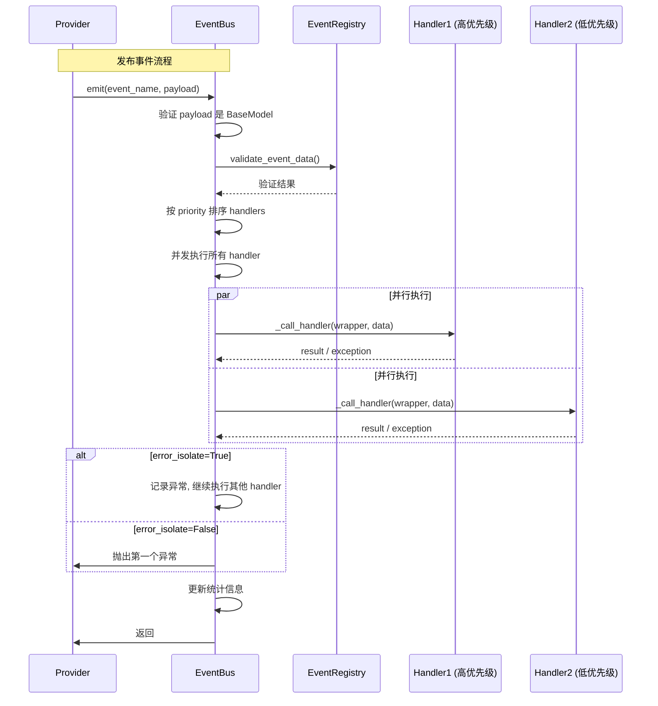
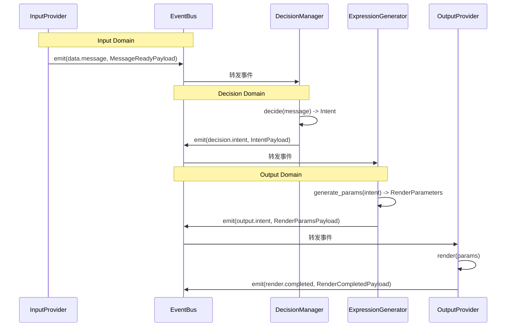

# 事件系统

Amaidesu 项目采用 **发布-订阅（Pub/Sub）模式** 构建事件驱动架构，通过 EventBus 实现组件间的松耦合通信。

## 目录

- [架构概述](#架构概述)
- [核心组件](#核心组件)
- [核心 API](#核心-api)
- [核心事件常量](#核心事件常量)
- [事件载荷类型](#事件载荷类型)
- [核心特性](#核心特性)
- [使用示例](#使用示例)
- [Mermaid 时序图](#mermaid-时序图)
- [最佳实践](#最佳实践)

---

## 架构概述

事件系统是 3 域架构中各组件通信的核心机制：



**数据流规则**：
- **Input Domain** 发布 `data.message` 事件，携带标准化消息
- **Decision Domain** 订阅并处理消息，发布 `decision.intent` 事件
- **Output Domain** 订阅意图事件，执行渲染并发布 `render.completed` 事件

详细规则见 [数据流规则](data-flow.md)。

---

## 核心组件

| 组件 | 文件位置 | 职责 |
|------|----------|------|
| **EventBus** | `src/modules/events/event_bus.py` | 事件总线核心，提供 emit/on/off 等核心 API |
| **EventRegistry** | `src/modules/events/registry.py` | 事件类型注册表，验证事件合法性 |
| **CoreEvents** | `src/modules/events/names.py` | 核心事件名称常量（避免魔法字符串） |
| **Payloads** | `src/modules/events/payloads/*.py` | 事件载荷类型定义（基于 Pydantic） |

### 模块结构

```
src/modules/events/
├── __init__.py           # 模块导出
├── event_bus.py          # EventBus 核心实现
├── registry.py           # 事件注册表
├── names.py              # CoreEvents 常量
└── payloads/
    ├── __init__.py       # Payload 统一导出
    ├── base.py           # BasePayload 基类
    ├── input.py          # Input Domain Payload
    ├── decision.py       # Decision Domain Payload
    ├── output.py         # Output Domain Payload
    └── system.py         # 系统事件 Payload
```

---

## 核心 API

### EventBus 核心方法

```python
from src.modules.events.event_bus import EventBus

# 创建事件总线
event_bus = EventBus(enable_stats=True)
```

#### 发布事件 (emit)

```python
await event_bus.emit(
    event_name: str,              # 事件名称
    data: BaseModel,              # Pydantic Model 实例
    source: str = "unknown",      # 事件源
    error_isolate: bool = True,   # 错误隔离
    wait: bool = False            # 是否等待处理完成
)
```

**参数说明**：

| 参数 | 类型 | 默认值 | 说明 |
|------|------|--------|------|
| `event_name` | `str` | 必填 | 事件名称 |
| `data` | `BaseModel` | 必填 | Pydantic Model 实例 |
| `source` | `str` | `"unknown"` | 事件发布源，通常为 Provider 类名 |
| `error_isolate` | `bool` | `True` | 错误隔离策略 |
| `wait` | `bool` | `False` | 是否等待所有监听器执行完成 |

**error_isolate 行为**：
- `True`：单个 handler 异常不会影响其他 handler 执行
- `False`：第一个异常会传播到调用者，中断所有 handler

**wait 行为**：
- `False`：在后台任务中执行，不等待完成
- `True`：等待所有监听器执行完成后再返回

#### 订阅事件 (on)

```python
event_bus.on(
    event_name: str,               # 事件名称
    handler: Callable,              # 处理函数
    model_class: Type[T],          # Payload 类型（必须）
    priority: int = 100            # 优先级（越小越优先）
)
```

**注意**：EventBus 强制要求类型化订阅，所有订阅必须指定 `model_class`。

#### 取消订阅 (off)

```python
event_bus.off(event_name: str, handler: Callable)
```

#### 生命周期管理

```python
# 清理 EventBus
await event_bus.cleanup(timeout: float = 5.0, force: bool = False)
```

| 参数 | 类型 | 默认值 | 说明 |
|------|------|--------|------|
| `timeout` | `float` | `5.0` | 等待活跃 emit 完成的超时时间（秒） |
| `force` | `bool` | `False` | 是否强制清理（即使有活跃任务） |

#### 统计功能

```python
# 获取单个事件统计
stats = event_bus.get_stats(event_name: str)

# 获取所有事件统计
all_stats = event_bus.get_all_stats()

# 重置统计
event_bus.reset_stats(event_name: Optional[str] = None)
```

**EventStats 结构**：

| 字段 | 类型 | 说明 |
|------|------|------|
| `emit_count` | `int` | 发布次数 |
| `listener_count` | `int` | 监听器数量 |
| `error_count` | `int` | 错误次数 |
| `last_emit_time` | `float` | 最后发布时间（Unix 时间戳） |
| `last_error_time` | `float` | 最后错误时间（Unix 时间戳） |
| `total_execution_time_ms` | `float` | 总执行时间（毫秒） |

---

## 核心事件常量

使用 `CoreEvents` 类获取所有事件常量，避免魔法字符串：

```python
from src.modules.events.names import CoreEvents

# 3域数据流核心事件
CoreEvents.DATA_MESSAGE          # Input → Decision
CoreEvents.DECISION_INTENT       # Decision → Output
CoreEvents.OUTPUT_INTENT         # 过滤后的 Intent

# Decision Domain
CoreEvents.DECISION_REQUEST
CoreEvents.DECISION_RESPONSE_GENERATED
CoreEvents.DECISION_PROVIDER_CONNECTED
CoreEvents.DECISION_PROVIDER_DISCONNECTED

# Output Domain
CoreEvents.RENDER_COMPLETED
CoreEvents.RENDER_FAILED

# 系统事件
CoreEvents.CORE_STARTUP
CoreEvents.CORE_SHUTDOWN
CoreEvents.CORE_ERROR

# STT 事件
CoreEvents.STT_AUDIO_RECEIVED
CoreEvents.STT_SPEECH_STARTED
CoreEvents.STT_SPEECH_ENDED

# 屏幕上下文事件
CoreEvents.SCREEN_CONTEXT_UPDATED
CoreEvents.SCREEN_CHANGED

# 关键词匹配事件
CoreEvents.KEYWORD_MATCHED

# VRChat 事件
CoreEvents.VRCHAT_CONNECTED
CoreEvents.VRCHAT_DISCONNECTED
CoreEvents.VRCHAT_PARAMETER_SENT

# 渲染事件
CoreEvents.RENDER_SUBTITLE
CoreEvents.RENDER_STICKER

# OBS 控制事件
CoreEvents.OBS_SEND_TEXT
CoreEvents.OBS_SWITCH_SCENE
CoreEvents.OBS_SET_SOURCE_VISIBILITY

# 远程流事件
CoreEvents.REMOTE_STREAM_REQUEST_IMAGE

# VTS 相关事件
CoreEvents.VTS_SEND_EMOTION
CoreEvents.VTS_SEND_STATE
```

### 获取所有事件

```python
all_events = CoreEvents.get_all_events()
print(all_events)  # ('data.message', 'decision.intent', ...)
```

---

## 事件载荷类型

所有事件载荷都继承自 `BasePayload`（基于 Pydantic BaseModel），提供统一的字符串表示和日志格式化。

### Payload 继承关系



### 按域分类

#### Input Domain

| Payload 类 | 事件名 | 用途 |
|-----------|--------|------|
| `RawDataPayload` | `data.raw` | 原始数据事件 |
| `MessageReadyPayload` | `data.message` | 标准化消息就绪 |

#### Decision Domain

| Payload 类 | 事件名 | 用途 |
|-----------|--------|------|
| `DecisionRequestPayload` | `decision.request` | 决策请求 |
| `IntentPayload` | `decision.intent` | 意图生成 |
| `IntentActionPayload` | - | 意图动作 |
| `DecisionResponsePayload` | `decision.response_generated` | MaiCore 响应 |
| `ProviderConnectedPayload` | `decision.provider.connected` | Provider 连接 |
| `ProviderDisconnectedPayload` | `decision.provider.disconnected` | Provider 断开 |

#### Output Domain

| Payload 类 | 事件名 | 用途 |
|-----------|--------|------|
| `RenderCompletedPayload` | `render.completed` | 渲染完成 |
| `RenderFailedPayload` | `render.failed` | 渲染失败 |
| `OBSSendTextPayload` | `obs.send_text` | OBS 发送文本 |
| `OBSSwitchScenePayload` | `obs.switch_scene` | OBS 切换场景 |
| `OBSSetSourceVisibilityPayload` | `obs.set_source_visibility` | OBS 设置源可见性 |
| `RemoteStreamRequestImagePayload` | `remote_stream.request_image` | 远程流请求图像 |

#### System

| Payload 类 | 事件名 | 用途 |
|-----------|--------|------|
| `StartupPayload` | `core.startup` | 系统启动 |
| `ShutdownPayload` | `core.shutdown` | 系统关闭 |
| `ErrorPayload` | `core.error` | 系统错误 |

### BasePayload 特性

所有 Payload 继承 `BasePayload`，提供以下特性：

```python
from src.modules.events.payloads.base import BasePayload

class MyPayload(BasePayload):
    """自定义 Payload"""

    text: str
    user_name: str

    def get_log_format(self):
        """自定义日志格式"""
        return self.text, self.user_name, None
```

| 方法 | 说明 |
|------|------|
| `__str__()` | 返回易读的调试字符串 |
| `get_log_format()` | 返回 (text, user_name, extra) 元组，用于日志优化 |
| `_format_field_value()` | 格式化字段值 |

---

## 核心特性

| 特性 | 说明 |
|------|------|
| **错误隔离** | 单个 handler 异常不影响其他 handler 执行 |
| **优先级控制** | `priority` 参数控制 handler 执行顺序（数字越小越优先） |
| **统计功能** | 跟踪 emit 次数、错误率、执行时间 |
| **类型安全** | 强制要求 `model_class` 参数，自动反序列化 |
| **生命周期管理** | `cleanup()` 方法确保优雅关闭 |
| **数据验证** | 支持事件数据格式验证（基于 EventRegistry） |
| **日志优化** | Payload 自定义 `__str__` 和 `get_log_format()` 方法 |
| **并发安全** | 使用锁保护统计数据，支持并发 emit |

---

## 使用示例

### 基本发布-订阅

```python
from src.modules.events.event_bus import EventBus
from src.modules.events.names import CoreEvents
from src.modules.events.payloads import MessageReadyPayload

# 创建事件总线
event_bus = EventBus(enable_stats=True)

# 订阅事件（类型化）
async def handle_message(event_name: str, data: MessageReadyPayload, source: str):
    print(f"收到消息: {data.message.get('text')}")

event_bus.on(
    CoreEvents.DATA_MESSAGE,
    handle_message,
    model_class=MessageReadyPayload,
    priority=50  # 高优先级
)

# 发布事件
await event_bus.emit(
    CoreEvents.DATA_MESSAGE,
    MessageReadyPayload(message={"text": "你好", "source": "console"}, source="console"),
    source="ConsoleInputProvider"
)

# 获取统计
stats = event_bus.get_stats(CoreEvents.DATA_MESSAGE)
print(f"Emit次数: {stats.emit_count}, 监听器数: {stats.listener_count}")

# 清理
await event_bus.cleanup()
```

### Provider 中使用

```python
from src.modules.events.names import CoreEvents
from src.modules.events.payloads import RenderCompletedPayload

class MyOutputProvider(OutputProvider):
    async def _setup_internal(self):
        # 订阅渲染完成事件
        self._event_bus.on(
            CoreEvents.RENDER_COMPLETED,
            self._on_render_completed,
            model_class=RenderCompletedPayload,
        )

    async def _on_render_completed(
        self,
        event_name: str,
        data: RenderCompletedPayload,
        source: str
    ):
        print(f"渲染完成: {data.provider}, 耗时: {data.duration_ms}ms")
```

### 发布系统错误事件

```python
from src.modules.events.names import CoreEvents
from src.modules.events.payloads import ErrorPayload

try:
    # 可能失败的代码
    await do_something()
except Exception as e:
    await event_bus.emit(
        CoreEvents.CORE_ERROR,
        ErrorPayload.from_exception(
            exc=e,
            source="MyProvider",
            recoverable=True,
            context={"endpoint": "ws://localhost:8080"}
        ),
        source="MyProvider"
    )
```

### 发布决策意图

```python
from src.modules.events.names import CoreEvents
from src.modules.events.payloads import IntentPayload

# 从 Intent 对象创建 Payload
intent_payload = IntentPayload.from_intent(intent, provider="maicore")

await event_bus.emit(
    CoreEvents.DECISION_INTENT,
    intent_payload,
    source="DecisionManager"
)
```

---

## Mermaid 时序图

### 事件发布-订阅流程



### 3域数据流事件



---

## 最佳实践

### 1. 使用 CoreEvents 常量

```python
# 避免魔法字符串
await event_bus.emit("data.message", payload)  # 不推荐

# 使用常量
await event_bus.emit(CoreEvents.DATA_MESSAGE, payload) ### 2. # 推荐
```

 正确使用类型化订阅

```python
# 强制指定 model_class
event_bus.on(CoreEvents.DATA_MESSAGE, handler, model_class=MessageReadyPayload)

# 不指定 model_class 会导致无法自动反序列化
```

### 3. 处理错误隔离

```python
# 需要确保所有 handler 都执行（默认）
await event_bus.emit(event, data, error_isolate=True)

# 需要立即知道错误
await event_bus.emit(event, data, error_isolate=False)
```

### 4. 优雅关闭

```python
# 在应用关闭时调用 cleanup
async def shutdown():
    await event_bus.cleanup(timeout=5.0)
    print("EventBus 已清理")
```

### 5. 日志优化

```python
class MyPayload(BasePayload):
    text: str
    user_name: str

    def get_log_format(self):
        # 返回 (文本, 用户名, 额外信息)
        return self.text, self.user_name, None

    def __str__(self):
        return f'{self.text} ({self.user_name})'
```

### 6. 避免循环依赖

根据 3 域架构约束：
- Output Provider 不应订阅 Input 事件
- Decision Provider 不应订阅 Output 事件
- Input Provider 不应订阅 Decision/Output 事件

详见 [数据流规则](data-flow.md)。

---

## 相关文档

- [3域架构](overview.md)
- [数据流规则](data-flow.md)
- [Provider 开发](../development/provider-guide.md)

---

*最后更新：2026-02-15*
