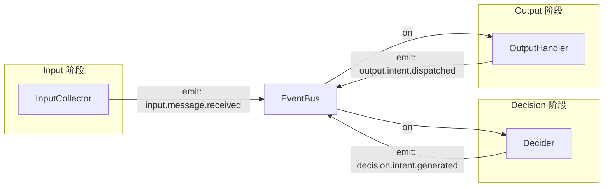
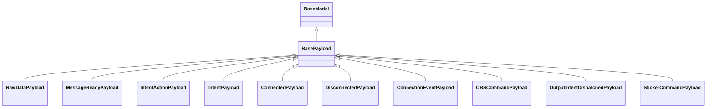
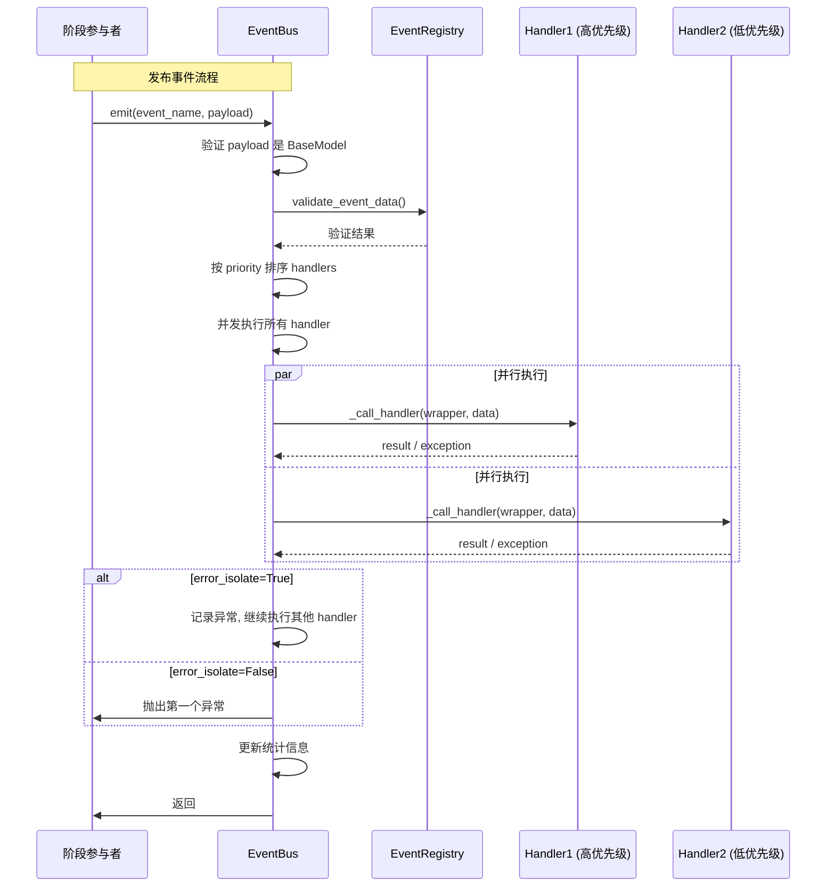
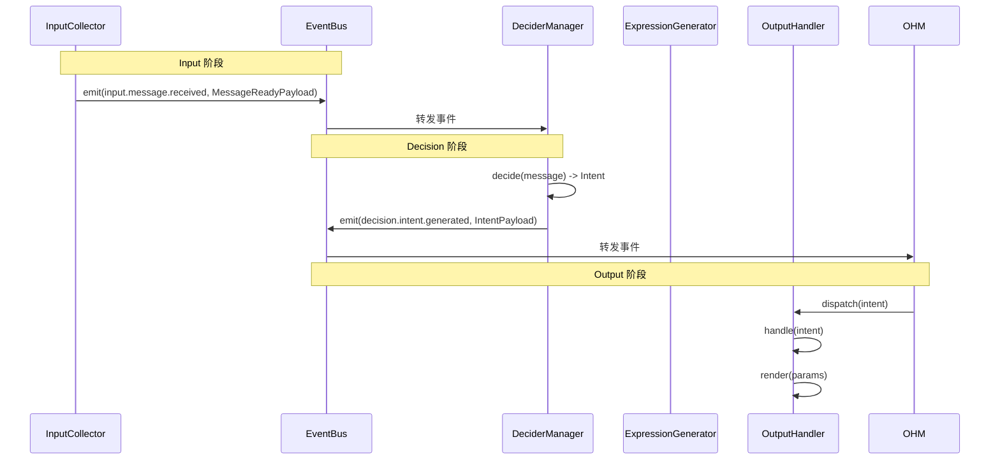

# 事件系统

Amaidesu 项目采用 **发布-订阅（Pub/Sub）模式** 构建事件驱动架构，通过 EventBus 实现组件间的松耦合通信。

## 目录

- [架构概述](#架构概述)
- [核心组件](#核心组件)
- [核心 API](#核心-api)
- [核心事件常量](#核心事件常量)
- [事件载荷类型](#事件载荷类型)
- [核心特性](#核心特性)
- [使用示例](#使用示例)
- [Mermaid 时序图](#mermaid-时序图)
- [最佳实践](#最佳实践)

---

## 架构概述

事件系统是 3 阶段架构中各组件通信的核心机制：


```mermaid
flowchart LR
    subgraph Input[Input 阶段]
        IP[InputCollector]
    end

    subgraph Decision[Decision 阶段]
        DP[Decider]
    end

    subgraph Output[Output 阶段]
        OP[OutputHandler]
    end

    IP -->|emit: input.message.received| EB[EventBus]
    DP -->|emit: decision.intent.generated| EB
    OP -->|emit: output.intent.dispatched| EB

    EB -->|on| DP
    EB -->|on| OP
```

**数据流规则**：
- **Input 阶段** 发布 `input.message.received` 事件，携带标准化消息
- **Decision 阶段** 订阅并处理消息，发布 `decision.intent.generated` 事件
- **Output 阶段** 订阅意图事件，执行渲染并发布 `output.intent.dispatched` 事件

详细规则见 [数据流规则](data-flow.md)。

---

## 核心组件

| 组件 | 文件位置 | 职责 |
|------|----------|------|
| **EventBus** | `src/modules/events/event_bus.py` | 事件总线核心，提供 emit/on/off 等核心 API |
| **EventRegistry** | `src/modules/events/registry.py` | 事件类型注册表，验证事件合法性 |
| **CoreEvents** | `src/modules/events/names.py` | 核心事件名称常量（避免魔法字符串） |
| **Payloads** | `src/modules/events/payloads/*.py` | 事件载荷类型定义（基于 Pydantic） |

### 模块结构

```
src/modules/events/
├── __init__.py           # 模块导出
├── event_bus.py          # EventBus 核心实现
├── registry.py           # 事件注册表
├── names.py              # CoreEvents 常量
└── payloads/
    ├── __init__.py       # Payload 统一导出
    ├── base.py           # BasePayload 基类
    ├── input.py          # Input 阶段 Payload
    ├── decision.py       # Decision 阶段 Payload
    ├── output.py         # Output 阶段 Payload
    └── system.py         # 系统事件 Payload
```

---

## 核心 API

### EventBus 核心方法

```python
from src.modules.events.event_bus import EventBus

# 创建事件总线
event_bus = EventBus(enable_stats=True)
```

#### 发布事件 (emit)

```python
await event_bus.emit(
    event_name: str,              # 事件名称
    data: BaseModel,              # Pydantic Model 实例
    source: str = "unknown",      # 事件源
    error_isolate: bool = True,   # 错误隔离
    wait: bool = False            # 是否等待处理完成
)
```

**参数说明**：

| 参数 | 类型 | 默认值 | 说明 |
|------|------|--------|------|
| `event_name` | `str` | 必填 | 事件名称 |
| `data` | `BaseModel` | 必填 | Pydantic Model 实例 |
| `source` | `str` | `"unknown"` | 事件发布源，通常为 Collector/Decider/Handler 类名 |
| `error_isolate` | `bool` | `True` | 错误隔离策略 |
| `wait` | `bool` | `False` | 是否等待所有监听器执行完成 |

**error_isolate 行为**：
- `True`：单个 handler 异常不会影响其他 handler 执行
- `False`：第一个异常会传播到调用者，中断所有 handler

**wait 行为**：
- `False`：在后台任务中执行，不等待完成
- `True`：等待所有监听器执行完成后再返回

#### 订阅事件 (on)

```python
event_bus.on(
    event_name: str,               # 事件名称
    handler: Callable,              # 处理函数
    model_class: Type[T],          # Payload 类型（必须）
    priority: int = 100            # 优先级（越小越优先）
)
```

**注意**：EventBus 强制要求类型化订阅，所有订阅必须指定 `model_class`。

#### 取消订阅 (off)

```python
event_bus.off(event_name: str, handler: Callable)
```

#### 生命周期管理

```python
# 清理 EventBus
await event_bus.cleanup(timeout: float = 5.0, force: bool = False)
```

| 参数 | 类型 | 默认值 | 说明 |
|------|------|--------|------|
| `timeout` | `float` | `5.0` | 等待活跃 emit 完成的超时时间（秒） |
| `force` | `bool` | `False` | 是否强制清理（即使有活跃任务） |

#### 统计功能

```python
# 获取单个事件统计
stats = event_bus.get_stats(event_name: str)

# 获取所有事件统计
all_stats = event_bus.get_all_stats()

# 重置统计
event_bus.reset_stats(event_name: Optional[str] = None)
```

**EventStats 结构**：

| 字段 | 类型 | 说明 |
|------|------|------|
| `emit_count` | `int` | 发布次数 |
| `listener_count` | `int` | 监听器数量 |
| `error_count` | `int` | 错误次数 |
| `last_emit_time` | `float` | 最后发布时间（Unix 时间戳） |
| `last_error_time` | `float` | 最后错误时间（Unix 时间戳） |
| `total_execution_time_ms` | `float` | 总执行时间（毫秒） |

---

## 核心事件常量

使用 `CoreEvents` 类获取所有事件常量，避免魔法字符串：

```python
from src.modules.events.names import CoreEvents

# ========== Core: 核心系统事件 ==========
CoreEvents.CORE_STARTUP          # core.startup
CoreEvents.CORE_SHUTDOWN         # core.shutdown
CoreEvents.CORE_ERROR            # core.error

# ========== Input 阶段 ==========
CoreEvents.INPUT_MESSAGE_RECEIVED    # input.message.received
CoreEvents.INPUT_CONNECTED           # input.connected
CoreEvents.INPUT_DISCONNECTED        # input.disconnected

# ========== Decision 阶段 ==========
CoreEvents.DECISION_INTENT_GENERATED     # decision.intent.generated
CoreEvents.DECISION_CONNECTED            # decision.connected
CoreEvents.DECISION_DISCONNECTED         # decision.disconnected

# ========== Output 阶段 ==========
CoreEvents.OUTPUT_INTENT_DISPATCHED      # output.intent.dispatched
CoreEvents.OUTPUT_HANDLER_CONNECTED      # DEPRECATED 兼容垫片（不再发射）
CoreEvents.OUTPUT_HANDLER_DISCONNECTED   # DEPRECATED 兼容垫片（不再发射）
CoreEvents.OUTPUT_OBS_COMMAND            # output.obs.command
CoreEvents.OUTPUT_STICKER_COMMAND        # output.sticker.command
```

> **架构演进**：早期版本的事件常量（如 `OBS_SEND_TEXT`/`VTS_SEND_EMOTION`/
> `STT_AUDIO_RECEIVED` 等细粒度事件）已统一收敛为"阶段流转事件 + Payload 内部 command
> 区分"的模式。例如所有 OBS 操作通过 `OUTPUT_OBS_COMMAND` 单一事件分发，
> 具体动作由 `OBSCommandPayload.command` 字段区分。

### 获取所有事件

```python
all_events = CoreEvents.get_all_events()
print(all_events)
# ('core.startup', 'core.shutdown', 'core.error',
#  'input.message.received', 'input.connected', 'input.disconnected',
#  'decision.intent.generated', 'decision.connected', 'decision.disconnected',
#  'output.intent.dispatched', 'output.obs.command', 'output.sticker.command')
```

---

## 事件载荷类型

所有事件载荷都继承自 `BasePayload`（基于 Pydantic BaseModel），提供统一的字符串表示和日志格式化。

### Payload 继承关系


```mermaid
classDiagram
    BaseModel <|-- BasePayload
    BasePayload <|-- RawDataPayload
    BasePayload <|-- MessageReadyPayload
    BasePayload <|-- IntentActionPayload
    BasePayload <|-- IntentPayload
    BasePayload <|-- ConnectedPayload
    BasePayload <|-- DisconnectedPayload
    BasePayload <|-- ConnectionEventPayload
    BasePayload <|-- OBSCommandPayload
    BasePayload <|-- OutputIntentDispatchedPayload
    BasePayload <|-- StickerCommandPayload
```

> **架构演进**：早期版本中散落的 Payload 类（`DecisionRequestPayload`、
> `ProviderConnectedPayload`、`RenderCompletedPayload`、`ErrorPayload` 等）
> 已统一收敛。当前实际存在的 11 个 Payload 类如上图所示，全部定义在
> `src/modules/events/payloads/` 下按阶段分包（`input.py` / `decision.py` /
> `output.py` / `connection.py` / `base.py`）。

### 按阶段分类

#### Input 阶段

| Payload 类 | 事件名 | 用途 |
|-----------|--------|------|
| `RawDataPayload` | `data.raw` | 原始数据事件 |
| `MessageReadyPayload` | `input.message.received` | 标准化消息就绪（Input → Decision） |

#### Decision 阶段

| Payload 类 | 事件名 | 用途 |
|-----------|--------|------|
| `IntentPayload` | `decision.intent.generated` | 决策意图生成（Decision → Output） |
| `IntentActionPayload` | `decision.intent.action` | 意图中的单个动作（结构化输出） |
| `ConnectedPayload` | `decision.connected` | Decider 连接 |
| `DisconnectedPayload` | `decision.disconnected` | Decider 断开 |

#### Connection 通用

| Payload 类 | 事件名 | 用途 |
|-----------|--------|------|
| `ConnectionEventPayload` | 通用 | 输入/决策组件连接状态（共用） |

#### Output 阶段

| Payload 类 | 事件名 | 用途 |
|-----------|--------|------|
| `OutputIntentDispatchedPayload` | `output.intent.dispatched` | 过滤后意图派发（OutputHandlerManager → OutputHandler） |
| `OutputHandlerCompletedPayload` | `output.handler.completed` | 单个 handler 完成通知（两层事件模式第一层，per-handler 完成由 OutputHandlerManager 聚合后再发 FINISHED）。含 `handler_name`、`intent_id`、`success` |
| `IntentPayload`（复用） | `output.intent.finished` | 聚合后"所有 handler 干完"通知（两层事件模式第二层，由 OutputHandlerManager 等齐所有 active handler 的 COMPLETED 后发出） |
| `OBSCommandPayload` | `output.obs.command` | OBS 统一入口（由 payload.command 区分动作） |
| `StickerCommandPayload` | `output.sticker.command` | 贴图命令 |

> **两层事件聚合模式（Output 完成时序）**：`output.intent.dispatched` 默认 fire-and-forget，emit 立即返回而 handler 在后台 task 跑。要准确感知"所有 handler 都干完了"，需要两层：
> - **第一层**：每个 OutputHandler 在 `handle()` 末尾（finally 里以保证异常也发）emit `output.handler.completed`
> - **第二层**：`OutputHandlerManager` 订阅第一层，按 `intent_id` 关联，等所有 active handler 报告完成后再 emit `output.intent.finished`
> - **兜底**：watchdog 超时（`completion_timeout_ms` 默认 30000）防止 handler 漏发导致 FINISHED 永远不发
>
> 任何关心"等输出全部干完"的下游组件（如 MainosabaCollector 推进游戏）应订阅 `output.intent.finished`，而不是 `output.intent.dispatched`。
> 新增 OutputHandler 时必须遵守契约：在 `handle()` 的 `try/finally` 里 emit COMPLETED，`handler_name` 用 `self.__class__.__name__`，`intent_id` 从 `intent.metadata.intent_id` 取，异常路径也要发。基类 `AudioHandlerBase` / `AvatarHandlerBase` 已自动 emit。

> **架构演进**：早期版本中各细粒度事件（`obs.send_text` / `obs.switch_scene` /
> `obs.set_source_visibility` / `render.completed` / `render.failed` /
> `remote_stream.request_image` 等）已统一收敛为"事件 + Payload.command 区分"的模式。
> 一个事件承担一类操作，具体动作由 Payload 内部字段决定。

### BasePayload 特性

所有 Payload 继承 `BasePayload`，提供以下特性：

```python
from src.modules.events.payloads.base import BasePayload

class MyPayload(BasePayload):
    """自定义 Payload"""

    text: str
    user_name: str

    def get_log_format(self):
        """自定义日志格式"""
        return self.text, self.user_name, None
```

| 方法 | 说明 |
|------|------|
| `__str__()` | 返回易读的调试字符串 |
| `get_log_format()` | 返回 (text, user_name, extra) 元组，用于日志优化 |
| `_format_field_value()` | 格式化字段值 |

---

## 核心特性

| 特性 | 说明 |
|------|------|
| **错误隔离** | 单个 handler 异常不影响其他 handler 执行 |
| **优先级控制** | `priority` 参数控制 handler 执行顺序（数字越小越优先） |
| **统计功能** | 跟踪 emit 次数、错误率、执行时间 |
| **类型安全** | 强制要求 `model_class` 参数，自动反序列化 |
| **生命周期管理** | `cleanup()` 方法确保优雅关闭 |
| **数据验证** | 支持事件数据格式验证（基于 EventRegistry） |
| **日志优化** | Payload 自定义 `__str__` 和 `get_log_format()` 方法 |
| **并发安全** | 使用锁保护统计数据，支持并发 emit |

---

## 使用示例

### 基本发布-订阅

```python
from src.modules.events.event_bus import EventBus
from src.modules.events.names import CoreEvents
from src.modules.events.payloads import MessageReadyPayload

# 创建事件总线
event_bus = EventBus(enable_stats=True)

# 订阅事件（类型化）
async def handle_message(event_name: str, data: MessageReadyPayload, source: str):
    print(f"收到消息: {data.message.get('text')}")

event_bus.on(
    CoreEvents.INPUT_MESSAGE_RECEIVED,
    handle_message,
    model_class=MessageReadyPayload,
    priority=50  # 高优先级
)

# 发布事件
await event_bus.emit(
    CoreEvents.INPUT_MESSAGE_RECEIVED,
    MessageReadyPayload(message={"text": "你好", "source": "console"}, source="console"),
    source="ConsoleInputCollector"
)

# 获取统计
stats = event_bus.get_stats(CoreEvents.INPUT_MESSAGE_RECEIVED)
print(f"Emit次数: {stats.emit_count}, 监听器数: {stats.listener_count}")

# 清理
await event_bus.cleanup()
```

### 阶段参与者中使用

```python
from src.modules.events.names import CoreEvents
from src.modules.events.payloads import IntentPayload

class MyOutputHandler(OutputHandler):
    async def _setup_internal(self):
        # 订阅派发后的意图事件
        self._event_bus.on(
            CoreEvents.OUTPUT_INTENT_DISPATCHED,
            self._on_intent_dispatched,
            model_class=IntentPayload,
        )

    async def _on_intent_dispatched(
        self,
        event_name: str,
        data: IntentPayload,
        source: str
    ):
        intent = data.to_intent()
        print(f"收到意图: speech={intent.speech!r}, action={intent.action.name if intent.action else None!r}")
```

### 发布系统错误事件

```python
from src.modules.logging import get_logger

logger = get_logger(__name__)

try:
    # 可能失败的代码
    await do_something()
except Exception as e:
    # 当前 core.error 事件暂未绑定统一 Payload，
    # 业务代码通常直接 logger.exception() 或发布自定义 Payload
    logger.exception("MyHandler 操作失败")
```

### 发布决策意图

```python
from src.modules.events.names import CoreEvents
from src.modules.events.payloads import IntentPayload

# 从 Intent 对象创建 Payload
intent_payload = IntentPayload.from_intent(intent, name="maibot")

await event_bus.emit(
    CoreEvents.DECISION_INTENT_GENERATED,
    intent_payload,
    source="DecisionManager"
)
```

---

## Mermaid 时序图

### 事件发布-订阅流程


```mermaid
sequenceDiagram
    participant P as 阶段参与者
    participant EB as EventBus
    participant ER as EventRegistry
    participant H1 as Handler1 (高优先级)
    participant H2 as Handler2 (低优先级)

    Note over P,EB: 发布事件流程

    P->>EB: emit(event_name, payload)
    EB->>EB: 验证 payload 是 BaseModel

    EB->>ER: validate_event_data()
    ER-->>EB: 验证结果

    EB->>EB: 按 priority 排序 handlers
    EB->>EB: 并发执行所有 handler

    par 并行执行
        EB->>H1: _call_handler(wrapper, data)
        H1-->>EB: result / exception
    and 并行执行
        EB->>H2: _call_handler(wrapper, data)
        H2-->>EB: result / exception
    end

    alt error_isolate=True
        EB->>EB: 记录异常, 继续执行其他 handler
    else error_isolate=False
        EB->>P: 抛出第一个异常
    end

    EB->>EB: 更新统计信息
    EB->>P: 返回
```

### 3阶段数据流事件


```mermaid
sequenceDiagram
    participant IP as InputCollector
    participant EB as EventBus
    participant DM as DeciderManager
    participant EG as ExpressionGenerator
    participant OP as OutputHandler

    Note over IP,EB: Input 阶段

    IP->>EB: emit(input.message.received, MessageReadyPayload)
    EB->>DM: 转发事件

    Note over DM,EB: Decision 阶段

    DM->>DM: decide(message) -> Intent
    DM->>EB: emit(decision.intent.generated, IntentPayload)
    EB->>OHM: 转发事件

    Note over OHM,EB: Output 阶段

    OHM->>OP: dispatch(intent)  # 订阅 output.intent.dispatched
    OP->>OP: handle(intent)
    OP->>OP: render(params)
```

---

## 最佳实践

### 1. 使用 CoreEvents 常量

```python
# 避免魔法字符串
await event_bus.emit("input.message.received", payload)  # 不推荐

# 使用常量
await event_bus.emit(CoreEvents.INPUT_MESSAGE_RECEIVED, payload)  # 推荐
```

### 2. 正确使用类型化订阅

```python
# 强制指定 model_class
event_bus.on(CoreEvents.INPUT_MESSAGE_RECEIVED, handler, model_class=MessageReadyPayload)

# 不指定 model_class 会导致无法自动反序列化
```

### 3. 处理错误隔离

```python
# 需要确保所有 handler 都执行（默认）
await event_bus.emit(event, data, error_isolate=True)

# 需要立即知道错误
await event_bus.emit(event, data, error_isolate=False)
```

### 4. 优雅关闭

```python
# 在应用关闭时调用 cleanup
async def shutdown():
    await event_bus.cleanup(timeout=5.0)
    print("EventBus 已清理")
```

### 5. 日志优化

```python
class MyPayload(BasePayload):
    text: str
    user_name: str

    def get_log_format(self):
        # 返回 (文本, 用户名, 额外信息)
        return self.text, self.user_name, None

    def __str__(self):
        return f'{self.text} ({self.user_name})'
```

### 6. 避免循环依赖

根据 3 阶段架构约束：
- OutputHandler 不应订阅 Input 事件
- Decider 不应订阅 Output 事件
- InputCollector 不应订阅 Decision/Output 的数据事件（`decision.intent.generated` 等）；但 Output 的**元控制信号**（如 `output.intent.finished`，不携带输出结果）可以做为例外

详见 [数据流规则](data-flow.md)。

---

## 相关文档

- [3阶段架构](overview.md)
- [数据流规则](data-flow.md)
- [阶段参与者开发](../development/provider-guide.md)

---

*最后更新：2026-06-28（同步破坏性升级：收敛事件常量 + Payload 类名 + intent 事件名 + from_intent 参数名）*
