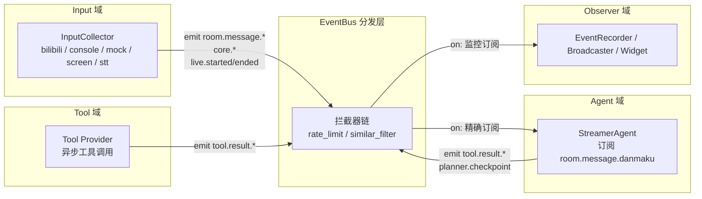
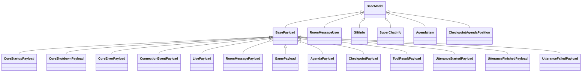
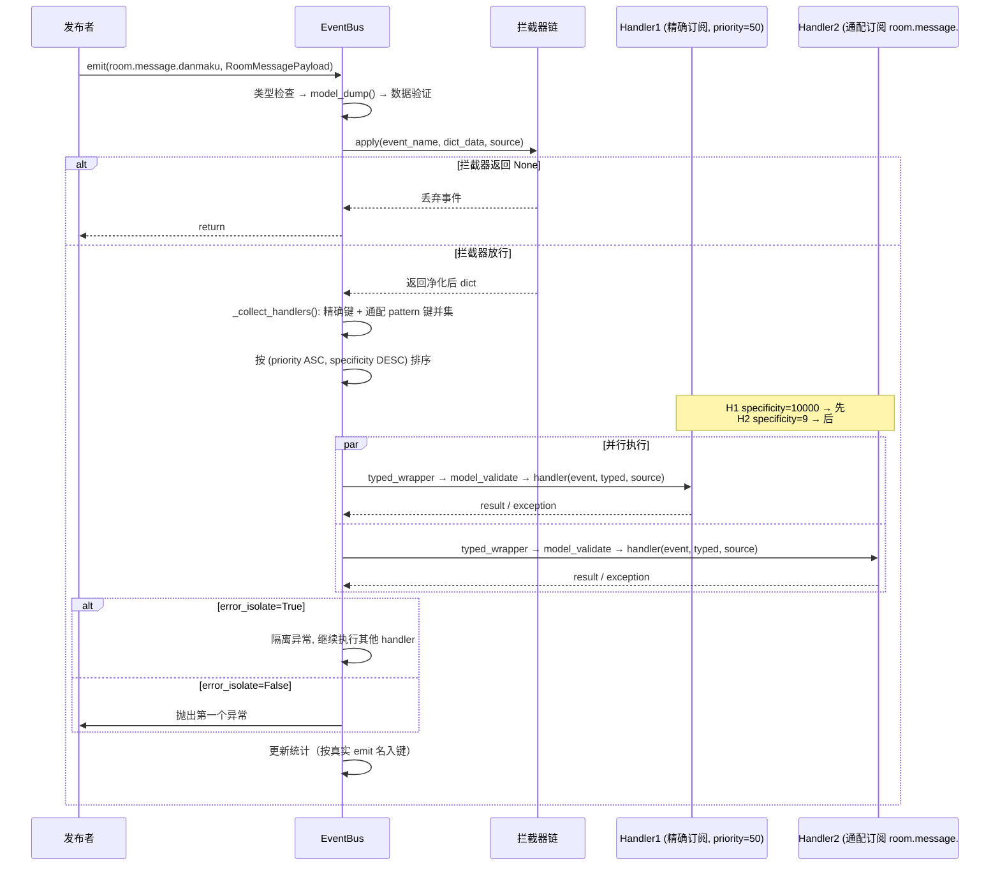
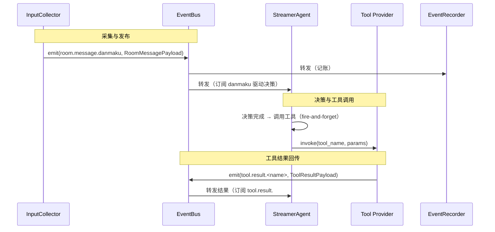

# 事件系统

Amaidesu 项目采用 **发布-订阅（Pub/Sub）模式** 构建事件驱动架构，通过 EventBus 实现组件间的松耦合通信。

> **架构版本**：本文档对应 Amaidesu v2.0.0 **语义域事件**（无三阶段 Input/Decision/Output 概念）；v1 三阶段事件（`input.message.received` / `decision.intent.generated` / `output.intent.*`）已随 v2 重构删除。命名规范详见 [事件命名规范](event-naming-convention.md)。

## 目录

- [架构概述](#架构概述)
- [核心组件](#核心组件)
- [核心 API](#核心-api)
- [通配订阅（MQTT 风格）](#通配订阅mqtt-风格)
- [事件事实表](#事件事实表)
- [事件载荷类型](#事件载荷类型)
- [事件注册机制](#事件注册机制)
- [事件拦截器](#事件拦截器interceptor)
- [时间字段约定](#时间字段约定)
- [核心特性](#核心特性)
- [使用示例](#使用示例)
- [Mermaid 时序图](#mermaid-时序图)
- [最佳实践](#最佳实践)
- [旧名处置说明](#旧名处置说明)

---

## 架构概述

事件系统是 Amaidesu 各组件通信的核心机制。v2 取消了三阶段流水线，组件通过 **语义域事件** 直接互通（Input 域采集 → EventBus → Agent 决策 → 工具调用 → 写入存储；不再经 Decision/Output 阶段事件中转）。


```mermaid
flowchart LR
    subgraph Input 域
        IC[InputCollector<br/>bilibili / console / mock / screen / stt]
    end

    subgraph Bus[EventBus 分发层]
        EB[拦截器链<br/>rate_limit / similar_filter]
    end

    subgraph Agent 域
        AG[StreamerAgent<br/>订阅 room.message.danmaku]
    end

    subgraph Tool 域
        TP[Tool Provider<br/>异步工具调用]
    end

    subgraph Observer 域
        OB[EventRecorder / Broadcaster / Widget]
    end

    IC -->|emit room.message.*<br/>core.*<br/>live.started/ended| EB
    EB -->|on: 精确订阅| AG
    EB -->|on: 监控订阅| OB
    AG -->|emit tool.result.*<br/>planner.checkpoint| EB
    TP -->|emit tool.result.*| EB
```

**数据流规则**：

- 采集器（Input 域）发布 `room.message.*` / `core.*` / `live.*` 等语义域事件，携带结构化 Payload
- Agent 订阅相关事件，决策后通过**工具调用**（fire-and-forget）触发执行
- 工具完成后通过 `tool.result.<tool_name>` 事件回传结果
- EventRecorder / Broadcaster / Widget 等观察器订阅需要监控的事件
- 事件拦截器（§1.46.1）：emit 后、订阅者收到前，事件先过 EventBus 分发层的拦截器链（去重/限流/相似过滤），一次拦截、所有订阅者共享净化后结果

组件间数据流与边界硬约束（采集器不订阅下游结果、Agent 内脏不注册为工具等）见 [数据流与边界规则](data-flow.md)。

---

## 核心组件

| 组件 | 文件位置 | 职责 |
|------|----------|------|
| **EventBus** | `src/modules/events/event_bus.py` | 事件总线核心，提供 emit/on/off 等核心 API；支持精确订阅 + MQTT 风格通配订阅 + 拦截器链 |
| **EventRegistry** | `src/modules/events/registry.py` | 事件类型注册表（查询 API） |
| **CoreEvents** | `src/modules/events/names.py` | 核心事件名称常量（避免魔法字符串） |
| **Payloads** | `src/modules/events/payloads/*.py` | 事件载荷类型定义（基于 Pydantic） |
| **EventInterceptor** | `src/modules/events/interceptors/*.py` | 事件拦截器（分发层全局单点） |

### 模块结构

```
src/modules/events/
├── __init__.py           # 模块导出
├── event_bus.py          # EventBus 核心实现（emit / on / off / 通配 / 拦截器）
├── event_history.py      # 事件历史查询服务
├── event_recorder.py     # 事件记录器（监控组件，订阅语义域事件落库）
├── registry.py           # @register_event 装饰器 + EVENT_REGISTRY
├── names.py              # CoreEvents 常量（17 + 通配占位符；v2.0.10 新增 TTS_UTTERANCE_STARTED/FINISHED/FAILED 三个）
├── event_type_map.py     # 事件名 → 组件类型映射（组件事件专用）
└── payloads/
    ├── __init__.py       # Payload 统一导出（9 个域模块）
    ├── base.py           # BasePayload 基类
    ├── core.py           # core.* Payload（3 个事件分别注册）
    ├── connection.py     # connection.event Payload（通用组件事件）
    ├── live.py           # live.* Payload（一类双注册）
    ├── room.py           # room.message.* Payload（一类四注册）
    ├── game.py           # game.* Payload（一类三注册）
    ├── agenda.py         # agenda.update Payload
    ├── planner.py        # planner.checkpoint Payload
    ├── tool_result.py    # tool.result.* Payload（不绑定具体名）
    └── utterance.py     # tts.utterance.* Payload（三类三注册：started / finished / failed）
```

---

## 核心 API

### EventBus 核心方法

```python
from src.modules.events.event_bus import EventBus

# 创建事件总线
event_bus = EventBus(enable_stats=True)
```

#### 发布事件（emit）

```python
await event_bus.emit(
    event_name: str,              # 事件名称（语义域命名）
    data: BaseModel,              # Pydantic Model 实例（自动 model_dump → model_validate）
    source: str = "unknown",      # 事件源（通常是发布者类名）
    error_isolate: bool = True,   # 错误隔离
    wait: bool = False            # 是否等待处理完成
)
```

**参数说明**：

| 参数 | 类型 | 默认值 | 说明 |
|------|------|--------|------|
| `event_name` | `str` | 必填 | 事件名称（v2 语义域命名，如 `room.message.danmaku`） |
| `data` | `BaseModel` | 必填 | Pydantic Model 实例。EventBus 自动 `model_dump()` 序列化 |
| `source` | `str` | `"unknown"` | 事件发布源，通常为 Collector / Agent / Provider 类名 |
| `error_isolate` | `bool` | `True` | 错误隔离策略 |
| `wait` | `bool` | `False` | 是否等待所有监听器执行完成 |

**error_isolate 行为**：

- `True`：单个 handler 异常不影响其他 handler 执行（异常被隔离并记录日志）
- `False`：第一个异常会传播到调用者，中断所有 handler

**wait 行为**：

- `False`：在后台任务中执行，不等待完成（默认）
- `True`：等待所有监听器执行完成后再返回

**分发流程**（`event_bus.py` L254-259 注释定案）：

1. **类型检查** → `model_dump()` 序列化 → 数据验证
2. **拦截器链**：任一拦截器显式返回 `None` 即丢弃事件（不更新统计、不调用任何 handler）
3. **handler 收集**：精确键 + 所有通配 pattern 键的并集（按 HandlerWrapper 对象身份去重）
4. **handler 排序**：按 `(priority 升序, specificity 降序)`，精确订阅永远先于通配订阅
5. **统计**：始终按真实 emit 的 `event_name` 入键（与通配 pattern 解耦）

#### 订阅事件（on）

```python
event_bus.on(
    event_name: str,               # 事件名称（精确名 或 通配 pattern）
    handler: Callable,              # 处理函数（async 或 sync，sync 自动 run_in_executor）
    model_class: Type[T],          # Payload 类型（**必填**）
    priority: int = 100            # 优先级（越小越优先）
)
```

**model_class 必填**：`on()` 内部 `typed_wrapper` 强制用 `model_class.model_validate(dict_data)` 反序列化。**不指定 model_class 会导致订阅失败 / 类型不安全**。

> 注意：事件记录器（EventRecorder）在订阅 `planner.checkpoint` / `agenda.update` 时显式传 `model_class=None`（v2 兜底，待相关 Payload 模型完全迁移后再补齐）。

#### 取消订阅（off）

```python
event_bus.off(event_name: str, handler: Callable)
```

**通配 pattern 订阅可直接 `off("tool.result.#", handler)` 移除**（pattern 是 `_handlers` 的字典键，复用既有删除路径）。同一 handler 注册到多个 pattern 时，`off` 仅移除指定 pattern 下的那条。

#### 生命周期管理

```python
# 清理 EventBus
await event_bus.cleanup(timeout: float = 5.0, force: bool = False)
```

| 参数 | 类型 | 默认值 | 说明 |
|------|------|--------|------|
| `timeout` | `float` | `5.0` | 等待活跃 emit 完成的超时时间（秒） |
| `force` | `bool` | `False` | 是否强制清理（即使有活跃任务） |

#### 统计功能

```python
# 获取单个事件统计
stats = event_bus.get_stats(event_name: str)

# 获取所有事件统计
all_stats = event_bus.get_all_stats()

# 重置统计
event_bus.reset_stats(event_name: Optional[str] = None)
```

**EventStats 结构**：

| 字段 | 类型 | 说明 |
|------|------|------|
| `emit_count` | `int` | 发布次数 |
| `listener_count` | `int` | 监听器数量 |
| `error_count` | `int` | 错误次数 |
| `last_emit_time` | `float` | 最后发布时间（Unix 时间戳，秒） |
| `last_error_time` | `float` | 最后错误时间（Unix 时间戳，秒） |
| `total_execution_time_ms` | `float` | 总执行时间（毫秒） |

> 统计键是**真实 emit 的 event_name**（与通配 pattern 解耦），保证 `tool.result.#` 通配订阅不影响 `tool.result.speak` / `tool.result.summarize_timeline` 的独立统计。

---

## 通配订阅（MQTT 风格）

EventBus 支持 **MQTT 风格**通配订阅（仅订阅名包含 `*` 或 `#` 时启用通配路径；纯字面量名仍走精确匹配，无额外开销）。

### 语义

| 通配符 | 行为 | 示例 |
|--------|------|------|
| `*` | 消耗**恰好 1 个** dot-separated token（单层） | `room.*` 匹配 `room.message`，**不**匹配 `room.message.danmaku` |
| `#` | **仅在 pattern 末尾**有效，消耗 **≥0 个**剩余 token（多层，可匹配空） | `tool.result.#` 匹配 `tool.result`、`tool.result.speak`、`tool.result.a.b.c` |
| `#`（独立） | 无前缀，匹配一切 | `#` 匹配 `anything.you.want` |

### 匹配示例

| Pattern | 匹配 | 不匹配 |
|---------|------|--------|
| `room.*` | `room.message` | `room.message.danmaku`（`*` 只消耗 1 个 token） |
| `tool.result.#` | `tool.result`、`tool.result.speak`、`tool.result.a.b.c` | `tool.x.speak`（前缀不匹配） |
| `room.message.#` | `room.message.danmaku` 等所有子类 | `room.control`（前缀不匹配） |
| `#` | 所有任何事件 | （独立 # 匹配一切） |
| `room.message.danmaku` | `room.message.danmaku` | `room.message.gift`（字面量 token 必须逐字符相等） |

### Specificity 排序

精确订阅和通配订阅可能同时命中同一事件，EventBus 按 **specificity** 决定谁先执行：

| Token 类型 | Specificity 贡献 |
|------------|------------------|
| 字面量 token（如 `room`、`danmaku`） | **+4** |
| `*` token（单层通配） | +2 |
| `#` token（多层通配） | +1 |
| 精确订阅（`event_name` 是 emit 名本身） | **10000**（固定 `_EXACT_SPECIFICITY`） |

具体计算示例：

| Pattern | Specificity |
|---------|-------------|
| `room.message.danmaku`（精确订阅） | 10000 |
| `a.b`（字面量段） | 8 |
| `room.message.*` | 4+4+2 = **10** |
| `room.message.#` | 4+4+1 = 9 |
| `tool.result.#` | 4+4+1 = 9 |
| `#`（独立） | 1 |

**排序键** = `(priority ASC, specificity DESC)`。精确订阅永远先于通配订阅（specificity=10000 >> 任何通配 pattern 的上界 ≈ 8）。

**通配订阅可直接 `off(pattern, handler)` 移除**（pattern 即 `_handlers` 的字典键）。

### 当前生产状态

> **当前生产代码尚未使用通配订阅**。所有 on() 调用均为精确订阅（如 `event_bus.on(CoreEvents.ROOM_MESSAGE_DANMAKU, ...)`）。通配能力保留供未来扩展（如 Planner 一次性监听所有 `tool.result.#`），可通过 `event_bus.on("tool.result.#", handler, model_class=ToolResultPayload)` 启用，handler 内按 `payload.tool_name` 字段分发。

---

## 事件事实表

> **单一事实源**：本表是 Amaidesu 当前全部 17 个事件常量 + 1 个通配占位符的权威定义。任何新增/删除/重命名事件，**必须先修改本表再写代码**。

事件命名遵循 v2 语义域规范（详见 [事件命名规范](event-naming-convention.md)）：`<域>.<子类>.<动作>`，**域 = 领域**（live/room/game/agenda/planner/tool/core），**不是阶段**。

### 完整事件表

| 事件名 | Payload 类 | 发布者 | 订阅者 | 说明 |
|--------|-----------|--------|--------|------|
| `core.startup` | `CoreStartupPayload` | `main.py` 启动流程 | `EventRecorder`（L64）、`Broadcaster`（L97-100 字典映射 / L120 系统事件循环订阅） | 系统启动通知 |
| `core.shutdown` | `CoreShutdownPayload` | `main.py` 关闭流程 | `EventRecorder`（L65）、`Broadcaster`（L98 / L120） | 系统关闭通知 |
| `core.error` | `CoreErrorPayload` | 各组件错误兜底发射 | `EventRecorder`（L66）、`Broadcaster`（L99 / L120） | 系统级错误 |
| `connection.event` | `ConnectionEventPayload` | 各连接管理组件 | `EventRecorder`（通过 `component_model_map` 注册） | 通用组件连接/断开事件（v2 复用字段填通用组件事件） |
| `live.started` | `LivePayload` | 组合根 / 直播接入层 | 存储（建 `live_sessions` 行）、`RoomState` 记账器 | 开播；Payload 填 `started_at_ms` |
| `live.ended` | `LivePayload` | 组合根 / 直播接入层 | 存储（更新 `live_sessions.ended_at_ms`）、`RoomState` 记账器 | 下播；Payload 填 `ended_at_ms` |
| `room.message.danmaku` | `RoomMessagePayload` | **7 处**：`bilibili/official/collector.py` L263（`bili_danmaku_official_collector.py`）；`bilibili/legacy/collector.py` L247（`bili_danmaku_collector.py`）；`console_input_collector.py` L193（_emit_semantic_event，L36-39 `data_type=text→danmaku` 映射）；`mock_collector.py` L357（直接 emit）/ L382-389（_emit_semantic 映射）；`collectors/base.py` L157-170（兜底转发，`data_type=text→danmaku`）；`dashboard/api/debug.py` L78（debug 注入）；`simulator/service.py` L122 | `StreamerAgent`（`streamer_agent.py` L462-467，priority=50）；`EventRecorder`（`event_recorder.py` L56）；`Broadcaster`（`websocket/broadcaster.py` L95 handler_map / L107-110 `_subscribe_core_events`）；`Widget`（`widget/service.py` L81-85） | 弹幕；Payload `message_type="danmaku"`，填 `content` |
| `room.message.gift` | `RoomMessagePayload` | **5 处**：`bilibili/official/collector.py` L283；`console_input_collector.py` L193（L37 映射 `gift→gift`）；`mock_collector.py` L389（_emit_semantic，L384 映射）；`collectors/base.py` L158（兜底，`data_type=gift→gift`） | `EventRecorder`（L57，**仅记账，决策侧未消费**） | 礼物；Payload `message_type="gift"`，填 `gift` 结构体 |
| `room.message.super_chat` | `RoomMessagePayload` | **5 处**：`bilibili/official/collector.py` L293；`console_input_collector.py` L193（L38 映射）；`mock_collector.py` L389（_emit_semantic，L384 映射）；`collectors/base.py` L159（兜底，`data_type=super_chat→super_chat`） | `EventRecorder`（L58-62，**仅记账，决策侧未消费**） | SuperChat；Payload `message_type="super_chat"`，填 `content` + `sc` |
| `room.message.enter` | `RoomMessagePayload` | **5 处**：`bilibili/official/collector.py` L272；`console_input_collector.py` L193（L39 映射 `guard→enter`）；`mock_collector.py` L389（_emit_semantic，L385 映射）；`collectors/base.py` L160（兜底，`data_type=guard→enter`，guard 大航海并入 enter 无独立事件） | `EventRecorder`（L63，**仅记账，决策侧未消费**） | 进房；Payload `message_type="enter"`。**大航海（guard）无独立事件**，按 enter 语义走（`bili_danmaku_official_collector.py` L294 注释明确） |
| `game.milestone` | `GamePayload` | 游戏 Agent（§1.49 BaseAgent 事件上报面） | `EventRecorder`（L75 `component_model_map`）；`Broadcaster`（通过 `event_type_map` 转发给组件 handler） | 游戏重大进展（挖到钻石 / 通关章节）；`event_type="milestone"` |
| `game.attention_required` | `GamePayload` | 游戏 Agent | `EventRecorder`（L76）；`Broadcaster`（`event_type_map` 转发） | 安全阀偏差报告（"我先回血再去挖钻石"）；`event_type="attention_required"` |
| `game.error` | `GamePayload` | 游戏 Agent | `EventRecorder`（L77）；`Broadcaster`（`event_type_map` 转发） | 游戏异常；`event_type="error"` |
| `agenda.update` | `AgendaPayload` | Planner（调 `update_agenda_item` 工具后）→ 存储更新后发出 | `EventRecorder`（L68，`model_class=None` 兜底） | AgendaItem 运行进度变更（done / schedule / insert） |
| `planner.checkpoint` | `CheckpointPayload` | 空转探测器（后台轻循环，§1.7） | `EventRecorder`（L67，`model_class=None` 兜底）；`Broadcaster`（L96 / L112-115 `_subscribe_core_events`）；`Widget`（`widget/service.py` L88-92） | 空转检查点提醒（纯提醒零决策，携带当前 AgendaItem 定位） |
| `tool.result.<tool_name>` | `ToolResultPayload` | 异步工具执行层（fire-and-forget 完成后） | 订阅者通常用 `tool.result.#` 通配，handler 按 `payload.tool_name` 分发 | **异步工具结果回传**（事件名不固定，emit 时用具体 `tool.result.<tool_name>`，如 `tool.result.speak` / `tool.result.summarize_timeline`） |
| `tool.result.#`（**通配占位符**，**不预注册**到 `EVENT_REGISTRY`） | 无（仅订阅标识） | 无（仅订阅标识） | 无（仅订阅标识） | **仅供订阅者使用的通配 pattern**：订阅 `event_bus.on("tool.result.#", ...)` 一站式监听所有工具结果。`CoreEvents.TOOL_RESULT_WILDCARD = "tool.result.#"`（`names.py` L62）保留作订阅标识常量，**不在 names.py 的 `get_all_events()` 反射收集范围内**（按 `value.islower() and "." in value` 筛选时该字符串通过，但 `_validate_event_data` 找不到具体注册类型时仅 debug 警告，不阻断 emit） |
| `tts.utterance.started` | `UtteranceStartedPayload` | TTS 引擎（基础模块，非工具；`src/modules/tts/` 下 4 个 Provider 之一，按 `core.toml [tts].provider` 装配期单选构造后注入 StreamerAgent）——仅在 `handle_speech` 收到非空 `utterance_id` 参数时发布；流式引擎=首块 PCM 写声卡，全量引擎=`play_audio` 调用 | 字幕写入器、编排层记账器等状态联动消费者（**当前生产代码暂无订阅——字幕订阅接线属后续工作，本表如实标记预留**） | 一次发声开始。Payload 含 `utterance_id`（全链路关联键，编排层生成 `utt_{epoch_ms}_{seq}`）、`speech_text`、`engine`（`edge`/`gptsovits`/`omni`/`voicebox`）、`duration_ms`（Optional[int]：全量引擎=合成后精确值；流式引擎合成未完=None）、`timestamp_ms`。 |
| `tts.utterance.finished` | `UtteranceFinishedPayload` | TTS 引擎（基础模块）在播放完成时刻（百毫秒级精度，不含声卡硬件缓冲残余） | 编排层（句末再决策 / 释放锁）、存储（落 reply 耗时）、后台记账器（**预留**） | 一次发声播放完成。`duration_ms` 由 PCM 样本数÷采样率精确计算；事件名常量 `CoreEvents.TTS_UTTERANCE_FINISHED`。 |
| `tts.utterance.failed` | `UtteranceFailedPayload` | TTS 引擎（基础模块）在合成或播放失败时（合成错误、WebSocket 断开、音频设备异常等任何阶段） | 编排层（错误兜底 / 重试决策）、存储（落失败记录）（**预留**） | 一次发声失败。Payload 含 `error_message`（异常 message / 错误码 / 阶段标记）。事件名常量 `CoreEvents.TTS_UTTERANCE_FAILED`。 |

### 类 → 多事件共享

| Payload 类 | 注册到的事件 |
|---|---|
| `LivePayload` | `live.started` / `live.ended`（`@register_event` 装饰器双重注册，`live.py` L26-27） |
| `RoomMessagePayload` | `room.message.danmaku` / `room.message.gift` / `room.message.super_chat` / `room.message.enter`（`room.py` L81-84 四重注册，按 `message_type` 字段判别） |
| `GamePayload` | `game.milestone` / `game.attention_required` / `game.error`（`game.py` L22-24 三重注册，按 `event_type` 字段判别） |
| `ToolResultPayload` | **不绑定**具体 `tool.result.*` 事件名（`tool_result.py` L22-25 注释明确），emit 时用具体名 `tool.result.<tool_name>`，handler 按 `tool_name` 字段分发 |

### EventRecorder 订阅范围（监控组件典型）

`event_recorder.py` L56-77 一次性订阅以下事件做记账：

- `ROOM_MESSAGE_DANMAKU` / `GIFT` / `SUPER_CHAT` / `ENTER`（4 类 RoomMessagePayload）
- `CORE_STARTUP` / `CORE_SHUTDOWN` / `CORE_ERROR`
- `PLANNER_CHECKPOINT` / `AGENDA_UPDATE`（`model_class=None` 兜底）
- `GAME_MILESTONE` / `GAME_ATTENTION_REQUIRED` / `GAME_ERROR`（通过 `component_model_map` 复用 `ConnectionEventPayload` 类型占位）

> **注意**：当前 `room.message.gift` / `super_chat` / `enter` 三个事件的**订阅者仅 `EventRecorder`**，记账入库但不驱动决策（决策侧仅消费 `danmaku` 高价值信号）。其他潜在订阅点（礼物感谢 / 进房欢迎 / SC 复读）尚未接入，待规划。

---

## 事件载荷类型

所有事件载荷都继承自 `BasePayload`（基于 Pydantic BaseModel），提供统一的字符串表示和日志格式化。

### Payload 继承关系


```mermaid
classDiagram
    BaseModel <|-- BasePayload
    BasePayload <|-- CoreStartupPayload
    BasePayload <|-- CoreShutdownPayload
    BasePayload <|-- CoreErrorPayload
    BasePayload <|-- ConnectionEventPayload
    BasePayload <|-- LivePayload
    BasePayload <|-- RoomMessagePayload
    BasePayload <|-- GamePayload
    BasePayload <|-- AgendaPayload
    BasePayload <|-- CheckpointPayload
    BasePayload <|-- ToolResultPayload
    BasePayload <|-- UtteranceStartedPayload
    BasePayload <|-- UtteranceFinishedPayload
    BasePayload <|-- UtteranceFailedPayload
    BaseModel <|-- RoomMessageUser
    BaseModel <|-- GiftInfo
    BaseModel <|-- SuperChatInfo
    BaseModel <|-- AgendaItem
    BaseModel <|-- CheckpointAgendaPosition
```

> 当前实际存在的 14 个 Payload 类（含 `BasePayload`）+ 5 个嵌套子结构（`RoomMessageUser` / `GiftInfo` / `SuperChatInfo` / `AgendaItem` / `CheckpointAgendaPosition`），全部定义在 `src/modules/events/payloads/` 下按域分包。

### 按域分类

#### Core 系统事件

| Payload 类 | 事件名 | 用途 |
|-----------|--------|------|
| `CoreStartupPayload` | `core.startup` | 系统启动通知（携带 `event` / `message` / `data` 三选一可选字段） |
| `CoreShutdownPayload` | `core.shutdown` | 系统关闭通知 |
| `CoreErrorPayload` | `core.error` | 系统级错误 |

#### Connection 通用

| Payload 类 | 事件名 | 用途 |
|-----------|--------|------|
| `ConnectionEventPayload` | `connection.event` | 通用组件事件（含 `name` / `layer` / `reason` / `will_retry` / `timestamp_ms` / `metadata`） |

#### Live 域（场次生命周期）

| Payload 类 | 事件名 | 用途 |
|-----------|--------|------|
| `LivePayload`（一类双注册） | `live.started` / `live.ended` | 开播 / 下播；通过 `started_at_ms` / `ended_at_ms` 是否为 None 区分语义 |

#### Room 域（直播间行为流）

| Payload 类 | 事件名 | 用途 |
|-----------|--------|------|
| `RoomMessagePayload`（一类四注册） | `room.message.danmaku` / `gift` / `super_chat` / `enter` | 弹幕 / 礼物 / SC / 进房；通过 `message_type: Literal[...]` 字段判别 |

> `room.state.*` 是**预留层**（见 [事件命名规范 §行为 vs 状态分层](event-naming-convention.md)），当前不实现任何事件。

#### Game 域

| Payload 类 | 事件名 | 用途 |
|-----------|--------|------|
| `GamePayload`（一类三注册） | `game.milestone` / `game.attention_required` / `game.error` | 游戏重大进展 / 安全阀偏差 / 异常；通过 `event_type: Literal[...]` 字段判别 |

#### Agenda / Planner 域

| Payload 类 | 事件名 | 用途 |
|-----------|--------|------|
| `AgendaPayload` | `agenda.update` | AgendaItem 运行进度变更（`action: Literal["done","schedule","insert"]`） |
| `CheckpointPayload` | `planner.checkpoint` | 空转检查点提醒（携带 `agenda_item` 定位 + `timeline_summary` + `duration_ms`） |

> **v2.0.8 收口**：原 `Output Sticker（特例）` 节（`output.sticker.command` / `StickerCommandPayload`）已随 C1 治理删除——StickerHelper 零实例化零调用、消费端 VTSProvider 仅空转订阅；接电线也救不了（无 LLM 工具暴露贴纸触发）。未来做表情功能时重新设计，本轮不留事件链。

#### Tool Result 域

| Payload 类 | 事件名 | 用途 |
|-----------|--------|------|
| `ToolResultPayload`（**不绑定**具体事件名） | `tool.result.<tool_name>`（emit 时动态填） | 异步工具结果回传；订阅者用 `tool.result.#` 通配监听后按 `tool_name` 字段分发 |

#### TTS Utterance 域（v2.0.10 新增）

| Payload 类 | 事件名 | 用途 |
|-----------|--------|------|
| `UtteranceStartedPayload` | `tts.utterance.started` | 一次发声开始。Payload 含 `utterance_id`（编排层生成 `utt_{epoch_ms}_{seq}`，全链路关联键）、`speech_text`、`engine`、`duration_ms`（Optional：全量引擎=合成后精确值；流式引擎合成未完=None）、`timestamp_ms`。 |
| `UtteranceFinishedPayload` | `tts.utterance.finished` | 一次发声播放完成。`duration_ms` 由 PCM 样本数÷采样率精确计算（百毫秒级精度，不含声卡硬件缓冲残余）。 |
| `UtteranceFailedPayload` | `tts.utterance.failed` | 一次发声失败（合成错误 / WebSocket 断开 / 音频设备异常）。Payload 含 `error_message`。 |

**契约要点**：

- **发布者**：仅 TTS 引擎自身（基础模块，非工具；`src/modules/tts/` 下 4 个 Provider：`EdgeTTSProvider` / `GPTSoVITSProvider` / `VoiceboxProvider` / `OmniTTSProvider`，由 `build_tts_infrastructure(core [tts], event_bus)` 按 `core.toml [tts].provider` 单选构造后注入 StreamerAgent），且**只在 `handle_speech` 收到非空 `utterance_id` 参数时**发布——调用方（StreamerAgent 通过 UtteranceQueue）未携带该参数则不发事件，纯基础设施语义。
- **started 时机**：流式引擎 = 首块 PCM 写声卡；全量引擎 = `play_audio` 调用。
- **finished 精度**：百毫秒级（不达 DAC 采样点精度）；声卡硬件缓冲残余**不在**信号内，因此 finished 事件是引擎回调信号而非播放端物理信号。
- **订阅者**：当前生产代码**暂无订阅者**——字幕订阅接线属后续工作（事实：现有字幕 Provider 由 `StreamerAgent._dispatch_speech_and_emotion` 通过 speech 文本直接 fire-and-forget，不订阅 utterance 事件）；编排层记账、释放锁等消费者同样预留。Consumer taxonomy 与通道选择依据见 [数据流规则 §6](data-flow.md)。
- **防环约束**：`tts.utterance.*` 是**终点广播**，消费者不得基于这些事件触发新一轮决策（会形成 "TTS→决策→TTS" 无限循环）。
- **发布-only**：TTS 引擎自身只发事件、不订阅任何事件（`utterance_queue.py` 注释明文约束）。
- **Payload 形状差异**：三个事件 Payload 形状不同（started 含 `speech_text` + `duration_ms` 可选；finished 强调播放时长；failed 强调错误信息）——分开定义比统一形状加判别字段更不易误填。

### BasePayload 特性

所有 Payload 继承 `BasePayload`，提供以下特性：

```python
from src.modules.events.payloads.base import BasePayload

class MyPayload(BasePayload):
    """自定义 Payload"""

    text: str
    user_name: str

    def get_log_format(self):
        """自定义日志格式"""
        return self.text, self.user_name, None
```

| 方法/字段 | 说明 |
|------|------|
| `id: str` | 事件唯一 ID（uuid4），`EventBus` 经 `model_dump → model_validate` 分发，所有订阅者从同一 dict 读回该字段，保证记录与广播等通道拿到同一 id（**幂等去重依据**） |
| `__str__()` | 返回易读的调试字符串 |
| `get_log_format()` | 返回 `(text, user_name, extra)` 元组，用于日志优化 |
| `_format_field_value()` | 格式化字段值 |

---

## 事件注册机制

EventBus 通过 `@register_event` 装饰器把 Pydantic Payload 类注册到模块级 `EVENT_REGISTRY` 字典。

### 装饰器 API

```python
from src.modules.events.registry import register_event
from src.modules.events.payloads.base import BasePayload


@register_event("room.message.danmaku")
class RoomMessagePayload(BasePayload):
    ...
```

- **幂等**：同一类重复注册到同一事件名不会出错（`EVENT_REGISTRY[event_name] = cls` 覆盖检查会先比对 `existing is cls`，仅在**不同类型**时抛 `ValueError`）
- **一类多事件名**（v2 增量）：`LivePayload` / `RoomMessagePayload` / `GamePayload` 通过堆叠装饰器注册到多个事件名（`@register_event("live.started") @register_event("live.ended") class LivePayload`）
- **反向引用**：被装饰类获得 `cls._registered_event_name` 属性（单名 = 字符串；多名 = `_MultiName` 对象，与任意已注册名 `==` 相等）
- **`cls._all_registered_names`**：列出全部已注册名（`frozenset[str]`）

### 查询 API

`registry.py` 提供以下查询入口：

| API | 说明 |
|-----|------|
| `EVENT_REGISTRY: Dict[str, Type[BaseModel]]` | 模块级注册表（由装饰器填充） |
| `get_registered_event(name: str) -> Optional[Type[BaseModel]]` | 通过事件名查 Payload 类型 |
| `list_registered_events() -> Dict[str, Type[BaseModel]]` | 列出全部（返回副本） |
| `EventRegistry.get(name)` | 类方法版（同上） |
| `EventRegistry.is_registered(name) -> bool` | 检查是否已注册 |
| `EventRegistry.list_all_events()` | 类方法版（同上） |

### 启动钩子

`registry.register_core_events()` 在应用启动时触发所有 Payload 模块的 import，保证 `@register_event` 装饰器执行：

```python
def register_core_events() -> None:
    from src.modules.events.payloads import (  # noqa: F401
        agenda as _agenda_payloads, connection as _connection_payloads,
        core as _core_payloads, game as _game_payloads,
        live as _live_payloads, planner as _planner_payloads,
        room as _room_payloads, tool_result as _tool_result_payloads,
        utterance as _utterance_payloads,
    )
```

> v2 增量为 9 个 Payload 模块（`agenda` / `connection` / `core` / `game` / `live` / `planner` / `room` / `tool_result` / `utterance`），均在 `register_core_events()` 一并触发 import。`tool_result` 模块即使无具体 `@register_event` 装饰器调用也一并 import 以触发模块级代码（保留供后续扩展）；`utterance` 模块承担 v2.0.10 新增的 `tts.utterance.*` 三事件 Payload。

---

## 事件拦截器（Interceptor）

> **作用域说明**：当前内置拦截器（`RateLimitInterceptor` / `SimilarFilterInterceptor`）作用于 **`room.message.*` 域**事件（v2 语义域，从旧 input pipeline 迁移过来）。其他语义域如 `core.*` / `live.*` / `game.*` 不经拦截器链。

"在事件路上拦一下做点事"的全局单点（§1.46.1，取代旧输入/输出管道）：emit 后、订阅者收到前，**所有事件过同一道拦截器链**。一次拦截，所有订阅者共享净化后结果。

### 位置与语义

```
collectors → emit 事件 → 【事件拦截器 · EventBus 分发层 · 全局一次】→ 订阅者
                            去重 / 限流 / 敏感词 / 转换 / 统计
```

- **与订阅正交**：拦截器处理"数据噪声"，订阅模型处理"谁关心什么"
- **被动驱动**：被事件流触发才干活，不是自主角色

### 核心 API

```python
from src.modules.events.interceptors import EventInterceptor, InterceptorChain

class MyInterceptor(EventInterceptor):
    @property
    def name(self) -> str:
        return "my_filter"

    async def intercept(self, event_name, payload, source):
        # payload 是 model_dump() 后的 dict（可原地修改）
        if is_noise(payload):
            return None          # None = 丢弃事件，handler 不会被调用
        return payload           # dict = 放行（可原地修改后返回）

event_bus.add_interceptor(MyInterceptor())   # 挂载（emit 时自动过链）
event_bus.remove_interceptor("my_filter")    # 按 name 卸载
event_bus.get_interceptor_names()            # 查看已挂载拦截器
```

### 内置拦截器

| 拦截器 | 文件 | 作用域 | 职责 |
|--------|------|--------|------|
| `RateLimitInterceptor` | `interceptors/rate_limit.py` | `room.message.*` | 全局/单用户频率限制（防刷屏） |
| `SimilarFilterInterceptor` | `interceptors/similar_filter.py` | `room.message.*` | 相似文本合并 |

注册入口在 `main.py` 的 `register_event_interceptors()`（L239），配置来自 `core.toml` 的 `[interceptors.<name>]`（`enabled` 缺省视为启用）。

> 敏感词净化不在拦截器层，主播发言统一出口在 Replyer 的 ProfanityFilter（§1.46.1 定案）。

---

## 时间字段约定

项目统一使用**毫秒（ms）**作为时间单位。时刻字段用 `int` Unix epoch 毫秒，时长/超时字段用毫秒，命名统一 `<name>_ms`（如 `timestamp_ms` / `started_at_ms` / `duration_ms`）。

```python
from src.modules.time_utils import now_ms, elapsed_ms, format_duration_ms, ms_to_datetime

ts = now_ms()                        # 当前时刻（int 毫秒）
elapsed = elapsed_ms(start_ms=ts)    # 经过时长
format_duration_ms(1234)             # "1.2s"
```

**注意事项**：

- 禁止使用秒为单位的字段（如 `timestamp_s` / `duration_seconds`），如需人类阅读用 `ms_to_datetime()` 转换
- 历史代码中的 `timestamp` 字段通过 Pydantic `alias` 兼容（`alias="timestamp"`，实际字段为 `timestamp_ms`，见 `connection.py` L22-26）

---

## 核心特性

| 特性 | 说明 |
|------|------|
| **错误隔离** | 单个 handler 异常不影响其他 handler 执行 |
| **优先级控制** | `priority` 参数控制 handler 执行顺序（数字越小越优先） |
| **统计功能** | 跟踪 emit 次数、错误率、执行时间（按真实 emit 名入键） |
| **类型安全** | 强制要求 `model_class` 参数，自动 `model_validate` 反序列化 |
| **生命周期管理** | `cleanup()` 方法确保优雅关闭 |
| **数据验证** | 支持事件数据格式验证（基于 `EventRegistry`；未注册事件仅 debug 警告不阻断） |
| **日志优化** | Payload 自定义 `__str__` 和 `get_log_format()` 方法 |
| **并发安全** | 使用锁保护统计数据，支持并发 emit |
| **通配订阅** | MQTT 风格 `*`（单层）/ `#`（多层，仅末尾），specificity 排序精确订阅先于通配 |
| **拦截器链** | 分发层全局单点，过滤后所有订阅者共享净化结果 |

---

## 使用示例

### 基本发布-订阅（v2 语义域）

```python
from src.modules.events.event_bus import EventBus
from src.modules.events.names import CoreEvents
from src.modules.events.payloads import RoomMessagePayload, RoomMessageUser

# 创建事件总线
event_bus = EventBus(enable_stats=True)

# 订阅事件（类型化）
async def handle_danmaku(event_name: str, data: RoomMessagePayload, source: str):
    print(f"收到弹幕: {data.content} (用户: {data.user.name})")

event_bus.on(
    CoreEvents.ROOM_MESSAGE_DANMAKU,
    handle_danmaku,
    model_class=RoomMessagePayload,
    priority=50,  # 高优先级
)

# 发布事件
await event_bus.emit(
    CoreEvents.ROOM_MESSAGE_DANMAKU,
    RoomMessagePayload(
        live_session_id="ls_20260822_001",
        message_type="danmaku",
        user=RoomMessageUser(id="12345", name="观众A"),
        content="主播好可爱！",
        timestamp_ms=now_ms(),
    ),
    source="BiliDanmakuOfficialCollector",
)

# 获取统计（按真实 emit 名入键，与订阅 pattern 解耦）
stats = event_bus.get_stats(CoreEvents.ROOM_MESSAGE_DANMAKU)
print(f"Emit 次数: {stats.emit_count}, 监听器数: {stats.listener_count}")

# 清理
await event_bus.cleanup()
```

### 通配订阅工具结果

```python
from src.modules.events.payloads import ToolResultPayload


async def handle_any_tool_result(event_name: str, data: ToolResultPayload, source: str):
    # event_name 形如 "tool.result.speak" / "tool.result.summarize_timeline"
    if data.tool_name == "speak":
        await on_speak_completed(data)
    elif data.tool_name == "summarize_timeline":
        await on_timeline_ready(data)

# 一站式监听所有工具结果（MQTT 风格通配）
event_bus.on(
    CoreEvents.TOOL_RESULT_WILDCARD,  # "tool.result.#"
    handle_any_tool_result,
    model_class=ToolResultPayload,
)

# emit 时使用具体名
await event_bus.emit(
    "tool.result.speak",
    ToolResultPayload(
        tool_name="speak",
        status="success",
        result={"speech_text": "你好！", "audio_duration_ms": 3200},
    ),
    source="speak_tool",
)
# emit 时通过拦截器链 → 精确键 + tool.result.# 通配键合并 → handle_any_tool_result 收到一次事件
```

### 发布系统错误事件

```python
from src.modules.logging import get_logger

logger = get_logger(__name__)

try:
    await do_something()
except Exception as e:
    # core.error 已绑定 CoreErrorPayload（Broadcaster/EventRecorder 会订阅），
    # 但业务代码通常直接 logger.exception() 记录，不主动发布 core.error
    logger.exception("MyHandler 操作失败")
```

### BasePayload 自定义日志格式

```python
class MyPayload(BasePayload):
    text: str
    user_name: str

    def get_log_format(self):
        # 返回 (文本, 用户名, 额外信息)
        return self.text, self.user_name, None

    def __str__(self):
        return f'{self.text} ({self.user_name})'
```

---

## Mermaid 时序图

### 事件发布-订阅流程（含拦截器 + 通配）


```mermaid
sequenceDiagram
    participant P as 发布者
    participant EB as EventBus
    participant IC as 拦截器链
    participant H1 as Handler1 (精确订阅, priority=50)
    participant H2 as Handler2 (通配订阅 room.message.#)

    P->>EB: emit(room.message.danmaku, RoomMessagePayload)
    EB->>EB: 类型检查 → model_dump() → 数据验证

    EB->>IC: apply(event_name, dict_data, source)
    alt 拦截器返回 None
        IC-->>EB: 丢弃事件
        EB-->>P: return
    else 拦截器放行
        IC-->>EB: 返回净化后 dict
        EB->>EB: _collect_handlers(): 精确键 + 通配 pattern 键并集
        EB->>EB: 按 (priority ASC, specificity DESC) 排序
        Note over H1,H2: H1 specificity=10000 → 先<br/>H2 specificity=9 → 后

        par 并行执行
            EB->>H1: typed_wrapper → model_validate → handler(event, typed, source)
            H1-->>EB: result / exception
        and
            EB->>H2: typed_wrapper → model_validate → handler(event, typed, source)
            H2-->>EB: result / exception
        end

        alt error_isolate=True
            EB->>EB: 隔离异常, 继续执行其他 handler
        else error_isolate=False
            EB->>P: 抛出第一个异常
        end

        EB->>EB: 更新统计（按真实 emit 名入键）
    end
```

### v2 数据流时序


```mermaid
sequenceDiagram
    participant IC as InputCollector
    participant EB as EventBus
    participant AG as StreamerAgent
    participant TP as Tool Provider
    participant OB as EventRecorder

    Note over IC,EB: 采集与发布

    IC->>EB: emit(room.message.danmaku, RoomMessagePayload)
    EB->>OB: 转发（记账）
    EB->>AG: 转发（订阅 danmaku 驱动决策）

    Note over AG,TP: 决策与工具调用

    AG->>AG: 决策完成 → 调用工具（fire-and-forget）
    AG->>TP: invoke(tool_name, params)

    Note over TP,EB: 工具结果回传

    TP->>EB: emit(tool.result.<name>, ToolResultPayload)
    EB->>AG: 转发结果（订阅 tool.result.# 或具体名）
```

---

## 最佳实践

### 1. 使用 CoreEvents 常量

```python
# 避免魔法字符串
await event_bus.emit("room.message.danmaku", payload)  # 不推荐

# 使用常量
await event_bus.emit(CoreEvents.ROOM_MESSAGE_DANMAKU, payload)  # 推荐
```

### 2. 正确使用类型化订阅

```python
# 强制指定 model_class（on() 内部 typed_wrapper 会自动 model_validate）
event_bus.on(CoreEvents.ROOM_MESSAGE_DANMAKU, handler, model_class=RoomMessagePayload)

# 不指定 model_class 会导致订阅失败 / 类型不安全
```

### 3. 处理错误隔离

```python
# 需要确保所有 handler 都执行（默认）
await event_bus.emit(event, data, error_isolate=True)

# 需要立即知道错误
await event_bus.emit(event, data, error_isolate=False)
```

### 4. 优雅关闭

```python
async def shutdown():
    await event_bus.cleanup(timeout=5.0)
    print("EventBus 已清理")
```

### 5. 避免循环依赖

根据 v2 数据流约束（详见 [数据流规则](data-flow.md)）：

- Agent / Tool 不应订阅 Output 阶段事件（v2 已无 Output 阶段，但"组件订阅下游结果事件"模式仍禁止）
- Input 采集器只发布数据，不订阅下游结果
- 工具是被动调用方，**不订阅 Input 事件**（仅 fire-and-forget 后回传 `tool.result.*`）

### 6. 通配订阅的边界

- **优先用精确订阅**：specificity 更高、语义更清晰、调试更直观
- **仅在需要一站式捕获时**用通配（如 `tool.result.#` 监听所有工具结果）
- handler 内按 Payload 内部字段（`message_type` / `event_type` / `tool_name`）分发，避免靠事件名字符串做 if/elif

### 7. 日志优化

```python
class MyPayload(BasePayload):
    text: str
    user_name: str

    def get_log_format(self):
        return self.text, self.user_name, None

    def __str__(self):
        return f'{self.text} ({self.user_name})'
```

---

## 旧名处置说明

> **v1 三阶段事件（`input.message.received` / `decision.intent.generated` / `output.intent.dispatched` / `output.intent.finished` / `output.handler.completed` / `output.obs.command` / `output.handler.connected` 等）已随 v2 重构删除**。`names.py` 中仅存划线标记（`~~decision.intent.generated~~` 等迁移注释），不提供常量定义。代码中残留的旧名字符串均为迁移注释（如 `src/agents/streamer/__init__.py` L34、`src/modules/collectors/mock/mock_collector.py` L12、`src/modules/simulator/service.py` L10），不参与运行时事件分发。

如发现代码中实际 emit / on 旧名事件（**非注释**），按"重构未完成"缺陷处理，须立即改为对应 v2 语义域事件。

---

## 相关文档

- [3 阶段架构总览](overview.md)
- [数据流规则](data-flow.md)
- [事件命名规范](event-naming-convention.md)
- [阶段参与者开发](../development/component-guide.md)
- [架构决策记录](adr/README.md)

---

*最后更新：2026-09-05（v2.0.12 §8 概念修正：TTS 提升为基础设施。事件事实表 `tts.utterance.*` 三事件发布者由"TTS 引擎工具自身"改为"TTS 引擎（基础模块，非工具）"+ 装配期单选构造注入 StreamerAgent 说明；TTS Utterance 域小节发布者条款改写："发布者"由"TTS 引擎工具自身 + `invoke` 收到非空 `utterance_id`"改为"TTS 引擎自身（基础模块，非工具）+ `handle_speech` 收到非空 `utterance_id`"；订阅者段 [数据流规则] 章节锚点 §5 → §6（消费者通道三分法已迁至 §6）；Payload 形状差异、终点广播防环约束、发布-only 三条不变；同日术语统一：'退役出工具池'改为'提升为基础设施'（避免误导为降级））*

*上次更新：2026-08-25（v2.0.0 语义域事件对齐：移除三阶段事件表，新增 15 常量 + 通配占位符事实表，新增 MQTT 通配订阅章节，重写 Payload/订阅者/拦截器作用域）*