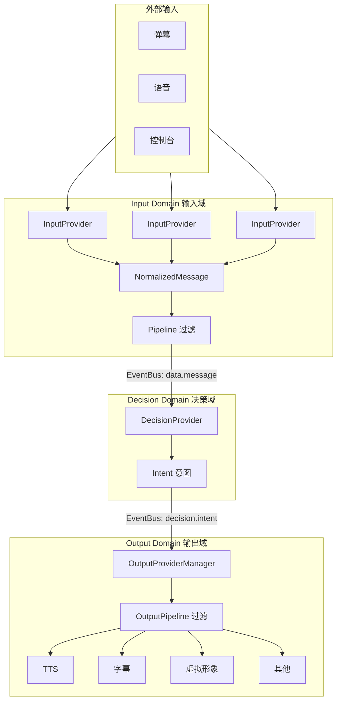
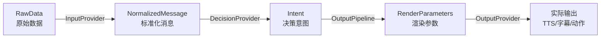
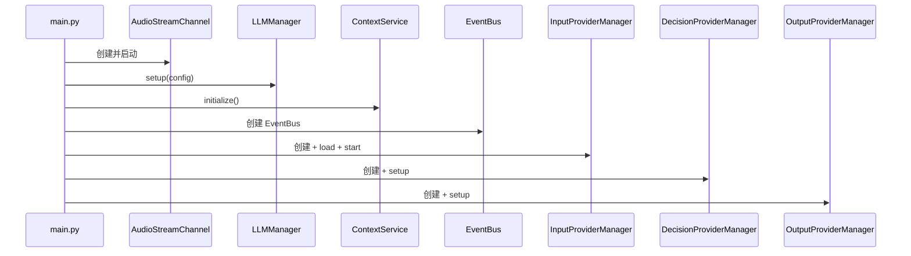

# 架构总览

Amaidesu 是一个 **AI VTuber 框架**，采用 **3 域架构（Three-Domain Architecture）** 实现从外部输入到多端输出的完整数据流处理。

## 核心架构



## 数据流

```
外部输入（弹幕、游戏、语音）
        ↓
【Input Domain】InputProvider → NormalizedMessage → Pipeline 过滤
        ↓ EventBus: data.message
【Decision Domain】DecisionProvider → Intent
        ↓ EventBus: decision.intent
【Output Domain】OutputProviderManager → OutputPipeline → OutputProviders
```

### 数据类型流



## 目录结构

```
Amaidesu/
├── main.py                      # CLI 入口，程序启动入口
├── config-template.toml         # 配置模板
├── config.toml                  # 运行时配置（自动生成）
├── src/
│   ├── domains/                 # 业务域（三域架构）
│   │   ├── input/               # 输入域
│   │   │   ├── provider_manager.py
│   │   │   ├── pipelines/       # 输入管道
│   │   │   │   ├── rate_limit/  # 频率限制管道
│   │   │   │   └── similar_filter/ # 相似过滤管道
│   │   │   └── providers/       # 输入 Provider
│   │   │       ├── console_input/
│   │   │       ├── bili_danmaku/
│   │   │       ├── bili_danmaku_official/
│   │   │       ├── bili_danmaku_official_maicraft/
│   │   │       ├── mainosaba/
│   │   │       ├── mock_danmaku/
│   │   │       ├── read_pingmu/
│   │   │       └── stt/
│   │   ├── decision/            # 决策域
│   │   │   ├── provider_manager.py
│   │   │   └── providers/       # 决策 Provider
│   │   │       ├── maicore/
│   │   │       ├── llm/
│   │   │       ├── maicraft/
│   │   │       └── replay/
│   │   └── output/              # 输出域
│   │       ├── provider_manager.py
│   │       ├── pipelines/       # 输出管道
│   │       │   └── profanity_filter/
│   │       └── providers/       # 输出 Provider
│   │           ├── audio/       # TTS 音频
│   │           │   ├── edge_tts/
│   │           │   ├── gptsovits/
│   │           │   └── omni_tts/
│   │           ├── avatar/      # 虚拟形象
│   │           │   ├── vts/
│   │           │   ├── warudo/
│   │           │   └── vrchat/
│   │           ├── subtitle/
│   │           ├── sticker/
│   │           ├── obs_control/
│   │           ├── remote_stream/
│   │           ├── debug_console/
│   │           └── mock/
│   ├── modules/                 # 核心模块（共享基础设施）
│   │   ├── config/             # 配置管理
│   │   ├── context/            # 上下文服务
│   │   ├── di/                 # 依赖注入
│   │   ├── events/             # 事件系统
│   │   ├── llm/                # LLM 服务
│   │   ├── logging/            # 日志系统
│   │   ├── prompts/            # 提示词管理
│   │   ├── registry/          # Provider 注册表
│   │   ├── streaming/          # 音频流通道
│   │   ├── tts/                # TTS 管理
│   │   └── types/              # 共享类型
│   │       ├── base/           # 基础类型
│   │       └── intent.py       # 意图类型
│   └── services/               # 共享服务
└── docs/                       # 项目文档
    ├── architecture/           # 架构文档
    └── development/            # 开发指南
```

## 组件关系

### 启动流程



**组件创建顺序**：

1. **AudioStreamChannel** - 音频流通道
2. **LLMManager** - LLM 服务管理
3. **ContextService** - 上下文服务
4. **EventBus** - 事件总线
5. **InputProviderManager** - 输入域管理
6. **DecisionProviderManager** - 决策域管理
7. **OutputProviderManager** - 输出域管理

## Provider 列表

### InputProvider（8个）

| 名称 | 说明 | 位置 |
|------|------|------|
| console_input | 控制台输入 | `src/domains/input/providers/console_input/` |
| bili_danmaku | B站弹幕（第三方API） | `src/domains/input/providers/bili_danmaku/` |
| bili_danmaku_official | B站弹幕（官方WebSocket） | `src/domains/input/providers/bili_danmaku_official/` |
| bili_danmaku_official_maicraft | B站弹幕（Maicraft优化版） | `src/domains/input/providers/bili_danmaku_official_maicraft/` |
| mainosaba | Mainosaba输入 | `src/domains/input/providers/mainosaba/` |
| mock_danmaku | 模拟弹幕（测试用） | `src/domains/input/providers/mock_danmaku/` |
| read_pingmu | PingMu读取 | `src/domains/input/providers/read_pingmu/` |
| stt | 语音识别 | `src/domains/input/providers/stt/` |

### DecisionProvider（4个）

| 名称 | 说明 | 位置 |
|------|------|------|
| maicore | MaiCore 决策（默认） | `src/domains/decision/providers/maicore/` |
| llm | 本地 LLM 决策 | `src/domains/decision/providers/llm/` |
| maicraft | Maicraft 规则引擎 | `src/domains/decision/providers/maicraft/` |
| replay | 回放决策（调试用） | `src/domains/decision/providers/replay/` |

### OutputProvider（12个）

#### 音频输出（TTS）

| 名称 | 说明 | 位置 |
|------|------|------|
| edge_tts | Edge TTS | `src/domains/output/providers/audio/edge_tts/` |
| gptsovits | GPT-SoVITS TTS | `src/domains/output/providers/audio/gptsovits/` |
| omni_tts | Omni TTS | `src/domains/output/providers/audio/omni_tts/` |

#### 虚拟形象

| 名称 | 说明 | 位置 |
|------|------|------|
| vts | VTubeStudio | `src/domains/output/providers/avatar/vts/` |
| warudo | Warudo 控制 | `src/domains/output/providers/avatar/warudo/` |
| vrchat | VRChat | `src/domains/output/providers/avatar/vrchat/` |

#### 其他输出

| 名称 | 说明 | 位置 |
|------|------|------|
| subtitle | 字幕渲染 | `src/domains/output/providers/subtitle/` |
| sticker | 表情贴纸 | `src/domains/output/providers/sticker/` |
| obs_control | OBS 控制 | `src/domains/output/providers/obs_control/` |
| remote_stream | 远程流输出 | `src/domains/output/providers/remote_stream/` |
| debug_console | 调试控制台输出 | `src/domains/output/providers/debug_console/` |
| mock | 模拟输出（测试用） | `src/domains/output/providers/mock/` |

## 核心概念

### Provider 生命周期

| Provider 类型 | 启动方法 | 停止方法 | 说明 |
|--------------|---------|---------|------|
| InputProvider | `start()` | `stop()` | 返回 AsyncIterator，用于数据流生成 |
| DecisionProvider | `setup()` | `cleanup()` | 注册到 EventBus，处理消息 |
| OutputProvider | `setup()` | `cleanup()` | 注册到 EventBus，渲染参数 |

**注意**：
- InputProvider 使用 `start()`/`stop()` 是因为它需要返回异步生成器（AsyncIterator）
- Decision/OutputProvider 使用 `setup()`/`cleanup()` 是因为它们是事件订阅者

### 事件系统

项目使用 **EventBus** 作为唯一的跨域通信机制：

| 事件名 | 发布者 | 订阅者 | 数据类型 |
|--------|--------|--------|---------|
| `data.message` | Input Domain | Decision Domain | `NormalizedMessage` |
| `decision.intent` | Decision Domain | Output Domain | `Intent` |
| `output.params` | ExpressionGenerator | OutputProviders | `RenderParameters` |

### 管道（Pipeline）

管道用于在消息处理流程中进行预处理/后处理：

**输入管道（Input Pipeline）**：
- `rate_limit` - 频率限制
- `similar_filter` - 相似消息过滤

**输出管道（Output Pipeline）**：
- `profanity_filter` - 脏话过滤

### 音频流系统

**AudioStreamChannel** 是专门的音频数据传输通道，与 EventBus 分离，用于高效传输大量音频数据。

- **EventBus**: 用于元数据事件（开始/结束/状态通知）
- **AudioStreamChannel**: 用于音频数据流（chunk 数据传输）

**TTS Provider** 通过 AudioStreamChannel 发布音频：
1. 调用 `notify_start(AudioMetadata(...))` 通知开始
2. 循环调用 `publish(AudioChunk(...))` 发布音频块
3. 调用 `notify_end(AudioMetadata(...))` 通知结束

**Avatar Provider** 订阅 AudioStreamChannel 接收音频：
- 接收 AudioChunk
- 重采样到目标采样率
- 处理音频数据（口型同步等）

## 核心设计原则

### 1. 依赖注入

所有服务通过 `ProviderContext` 注入，避免硬编码：

```python
# Provider 通过 _dependencies 获取依赖
self.audio_stream_channel = self._dependencies.get("audio_stream_channel")
self.event_bus = self._dependencies.get("event_bus")
```

### 2. 配置驱动

通过 TOML 配置文件启用/禁用 Provider：

```toml
# 输入 Provider
[providers.input]
enabled_inputs = ["console_input", "bili_danmaku"]

# 决策 Provider
[providers.decision]
active_provider = "maicore"

# 输出 Provider
[providers.output]
enabled_outputs = ["tts", "subtitle", "vts"]
```

### 3. 错误隔离

单个 Provider 失败不影响其他 Provider，每个 Provider 的错误都被隔离处理。

### 4. 数据流规则

**严格遵守单向数据流**：
- Input Domain -> Decision Domain -> Output Domain
- 禁止 Output Provider 订阅 Input 事件
- 禁止 Decision Provider 订阅 Output 事件
- Input Provider 应只发布，不订阅下游

### 5. 类型安全

- 所有 Provider 都继承基类，提供统一的接口
- 使用 Pydantic BaseModel 定义所有数据模型
- 使用类型注解确保类型安全

## 相关文档

- [数据流规则](data-flow.md) - 数据流约束和规则
- [事件系统](event-system.md) - EventBus 使用指南
- [Provider 开发](../development/provider-guide.md) - Provider 开发详解
- [管道开发](../development/pipeline-guide.md) - Pipeline 开发详解

---

*最后更新：2026-02-15*
