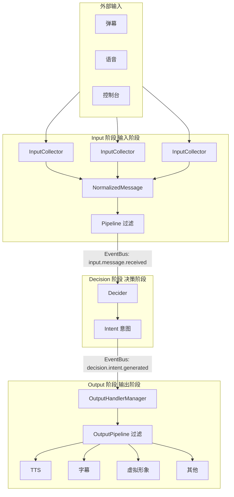
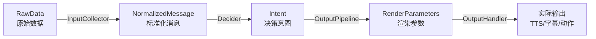
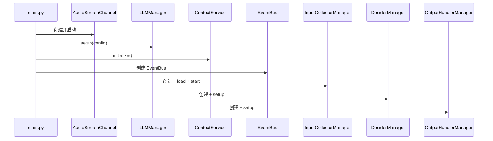

# 架构总览

 Amaidesu 是一个 **AI VTuber 框架**，采用 **3 阶段架构** 实现从外部输入到多端输出的完整数据流处理。

## 核心架构


```mermaid
flowchart TB
    subgraph External["外部输入"]
        Danmaku["弹幕"]
        Voice["语音"]
        Console["控制台"]
    end

    subgraph InputStage["Input 阶段 输入阶段"]
        direction TB
        IP1[InputCollector]
        IP2[InputCollector]
        IP3[InputCollector]
        NM[NormalizedMessage]
        Pipeline[Pipeline 过滤]
    end

    subgraph DecisionStage["Decision 阶段 决策阶段"]
        DP[Decider]
        Intent[Intent 意图]
    end

    subgraph OutputStage["Output 阶段 输出阶段"]
        direction TB
        OPM[OutputHandlerManager]
        OPipeline[OutputPipeline 过滤]
        OP1[TTS]
        OP2[字幕]
        OP3[虚拟形象]
        OP4[其他]
    end

    External --> IP1
    External --> IP2
    External --> IP3
    IP1 --> NM
    IP2 --> NM
    IP3 --> NM
    NM --> Pipeline
    Pipeline -->|"EventBus: input.message.received"| DP
    DP --> Intent
    Intent -->|"EventBus: decision.intent.generated"| OPM
    OPM --> OPipeline
    OPipeline --> OP1
    OPipeline --> OP2
    OPipeline --> OP3
    OPipeline --> OP4
```

## 数据流

```
外部输入（弹幕、游戏、语音）
        ↓
【Input 阶段】InputCollector → NormalizedMessage → Pipeline 过滤
        ↓ EventBus: input.message.received
【Decision 阶段】Decider → Intent
        ↓ EventBus: decision.intent.generated
【Output 阶段】OutputHandlerManager → OutputPipeline → OutputHandlers
```

### 数据类型流


```mermaid
flowchart LR
    RD[RawData<br/>原始数据] -->|InputCollector| NM[NormalizedMessage<br/>标准化消息]
    NM -->|Decider| I[Intent<br/>决策意图]
    I -->|OutputPipeline| RP[RenderParameters<br/>渲染参数]
    RP -->|OutputHandler| AO[实际输出<br/>TTS/字幕/动作]
```

## 目录结构

```
Amaidesu/
├── main.py                      # CLI 入口，程序启动入口
├── config/                      # 配置目录（多文件结构，首次运行自动生成）
├── src/
│   ├── stages/                  # 业务阶段
     │   │   ├── input/               # 输入阶段
     │   │   │   ├── collector_manager.py
     │   │   │   ├── pipelines/       # 输入管道
     │   │   │   │   ├── rate_limit/  # 频率限制管道
     │   │   │   │   └── similar_filter/ # 相似过滤管道
     │   │   │   └── collectors/       # 输入 Collector
     │   │   │       ├── console_input/
      │   │   │       ├── bili_danmaku/
      │   │   │       ├── bili_danmaku_official/
      │   │   │       ├── mainosaba/
     │   │   │       ├── mock_danmaku/
     │   │   │       ├── read_pingmu/
     │   │   │       └── stt/
     │   │   ├── decision/            # 决策阶段
     │   │   │   ├── decider_manager.py
     │   │   │   └── deciders/       # 决策 Decider
      │   │   │       ├── maibot/
      │   │   │       ├── llm/
      │   │   │       ├── command/
      │   │   │       └── replay/
     │   │   └── output/              # 输出阶段
     │   │       ├── handler_manager.py
     │   │       ├── pipelines/       # 输出管道
     │   │       │   └── profanity_filter/
     │   │       └── handlers/       # 输出 Handler
     │   │           ├── audio/       # TTS 音频
     │   │           │   ├── edge_tts/
     │   │           │   ├── gptsovits/
     │   │           │   └── omni_tts/
     │   │           ├── avatar/      # 虚拟形象
     │   │           │   ├── vts/
     │   │           │   ├── warudo/
     │   │           │   └── vrchat/
     │   │           ├── subtitle/
     │   │           ├── sticker/
     │   │           ├── obs_control/
     │   │           ├── remote_stream/
     │   │           ├── debug_console/
     │   │           └── mock/
     │   ├── modules/                 # 核心模块（共享基础设施）
     │   │   ├── config/             # 配置管理
     │   │   ├── context/            # 上下文服务
     │   │   ├── di/                 # 依赖注入
     │   │   ├── events/             # 事件系统
     │   │   ├── llm/                # LLM 服务
     │   │   ├── logging/            # 日志系统
     │   │   ├── prompts/            # 提示词管理
     │   │   ├── registry/          # 阶段参与者注册表
     │   │   ├── streaming/          # 音频流通道
     │   │   ├── tts/                # TTS 管理
     │   │   └── types/              # 共享类型
     │   │       ├── base/           # 基础类型
     │   │       └── intent.py       # 意图类型
     │   └── services/               # 共享服务
└── docs/                       # 项目文档
    ├── architecture/           # 架构文档
    └── development/            # 开发指南
```

## 组件关系

### 启动流程


```mermaid
sequenceDiagram
    participant Main as main.py
    participant Audio as AudioStreamChannel
    participant LLM as LLMManager
    participant Context as ContextService
    participant Event as EventBus
    participant Input as InputCollectorManager
    participant Decision as DeciderManager
    participant Output as OutputHandlerManager

    Main->>Audio: 创建并启动
    Main->>LLM: setup(config)
    Main->>Context: initialize()
    Main->>Event: 创建 EventBus
    Main->>Input: 创建 + load + start
    Main->>Decision: 创建 + setup
    Main->>Output: 创建 + setup
```

**组件创建顺序**：

1. **AudioStreamChannel** - 音频流通道
2. **LLMManager** - LLM 服务管理
3. **ContextService** - 上下文服务
4. **EventBus** - 事件总线
5. **InputCollectorManager** - 输入阶段管理
6. **DeciderManager** - 决策阶段管理
7. **OutputHandlerManager** - 输出阶段管理

## 阶段参与者列表

### InputCollector（8个）

| 名称 | 说明 | 位置 |
|------|------|------|
| console_input | 控制台输入 | `src/stages/input/collectors/console_input/` |
| bili_danmaku | B站弹幕（第三方API） | `src/stages/input/collectors/bili_danmaku/` |
| bili_danmaku_official | B站弹幕（官方WebSocket） | `src/stages/input/collectors/bili_danmaku_official/` |
| mainosaba | Mainosaba输入 | `src/stages/input/collectors/mainosaba/` |
| mock_danmaku | 模拟弹幕（测试用） | `src/stages/input/collectors/mock_danmaku/` |
| read_pingmu | PingMu读取 | `src/stages/input/collectors/read_pingmu/` |
| stt | 语音识别 | `src/stages/input/collectors/stt/` |

### Decider（4个）

| 名称 | 说明 | 位置 |
|------|------|------|
| maibot | MaiBot 决策（默认） | `src/stages/decision/deciders/maibot/` |
| llm | 本地 LLM 决策 | `src/stages/decision/deciders/llm/` |
| command | 通用命令意图路由 | `src/stages/decision/deciders/command/` |
| replay | 回放决策（调试用） | `src/stages/decision/deciders/replay/` |

### OutputHandler（12个）

#### 音频输出（TTS）

| 名称 | 说明 | 位置 |
|------|------|------|
| edge_tts | Edge TTS | `src/stages/output/handlers/audio/edge_tts/` |
| gptsovits | GPT-SoVITS TTS | `src/stages/output/handlers/audio/gptsovits/` |
| omni_tts | Omni TTS | `src/stages/output/handlers/audio/omni_tts/` |

#### 虚拟形象

| 名称 | 说明 | 位置 |
|------|------|------|
| vts | VTubeStudio | `src/stages/output/handlers/avatar/vts/` |
| warudo | Warudo 控制 | `src/stages/output/handlers/avatar/warudo/` |
| vrchat | VRChat | `src/stages/output/handlers/avatar/vrchat/` |

#### 其他输出

| 名称 | 说明 | 位置 |
|------|------|------|
| subtitle | 字幕渲染 | `src/stages/output/handlers/subtitle/` |
| sticker | 表情贴纸 | `src/stages/output/handlers/sticker/` |
| obs_control | OBS 控制 | `src/stages/output/handlers/obs_control/` |
| remote_stream | 远程流输出 | `src/stages/output/handlers/remote_stream/` |
| debug_console | 调试控制台输出 | `src/stages/output/handlers/debug_console/` |
| mock | 模拟输出（测试用） | `src/stages/output/handlers/mock/` |

## 核心概念

### 阶段参与者生命周期

| 参与者类型 | 启动方法 | 停止方法 | 说明 |
|--------------|---------|---------|------|
| InputCollector | `start()` | `stop()` | 返回 AsyncIterator，用于数据流生成 |
| Decider | `setup()` | `cleanup()` | 注册到 EventBus，处理消息 |
| OutputHandler | `setup()` | `cleanup()` | 注册到 EventBus，渲染参数 |

**注意**：
- InputCollector 使用 `start()`/`stop()` 是因为它需要返回异步生成器（AsyncIterator）
- Decider/OutputHandler 使用 `setup()`/`cleanup()` 是因为它们是事件订阅者

### 事件系统

项目使用 **EventBus** 作为唯一的跨阶段通信机制：

| 事件名 | 发布者 | 订阅者 | 数据类型 |
|--------|--------|--------|---------|
| `input.message.received` | Input 阶段 | Decision 阶段 | `MessageReadyPayload`（NormalizedMessage 字典） |
| `decision.intent.generated` | Decision 阶段 | OutputHandlerManager | `IntentPayload`（Intent 字典） |
| `output.intent.dispatched` | OutputHandlerManager | OutputHandlers | `OutputIntentDispatchedPayload` |

### 管道（Pipeline）

管道用于在消息处理流程中进行预处理/后处理：

**输入管道（Input Pipeline）**：
- `rate_limit` - 频率限制
- `similar_filter` - 相似消息过滤

**输出管道（Output Pipeline）**：
- `profanity_filter` - 脏话过滤

### 音频流系统

**AudioStreamChannel** 是专门的音频数据传输通道，与 EventBus 分离，用于高效传输大量音频数据。

- **EventBus**: 用于元数据事件（开始/结束/状态通知）
- **AudioStreamChannel**: 用于音频数据流（chunk 数据传输）

**TTS Handler** 通过 AudioStreamChannel 发布音频：
1. 调用 `notify_start(AudioMetadata(...))` 通知开始
2. 循环调用 `publish(AudioChunk(...))` 发布音频块
3. 调用 `notify_end(AudioMetadata(...))` 通知结束

**Avatar Handler** 订阅 AudioStreamChannel 接收音频：
- 接收 AudioChunk
- 重采样到目标采样率
- 处理音频数据（口型同步等）

## 核心设计原则

### 1. 依赖注入

所有服务通过构造器注入，避免硬编码：

```python
def __init__(
    self,
    config: Dict[str, Any],
    event_bus: EventBus,
    audio_stream_channel: AudioStreamChannel,
):
    self.audio_stream_channel = audio_stream_channel
    self.event_bus = event_bus
```

### 2. 配置驱动

通过 TOML 配置文件启用/禁用阶段参与者：

```toml
# 输入 Collector
[collectors]
enabled = ["console_input", "bili_danmaku"]

# 决策 Decider
[deciders]
active = "maibot"

# 输出 Handler
[handlers]
enabled = ["tts", "subtitle", "vts"]
```

### 3. 错误隔离

单个 Handler 失败不影响其他 Handler，每个 Handler 的错误都被隔离处理。

### 4. 数据流规则

**严格遵守单向数据流**：
- Input 阶段 -> Decision 阶段 -> Output 阶段
- 禁止 OutputHandler 订阅 Input 事件
- 禁止 Decider 订阅 Output 事件
- InputCollector 应只发布，不订阅下游

### 5. 类型安全

- 所有阶段参与者都继承基类，提供统一的接口
- 使用 Pydantic BaseModel 定义所有数据模型
- 使用类型注解确保类型安全

## 相关文档

- [数据流规则](data-flow.md) - 数据流约束和规则
- [事件系统](event-system.md) - EventBus 使用指南
- [阶段参与者开发](../development/provider-guide.md) - 阶段参与者开发详解
- [管道开发](../development/pipeline-guide.md) - Pipeline 开发详解

---

*最后更新：2026-06-28（同步事件名重命名 data.message→input.message.received / decision.intent→decision.intent.generated / output.params→output.intent.dispatched）*
