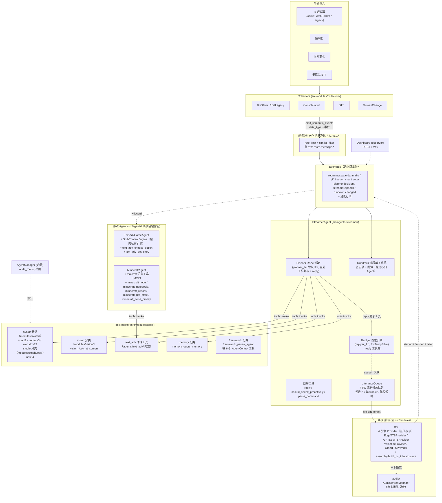
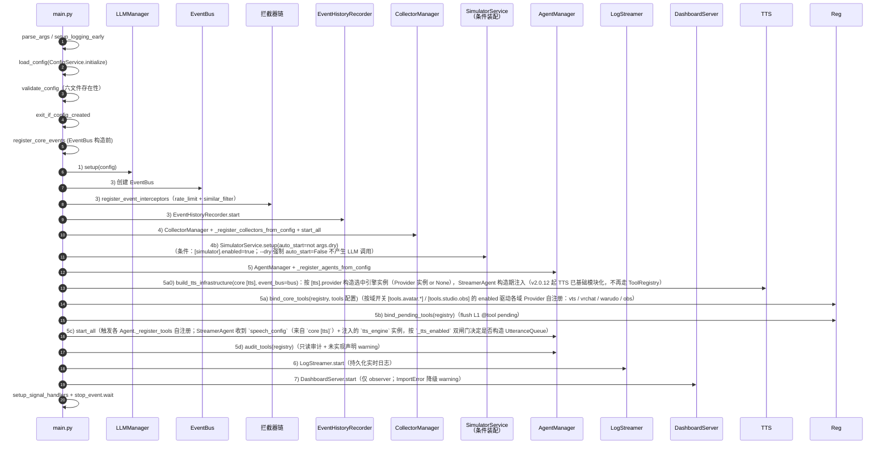
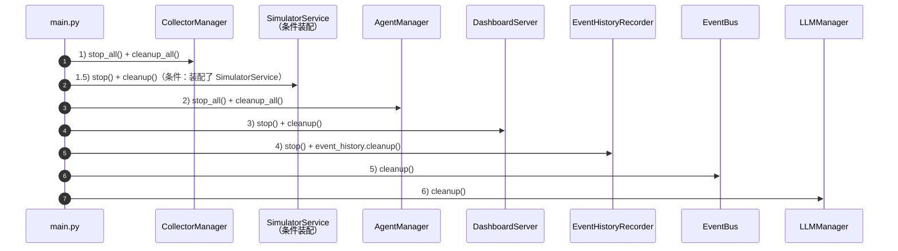

# 架构总览（v2.0.0）

Amaidesu 是一个 **AI VTuber 框架**，v2.0.0 采用 **Agent（自主主体）+ 工具（能力契约）+ 存储（状态/记忆）+ 编排（Rundown 流程单）** 架构。系统采用**三通道协作**作为跨主体通信机制——命令（工具，主播→游戏，目标级意图，如 text_adv_choose_option）、事件（EventBus，游戏→主播，里程碑/异常）、状态（工具，主播按需主动读取游戏封装读接口，如 text_adv_get_story——按游戏实际需要设计，不强制单一 getStatus），事件拦截器挂在分发层做语义净化；Collector 从外部世界推入房间消息，Agent 拥有自己的决策循环并消费 ToolRegistry 中的工具完成表达与控制，Dashboard 仅作为 observer，不参与数据流。

> 本文是**速查参考**（组件清单/目录结构/启动时序）。重构的来龙去脉与设计推导见 [v2.0.0 架构叙事](v2-architecture.md)。

## 全景图


```mermaid
flowchart TB
    subgraph Ext["外部输入"]
        Bili["B 站弹幕<br/>(official WebSocket / legacy)"]
        Cons["控制台"]
        Screen["屏幕变化"]
        Mic["麦克风 STT"]
    end

    subgraph Collectors["Collectors (src/modules/collectors/)"]
        direction TB
        CBili["BiliOfficial / BiliLegacy"]
        CCons["ConsoleInput"]
        CMic["STT"]
        CScreen["ScreenChange"]
    end

    subgraph Interceptors["[拦截器] 房间消息净化（§1.46.1）"]
        INT["rate_limit + similar_filter<br/>作用于 room.message.*"]
    end

    subgraph Bus["EventBus（语义域事件）"]
        EB["room.message.danmaku / gift / super_chat / enter<br/>planner.decision / streamer.speech / rundown.changed<br/>+ 通配订阅"]
    end

    subgraph Streamer["StreamerAgent (src/agents/streamer/)"]
        Planner["Planner ReAct 循环<br/>(planner_llm 默认 llm, 全局工具列表 + reply)"]
        Reply["Replyer 表达引擎<br/>(replyer_llm, ProfanityFilter)<br/>= reply 工具的"]
        Rundown["Rundown 流程单子系统<br/>备忘录 + 闹钟（推进权归 Agent）"]
        Tools["自带工具<br/>reply / should_speak_proactively / parse_command"]
        UQ["UtteranceQueue<br/>FIFO 串行播放队列<br/>丢最旧 / 单 worker / 渲染超时"]
    end

    subgraph Game["游戏 Agent (src/agents/ 顶级自包含包)"]
        TextAdv["TextAdvGameAgent<br/>+ StubContentEngine（包内私有引擎）<br/>+ text_adv_choose_option / text_adv_get_story"]
        MC["MinecraftAgent<br/>+ maicraft 语义工具（MCP）<br/>+ minecraft_todo / minecraft_notebook / minecraft_report / minecraft_get_state / minecraft_send_prompt"]
    end

    subgraph Registry["ToolRegistry (src/modules/tools/)"]
        Out["avatar 分类（modules/avatar/）<br/>vts×12 / vrchat×3 / warudo×13<br/>studio 分类（modules/studio/obs/）obs×4"]
        Per["vision 分类（modules/vision/）<br/>vision_look_at_screen"]
        CE["text_adv 动作工具<br/>（agents/text_adv/ 内聚）"]
        Mem["memory 分类<br/>memory_query_memory"]
        Ctrl["framework 分类<br/>framework_pause_agent 等 6 个 AgentControl 工具"]
    end

    subgraph InFra["共享基础设施 src/modules/"]
        TTS["tts/<br/>4 引擎 Provider（基础模块）<br/>EdgeTTSProvider / GPTSoVITSProvider<br/>VoiceboxProvider / OmniTTSProvider<br/>+ assembly.build_tts_infrastructure"]
        Audio["audio/<br/>AudioDeviceManager<br/>（声卡播放/录音）"]
    end

    Ext --> Collectors
    Collectors -->|"emit_semantic_events<br/>data_type→事件"| INT
    INT --> Bus
    Bus --> Planner
    Bus --> Rundown
    Planner -->|reply 局部工具| Reply
    Planner -->|tools.invoke| Out
    Planner -->|tools.invoke| CE
    Planner -->|tools.invoke| Per
    Planner -->|tools.invoke| Mem
    Bus -.->|wildcard| Game
    Game -->|tools.invoke| CE
    Reply -.->|speech 入队| UQ
    UQ -->|fire-and-forget| TTS
    TTS -.->|started / finished / failed| Bus
    TTS -.->|声卡播放| Audio
    Manager["AgentManager (内置)<br/>audit_tools (只读)"] -.->|审计| Registry
    Dashboard["Dashboard (observer)<br/>REST + WS"] -.-> Bus
```

> 上图省略了几个常驻配角：`LogStreamer`（向 Dashboard 推实时日志）、`EventHistoryRecorder`（事件历史持久化/查看）。v2.0.12 起 TTS 发言管线：StreamerAgent 解析 `reply.result.content`，speech 字段由 UtteranceQueue 串行送入装配期注入的 `tts_engine` 实例（`build_tts_infrastructure(tts_config, event_bus=None)` 按 `infra.toml [tts].provider` 选中的引擎），其 `handle_speech` 入口完成合成 + 播放；TTS 引擎自身（基础模块，非工具）发布 `tts.utterance.*` 三事件；声卡播放经 `src/modules/audio/AudioDeviceManager`（v2.0.10 由旧 `src/modules/tts/audio_device_manager.py` 迁移而来）。ToolRegistry 中零 TTS 条目——TTS 不再走工具调用路径。

## 目录结构

```
Amaidesu/
├── main.py                      # CLI 入口 + v2 组合根（组件构造与生命周期）
├── config/                      # 配置目录（多文件结构，首次运行自动生成）
├── src/
│   ├── agents/                  # 业务 Agent（StreamerAgent + GameAgent：text_adv/minecraft 范例）
│   │   ├── streamer/            #   主播 Agent（Planner/Replyer/Rundown/工具/后台维护）
│   │   └── game/                #   游戏 Agent（AI 玩家范式）
│   │       ├── text_adv/        #     文字冒险 GameAgent 范例（内容引擎为包内私有接口）
│   │       └── minecraft/       #     Minecraft GameAgent（maicraft MCP 语义工具 + minecraft_todo/minecraft_notebook/minecraft_report/minecraft_get_state/minecraft_send_prompt）
│   └── modules/                 # 共享模块（基础设施 + 领域组件）
│       ├── agents/              # Agent 框架层：BaseAgent 协议六项 / AgentManager / AgentControl 6 工具 / factory(SUPPORTED_AGENTS)
│       ├── audio/               # v2.0.10 抽出：AudioDeviceManager（声卡播放 / 录音），原 `src/modules/tts/audio_device_manager.py` 上移
│       ├── tts/                 # v2.0.12 TTS 基础设施包（基础模块，非工具）：4 引擎 Provider（EdgeTTSProvider / GPTSoVITSProvider / VoiceboxProvider / OmniTTSProvider）+ common.py 共享函数 + gptsovits_client.py（GPT-SoVITS WebSocket 客户端与 Provider 同包）+ wav_decoder.py + assembly.py（build_tts_infrastructure 入口）。详见 [ADR-007](adr/007-tts-infrastructure-pipeline.md)
│       ├── collectors/          # 输入采集域（BaseCollector + CollectorManager + 各域 Collector）
│       │   ├── bilibili/        #   B 站弹幕（legacy 第三方 / official WebSocket）
│       │   ├── console/         #   控制台输入
│       │   ├── screen/          #   屏幕变化
│       │   └── stt/             #   语音识别
│       ├── tools/               # 工具语法层（ToolRegistry / ToolSpec / @tool / bootstrap；零领域知识）
│       ├── avatar/              # avatar 分类：vts/（VTSProvider + 引擎子件）、vrchat/（OSC 桥接）、warudo/（每形象 = 一 Provider 实例 = 一开关单元）
│       ├── studio/              # studio 分类：obs/
│       ├── vision/              # vision 分类：vision_look_at_screen（同步快照工具）+ 屏幕捕获设施
│       ├── mcp/                 # MCP 基础模块（外部工具源通道）
│       ├── events/              # EventBus + 事件拦截器（session_stamp 场次盖章 / rate_limit / similar_filter）
│       │   ├── interceptors/    #   EventInterceptor 协议 + InterceptorChain
│       │   └── payloads/        #   Payload 按域分包（v2.0.10 新增 utterance.py 承载 tts.utterance.* 三事件）
│       ├── config/              # 配置管理（多文件 Schema 驱动 + 升级钩子）
│       ├── dashboard/           # Web Dashboard（FastAPI + WebSocket）
│       ├── di/                  # 依赖注入工具
│       ├── llm/                 # LLM 服务（provider + profile 两层）
│       ├── logging/             # 日志 + LogStreamer
│       ├── memory/              # MemoryProvider + SimpleMemory + memory_query_memory 工具
│       ├── prompts/             # PromptManager（声明式键自动发现）
│       ├── session/             # 直播场次管理（LiveSessionManager：开启/结束/删除/归属解析；live.started/ended 唯一发布方；无显式场次期间消息仅在内存流转不落库）
│       ├── simulator/           # 世界模拟器（开发基础设施，ADR-006）：三模式发射器（generate LLM 生成 / replay 录制回放 / off）；SimulatorService + PersonaPool / CadenceGenerator / GiftGenerator / SimulatorLLMWrapper / TokenBudgetController / ReplayEngine；回放启停自动开/关场次；人设礼物入 SQLite（sim_personas/sim_gifts + 内置种子），观众上下文读 live_chat 窗口。默认 enabled=false，生产零沾染。详见 docs/development/simulator-guide.md。
│       ├── storage/             # SQLite 存储层（StorageLedger 唯一写穿入口：订阅 room.message.# + streamer.speech，按 LiveSessionManager 解析的场次归属写 live_chat/gifts/super_chats + 维护 viewers 统计；SQLiteStore 提供领域查询与场次行管理；live_chat 含 message_id/reply_to_message_id 回复关联列）
│       └── types/               # 共享类型（NormalizedMessage 等）
├── dashboard/                   # 前端 SPA（pnpm 构建到 dashboard/dist/，60214 静态挂载）
├── tests/                       # 顶层分组：agents / architecture / config / dashboard / integration / modules（+ characterization / mocks 支撑）
└── docs/                        # 文档（架构 / 开发指南 / 决策记录）
```

> `src/agents/` 只放业务 Agent；`src/modules/agents/` 放框架层（BaseAgent、AgentManager、AgentControl 工具、工厂）。这是 v2 包边界的硬规则。

## 启动与关闭

### 启动时序（`main.py`）


```mermaid
sequenceDiagram
    autonumber
    participant Main as main.py
    participant LLM as LLMManager
    participant Bus as EventBus
    participant Int as 拦截器链
    participant Rec as EventHistoryRecorder
    participant Col as CollectorManager
    participant Sim as SimulatorService<br/>（条件装配）
    participant Agt as AgentManager
    participant Log as LogStreamer
    participant Dash as DashboardServer

    Main->>Main: parse_args / setup_logging_early
    Main->>Main: load_config(ConfigService.initialize)
    Main->>Main: validate_config（六文件存在性）
    Main->>Main: exit_if_config_created
    Main->>Main: register_core_events (EventBus 构造前)
    Main->>LLM: 1) setup(config)
    Main->>Bus: 3) 创建 EventBus
    Main->>Int: 3) register_event_interceptors（rate_limit + similar_filter）
    Main->>Rec: 3) EventHistoryRecorder.start
    Main->>Col: 4) CollectorManager + _register_collectors_from_config + start_all
    Main->>Sim: 4b) SimulatorService.setup(auto_start=not args.dry)<br/>（条件：[simulator].enabled=true；--dry 强制 auto_start=False 不产生 LLM 调用）
    Main->>Agt: 5) AgentManager + _register_agents_from_config
    Main->>TTS: 5a0) build_tts_infrastructure(core [tts], event_bus=bus)：按 [tts].provider 构造选中引擎实例（Provider 实例 or None），StreamerAgent 构造期注入（v2.0.12 起 TTS 已基础模块化，不再走 ToolRegistry）
    Main->>Reg: 5a) bind_core_tools(registry, tools 配置)（按域开关 [tools.avatar.*] / [tools.studio.obs] 的 enabled 驱动各域 Provider 自注册：vts / vrchat / warudo / obs）
    Main->>Reg: 5b) bind_pending_tools(registry)（flush L1 @tool pending）
    Main->>Agt: 5c) start_all（触发各 Agent._register_tools 自注册；StreamerAgent 收到 `speech_config`（来自 `core [tts]`）+ 注入的 `tts_engine` 实例，按 `_tts_enabled` 双闸门决定是否构造 UtteranceQueue）
    Main->>Agt: 5d) audit_tools(registry)（只读审计 + 未实现声明 warning）
    Main->>Log: 6) LogStreamer.start（持久化实时日志）
    Main->>Dash: 7) DashboardServer.start（仅 observer；ImportError 降级 warning）
    Main->>Main: setup_signal_handlers + stop_event.wait
```

CLI 选项：`--debug`（DEBUG 日志级别）、`--filter MODULE [MODULE ...]`（仅显示指定模块 INFO/DEBUG，WARNING+ 总显示）、`--dev-webui`（浏览器自动打开 `http://localhost:60315` 而非 `http://127.0.0.1:60214`）、`--dry`（仅验证组合根 wiring，不进入主循环即关闭）。

拦截器默认行为（`infra.toml` 的 `[interceptors.*]`，`enabled` 默认 `True`）：

| 拦截器 | 默认参数 | 作用事件 | 行为 |
|--------|---------|---------|------|
| `rate_limit` | `global_rate_limit=100`、`user_rate_limit=10`、`window_size=60` | `room.message.*` | 超阈值返回 `None` 丢弃 |
| `similar_filter` | `similarity_threshold=0.85`、`time_window=5.0`、`min_text_length=3`、`cross_user_filter=True` | `room.message.*` | 相似文本合并（跨用户/同用户可选） |

### 关闭时序（`run_shutdown`，按依赖反向）


```mermaid
sequenceDiagram
    autonumber
    participant Main as main.py
    participant Col as CollectorManager
    participant Sim as SimulatorService<br/>（条件装配）
    participant Agt as AgentManager
    participant Dash as DashboardServer
    participant Rec as EventHistoryRecorder
    participant Bus as EventBus
    participant LLM as LLMManager

    Main->>Col: 1) stop_all() + cleanup_all()
    Main->>Sim: 1.5) stop() + cleanup()（条件：装配了 SimulatorService）
    Main->>Agt: 2) stop_all() + cleanup_all()
    Main->>Dash: 3) stop() + cleanup()
    Main->>Rec: 4) stop() + event_history.cleanup()
    Main->>Bus: 5) cleanup()
    Main->>LLM: 6) cleanup()
```

每个步骤包在 `safe_log` 里捕获异常与 `CancelledError`，任意失败不影响后续步骤；全局 `_saw_cancelled` 在最后重抛 `CancelledError` 以便上层感知。

## 组件清单

### ① 采集器（5 类）

| 名称 | 实现位置 | 模式 | 说明 |
|------|---------|------|------|
| `bili_danmaku_official` | `src/modules/collectors/bilibili/official/` | v2 主动推（`_emit_semantic_events=True`，collect 内自行 emit `room.message.*`） | B 站官方 WebSocket 弹幕；含 `client/proto.py` + `client/websocket_client.py` |
| `bili_danmaku` | `src/modules/collectors/bilibili/legacy/` | v2 主动推（`_emit_semantic_events=True`） | B 站第三方 HTTP API 弹幕 |
| `console_input` | `src/modules/collectors/console/` | 兜底转发（基类 `_emit_normalized_message` 把 `data_type` 映射为 `room.message.danmaku/gift/super_chat/enter`） | 控制台输入 |
| `screen_change` | `src/modules/collectors/screen/` | 兜底转发 | 屏幕变化检测（`screen_change_collector.py`）；同目录另有 `screen_reader.py`（v2.0.9 起 VLM 走 LLMManager.chat_vision 收编）+ `screen_analyzer.py` 辅助 |
| `stt` | `src/modules/collectors/stt/` | 兜底转发 | 语音识别（`stt_collector.py` + `config.py`） |

注：列表实际为 6 条，"5 类"指 5 个采集域（bilibili 拆为 official/legacy）。**采集配置位置在 `tools.toml` 的 `[tools.perception.config]`**——旧版放在独立的采集配置段，已迁移至此。`_register_collectors_from_config` 读 `enabled` 子段逐项 `instantiate_collector` 并注册到 `CollectorManager`。

### ② Agent

#### 框架层（`src/modules/agents/`）

| 文件 | 内容 |
|------|------|
| `base.py` | `BaseAgent` 协议六项（§1.49）：1.生命周期（start/stop/cleanup + 工厂重建）、2.工具提供（`list_tools()`）、3.事件上报（`emit_event` + `emits_events` 可选声明）、4.状态读写（`_state` + heartbeat）、5.健康（`note_heartbeat/is_alive/dead_threshold_ms`）、6.元数据（`name/description`）。状态机：`CREATED → STARTING → RUNNING → PAUSED → STOPPING → STOPPED → ERRORED`。 |
| `manager.py` | `AgentManager`：注册 / 启动（LIFO） / 停止 / cleanup / 动态启停（`start_agent`/`stop_agent`/`enable_agent`/`disable_agent`）；`audit_tools(registry) -> list[str]` 启动后只读审计未实现工具声明（不参与注册） |
| `control.py` | `AgentControl`（直调接口） + `AgentControlProvider`（注册到 ToolRegistry），对外暴露 6 个 framework 工具（注册名带前缀）：`framework_pause_agent` / `framework_resume_agent` / `framework_shutdown_agent` / `framework_restart_agent` / `framework_list_agents` / `framework_agent_state` |
| `factory.py` | `SUPPORTED_AGENTS = ("streamer", "game")` + `instantiate_agent(name, config, ...)` 中央化配置名 → 类映射，供组合根与 Dashboard 动态启停共用 |

#### 业务层（`src/agents/`）

`src/agents/streamer/` 主播 Agent 包：顶层平铺内部件与协作组件，强内聚簇收进子包（`rundown/` 子系统 / `tools/` 工具壳层 / `command/` 解析原语）：

| 角色 | 模块 |
|------|------|
| **入口与编排** | `streamer_agent.py`（继承 `BaseAgent`，编排子组件）、`__init__.py` |
| **决策循环（Planner）** | `planner.py`（planner_llm 调 `chat()` 不传 tools，结构化 JSON 输出）、`plan.py`（plan 数据结构） |
| **表达引擎（Replyer）** | `replyer.py`（replyer_llm 调 `chat()` 不传 tools，纯文本 JSON + ProfanityFilter） |
| **主动发言规则** | `proactive_trigger.py`（纯规则触发器，主循环直接驱动；经 `tools/proactive_tool.py` 包装为工具供 LLM 查询） |
| **流程单（Rundown）** | `rundown/` 子包：`rundown.py`（数据契约 + 内置默认流程单）/ `rundown_state.py`（游标 + 计时 + 唯一变更边界）/ `rundown_tool.py`（Agent 推进工具）；备忘录 + 闹钟——环节推进由 Agent 经工具自主决定，超时闹钟并入 ProactiveTrigger 只提醒不执法 |
| **房间与消息** | `room_state.py`（直播间状态聚合）、`message_buffer.py`（弹幕聚合窗口：默认 3s/20 条） |
| **对话映射与参考段** | `canonical.py`（live_chat 行/弹幕批 → 原生消息的单一序列化点 + 成块丢最旧截断）、`planner_context.py`（Planner 参考段纯函数组装，固定在消息序列尾部） |
| **后台维护** | `background.py`（双任务 BackgroundMaintainer 取代旧 RoomStateLoop） |
| **发言管线** | `utterance_queue.py`（v2.0.10 新增：`UtteranceQueue` FIFO 串行队列，丢最旧 / 单 worker / 渲染超时看门狗；构造期注入 `speak` 可调用对象（绑定 `tts_engine.handle_speech`），后台串行直接 `await speak(text, utterance_id)`，不再经 ToolRegistry） |
| **工具壳层** | `tools/` 子包：`reply_tool.py`（`reply`）、`proactive_tool.py`（`should_speak_proactively`）、`command_tool.py`（`parse_command`）——Agent 专属 builtin 工具入口，只包装顶层内部件，不含决策/表达逻辑 |
| **时序门** | `timing_gate.py` |
| **命令解析** | `command/command.py` + `command/command_parser.py` + `command/command_registry.py`（`tools/command_tool.py` 的底层纯解析原语） |
| **提示词** | `prompts/amaidesu_planner_react.md` + `prompts/amaidesu_replyer.md` + `prompts/summary_system.md` |

`src/agents/text_adv/` 文字冒险 GameAgent 范例：`agent.py`（继承 `BaseAgent`）、`state.py`（剧情状态）、`tools.py`（游戏侧 dispatch）、`content_engine/` 子包（引擎 Protocol + Stub/Fake，**包内私有**：构造注入、Agent 与工具直连调用，不注册不暴露），构造时注入 `content_engine=StubContentEngine(engine_kind="text_adv")`。

### ③ 工具族

总览：约 46 个工具。注册名 = `ToolSpec.provider`（**提供者标识**，全局唯一，如 `vts` / `vrchat` / `warudo` / `obs` / `vision` / `memory` / `framework` / `text_adv`）+ `_` + 工具声明名——LLM 与调用方只见注册名（未带前缀的声明名注册时自动补前缀）。provider 自声明**分类**（avatar / studio / vision / memory / game / mcp / framework，经 `registry.list_categories()` / `list_tools(category=)` 查询）；tools.toml 段为配置地址，三者正交。主播 Agent 默认可见全部已启用工具（`registry.list_tools()` 全量），可见性由人类控制的开关（`[tools.avatar.*].enabled` 等）决定。装配由 `bind_core_tools` 按 avatar/studio 开关驱动，详见 [启动时序](#启动时序) 5a 步骤。其余已知缺口见"已知缺口"。

| 分类 | provider 标识 | 工具数 | 工具名（注册名） |
|----|----------|-------|--------|
| TTS | （基础模块） | — | 4 引擎 Provider 位于 `src/modules/tts/`，不注册 ToolRegistry；`build_tts_infrastructure` 按 `infra.toml [tts].provider` 单选构造注入 StreamerAgent，详见 [ADR-007](adr/007-tts-infrastructure-pipeline.md) |
| Subtitle | （基础模块） | — | `src/modules/subtitle/`（`build_subtitle_infrastructure` 装配，不经 ToolRegistry） |
| avatar | `vts` | 12 | `vts_smile` / `vts_close_eyes` / `vts_open_eyes` / `vts_set_expression` / `vts_set_parameter_value` / `vts_get_parameter_value` / `vts_trigger_hotkey`（按热键名优先，连接后描述动态携带可用热键清单）/ `vts_load_item` / `vts_load_sticker` / `vts_set_idle_enabled` / `vts_reconnect` / `vts_get_stats` |
| avatar | `vrchat` | 3 | `vrchat_set_expression` / `vrchat_trigger_gesture` / `vrchat_get_stats` |
| avatar | `warudo` | 13 | `warudo_set_expression` / `warudo_trigger_hotkey` / `warudo_trigger_body` / `warudo_trigger_head` / `warudo_trigger_action` / `warudo_set_subtitle` / `warudo_throw_fish` / `warudo_set_sight` / `warudo_set_eyebrow` / `warudo_set_eye` / `warudo_set_pupil` / `warudo_set_mouth` / `warudo_get_stats`（动作类工具描述动态携带 `[tools.avatar.warudo.config].action_catalog` 预声明清单） |
| studio | `obs` | 4 | `obs_send_text` / `obs_switch_scene` / `obs_set_source_visibility` / `obs_send_test` |
| vision | `vision` | 1 | `vision_look_at_screen`（同步快照工具，注入 `ScreenCapture`/`TextReader` 后端；无后端时返回成功 + 空文本，不抛异常） |
| game | `text_adv` | 2 | `text_adv_choose_option` / `text_adv_get_story`（游戏侧 dispatch，`agents/text_adv/` 内聚） |
| game | `minecraft` | 5 | `minecraft_todo` / `minecraft_notebook` / `minecraft_report` / `minecraft_get_state` / `minecraft_send_prompt`（`agents/minecraft/` 内聚；maicraft_* MCP 工具另见 mcp 行） |
| memory | `memory` | 1 | `memory_query_memory`（绑定 `MemoryProvider` 后才可用） |
| mcp | `<server 名>` | 按 server | `maicraft_*` 等（MCP server 工具经通道注册，provider = server 名） |
| Streamer 自带 | `streamer` | 3 | `reply` / `should_speak_proactively` / `parse_command`（Agent 内部协议工具，**不入 ToolRegistry**） |
| framework | `framework` | 6 | `framework_pause_agent` / `framework_resume_agent` / `framework_shutdown_agent` / `framework_restart_agent` / `framework_list_agents` / `framework_agent_state` |

## 核心概念

### 判别式：Agent vs Tool

| 维度 | Agent | Tool |
|------|-------|------|
| 谁驱动 | 主播**自我驱动**（持续循环）；游戏**命令驱动**（类 Code Agent：命令唤醒任务内有界循环，完成即停，空闲零消耗） | **被调才干活**（纯被动，调用即返回 `ToolExecutionResult`） |
| 形态 | 继承 `BaseAgent`，可发事件、可订阅、可销毁重建 | 继承 `ToolProvider`，`list_tools()` + `invoke(ToolInvocation)` |
| 暴露 | 整个生命周期 + `list_tools()` 聚合到 ToolRegistry | 只通过 `ToolRegistry.invoke(name, args)` 暴露给 LLM |
| 例子 | `StreamerAgent`（Planner 循环 + 后台 BackgroundMaintainer）、`TextAdvGameAgent`、`MinecraftAgent`（命令唤醒任务执行） | `vision_look_at_screen`、`memory_query_memory`、`vts_set_expression` |

**判别口诀**："谁驱动谁"——能自我维持状态/轮询/心跳的就是 Agent，只在被调用时执行的就是 Tool。

> **直播内容 = 编排配置 + Planner 上下文/行为模式的变化，不是代码模块**。一份流程单不会新增 Agent 或 Tool，只是改变 `StreamerAgent` 加载的 Rundown、Planner 提示词上下文与 Replyer 行为模式。这就是为什么 `rundown_*.py` 等模块收在 `src/agents/streamer/rundown/` 子包内——它们是 StreamerAgent 内部子组件，而非顶级模块或可注册工具。

### 生命周期

| 基类 | 启动 | 停止 | 资源释放 | 业务入口 |
|------|------|------|----------|----------|
| **`BaseCollector`** | `start()` → 内部 `_start_collect_task()` 后台消费 `collect()` 生成器（v2 主动推事件模式） | `stop()` → 取消后台任务 | `cleanup()` → `_on_cleanup()` | `collect()`（子类实现，返回 `AsyncIterator[NormalizedMessage]`） |
| **`BaseAgent`** | `start()` → `_on_start()` 钩子 + 心跳 | `stop()` → `_on_stop()` 钩子；额外 `pause()`/`resume()`/`shutdown()`（更严格） | `cleanup()` → `_on_cleanup()` 钩子 | `list_tools()` 抽象 + 自由 `emit_event` + 可选 `emits_events` 声明 |

状态机（两者镜像）：`CREATED → STARTING → RUNNING → STOPPING → STOPPED → ERRORED`；Agent 额外有 `PAUSED` 用于 `framework_pause_agent` 控制。

### 事件系统（摘要）

EventBus 是事件通道（三通道协作之一，承载游戏→主播的事件汇报）。事件命名采用语义域形式（`room.message.danmaku` / `planner.decision` 等），支持通配订阅（`room.message.*`）。完整事件表（含发布者/订阅者/Payload 类型）见 [事件系统](event-system.md)；命名规则见 [事件命名规范](event-naming-convention.md)。

### 事件拦截器（Interceptor）

挂在 EventBus 分发层的全局单点（`emit` 后、订阅者收到前过同一道链）。内置 `RateLimitInterceptor` + `SimilarFilterInterceptor`，作用于 `room.message.*`，配置见 `infra.toml` 的 `[interceptors.*]`。语义契约沿袭自旧管道 Process：返回原事件=透传 / 新事件=转换 / `None`=丢弃。

**敏感词净化不在拦截器层**——主播发言统一出口在 `Replyer.ProfanityFilter`（`src/agents/streamer/replyer.py`）。

## 核心设计原则

### ① 主体性判据（谁驱动谁）

判别 Agent 与 Tool 的硬规则已在"判别式"一节展开。新增功能时，先回答"这个功能有没有自己的状态/轮询/心跳"——有就做成 Agent，没就做成 Tool。这条规则同时约束**反对偷换概念**：基础能力（如屏幕感知、记忆查询）即便被多个 Agent 复用，也应做成 Tool（走 ToolRegistry + Protocol 注入），而不是塞进某个 Agent 内部。

### ② 防插件换皮红线（Agent 包边界）

v2 不再支持"插件系统"——`src/modules/plugins/` 已移除。新功能通过 **Agent 包内聚**实现：

- **内容特有逻辑全部内聚**到 `src/agents/<name>/`（目录名 = Agent 注册名），框架层（`src/modules/`）**零改动**
- 例：新增"MC Agent" → 在 `src/agents/minecraft/` 建包，内含 `agent.py`（继承 `BaseAgent`）、`tools.py`（自有工具 spec）、`state.py` 等；Agent 自有工具在 `_register_tools()` 中自己 `registry.register_provider(provider)`（注册名自动带 `<provider>_` 前缀）；公用工具由 `bind_core_tools` 显式装配；启动结束 `audit_tools` 审计
- 例：新增"播报 Agent" → 在 `src/agents/announcer/` 建包，自己订阅自己感兴趣的事件，自己实现 `list_tools()`
- **禁止**为新功能在 `src/modules/` 加新模块分组（除非它真的是跨阶段基础设施）；**禁止**通过 monkey-patching 或 import 副作用往框架注入行为

判别口诀："这是给现有 Agent 加工具，还是这本身就是个新主体？"——加工具进 Agent 自己的包；新主体开新 Agent 包。

### ③ 依赖注入

服务对象（`EventBus` / `LLMManager` / `PromptManager` / `ConfigService`）一律构造器注入；数据对象（Payload、配置 dict）走参数或 `**kwargs`。**禁止**把服务塞进 Context 容器传递。

```python
# v2 实例：StreamerAgent 构造（main.py:_register_agents_from_config）
agent = StreamerAgent(
    config=cfg_obj,
    llm_manager=llm_service,
    prompt_manager=get_prompt_manager(),
    event_bus=event_bus,
    # tool_registry / capabilities_provider / sqlite_store 视构造器签名
)
```

详见 [依赖注入指南](../development/dependency-injection.md)。

### ④ 配置驱动

v2 配置为**六文件树**（`agents / collectors / tools / model / storage / infra`，`config/` 目录每域一文件），Pydantic Schema 驱动生成、校验与漂移写回；每文件自带 `[meta].version` 结构版本（独立递进）。启用开关收敛为两处：`agents.toml` 的 `[agents].enabled` 与 `collectors.toml` 顶层 `enabled`。

加载是**单一管线**（`multi_file_loader.load_config_dir`）：①全读 → ②③版本推进（升级钩子注册表，缺失版本硬错）→ ④ Pydantic 校验（硬错，无 raw dict 降级；采集器子段按组件注册表分发校验）→ ⑤ 漂移写回（全量序列化 + 批次备份 + 自写压标）→ ⑥ 合并视图（剥 `[meta]`，scope 展平）。组件包内 `ConfigSchema` 是该组件配置的唯一权威，中央树不内联字段定义。

```toml
# agents.toml —— 业务 Agent（[agents] 段聚合启用名单 + 各 Agent 子配置）
[agents]
enabled = ["streamer"]

[agents.streamer]
# StreamerConfig 子树：persona / context / proactive / background / ...
[agents.streamer.persona]
bot_name = "麦麦"

[agents.minecraft]
# MinecraftConfig：max_steps / execute_* / mcp（Agent 私有 MCP，位置即归属）

# collectors.toml —— 采集器（名单驱动装配；各采集器子段由包内 ConfigSchema 校验）
enabled = ["console_input"]

# tools.toml —— 工具域（提供者开关 + disabled_tools + [tools.tasks] 异步任务基建）
[tools]
disabled_tools = []

# infra.toml —— 基础设施（tts / subtitle / dashboard / logging / interceptors / simulator / events）

# model.toml —— 三层模型结构（llm_providers / llm_models / llm_profiles，6 用途 profile 必填）

# storage.toml —— 顶层扁平（sqlite / memory）
```

WebUI 配置页经根 Schema 自描述协议（`__file_name__` / `__section_label__`）动态分组；写路径统一走 `update_config_values`（校验硬错 → 备份 → 自写压标 → 注释重生成），infra 为 hot 段（写后即时重载），其余段待重启。

六文件布局、升级钩子注册表、配置变更规则等细节见 [配置与存储变更](../../AGENTS.md#配置与存储变更) 与 `src/modules/config/`（`multi_file_loader.py` 加载管线 / `upgrade.py` 版本推进 / `registry.py` 组件注册表）。

### ⑤ 错误隔离

- **ToolRegistry.invoke** 永远不抛异常：未知工具 → 失败 `ToolExecutionResult`；调用方抛异常 → 失败 `ToolExecutionResult` + `error_message`。这让 Agent/LLM 在工具失败时仍能拿到结构化结果继续推进。
- **事件拦截器**返回 `None` 即丢事件；拦截器内部异常会被吞并放行（不丢事件，避免上游 bug 阻塞全链路）。
- **Collector 后台消费任务**异常被 catch（除 `CancelledError` 重抛），单次循环出错不影响采集器后续轮次。
- **AgentManager.stop_all / cleanup_all** 按注册顺序逐一 try/except，单个失败不影响其余 Agent。
- **Dashboard 启动失败**（ImportError 等）仅 warning，整体仍可继续运行。

## 已知缺口

如实记录当前 v2.0.10 组合根（main.py）尚未完成的事项，不掩盖：

1. **AudioStreamChannel 已拆除（2026-08-27）**。v2 pull 编排下无扇出场景，audio pub-sub 链路（`src/modules/streaming/`，300+ 行：AudioStreamChannel / AudioChunk / BackpressureStrategy）已删除；TTS 输出回归本地 `AudioDeviceManager.play_audio`（v2.0.10 由 `src/modules/tts/audio_device_manager.py` 上移至 `src/modules/audio/`，作为音频基础设施）；皮套口型同步责任短期由皮套软件自取本地音频流 / 中期由工具 invoke 能力重建。`LipSyncProcessor` 保留（无其他活跃调用方时仅作历史兜底，可按 git 历史回滚）。

2. **`tts.utterance.*` 订阅端接线尚未实现**。v2.0.10 三事件已发布，但当前生产代码**暂无订阅者**（字幕 Provider 由 StreamerAgent 通过 `speech` 文本直接 fire-and-forget，不订阅 utterance 事件；记账器同样预留）。字幕精准对齐是 utterance 事件的首要目标消费者，待字幕子系统接入事件总线后即可启用。详见 [事件系统 §TTS Utterance 域](event-system.md#tts-utterance-域v2010-新增) 与 [ADR-007 §后果](adr/007-tts-infrastructure-pipeline.md#后果consequences) 遗留项。

3. **`game_events` 有写链但暂无数据源**。`StorageLedger` 已订阅 `game.*`（milestone / attention_required / error）落库 `game_events` 表，通路已就绪；但游戏代理（AI 玩家）尚未上线，全项目无发布方，表暂时为空。游戏代理落地后事件出现即自动落库，无需再改存储层。

### 非缺口（设计如此，勿重复上报）

- **流程单运行进度不持久化**：流程单权威源是 `rundowns` 表（WebUI 建立，TOML 已移除）；运行进度（当前环节/计时）纯内存，重启即重读流程单从头开始。v2 的 `agenda_plan`/`agenda_runtime` 表已随 Schema 迁移 DROP。
- **`enter` 事件不落库**：进场消息无对应明细表，属设计决定（`live_sessions` 心跳与进场是不同概念），`StorageLedger` 收到后 debug 日志丢弃。
- **`simulated` 溯源已闭环**：`StorageLedger` 已从 `RoomMessagePayload.simulated` 端到端写穿 `live_chat` / `gifts` / `super_chats` 三表贯穿列，并有测试覆盖（`tests/modules/storage/test_storage_ledger.py::test_ledger_simulated_true_flows_to_column`）。

> **v2.0.12 已闭环（§8 概念修正后最终态）**：原"渲染工具 `register_*_tools` 无自动调用点"——
> - **TTS**：v2.0.12 起整体提升为基础设施，由 `src/modules/tts/build_tts_infrastructure(core [tts], event_bus)` 装配期直接构造引擎实例并注入 StreamerAgent，ToolRegistry 中零 TTS 条目；
> - **域工具**（avatar / studio）：由 `bind_core_tools` 按域开关（`[tools.avatar.*].enabled` / `[tools.studio.obs].enabled`）驱动自注册。
> 详见 [启动时序](#启动时序) 5a0 / 5a 两步与 [ADR-007 §8 概念修正](adr/007-tts-infrastructure-pipeline.md#8-概念修正2026-09-05-落地adr-007-据此修订)。

## 相关文档

- [数据流规则](data-flow.md) - 数据流约束与禁用模式（已按 v2 主体/工具/采集器重写）
- [事件系统](event-system.md) - EventBus 与事件拦截器使用指南（完整事件表的单一事实源）
- [事件命名规范](event-naming-convention.md) - 语义域事件命名规则
- [架构决策记录](adr/README.md) - ADR 清单（v2 各 Wave 决策）
- [Agent 包开发指南](../development/component-guide.md) - 业务 Agent 开发详解
- [依赖注入指南](../development/dependency-injection.md) - 注入约定与决策清单
- [测试指南](../development/testing-guide.md) - 测试分层（agents/architecture/config/dashboard/integration/modules + characterization/mocks 支撑）

---


*上次更新：2026-08-28（ADR-006 落地：mock_danmaku 表格描述收敛为"确定性 JSONL 回放器（LLM 仿真由 simulator/ SimulatorService 承担）"；`simulator/` 目录条目改写为开发基础设施描述；启动时序补 4b SimulatorService 步骤（条件装配，--dry 强制 auto_start=False）、关闭时序补 1.5 SimulatorService 关闭步骤；已知缺口第 3 条由 `simulator/` 已脱线替换为"存储记账器 simulated 列写入链缺口"——`live_chat`/`gifts`/`super_chats` 表已有列但记账器未从 payload 读取，**不升 SCHEMA_VERSION**）*

*上次更新：2026-08-27（v2.0.6 AudioStreamChannel 拆除：组合根阶 1 步骤删除、`src/modules/streaming/` 全包 `git rm`、4 个 TTS 工具 + VTS/Warudo/VRChat Provider 移除 audio_stream_channel 注入、`lip_sync_subscriber.py` 删除；`LipSyncProcessor.on_start/on_chunk/on_end` 通道回调删除（会话方法保留）；`remote_stream` 模块 docstring 移除 AudioBus 引用；启动时序 mermaid 同步去除 `Audio` 参与者，本节"已知缺口"对应条目重写为拆除说明；目录结构去掉 `streaming/` 行；v2.0.5 工具注册路径对齐：mermaid 节点 `AgentManager` 改 `audit_tools (只读)`；启动时序在 `start_all` 前补 `bind_core_tools` / `bind_pending_tools` 两步、`start_all` 后补 `audit_tools` 一步；`manager.py` 行删除 `register_all_tools` / `collect_tool_specs` 改为 `audit_tools` 只读审计；MC Agent 示例改为 Agent 子类自注册 + 显式 bind）*
