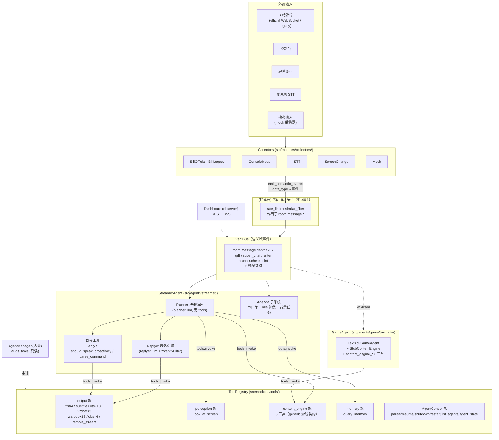
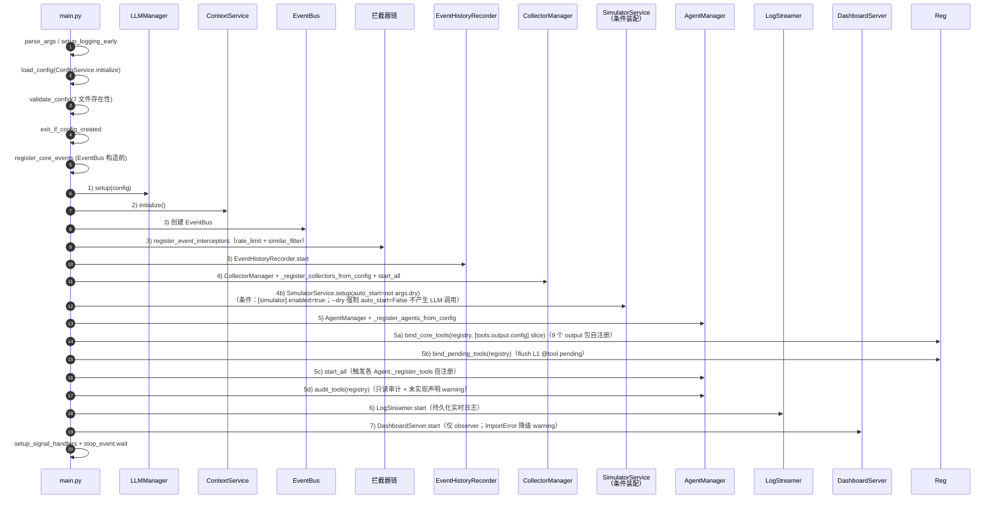
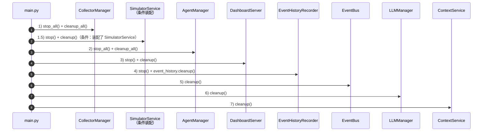

# 架构总览（v2.0.0）

Amaidesu 是一个 **AI VTuber 框架**，v2.0.0 采用 **Agent（自主主体）+ 工具（能力契约）+ 存储（状态/记忆）+ 编排（Agenda 节目单）** 架构。系统以 EventBus 为唯一跨主体通信机制，事件拦截器挂在分发层做语义净化；Collector 从外部世界推入房间消息，Agent 拥有自己的决策循环并消费 ToolRegistry 中的工具完成表达与控制，Dashboard 仅作为 observer，不参与数据流。

> 本文是**速查参考**（组件清单/目录结构/启动时序）。重构的来龙去脉与设计推导见 [v2.0.0 架构叙事](v2-architecture.md)。

## 全景图


```mermaid
flowchart TB
    subgraph Ext["外部输入"]
        Bili["B 站弹幕<br/>(official WebSocket / legacy)"]
        Cons["控制台"]
        Screen["屏幕变化"]
        Mic["麦克风 STT"]
        Mock["模拟输入<br/>(mock 采集器)"]
    end

    subgraph Collectors["Collectors (src/modules/collectors/)"]
        direction TB
        CBili["BiliOfficial / BiliLegacy"]
        CCons["ConsoleInput"]
        CMic["STT"]
        CScreen["ScreenChange"]
        CMock["Mock"]
    end

    subgraph Interceptors["[拦截器] 房间消息净化（§1.46.1）"]
        INT["rate_limit + similar_filter<br/>作用于 room.message.*"]
    end

    subgraph Bus["EventBus（语义域事件）"]
        EB["room.message.danmaku / gift / super_chat / enter<br/>planner.checkpoint<br/>+ 通配订阅"]
    end

    subgraph Streamer["StreamerAgent (src/agents/streamer/)"]
        Planner["Planner 决策循环<br/>(planner_llm, 无 tools)"]
        Reply["Replyer 表达引擎<br/>(replyer_llm, ProfanityFilter)"]
        Agenda["Agenda 子系统<br/>节目单 + idle 补偿 + 背景任务"]
        Tools["自带工具<br/>reply / should_speak_proactively / parse_command"]
    end

    subgraph Game["GameAgent (src/agents/game/text_adv/)"]
        TextAdv["TextAdvGameAgent<br/>+ StubContentEngine<br/>+ content_engine_* 5 工具"]
    end

    subgraph Registry["ToolRegistry (src/modules/tools/)"]
        Out["output 族<br/>tts×4 / subtitle / vts×13 / vrchat×3<br/>warudo×13 / obs×4 / remote_stream"]
        Per["perception 族<br/>look_at_screen"]
        CE["content_engine 族<br/>5 工具（generic 游戏契约）"]
        Mem["memory 族<br/>query_memory"]
        Ctrl["AgentControl 族<br/>pause/resume/shutdown/restart/list_agents/agent_state"]
    end

    Ext --> Collectors
    Collectors -->|"emit_semantic_events<br/>data_type→事件"| INT
    INT --> Bus
    Bus --> Planner
    Bus --> Agenda
    Planner --> Reply
    Planner --> Tools
    Reply -->|tools.invoke| Out
    Tools -->|tools.invoke| Out
    Planner -->|tools.invoke| CE
    Planner -->|tools.invoke| Per
    Planner -->|tools.invoke| Mem
    Bus -.->|wildcard| Game
    Game -->|tools.invoke| CE
    Manager["AgentManager (内置)<br/>audit_tools (只读)"] -.->|审计| Registry
    Dashboard["Dashboard (observer)<br/>REST + WS"] -.-> Bus
```

> 上图省略了几个常驻配角：`LogStreamer`（向 Dashboard 推实时日志）、`EventHistoryRecorder`（事件历史持久化/查看）。v2 pull 编排下不引入扇出通道；lip-sync 由皮套软件自行截取本地音频流，或由后续工具 invoke 能力重建。

## 目录结构

```
Amaidesu/
├── main.py                      # CLI 入口 + v2 组合根（组件构造与生命周期）
├── config/                      # 配置目录（多文件结构，首次运行自动生成）
├── src/
│   ├── agents/                  # 业务 Agent（v2 仅含 StreamerAgent + GameAgent/text_adv 范例）
│   │   ├── streamer/            #   主播 Agent（Planner/Replyer/Agenda/工具/后台维护）
│   │   └── game/text_adv/       #   文字冒险 GameAgent 范例（content_engine 范式）
│   └── modules/                 # 共享模块（基础设施 + 领域组件）
│       ├── agents/              # Agent 框架层：BaseAgent 协议六面 / AgentManager / AgentControl 6 工具 / factory(SUPPORTED_AGENTS)
│       ├── collectors/          # 输入采集域（BaseCollector + CollectorManager + 各域 Collector）
│       │   ├── bilibili/        #   B 站弹幕（legacy 第三方 / official WebSocket）
│       │   ├── console/         #   控制台输入
│       │   ├── mock/            #   确定性 JSONL 回放器（v2.0.7+ ADR-006：仅 jsonl 模式，模拟输入由 simulator/ 接管）
│       │   ├── screen/          #   屏幕变化
│       │   └── stt/             #   语音识别
│       ├── tools/               # 工具族（ToolRegistry + 各 Provider；按 provider=builtin|game 溯源）
│       │   ├── output/          #   tts / subtitle / vts / warudo / obs / remote_stream / debug
│       │   ├── perception/      #   look_at_screen（同步快照工具）
│       │   └── content_engine/  #   通用游戏引擎契约（5 工具 + StubContentEngine）
│       ├── events/              # EventBus + 事件拦截器（rate_limit / similar_filter）
│       │   └── interceptors/    #   EventInterceptor 协议 + InterceptorChain
│       ├── config/              # 配置管理（多文件 Schema 驱动 + 升级钩子）
│       ├── context/             # ContextService（会话历史 + 多会话隔离）
│       ├── dashboard/           # Web Dashboard（FastAPI + WebSocket）
│       ├── di/                  # 依赖注入工具
│       ├── llm/                 # LLM 服务（provider + profile 两层）
│       ├── logging/             # 日志 + LogStreamer
│       ├── memory/              # MemoryProvider + SimpleMemory + query_memory 工具
│       ├── prompts/             # PromptManager（声明式键自动发现）
│       ├── simulator/           # v2.0.7+ ADR-006：LLM 驱动仿真器（开发基础设施）；[simulator].enabled=true 时组合根装配；服务类 SimulatorService + 8 个核心实现类（persona_pool / cadence / gift_generator / llm_wrapper / session_selector / token_budget / types / config_schema）。默认 enabled=false，生产零沾染。详见 docs/development/simulator-guide.md。
│       ├── storage/             # SQLite 存储层
│       ├── tts/                 # TTS 客户端
│       └── types/               # 共享类型（NormalizedMessage 等）
├── dashboard/                   # 前端 SPA（pnpm 构建到 dashboard/dist/，60214 静态挂载）
├── tests/                       # 顶层分组：agents / architecture / config / dashboard / integration / modules（+ characterization / mocks 支撑）
└── docs/                        # 文档（架构 / 开发指南 / 决策记录）
```

> `src/agents/` 只放业务 Agent；`src/modules/agents/` 放框架层（BaseAgent、AgentManager、AgentControl 工具、工厂）。这是 v2 包边界的硬规则。

## 启动与关闭

### 启动时序（`main.py`）


```mermaid
sequenceDiagram
    autonumber
    participant Main as main.py
    participant LLM as LLMManager
    participant Ctx as ContextService
    participant Bus as EventBus
    participant Int as 拦截器链
    participant Rec as EventHistoryRecorder
    participant Col as CollectorManager
    participant Sim as SimulatorService<br/>（条件装配）
    participant Agt as AgentManager
    participant Log as LogStreamer
    participant Dash as DashboardServer

    Main->>Main: parse_args / setup_logging_early
    Main->>Main: load_config(ConfigService.initialize)
    Main->>Main: validate_config(7 文件存在性)
    Main->>Main: exit_if_config_created
    Main->>Main: register_core_events (EventBus 构造前)
    Main->>LLM: 1) setup(config)
    Main->>Ctx: 2) initialize()
    Main->>Bus: 3) 创建 EventBus
    Main->>Int: 3) register_event_interceptors（rate_limit + similar_filter）
    Main->>Rec: 3) EventHistoryRecorder.start
    Main->>Col: 4) CollectorManager + _register_collectors_from_config + start_all
    Main->>Sim: 4b) SimulatorService.setup(auto_start=not args.dry)<br/>（条件：[simulator].enabled=true；--dry 强制 auto_start=False 不产生 LLM 调用）
    Main->>Agt: 5) AgentManager + _register_agents_from_config
    Main->>Reg: 5a) bind_core_tools(registry, [tools.output.config] slice)（9 个 output 包自注册）
    Main->>Reg: 5b) bind_pending_tools(registry)（flush L1 @tool pending）
    Main->>Agt: 5c) start_all（触发各 Agent._register_tools 自注册）
    Main->>Agt: 5d) audit_tools(registry)（只读审计 + 未实现声明 warning）
    Main->>Log: 6) LogStreamer.start（持久化实时日志）
    Main->>Dash: 7) DashboardServer.start（仅 observer；ImportError 降级 warning）
    Main->>Main: setup_signal_handlers + stop_event.wait
```

CLI 选项：`--debug`（DEBUG 日志级别）、`--filter MODULE [MODULE ...]`（仅显示指定模块 INFO/DEBUG，WARNING+ 总显示）、`--dev-webui`（浏览器自动打开 `http://localhost:60315` 而非 `http://127.0.0.1:60214`）、`--dry`（仅验证组合根 wiring，不进入主循环即关闭）。

拦截器默认行为（`core.toml` 的 `[interceptors.*]`，`enabled` 默认 `True`）：

| 拦截器 | 默认参数 | 作用事件 | 行为 |
|--------|---------|---------|------|
| `rate_limit` | `global_rate_limit=100`、`user_rate_limit=10`、`window_size=60` | `room.message.*` | 超阈值返回 `None` 丢弃 |
| `similar_filter` | `similarity_threshold=0.85`、`time_window=5.0`、`min_text_length=3`、`cross_user_filter=True` | `room.message.*` | 相似文本合并（跨用户/同用户可选） |

### 关闭时序（`run_shutdown`，按依赖反向）


```mermaid
sequenceDiagram
    autonumber
    participant Main as main.py
    participant Col as CollectorManager
    participant Sim as SimulatorService<br/>（条件装配）
    participant Agt as AgentManager
    participant Dash as DashboardServer
    participant Rec as EventHistoryRecorder
    participant Bus as EventBus
    participant LLM as LLMManager
    participant Ctx as ContextService

    Main->>Col: 1) stop_all() + cleanup_all()
    Main->>Sim: 1.5) stop() + cleanup()（条件：装配了 SimulatorService）
    Main->>Agt: 2) stop_all() + cleanup_all()
    Main->>Dash: 3) stop() + cleanup()
    Main->>Rec: 4) stop() + event_history.cleanup()
    Main->>Bus: 5) cleanup()
    Main->>LLM: 6) cleanup()
    Main->>Ctx: 7) cleanup()
```

每个步骤包在 `safe_log` 里捕获异常与 `CancelledError`，任意失败不影响后续步骤；全局 `_saw_cancelled` 在最后重抛 `CancelledError` 以便上层感知。

## 组件清单

### ① 采集器（5 类）

| 名称 | 实现位置 | 模式 | 说明 |
|------|---------|------|------|
| `bili_danmaku_official` | `src/modules/collectors/bilibili/official/` | v2 主动推（`_emit_semantic_events=True`，collect 内自行 emit `room.message.*`） | B 站官方 WebSocket 弹幕；含 `client/proto.py` + `client/websocket_client.py` |
| `bili_danmaku` | `src/modules/collectors/bilibili/legacy/` | v2 主动推（`_emit_semantic_events=True`） | B 站第三方 HTTP API 弹幕 |
| `console_input` | `src/modules/collectors/console/` | 兜底转发（基类 `_emit_normalized_message` 把 `data_type` 映射为 `room.message.danmaku/gift/super_chat/enter`） | 控制台输入 |
| `mock_danmaku` | `src/modules/collectors/mock/` | v2 主动推；**v2.0.7+ ADR-006 收敛后仅保留 JSONL 回放**（LLM 驱动仿真由 `src/modules/simulator/` 的 `SimulatorService` 承担，二者互补不互斥） | 确定性 JSONL 回放器 |
| `screen_change` | `src/modules/collectors/screen/` | 兜底转发 | 屏幕变化检测（`screen_change_collector.py`）；同目录另有 `screen_reader.py` + `screen_analyzer.py` 辅助 |
| `stt` | `src/modules/collectors/stt/` | 兜底转发 | 语音识别（`stt_collector.py` + `config.py`） |

注：列表实际为 6 条，"5 类"指 5 个采集域（bilibili 拆为 official/legacy）。**采集配置位置在 `tools.toml` 的 `[tools.perception.config]`**——旧版放在独立的采集配置段，已迁移至此。`_register_collectors_from_config` 读 `enabled` 子段逐项 `instantiate_collector` 并注册到 `CollectorManager`。

### ② Agent

#### 框架层（`src/modules/agents/`）

| 文件 | 内容 |
|------|------|
| `base.py` | `BaseAgent` 协议六面（§1.49）：1.生命周期（start/stop/cleanup + 工厂重建）、2.工具提供（`list_tools()`）、3.事件上报（`emit_event` + `emits_events` 可选声明）、4.状态读写（`_state` + heartbeat）、5.健康（`note_heartbeat/is_alive/dead_threshold_ms`）、6.元数据（`name/description`）。状态机：`CREATED → STARTING → RUNNING → PAUSED → STOPPING → STOPPED → ERRORED`。 |
| `manager.py` | `AgentManager`：注册 / 启动（LIFO） / 停止 / cleanup / 动态启停（`start_agent`/`stop_agent`/`enable_agent`/`disable_agent`）；`audit_tools(registry) -> list[str]` 启动后只读审计未实现工具声明（不参与注册） |
| `control.py` | `AgentControl`（直调接口） + `AgentControlProvider`（注册到 ToolRegistry），对外暴露 6 个 builtin 工具：`pause_agent` / `resume_agent` / `shutdown_agent` / `restart_agent` / `list_agents` / `agent_state` |
| `factory.py` | `SUPPORTED_AGENTS = ("streamer", "game")` + `instantiate_agent(name, config, ...)` 中央化配置名 → 类映射，供组合根与 Dashboard 动态启停共用 |

#### 业务层（`src/agents/`）

`src/agents/streamer/` 主播 Agent 的 21 个模块按角色分组：

| 角色 | 模块 |
|------|------|
| **入口与编排** | `streamer_agent.py`（继承 `BaseAgent`，编排子组件）、`__init__.py` |
| **决策循环（Planner）** | `planner.py`（planner_llm 调 `chat()` 不传 tools，结构化 JSON 输出）、`plan.py`（plan 数据结构） |
| **表达引擎（Replyer）** | `replyer.py`（replyer_llm 调 `chat()` 不传 tools，纯文本 JSON + ProfanityFilter） |
| **节目单（Agenda）** | `agenda.py` / `agenda_loader.py` / `agenda_store.py` / `agenda_state.py` / `agenda_idle.py`（5 文件：编排本身内聚在 Agent 内，直播内容=配置+Planner 上下文/行为模式变化，不是代码模块） |
| **房间与消息** | `room_state.py`（直播间状态聚合）、`message_buffer.py`（弹幕聚合窗口：默认 3s/20 条） |
| **后台维护** | `background.py`（双任务 BackgroundMaintainer 取代旧 RoomStateLoop） |
| **工具实现** | `reply_tool.py`（`reply`）、`proactive_tool.py`（`should_speak_proactively`，底层 `proactive_trigger.py`）、`command_tool.py`（`parse_command`） |
| **时序门** | `timing_gate.py` |
| **命令解析** | `command/command.py` + `command/command_parser.py` + `command/command_registry.py` |
| **提示词** | `prompts/amaidesu_planner.md` + `prompts/amaidesu_replyer.md` + `prompts/agenda_expand.md` |

`src/agents/game/text_adv/` 文字冒险 GameAgent 范例（§1.5.1 content_engine 范式）：`agent.py`（继承 `BaseAgent`）、`state.py`（剧情状态）、`tools.py`（游戏侧 dispatch），构造时注入 `content_engine=StubContentEngine(engine_kind="text_adv")`，通过 `content_engine_*` 5 工具间接驱动引擎；预留 `engine` 配置项以便未来挂 `MinecraftEngine` 等真实实现。

### ③ 工具族

总览：**约 60 个工具**，按 `provider ∈ {"builtin", "game"}` 溯源；`register_provider` 走 `ToolRegistry.register`，**当前组合根尚未自动调用任何 `register_*_tools`**（见"已知缺口"）。

| 族 | Provider | 工具数 | 工具名 |
|----|----------|-------|--------|
| TTS | `builtin` | 8（4 族 × `synthesize`/`get_stats`） | `edge_tts_synthesize` / `edge_tts_get_stats` / `gptsovits_synthesize` / `gptsovits_get_stats` / `omni_tts_synthesize` / `omni_tts_get_stats` / `voicebox_synthesize` / `voicebox_get_stats` |
| Subtitle | `builtin` | 3 | `push_subtitle` / `subtitle_clear` / `subtitle_show_test` |
| VTS | `builtin` | 13 | `vts_smile` / `vts_close_eyes` / `vts_open_eyes` / `vts_set_expression` / `vts_set_parameter_value` / `vts_get_parameter_value` / `vts_trigger_hotkey` / `vts_load_item` / `vts_load_sticker` / `vts_set_idle_enabled` / `vts_reconnect` / `vts_get_stats` / `vts_lip_sync` |
| VRChat | `builtin` | 3 | `vrchat_set_expression` / `vrchat_trigger_gesture` / `vrchat_get_stats` |
| Warudo | `builtin` | 13 | `warudo_set_expression` / `warudo_trigger_hotkey` / `warudo_body_action` / `warudo_head_action` / `warudo_direct_action` / `warudo_push_subtitle` / `warudo_throw_fish` / `warudo_set_sight` / `warudo_set_eyebrow` / `warudo_set_eye` / `warudo_set_pupil` / `warudo_set_mouth` / `warudo_get_stats` |
| OBS | `builtin` | 4 | `obs_send_text` / `obs_switch_scene` / `obs_set_source_visibility` / `obs_send_test` |
| Remote Stream | — | 0（仅 `MessageType`/`StreamMessage` 协议 + `AudioConfig`/`ImageConfig`，无工具） | 留待外部 WebSocket 脚手架接入 |
| Debug | — | 0（`dump_intent` 是函数非工具，DebugConfig 是 dataclass） | 调试输出 |
| Perception | `builtin` | 1 | `look_at_screen`（同步快照工具，注入 `ScreenCapture`/`TextReader` 后端；无后端时返回成功 + 空文本，不抛异常） |
| Content Engine | `builtin` | 5 | `content_engine_start` / `content_engine_stop` / `content_engine_send_input` / `content_engine_status` / `content_engine_get_state`（包装 `ContentEngine` Protocol；`StubContentEngine` 默认实现，生产应注入真实引擎） |
| Memory | `builtin` | 1 | `query_memory`（绑定 `MemoryProvider` 后才可用；查询文本召回 top_k 条记忆） |
| Streamer 自带 | `builtin`（来自 Agent `list_tools()`） | 3 | `reply` / `should_speak_proactively` / `parse_command` |
| Agent Control | `builtin` | 6 | `pause_agent` / `resume_agent` / `shutdown_agent` / `restart_agent` / `list_agents` / `agent_state` |

合计：8 + 3 + 13 + 3 + 13 + 4 + 1 + 5 + 1 + 3 + 6 = **60 个工具**（Remote Stream/Debug 不计）。

## 核心概念

### 判别式：Agent vs Tool

| 维度 | Agent | Tool |
|------|-------|------|
| 谁驱动 | **自我驱动**（持有 asyncio 主循环/后台任务，心跳、状态机、`start/stop`） | **被调才干活**（纯被动，调用即返回 `ToolExecutionResult`） |
| 形态 | 继承 `BaseAgent`，可发事件、可订阅、可销毁重建 | 继承 `ToolProvider`，`list_tools()` + `invoke(ToolInvocation)` |
| 暴露 | 整个生命周期 + `list_tools()` 聚合到 ToolRegistry | 只通过 `ToolRegistry.invoke(name, args)` 暴露给 LLM |
| 例子 | `StreamerAgent`（Planner 循环 + 后台 BackgroundMaintainer）、`TextAdvGameAgent` | `look_at_screen`、`content_engine_send_input`、`vts_set_expression` |

**判别口诀**："谁驱动谁"——能自我维持状态/轮询/心跳的就是 Agent，只在被调用时执行的就是 Tool。

> **直播内容 = 编排配置 + Planner 上下文/行为模式的变化，不是代码模块**。一份节目单不会新增 Agent 或 Tool，只是改变 `StreamerAgent` 加载的 Agenda、Planner 提示词上下文与 Replyer 行为模式。这就是为什么 `src/agents/streamer/` 内的 `agenda_*.py` 等模块是 StreamerAgent 内部子组件，而非顶级模块。

### 生命周期

| 基类 | 启动 | 停止 | 资源释放 | 业务入口 |
|------|------|------|----------|----------|
| **`BaseCollector`** | `start()` → 内部 `_start_collect_task()` 后台消费 `collect()` 生成器（v2 主动推事件模式） | `stop()` → 取消后台任务 | `cleanup()` → `_on_cleanup()` | `collect()`（子类实现，返回 `AsyncIterator[NormalizedMessage]`） |
| **`BaseAgent`** | `start()` → `_on_start()` 钩子 + 心跳 | `stop()` → `_on_stop()` 钩子；额外 `pause()`/`resume()`/`shutdown()`（更严格） | `cleanup()` → `_on_cleanup()` 钩子 | `list_tools()` 抽象 + 自由 `emit_event` + 可选 `emits_events` 声明 |

状态机（两者镜像）：`CREATED → STARTING → RUNNING → STOPPING → STOPPED → ERRORED`；Agent 额外有 `PAUSED` 用于 `pause_agent` 控制。

### 事件系统（摘要）

EventBus 是唯一跨主体通信机制。事件命名采用语义域形式（`room.message.danmaku` / `planner.checkpoint` 等），支持通配订阅（`room.message.*`）。完整事件表（含发布者/订阅者/Payload 类型）见 [事件系统](event-system.md)；命名规则见 [事件命名规范](event-naming-convention.md)。

### 事件拦截器（Interceptor）

挂在 EventBus 分发层的全局单点（`emit` 后、订阅者收到前过同一道链）。内置 `RateLimitInterceptor` + `SimilarFilterInterceptor`，作用于 `room.message.*`，配置见 `core.toml` 的 `[interceptors.*]`。语义契约沿袭自旧管道 Process：返回原事件=透传 / 新事件=转换 / `None`=丢弃。

**敏感词净化不在拦截器层**——主播发言统一出口在 `Replyer.ProfanityFilter`（`src/agents/streamer/replyer.py`）。

## 核心设计原则

### ① 主体性判据（谁驱动谁）

判别 Agent 与 Tool 的硬规则已在"判别式"一节展开。新增功能时，先回答"这个功能有没有自己的状态/轮询/心跳"——有就做成 Agent，没就做成 Tool。这条规则同时约束**反对偷换概念**：基础能力（如屏幕感知、记忆查询）即便被多个 Agent 复用，也应做成 Tool（走 ToolRegistry + Protocol 注入），而不是塞进某个 Agent 内部。

### ② 防插件换皮红线（Agent 包边界）

v2 不再支持"插件系统"——`src/modules/plugins/` 已移除。新功能通过 **Agent 包内聚**实现：

- **内容特有逻辑全部内聚**到 `src/agents/<family>/<name>/`，框架层（`src/modules/`）**零改动**
- 例：新增"MC Agent" → 在 `src/agents/game/minecraft/` 建包，内含 `agent.py`（继承 `BaseAgent`）、`engine.py`（实现 `ContentEngine` Protocol）、`state.py` 等；Agent 自有工具在 `_register_tools()` 中自己 `registry.register_provider(provider)`；公用 builtin 由 `bind_core_tools` 显式装配；启动结束 `audit_tools` 审计
- 例：新增"播报 Agent" → 在 `src/agents/announcer/` 建包，自己订阅自己感兴趣的事件，自己实现 `list_tools()`
- **禁止**为新功能在 `src/modules/` 加新域（除非它真的是跨阶段基础设施）；**禁止**通过 monkey-patching 或 import 副作用往框架注入行为

判别口诀："这是给现有 Agent 加工具，还是这本身就是个新主体？"——加工具进 Agent 自己的包；新主体开新 Agent 包。

### ③ 依赖注入

服务对象（`EventBus` / `LLMManager` / `PromptManager` / `ContextService` / `ConfigService`）一律构造器注入；数据对象（Payload、配置 dict）走参数或 `**kwargs`。**禁止**把服务塞进 Context 容器传递。

```python
# v2 实例：StreamerAgent 构造（main.py:_register_agents_from_config）
agent = StreamerAgent(
    config=cfg_obj,
    llm_manager=llm_service,
    prompt_manager=get_prompt_manager(),
    context_service=context_service,
    event_bus=event_bus,
    # tool_registry / capabilities_provider / sqlite_store 视构造器签名
)
```

详见 [依赖注入指南](../development/dependency-injection.md)。

### ④ 配置驱动

v2 配置为 7 文件树（`core / model / agents / tools / memory / storage / background`），Pydantic Schema 驱动生成/验证/迁移。`[agents]` 与 `[tools]` 段分别管控主体与能力的启用。

```toml
# agents.toml —— 启用哪些 Agent
[agents]
enabled = ["streamer", "game"]

[agents.streamer]
planner_llm = "llm_fast"
replyer_llm  = "llm"
# ... StreamerAgentConfig 其他字段

[agents.game]
engine = "text_adv"
# ... TextAdvGameConfig 其他字段
```

```toml
# tools.toml —— 启用哪些工具族
[tools]
enabled = ["perception", "output"]  # 顶层族启用开关（具体工具族内子工具通过该族的 register_provider 注册）

[tools.perception.config]
enabled = ["stt"]  # Collector 在此启用（采集配置已迁移至 [tools.perception.config]）
bili_danmaku_official = { ... }

[tools.output.tts.edge_tts]
# edge_tts 族工具参数
```

7 文件树、Schema 升级钩子、迁移测试等细节见 [配置 Schema 变更规则](../../AGENTS.md#配置-schema-变更规则) 与 `src/modules/config/` 下相关文档。

### ⑤ 错误隔离

- **ToolRegistry.invoke** 永远不抛异常：未知工具 → 失败 `ToolExecutionResult`；调用方抛异常 → 失败 `ToolExecutionResult` + `error_message`。这让 Agent/LLM 在工具失败时仍能拿到结构化结果继续推进。
- **事件拦截器**返回 `None` 即丢事件；拦截器内部异常会被吞并放行（不丢事件，避免上游 bug 阻塞全链路）。
- **Collector 后台消费任务**异常被 catch（除 `CancelledError` 重抛），单次循环出错不影响采集器后续轮次。
- **AgentManager.stop_all / cleanup_all** 按注册顺序逐一 try/except，单个失败不影响其余 Agent。
- **Dashboard 启动失败**（ImportError 等）仅 warning，整体仍可继续运行。

## 已知缺口

如实记录当前 v2.0.0 组合根（main.py）尚未完成的事项，不掩盖：

1. **渲染工具 `register_*_tools` 无自动调用点**。`src/modules/tools/output/` 下各子包（tts/subtitle/vts/warudo/obs）都暴露了 `register_xxx_tools(registry, config)` 函数，但 `main.py` 的 `create_app_components` 内**没有任何一行调用**。后果：这些工具族在默认 wiring 下不会出现在 `ToolRegistry` 中，LLM 看不到它们。修复方向：组合根按 `[tools.output.<族>]` 段（如 `[tools.output.tts.edge_tts]`）自动调用对应 `register_*_tools`；或文档化要求用户在 wiring 阶段手动注册。**当前需要用户/集成方在 `main.py` 或自定义 wiring 处显式调用 `register_*_tools`**。

2. **AudioStreamChannel 已拆除（2026-08-27）**。v2 pull 编排下无扇出场景，audio pub-sub 链路（`src/modules/streaming/`，300+ 行：AudioStreamChannel / AudioChunk / BackpressureStrategy）已删除；TTS 输出回归本地 `AudioDeviceManager.play_audio`；皮套口型同步责任短期由皮套软件自取本地音频流 / 中期由工具 invoke 能力重建。`LipSyncProcessor` 保留（无其他活跃调用方时仅作历史兜底，可按 git 历史回滚）。

3. **存储记账器未从 payload 取 `simulated` 写入 SQLite 列**。`live_chat` / `gifts` / `super_chats` 表已有 `simulated INTEGER NOT NULL DEFAULT 0` 贯穿列（`src/modules/storage/schema.py:149/163/177`），但记账器写入链尚未从 `RoomMessagePayload.simulated` 读取该字段写入对应列。修复方向：记账器订阅 `room.message.*` 事件，从 payload 取值写入对应列；**不需升 `SCHEMA_VERSION`**（表结构已就位，仅缺数据迁移链）。本任务停在 payload 层标记完成（详见 ADR-006 §C 与 [模拟器指南 §4](../development/simulator-guide.md#4-simulated-溯源)）。

## 相关文档

- [数据流规则](data-flow.md) - 数据流约束与禁用模式（已按 v2 主体/工具/采集器重写）
- [事件系统](event-system.md) - EventBus 与事件拦截器使用指南（完整事件表的单一事实源）
- [事件命名规范](event-naming-convention.md) - 语义域事件命名规则
- [架构决策记录](adr/README.md) - ADR 清单（v2 各 Wave 决策）
- [Agent 包开发指南](../development/component-guide.md) - 业务 Agent 开发详解
- [依赖注入指南](../development/dependency-injection.md) - 注入约定与决策清单
- [测试指南](../development/testing-guide.md) - 测试分层（agents/architecture/config/dashboard/integration/modules + characterization/mocks 支撑）

---

*最后更新：2026-08-28（v2.0.8 Sticker 事件链全链删除——`StickerHelper` 零实例化零调用、C1 治理收口；全景图 mermaid 节点 EventBus / ToolRegistry 移除 `output.sticker.command` / `sticker(走事件)` 引用；目录结构 `output/` 描述去掉 `sticker /`；组件清单表删除 Sticker 行（"0（走事件）"）；末尾合计公式 + 注释移除 Sticker；事件系统摘要段删除 `output.sticker.command` 示例）*

*上次更新：2026-08-28（ADR-006 落地：mock_danmaku 表格描述收敛为"确定性 JSONL 回放器（LLM 仿真由 simulator/ SimulatorService 承担）"；`simulator/` 目录条目改写为开发基础设施描述；启动时序补 4b SimulatorService 步骤（条件装配，--dry 强制 auto_start=False）、关闭时序补 1.5 SimulatorService 关闭步骤；已知缺口第 3 条由 `simulator/` 已脱线替换为"存储记账器 simulated 列写入链缺口"——`live_chat`/`gifts`/`super_chats` 表已有列但记账器未从 payload 读取，**不升 SCHEMA_VERSION**）*

*上次更新：2026-08-27（v2.0.6 AudioStreamChannel 拆除：组合根阶 1 步骤删除、`src/modules/streaming/` 全包 `git rm`、4 个 TTS 工具 + VTS/Warudo/VRChat Provider 移除 audio_stream_channel 注入、`lip_sync_subscriber.py` 删除；`LipSyncProcessor.on_start/on_chunk/on_end` 通道回调删除（会话方法保留）；`remote_stream` 模块 docstring 移除 AudioBus 引用；启动时序 mermaid 同步去除 `Audio` 参与者，本节"已知缺口"对应条目重写为拆除说明；目录结构去掉 `streaming/` 行；v2.0.5 工具注册路径对齐：mermaid 节点 `AgentManager` 改 `audit_tools (只读)`；启动时序在 `start_all` 前补 `bind_core_tools` / `bind_pending_tools` 两步、`start_all` 后补 `audit_tools` 一步；`manager.py` 行删除 `register_all_tools` / `collect_tool_specs` 改为 `audit_tools` 只读审计；MC Agent 示例改为 Agent 子类自注册 + 显式 bind）*