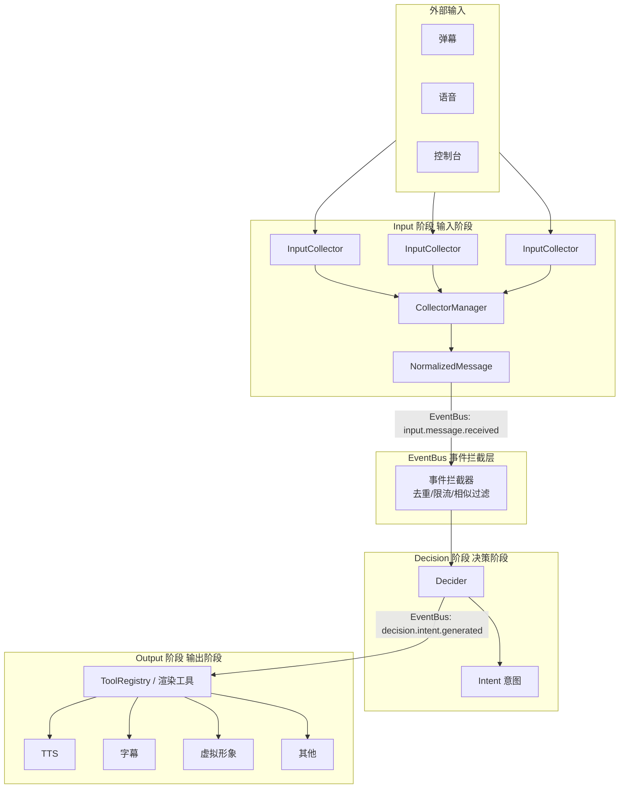
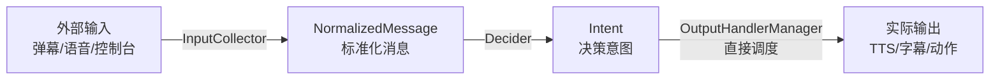
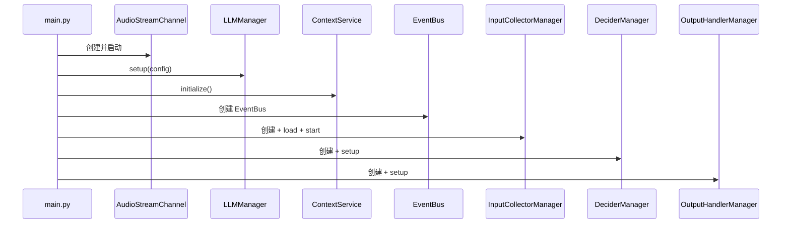

# 架构总览

 Amaidesu 是一个 **AI VTuber 框架**，采用 **3 阶段架构** 实现从外部输入到多端输出的完整数据流处理。

## 核心架构


```mermaid
flowchart TB
    subgraph External["外部输入"]
        Danmaku["弹幕"]
        Voice["语音"]
        Console["控制台"]
    end

    subgraph InputStage["Input 阶段 输入阶段"]
        direction TB
        IP1[InputCollector]
        IP2[InputCollector]
        IP3[InputCollector]
        ICM[CollectorManager]
        NM[NormalizedMessage]
    end

    subgraph EventBusLayer["EventBus 事件拦截层"]
        INT[事件拦截器<br/>去重/限流/相似过滤]
    end

    subgraph DecisionStage["Decision 阶段 决策阶段"]
        DP[Decider]
        Intent[Intent 意图]
    end

    subgraph OutputStage["Output 阶段 输出阶段"]
        direction TB
        OPM[ToolRegistry / 渲染工具]
        OP1[TTS]
        OP2[字幕]
        OP3[虚拟形象]
        OP4[其他]
    end

    External --> IP1
    External --> IP2
    External --> IP3
    IP1 --> ICM
    IP2 --> ICM
    IP3 --> ICM
    ICM --> NM
    NM -->|"EventBus: input.message.received"| INT
    INT --> DP
    DP --> Intent
    DP -->|"EventBus: decision.intent.generated"| OPM
    OPM --> OP1
    OPM --> OP2
    OPM --> OP3
    OPM --> OP4
```

## 数据流

```
外部输入（弹幕、游戏、语音）
        ↓
【Input 阶段】InputCollector → NormalizedMessage
        ↓ EventBus: input.message.received（经事件拦截器：去重/限流/相似过滤）
【Decision 阶段】Decider → Intent
        ↓ EventBus: decision.intent.generated
【Output 阶段】渲染工具（TTS、字幕、虚拟形象等）直接并行渲染
```

### 数据类型流


```mermaid
flowchart LR
    EXT[外部输入<br/>弹幕/语音/控制台] -->|InputCollector| NM[NormalizedMessage<br/>标准化消息]
    NM -->|Decider| I[Intent<br/>决策意图]
    I -->|OutputHandlerManager<br/>直接调度| AO[实际输出<br/>TTS/字幕/动作]
```

## 目录结构

```
Amaidesu/
├── main.py                      # CLI 入口 + v2 组合根（组件构造与生命周期）
├── config/                      # 配置目录（多文件结构，首次运行自动生成）
├── src/
│   ├── agents/                  # 业务 Agent（主播 StreamerAgent：planner/replyer/agenda）
│   └── modules/                 # 共享模块（基础设施 + 领域组件）
│       ├── agents/              # AgentManager（Agent 注册与生命周期）
│       ├── collectors/          # 输入采集域（CollectorManager + 各 Collector）
│       │   ├── bilibili/        #   B 站弹幕（legacy / official）
│       │   ├── console/         #   控制台输入
│       │   ├── mock/            #   模拟弹幕
│       │   ├── screen/          #   屏幕变化
│       │   └── stt/             #   语音识别
│       ├── tools/               # 输出渲染域（ToolRegistry + 渲染工具）
│       │   └── output/          #   tts / subtitle / vts / warudo / obs / sticker…
│       ├── events/              # EventBus + 事件拦截器（rate_limit / similar_filter）
│       │   └── interceptors/    #   EventInterceptor / InterceptorChain
│       ├── config/              # 配置管理（多文件 Schema 驱动 + 升级钩子）
│       ├── context/             # ContextAssembler 快照组装
│       ├── dashboard/           # Web Dashboard API
│       ├── di/                  # 依赖注入
│       ├── llm/                 # LLM 服务（provider + profile 两层）
│       ├── logging/             # 日志系统
│       ├── memory/              # MemoryProvider
│       ├── prompts/             # 提示词管理
│       ├── simulator/           # 模拟直播间服务（独立一等公民，非采集器）
│       ├── storage/             # SQLite 存储层
│       ├── streaming/           # 音频流通道
│       ├── tts/                 # TTS 客户端
│       └── types/               # 共享类型（NormalizedMessage / Intent 等）
└── docs/                       # 项目文档
    ├── architecture/           # 架构文档
    └── development/            # 开发指南
```

## 组件关系

### 启动流程


```mermaid
sequenceDiagram
    participant Main as main.py
    participant Audio as AudioStreamChannel
    participant LLM as LLMManager
    participant Context as ContextService
    participant Event as EventBus
    participant Input as InputCollectorManager
    participant Decision as DeciderManager
    participant Output as OutputHandlerManager

    Main->>Audio: 创建并启动
    Main->>LLM: setup(config)
    Main->>Context: initialize()
    Main->>Event: 创建 EventBus
    Main->>Input: 创建 + load + start
    Main->>Decision: 创建 + setup
    Main->>Output: 创建 + setup
```

**组件创建顺序**：

1. **AudioStreamChannel** - 音频流通道
2. **LLMManager** - LLM 服务管理
3. **ContextService** - 上下文服务
4. **EventBus** - 事件总线
5. **InputCollectorManager** - 输入阶段管理
6. **DeciderManager** - 决策阶段管理
7. **OutputHandlerManager** - 输出阶段管理

## 阶段参与者列表

### InputCollector（7个）

| 名称 | 说明 | 位置 |
|------|------|------|
| console_input | 控制台输入 | `src/stages/input/collectors/console_input/` |
| bili_danmaku | B站弹幕（第三方API） | `src/stages/input/collectors/bili_danmaku/` |
| bili_danmaku_official | B站弹幕（官方WebSocket） | `src/stages/input/collectors/bili_danmaku_official/` |
| text_adv_game | 文字冒险游戏画面输入 | `src/stages/input/collectors/text_adv_game/` |
| mock_danmaku | 模拟弹幕（测试用） | `src/stages/input/collectors/mock_danmaku/` |
| read_pingmu | PingMu读取 | `src/stages/input/collectors/read_pingmu/` |
| stt | 语音识别 | `src/stages/input/collectors/stt/` |

### 模拟服务（1个，独立一等公民）

| 名称 | 说明 | 位置 |
|------|------|------|
| SimulatorService | 模拟直播间（调试工具，LLM 生成观众消息；非采集器，独立生命周期与配置域） | `src/modules/simulator/` |

### Decider（5个）

| 名称 | 说明 | 位置 |
|------|------|------|
| amaidesu | Amaidesu 决策（默认，Planner/Replyer 两阶段 + [直播大纲机制](outline-mechanism.md)） | `src/stages/decision/deciders/amaidesu/` |
| maibot | MaiBot 决策 | `src/stages/decision/deciders/maibot/` |
| llm | 本地 LLM 决策 | `src/stages/decision/deciders/llm/` |
| command | 通用命令意图路由 | `src/stages/decision/deciders/command/` |
| replay | 回放决策（调试用） | `src/stages/decision/deciders/replay/` |

### OutputHandler（12个）

#### 音频输出（TTS）

| 名称 | 说明 | 位置 |
|------|------|------|
| edge_tts | Edge TTS | `src/stages/output/handlers/audio/edge_tts/` |
| gptsovits | GPT-SoVITS TTS | `src/stages/output/handlers/audio/gptsovits/` |
| omni_tts | Omni TTS | `src/stages/output/handlers/audio/omni_tts/` |
| voicebox | VoiceBox TTS | `src/stages/output/handlers/audio/voicebox/` |

#### 虚拟形象

| 名称 | 说明 | 位置 |
|------|------|------|
| vts | VTubeStudio | `src/stages/output/handlers/avatar/vts/` |
| warudo | Warudo 控制 | `src/stages/output/handlers/avatar/warudo/` |
| vrchat | VRChat | `src/stages/output/handlers/avatar/vrchat/` |

#### 其他输出

| 名称 | 说明 | 位置 |
|------|------|------|
| subtitle | 字幕渲染 | `src/stages/output/handlers/subtitle/` |
| sticker | 表情贴纸 | `src/stages/output/handlers/sticker/` |
| obs_control | OBS 控制 | `src/stages/output/handlers/obs_control/` |
| remote_stream | 远程流输出 | `src/stages/output/handlers/remote_stream/` |
| debug_console | 调试控制台输出 | `src/stages/output/handlers/debug_console/` |

## 核心概念

### 阶段参与者生命周期

三种阶段参与者的生命周期方法**唯一权威定义在 [开发规范 §10.2](../development-guide.md#102-阶段参与者生命周期)**：

| 参与者类型 | 启动 | 停止 | 业务入口 |
|------|-----|------|----------|
| InputCollector | `start()` | `stop()` + `cleanup()` | `collect()` |
| Decider | `setup()` | `cleanup()` | `decide()` |
| OutputHandler | `init()` | `cleanup()` | `handle(intent)`（Manager 直接调用，不订阅调度事件） |

**关键差异**：OutputHandler 与 Input/Decision 不同——它**不订阅阶段调度事件**，由 Manager 直接调用 `handle(intent)`。完整说明见 [阶段参与者开发](../development/component-guide.md)。

### 事件系统

项目使用 **EventBus** 作为唯一的跨阶段通信机制，事件按动词链 `received → generated → dispatched → finished` 流转。

**核心事件**（完整事件表见 [事件系统](event-system.md#事件载荷类型)）：

| 事件名 | 方向 |
|--------|------|
| `input.message.received` | Input → Decision |
| `decision.intent.generated` | Decision → OutputHandlerManager |
| `output.intent.dispatched` | 监控信号（Broadcaster/EventRecorder 等观察，不触发 Handler） |
| `output.intent.finished` | Manager 聚合全部 handler 完成后发布 |

> **直接调度说明**：Output 域调度点是唯一分发出口——订阅 `decision.intent.generated`，发布 `output.intent.dispatched` 监控信号，然后为每个 active Handler 创建任务并直接调用 `handle(intent)`，用 `gather` 等待全部完成后发布 `output.intent.finished`。Handler 不订阅 `output.intent.dispatched`，也不发布 `output.handler.completed`（后者为 Manager 内部语义，详见 [事件系统](event-system.md)）。

### 事件拦截器（Interceptor）

"在事件路上拦一下做点事"的全局单点（§1.46.1）：emit 后、订阅者收到前，所有事件过同一道拦截器链（挂在 EventBus 分发层）。

**内置拦截器**：
- `rate_limit` - 频率限制（防刷屏/防突发）
- `similar_filter` - 相似消息过滤

语义契约沿袭自旧管道 Process：返回原事件=透传 / 新事件=转换 / `None`=丢弃。敏感词净化不在拦截器层——主播发言统一出口在 Replyer（ProfanityFilter）。配置见 `core.toml` 的 `[interceptors.*]`。

### 音频流系统

**AudioStreamChannel** 是专门的音频数据传输通道，与 EventBus 分离，用于高效传输大量音频数据。

- **EventBus**: 用于元数据事件（开始/结束/状态通知）
- **AudioStreamChannel**: 用于音频数据流（chunk 数据传输）

**TTS Handler** 通过 AudioStreamChannel 发布音频：
1. 调用 `notify_start(AudioMetadata(...))` 通知开始
2. 循环调用 `publish(AudioChunk(...))` 发布音频块
3. 调用 `notify_end(AudioMetadata(...))` 通知结束

**Avatar Handler** 订阅 AudioStreamChannel 接收音频：
- 接收 AudioChunk
- 重采样到目标采样率
- 处理音频数据（口型同步等）

## 核心设计原则

### 1. 依赖注入

所有服务通过构造器注入，避免硬编码：

```python
def __init__(
    self,
    config: Dict[str, Any],
    event_bus: EventBus,
    audio_stream_channel: AudioStreamChannel,
):
    self.audio_stream_channel = audio_stream_channel
    self.event_bus = event_bus
```

### 2. 配置驱动

通过 TOML 配置文件启用/禁用阶段参与者：

```toml
# 输入 Collector
[collectors]
enabled = ["console_input", "bili_danmaku"]

# 决策 Decider（可多选，并行处理）
[deciders]
enabled = ["amaidesu"]

# 输出 Handler
[handlers]
enabled = ["edge_tts", "subtitle", "vts"]
```

### 3. 错误隔离

单个 Handler 失败不影响其他 Handler，每个 Handler 的错误都被隔离处理。

### 4. 数据流规则

**严格遵守单向数据流**：
- Input 阶段 -> Decision 阶段 -> Output 阶段
- 禁止 OutputHandler 订阅 Input 事件
- 禁止 Decider 订阅 Output 事件
- InputCollector 不应订阅下游数据事件（元控制信号如 `output.intent.finished` 除外）

### 5. 类型安全

- 所有阶段参与者都继承基类，提供统一的接口
- 使用 Pydantic BaseModel 定义所有数据模型
- 使用类型注解确保类型安全

## 相关文档

- [数据流规则](data-flow.md) - 数据流约束和规则
- [事件系统](event-system.md) - EventBus 与事件拦截器使用指南
- [阶段参与者开发](../development/component-guide.md) - 阶段参与者开发详解

---

*最后更新：2026-08-25（§1.46.1 收官：管道→事件拦截器正名，移除 OutputPipeline/Pipeline 叙事；目录树更新为 v2 实际布局）*
