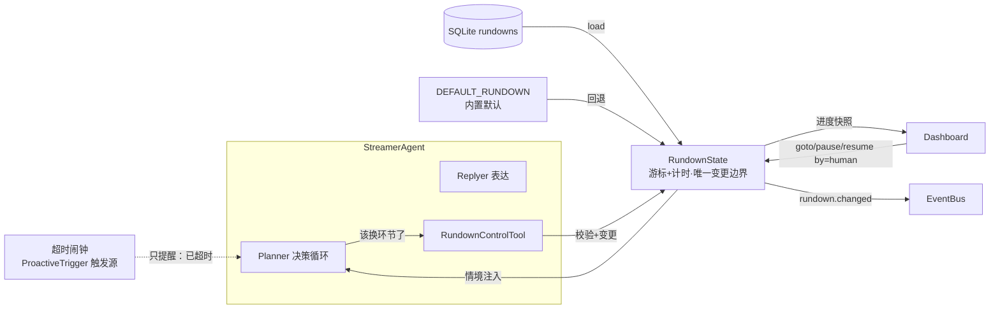

# 流程单编排机制（Rundown Mechanism）

> 本文档是流程单（Rundown）子系统的权威设计说明。
> 流程单是主播 Agent 的"战略层"轻量形态：导演预写的环节清单（备忘录）叠加超时提醒（闹钟），让一场直播按预定义环节自动获得方向——零观众也能按计划直播，弹幕可打断但始终对齐当前环节。
> 事件表、数据流规则等单一事实源不在此重复，见[事件系统](./event-system.md)与[数据流规则](./data-flow.md)。

> **历史沿革**：v1 称"直播大纲 Outline"，v2 重命名为 Agenda 并实现为独立调度子系统，v3 推翻重设计为流程单并采纳行业术语（英文制作圈 Run of Show / rundown、日语圈 進行表、中文圈分钟级脚本）。行业对"逐字稿"与"环节时间轴"的切分是本次重设计的粒度依据：流程单只做环节时间轴，话术由 Agent 现场即兴。决策缘由见 [ADR-011](./adr/011-rundown-replaces-agenda.md)。

## 设计公理

1. **备忘录 + 闹钟**：流程单不是执行器，是给自驱动 Agent 的参考材料与定时提醒。它不驱动任何循环。
2. **推进权归 Agent**：主播 Agent 是自驱动主体（主体性判据），"何时切换环节"是它自己的决定，通过工具调用表达。系统提供剧本（导演意图）、时间压力（情境注入）、超时提醒（闹钟），不替它按推进按钮。
3. **无调度器**：不存在与 Agent 竞争推进权的外部循环；一切状态变更经唯一边界发生。

## 模块归属

子系统全部位于 `src/agents/streamer/rundown/` 子包（主播 Agent 内部契约，不跨 Agent 共享）：

| 文件 | 职责 |
|------|------|
| `rundown.py` | 数据契约 `Rundown` / `RundownSegment` + 内置默认流程单 `DEFAULT_RUNDOWN` |
| `rundown_state.py` | 运行时状态：游标 + 计时 + 唯一变更边界 |
| `rundown_tool.py` | `RundownControlTool`：Agent 切换/暂停/恢复环节的工具 |
| 闹钟 | 不在本包——并入 `proactive_trigger.py`，作为一个触发源（`rundown_overdue`） |

存储 CRUD 位于 `src/modules/storage/`（Dashboard 编排页与 Agent 共用的关注点）。



## 数据模型（`rundown.py`）

Pydantic BaseModel，`extra="forbid"`。

### `RundownSegment`

单个环节：

- `id`：环节唯一标识（流程单内唯一，goto 定位用）
- `title`：环节标题，面向人展示
- `task_description`：给 AI 的目标指引，允许自由发挥
- `key_points`：要点列表（可空）
- `expected_ms`：预期停留时长（毫秒，`>= 1000`）——只用于进度显示与超时提醒，**不是切换器**
- `min_duration_ms`：最少停留时长（可选）——工具校验下界，防御 Agent 抢跑
- `notes`：备注（可选）——导演直录内容（如参考开场白），直接注入上下文

### `Rundown`

整场流程单：

- `rundown_id`：业务唯一标识（存储主键、配置引用同一 id）
- `title`：标题
- `segments`：环节列表，非空

校验仅两条：环节 `id` 唯一；`min_duration_ms <= expected_ms`。无分支、无回退字段——"分支"是 Agent 看到情境中的后续环节列表后自行 `goto` 的决定，不是数据结构。

### `DEFAULT_RUNDOWN`

内置默认流程单（包内常量，主题"初次直播·自我介绍"：开场问候 / 自我介绍 / 互动闲聊 / 收尾预告）。当配置未选单、所选 id 不存在或库为空时启用；**虚拟存在，不写库**——用户在 WebUI 建立第一份流程单后自然替代。编辑器"新建"可从它预填。

## 存储

权威存储为 SQLite `rundowns` 表（内容数据归存储，不进配置文件）：

```sql
CREATE TABLE IF NOT EXISTS rundowns (
    id            TEXT PRIMARY KEY,
    title         TEXT NOT NULL,
    segments_json TEXT NOT NULL,
    created_at_ms INTEGER NOT NULL,
    updated_at_ms INTEGER NOT NULL
);
```

- 环节列表整体读写（每单 3-10 环节），不建子表。
- **运行进度不持久化**：重启即重读流程单从头开始；崩溃续播是伪需求。
- v2 遗留的 `agenda_plan` / `agenda_runtime` 两表在 schema 迁移中 DROP（该存储链路从未接线，表保证为空）。
- TOML 无关：流程单没有文件格式，一律经 WebUI 建立。

## 运行时状态（`rundown_state.py`）

`RundownState` 只回答"现在在哪个环节、整场进度几分之几"，可变字段仅四个：

| 字段 | 含义 |
|------|------|
| `rundown` | 当前流程单（`None` = 未启用） |
| `index` | 当前环节下标（`-1` = 未开始/已结束） |
| `segment_started_at_ms` | 当前环节开始锚点 |
| `paused_at_ms` | 非空 = 暂停中（计时冻结） |

`status`（idle / running / paused / done）是派生值，不是状态机枚举。所有方法接受可选 `now_ms`（可注入时钟，测试不依赖 wall clock）。

变更方法（**唯一变更边界**，Agent 工具与 Dashboard 按钮走同一路径）：

| 方法 | 校验 | 副作用 |
|------|------|--------|
| `load(rundown)` | 段非空 | 重置游标，置位首段扩展情境 |
| `goto(segment_id, by)` | id 存在；已达 `min_duration_ms` | 变更游标 → 发事件 → 置 proactive 信号 |
| `next(by)` | 同上 | 顺序推进 |
| `pause()` / `resume()` | 状态合法 | 计时冻结/恢复 |

- 每次变更：校验 → 变更 → emit `rundown.changed` → 置 proactive 信号。人机谁后写谁生效，Agent 下一轮从情境中看到新环节——没有覆盖标志协议。
- 推进历史环形缓冲（最近 50 条：动作 / 环节 / by / 时刻）供 Dashboard 调试页展示"为什么跳到这里"。
- 校验失败不抛异常出边界：返回结构化拒绝原因（含可用环节列表 / 剩余等待时长），进入 Agent 上下文自纠。

## Agent 工具（`rundown_tool.py`）

`RundownControlTool`，actions：

- `next`：顺序切到下一环节
- `goto(segment_id)`：跳到指定环节（不限方向；情境中列出后续环节供选择）
- `pause` / `resume`：暂停/恢复计时

约束在变更边界执行（`min_duration_ms` 拒绝、id 存在性拒绝）。成功切换后的新环节开场发言由正常决策链（proactive 信号 → Planner/Replyer）现场生成——没有预生成话术。

## 超时闹钟（并入 `proactive_trigger.py`）

环节 `expected_ms` 到期后，闹钟按冷却间隔（默认 1 分钟）以 `reason="rundown_overdue"` 唤醒一轮 proactive 决策。Agent 醒来看到的情境是"当前环节已超时 X 分钟"，由它自行决定继续、切换或收尾——**只提醒，不执法**。若未来证明需要硬切换，在闹钟处加 `hard_cutoff` 策略直接调 `goto` 即可（预留，不实现）。

v2 的独立调度循环与旧检查点事件不保留；空闲提醒职责归 ProactiveTrigger 自身，与流程单无关。

## 事件（唯一）

`rundown.changed` / `RundownChangedPayload`：

- `rundown_id`：流程单 id
- `segment_id` / `segment_title`：变更后环节
- `index` / `total`：位置
- `by`：`agent` | `human` | `system`（闹钟兜底硬切换时为 system）
- `at_ms`：变更时刻（Unix 毫秒）

发布者：`RundownState` 变更边界（唯一）。订阅者：Dashboard、事件记录器。

## 与外部组件关系

| 组件 | 关系 |
|------|------|
| `StreamerAgent` | 装配者：setup 时 `rundown_id` → repo 加载（空/缺失回退 `DEFAULT_RUNDOWN`，fail-soft）→ `state.load`；cleanup 无需停任何循环 |
| `Planner` / `Replyer` | 每轮获得情境注入：当前环节 n/N、目标、要点、notes、剩余时间、整场进度、后续环节列表 |
| `ProactiveTrigger` | 承载超时闹钟触发源；`rundown_pending` 信号（原 agenda_pending）由工具/仪表盘/闹钟三个来源置位 |
| `Dashboard` | 编排页：流程单库（列表/复制/删除）+ 编辑器（环节卡片排序+表单）+ 直播控制台（当前环节/进度/手动切换/插入环节）；直播中编辑写穿 DB |
| 存储 | `rundowns` 表 CRUD（`src/modules/storage/`） |

## 配置

`config/agents.toml` 的 `[agents.streamer]` 段仅一个字段：

```toml
[agents.streamer]
rundown_id = ""   # 空 = 使用内置默认流程单；指向 rundowns 表中的 id
```

v2 的 agenda_* / v1 的 outline_* 字段在配置迁移中剥离，不做内容迁移（Agenda 默认关闭且从未实测，无存量数据）。

## 架构约束

- 子系统全部内聚 `src/agents/streamer/rundown/`，不跨 Agent 共享；闹钟复用 ProactiveTrigger，不新建循环组件
- 不新增事件：仅 `rundown.changed` 一个语义域事件（事件表见[事件系统](./event-system.md)）
- 状态变更只经 `RundownState` 变更边界；工具、Dashboard、闹钟兜底皆不绕过
- 闹钟只提醒不执法；硬切换策略留位不实现（YAGNI）
- 情境注入只读 `RundownState`，不订阅 Output 事件（数据流红线）
- 存储失败隔离：DB 不可用时 Agent 以默认流程单或无流程单继续运行，日志记录原因
