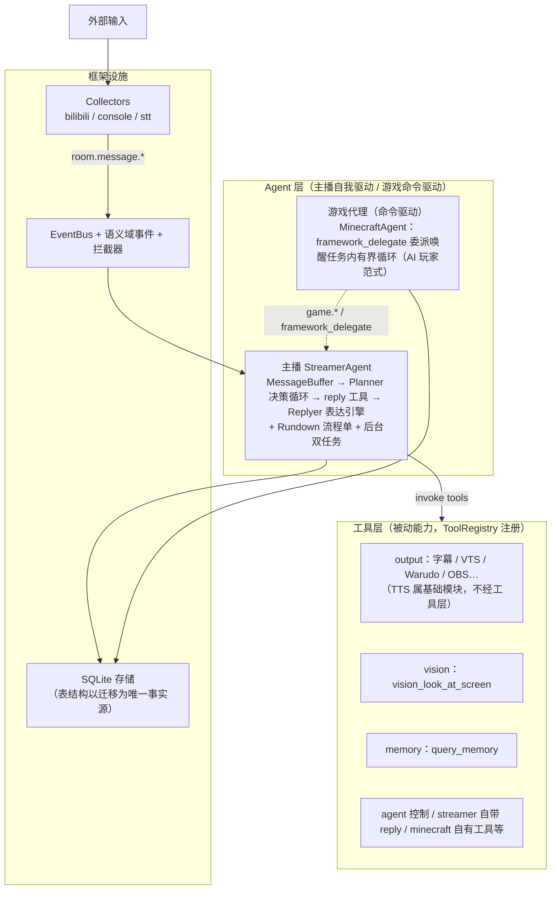

# Amaidesu 架构：自主主播与工具契约

> **本文定位**：这是 Agent + 工具架构的**完整叙事文档**——为什么选 Agent + 工具（而不是流水线）、这套分层如何从第一性原理推导出来、各层怎样设计与落地。它回答"为什么是这样"；速查类内容（组件清单、事件全表、API 细节）见文末相关文档。

---

## 三阶段架构为什么走不下去

三阶段流水线（采集器标准化消息 → Decider 决策出 Intent → Handler 并行渲染）暴露出四个结构性问题：

1. **Intent 是虚构的中间表示**。决策的本质是"调用渲染能力"，Intent 数据类和 `decision.intent.generated` 事件链是为管道而管道——真正需要 Intent 形状的消费者只有输出调度点自己。
2. **三套参与者生命周期并存**。Collector 用 `start()/collect()`、Decider 用 `setup()/decide()`、Handler 用 `init()/handle(intent)`，三种范式三套心智负担。
3. **加内容必须动框架**。新增直播玩法或游戏代理要改阶段管理器、注册表、事件链——框架没有做到"加内容零改动"。
4. **主播的主体性被肢解**。"聚合弹幕 → 判断要不要说话 → 生成表达 → 驱动渲染"这个完整的自主循环被拆散在三个阶段的 Manager 里，没有任何一处代码拥有闭环。主播退化成一台**被观众消息喂食的应答机**。

同期，以 MaiBot 为决策核心的桥接路线（maibot_decider 等）确认放弃：两个项目的架构已显著分化，桥接维护成本高于收益，Amaidesu 需要一条独立演进的主干。

## 第一性原理：从应答机到表达者

### 主体性判据：空房间冷启动

> **核心目标：Amaidesu 是从"应答机"走向"表达者"。**

判别标准是一个硬性思想实验——**空房间冷启动**：

> 给系统一个直播空房间，没有任何观众、任何外界消息。问：系统会自己动吗？
>
> - 三阶段老架构：**静止**。管道由数据驱动，无外界刺激即停摆——它是应答机。
> - 有主体性的架构：**自主推进**。按节目单推进内容、主动开口、有自己的节奏——观众是锦上添花，不是燃料。

由此派生三个层级（缺一即滑向换皮）：**意图来自自我**（节目单/人格/目标，而非观众消息）、**行为自主**（主动说话/推进/取舍，而非被迫反应）、**独立核心**（不是任何外部 Bot 的外壳）。

### 核心判别式：谁驱动谁

落到工程上，整个架构收敛为一个判别式。从四个维度展开才能区分干净：

| | 谁驱动 | 形态 | 暴露 | 例子 |
|---|---|---|---|---|
| **主播 Agent** | 自我驱动（唯一），直播期间持续运行 | 继承 `BaseAgent`，拥有决策循环 + 后台维护 | 整个生命周期 + `list_tools()` 聚合到 ToolRegistry | `StreamerAgent`（Planner 决策循环 + 后台 BackgroundMaintainer） |
| **游戏 Agent** | 命令驱动（类 Code Agent）：命令唤醒，任务内有界循环，完成即停、空闲零消耗 | 同上 | 同上 | `TextAdvGameAgent`、`MinecraftAgent`（framework_delegate 委派唤醒） |
| **工具** | 被调才干活（纯被动，调用即返回 `ToolExecutionResult`） | 继承 `ToolProvider`，`list_tools()` + `invoke(ToolInvocation)` | 仅经 `ToolRegistry.invoke(name, args)` 暴露给 LLM | `vision_look_at_screen`、`memory_query_memory`、`vts_set_expression`（TTS 已迁至基础模块层，不是工具） |

**判别口诀**：能自我维持状态/轮询/心跳的就是 Agent，只在被调用时执行的就是 Tool。落到工程上只需回答一句——"这个功能有没有自己的状态/轮询/心跳？"有就做成 Agent，没就做成 Tool。

这条规则同时约束**反对偷换概念**：基础能力（屏幕感知、记忆查询）即便被多个 Agent 复用，也应做成 Tool（走 ToolRegistry + Protocol 注入），而不是塞进某个 Agent 内部。Agent 包的红线细则见「Agent 包边界硬规则」一节。

以及一句对内容生产者的解放：**直播内容是编排配置 + Planner 上下文/行为模式的变化，不是代码模块。** 加一档节目不需要写代码，加一类游戏才需要一个新 Agent 包。

## 防换皮的两道铁闸

### 为什么需要铁闸

三代换皮史证明：没有结构性约束，重构会在惯性下退回原形。git 历史调研同时挖出了当年插件系统被废的五大理由（过度插件化、服务注册复杂度、插件间依赖成石山、消息流不清晰、配置分散）——本架构对每一条都有明确的规避设计：

| 插件的错 | 规避设计 |
|---|---|
| 核心功能也做成插件，必需与可选混杂 | 工具/存储/记忆/事件/LLM 全部是框架基础设施（`src/modules/`）；只有"主体"住在 Agent 包里 |
| 服务注册机制，依赖运行时才暴露问题 | 无服务注册；构造器注入 + 事件/工具契约 |
| 24 个插件互相依赖成石山 | 游戏 Agent 之间零依赖，经事件（`game.*`）/状态（工具，如 text_adv_get_state）/指令（framework_delegate 委派原语）三通道松耦合 |
| 消息流经中心中转，链路不清 | Agent → 工具/事件/存储直达，单向清晰 |
| 全局/插件级配置混乱 | 六文件按领域拆分 + Pydantic Schema 校验 |

### Agent 包边界硬规则

- ✅ Agent 包**只内聚主体的自我**：决策循环、目标、该内容的专属玩法逻辑
- ✅ 基础设施全部外借：感知用公用 `vision_look_at_screen`、记忆用 storage/memory、表达走框架 reply 体系
- ❌ 红线（出现即等于插件换皮）：自备感知后端 / 自建缓存 / import 其他 Agent 的模块 / 包里塞配置读取逻辑 / 依赖服务注册

**判别口诀**：插件是功能封闭自包含包（什么都自带、互相依赖）；Agent 包是主体开放内聚包（只带自我，能力全借框架，Agent 间零依赖）。

### 实现层的两条硬考验

所有主体性设计最终落在两条可检验的约束上：

1. **Planner 循环必须由自我意图（Rundown 流程单）驱动**，而非由"消息到达"驱动；
2. **空房间里 Planner 必须能自主产生行动**（推进 Rundown、主动说话），而非空转等喂食。

> ⚠️ 若最终实现仍是"收到消息 → 调 LLM → 渲染"，只是包一层 `while` 循环改名 Agent——那就是真换皮。

## 全景

**Amaidesu = Agent（自主主体）+ 工具（能力契约）+ 存储（状态/记忆）+ 编排（Rundown 流程单）**

各层要点：

- **主播 Agent**：`src/agents/streamer/`——弹幕窗 MessageBuffer 聚合，Planner 以 ReAct 循环决策（工具列表 = 全局 ToolRegistry + reply 局部工具，Planner LLM profile 代码硬编码 `planner`（高质量模型档），`planner_max_steps=8` 防失控）：查信息（游戏状态/记忆）→ 调 `reply` 工具 → Replyer 表达引擎生成 speech/emotion/action（含敏感词净化）。**Planner 与 Replyer 都是内部件，两者都不注册为工具**（reply_tool 是 LLM 调用入口）。Rundown 流程单子系统以"备忘录 + 闹钟"给环节方向，推进权归 Agent 自身。
- **游戏代理**（`src/agents/<name>/`，如 minecraft / text_adv）：AI 玩家范式——感知（公用 `vision_look_at_screen` 快照）、推进（专属工具如 text_adv_advance）、循环内聚于一个自包含包。加游戏 = 加包 + 配置，框架零改动。
- **受管子 Agent**：Minecraft 内的建筑设计 Agent 在有设计任务时才运行，仍属于命令驱动 Agent。生命周期与工具受众由父 Agent 管理，不独立加入顶层配置或委派名册；角色行动继续由父 Agent 统一调度。见 [Minecraft Agent](minecraft-agent.md#按需建筑设计)。
- **工具层**：全部工具统一 ToolSpec 契约，两个来源——内置（进程内渲染/感知）、MCP（外部扩展）。同步调用结果直返，异步工具经 `tool.result.<name>` 事件回传。
- **存储层**：SQLite 存储（具体表与字段以 schema_migrations 为唯一事实源）+ schema_migrations 版本化迁移；模拟数据带 `simulated` 列，统计查询一律排除——模拟观众不是观众。

## 支撑系统的同步升级

### 事件系统：语义域 + 通配订阅 + 拦截器

事件名从流水线位置词（`input.message.received`）改为语义域（`room.message.danmaku`）——事件描述"世界上发生了什么"，而不是"它处在管道第几站"。EventBus 支持 MQTT 风格通配订阅（`*` 单层 / `#` 多层尾缀）与最长前缀优先分发。

输入净化职责由 EventBus 分发层的**事件拦截器**承担（限流、相似过滤）。

### 配置：六文件 + 每文件版本 + 包内权威 + 单一管线

`agents / collectors / tools / model / storage / infra` 六文件按领域拆分（`config/` 目录）；每文件自带 `[meta].version` 结构版本，经升级钩子注册表按区间独立推进（缺失硬错）。组件配置权威在各组件包内的 `ConfigSchema`（中央树只留槽位与聚合段），加载走单一管线（read → 版本推进 → Pydantic 校验硬错 → 漂移写回（备份 + 自写压标）→ 合并视图）。启用开关收敛为两处：`[agents].enabled` 与 `collectors.toml` 顶层 `enabled`；全局工具停用名单为 `[tools].disabled_tools`（重启生效）。设计决策见 [ADR-014](../decisions/014-config-six-file-refactor.md)。

### 错误隔离：让边界守边界，不让一处失败扩散成全局停摆

错误隔离不是"防御性编程的清单"，而是一条贯穿边界的契约——**任一边界都对自己的失败负责，上层永远拿到结构化结果而非异常。**

这条契约有四个具名落点：

- **`ToolRegistry.invoke` 永远不抛异常**。未知工具返回失败 `ToolExecutionResult`；调用方抛异常也返回失败结果 + `error_message`。Agent/LLM 在工具失败时仍能拿到结构化结果继续推进，而不是被异常打断决策循环。
- **事件拦截器**返回 `None` 即丢事件；拦截器内部异常被吞并放行——上游 bug 不能阻塞全链路分发。
- **Collector 后台消费任务**异常被 catch（`CancelledError` 重抛），单次循环出错不影响采集器后续轮次。
- **`AgentManager.stop_all` / `cleanup_all`** 按注册顺序逐一 try/except，单个 Agent 失败不影响其余 Agent；`Dashboard` 启动失败（ImportError 等）仅 warning，整体仍可继续运行。

工程含义是双重的：一方面单点故障被局部化——一个工具挂掉不会拖垮 Agent，一个 Agent 停不下来不会卡住其他 Agent 的清理；另一方面上层不需要到处包 try/except，假设下层永远返回结构化结果。这反过来要求每条边界都对自己的失败"兜底"——边界守边界。

### 依赖注入：服务走构造器，数据走参数

依赖传递有且只有两条路径：

- **服务对象**（`EventBus` / `LLMManager` / `PromptManager` / `ConfigService` 等）一律构造器注入
- **数据对象**（Payload、配置 dict）走参数或 `**kwargs`

**禁止**把服务塞进 Context 容器传递。这条禁令的工程含义是：依赖图在 `__init__` 签名里就是完整的、可静态扫描的——重构时改一个构造器签名，所有调用点会立刻被类型检查或 IDE 跳出来；用 Context 容器则把耦合推迟到运行时，调用点靠"上下文里有这个键"才能工作。详见 [依赖注入指南](../guides/dependency-injection.md)。

## 被否决的设计

| 设计 | 否决原因 |
|---|---|
| Agent/Episode/Sensor/Performer 等比喻命名 | 中二且不知所云；是什么就叫什么（Planner/Replyer/工具/存储） |
| 换皮三阶段（感知/推理/执行改名版） | 正确模型 = Agent+工具+存储+编排，不是改名 |
| 内容层/内容包（@content 装饰器 + 接线盒） | 插件换皮的变体；世界无"内容"实体，内容是节目单配置 |
| StateStore 大杂烩 | 职责不清 → 拆成职责分离的独立存储模块 |
| 屏幕感知附属化（内容自带屏幕采集） | 屏幕感知是基础能力，任何内容复用 |
| Intent/IntentPayload 作为中间表示 | 应答机式抽象，不应再引入 |
| 插件系统（@plugin） | 历史否决项；不应回归 |

---

## 相关文档

- 组件清单、目录结构、启动时序以代码为唯一事实源（`src/`、`ToolRegistry`）
- [数据流与边界规则](data-flow.md) - 三条约束层面的精确表述
- [事件系统](event-system.md) - 事件全表、通配语义、拦截器开发
- [组件开发指南](../guides/component.md) - 采集器/工具/Agent 三范式实操
- [ADR-005](../decisions/005-v2-agent-tool-architecture.md) - 本决策的正式决策记录
- 完整定案存档：`.omo/drafts/amaidesu-v2-architecture.md`（41 条定案清单）
