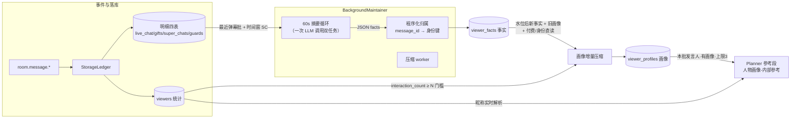

# 观众画像系统（Viewer Profile）

> 本文档是观众画像子系统的权威设计说明。
> 画像解决的问题是：主播 Agent 在直播中**认出老观众**——系统自动提取"关于某观众的事实"并压缩成画像，决策前注入提示词；没形成印象的观众不注入。
> 决策依据见 [ADR-029（身份复合键与货币口径）](../decisions/029-viewer-identity-key-and-currency-unit.md) 与 [ADR-030（画像系统与记忆层重构）](../decisions/030-viewer-profile-system.md)。

## 设计公理

1. **有画像才注入**：没形成印象的观众不占提示词——"不注入"是门槛过滤的自然结果，不是独立排除逻辑。
2. **原料分两类**：非结构化（说过什么：弹幕 + SC）→ LLM 提取事实；结构化（干了什么：付费明细三表、身份快照、互动统计）→ 直读，不经提取。
3. **归属程序化**：事实归属靠 message_id 反查批内消息得 `(platform, user_id)`，永不依赖 LLM 报人名——LLM 只负责读与写，身份判断是确定性代码。
4. **不新增循环**：提取复用后台 60 秒话题摘要循环（同一次 LLM 调用顺便完成），画像生成复用压缩 worker——画像没有自己的定时器。

## 数据流

读写服务是 `SimpleMemory`（`src/modules/memory/`）：两张表的全部读写经它，编排（何时提取/何时压缩）归 `BackgroundMaintainer`，注入归 `Planner`。

## 表职责（结构权威在 schema.py）

| 表 | 一行 = | 关键字段 |
|---|---|---|
| `viewer_facts` | 一条"关于某观众的事实" | `(platform, user_id)` 身份键 + `fact_text` + `source_message_id`（证据可溯源）+ `created_at_ms` |
| `viewer_profiles` | 一份观众画像 | `(platform, user_id)` 唯一 + `profile_text` + `last_compressed_at_ms`（增量水位） |

同观众同文本的事实去重在写入时完成；事实文本超 200 字截断。

## 事实提取链

触发：摘要门控（按热度 30~60 秒）投递 `summary` 任务 → 压缩 worker 顺序执行。

1. **输入**：`live_chat` 当前场次最近 20 条观众行 + 时间窗内 SC，经 canonical 映射渲染为 `昵称: 内容 [id:消息ID]`——与 Planner 的对话消息同源同形。
2. **LLM 契约**（summary profile，提示词 `summary_system.md`）：严格 JSON `{"summary": …, "facts": [{"message_id", "fact"}]}`；事实必须由本人原话直接支持，跳过纯情绪短句。
3. **容错链**：`json.loads` → `json_repair` → 全部失败则整体降级为纯文本摘要（旧契约），facts 为空——**话题摘要永不被事实提取拖垮**。
4. **归属与入库**：message_id 反查批内 evidence map；批内不存在的 id 丢弃（防幻觉）；身份键不完整丢弃；单批限 `facts_per_batch` 条（默认 5）；同观众同文本去重。
5. 提取成功后投递 `profiles` 任务（复用同一压缩队列，顺序保证）；提取开关关闭（`fact_extraction_enabled=false`）时整条事实链路静默。

## 画像增量生成

- **候选**：`viewer_facts` 水位后有新事实、且 `viewers.interaction_count` 达门槛（`profile_min_interactions`，默认 3）的观众——一条 SQL 同时完成水位比对与门槛过滤。无画像行视为水位 0（首次生成）。
- **原料**：旧画像 + 水位后新事实 + 结构化直读（付费汇总、三表最近明细、最近一次付费时的身份快照"舰长、粉丝团 21 级牌"——金额展示经 `to_cny`）。
- **写回**：LLM（summary profile，提示词 `profile_system.md`）产出不超过 `profile_max_length`（默认 400）字的新画像，水位推进到当下；LLM 失败则该观众画像不动、水位不推（下轮重试）。
- 单轮最多处理 3 个候选（防积压雪崩，剩余留给下一轮）。

## Planner 注入

- 候选 = 本批弹幕发言人（身份键去重，按发言时间倒序）；逐人查画像，**无画像跳过且不占位**（遍历到有画像者凑满 `profile_injection_max`（默认 3）才停）。
- 注入行渲染 `- {昵称}: {画像}`——昵称经 `ViewerRepo` 实时解析（画像段与本批弹幕的"昵称: 内容"对得上号），无统计行回退 `platform/user_id`。
- 单条画像截断 500 字、整段硬帽 1600 字（装不下的候选整条丢弃，不切半）；段标题"人物画像-内部参考"，附"不要逐字复述、与当前对话冲突以当前对话为准"。
- 查询异常逐人降级；整段为空时 Assembler 整段省略，不阻断决策。

## 配置（storage.toml `[memory]` 段）

| 键 | 默认 | 含义 |
|---|---|---|
| `backend` | `"simple"` | 记忆后端（画像/事实读写服务） |
| `fact_extraction_enabled` | `true` | 事实提取开关（关闭后画像无新原料，摘要照常） |
| `profile_min_interactions` | `3` | 首次生成画像的互动量门槛 |
| `profile_max_length` | `400` | 画像文本长度上限 |
| `profile_injection_max` | `3` | 每轮决策注入画像的观众数上限 |
| `facts_per_batch` | `5` | 每轮摘要循环最多提取的事实条数 |

## 消费面

- **LLM 工具**：`query_memory`（关键词召回事实）、`query_viewer_profile`（查画像；`nickname` 经统计表反查定位，`user_id` 直查）。
- **WebUI**：观众画像管理页（`/api/v1/memory/*`）——画像列表/人工纠正/删除，行展开查看事实原料、单条删除错误事实。

## 边界（不做什么）

- 无 embedding / 无语义检索——事实召回是 LIKE 子串语义，够用起步。
- 不做历史事实召回注入（过渡期策略）：planner 只注入"画像 + 当前话题"，历史事实经工具按需查询；接外部记忆系统后再补。
- 不跨平台聚合：身份键隔离，每个 `(platform, user_id)` 是一个独立的人。
- 画像不回写事实：人工纠正画像后，水位与事实不动——纠正版作为"旧画像"参与下次增量。
