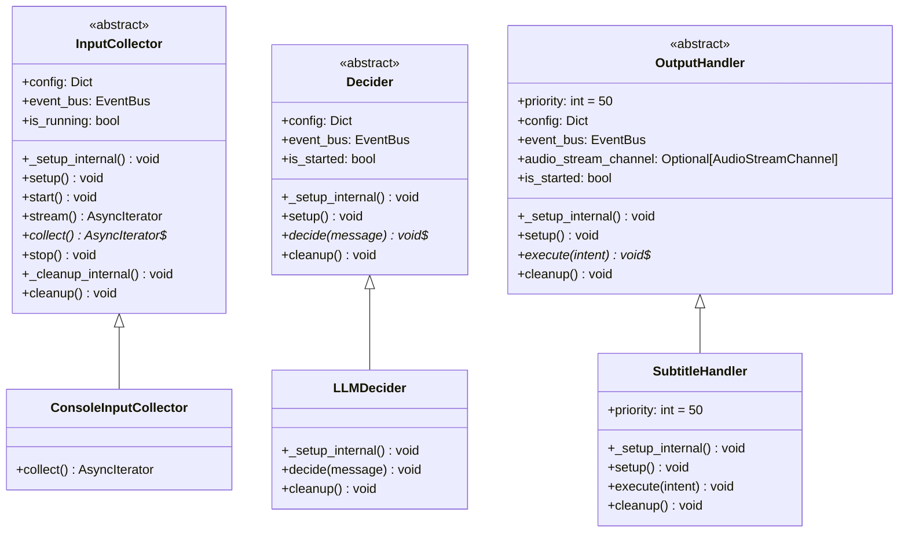
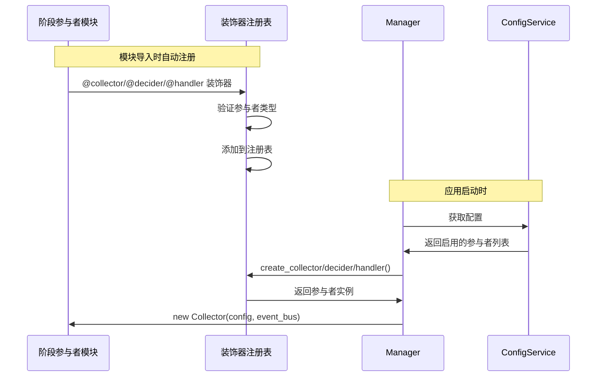

# 阶段参与者开发指南

本指南详细介绍如何在 Amaidesu 项目中开发自定义阶段参与者。阶段参与者是项目架构的核心组件，负责数据采集、决策和输出渲染。

## 1. 阶段参与者类型

Amaidesu 采用 3 阶段架构，阶段参与者分为三种类型：

| 类型 | 职责 | 位置 | 示例 |
|------|------|------|------|
| **InputCollector** | 从外部数据源采集数据 | `src/stages/input/collectors/` | ConsoleInputCollector, BiliDanmakuCollector |
| **Decider** | 处理 NormalizedMessage 生成 Intent | `src/stages/decision/deciders/` | MaiBotDecider, LLMDecider |
| **OutputHandler** | 将 Intent 渲染到目标设备 | `src/stages/output/handlers/` | SubtitleHandler, EdgeTTSHandler |

### 数据流关系

```
外部输入 → InputCollector → NormalizedMessage → Decider → Intent
                                                            ↓
                                          OutputHandler → 实际输出（TTS/字幕/动作）
```

---

## 2. 阶段参与者基类

所有阶段参与者都继承自对应的抽象基类，基类定义了统一的接口和生命周期方法。

### 2.1 InputCollector 基类

```python
from abc import ABC, abstractmethod
from typing import AsyncIterator, Dict, Any, Optional

from src.modules.events import EventBus
from src.modules.types.normalized_message import NormalizedMessage


class InputCollector(ABC):
    """输入 Collector 抽象基类"""

    def __init__(
        self,
        config: Dict[str, Any],
        event_bus: EventBus,
    ):
        self.config = config
        self.event_bus = event_bus
        self.is_running = False

    async def _setup_internal(self) -> None:
        """内部初始化（子类可重写）"""
        pass

    async def setup(self) -> None:
        """初始化资源配置（子类可重写）"""
        pass

    async def start(self) -> None:
        """启动 Collector，建立连接"""
        await self._setup_internal()
        await self.setup()
        self.is_running = True

    def stream(self) -> AsyncIterator[NormalizedMessage]:
        """
        返回 NormalizedMessage 数据流
        注意：调用此方法前必须先调用 start()
        """
        if not self.is_running:
            raise RuntimeError("Collector 未启动，请先调用 start()")

        async def _generate():
            try:
                async for message in self.collect():
                    yield message
            finally:
                self.is_running = False

        return _generate()

    @abstractmethod
    async def collect(self) -> AsyncIterator[NormalizedMessage]:
        """
        生成 NormalizedMessage 数据流（子类必须实现）

        Yields:
            NormalizedMessage: 标准化消息
        """
        pass

    async def stop(self):
        """停止 Collector"""
        self.is_running = False
        await self._cleanup_internal()

    async def _cleanup_internal(self) -> None:
        """内部清理（子类可重写）"""
        pass

    async def cleanup(self) -> None:
        """清理资源（子类可重写）"""
        pass
```

**核心要点**：
- InputCollector 使用构造器注入获取 `event_bus`
- 核心方法是 `collect()`，必须实现为异步生成器
- 直接构造 `NormalizedMessage`，无需中间数据结构

### 2.2 Decider 基类

```python
from abc import ABC, abstractmethod
from typing import Dict, Any, Optional

from src.modules.events import EventBus
from src.modules.types import Intent, NormalizedMessage


class Decider(ABC):
    """决策 Decider 抽象基类"""

    def __init__(
        self,
        config: Dict[str, Any],
        event_bus: EventBus,
    ):
        self.config = config
        self.event_bus = event_bus
        self.is_started = False

    async def _setup_internal(self) -> None:
        """内部初始化（子类可重写）"""
        pass

    async def setup(self) -> None:
        """初始化 Decider（子类可重写）"""
        pass

    @abstractmethod
    async def decide(self, message: NormalizedMessage) -> None:
        """
        决策（fire-and-forget）

        根据 NormalizedMessage 生成决策结果，并通过 EventBus 发布 decision.intent 事件。

        注意：这是 fire-and-forget 模式：
        - 不等待决策完成，不返回结果
        - Decider 内部负责通过 event_bus 发布 decision.intent 事件

        Args:
            message: 标准化消息
        """
        pass

    async def cleanup(self) -> None:
        """清理资源（子类可重写）"""
        pass
```

**核心要点**：
- Decider 使用构造器注入获取 `event_bus`
- 核心方法是 `decide()`，采用 fire-and-forget 模式
- 通过 EventBus 发布 `decision.intent` 事件传递结果

### 2.3 OutputHandler 基类

```python
from abc import ABC, abstractmethod
from typing import Dict, Any, Optional

from src.modules.events import EventBus
from src.modules.streaming import AudioStreamChannel
from src.modules.types import Intent


class OutputHandler(ABC):
    """输出 Handler 抽象基类"""

    priority: int = 50  # 事件处理优先级

    def __init__(
        self,
        config: Dict[str, Any],
        event_bus: EventBus,
        audio_stream_channel: Optional[AudioStreamChannel] = None,
    ):
        self.config = config
        self.event_bus = event_bus
        self.audio_stream_channel = audio_stream_channel
        self.is_started = False

    async def _setup_internal(self) -> None:
        """内部初始化（子类可重写）"""
        from src.modules.events.names import CoreEvents
        from src.modules.events.payloads.decision import IntentPayload

        if self.event_bus:
            self.event_bus.on(
                CoreEvents.OUTPUT_INTENT,
                self._on_intent,
                model_class=IntentPayload,
                priority=self.priority
            )

    async def setup(self) -> None:
        """初始化 Handler（子类可重写）"""
        pass

    async def _on_intent(self, event_name: str, payload: "IntentPayload", source: str):
        """接收过滤后的 Intent 事件"""
        intent = payload.to_intent()
        await self.execute(intent)

    @abstractmethod
    async def execute(self, intent: Intent):
        """
        执行意图（子类必须实现）

        处理接收到的 Intent，进行实际的渲染或输出操作。

        Args:
            intent: 意图对象
        """
        pass

    async def cleanup(self) -> None:
        """清理资源（子类可重写）"""
        from src.modules.events.names import CoreEvents

        if self.event_bus:
            self.event_bus.off(CoreEvents.OUTPUT_INTENT, self._on_intent)

        self.is_started = False
```

**核心要点**：
- OutputHandler 使用构造器注入获取 `event_bus` 和可选的 `audio_stream_channel`
- `priority` 属性控制事件处理优先级（数值越小越先执行）
- 核心方法是 `execute()`，处理 Intent 并渲染输出
- 自动订阅 `OUTPUT_INTENT` 事件，无需手动订阅

---

## 3. 构造器注入

阶段参与者通过构造器注入获取依赖服务。

```python
class MyDecider(Decider):
    def __init__(
        self,
        config: Dict[str, Any],
        event_bus: EventBus,
        llm_service: Optional[LLMManager] = None,
        prompt_service: Optional[PromptManager] = None,
    ):
        super().__init__(config, event_bus)
        self.llm_service = llm_service
        self.prompt_service = prompt_service

    async def decide(self, message: NormalizedMessage) -> None:
        # 使用注入的服务
        response = await self.llm_service.chat(prompt="...")
```

### 使用依赖服务

```python
class MyHandler(OutputHandler):
    def __init__(
        self,
        config: Dict[str, Any],
        event_bus: EventBus,
        audio_stream_channel: Optional[AudioStreamChannel] = None,
        llm_service: Optional[LLMManager] = None,
        prompt_service: Optional[PromptManager] = None,
    ):
        super().__init__(config, event_bus, audio_stream_channel)
        self.llm_service = llm_service
        self.prompt_service = prompt_service

    async def execute(self, intent: Intent) -> None:
        # 使用注入的服务
        rendered = await self._render_with_template(intent)
```

---

## 4. 注册阶段参与者

使用装饰器注册阶段参与者：

```python
from src.modules.decorators import collector, decider, handler

@collector("my_collector")
class MyInputCollector(InputCollector):
    async def collect(self) -> AsyncIterator[NormalizedMessage]:
        # ...
        pass
```

### 三种注册装饰器

```python
# 注册 InputCollector
@collector("name")
class MyInputCollector(InputCollector):
    pass

# 注册 OutputHandler
@handler("name")
class MyOutputHandler(OutputHandler):
    pass

# 注册 Decider
@decider("name")
class MyDecider(Decider):
    pass
```

---

## 5. 配置启用

在 `config.toml` 中启用阶段参与者：

```toml
# 输入 Collector
[collectors]
enabled = ["console_input", "my_collector"]

# 决策 Decider
[deciders]
active = "my_decider"

# 输出 Handler
[handlers]
enabled = ["subtitle", "my_handler"]
```

### 配置 Schema（推荐）

推荐在阶段参与者中定义 Pydantic ConfigSchema，实现类型安全的配置：

```python
from pydantic import Field
from src.modules.config.schemas.base import BaseConfig


class MyHandler(OutputHandler):
    class ConfigSchema(BaseConfig):
        """Handler 配置 Schema"""
        type: str = "my_handler"

        # 自定义配置项
        api_key: str = Field(default="", description="API 密钥")
        timeout: int = Field(default=30, ge=1, le=300, description="超时时间（秒）")

    def __init__(
        self,
        config: Dict[str, Any],
        event_bus: EventBus,
    ):
        super().__init__(config, event_bus)

        # 使用 ConfigSchema 验证配置
        self.typed_config = self.ConfigSchema(**config)

        # 读取配置
        self.api_key = self.typed_config.api_key
        self.timeout = self.typed_config.timeout
```

---

## 6. 生命周期方法

| 方法 | 调用时机 | InputCollector | Decider | OutputHandler |
|------|---------|---------------|---------|---------------|
| `__init__` | 实例化时 | 必填 | 必填 | 必填 |
| `_setup_internal()` | setup 时 | 可选 | 可选 | 可选 |
| `setup()` | Manager 启动时 | 可选 | 可选 | 可选 |
| `collect()` | 数据流迭代时 | **必须实现** | - | - |
| `decide()` | 收到消息时 | - | **必须实现** | - |
| `execute()` | 收到 Intent 时 | - | - | **必须实现** |
| `stop()` | Manager 停止时 | 可选 | - | - |
| `cleanup()` | 资源清理时 | 可选 | 可选 | 可选 |

### 生命周期流程

**InputCollector**:
```
1. 实例化 (__init__)
2. 启动 (start())
3. 获取数据流 (stream() -> collect())
4. 停止 (stop() -> _cleanup_internal() -> cleanup())
```

**Decider**:
```
1. 实例化 (__init__)
2. 初始化 (_setup_internal() -> setup())
3. 事件触发 (decide)
4. 清理 (cleanup)
```

**OutputHandler**:
```
1. 实例化 (__init__)
2. 初始化 (_setup_internal() -> setup())
3. 事件触发 (execute)
4. 清理 (cleanup)
```

---

## 7. 现有阶段参与者列表

### InputCollector（8个）

| 名称 | 说明 | 位置 |
|------|------|------|
| `console_input` | 控制台输入 | `src/stages/input/collectors/console_input/` |
| `bili_danmaku` | B站弹幕（旧版） | `src/stages/input/collectors/bili_danmaku/` |
| `bili_danmaku_official` | B站弹幕（官方API） | `src/stages/input/collectors/bili_danmaku_official/` |
| `bili_danmaku_official_maicraft` | B站弹幕（Maicraft版） | `src/stages/input/collectors/bili_danmaku_official_maicraft/` |
| `mainosaba` | MainOSABA 捕获 | `src/stages/input/collectors/mainosaba/` |
| `mock_danmaku` | 模拟弹幕（测试用） | `src/stages/input/collectors/mock_danmaku/` |
| `read_pingmu` | 读弹幕功能 | `src/stages/input/collectors/read_pingmu/` |
| `stt` | 语音转文字 | `src/stages/input/collectors/stt/` |

### Decider（4个）

| 名称 | 说明 | 位置 |
|------|------|------|
| `maibot` | MaiBot 决策 | `src/stages/decision/deciders/maibot/` |
| `llm` | LLM 决策 | `src/stages/decision/deciders/llm/` |
| `maicraft` | Maicraft 决策 | `src/stages/decision/deciders/maicraft/` |
| `replay` | 回放决策（调试用） | `src/stages/decision/deciders/replay/` |

### OutputHandler（12个）

| 名称 | 说明 | 位置 |
|------|------|------|
| `edge_tts` | Edge TTS 语音合成 | `src/stages/output/handlers/audio/edge_tts/` |
| `gptsovits` | GPT-SoVITS 语音合成 | `src/stages/output/handlers/audio/gptsovits/` |
| `omni_tts` | Omni TTS | `src/stages/output/handlers/audio/omni_tts/` |
| `subtitle` | 字幕显示 | `src/stages/output/handlers/subtitle/` |
| `vts` | Virtual Tube Studio | `src/stages/output/handlers/avatar/vts/` |
| `warudo` | Warudo | `src/stages/output/handlers/avatar/warudo/` |
| `vrchat` | VRChat | `src/stages/output/handlers/avatar/vrchat/` |
| `sticker` | 表情包 | `src/stages/output/handlers/sticker/` |
| `obs_control` | OBS 控制 | `src/stages/output/handlers/obs_control/` |
| `remote_stream` | 远程流 | `src/stages/output/handlers/remote_stream/` |
| `debug_console` | 调试控制台 | `src/stages/output/handlers/debug_console/` |
| `mock` | 模拟输出（测试用） | `src/stages/output/handlers/mock/` |

---

## 8. 类图

### 阶段参与者继承关系



### 阶段参与者注册流程



---

## 9. 开发示例

### 9.1 开发 InputCollector

```python
"""my_input_collector/__init__.py"""
from src.modules.decorators import collector
from .my_input_collector import MyInputCollector

# 导出以供 Manager 发现
__all__ = ["MyInputCollector"]
```

```python
"""my_input_collector/my_input_collector.py"""
from typing import AsyncIterator, Dict, Any
import asyncio

from src.modules.decorators import collector
from src.modules.events import EventBus
from src.modules.logging import get_logger
from src.modules.types import NormalizedMessage


@collector("my_collector")
class MyInputCollector(InputCollector):
    """我的自定义输入 Collector"""

    def __init__(
        self,
        config: Dict[str, Any],
        event_bus: EventBus,
    ):
        super().__init__(config, event_bus)
        self.logger = get_logger("MyInputCollector")

        # 从配置读取参数
        self.source_name = config.get("source_name", "my_source")

    async def collect(self) -> AsyncIterator[NormalizedMessage]:
        """生成 NormalizedMessage 数据流"""
        self.is_running = True

        while self.is_running:
            # 从数据源获取数据
            raw_data = await self._fetch_data()

            if raw_data:
                # 直接构造 NormalizedMessage
                yield NormalizedMessage(
                    text=raw_data["text"],
                    source=self.source_name,
                    data_type=raw_data.get("type", "text"),
                    importance=raw_data.get("importance", 0.5),
                    timestamp=raw_data.get("timestamp", 0),
                    raw=raw_data,
                )

            await asyncio.sleep(0.1)

    async def _fetch_data(self) -> dict:
        """从数据源获取数据（示例）"""
        # 实现具体的数据获取逻辑
        pass

    async def cleanup(self) -> None:
        self.logger.info("MyInputCollector 已清理")
```

### 9.2 开发 OutputHandler

```python
"""my_output_handler/__init__.py"""
from src.modules.decorators import handler
from .my_output_handler import MyOutputHandler

# 导出以供 Manager 发现
__all__ = ["MyOutputHandler"]
```

```python
"""my_output_handler/my_output_handler.py"""
from typing import Dict, Any, Optional

from src.modules.decorators import handler
from src.modules.events import EventBus
from src.modules.logging import get_logger
from src.modules.types import Intent
from src.modules.streaming import AudioStreamChannel


@handler("my_handler")
class MyOutputHandler(OutputHandler):
    """我的自定义输出 Handler"""

    def __init__(
        self,
        config: Dict[str, Any],
        event_bus: EventBus,
        audio_stream_channel: Optional[AudioStreamChannel] = None,
    ):
        super().__init__(config, event_bus, audio_stream_channel)
        self.logger = get_logger("MyOutputHandler")

        # 从配置读取参数
        self.api_endpoint = config.get("api_endpoint", "http://localhost:8080")

    async def setup(self) -> None:
        """初始化 Handler"""
        self.logger.info(f"初始化 MyOutputHandler: {self.api_endpoint}")

    async def execute(self, intent: Intent) -> None:
        """执行意图"""
        self.logger.debug(f"收到意图: {intent.response_text}")

        # 处理 Intent
        response_text = intent.response_text
        emotion = intent.emotion
        actions = intent.actions

        # 执行输出逻辑
        await self._render(response_text, emotion, actions)

    async def _render(self, text: str, emotion, actions) -> None:
        """渲染输出（示例）"""
        # 实现具体的渲染逻辑
        pass
```

---

## 10. 最佳实践

### 10.1 配置验证

始终使用 Pydantic ConfigSchema 进行配置验证：

```python
class MyHandler(OutputHandler):
    class ConfigSchema(BaseConfig):
        type: str = "my_handler"
        # 使用 Field 定义验证规则
        timeout: int = Field(default=30, ge=1, le=300)
        api_key: str = Field(min_length=8)
```

### 10.2 日志记录

使用统一的日志记录器：

```python
from src.modules.logging import get_logger

class MyHandler(OutputHandler):
    def __init__(
        self,
        config: Dict[str, Any],
        event_bus: EventBus,
    ):
        super().__init__(config, event_bus)
        self.logger = get_logger(self.__class__.__name__)
```

### 10.3 错误处理

实现健壮的错误处理和降级机制：

```python
async def execute(self, intent: Intent) -> None:
    try:
        await self._render(intent)
    except Exception as e:
        self.logger.error(f"渲染失败: {e}", exc_info=True)
        # 实现降级逻辑
        await self._fallback_render(intent)
```

### 10.4 资源清理

确保在 `cleanup()` 方法中释放所有资源：

```python
async def cleanup(self) -> None:
    # 关闭连接
    if self._connection:
        await self._connection.close()

    # 取消任务
    if self._task:
        self._task.cancel()

    self.logger.info("MyHandler 已清理")
```

---

## 相关文档

- [3 阶段架构](../architecture/overview.md)
- [数据流规则](../architecture/data-flow.md)
- [事件系统](../architecture/event-system.md)
- [管道开发](../development/pipeline-guide.md)
- [提示词管理](../development/prompt-management.md)

---

*最后更新：2026-06-14*
