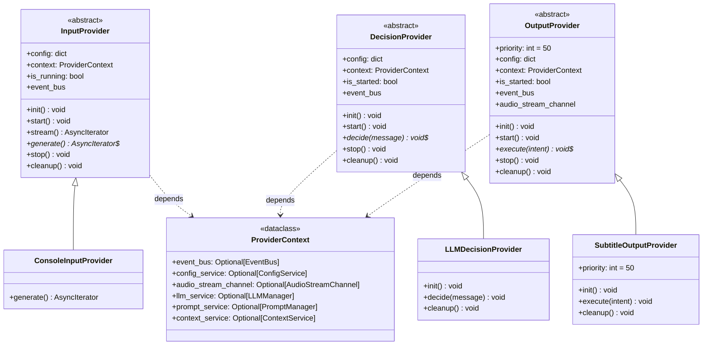
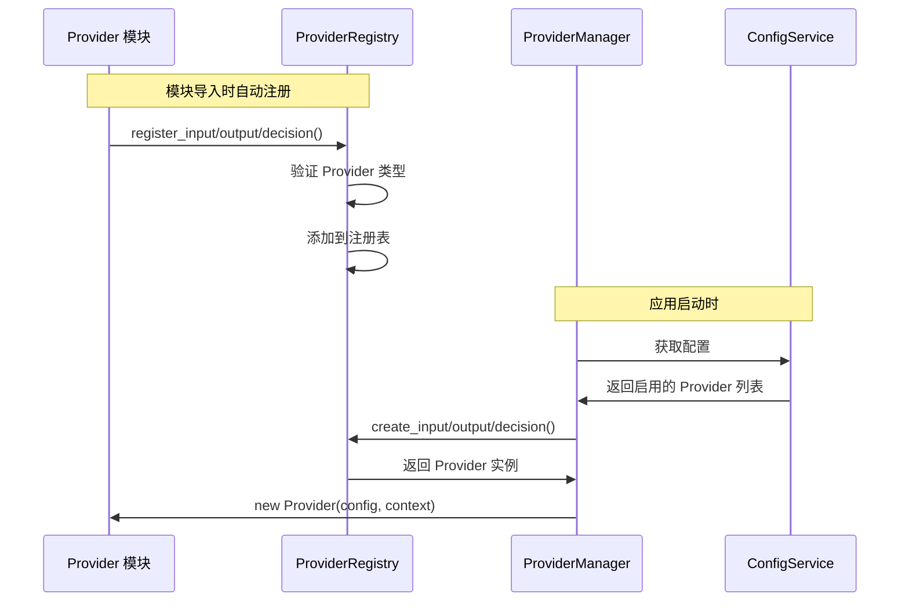

# Provider 开发指南

本指南详细介绍如何在 Amaidesu 项目中开发自定义 Provider。Provider 是项目架构的核心组件，负责数据采集、决策和输出渲染。

## 1. Provider 类型

Amaidesu 采用 3 域架构，Provider 分为三种类型：

| 类型 | 职责 | 位置 | 示例 |
|------|------|------|------|
| **InputProvider** | 从外部数据源采集数据 | `src/domains/input/providers/` | ConsoleInputProvider, BiliDanmakuInputProvider |
| **DecisionProvider** | 处理 NormalizedMessage 生成 Intent | `src/domains/decision/providers/` | MaiCoreDecisionProvider, LLMDecisionProvider |
| **OutputProvider** | 将 Intent 渲染到目标设备 | `src/domains/output/providers/` | SubtitleOutputProvider, TTSOutputProvider |

### 数据流关系

```
外部输入 → InputProvider → NormalizedMessage → DecisionProvider → Intent
                                                            ↓
                                          OutputProvider → 实际输出（TTS/字幕/动作）
```

---

## 2. Provider 基类

所有 Provider 都继承自对应的抽象基类，基类定义了统一的接口和生命周期方法。

### 2.1 InputProvider 基类

```python
from abc import ABC, abstractmethod
from typing import AsyncIterator

from src.modules.di.context import ProviderContext
from src.modules.types.base.normalized_message import NormalizedMessage


class InputProvider(ABC):
    """输入 Provider 抽象基类"""

    def __init__(self, config: dict, context: ProviderContext = None):
        self.config = config
        self.context = context or ProviderContext()
        self.is_running = False

    @property
    def event_bus(self):
        """获取事件总线"""
        return self.context.event_bus

    async def init(self) -> None:
        """初始化资源配置（子类可重写）"""
        pass

    async def start(self) -> None:
        """启动 Provider，建立连接"""
        await self.init()
        self.is_running = True

    def stream(self) -> AsyncIterator[NormalizedMessage]:
        """
        返回 NormalizedMessage 数据流
        注意：调用此方法前必须先调用 start()
        """
        if not self.is_running:
            raise RuntimeError("Provider 未启动，请先调用 start()")

        async def _generate():
            try:
                async for message in self.generate():
                    yield message
            finally:
                self.is_running = False

        return _generate()

    @abstractmethod
    async def generate(self) -> AsyncIterator[NormalizedMessage]:
        """
        生成 NormalizedMessage 数据流（子类必须实现）

        Yields:
            NormalizedMessage: 标准化消息
        """
        pass

    async def stop(self):
        """停止 Provider"""
        self.is_running = False
        await self.cleanup()

    async def cleanup(self) -> None:
        """清理资源（子类可重写）"""
        pass
```

**核心要点**：
- InputProvider 使用 `start()` / `stop()` 方法管理生命周期
- 核心方法是 `generate()`，必须实现为异步生成器
- 直接构造 `NormalizedMessage`，无需中间数据结构

### 2.2 DecisionProvider 基类

```python
from abc import ABC, abstractmethod

from src.modules.di.context import ProviderContext


class DecisionProvider(ABC):
    """决策 Provider 抽象基类"""

    def __init__(self, config: dict, context: ProviderContext):
        """
        Args:
            config: Provider 配置
            context: 依赖注入上下文（必填）
        """
        if context is None:
            raise ValueError("DecisionProvider 必须接收 context 参数")

        self.config = config
        self.context = context
        self.is_started = False

    @property
    def event_bus(self):
        """EventBus 实例"""
        return self.context.event_bus

    async def init(self) -> None:
        """初始化 Provider（子类可重写）"""
        pass

    async def start(self, event_bus=None, config=None, dependencies=None) -> None:
        """启动 Provider"""
        await self.init()
        self.is_started = True

    @abstractmethod
    async def decide(self, message: "NormalizedMessage") -> None:
        """
        决策（fire-and-forget）

        根据 NormalizedMessage 生成决策结果，并通过 EventBus 发布 decision.intent 事件。

        注意：这是 fire-and-forget 模式：
        - 不等待决策完成，不返回结果
        - Provider 内部负责通过 event_bus 发布 decision.intent 事件

        Args:
            message: 标准化消息
        """
        pass

    async def stop(self) -> None:
        """停止 Provider"""
        await self.cleanup()
        self.is_started = False

    async def cleanup(self) -> None:
        """清理资源（子类可重写）"""
        pass
```

**核心要点**：
- DecisionProvider **必须**接收 `context` 参数（必填）
- 核心方法是 `decide()`，采用 fire-and-forget 模式
- 通过 EventBus 发布 `decision.intent` 事件传递结果

### 2.3 OutputProvider 基类

```python
from abc import ABC, abstractmethod

from src.modules.di.context import ProviderContext


class OutputProvider(ABC):
    """输出 Provider 抽象基类"""

    priority: int = 50  # 事件处理优先级

    def __init__(self, config: dict, context: ProviderContext):
        """
        Args:
            config: Provider 配置
            context: 依赖注入上下文（必填）
        """
        if context is None:
            raise ValueError("OutputProvider 必须接收 context 参数")

        self.config = config
        self.context = context
        self.is_started = False

    @property
    def event_bus(self):
        return self.context.event_bus

    @property
    def audio_stream_channel(self):
        return self.context.audio_stream_channel

    async def init(self):
        """初始化 Provider（子类可重写）"""
        pass

    async def start(self, event_bus=None, audio_stream_channel=None):
        """
        启动 Provider，订阅 OUTPUT_INTENT 事件

        依赖已在构造时通过 context 注入。
        """
        from src.modules.events.names import CoreEvents
        from src.modules.events.payloads.decision import IntentPayload

        if self.event_bus:
            self.event_bus.on(
                CoreEvents.OUTPUT_INTENT,
                self._on_intent,
                model_class=IntentPayload,
                priority=self.priority
            )

        await self.init()
        self.is_started = True

    async def _on_intent(self, event_name: str, payload: "IntentPayload", source: str):
        """接收过滤后的 Intent 事件"""
        intent = payload.to_intent()
        await self.execute(intent)

    @abstractmethod
    async def execute(self, intent: "Intent"):
        """
        执行意图（子类必须实现）

        处理接收到的 Intent，进行实际的渲染或输出操作。

        Args:
            intent: 意图对象
        """
        pass

    async def stop(self):
        """停止 Provider"""
        from src.modules.events.names import CoreEvents

        if self.event_bus:
            self.event_bus.off(CoreEvents.OUTPUT_INTENT, self._on_intent)

        await self.cleanup()
        self.is_started = False

    async def cleanup(self) -> None:
        """清理资源（子类可重写）"""
        pass
```

**核心要点**：
- OutputProvider **必须**接收 `context` 参数（必填）
- `priority` 属性控制事件处理优先级（数值越小越先执行）
- 核心方法是 `execute()`，处理 Intent 并渲染输出
- 自动订阅 `OUTPUT_INTENT` 事件，无需手动订阅

---

## 3. ProviderContext 依赖注入

`ProviderContext` 是所有 Provider 的统一依赖容器，采用依赖注入模式提供服务。

```python
from dataclasses import dataclass
from typing import Optional


@dataclass(frozen=True)
class ProviderContext:
    """所有 Provider 的统一依赖上下文（不可变）"""

    # 核心服务
    event_bus: Optional["EventBus"] = None
    config_service: Optional["ConfigService"] = None

    # 音频服务
    audio_stream_channel: Optional["AudioStreamChannel"] = None
    audio_device_service: Optional["AudioDeviceManager"] = None

    # LLM 服务
    llm_service: Optional["LLMManager"] = None
    token_usage_service: Optional["TokenUsageManager"] = None

    # 提示词服务
    prompt_service: Optional["PromptManager"] = None

    # 上下文服务
    context_service: Optional["ContextService"] = None
```

### 使用依赖服务

在 Provider 中通过 `self.context` 访问服务：

```python
class MyProvider(DecisionProvider):
    async def init(self) -> None:
        # 获取依赖服务
        self._llm_service = self.context.llm_service
        self._prompt_service = self.context.prompt_service
        self._context_service = self.context.context_service

    async def decide(self, message: NormalizedMessage) -> None:
        # 使用依赖服务
        response = await self._llm_service.chat(prompt="...")
```

---

## 4. 注册 Provider

在 Provider 的 `__init__.py` 中注册到 ProviderRegistry：

```python
from src.modules.registry import ProviderRegistry

from .my_input_provider import MyInputProvider

# 注册 InputProvider
ProviderRegistry.register_input(
    "my_provider",           # Provider 名称（唯一标识符）
    MyInputProvider,         # Provider 类
    source="builtin:my_provider"  # 注册来源
)
```

### 三种注册方法

```python
# 注册 InputProvider
ProviderRegistry.register_input("name", MyInputProvider, source="builtin:xxx")

# 注册 OutputProvider
ProviderRegistry.register_output("name", MyOutputProvider, source="builtin:xxx")

# 注册 DecisionProvider
ProviderRegistry.register_decision("name", MyDecisionProvider, source="builtin:xxx")
```

### 显式注册模式（可选）

也可以在 Provider 类中实现 `get_registration_info()` 方法：

```python
class MyProvider(InputProvider):
    @classmethod
    def get_registration_info(cls) -> Dict[str, Any]:
        return {
            "layer": "input",  # "input", "decision", 或 "output"
            "name": "my_provider",
            "class": cls,
            "source": "builtin:my_provider"
        }
```

---

## 5. 配置启用

在 `config.toml` 中启用 Provider：

```toml
# 输入 Provider
[providers.input]
enabled_inputs = ["console_input", "my_provider"]

# 决策 Provider
[providers.decision]
active_provider = "my_provider"

# 输出 Provider
[providers.output]
enabled_outputs = ["subtitle", "my_provider"]
```

### 配置 Schema（推荐）

推荐在 Provider 中定义 Pydantic ConfigSchema，实现类型安全的配置：

```python
from pydantic import Field
from src.modules.config.schemas.base import BaseProviderConfig


class MyProvider(OutputProvider):
    class ConfigSchema(BaseProviderConfig):
        """Provider 配置 Schema"""
        type: str = "my_provider"

        # 自定义配置项
        api_key: str = Field(default="", description="API 密钥")
        timeout: int = Field(default=30, ge=1, le=300, description="超时时间（秒）")

    def __init__(self, config: dict, context: ProviderContext):
        super().__init__(config, context)

        # 使用 ConfigSchema 验证配置
        self.typed_config = self.ConfigSchema(**config)

        # 读取配置
        self.api_key = self.typed_config.api_key
        self.timeout = self.typed_config.timeout
```

---

## 6. 生命周期方法

| 方法 | 调用时机 | InputProvider | DecisionProvider | OutputProvider |
|------|---------|---------------|-------------------|----------------|
| `__init__` | 实例化时 | 可选 | **必填 context** | **必填 context** |
| `init()` | start/setup 时 | 可选 | 可选 | 可选 |
| `start()` | Manager 启动时 | 必须调用 | 可选 | 可选 |
| `generate()` | 数据流迭代时 | **必须实现** | - | - |
| `decide()` | 收到消息时 | - | **必须实现** | - |
| `execute()` | 收到 Intent 时 | - | - | **必须实现** |
| `stop()` | Manager 停止时 | 可选 | 可选 | 可选 |
| `cleanup()` | 资源清理时 | 可选 | 可选 | 可选 |

### 生命周期流程

**InputProvider**:
```
1. 实例化 (__init__)
2. 启动 (start())
3. 获取数据流 (stream() -> generate())
4. 停止 (stop() -> cleanup())
```

**DecisionProvider / OutputProvider**:
```
1. 实例化 (__init__)
2. 启动 (setup/start -> init)
3. 事件触发 (decide/execute)
4. 停止 (stop -> cleanup)
```

---

## 7. 现有 Provider 列表

### InputProvider（8个）

| 名称 | 说明 | 位置 |
|------|------|------|
| `console_input` | 控制台输入 | `src/domains/input/providers/console_input/` |
| `bili_danmaku` | B站弹幕（旧版） | `src/domains/input/providers/bili_danmaku/` |
| `bili_danmaku_official` | B站弹幕（官方API） | `src/domains/input/providers/bili_danmaku_official/` |
| `bili_danmaku_official_maicraft` | B站弹幕（Maicraft版） | `src/domains/input/providers/bili_danmaku_official_maicraft/` |
| `mainosaba` | MainOSABA 捕获 | `src/domains/input/providers/mainosaba/` |
| `mock_danmaku` | 模拟弹幕（测试用） | `src/domains/input/providers/mock_danmaku/` |
| `read_pingmu` | 读弹幕功能 | `src/domains/input/providers/read_pingmu/` |
| `stt` | 语音转文字 | `src/domains/input/providers/stt/` |

### DecisionProvider（4个）

| 名称 | 说明 | 位置 |
|------|------|------|
| `maicore` | MaiCore 决策 | `src/domains/decision/providers/maicore/` |
| `llm` | LLM 决策 | `src/domains/decision/providers/llm/` |
| `maicraft` | Maicraft 决策 | `src/domains/decision/providers/maicraft/` |
| `replay` | 回放决策（调试用） | `src/domains/decision/providers/replay/` |

### OutputProvider（12个）

| 名称 | 说明 | 位置 |
|------|------|------|
| `edge_tts` | Edge TTS 语音合成 | `src/domains/output/providers/edge_tts/` |
| `gptsovits` | GPT-SoVITS 语音合成 | `src/domains/output/providers/gptsovits/` |
| `omni_tts` | Omni TTS | `src/domains/output/providers/omni_tts/` |
| `subtitle` | 字幕显示 | `src/domains/output/providers/subtitle/` |
| `vts` | Virtual Tube Studio | `src/domains/output/providers/avatar/vts/` |
| `warudo` | Warudo | `src/domains/output/providers/avatar/warudo/` |
| `vrchat` | VRChat | `src/domains/output/providers/avatar/vrchat/` |
| `sticker` | 表情包 | `src/domains/output/providers/sticker/` |
| `obs_control` | OBS 控制 | `src/domains/output/providers/obs_control/` |
| `remote_stream` | 远程流 | `src/domains/output/providers/remote_stream/` |
| `debug_console` | 调试控制台 | `src/domains/output/providers/debug_console/` |
| `mock` | 模拟输出（测试用） | `src/domains/output/providers/mock/` |

---

## 8. 类图

### Provider 继承关系



### Provider 注册流程



---

## 9. 开发示例

### 9.1 开发 InputProvider

```python
"""my_input_provider/__init__.py"""
from src.modules.registry import ProviderRegistry
from .my_input_provider import MyInputProvider

ProviderRegistry.register_input("my_input", MyInputProvider, source="builtin:my_input")
```

```python
"""my_input_provider/my_input_provider.py"""
from typing import AsyncIterator
import time

from src.modules.di.context import ProviderContext
from src.modules.logging import get_logger
from src.modules.types.base.input_provider import InputProvider
from src.modules.types.base.normalized_message import NormalizedMessage


class MyInputProvider(InputProvider):
    """我的自定义输入 Provider"""

    def __init__(self, config: dict, context: ProviderContext):
        super().__init__(config, context)
        self.logger = get_logger("MyInputProvider")

        # 从配置读取参数
        self.source_name = config.get("source_name", "my_source")

    async def generate(self) -> AsyncIterator[NormalizedMessage]:
        """生成 NormalizedMessage 数据流"""
        self.is_running = True

        while self.is_running:
            # 从数据源获取数据
            raw_data = await self._fetch_data()

            if raw_data:
                # 直接构造 NormalizedMessage
                yield NormalizedMessage(
                    text=raw_data["text"],
                    source=self.source_name,
                    data_type=raw_data.get("type", "text"),
                    importance=raw_data.get("importance", 0.5),
                    timestamp=time.time(),
                    raw=raw_data,
                )

            await asyncio.sleep(0.1)

    async def _fetch_data(self) -> dict:
        """从数据源获取数据（示例）"""
        # 实现具体的数据获取逻辑
        pass

    async def cleanup(self) -> None:
        self.logger.info("MyInputProvider 已清理")
```

### 9.2 开发 OutputProvider

```python
"""my_output_provider/__init__.py"""
from src.modules.registry import ProviderRegistry
from .my_output_provider import MyOutputProvider

ProviderRegistry.register_output("my_output", MyOutputProvider, source="builtin:my_output")
```

```python
"""my_output_provider/my_output_provider.py"""
from pydantic import Field
from src.modules.config.schemas.base import BaseProviderConfig
from src.modules.di.context import ProviderContext
from src.modules.logging import get_logger
from src.modules.types import Intent
from src.modules.types.base.output_provider import OutputProvider


class MyOutputProvider(OutputProvider):
    """我的自定义输出 Provider"""

    class ConfigSchema(BaseProviderConfig):
        type: str = "my_output"
        api_endpoint: str = Field(default="http://localhost:8080", description="API 端点")

    def __init__(self, config: dict, context: ProviderContext):
        super().__init__(config, context)
        self.logger = get_logger("MyOutputProvider")

        # 使用 ConfigSchema 验证配置
        self.typed_config = self.ConfigSchema(**config)
        self.api_endpoint = self.typed_config.api_endpoint

    async def init(self) -> None:
        """初始化 Provider"""
        self.logger.info(f"初始化 MyOutputProvider: {self.api_endpoint}")

    async def execute(self, intent: Intent) -> None:
        """执行意图"""
        self.logger.debug(f"收到意图: {intent.response_text}")

        # 处理 Intent
        response_text = intent.response_text
        emotion = intent.emotion
        actions = intent.actions

        # 执行输出逻辑
        await self._render(response_text, emotion, actions)

    async def _render(self, text: str, emotion, actions) -> None:
        """渲染输出（示例）"""
        # 实现具体的渲染逻辑
        pass
```

---

## 10. 最佳实践

### 10.1 配置验证

始终使用 Pydantic ConfigSchema 进行配置验证：

```python
class MyProvider(OutputProvider):
    class ConfigSchema(BaseProviderConfig):
        type: str = "my_provider"
        # 使用 Field 定义验证规则
        timeout: int = Field(default=30, ge=1, le=300)
        api_key: str = Field(min_length=8)
```

### 10.2 日志记录

使用统一的日志记录器：

```python
from src.modules.logging import get_logger

class MyProvider(OutputProvider):
    def __init__(self, config: dict, context: ProviderContext):
        super().__init__(config, context)
        self.logger = get_logger(self.__class__.__name__)
```

### 10.3 错误处理

实现健壮的错误处理和降级机制：

```python
async def execute(self, intent: Intent) -> None:
    try:
        await self._render(intent)
    except Exception as e:
        self.logger.error(f"渲染失败: {e}", exc_info=True)
        # 实现降级逻辑
        await self._fallback_render(intent)
```

### 10.4 资源清理

确保在 `cleanup()` 方法中释放所有资源：

```python
async def cleanup(self) -> None:
    # 关闭连接
    if self._connection:
        await self._connection.close()

    # 取消任务
    if self._task:
        self._task.cancel()

    self.logger.info("MyProvider 已清理")
```

---

## 相关文档

- [3 域架构](docs/architecture/overview.md)
- [数据流规则](docs/architecture/data-flow.md)
- [事件系统](docs/architecture/event-system.md)
- [管道开发](docs/development/pipeline-guide.md)
- [提示词管理](docs/development/prompt-management.md)

---

*最后更新：2026-02-15*
