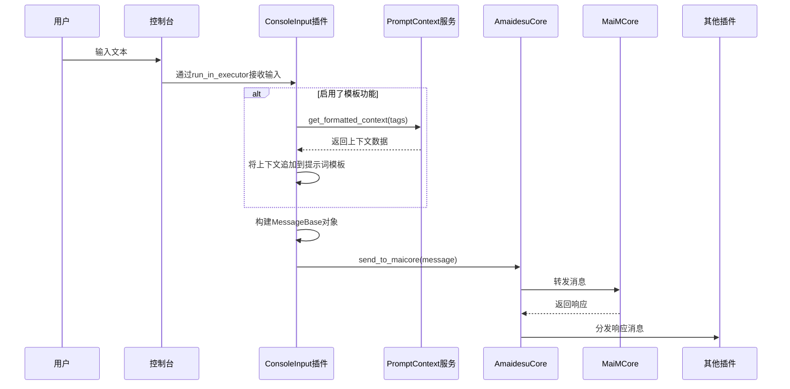

# Console Input 插件

这是一个允许通过控制台输入来模拟用户消息的插件。它可以将控制台输入转换为标准的消息格式，并通过核心系统发送给其他插件处理。

## 功能概述

- 通过控制台接收用户输入
- 将输入转换为标准消息格式
- 支持配置用户信息、群组信息、模板信息等
- 支持动态加载和修改提示词模板
- 支持与Prompt Context服务集成

## 实现流程

1. 插件初始化
   - 加载配置文件（config.toml）
   - 验证依赖（tomllib/toml库）
   - 设置消息配置默认值
   - 检查Prompt Context标签配置

2. 启动流程
   - 在setup()方法中创建异步输入循环任务
   - 监听控制台输入（_input_loop方法）
   - 处理特殊命令（如exit()）

3. 消息处理流程
   - 接收控制台输入（sys.stdin.readline）
   - 通过_create_console_message方法创建标准消息对象
   - 如果启用了模板功能，从Prompt Context服务获取上下文
   - 将上下文追加到主提示词模板（reasoning_prompt_main）
   - 通过core.send_to_maicore()发送消息到核心系统

## 依赖的Core服务

- **Prompt Context服务**：用于获取格式化上下文，通过`prompt_ctx_service.get_formatted_context(tags=self.context_tags)`方法调用
  
## 核心代码解析

### 消息创建流程

```python
async def _create_console_message(self, text: str) -> MessageBase:
    # 创建时间戳
    timestamp = time.time()
    
    # 构建用户信息
    user_info = UserInfo(
        platform=self.core.platform,
        user_id=cfg.get("user_id", 0),
        user_nickname=cfg.get("user_nickname", "ConsoleUser"),
        user_cardname=cfg.get("user_cardname", ""),
    )
    
    # 可选：构建群组信息
    group_info: Optional[GroupInfo] = None
    if cfg.get("enable_group_info", False):
        group_info = GroupInfo(...)
    
    # 从Prompt Context服务获取上下文（如果启用）
    if cfg.get("enable_template_info", False) and self.template_items:
        prompt_ctx_service = self.core.get_service("prompt_context")
        additional_context = await prompt_ctx_service.get_formatted_context(tags=self.context_tags)
        # 将上下文追加到主提示词
        modified_template_items[main_prompt_key] = original_prompt + "\n" + additional_context
    
    # 构建最终消息对象并返回
    return MessageBase(message_info=message_info, message_segment=message_segment, raw_message=text)
```

### 输入循环实现

```python
async def _input_loop(self):
    loop = asyncio.get_event_loop()
    while not self._stop_event.is_set():
        try:
            # 非阻塞方式读取控制台输入
            line = await loop.run_in_executor(None, sys.stdin.readline)
            text = line.strip()
            
            # 处理特殊命令
            if text.lower() == "exit()":
                self._stop_event.set()
                break
            
            # 创建并发送消息
            message = await self._create_console_message(text)
            await self.core.send_to_maicore(message)
        except Exception as e:
            self.logger.error(f"控制台输入循环出错: {e}", exc_info=True)
            await asyncio.sleep(1)  # 避免错误时的忙循环
```

## 时序图



## 使用说明

- 插件会自动启动控制台输入监听
- 输入文本后按回车发送
- 输入`exit()`退出插件