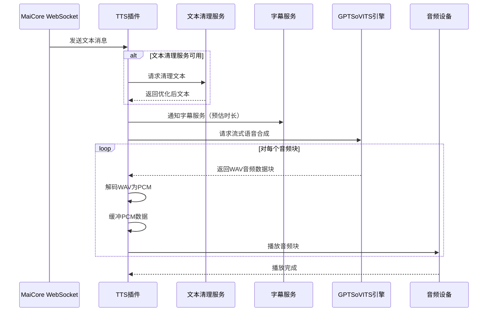

# Amaidesu GPTSoVITS TTS 插件

TTS（语音合成）插件是 Amaidesu VTuber 项目的核心组件，负责将文本消息转换为语音并播放给用户。插件使用 GPTSoVITS 引擎实现高质量语音合成，并支持与其他插件如文本清理服务和字幕服务的集成。

## 功能特点

- 接收并处理 WebSocket 文本消息
- 使用 GPTSoVITS 进行语音合成（流式传输）
- 支持选择不同语音角色和输出音频设备
- 支持预设角色配置（包括参考音频和提示文本）
- 集成文本清理服务（可选）
- 发送播放信息到字幕服务（可选）
- 智能错误处理和资源管理

## 依赖

### 必需依赖

- `GPTSoVITS`：AI语音克隆引擎
- `sounddevice`: 音频播放
- `numpy`: 用于音频数据处理

### 可选服务依赖

- `text_cleanup`: 用于优化 TTS 的文本（由 LLM Text Processor 插件提供）
- `subtitle_service`: 用于显示正在播放的文本（由 Subtitle 插件提供）

## 消息处理流程

TTS 插件处理流程如下：

1. **消息接收**：监听来自 MaiCore 的所有 WebSocket 消息，过滤出文本类型消息
2. **文本清理**（可选）：通过 `text_cleanup` 服务优化文本内容
3. **语音合成**：使用 GPTSoVITS 将文本转换为流式音频数据
4. **播放前处理**：计算估计音频时长并通知字幕服务
5. **音频流处理**：接收WAV音频流数据并实时解码为PCM数据
6. **缓冲处理**：将PCM数据分块并缓冲到音频播放队列
7. **音频播放**：通过 sounddevice 流式播放音频

## 时序图



## 核心服务使用

### 文本清理服务使用示例

TTS 插件通过`text_cleanup`服务来优化文本以获得更好的语音效果：

```python
# 获取文本清理服务
cleanup_service = self.core.get_service("text_cleanup")
if cleanup_service:
    # 尝试清理文本
    cleaned = await cleanup_service.clean_text(original_text)
    if cleaned:
        # 使用清理后的文本
        final_text = cleaned
```

### 字幕服务通知示例

TTS 插件在播放音频前会通知字幕服务展示对应文本：

```python
subtitle_service = self.core.get_service("subtitle_service")
if subtitle_service:
    # 异步调用，不阻塞播放
    asyncio.create_task(subtitle_service.record_speech(text, duration_seconds))
```

## 核心代码解析

### 1. 消息处理函数

```python
async def handle_maicore_message(self, message: MessageBase):
    """处理从 MaiCore 收到的消息，如果是文本类型，则进行 TTS 处理。"""
    # 检查消息段是否存在且类型为 'text'
    if message.message_segment and message.message_segment.type == "text":
        original_text = message.message_segment.data
        if not isinstance(original_text, str) or not original_text.strip():
            self.logger.debug("收到非字符串或空文本消息段，跳过 TTS。")
            return

        original_text = original_text.strip()
        self.logger.info(f"收到文本消息，准备 TTS: '{original_text[:50]}...'")

        final_text = original_text

        # 1. (可选) 清理文本 - 通过服务调用
        cleanup_service = self.core.get_service("text_cleanup")
        if cleanup_service:
            try:
                cleaned = await cleanup_service.clean_text(original_text)
                if cleaned:
                    final_text = cleaned
            except Exception as e:
                self.logger.error(f"调用 text_cleanup 服务时出错: {e}")

        # 2. 执行 TTS
        await self._speak(final_text)
```

### 2. TTS 执行函数

```python
async def _speak(self, text: str):
    """执行 GPTSoVITS 合成和播放，并通知 Subtitle Service。"""
    async with self.tts_lock:
        # 通知字幕服务（预估时长）
        duration_seconds = 10.0  # 初始化时长变量
        subtitle_service = self.core.get_service("subtitle_service")
        if subtitle_service:
            asyncio.create_task(subtitle_service.record_speech(text, duration_seconds))

    try:
        # 获取音频流
        audio_stream = self.tts_model.tts_stream(text)
        
        # 确保音频流已启动
        if self.stream and not self.stream.active:
            self.stream.start()

        # 异步处理音频数据块
        for chunk in audio_stream:
            if chunk:
                await self.decode_and_buffer(chunk)
            else:
                continue

    except Exception as e:
        self.logger.error(f"音频流处理出错: {e}")
```

### 3. 音频流处理函数

```python
async def decode_and_buffer(self, wav_chunk):
    """异步解析分块的WAV数据，提取PCM音频并缓冲"""
    try:
        # 解析WAV数据，提取PCM部分
        if isinstance(wav_chunk, str):
            wav_data = base64.b64decode(wav_chunk)
        else:
            wav_data = wav_chunk
            
        async with self.input_pcm_queue_lock:
            is_first_chunk = len(self.input_pcm_queue) == 0
            
        # 解析WAV头并提取PCM数据
        # ...处理WAV头和PCM数据提取逻辑...
        
        # PCM数据缓冲处理
        async with self.input_pcm_queue_lock:
            self.input_pcm_queue.extend(pcm_data)
            
        # 按需切割音频块进行播放
        while await self.get_available_pcm_bytes() >= BUFFER_REQUIRED_BYTES:
            raw_block = await self.read_from_pcm_buffer(BUFFER_REQUIRED_BYTES)
            self.audio_data_queue.append(raw_block)
            
    except Exception as e:
        self.logger.error(f"处理WAV数据失败: {str(e)}")
```

## 配置说明

插件通过 `config.toml` 文件进行配置，主要配置项包括：

```toml
[tts]
# 服务器配置
host = "127.0.0.1"
port = 9880

# 参考音频配置
ref_audio_path = "path/to/reference.wav"
prompt_text = "这是一段参考音频的文本提示"
aux_ref_audio_paths = []

# 语言设置
text_language = "zh"
prompt_language = "zh"

# 媒体类型和流模式
media_type = "wav"
streaming_mode = true

# 模型控制参数
top_k = 20
top_p = 0.6
temperature = 0.3
batch_size = 1
batch_threshold = 0.7
speed_factor = 1.0
text_split_method = "latency"
repetition_penalty = 1.0
sample_steps = 10
super_sampling = true

[models]
# 模型路径
gpt_model = "path/to/gpt_model.ckpt"
sovits_model = "path/to/sovits_model.pth"

# 角色预设
[models.presets.default]
name = "默认角色"
ref_audio = "path/to/reference.wav"
prompt_text = "我是一个默认角色"

[models.presets.other]
name = "其他角色"
ref_audio = "path/to/other_reference.wav"
prompt_text = "我是另一个角色"
gpt_model = "path/to/specific_gpt.ckpt"
sovits_model = "path/to/specific_sovits.pth"

[pipeline]
# 默认使用的预设
default_preset = "default"

[plugin]
# 输出设备名称，留空使用默认设备
output_device = ""
# 是否使用LLM清理文本
llm_clean = true
```

## 优化与扩展

1. **多预设支持**：通过配置不同的角色预设，轻松切换不同的语音角色
2. **流式传输**：实时接收和处理音频块，减少延迟
3. **高级音频控制**：可通过参数调整语速、顿挫感等
4. **模型热切换**：支持在运行时切换不同的模型和预设
5. **情感分析集成**：可与情感分析插件集成以自动选择合适的语音风格
6. **WAV/PCM流处理**：高效的音频流解析和缓冲机制

## 开发注意事项

1. 确保GPTSoVITS服务已正确配置并运行
2. 注意异步锁的正确使用，避免死锁和资源竞争
3. 音频缓冲区应适当大小，过小可能导致音频播放不流畅
4. 考虑长文本的分段处理以提高响应速度
5. 注意异常处理，确保意外情况下不会阻塞其他功能