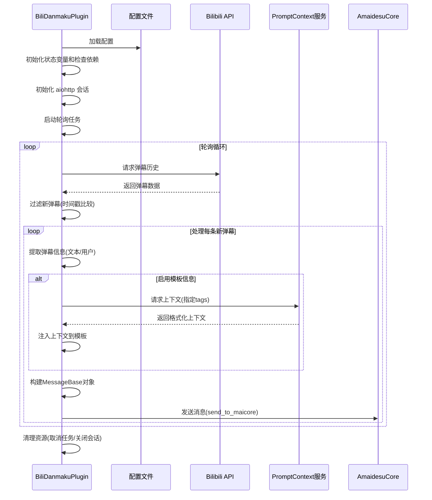

# Bilibili 弹幕插件 (bili_danmaku)

这是一个用于连接 Bilibili 直播间并接收弹幕消息的插件。它通过轮询 Bilibili 的 API 来获取直播间的弹幕信息，并将这些信息转换为 Amaidesu 系统可以处理的消息格式。

## 功能特点

本插件使用 Bilibili 的历史弹幕API（`https://api.live.bilibili.com/xlive/web-room/v1/dM/gethistory`），通过轮询和时间戳去重的方式获取所有的弹幕。

- 实时获取 Bilibili 直播间弹幕
- 支持自定义轮询间隔
- 可配置的消息格式化和模板系统
- 支持上下文标签过滤（通过 prompt_context 服务）
- 自动错误处理和重试机制
- 支持配置模板和用户信息

## 实现原理

插件通过以下步骤实现弹幕获取和转发：

1. 初始化时加载配置文件
2. 验证关键配置和依赖（aiohttp、房间ID等）
3. 创建 aiohttp 会话用于 API 请求
4. 启动后台轮询任务
5. 定期请求 Bilibili API 获取历史弹幕
6. 使用时间戳机制过滤已处理的弹幕
7. 将弹幕转换为系统消息格式（MessageBase）
8. 通过核心系统发送消息

## 消息处理流程

弹幕消息处理流程如下：

1. **获取弹幕数据**：轮询API获取直播间最近的弹幕
2. **过滤处理**：通过时间戳比较，仅处理新弹幕
3. **构建消息**：
   - 创建 UserInfo（用户信息）
   - 可选创建 GroupInfo（群组信息）
   - 设置 FormatInfo（格式信息）
   - 添加额外配置信息（source、sender_name等）
   - 可选获取并添加模板信息（TemplateInfo）
4. **上下文增强**：
   - 如果启用了模板信息且配置了context_tags
   - 调用 prompt_context 服务获取上下文
   - 将上下文注入到主模板中
5. **消息转发**：将构建好的MessageBase对象通过core.send_to_maicore发送

## 依赖服务

本插件依赖以下核心服务：

- **prompt_context**：用于获取提示上下文（可选，仅在启用模板信息时使用）

## 外部依赖

- **aiohttp**：用于进行HTTP请求
- **tomllib/toml**：用于解析配置文件

## 使用示例

要使用 prompt_context 服务的插件示例：

```python
# 获取上下文的示例代码
prompt_ctx_service = self.core.get_service("prompt_context")
if prompt_ctx_service:
    try:
        # 获取特定标签的上下文
        context = await prompt_ctx_service.get_formatted_context(tags=["character", "setting"])
        # 或获取所有上下文
        all_context = await prompt_ctx_service.get_formatted_context()
    except Exception as e:
        self.logger.error(f"调用 prompt_context 服务时出错: {e}")
```

## 核心代码简要讲解

### 弹幕轮询

```python
async def _fetch_and_process(self):
    """获取并处理弹幕"""
    # 请求B站API获取弹幕历史
    async with self._session.get(self.api_url, timeout=10) as response:
        data = await response.json()
        
        # 从响应中提取弹幕信息
        room_data = data.get("data", {}).get("room", [])
        
        # 过滤新弹幕（通过时间戳）
        new_danmakus = []
        for item in room_data:
            timestamp = item.get("check_info", {}).get("ts")
            if timestamp and timestamp > self._latest_timestamp:
                new_danmakus.append(item)
                
        # 处理并发送新弹幕
        for item in new_danmakus:
            message = await self._create_danmaku_message(item)
            if message:
                await self.core.send_to_maicore(message)
```

### 消息构建

```python
async def _create_danmaku_message(self, item: Dict[str, Any]) -> Optional[MessageBase]:
    """根据弹幕数据创建消息"""
    # 提取基本信息
    text = item.get("text", "")
    nickname = item.get("nickname", "未知用户")
    
    # 构建消息对象
    user_info = UserInfo(...)
    format_info = FormatInfo(...)
    
    # 可选获取上下文并构建模板信息
    if self.config.get("enable_template_info", False):
        prompt_ctx_service = self.core.get_service("prompt_context")
        additional_context = await prompt_ctx_service.get_formatted_context(tags=self.context_tags)
        # 将上下文添加到模板中
        
    # 创建并返回MessageBase对象
    return MessageBase(message_info=message_info, message_segment=message_segment, raw_message=text)
```

## 时序图

