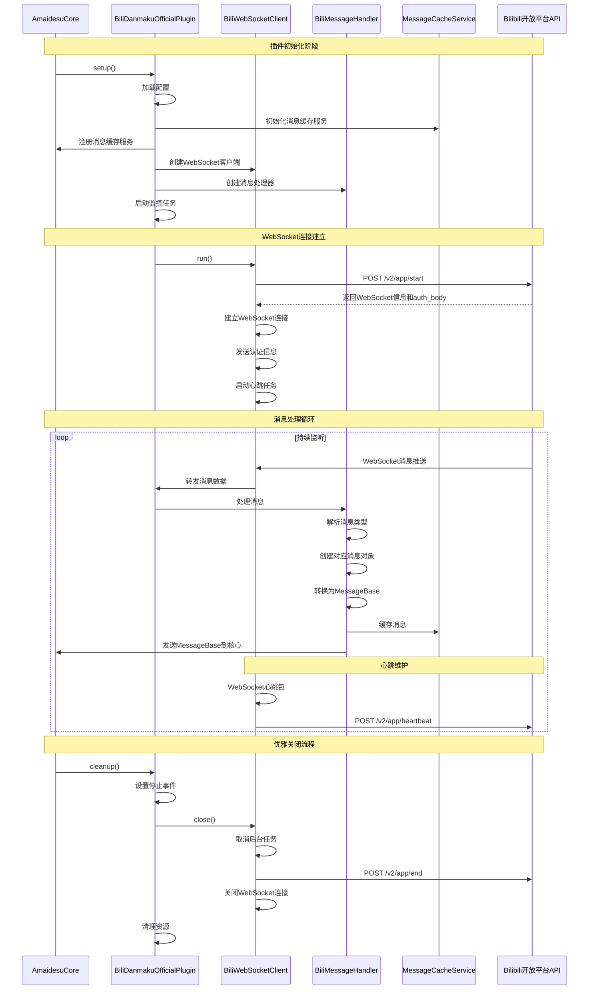

# Bilibili 直播弹幕插件（官方 WebSocket 版）

基于 Bilibili 官方[直播开放平台](https://open-live.bilibili.com/document) WebSocket API 获取实时弹幕和其他直播事件的插件。结合了优秀的架构设计，提供稳定可靠的弹幕获取服务。

## 📋 功能特性

### 核心功能

- 🔥 **实时弹幕获取**：基于官方 WebSocket API，获取高质量实时弹幕
- 🎁 **多类型事件支持**：支持弹幕、礼物、守护、醒目留言、进入房间等事件
- 📦 **消息缓存机制**：完善的消息缓存系统，避免重复处理
- 🔄 **优雅关闭处理**：完善的资源清理和错误处理机制
- 🏷️ **模板信息支持**：支持上下文标签和模板信息功能

### 支持的消息类型

- **弹幕消息** (`LIVE_OPEN_PLATFORM_DM`)：普通弹幕、表情弹幕等
- **进入房间** (`LIVE_OPEN_PLATFORM_LIVE_ROOM_ENTER`)：用户进入直播间
- **礼物消息** (`LIVE_OPEN_PLATFORM_SEND_GIFT`)：各类礼物打赏
- **大航海** (`LIVE_OPEN_PLATFORM_GUARD`)：舰长、提督、总督等守护消息
- 醒目留言 (`LIVE_OPEN_PLATFORM_SUPER_CHAT`)：SC 醒目留言

## 🏗️ 架构设计

### 模块结构

````
bili_danmaku_official/
├── __init__.py              # 插件入口点
├── plugin.py                # 主插件类
├── client/                  # WebSocket 客户端模块
│   ├── websocket_client.py  # WebSocket 连接客户端
│   └── proto.py            # 协议处理
├── service/                 # 服务层
│   ├── message_handler.py   # 消息处理器
│   └── message_cache.py     # 消息缓存服务
└── message/                 # 消息模型
    ├── base.py             # 消息基类
    ├── danmaku.py          # 弹幕消息
    ├── enter.py            # 进入房间消息
    ├── gift.py             # 礼物消息
    ├── guard.py            # 大航海消息
    └── superchat.py        # 醒目留言消息
````

## 🔄 工作流程时序图



## 📨 消息处理流程

### 消息转换流程

1. **接收原始消息**：从 WebSocket 接收 Bilibili 官方格式的消息
2. **消息类型识别**：根据 `cmd` 字段识别消息类型
3. **创建消息对象**：使用对应的消息类创建结构化对象
4. **转换为统一格式**：调用 `to_message_base()` 转换为 `MessageBase`
5. **缓存处理**：将消息存储到缓存服务中
6. **发送到核心**：将处理后的消息发送给 AmaidesuCore

### 消息类型映射

| Bilibili 官方类型                    | 插件消息类         | 功能描述       |
| ------------------------------------ | ------------------ | -------------- |
| `LIVE_OPEN_PLATFORM_DM`              | `DanmakuMessage`   | 处理弹幕消息   |
| `LIVE_OPEN_PLATFORM_LIVE_ROOM_ENTER` | `EnterMessage`     | 处理进入房间   |
| `LIVE_OPEN_PLATFORM_SEND_GIFT`       | `GiftMessage`      | 处理礼物消息   |
| `LIVE_OPEN_PLATFORM_GUARD`           | `GuardMessage`     | 处理大航海消息 |
| `LIVE_OPEN_PLATFORM_SUPER_CHAT`      | `SuperChatMessage` | 处理醒目留言   |

## 🔧 核心组件说明

### BiliWebSocketClient

- **功能**：管理与 Bilibili 官方 WebSocket 的连接
- **特性**：

  - 自动签名认证
  - 双重心跳机制（WebSocket + 应用心跳）
  - 连接状态管理
  - 优雅关闭处理


### BiliMessageHandler

- **功能**：处理从 WebSocket 接收到的消息
- **特性**：

  - 消息类型路由
  - 统一消息格式转换
  - 配置化消息类型启用/禁用
  - 模板信息和上下文标签支持


### MessageCacheService

- **功能**：提供消息缓存功能
- **特性**：

  - LRU 缓存策略
  - 配置化缓存大小
  - 重复消息检测
