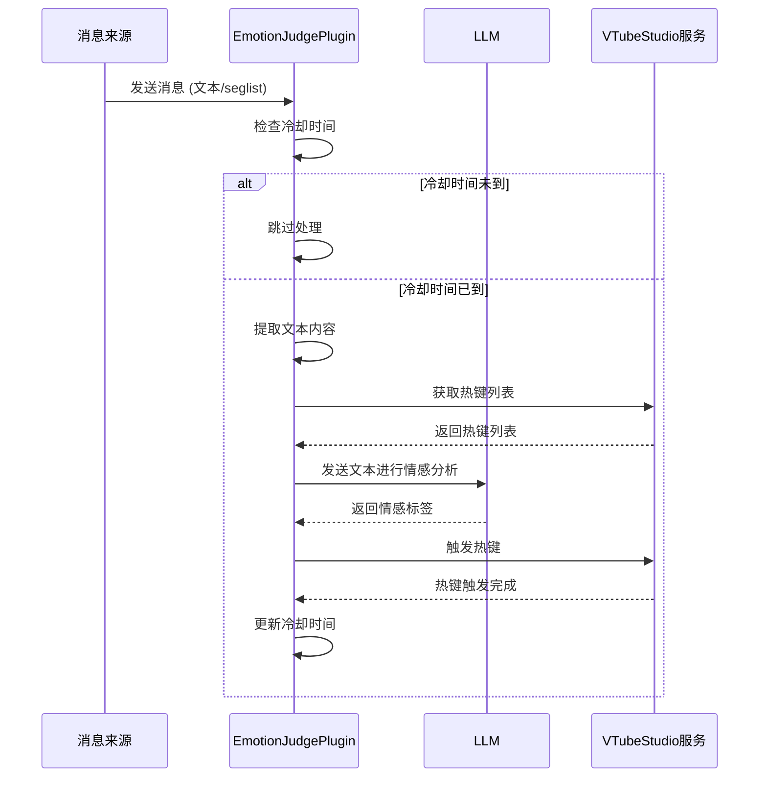

# Emotion Judge 插件

这是一个用于根据麦麦的回复内容自动判断情感状态并触发对应 Live2D 热键的插件。

## 功能概述

该插件通过监听麦麦的文本消息，使用 LLM（大语言模型）分析文本内容中的情感倾向，并自动触发对应的 Live2D 热键来增强情感表达。插件内置冷却时间机制，避免频繁触发热键导致动作不自然。

## 技术实现

### 依赖服务

- **vts_control 服务**：用于获取 VTubeStudio 热键列表及触发热键
- **OpenAI API**：用于情感分析（可配置为其他兼容 OpenAI API 的模型服务）

### 消息处理流程

插件注册了全局消息处理器，可接收所有类型的消息。主要处理逻辑如下：

1. 接收到消息后，首先检查冷却时间是否已过
2. 提取消息中的文本内容（包括处理嵌套的 seglist）
3. 调用 LLM 进行情感分析，获取合适的情感标签
4. 通过 vts_control 服务触发对应的 Live2D 热键
5. 更新冷却时间计时器

### 核心代码解析

```python
# 注册全局消息处理器
self.core.register_websocket_handler("*", self.handle_maicore_message)

# 情感判断与热键触发
async def _judge_and_trigger(self, text: str) -> Optional[str]:
    # 获取可用热键列表
    hotkey_list = await self._get_hotkey_list()
    
    # 构建包含热键列表的提示词
    hotkey_list_str = "\n".join([hotkey["name"] for hotkey in hotkey_list])
    
    # 调用 LLM 分析情感
    response = await self.client.chat.completions.create(
        model=self.model.get("name", "Qwen/Qwen2.5-7B-Instruct"),
        messages=[
            {
                "role": "system",
                "content": "你是一个主播的助手，根据主播的文本内容，判断主播的情感状态..."
                          + hotkey_list_str,
            },
            {"role": "user", "content": text},
        ],
        max_tokens=10,
        temperature=0.3,
    )
    
    # 提取情感标签并触发热键
    emotion = response.choices[0].message.content.strip()
    await self._trigger_hotkey(emotion)
    self.last_trigger_time = time.monotonic()  # 更新冷却时间
```

## 服务使用示例

本插件不提供服务接口，仅通过监听全局消息执行自动情感判断。

## 工作流程图


