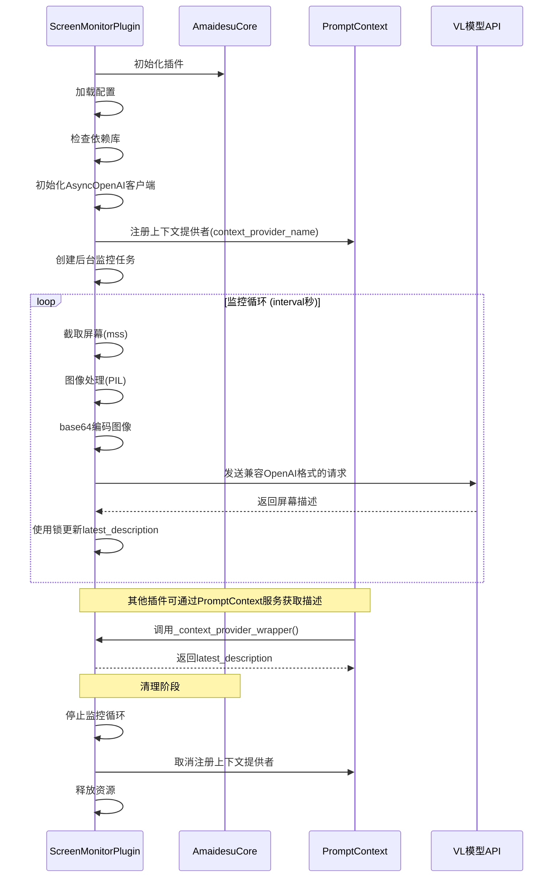

# 屏幕监控插件 (ScreenMonitorPlugin)

这是一个用于监控屏幕内容并通过视觉语言模型（VL）进行描述的插件。它能够定期截取屏幕内容（支持直接屏幕截图或从OBS获取），使用 VL 模型分析并生成描述，然后将这些描述作为上下文提供给其他服务使用。

## 功能特点

- 定期自动截取屏幕内容
- 支持多种截图源：
  - 直接屏幕截图
  - OBS Studio 通过 WebSocket 获取场景源
- 使用 OpenAI 兼容的 VL 模型分析屏幕内容
- 将屏幕描述作为动态上下文提供给其他服务
- 可配置的截图间隔和模型参数
- 支持任何 OpenAI 兼容的 VL 模型 API

## 依赖库

插件运行需要以下依赖库：
- `mss`: 用于屏幕截图（直接屏幕截图模式下需要）
- `openai`: 用于调用 VL 模型 API
- `Pillow`: 用于图像处理
- `obsws-python`: 用于连接 OBS WebSocket（OBS截图模式下需要）

## 消息处理流程

1. 插件初始化时：
   - 检查必要的依赖库（mss、openai、Pillow）
   - 加载配置参数（API密钥、模型名称、截图间隔等）
   - 初始化 AsyncOpenAI 客户端
   - 注册 prompt_context 上下文提供者服务

2. 运行时的处理流程：
   - 启动后台监控循环任务
   - 定期截取屏幕内容（通过直接截屏或OBS源）
   - 编码图像为Base64格式
   - 将图像发送到VL模型API
   - 获取并更新屏幕描述
   - 发送消息到MaiCore（如果启用）

## 截图源配置

插件支持两种截图源：

### 1. 直接屏幕截图 (screen)

使用系统级的屏幕截图功能，通过`mss`库实现。这是默认的截图源。

### 2. OBS Studio (obs)

通过OBS WebSocket API从OBS Studio获取指定源的截图。这需要在OBS中启用WebSocket服务器。

#### OBS WebSocket设置步骤

1. 在OBS Studio中，打开"工具"菜单，选择"WebSocket服务器设置"
2. 勾选"启用WebSocket服务器"
3. 设置服务器端口（默认为4455）
4. 根据需要设置身份验证密码
5. 点击"确定"保存设置

## 配置示例

以下是使用OBS作为截图源的配置示例：

```toml
# 插件配置
[read_pingmu]
enabled = true

# 截图频率（秒）
screenshot_interval_seconds = 5 

# 截图来源类型: "screen"(直接截屏) 或 "obs"(从OBS获取)
capture_source = "obs"

# --- OpenAI 兼容 API 配置 ---
api_key = "你的API密钥"
openai_compatible_base_url = "https://api.siliconflow.cn/v1"
model_name = "deepseek-ai/deepseek-vl2"
vl_prompt = "请用一句话全面的描述目前屏幕上的的内容和活动窗口标题。output in chinese!!!"

# --- OBS WebSocket 配置 ---
[read_pingmu.obs_config]
host = "localhost"
port = 4455
password = "你的OBS WebSocket密码"  # 如果未设置密码可以留空
source_name = "游戏捕获"  # OBS中的源名称
auto_switch_scene = true
scene_name = "游戏"  # 自动切换的场景名称
```
   - 将截图转换为 base64 编码
   - 调用 VL 模型获取描述（通过 OpenAI 兼容接口）
   - 使用线程锁保护更新最新的屏幕描述
   - 通过上下文提供者服务提供描述给其他插件

3. 插件清理时：
   - 停止后台监控任务
   - 取消注册上下文提供者
   - 释放资源

## 时序图



## 服务依赖

本插件依赖 AmaidesuCore 中的以下服务：

- **prompt_context**: 用于注册屏幕内容描述的上下文提供者

## 核心代码实现

### 1. 初始化与配置加载

```python
def __init__(self, core: AmaidesuCore, plugin_config: Dict[str, Any]):
    # 加载配置文件
    loaded_config = load_plugin_config()
    self.config = loaded_config.get("screen_monitor", {})
    
    # 检查依赖库
    if mss is None or openai is None or Image is None:
        # 依赖缺失处理...
        
    # 初始化 OpenAI 客户端
    self.openai_client = AsyncOpenAI(
        api_key=self.api_key,
        base_url=self.base_url,
        timeout=self.timeout_seconds,
    )
```

### 2. 服务注册

```python
async def setup(self):
    # 注册 Prompt 上下文提供者
    prompt_ctx_service = self.core.get_service("prompt_context")
    if prompt_ctx_service:
        prompt_ctx_service.register_context_provider(
            provider_name=self.context_provider_name,
            context_info=self._context_provider_wrapper,
            priority=self.context_priority,
            tags=["screen", "context", "vision", "dynamic"],
        )
    
    # 启动后台监控循环
    self.is_running = True
    self._monitor_task = asyncio.create_task(self._monitoring_loop(), name="ScreenMonitorLoop")
```

### 3. 屏幕监控循环

```python
async def _monitoring_loop(self):
    while self.is_running:
        start_time = time.monotonic()
        try:
            await self._capture_and_process_screenshot()
        except Exception as e:
            # 错误处理...
            
        # 等待下一次截图
        elapsed = time.monotonic() - start_time
        wait_time = max(0, self.interval - elapsed)
        await asyncio.sleep(wait_time)
```

### 4. VL模型调用

```python
async def _query_vl_model(self, base64_image: str) -> Optional[str]:
    messages = [
        {
            "role": "user",
            "content": [
                {"type": "text", "text": self.vl_prompt},
                {
                    "type": "image_url",
                    "image_url": {
                        "url": f"data:image/png;base64,{base64_image}"
                    },
                },
            ],
        }
    ]
    
    # 调用 OpenAI 兼容 API
    completion = await self.openai_client.chat.completions.create(
        model=self.model_name,
        messages=messages,
        max_tokens=300,
    )
    
    # 处理响应...
```

## 其他插件使用指南

其他插件可以通过 `prompt_context` 服务获取最新的屏幕内容描述。以下是使用示例：

```python
from src.core.amaidesu_core import AmaidesuCore
from src.core.plugin_manager import BasePlugin
from typing import Dict, Any

class YourPlugin(BasePlugin):
    def __init__(self, core: AmaidesuCore, plugin_config: Dict[str, Any]):
        super().__init__(core, plugin_config)
        self.prompt_ctx_service = core.get_service("prompt_context")
        
    async def get_screen_description(self) -> str:
        """获取最新的屏幕内容描述"""
        if self.prompt_ctx_service:
            # 通过上下文提供者名称获取屏幕描述
            # 默认名称为 "screen_content_latest"，可在配置中自定义
            description = await self.prompt_ctx_service.get_context("screen_content_latest")
            return description
        return "无法获取屏幕描述：PromptContext 服务未找到"
```

### 使用场景示例

1. **对话插件**：在对话中引用屏幕内容
```python
async def handle_message(self, message: str) -> str:
    screen_desc = await self.get_screen_description()
    return f"根据当前屏幕内容：{screen_desc}\n我的回答是：..."
```

2. **任务执行插件**：根据屏幕内容执行相应操作
```python
async def execute_task(self):
    screen_desc = await self.get_screen_description()
    if "错误" in screen_desc:
        await self.handle_error()
    elif "完成" in screen_desc:
        await self.handle_success()
```

3. **状态监控插件**：监控屏幕状态变化
```python
async def monitor_screen(self):
    last_desc = ""
    while True:
        current_desc = await self.get_screen_description()
        if current_desc != last_desc:
            await self.notify_screen_change(current_desc)
            last_desc = current_desc
        await asyncio.sleep(1)
```

### 注意事项

1. 使用屏幕描述时要注意其更新频率（由配置决定）
2. 屏幕描述可能包含敏感信息，使用时要注意隐私保护
3. 建议在使用前检查 `prompt_context` 服务是否可用
4. 屏幕描述是异步获取的，使用时需要使用 `await` 关键字
5. 由于调用 VL 模型可能会有延迟，获取的描述可能不是实时的
