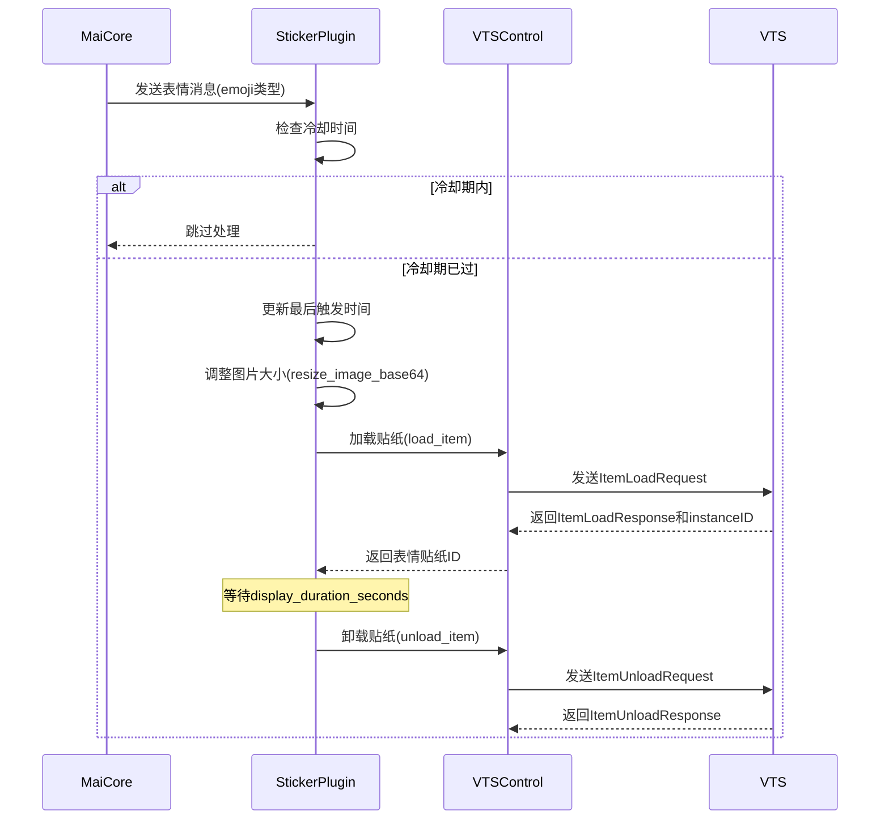

# Sticker 插件

## 功能概述
Sticker 插件是一个用于处理表情贴纸的插件，它能够将麦麦发送的表情图片作为贴纸发送到 VTube Studio (VTS) 中显示。该插件支持图片大小调整、位置控制、旋转角度设置等功能。

## 消息处理流程
1. 插件监听来自 MaiCore 的 `emoji` 类型消息
2. 当收到表情消息时，插件会：
   - 检查冷却时间是否已过（避免短时间内频繁触发表情）
   - 处理并调整图片大小（根据配置，保持原始比例）
   - 通过 `vts_control` 服务加载贴纸到 VTube Studio
   - 等待指定的显示时间
   - 自动卸载贴纸（清理资源）

## 依赖服务
插件依赖以下 Core 服务：
- `vts_control`: 由 VTube Studio 插件提供，用于控制 VTube Studio 的贴纸显示、加载和卸载

## 技术实现

### 注册消息处理器
插件初始化时，注册一个 WebSocket 消息处理器来监听 `emoji` 类型的消息：

```python
async def setup(self):
    await super().setup()
    if not self.enabled:
        return
    
    # 注册处理 emoji 类型消息的处理器
    self.core.register_websocket_handler("emoji", self.handle_maicore_message)
```

### 图片处理
插件会根据配置调整 base64 编码的图片大小，保持原始比例：

```python
def resize_image_base64(self, base64_str: str) -> str:
    """将base64图片调整为配置中指定的大小，保持原始比例"""
    # 将 base64 解码为图片
    image_data = base64.b64decode(base64_str)
    image = Image.open(io.BytesIO(image_data))
    original_width, original_height = image.size
    
    # 根据配置计算新尺寸，保持比例
    # ...调整尺寸逻辑...
    
    # 调整图片大小并返回新的 base64 字符串
    image = image.resize(target_size, Image.Resampling.LANCZOS)
    buffered = io.BytesIO()
    image.save(buffered, format="PNG")
    return base64.b64encode(buffered.getvalue()).decode("utf-8")
```

### 冷却机制
防止表情贴纸被频繁触发，实现了冷却时间机制：

```python
current_time = time.monotonic()
if current_time - self.last_trigger_time < self.cool_down_seconds:
    remaining_cooldown = self.cool_down_seconds - (current_time - self.last_trigger_time)
    self.logger.debug(f"表情贴纸冷却中，跳过消息处理。剩余 {remaining_cooldown:.1f} 秒")
    return
```

## 使用示例

### 其他插件调用示例
其他插件可以通过以下方式直接发送表情贴纸（不经过 WebSocket 消息）：

```python
# 获取 VTS 控制服务
vts_control_service = self.core.get_service("vts_control")
if vts_control_service:
    # 准备图片的 base64 编码（这里需要自行获取图片并转为 base64）
    image_base64 = "..."  # 图片的 base64 编码字符串
    
    # 加载表情贴纸
    item_instance_id = await vts_control_service.load_item(
        custom_data_base64=image_base64,
        position_x=0,
        position_y=0.5,  # 垂直居中
        size=0.33,       # 贴纸大小
        rotation=90      # 旋转角度
    )
    
    # 等待一段时间
    await asyncio.sleep(3)
    
    # 卸载表情贴纸
    await vts_control_service.unload_item(
        item_instance_id_list=[item_instance_id]
    )
```

## 时序图


## 核心代码
```python
# 获取 VTS 控制服务
vts_control_service = self.core.get_service("vts_control")

# 调整图片大小
resized_image_base64 = self.resize_image_base64(image_base64)

# 加载贴纸
item_instance_id = await vts_control_service.load_item(
    custom_data_base64=resized_image_base64,
    position_x=self.sticker_position_x,
    position_y=self.sticker_position_y,
    size=self.sticker_size,
    rotation=self.sticker_rotation,
)

# 等待显示时间
await asyncio.sleep(self.display_duration_seconds)

# 卸载贴纸
success = await vts_control_service.unload_item(
    item_instance_id_list=[item_instance_id]
)