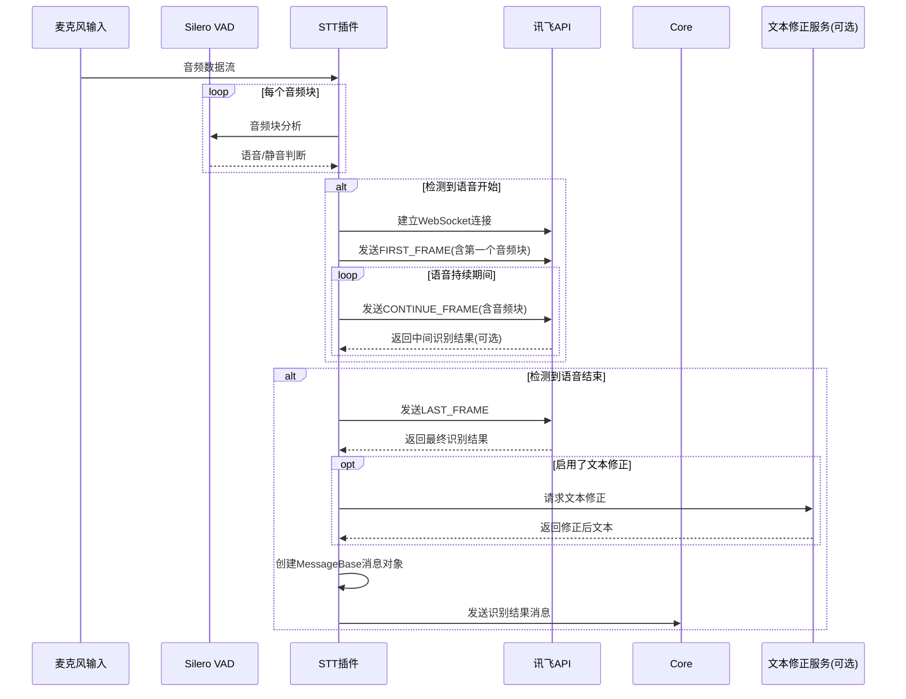

# Amaidesu STT 插件

STT（语音转文字）插件是Amaidesu机器人的语音输入模块，提供实时语音识别功能。通过本地麦克风采集音频，使用VAD（语音活动检测）算法判断发言起止，将音频流实时发送至讯飞云API进行识别，最终将识别结果转换为文本消息发送至Core处理。

## 实现原理

STT插件采用了流式识别方式，具有以下核心特点：
- 本地采集音频并进行VAD（Silero VAD）检测
- 流式发送音频至讯飞API
- 实时接收识别结果
- 支持文本修正
- 结果包装为标准消息格式发送至Core

## 主要依赖

- `torch`: 运行Silero VAD模型
- `sounddevice`: 音频设备管理和录音
- `aiohttp`: 用于与讯飞WebSocket通信
- `toml`/`tomllib`: 配置文件读取
- Amaidesu Core服务：用于发送消息和获取上下文

## 消息处理流程

整个STT插件的工作流程如下：



## 核心代码解析

### 1. 音频采集与VAD处理

STT插件使用`sounddevice`库采集音频，通过回调函数将数据放入队列，然后主工作循环中处理：

```python
def audio_callback(indata, frame_count, time_info, status):
    # 音频数据转换为bytes并放入队列
    audio_bytes = indata.astype(np.int16).tobytes()
    loop.call_soon_threadsafe(self._internal_audio_queue.put_nowait, audio_bytes)

async def _stt_worker(self):
    # 创建并启动音频流...
    stream = sd.InputStream(
        samplerate=self.sample_rate,
        blocksize=self.block_size_samples,
        device=self.input_device_index,
        channels=self.channels,
        dtype=self.dtype_str,
        callback=audio_callback,
    )
    stream.start()
    
    # 音频处理主循环
    while not self.stop_event.is_set():
        # 从队列获取音频块
        audio_chunk_bytes = await asyncio.wait_for(self._internal_audio_queue.get(), timeout=timeout_duration)
        
        # VAD处理
        audio_tensor = torch.from_numpy((np.frombuffer(audio_chunk_bytes, dtype=np.int16).astype(np.float32) / 32768.0))
        speech_prob = self.vad_model(audio_tensor, self.sample_rate).item()
        is_speech = speech_prob > self.vad_threshold
        
        # 根据VAD结果处理音频状态...
```

### 2. 讯飞API连接与通信

插件使用WebSocket与讯飞API进行流式通信：

```python
async def _ensure_iflytek_connection(self) -> bool:
    # 建立WebSocket连接
    auth_url = self._build_iflytek_auth_url()
    self._active_ws = await self._session.ws_connect(auth_url, autoping=True)
    
    # 启动接收器任务
    self._active_receiver_task = asyncio.create_task(self._iflytek_receiver(self._active_ws))
    return True

async def _iflytek_receiver(self, ws: aiohttp.ClientWebSocketResponse):
    # 接收并处理讯飞返回的识别结果
    full_text = ""
    async for msg in ws:
        if msg.type == aiohttp.WSMsgType.TEXT:
            resp = json.loads(msg.data)
            # 处理结果...
            if status == STATUS_LAST_FRAME and full_text.strip():
                # 创建并发送最终消息...
```

### 3. 语音消息创建与发送

当得到最终识别结果后，插件将创建一个标准消息对象发送至Core：

```python
async def _create_stt_message(self, text: str) -> MessageBase:
    # 创建消息对象...
    message_info = BaseMessageInfo(
        platform=self.core.platform,
        message_id=f"stt_{int(timestamp * 1000)}_{hash(text) % 10000}",
        time=int(timestamp),
        user_info=user_info,
        group_info=group_info,
        template_info=final_template_info_value,
        format_info=format_info,
        additional_config=additional_config,
    )
    
    message_segment = Seg(type="text", data=text)
    return MessageBase(message_info=message_info, message_segment=message_segment, raw_message=text)
```

## 服务与核心交互

### STT插件使用的Core服务

1. **文本修正服务**：如果配置了`enable_correction=true`，则会调用`stt_correction`服务进行识别结果优化

```python
if self.enable_correction:
    correction_service = self.core.get_service("stt_correction")
    if correction_service:
        corrected = await correction_service.correct_text(final_text_to_send)
        if corrected and isinstance(corrected, str):
            final_text_to_send = corrected
```

2. **上下文服务**：STT插件会调用`prompt_context`服务获取聊天上下文，以便在消息模板中使用

```python
prompt_ctx_service = self.core.get_service("prompt_context")
if prompt_ctx_service:
    additional_context = await prompt_ctx_service.get_formatted_context(tags=self.context_tags)
    # 将上下文添加到模板
```

### 为其他插件提供的服务

STT插件本身不向其他插件提供服务，它主要是将语音识别到的文本包装为标准消息发送至Core进行处理。最终识别结果会通过`core.send_to_maicore(message)`方法发送。

## 配置说明

STT插件通过`config.toml`文件进行配置，主要配置项包括：

1. **讯飞API配置**：在`[iflytek_asr]`部分配置API秘钥等信息
2. **VAD配置**：在`[vad]`部分配置语音检测敏感度和静音阈值
3. **音频设备配置**：在`[audio]`部分配置采样率、音频设备等
4. **消息格式配置**：在`[message_config]`部分配置发送给Core的消息格式

配置示例：
```toml
[iflytek_asr]
appid = "YOUR_APPID"
api_key = "YOUR_API_KEY"
api_secret = "YOUR_API_SECRET"

[vad]
silence_seconds = 1.0  # 静音阈值
vad_threshold = 0.5    # VAD敏感度

[audio]
stt_input_device_name = ""  # 指定麦克风，留空使用默认设备
```

## 开发建议

1. **音频设备处理**：在不同操作系统下，音频设备的处理可能有差异，建议添加更多兼容性处理
2. **错误恢复机制**：完善网络异常、WebSocket断开等情况的恢复机制
3. **替代API支持**：添加更多语音识别API支持，如本地Whisper模型等
4. **性能优化**：减少队列阻塞，优化VAD计算效率 