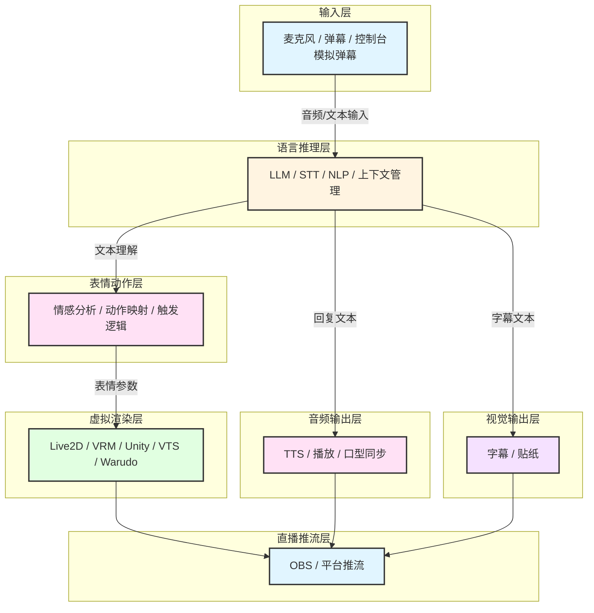
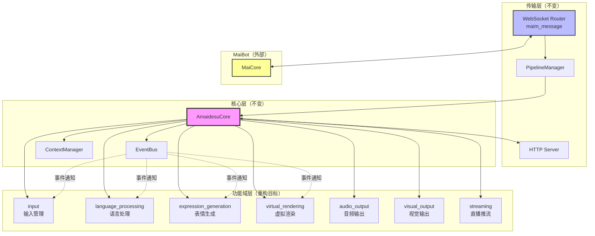
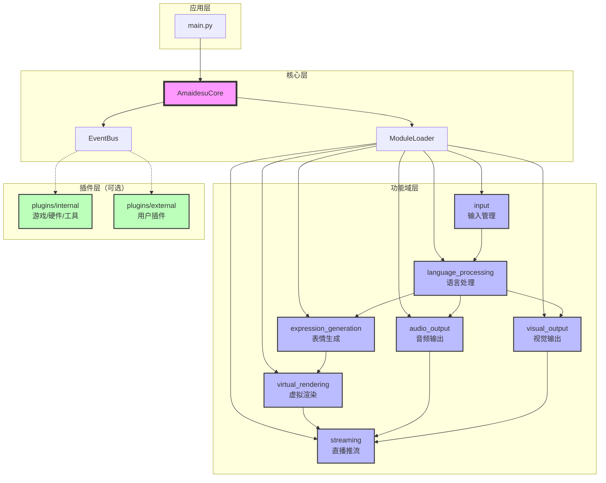
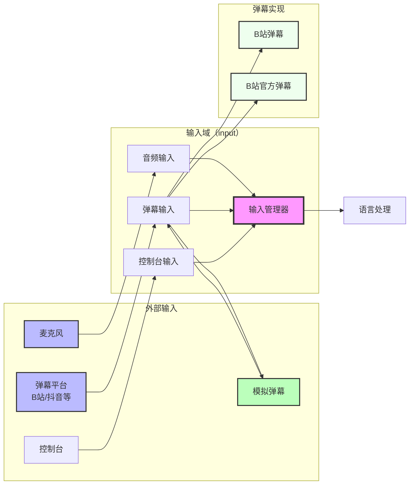

# Amaidesu 架构重构计划：基于AI VTuber功能域的模块化设计

## 📋 执行摘要

本计划旨在通过**按AI VTuber功能域重新组织架构**，解决当前amaidesu项目存在的"维护难"、"过度插件化"、"配置复杂"等问题。

### 核心改进

1. **按功能域组织模块**：音输入→语言推理→表情动作→虚拟渲染→直播推流
2. **可替换实现机制**：每个模块内部支持多种实现方式
3. **解决依赖地狱**：通过单向数据流和接口通信消除循环依赖
4. **简化配置系统**：分层配置，降低认知负担
5. **重新定位插件系统**：仅用于游戏/硬件集成，核心功能模块化

### 设计原则

- **功能域驱动**：按AI VTuber工作流程组织，而非技术模式
- **单向数据流**：模块间按业务流程单向通信，无循环依赖
- **接口统一**：同类功能收敛到一个接口，实现可替换
- **渐进式迁移**：向后兼容，平滑过渡
- **实用主义**：保留有价值的插件，移除冗余

---

## 🎯 问题验证（基于代码分析）

### 当前架构的核心问题

#### 1. "自我折磨"的配置切换
**现状**：TTS功能有3个独立插件，通过配置切换
```
src/plugins/tts/           # Edge TTS
src/plugins/gptsovits_tts/ # GPT-SoVITS
src/plugins/omni_tts/      # Omni TTS
```

**问题**：
- 代码冗余，三个插件重复依赖相同服务
- 切换实现需要修改`[plugins] enabled = [...]`列表
- 配置分散在多个地方

#### 2. "伪插件"问题
**现状**：console_input、keyword_action实际无法禁用
**问题**：不符合"插件=可拔插"的语义

#### 3. 功能分类不清
**现状**：20+个插件混在一起，新开发者难以理解
**问题**：缺乏清晰的功能域划分

#### 4. 插件系统定位模糊
**现状**：核心功能、可选扩展、测试工具都作为插件
**问题**：插件系统承载了过多职责

#### 5. 依赖地狱（核心问题）
**现状**：24个插件中有18个使用服务注册，插件间互相依赖
```python
# 依赖链示例
vts_control_service = self.core.get_service("vts_control")
cleanup_service = self.core.get_service("text_cleanup")
subtitle_service = self.core.get_service("subtitle_service")
```
**问题**：
- 启动顺序依赖（必须先启动被依赖的服务）
- "插件排列组合"调试困难（tc_魔法士的诟病）
- 配置错误导致启动失败
- 难以单独测试插件

#### 6. 弹幕输入边缘化
**现状**：弹幕输入被归类为"平台集成插件"，与麦克风输入不同等
**问题**：
- 弹幕是AI VTuber的核心输入方式，不应边缘化
- 模拟弹幕(mock_danmaku)被视为"测试工具"，实际是开发/演示的重要输入源

---

## 🏗️ 新架构设计：基于AI VTuber功能域

### 核心理念

**不按技术模式（"策略"、"工厂"）组织目录，而是按AI VTuber的工作流程组织模块。**

每个模块内部如果有多种实现方式，使用策略模式等技术手段，但这不体现在目录命名上。

### AI VTuber七层架构



### 目录结构设计

```
amaidesu/
├── src/
│   ├── core/                              # 核心基础设施
│   │   ├── amaidesu_core.py               # 中央枢纽
│   │   ├── event_bus.py                   # 事件系统
│   │   ├── pipeline_manager.py            # 管道系统
│   │   ├── context_manager.py             # 上下文管理
│   │   └── module_loader.py               # 【新增】模块加载器
│   │
│   ├── input/                              # 【功能域】输入（重构）
│   │   ├── __init__.py
│   │   ├── base_input_source.py           # 输入源抽象接口
│   │   ├── audio/                          # 音频输入
│   │   │   ├── microphone.py               # 麦克风输入
│   │   │   └── stream_audio.py             # 流音频输入
│   │   └── text/                           # 文本输入
│   │       ├── console_input.py            # 控制台输入
│   │       ├── danmaku/                    # 弹幕输入（多种实现）
│   │       │   ├── base_danmaku.py         # 弹幕输入基类
│   │       │   ├── bilibili_danmaku.py     # B站弹幕
│   │       │   ├── bilibili_official.py    # B站官方弹幕
│   │       │   ├── bilibili_maicraft.py    # B站弹幕-MaiCraft版
│   │       │   └── mock_danmaku.py         # 模拟弹幕（开发/演示）
│   │       └── other_inputs.py             # 其他输入源
│   │
│   ├── language_processing/               # 【功能域】语言处理
│   │   ├── __init__.py
│   │   ├── base_stt.py                    # 语音识别接口
│   │   ├── base_llm.py                    # LLM接口
│   │   ├── implementations/
│   │   │   ├── edge_stt.py
│   │   │   ├── funasr_stt.py
│   │   │   └── openai_llm.py
│   │   └── context_manager.py             # 上下文管理
│   │
│   ├── expression_generation/             # 【功能域】表情生成
│   │   ├── __init__.py
│   │   ├── emotion_analyzer.py            # 情感分析
│   │   ├── action_mapper.py               # 动作映射
│   │   └── trigger_engine.py              # 触发引擎
│   │
│   ├── virtual_rendering/                 # 【功能域】虚拟渲染
│   │   ├── __init__.py
│   │   ├── base_renderer.py              # 渲染器接口
│   │   ├── implementations/
│   │   │   ├── vts_renderer.py            # VTS适配器
│   │   │   ├── warudo_renderer.py         # Warudo适配器
│   │   │   ├── obs_renderer.py            # OBS适配器
│   │   │   └── vrc_renderer.py            # VRChat适配器
│   │   └── avatar_manager.py              # 虚拟形象管理器
│   │
│   ├── audio_output/                      # 【功能域】音频输出
│   │   ├── __init__.py
│   │   ├── base_tts.py                    # TTS接口
│   │   ├── implementations/
│   │   │   ├── edge_tts.py
│   │   │   ├── gptsovits_tts.py
│   │   │   └── omni_tts.py
│   │   └── playback_manager.py            # 播放管理
│   │
│   ├── visual_output/                     # 【功能域】视觉输出
│   │   ├── __init__.py
│   │   ├── subtitle_renderer.py           # 字幕渲染
│   │   └── sticker_renderer.py            # 贴纸渲染
│   │
│   └── streaming/                         # 【功能域】直播推流
│       ├── __init__.py
│       ├── obs_streamer.py                # OBS推流
│       └── platform_streamer.py           # 平台推流
│
├── plugins/                              # 【保留】插件系统（重新定位）
│   ├── internal/                          # 内置插件
│   │   ├── game_integration/              # 游戏集成
│   │   │   ├── mainosaba/                 # 魔裁游戏
│   │   │   ├── arknights/                 # 明日方舟
│   │   │   ├── minecraft/                 # 我的世界
│   │   │   └── maicraft/                  # MaiCraft游戏
│   │   ├── tools/                         # 工具插件
│   │   │   ├── screen_monitor.py          # 屏幕监控
│   │   │   ├── read_pingmu.py             # 读屏木（VL分析）
│   │   │   └── remote_stream.py           # 边缘设备流
│   │   └── hardware/                       # 硬件集成
│   │       └── dg_lab_service.py          # DG-LAB服务
│   │
│   └── external/                          # 外部插件（用户自写）
│       ├── .gitkeep
│       └── README.md
│
├── config/
│   ├── mock_danmaku.txt                   # 模拟弹幕配置文件
│   └── ...
│
├── config-template.toml
└── main.py
```

### 架构设计要点

1. **输入域统一管理**：麦克风、弹幕、控制台都是输入源，统一接口
2. **弹幕输入核心化**：弹幕不再是插件，而是核心输入功能
3. **模拟弹幕平等化**：mock_danmaku 与真实弹幕输入源地位平等
4. **实现细节隐藏**：每个功能域下的`implementations/`目录存放具体实现
5. **单向数据流**：模块间按业务流程单向通信，消除循环依赖

---

## 🔄 依赖地狱问题解决方案

### 当前依赖问题分析

基于代码分析，当前项目存在严重的依赖问题：

#### 问题1：服务注册导致的强耦合

```python
# 当前代码中的依赖链
TTSPlugin:
    - 依赖 text_cleanup_service
    - 依赖 subtitle_service
    - 依赖 vts_lip_sync_service

VTSPlugin:
    - 注册 vts_control_service
    - 注册 vts_lip_sync_service

SubtitlePlugin:
    - 依赖 tts_service（获取音频时长）
```

**问题**：
- 启动顺序必须满足：VTS → TTS → Subtitle
- 如果禁用某个中间插件，整个依赖链断裂
- 新增插件时难以理解复杂的依赖关系

#### 问题2：双向依赖

```python
# Avatar系统依赖TTS
AvatarControlManager:
    - 调用TTS获取语音时长
    - 触发口型同步

# TTS依赖Avatar系统
TTSPlugin:
    - 通知Avatar更新表情
    - 注册vts_lip_sync_service
```

**问题**：循环依赖导致模块难以独立测试和复用

### 解决方案架构

#### 核心思路：单向数据流 + 事件驱动


#### 方案1：功能域间单向依赖

**原则**：按AI VTuber业务流程组织，上游不依赖下游

| 功能域 | 依赖 | 被依赖 |
|--------|------|--------|
| input | 无 | language_processing |
| language_processing | input | expression_generation, audio_output |
| expression_generation | language_processing | virtual_rendering |
| virtual_rendering | expression_generation | streaming |
| audio_output | language_processing | streaming |
| visual_output | language_processing | streaming |
| streaming | 所有输出模块 | 无 |

**实现**：
```python
# 正确的依赖关系
class LanguageProcessing:
    def __init__(self, input_source: InputSource):
        # ✓ 上游依赖下游（正常）
        self.input_source = input_source

class ExpressionGeneration:
    def __init__(self, llm_client: LLMClient):
        # ✓ 只依赖语言处理的接口
        self.llm = llm_client

# 错误的依赖关系（禁止）
class AudioOutput:
    def __init__(self, virtual_rendering: VirtualRendering):
        # ✗ 下游依赖上游（禁止！）
        # 解决方案：使用事件系统
```

#### 方案2：事件系统解耦

**适用场景**：需要反向通信或跨模块通知

```python
# 场景：TTS播放完成通知Avatar更新口型

# ❌ 错误做法：直接依赖（当前代码）
class TTSPlugin:
    def __init__(self, core):
        # 直接获取Avatar服务，形成依赖
        self.avatar = core.get_service("vts_lip_sync")

    async def play_audio(self, text):
        audio = await self.synthesize(text)
        await self.avatar.sync_lip_sync(audio)  # 强耦合

# ✓ 正确做法：事件驱动
class TTSModule:
    def __init__(self, core):
        # 只依赖事件总线，不依赖Avatar模块
        self.event_bus = core.event_bus

    async def play_audio(self, text):
        audio = await self.synthesize(text)
        # 发布事件，谁关心谁订阅
        await self.event_bus.emit("audio.playback_started", {
            "text": text,
            "duration": audio.duration
        })

# Avatar模块订阅事件
class VirtualRenderingModule:
    async def setup(self):
        self.event_bus.subscribe("audio.playback_started", self.on_audio_playback)

    async def on_audio_playback(self, data):
        # 处理口型同步
        await self.sync_lip_sync(data["text"])
```

#### 方案3：工厂模式管理实现

**问题**：切换实现时需要修改多处代码

```python
# 当前代码：手动管理依赖
class TTSPlugin:
    def __init__(self, core):
        # 可能失败的服务获取
        self.cleanup = core.get_service("subtitle_service")
        if not self.cleanup:
            raise RuntimeError("subtitle_service未启动")

# 新方案：工厂模式
class TTSStrategyFactory:
    _implementations = {
        "edge": EdgeTTSStrategy,
        "gptsovits": GPTSoVITSStrategy,
    }

    @classmethod
    def create(cls, strategy_name: str, config: dict):
        strategy_class = cls._implementations[strategy_name]
        return strategy_class(config)

# 使用
tts = TTSStrategyFactory.create("edge", config)
# 无需手动管理依赖，策略内部自己处理
```

### 依赖消除效果对比

| 场景 | 当前架构 | 新架构 |
|------|---------|--------|
| **启动顺序** | 需要按依赖顺序启动插件 | 任意顺序，模块按需加载 |
| **禁用功能** | 可能导致依赖链断裂 | 不影响其他模块 |
| **新增实现** | 需要修改多个插件的依赖代码 | 仅需注册到工厂 |
| **测试** | 需要mock所有依赖服务 | 可独立测试 |
| **配置切换** | 修改enabled列表，重启生效 | 修改配置，即时切换 |

### 具体依赖消除案例

#### 案例1：TTS与Avatar的依赖

**当前代码**：
```python
# TTS依赖Avatar
TTSPlugin → get_service("vts_lip_sync")

# Avatar也依赖TTS（获取时长）
VTSPlugin → get_service("subtitle_service") → get_service("tts")
```

**新架构**：
```python
# TTS模块（独立）
audio_output/
    ├── base_tts.py              # 只负责合成
    └── implementations/
        └── edge_tts.py

# Avatar模块（独立）
virtual_rendering/
    └── implementations/
        └── vts_renderer.py

# 通过事件通信
EventBus:
    - audio.playback_started (TTS发布)
    - audio.playback_finished (TTS发布)
    - 参数更新 (Avatar订阅audio事件)
```

#### 案例2：多个TTS实现的统一

**当前代码**：
```python
# 三个独立插件，每个都要配置依赖关系
plugins/tts/config.toml:
    [dependencies]
    required = ["text_cleanup", "subtitle"]

plugins/gptsovits_tts/config.toml:
    [dependencies]
    required = ["text_cleanup", "subtitle"]

plugins/omni_tts/config.toml:
    [dependencies]
    required = ["text_cleanup", "subtitle"]
```

**新架构**：
```python
# 一个TTS模块，多个实现
audio_output/
    ├── base_tts.py               # 统一接口
    └── implementations/
        ├── edge_tts.py          # 独立实现
        ├── gptsovits_tts.py      # 独立实现
        └── omni_tts.py          # 独立实现

# 配置
[audio_output.tts]
provider = "edge"  # 切换实现只需改这里

# 依赖关系由工厂管理，无需手动配置
```

### 依赖管理最佳实践

#### 1. 明确依赖方向

```python
# ✓ 允许的依赖
class ExpressionGeneration:
    def __init__(self, llm_client: LLMClient):
        # 上游依赖下游接口
        pass

# ✗ 禁止的依赖
class LLMClient:
    def __init__(self, expression_gen: ExpressionGeneration):
        # 下游依赖上游（循环依赖）
        pass
```

#### 2. 使用接口而非实现

```python
# ✓ 依赖接口
class ExpressionGeneration:
    def __init__(self, llm: LanguageModelInterface):  # 接口
        pass

# ✗ 依赖具体实现
class ExpressionGeneration:
    def __init__(self, llm: OpenAILLM):  # 具体实现
        pass
```

#### 3. 事件系统处理反向通信

```python
# 需要反向通信时，使用事件
class TTSModule:
    async def on_playback_start(self, audio_data):
        # 发布事件
        await self.event_bus.emit("tts.playback", {
            "duration": audio_data.duration
        })

class VirtualRenderingModule:
    def setup(self):
        # 订阅事件
        self.event_bus.subscribe("tts.playback", self.on_tts_playback)

    async def on_tts_playback(self, data):
        # 处理口型同步
        await self.sync_lip_sync(data["duration"])
```

---

## 🔌 插件系统重新定位

### 当前插件使用情况

基于代码分析，24个插件的分类：

| 插件类型 | 数量 | 举例 |
|---------|------|------|
| **核心功能** | 6个 | tts, vtube_studio, llm_text_processor |
| **可替换实现** | 4个 | gptsovits_tts, omni_tts, funasr_stt |
| **输入功能** | 5个 | console_input, bili_danmaku系列 |
| **平台集成** | 3个 | obs_control, vrchat |
| **游戏集成** | 4个 | mainosaba, arknights, minecraft, maicraft |
| **工具类** | 3个 | screen_monitor, subtitle, sticker |
| **测试类** | 1个 | mock_danmaku |
| **待确认** | 2个 | read_pingmu, emotion_judge |

### 💡 重新定位：精简的插件系统

**核心功能模块化，插件仅用于真正的扩展。**

#### 输入功能的重新定位

**关键认知**：弹幕输入是AI VTuber的核心输入方式，不应边缘化。

| 功能 | 旧定位 | 新定位 | 理由 |
|------|-------|-------|------|
| **麦克风输入** | （缺失） | 模块 | 核心输入方式 |
| **弹幕输入** | 插件 | **模块** | 直播VTUBer的主要互动渠道 |
| **控制台输入** | 插件 | 模块 | 开发调试工具 |
| **模拟弹幕** | 测试工具 | **模块实现** | 开发/演示/测试的重要输入源 |

#### 保留为插件的功能

**插件仅用于**：
1. **游戏集成**（4个）：mainosaba, arknights, minecraft, maicraft
2. **硬件集成**（1个）：dg_lab_service
3. **特定工具**（2个）：
   - screen_monitor（屏幕监控）
   - remote_stream（边缘设备流）
   - read_pingmu（读屏木VL分析）

### 插件处理清单（完整版24个）

#### 核心功能迁移到模块（17个）

| 插件 | 功能说明 | 处理方式 | 新位置 |
|------|---------|---------|--------|
| **输入源（5个）** |
| console_input | 控制台输入 | 迁移到模块 | input/text/console_input.py |
| bili_danmaku | B站弹幕（Selenium版） | 迁移到模块 | input/text/danmaku/bilibili_danmaku.py |
| bili_danmaku_official | B站官方弹幕 | 迁移到模块 | input/text/danmaku/bilibili_official.py |
| bili_danmaku_official_maicraft | B站弹幕-MaiCraft版 | 迁移到模块 | input/text/danmaku/bilibili_maicraft.py |
| **mock_danmaku** | **模拟弹幕输入源** | **迁移到模块** | **input/text/danmaku/mock_danmaku.py** |
| **语言处理（3个）** |
| stt | Edge STT语音识别 | 迁移到模块 | language_processing/implementations/ |
| funasr_stt | FunASR语音识别 | 整合为实现 | language_processing/implementations/ |
| llm_text_processor | LLM文本处理 | 迁移到模块 | language_processing/ |
| **表情生成（2个）** |
| keyword_action | 关键词动作触发 | 迁移到模块 | expression_generation/ |
| emotion_judge | 情感判断与热键触发 | 整合到模块 | expression_generation/ |
| **虚拟渲染（4个）** |
| vtube_studio | VTube Studio控制 | 迁移到模块 | virtual_rendering/implementations/ |
| warudo | Warudo控制 | 迁移到模块 | virtual_rendering/implementations/ |
| obs_control | OBS Studio控制 | 迁移到模块 | virtual_rendering/implementations/ |
| vrchat | VRChat控制 | 迁移到模块 | virtual_rendering/implementations/ |
| **音频输出（3个）** |
| tts | Edge TTS语音合成 | 整合到模块 | audio_output/implementations/ |
| gptsovits_tts | GPT-SoVITS语音合成 | 整合为实现 | audio_output/implementations/ |
| omni_tts | Omni TTS语音合成 | 整合为实现 | audio_output/implementations/ |
| **视觉输出（2个）** |
| subtitle | 字幕渲染 | 迁移到模块 | visual_output/ |
| sticker | 贴纸渲染 | 迁移到模块 | visual_output/ |

#### 保留为插件（5个）

| 插件 | 功能说明 | 保留理由 | 新位置 |
|------|---------|---------|--------|
| **游戏集成（4个）** |
| mainosaba | 魔裁游戏集成 | 游戏集成 | plugins/internal/game_integration/ |
| arknights | 明日方舟游戏集成 | 游戏集成 | plugins/internal/game_integration/ |
| minecraft | 我的世界游戏集成 | 游戏集成 | plugins/internal/game_integration/ |
| maicraft | MaiCraft弹幕互动游戏 | 游戏集成（工厂模式） | plugins/internal/game_integration/ |
| **硬件/工具（3个）** |
| screen_monitor | 屏幕监控 | 调试工具 | plugins/internal/tools/ |
| remote_stream | 边缘设备音视频流 | 特定部署场景 | plugins/internal/tools/ |
| read_pingmu | 屏幕监控与VL分析 | 特定输入方式 | plugins/internal/tools/ |
| dg_lab_service | DG-Lab硬件控制 | 硬件集成 | plugins/internal/hardware/ |

#### 特殊说明

**mock_danmaku 模块化理由**：
- **不是测试工具**：是开发、演示、本地调试的重要输入源
- **平等地位**：与真实弹幕输入源使用相同接口
- **易于切换**：开发时用mock，直播时切换到真实平台
- **演示友好**：展示AI VTuber功能时不需要连接真实平台
- **性能测试**：可模拟高并发弹幕场景

**emotion_judge 插件整合理由**：
- 当前功能：LLM情感分析 + 热键触发
- 与expression_generation域的功能重复
- 整合方案：将LLM情感分析能力融入表情生成域的智能触发策略

---

## 📦 功能域设计详解

### 功能域覆盖度验证

经过对所有24个插件的完整分析，**7个功能域完全覆盖AI VTuber核心工作流程**：

| 功能域 | 核心职责 | 对应的现有插件 | 覆盖度 |
|--------|---------|---------------|--------|
| **input** | 统一的输入源管理 | console_input, bili_danmaku系列, mock_danmaku | ✅ 完整 |
| **language_processing** | 语音识别、LLM处理 | stt, funasr_stt, llm_text_processor | ✅ 完整 |
| **expression_generation** | 情感分析、动作触发 | keyword_action, emotion_judge, avatar控制系统 | ✅ 完整 |
| **virtual_rendering** | 虚拟形象驱动 | vtube_studio, warudo, obs_control, vrchat | ✅ 完整 |
| **audio_output** | 语音合成、播放 | tts, gptsovits_tts, omni_tts | ✅ 完整 |
| **visual_output** | 字幕、贴纸渲染 | subtitle, sticker | ✅ 完整 |
| **streaming** | 推流控制 | obs_control（推流部分） | ⚠️ 需扩展 |

### MaiBot通信机制

**重要结论：MaiBot通信机制完全不变**

功能域重构只影响**业务逻辑层**，不涉及**传输层**：

| 通信组件 | 作用 | 变化 |
|---------|------|------|
| **WebSocket Router** (maim_message) | 与MaiCore的WebSocket连接 | ❌ 无变化 |
| **HTTP Server** | 接收MaiCore的HTTP回调 | ❌ 无变化 |
| **PipelineManager** | 消息预处理（入站/出站管道） | ❌ 无变化 |
| **EventBus** | 模块间事件通信 | ❌ 无变化 |
| **ContextManager** | 上下文聚合管理 | ❌ 无变化 |



**关键点**：
- ✅ MaiBot无感知：通信协议完全相同
- ✅ 管道系统继续工作：消息预处理机制不变
- ✅ 功能域只处理业务逻辑：不涉及传输层
- ✅ 渐进式迁移：可以先重构业务逻辑，传输层保持稳定

---

### 1. 输入域 (input)

**职责**：统一管理所有输入源（音频、文本、弹幕）

#### 核心接口

```python
class InputSource(ABC):
    """输入源抽象基类"""

    @abstractmethod
    async def start(self) -> AsyncIterator[InputMessage]:
        """启动输入流"""
        pass

    @abstractmethod
    async def stop(self):
        """停止输入源"""
        pass

    @abstractmethod
    def get_source_type(self) -> str:
        """获取输入源类型"""
        pass

class TextInputSource(InputSource):
    """文本输入源接口"""

    @abstractmethod
    async def get_message_stream(self) -> AsyncIterator[TextMessage]:
        """获取消息流"""
        pass
```

#### 弹幕输入实现

```python
# input/text/danmaku/base_danmaku.py
class BaseDanmakuSource(TextInputSource):
    """弹幕输入源基类"""

    def __init__(self, config: dict):
        self.config = config
        self.room_id = config.get("room_id")

    async def get_message_stream(self) -> AsyncIterator[TextMessage]:
        # 通用弹幕处理逻辑
        pass

# input/text/danmaku/bilibili_danmaku.py
class BilibiliDanmakuSource(BaseDanmakuSource):
    """B站弹幕输入源（Selenium版）"""
    async def get_message_stream(self) -> AsyncIterator[TextMessage]:
        # Selenium实现
        async for msg in self.selenium_client:
            yield TextMessage(
                content=msg.text,
                sender=msg.username,
                timestamp=msg.timestamp,
                source="bilibili"
            )

# input/text/danmaku/bilibili_official.py
class BilibiliOfficialDanmakuSource(BaseDanmakuSource):
    """B站官方弹幕输入源"""
    async def get_message_stream(self) -> AsyncIterator[TextMessage]:
        # 官方API实现
        async for msg in self.official_client:
            yield TextMessage(
                content=msg.text,
                sender=msg.username,
                timestamp=msg.timestamp,
                source="bilibili_official"
            )

# input/text/danmaku/mock_danmaku.py
class MockDanmakuSource(TextInputSource):
    """模拟弹幕输入源（用于开发/演示/测试）"""

    def __init__(self, config: dict):
        self.config = config
        self.source_file = config.get("source_file", "config/mock_danmaku.txt")
        self.auto_generate = config.get("auto_generate", False)
        self.messages_per_minute = config.get("messages_per_minute", 10)

    async def get_message_stream(self) -> AsyncIterator[TextMessage]:
        if self.source_file:
            # 从文件读取模拟弹幕
            async for line in self._read_file():
                parts = line.split("|")
                if len(parts) >= 2:
                    yield TextMessage(
                        content=parts[1].strip(),
                        sender=parts[0].strip(),
                        timestamp=time.time(),
                        source="mock"
                    )
        elif self.auto_generate:
            # 自动生成模拟弹幕
            mock_messages = [
                "主播好可爱啊",
                "这个游戏怎么玩？",
                "666666",
                "能不能唱首歌？"
            ]
            while True:
                for msg in mock_messages:
                    yield TextMessage(
                        content=msg,
                        sender=f"模拟观众{random.randint(1, 100)}",
                        timestamp=time.time(),
                        source="mock"
                    )
                    await asyncio.sleep(60 / self.messages_per_minute)
```

#### 模拟弹幕配置文件

```txt
# config/mock_danmaku.txt
# 格式：发送者|消息内容

张三|主播好可爱啊
李四|这个游戏怎么玩？
王五|666666
赵六|能不能唱首歌？
```

#### 配置示例

```toml
[input]
# 启用的输入源（可多选）
enabled_sources = ["microphone", "danmaku", "console"]

[input.danmaku]
# 弹幕输入源配置
enabled = true

# 主输入源（可切换）
provider = "bilibili_official"  # bilibili, bilibili_official, mock

# B站官方弹幕配置
[input.danmaku.bilibili_official]
room_id = 0

# 模拟弹幕配置
[input.danmaku.mock]
# 从文件读取模拟弹幕
source_file = "config/mock_danmaku.txt"

# 或者自动生成模拟弹幕
auto_generate = true
messages_per_minute = 10
```

---

### 2. 语言处理域 (language_processing)

**职责**：将音频/文本转换为可理解的信息

（保持原有设计）

---

### 3. 表情生成域 (expression_generation)

**职责**：理解文本并生成表情/动作参数

（保持原有设计）

---

### 4. 虚拟渲染域 (virtual_rendering)

**职责**：驱动虚拟形象渲染

（保持原有设计）

---

### 5. 音频输出域 (audio_output)

**职责**：语音合成和播放

（保持原有设计）

---

### 6. 视觉输出域 (visual_output)

**职责**：字幕、贴纸等视觉元素渲染

（保持原有设计）

---

### 7. 直播推流域 (streaming)

**职责**：推流到直播平台

（保持原有设计）

---

## 📝 配置系统设计

### 配置文件层次

```toml
# config-template.toml

# === 1. 全局配置 ===
[general]
platform_id = "amaidesu_default"

# === 2. 功能域配置 ===
[input]
enabled_sources = ["microphone", "danmaku", "console"]

[input.danmaku]
provider = "bilibili_official"

[language_processing]
stt_provider = "edge"
llm_provider = "openai"

[expression_generation]
trigger_strategy = "intelligent"

[virtual_rendering]
primary_renderer = "vts"

[audio_output]
tts_provider = "edge"

[visual_output]
subtitle_enabled = true

# === 3. 功能域内实现配置 ===
[input.danmaku.bilibili_official]
room_id = 0

[input.danmaku.mock]
source_file = "config/mock_danmaku.txt"
auto_generate = false

[language_processing.llm.openai]
model = "gpt-4"

[virtual_rendering.vts]
host = "localhost"
port = 8001

[audio_output.tts.edge]
voice = "zh-CN-XiaoxiaoNeural"

# === 4. 插件配置 ===
[plugins]
enabled_internal = [
    "mainosaba",
    "screen_monitor",
]
enabled_external = []

[plugins.mainosaba]
# 游戏集成配置
```

### 配置优先级

1. **功能域配置** > 默认配置
2. **实现配置** > 功能域配置
3. **插件配置**独立管理

---

## 🚀 迁移路径

### 第一阶段：输入域基础设施（1-2周）

**目标**：建立统一的输入管理架构

#### 任务

1. 创建input功能域目录结构
2. 实现InputSource抽象接口
3. 迁移弹幕输入源到input/text/danmaku/
4. 实现mock_danmaku为独立实现
5. 更新配置系统

#### 验证标准

- ✅ 弹幕输入作为核心功能正常工作
- ✅ mock_danmaku与真实弹幕可无缝切换
- ✅ 开发时可用mock进行测试

---

### 第二阶段：核心功能迁移（3-4周）

**目标**：迁移其他核心功能到功能域模块

（保持原有计划）

---

### 第三阶段：表情生成与输出（2-3周）

**目标**：完善表情生成和视觉输出

（保持原有计划）

---

### 第四阶段：插件系统重构（1周）

**目标**：重构插件系统，明确新定位

#### 任务

1. 简化插件API
2. 迁移核心功能到模块
3. 迁移平台/游戏集成到插件
4. 更新插件开发文档

#### 验证标准

- ✅ 插件系统仅用于游戏/硬件/工具
- ✅ 核心功能迁移完成
- ✅ 插件间无循环依赖

---

### 第五阶段：清理与优化（1周）

**目标**：清理代码，优化性能，完善文档

（保持原有计划）

---

## 📊 架构对比

### 当前架构 vs 新架构

| 维度 | 当前架构 | 新架构 |
|------|---------|--------|
| **组织方式** | 按技术模式（插件） | 按功能域（业务流程） |
| **TTS配置** | 3个独立插件，分散配置 | 1个模块，统一配置 |
| **弹幕输入** | 平台集成插件，边缘化 | 核心输入功能，统一管理 |
| **模拟弹幕** | 测试工具，地位低 | 与真实弹幕平等 |
| **核心功能** | 混在插件中 | 独立的模块，清晰 |
| **扩展机制** | 完整的插件系统（24个） | 精简的插件系统（5个） |
| **配置复杂度** | 高（20+插件） | 低（7个功能域+5个插件） |
| **新开发者友好度** | 低（需要理解插件系统） | 高（按业务流程组织） |

### 核心优势

1. **弹幕输入核心化**：符合AI VTUBer的实际使用场景
2. **模拟弹幕平等化**：开发、演示、测试更便捷
3. **统一输入接口**：所有输入源通过统一接口管理
4. **易于切换**：真实平台与模拟环境无缝切换

---

## ✅ 成功标准

### 技术指标

- ✅ 所有现有功能正常运行
- ✅ 配置文件行数减少40%以上
- ✅ 核心功能响应时间无增加
- ✅ 代码重复率降低30%以上

### 用户体验指标

- ✅ 新开发者能在30分钟内理解架构
- ✅ 配置错误能给出清晰的提示
- ✅ 文档覆盖率达到95%以上
- ✅ 社区反馈正面

### 架构指标

- ✅ 清晰的七层功能域架构
- ✅ 模块间依赖关系清晰
- ✅ 扩展系统精简但足够灵活
- ✅ 易于添加新功能域

---

## 🎯 与讨论期望的对照

### 用户核心问题确认

**问题1：现在的功能域足够了吗？覆盖全面了吗？**

✅ **回答：是的，7个功能域完全覆盖AI VTuber核心工作流程**

- 输入域（input）统一管理所有输入源，包括弹幕
- 所有核心功能都有对应的功能域

**问题2：关于和MaiBot的通信有变化吗？**

❌ **回答：完全无变化**

- 传输层、核心层保持不变
- 功能域只处理业务逻辑

### 关键改进点

| 改进点 | 说明 |
|--------|------|
| **弹幕输入核心化** | 从插件提升为核心输入功能域 |
| **模拟弹幕平等化** | 不再是测试工具，而是独立的输入源实现 |
| **统一输入接口** | 所有输入源通过InputSource抽象接口统一管理 |
| **易于切换** | 开发时用mock，直播时切换真实平台 |

---

## 📚 附录

### A. 术语表

| 术语 | 定义 |
|------|------|
| **功能域** | 按AI VTuber业务流程划分的功能模块，如input, virtual_rendering |
| **模块** | 核心功能的实现，位于src/{功能域}/下 |
| **输入源** | 提供文本或音频输入的实现，如麦克风、弹幕、控制台 |
| **插件** | 可选的游戏/硬件/工具集成，位于plugins/目录 |
| **接口** | 功能域定义的抽象方法，规范实现的行为 |

### B. Mermaid架构图



### C. 输入域数据流图



---

**文档版本**：v2.1
**最后更新**：2025-01-16
**状态**：设计阶段，待评审

**v2.1 更新内容**：
- ✅ 将弹幕输入从"平台集成插件"提升为"核心输入功能域"
- ✅ 将mock_danmaku从"测试工具"提升为与真实弹幕同等的输入源实现
- ✅ 重构input功能域，统一管理所有输入源
- ✅ 更新插件处理清单，明确弹幕相关插件的迁移路径
