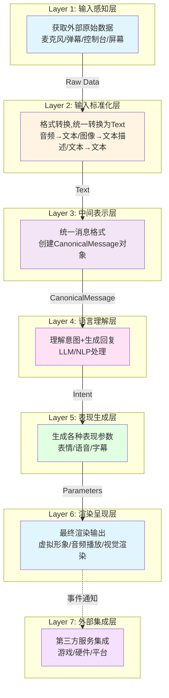
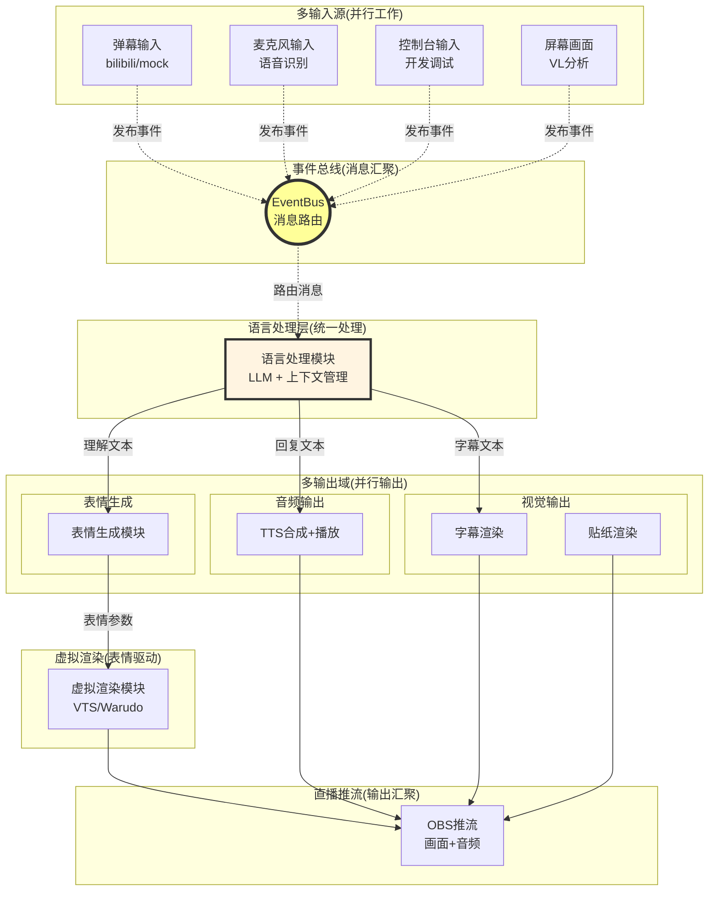
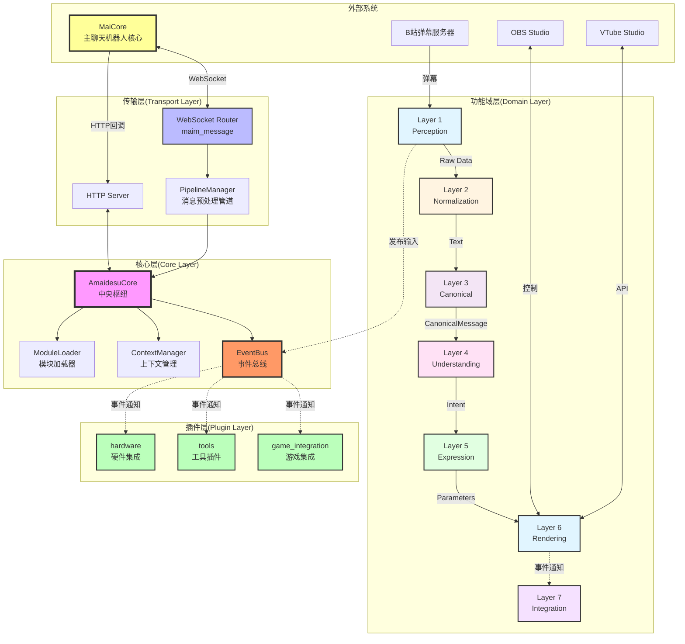

# Amaidesu 架构重构计划：基于数据流的7层架构设计

## 📋 执行摘要

本计划旨在通过**基于数据流的7层架构**重新组织Amaidesu项目,解决当前存在的"依赖地狱"、"过度插件化"、"配置复杂"等核心问题。

### 核心改进

1. **按数据流组织层级**：感知→标准化→表示→理解→表现→渲染→集成
2. **统一转换为文本**：所有输入统一转换为Text格式,简化后续处理
3. **消除依赖地狱**：推广EventBus通信,替代服务注册模式
4. **简化配置系统**：分层配置,降低认知负担
5. **重新定位插件系统**：仅用于游戏/硬件集成,核心功能模块化

### 设计原则

- **数据流驱动**：按AI VTuber数据处理流程组织层级
- **单向数据流**：层级间按数据流向单向通信,无循环依赖
- **接口统一**：同类功能收敛到一个接口,实现可替换
- **渐进式迁移**：向后兼容,平滑过渡
- **实用主义**：保留有价值的插件,移除冗余

---

## 🎯 问题验证(基于代码分析)

### 当前架构的7大核心问题

#### 1. "自我折磨"的配置切换
**现状**:TTS功能有3个独立插件,通过配置切换
```
src/plugins/tts/           # Edge TTS
src/plugins/gptsovits_tts/ # GPT-SoVITS
src/plugins/omni_tts/      # Omni TTS
```

**问题**:
- 代码冗余,三个插件重复依赖相同服务
- 切换实现需要修改`[plugins] enabled = [...]`列表
- 配置分散在多个地方

#### 2. "伪插件"问题
**现状**:console_input、keyword_action实际无法禁用
**问题**:不符合"插件=可拔插"的语义

#### 3. 功能分类不清
**现状**:20+个插件混在一起,新开发者难以理解
**问题**:缺乏清晰的层级划分

#### 4. 插件系统定位模糊
**现状**:核心功能、可选扩展、测试工具都作为插件
**问题**:插件系统承载了过多职责

#### 5. 依赖地狱(核心问题)
**现状**:24个插件中有18个使用服务注册,插件间互相依赖
```python
# 依赖链示例
vts_control_service = self.core.get_service("vts_control")
cleanup_service = self.core.get_service("text_cleanup")
subtitle_service = self.core.get_service("subtitle_service")
```

**问题**:
- 启动顺序依赖(必须先启动被依赖的服务)
- "插件排列组合"调试困难(tc_魔法士的诟病)
- 配置错误导致启动失败
- 难以单独测试插件

#### 6. 弹幕输入边缘化
**现状**:弹幕输入被归类为"平台集成插件",与麦克风输入不同等
**问题**:
- 弹幕是AI VTuber的核心输入方式,不应边缘化
- 模拟弹幕(mock_danmaku)被视为"测试工具",实际是开发/演示的重要输入源

#### 7. 架构图过于简化,误导理解为单线流程
**现状**:当前的架构图给人"输入→处理→输出"的单线印象
**问题**:
- AI VTuber实际需要**多输入并行**(弹幕+麦克风+屏幕画面)
- AI VTuber实际需要**多输出并行**(字幕+语音+表情动作)
- 缺少对事件总线/消息路由机制的明确描述

---

## 🏗️ 新架构设计:基于数据流的7层架构

### 核心理念

**按AI VTuber数据处理的完整流程组织层级,每层有明确的输入和输出格式。**

- **不按技术模式("策略"、"工厂")组织目录**
- **每层输出格式统一且明确**
- **层级间单向依赖,消除循环耦合**

### 7层架构概览



**重要说明**:上图展示的是**层级的层次关系**,实际运行时是**多输入并行→事件汇聚→多输出并行**的架构(见后文详细说明)。

### 7层架构详细设计

| 层级 | 英文名 | 输入格式 | 输出格式 | 核心职责 | 划分标准 |
|------|--------|---------|---------|---------|----------|
| **1. 输入感知层** | Perception | - | Raw Data | 获取外部原始数据 | 按数据来源(音频/文本/图像) |
| **2. 输入标准化层** | Normalization | Raw Data | **Text** | 统一转换为文本 | 按转换类型(音频→文本/图像→文本) |
| **3. 中间表示层** | Canonical | Text | **CanonicalMessage** | 统一消息格式 | 数据格式标准化 |
| **4. 语言理解层** | Understanding | CanonicalMessage | **Intent** | 理解意图+生成回复 | 按处理逻辑(LLM/NLP) |
| **5. 表现生成层** | Expression | Intent | **Parameters** | 生成各种表现参数 | 按输出模态(表情/语音/字幕) |
| **6. 渲染呈现层** | Rendering | Parameters | **Frame/Stream** | 最终渲染输出 | 按输出目标(虚拟形象/音频/视觉) |
| **7. 外部集成层** | Integration | - | - | 第三方服务集成 | 按平台/工具(游戏/硬件) |

### 关键设计决策

#### 1. 统一转换为文本(Layer 2)

**决策**:所有输入统一转换为Text格式

**理由**:
- 简化后续处理流程
- LLM只能处理文本
- 图像/音频通过VL模型转换为文本描述
- 降低系统复杂度

**示例**:
```
麦克风音频 → STT识别 → Text "你好世界"
屏幕截图   → VL分析  → Text "屏幕显示游戏界面"
弹幕文本   → 保持    → Text "主播好可爱"
```

#### 2. CanonicalMessage统一格式(Layer 3)

**决策**:定义统一的内部消息格式

```python
class CanonicalMessage:
    """
    统一消息格式
    """
    def __init__(self):
        self.text: str = ""              # 文本内容(Layer 2输出)
        self.metadata: Dict = {}         # 元数据(来源、时间戳、用户等)
        self.context: Optional[ConversationContext] = None  # 对话上下文

    @classmethod
    def from_text(cls, text: str, source: str) -> "CanonicalMessage":
        """从文本创建消息"""
        msg = cls()
        msg.text = text
        msg.metadata = {
            "source": source,
            "timestamp": time.time()
        }
        return msg
```

**优势**:
- 统一的数据格式
- 易于扩展(添加新字段)
- 便于序列化和传输

#### 3. Intent意图对象(Layer 4输出)

**决策**:语言理解层输出Intent对象

```python
class Intent:
    """
    意图对象
    """
    def __init__(self):
        self.original_text: str = ""        # 原始文本
        self.emotion: EmotionType = EmotionType.NEUTRAL  # 情感类型
        self.response_text: str = ""         # 回复文本
        self.actions: List[Action] = []      # 触发的动作
        self.metadata: Dict = {}             # 其他元数据
```

#### 4. Parameters参数对象(Layer 5输出)

**决策**:表现生成层输出Parameters对象

```python
class RenderParameters:
    """
    渲染参数
    """
    def __init__(self):
        # 表情参数
        self.expressions: Dict[str, float] = {}  # {"MouthSmile": 1.0}

        # 音频参数
        self.tts_text: Optional[str] = None
        self.tts_voice: Optional[str] = None

        # 视觉参数
        self.subtitle_text: Optional[str] = None
        self.subtitle_duration: Optional[float] = None

        # 热键触发
        self.hotkeys: List[str] = []
```

### MECE原则验证

| 原则 | 验证 | 说明 |
|------|------|------|
| **相互独立**(ME) | ✅ | 每层职责明确,边界清晰 |
| **完全穷尽**(CE) | ✅ | 覆盖从感知到输出的完整流程 |
| **标准明确** | ✅ | 按"输入→输出格式"划分 |

---

## 🔄 事件驱动的并行架构(重构目标)

### 核心理解

**不是"一条线",而是"多根线汇聚处理后再分发"。**

### 当前问题

- 插件通过`get_service()`直接依赖其他插件
- 形成复杂的依赖链和启动顺序要求
- EventBus已实现但使用率极低

### 重构目标

- 推广EventBus作为主要通信模式
- 消除服务注册导致的依赖地狱
- 实现真正的解耦和并行处理

### 实际数据流向



### 从服务注册到EventBus的迁移

#### 当前代码(服务注册模式)

```python
# TTS插件获取其他服务
class TTSPlugin(BasePlugin):
    async def setup(self):
        # ❌ 直接依赖其他插件,形成依赖链
        self.text_cleanup = self.core.get_service("text_cleanup")
        self.subtitle_service = self.core.get_service("subtitle_service")
        self.vts_lip_sync = self.core.get_service("vts_lip_sync")
```

#### 重构后(EventBus模式)

```python
# TTS模块发布事件,其他模块订阅
class TTSModule(BaseModule):
    async def setup(self):
        # ✅ 订阅需要的事件
        self.listen_event("text.ready", self.on_text_ready)

    async def play_audio(self, text):
        audio = await self.synthesize(text)
        # ✅ 发布事件,不关心谁在监听
        await self.event_bus.emit("audio.playback_started", {
            "text": text,
            "duration": audio.duration
        })

# Subtitle模块订阅事件
class SubtitleModule(BaseModule):
    async def setup(self):
        self.listen_event("audio.playback_started", self.on_audio_start)

    async def on_audio_start(self, data):
        # 处理字幕显示
        await self.show_subtitle(data["text"], data["duration"])
```

#### 优势对比

| 维度 | 服务注册模式 | EventBus模式 |
|------|------------|-------------|
| **依赖关系** | 直接依赖,启动顺序敏感 | 无依赖,任意启动顺序 |
| **耦合度** | 强耦合(知道对方存在) | 松耦合(只知道事件) |
| **测试性** | 难以mock依赖 | 容易mock事件 |
| **可扩展性** | 新增功能需修改依赖链 | 新增功能只需订阅事件 |
| **复杂度** | 简单直接(小规模) | 需要定义事件规范 |

#### 事件规范示例

```python
# 事件命名规范:{domain}.{action}.{status}
"input.received"          # 输入接收到
"text.ready"              # 文本准备就绪(经过清理)
"llm.processing"          # LLM正在处理
"llm.response.generated"  # LLM生成回复
"audio.synthesis.started" # TTS合成开始
"audio.playback.started"  # 音频播放开始
"audio.playback.finished" # 音频播放结束
"expression.generated"    # 表情参数生成
"parameter.updated"       # 参数更新

# 事件数据格式规范
{
    "event": "audio.playback.started",
    "timestamp": 1234567890.123,
    "source": "audio_output.tts",
    "data": {
        "text": "要播放的文本",
        "duration": 5.23,
        "format": "wav"
    }
}
```

---

## 🏛️ 完整项目架构图(5层)



**架构说明**:

1. **外部系统**:MaiCore,B站,OBS,VTS等第三方服务
2. **传输层**:WebSocket Router,HTTP Server,PipelineManager(与MaiBot通信,**保持不变**)
3. **核心层**:AmaidesuCore,EventBus,ContextManager,ModuleLoader
4. **功能域层**:7层架构(重构重点)
5. **插件层**:游戏/硬件/工具集成(保留但精简)

---

## 📁 目录结构设计

```
amaidesu/
├── src/
│   ├── core/                              # 核心基础设施(保持不变)
│   │   ├── amaidesu_core.py               # 中央枢纽
│   │   ├── event_bus.py                   # 事件系统
│   │   ├── pipeline_manager.py            # 管道系统
│   │   ├── context_manager.py             # 上下文管理
│   │   └── module_loader.py               # 【新增】模块加载器
│   │
│   ├── perception/                         # 【Layer 1】输入感知层
│   │   ├── __init__.py
│   │   ├── audio/
│   │   │   ├── microphone.py              # 麦克风输入
│   │   │   └── stream_audio.py            # 流音频输入
│   │   └── text/
│   │       ├── console_input.py           # 控制台输入
│   │       └── danmaku/                    # 弹幕输入
│   │           ├── base_danmaku.py         # 弹幕基类
│   │           ├── bilibili_danmaku.py     # B站弹幕
│   │           ├── bilibili_official.py    # B站官方弹幕
│   │           └── mock_danmaku.py         # 模拟弹幕
│   │
│   ├── normalization/                      # 【Layer 2】输入标准化层
│   │   ├── __init__.py
│   │   ├── text_normalizer.py             # 文本标准化
│   │   ├── audio_to_text.py               # 音频→文本(STT)
│   │   ├── image_to_text.py               # 图像→文本(VL)
│   │   └── implementations/
│   │       ├── edge_stt.py
│   │       └── openai_vl.py
│   │
│   ├── canonical/                          # 【Layer 3】中间表示层
│   │   ├── __init__.py
│   │   ├── canonical_message.py           # CanonicalMessage定义
│   │   ├── message_builder.py             # 消息构建器
│   │   └── context_attacher.py            # 上下文附加器
│   │
│   ├── understanding/                       # 【Layer 4】语言理解层
│   │   ├── __init__.py
│   │   ├── base_llm.py                    # LLM接口
│   │   ├── intent_analyzer.py             # 意图分析
│   │   ├── emotion_detector.py            # 情感检测
│   │   └── implementations/
│   │       └── openai_llm.py
│   │
│   ├── expression/                          # 【Layer 5】表现生成层
│   │   ├── __init__.py
│   │   ├── expression_generator.py         # 表情生成器
│   │   ├── action_mapper.py               # 动作映射器
│   │   ├── tts_planner.py                 # TTS规划器
│   │   └── subtitle_planner.py            # 字幕规划器
│   │
│   ├── rendering/                           # 【Layer 6】渲染呈现层
│   │   ├── __init__.py
│   │   ├── virtual_rendering/             # 虚拟渲染
│   │   │   ├── base_renderer.py
│   │   │   └── implementations/
│   │   │       ├── vts_renderer.py
│   │   │       ├── warudo_renderer.py
│   │   │       └── obs_renderer.py
│   │   ├── audio_rendering/               # 音频渲染
│   │   │   ├── tts_engine.py
│   │   │   ├── playback_manager.py
│   │   │   └── implementations/
│   │   │       ├── edge_tts.py
│   │   │       ├── gptsovits_tts.py
│   │   │       └── omni_tts.py
│   │   └── visual_rendering/              # 视觉渲染
│   │       ├── subtitle_renderer.py
│   │       └── sticker_renderer.py
│   │
│   └── integration/                         # 【Layer 7】外部集成层(原插件系统)
│       ├── game_integration/               # 游戏集成
│       │   ├── mainosaba/
│       │   ├── arknights/
│       │   ├── minecraft/
│       │   └── maicraft/
│       ├── tools/                          # 工具插件
│       │   ├── screen_monitor.py
│       │   ├── read_pingmu.py
│       │   └── remote_stream.py
│       └── hardware/                       # 硬件集成
│           └── dg_lab_service.py
│
├── config/
│   └── mock_danmaku.txt                   # 模拟弹幕配置文件
│
├── config-template.toml
└── main.py
```

---

## 🔌 插件系统重新定位

### 当前插件使用情况

24个插件的分类:

| 插件类型 | 数量 | 举例 |
|---------|------|------|
| **核心功能** | 6个 | tts, vtube_studio, llm_text_processor |
| **可替换实现** | 4个 | gptsovits_tts, omni_tts, funasr_stt |
| **输入功能** | 5个 | console_input, bili_danmaku系列 |
| **平台集成** | 3个 | obs_control, vrchat |
| **游戏集成** | 4个 | mainosaba, arknights, minecraft, maicraft |
| **工具类** | 3个 | screen_monitor, subtitle, sticker |
| **测试类** | 1个 | mock_danmaku |

### 重新定位后的插件系统

**核心功能全部迁移到7层架构,插件仅用于真正的扩展。**

#### 保留为插件的功能(8个)

| 插件 | 功能说明 | 保留理由 | 新位置 |
|------|---------|---------|--------|
| **游戏集成(4个)** |
| mainosaba | 魔裁游戏集成 | 游戏集成 | integration/game_integration/ |
| arknights | 明日方舟游戏集成 | 游戏集成 | integration/game_integration/ |
| minecraft | 我的世界游戏集成 | 游戏集成 | integration/game_integration/ |
| maicraft | MaiCraft弹幕互动游戏 | 游戏集成(工厂模式) | integration/game_integration/ |
| **工具/硬件(4个)** |
| screen_monitor | 屏幕监控 | 调试工具 | integration/tools/ |
| remote_stream | 边缘设备音视频流 | 特定部署场景 | integration/tools/ |
| read_pingmu | 屏幕监控与VL分析 | 特定输入方式 | integration/tools/ |
| dg_lab_service | DG-LAB硬件控制 | 硬件集成 | integration/hardware/ |

#### 迁移到7层架构的插件(16个)

| 插件 | 迁移到层级 | 新位置 |
|------|-----------|--------|
| **输入源(5个)** |
| console_input | Layer 1 (Perception) | perception/text/console_input.py |
| bili_danmaku | Layer 1 (Perception) | perception/text/danmaku/bilibili_danmaku.py |
| bili_danmaku_official | Layer 1 (Perception) | perception/text/danmaku/bilibili_official.py |
| bili_danmaku_official_maicraft | Layer 1 (Perception) | perception/text/danmaku/bilibili_maicraft.py |
| **mock_danmaku** | **Layer 1 (Perception)** | **perception/text/danmaku/mock_danmaku.py** |
| **标准化(2个)** |
| stt | Layer 2 (Normalization) | normalization/audio_to_text.py |
| funasr_stt | Layer 2 (Normalization) | normalization/implementations/funasr_stt.py |
| **语言理解(1个)** |
| llm_text_processor | Layer 4 (Understanding) | understanding/ |
| **表现生成(2个)** |
| keyword_action | Layer 5 (Expression) | expression/action_mapper.py |
| emotion_judge | Layer 4 (Understanding) | understanding/emotion_detector.py |
| **虚拟渲染(3个)** |
| vtube_studio | Layer 6 (Rendering) | rendering/virtual_rendering/implementations/vts_renderer.py |
| warudo | Layer 6 (Rendering) | rendering/virtual_rendering/implementations/warudo_renderer.py |
| vrchat | Layer 6 (Rendering) | rendering/virtual_rendering/implementations/vrc_renderer.py |
| **音频输出(3个)** |
| tts | Layer 6 (Rendering) | rendering/audio_rendering/implementations/edge_tts.py |
| gptsovits_tts | Layer 6 (Rendering) | rendering/audio_rendering/implementations/gptsovits_tts.py |
| omni_tts | Layer 6 (Rendering) | rendering/audio_rendering/implementations/omni_tts.py |

#### mock_danmaku的特殊说明

**为什么mock_danmaku应该与真实弹幕平等**:

1. **不是测试工具**:是开发、演示、本地调试的重要输入源
2. **平等地位**:与真实弹幕输入源使用相同接口
3. **易于切换**:开发时用mock,直播时切换到真实平台
4. **演示友好**:展示AI VTuber功能时不需要连接真实平台
5. **性能测试**:可模拟高并发弹幕场景

---

## 📦 7层架构详细设计

### Layer 1: 输入感知层(Perception)

**职责**:获取外部原始数据,不做任何格式转换

#### 核心接口

```python
class InputSource(ABC):
    """输入源抽象基类"""

    @abstractmethod
    async def start(self) -> AsyncIterator[RawData]:
        """启动输入流,返回原始数据"""
        pass

    @abstractmethod
    async def stop(self):
        """停止输入源"""
        pass

    @abstractmethod
    def get_source_type(self) -> str:
        """获取输入源类型"""
        pass

class TextInputSource(InputSource):
    """文本输入源接口"""

    @abstractmethod
    async def get_message_stream(self) -> AsyncIterator[TextRawData]:
        """获取文本消息流"""
        pass
```

#### 弹幕输入实现

```python
# perception/text/danmaku/mock_danmaku.py
class MockDanmakuSource(TextInputSource):
    """模拟弹幕输入源(用于开发/演示/测试)"""

    def __init__(self, config: dict):
        self.config = config
        self.source_file = config.get("source_file", "config/mock_danmaku.txt")
        self.auto_generate = config.get("auto_generate", False)
        self.messages_per_minute = config.get("messages_per_minute", 10)

    async def get_message_stream(self) -> AsyncIterator[TextRawData]:
        if self.source_file:
            # 从文件读取模拟弹幕
            async for line in self._read_file():
                parts = line.split("|")
                if len(parts) >= 2:
                    yield TextRawData(
                        content=parts[1].strip(),
                        sender=parts[0].strip(),
                        timestamp=time.time(),
                        source="mock"
                    )
        elif self.auto_generate:
            # 自动生成模拟弹幕
            mock_messages = [
                "主播好可爱啊",
                "这个游戏怎么玩?",
                "666666",
                "能不能唱首歌?"
            ]
            while True:
                for msg in mock_messages:
                    yield TextRawData(
                        content=msg,
                        sender=f"模拟观众{random.randint(1, 100)}",
                        timestamp=time.time(),
                        source="mock"
                    )
                    await asyncio.sleep(60 / self.messages_per_minute)
```

#### 模拟弹幕配置文件

```txt
# config/mock_danmaku.txt
# 格式:发送者|消息内容

张三|主播好可爱啊
李四|这个游戏怎么玩?
王五|666666
赵六|能不能唱首歌?
```

#### 配置示例

```toml
[perception.danmaku]
enabled = true

# 主输入源(可切换)
provider = "bilibili_official"  # bilibili, bilibili_official, mock

# B站官方弹幕配置
[perception.danmaku.bilibili_official]
room_id = 0

# 模拟弹幕配置
[perception.danmaku.mock]
source_file = "config/mock_danmaku.txt"
auto_generate = true
messages_per_minute = 10
```

---

### Layer 2: 输入标准化层(Normalization)

**职责**:统一转换为Text格式

#### 核心接口

```python
class Normalizer(ABC):
    """标准化器抽象基类"""

    @abstractmethod
    async def normalize(self, raw_data: RawData) -> str:
        """将原始数据转换为文本"""
        pass

class AudioToTextNormalizer(Normalizer):
    """音频→文本转换器(STT)"""

    def __init__(self, config: dict):
        self.stt_engine = self._create_stt_engine(config)

    async def normalize(self, raw_data: AudioRawData) -> str:
        # 调用STT引擎
        text = await self.stt_engine.recognize(raw_data.audio_bytes)
        return text

class ImageToTextNormalizer(Normalizer):
    """图像→文本转换器(VL)"""

    def __init__(self, config: dict):
        self.vl_client = self._create_vl_client(config)

    async def normalize(self, raw_data: ImageRawData) -> str:
        # 调用VL模型
        description = await self.vl_client.describe(raw_data.image_bytes)
        return description
```

---

### Layer 3: 中间表示层(Canonical)

**职责**:统一消息格式

#### CanonicalMessage定义

```python
class CanonicalMessage:
    """统一消息格式"""

    def __init__(self):
        self.text: str = ""              # 文本内容(Layer 2输出)
        self.metadata: Dict = {}         # 元数据
        self.context: Optional[ConversationContext] = None

    @classmethod
    def from_text(cls, text: str, source: str) -> "CanonicalMessage":
        """从文本创建消息"""
        msg = cls()
        msg.text = text
        msg.metadata = {
            "source": source,
            "timestamp": time.time()
        }
        return msg
```

---

### Layer 4: 语言理解层(Understanding)

**职责**:理解意图+生成回复

#### 核心接口

```python
class LanguageUnderstanding(ABC):
    """语言理解抽象基类"""

    @abstractmethod
    async def understand(self, message: CanonicalMessage) -> Intent:
        """理解消息并生成意图"""
        pass

class LLMUnderstanding(LanguageUnderstanding):
    """基于LLM的语言理解"""

    def __init__(self, config: dict):
        self.llm_client = self._create_llm_client(config)

    async def understand(self, message: CanonicalMessage) -> Intent:
        # 调用LLM
        response = await self.llm_client.generate(
            message.text,
            context=message.context
        )

        # 创建Intent
        intent = Intent()
        intent.original_text = message.text
        intent.response_text = response.text
        intent.emotion = self._analyze_emotion(response)
        return intent
```

---

### Layer 5: 表现生成层(Expression)

**职责**:生成各种表现参数

#### 核心接口

```python
class ExpressionGenerator(ABC):
    """表现生成器抽象基类"""

    @abstractmethod
    async def generate(self, intent: Intent) -> RenderParameters:
        """生成渲染参数"""
        pass

class DefaultExpressionGenerator(ExpressionGenerator):
    """默认表现生成器"""

    def __init__(self, config: dict):
        self.expression_mapper = config.get("expression_mapper", {})
        self.tts_enabled = config.get("tts_enabled", True)

    async def generate(self, intent: Intent) -> RenderParameters:
        params = RenderParameters()

        # 生成表情参数
        params.expressions = self._map_emotion_to_expressions(intent.emotion)

        # TTS参数
        if self.tts_enabled:
            params.tts_text = intent.response_text

        # 字幕参数
        params.subtitle_text = intent.response_text

        return params
```

---

### Layer 6: 渲染呈现层(Rendering)

**职责**:最终渲染输出

#### 核心接口

```python
class Renderer(ABC):
    """渲染器抽象基类"""

    @abstractmethod
    async def render(self, params: RenderParameters):
        """渲染输出"""
        pass

class VirtualRenderer(Renderer):
    """虚拟形象渲染器"""

    async def render(self, params: RenderParameters):
        # 更新表情参数
        await self.vts_client.set_parameters(params.expressions)

class AudioRenderer(Renderer):
    """音频渲染器"""

    async def render(self, params: RenderParameters):
        if params.tts_text:
            audio = await self.tts_engine.synthesize(params.tts_text)
            await self.playback_manager.play(audio)

class VisualRenderer(Renderer):
    """视觉渲染器"""

    async def render(self, params: RenderParameters):
        if params.subtitle_text:
            await self.subtitle_renderer.show(params.subtitle_text)
```

---

### Layer 7: 外部集成层(Integration)

**职责**:第三方服务集成

保留原插件系统,但仅用于:
- 游戏集成(mainosaba, arknights, minecraft, maicraft)
- 工具集成(screen_monitor, remote_stream, read_pingmu)
- 硬件集成(dg_lab_service)

---

## 🔗 依赖管理最佳实践

### 明确依赖方向

```python
# ✓ 允许的依赖:上游依赖下游
class LanguageUnderstanding:
    def __init__(self, normalizer: Normalizer):
        # 上游依赖下游(正常)
        self.normalizer = normalizer

# ✗ 禁止的依赖:下游依赖上游
class Normalizer:
    def __init__(self, understanding: LanguageUnderstanding):
        # 下游依赖上游(循环依赖)
```

### 使用接口而非实现

```python
# ✓ 依赖接口
class ExpressionGenerator:
    def __init__(self, llm: LanguageUnderstandingInterface):
        pass

# ✗ 依赖具体实现
class ExpressionGenerator:
    def __init__(self, llm: OpenAILLM):
        pass
```

### 事件系统处理反向通信

```python
# 需要反向通信时,使用事件
class AudioRenderer:
    async def on_playback_start(self, audio_data):
        # 发布事件
        await self.event_bus.emit("audio.playback.started", {
            "duration": audio_data.duration
        })

class VirtualRenderer:
    def setup(self):
        # 订阅事件
        self.event_bus.subscribe("audio.playback.started", self.on_audio_playback)

    async def on_audio_playback(self, data):
        # 处理口型同步
        await self.sync_lip_sync(data["duration"])
```

---

## 📝 配置系统设计

### 配置文件层次

```toml
# config-template.toml

# === 1. 全局配置 ===
[general]
platform_id = "amaidesu_default"

# === 2. 层级配置 ===
[perception]
enabled_sources = ["microphone", "danmaku", "console"]

[perception.danmaku]
provider = "bilibili_official"

[normalization]
audio_to_text_provider = "edge"
image_to_text_provider = "openai"

[understanding]
llm_provider = "openai"

[expression]
tts_enabled = true
subtitle_enabled = true

[rendering]
virtual_renderer = "vts"
audio_renderer = "edge_tts"

# === 3. 层级内实现配置 ===
[perception.danmaku.bilibili_official]
room_id = 0

[understanding.llm.openai]
model = "gpt-4"

[rendering.audio_renderer.edge_tts]
voice = "zh-CN-XiaoxiaoNeural"

# === 4. 外部集成配置 ===
[integration]
enabled_internal = [
    "mainosaba",
    "screen_monitor",
]
enabled_external = []

[integration.mainosaba]
# 游戏集成配置
```

---

## 🚀 迁移路径

### 第一阶段:基础设施搭建(1-2周)

**目标**:建立7层架构的基础设施

#### 任务

1. 创建7层目录结构
2. 实现各层核心接口
3. 实现EventBus通信模式
4. 更新配置系统
5. 编写迁移文档

#### 验证标准

- ✅ 7层目录结构创建完成
- ✅ 核心接口定义完成
- ✅ EventBus通信模式可用
- ✅ 配置系统支持新格式

---

### 第二阶段:输入层迁移(1-2周)

**目标**:迁移所有输入源到Layer 1

#### 任务

1. 迁移console_input → perception/text/console_input.py
2. 迁移bili_danmaku系列 → perception/text/danmaku/
3. 实现mock_danmaku为独立实现
4. 更新配置

#### 验证标准

- ✅ 弹幕输入正常工作
- ✅ mock_danmaku与真实弹幕可切换
- ✅ 开发时可用mock测试

---

### 第三阶段:标准化层迁移(1周)

**目标**:实现Layer 2,统一转换为文本

#### 任务

1. 实现AudioToTextNormalizer(STT)
2. 实现ImageToTextNormalizer(VL)
3. 实现TextNormalizer
4. 迁移stt插件

#### 验证标准

- ✅ 音频→文本转换正常
- ✅ 图像→文本描述正常
- ✅ 文本标准化正常

---

### 第四阶段:理解层迁移(1-2周)

**目标**:实现Layer 4,语言理解

#### 任务

1. 实现CanonicalMessage
2. 实现Intent对象
3. 迁移llm_text_processor
4. 迁移emotion_judge

#### 验证标准

- ✅ LLM理解正常
- ✅ 情感检测正常
- ✅ Intent生成正确

---

### 第五阶段:表现层迁移(1-2周)

**目标**:实现Layer 5,表现生成

#### 任务

1. 实现ExpressionGenerator
2. 实现RenderParameters
3. 迁移keyword_action

#### 验证标准

- ✅ 表情参数生成正常
- ✅ TTS规划正常
- ✅ 字幕规划正常

---

### 第六阶段:渲染层迁移(2-3周)

**目标**:实现Layer 6,渲染输出

#### 任务

1. 迁移vtube_studio → rendering/virtual_rendering/
2. 迁移tts系列 → rendering/audio_rendering/
3. 迁移subtitle, sticker → rendering/visual_rendering/
4. 实现RenderParameters分发

#### 验证标准

- ✅ 虚拟渲染正常
- ✅ TTS合成播放正常
- ✅ 字幕贴纸正常

---

### 第七阶段:集成层重构(1周)

**目标**:重构插件系统

#### 任务

1. 迁移游戏集成到integration/
2. 迁移工具到integration/tools/
3. 迁移硬件到integration/hardware/
4. 更新插件开发文档

#### 验证标准

- ✅ 插件系统精简完成
- ✅ 仅保留8个插件
- ✅ 插件间无循环依赖

---

### 第八阶段:清理与优化(1周)

**目标**:清理代码,优化性能,完善文档

#### 任务

1. 清理旧代码
2. 优化性能瓶颈
3. 完善架构文档
4. 更新README
5. 编写迁移指南

#### 验证标准

- ✅ 代码质量提升
- ✅ 文档完整
- ✅ 用户反馈正面

---

## 📊 架构对比

### 当前架构 vs 新架构

| 维度 | 当前架构 | 新架构 |
|------|---------|--------|
| **组织方式** | 按插件(24个) | 按数据流(7层) |
| **TTS配置** | 3个独立插件,分散配置 | 1个模块,统一配置 |
| **弹幕输入** | 平台集成插件,边缘化 | Layer 1核心功能 |
| **模拟弹幕** | 测试工具,地位低 | 与真实弹幕平等 |
| **通信模式** | 服务注册(强耦合) | EventBus(松耦合) |
| **配置复杂度** | 高(20+插件) | 低(7层+8个插件) |
| **依赖关系** | 复杂依赖链 | 单向依赖 |

### 核心优势

1. **数据流清晰**:7层架构,每层职责明确
2. **统一文本转换**:简化后续处理
3. **EventBus通信**:消除依赖地狱
4. **弹幕输入核心化**:符合AI VTuber实际场景
5. **模拟弹幕平等化**:开发演示更便捷

---

## ✅ 成功标准

### 技术指标

- ✅ 所有现有功能正常运行
- ✅ 配置文件行数减少40%以上
- ✅ 核心功能响应时间无增加
- ✅ 代码重复率降低30%以上

### 用户体验指标

- ✅ 新开发者能在30分钟内理解架构
- ✅ 配置错误能给出清晰的提示
- ✅ 文档覆盖率达到95%以上
- ✅ 社区反馈正面

### 架构指标

- ✅ 清晰的7层数据流架构
- ✅ 层级间依赖关系清晰
- ✅ EventBus为主要通信模式
- ✅ 易于添加新层级

---

## 📚 附录

### A. 术语表

| 术语 | 定义 |
|------|------|
| **7层架构** | 基于数据流的7层架构:Perception→Normalization→Canonical→Understanding→Expression→Rendering→Integration |
| **层级** | 按数据处理流程划分的功能模块 |
| **统一文本转换** | 所有输入统一转换为Text格式 |
| **CanonicalMessage** | 统一消息格式(Layer 3输出) |
| **Intent** | 意图对象(layer 4输出) |
| **RenderParameters** | 渲染参数对象(layer 5输出) |
| **EventBus** | 事件总线,用于层级间解耦通信 |
| **服务注册** | 旧通信模式,导致依赖地狱 |

### B. 与MaiBot通信机制

**重要结论:MaiBot通信机制完全不变**

| 通信组件 | 作用 | 变化 |
|---------|------|------|
| **WebSocket Router** | 与MaiCore的WebSocket连接 | ❌ 无变化 |
| **HTTP Server** | 接收MaiCore的HTTP回调 | ❌ 无变化 |
| **PipelineManager** | 消息预处理(入站/出站管道) | ❌ 无变化 |
| **EventBus** | 模块间事件通信 | ❌ 无变化(已存在) |
| **ContextManager** | 上下文聚合管理 | ❌ 无变化 |

**重构只影响业务逻辑层,不涉及传输层。**

---

**文档版本**:v3.0
**最后更新**:2025-01-16
**状态**:设计阶段,待评审

**v3.0 更新内容**(基于7层数据流架构):
- ✅ 重新设计为基于数据流的7层架构
- ✅ 统一转换为文本(Layer 2)
- ✅ 明确每层的输入/输出格式
- ✅ 强调EventBus为主要通信模式
- ✅ 弹幕输入核心化,模拟弹幕平等化
- ✅ 插件系统精简为8个(游戏/工具/硬件)
- ✅ 重新组织目录结构(7层+集成层)
- ✅ 提供详细的迁移路径(8个阶段)

**历史版本**:
- v2.2:基于功能域的架构设计
- v2.1:弹幕输入核心化,模拟弹幕平等化
- v2.0:初步设计

---

**本文档为Amaidesu项目的完整架构重构计划,涵盖问题分析、架构设计、迁移路径和成功标准。**
