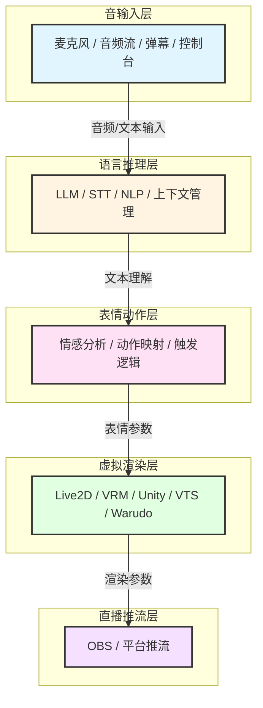
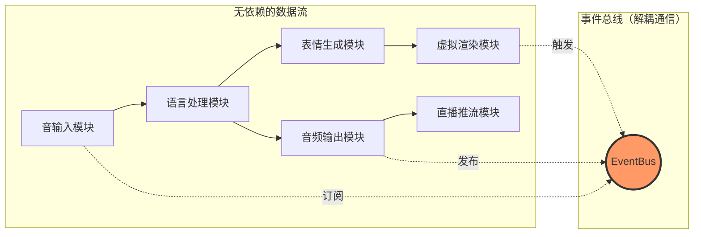
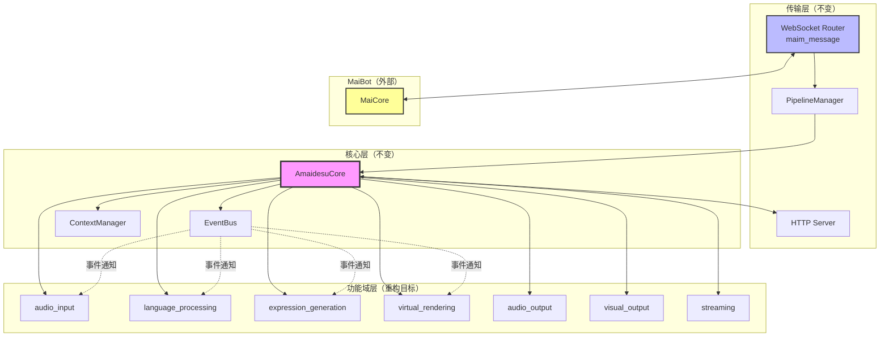
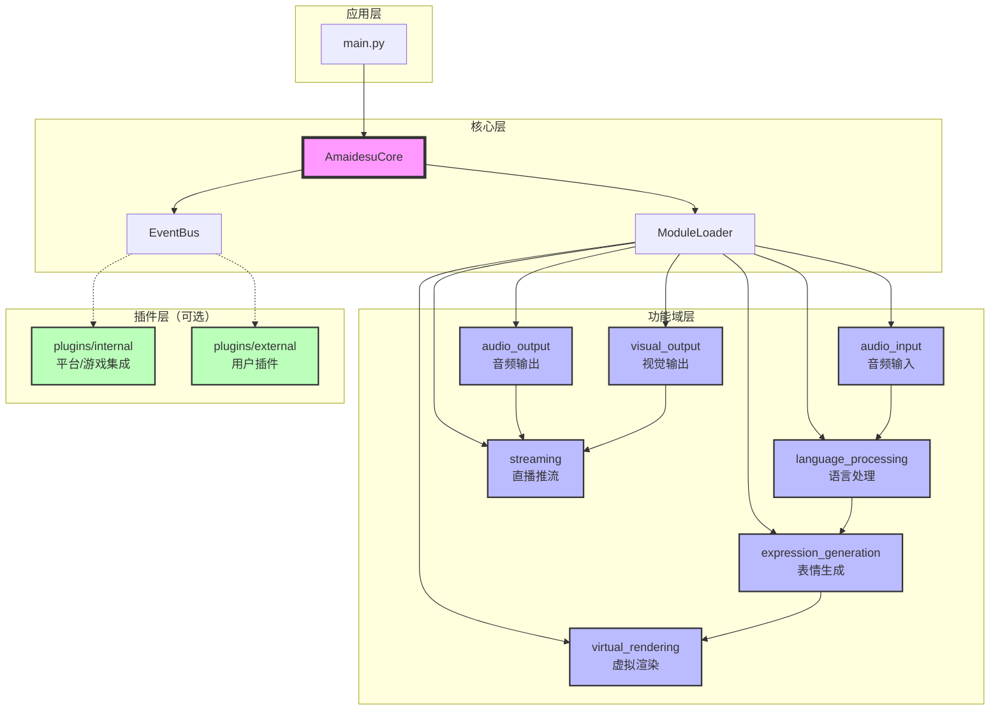
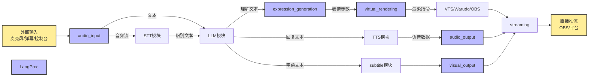

# Amaidesu 架构重构计划：基于AI VTuber功能域的模块化设计

## 📋 执行摘要

本计划旨在通过**按AI VTuber功能域重新组织架构**，解决当前amaidesu项目存在的"维护难"、"过度插件化"、"配置复杂"等问题。

### 核心改进

1. **按功能域组织模块**：音输入→语言推理→表情动作→虚拟渲染→直播推流
2. **可替换实现机制**：每个模块内部支持多种实现方式
3. **解决依赖地狱**：通过单向数据流和接口通信消除循环依赖
4. **简化配置系统**：分层配置，降低认知负担
5. **重新定位插件系统**：仅用于平台/游戏集成，核心功能模块化

### 设计原则

- **功能域驱动**：按AI VTuber工作流程组织，而非技术模式
- **单向数据流**：模块间按业务流程单向通信，无循环依赖
- **接口统一**：同类功能收敛到一个接口，实现可替换
- **渐进式迁移**：向后兼容，平滑过渡
- **实用主义**：保留有价值的插件，移除冗余

---

## 🎯 问题验证（基于代码分析）

### 当前架构的核心问题

#### 1. "自我折磨"的配置切换
**现状**：TTS功能有3个独立插件，通过配置切换
```
src/plugins/tts/           # Edge TTS
src/plugins/gptsovits_tts/ # GPT-SoVITS
src/plugins/omni_tts/      # Omni TTS
```

**问题**：
- 代码冗余，三个插件重复依赖相同服务
- 切换实现需要修改`[plugins] enabled = [...]`列表
- 配置分散在多个地方

#### 2. "伪插件"问题
**现状**：console_input、keyword_action实际无法禁用
**问题**：不符合"插件=可拔插"的语义

#### 3. 功能分类不清
**现状**：20+个插件混在一起，新开发者难以理解
**问题**：缺乏清晰的功能域划分

#### 4. 插件系统定位模糊
**现状**：核心功能、可选扩展、测试工具都作为插件
**问题**：插件系统承载了过多职责

#### 5. 依赖地狱（核心问题）
**现状**：24个插件中有18个使用服务注册，插件间互相依赖
```python
# 依赖链示例
vts_control_service = self.core.get_service("vts_control")
cleanup_service = self.core.get_service("text_cleanup")
subtitle_service = self.core.get_service("subtitle_service")
```
**问题**：
- 启动顺序依赖（必须先启动被依赖的服务）
- "插件排列组合"调试困难（tc_魔法士的诟病）
- 配置错误导致启动失败
- 难以单独测试插件

---

## 🏗️ 新架构设计：基于AI VTuber功能域

### 核心理念

**不按技术模式（"策略"、"工厂"）组织目录，而是按AI VTuber的工作流程组织模块。**

每个模块内部如果有多种实现方式，使用策略模式等技术手段，但这不体现在目录命名上。

### AI VTuber五层架构



### 目录结构设计

```
amaidesu/
├── src/
│   ├── core/                              # 核心基础设施
│   │   ├── amaidesu_core.py               # 中央枢纽
│   │   ├── event_bus.py                   # 事件系统
│   │   ├── pipeline_manager.py            # 管道系统
│   │   ├── context_manager.py             # 上下文管理
│   │   └── module_loader.py               # 【新增】模块加载器
│   │
│   ├── audio_input/                       # 【功能域】音频输入
│   │   ├── __init__.py
│   │   ├── base_microphone.py             # 麦克风输入接口
│   │   ├── implementations/               # 实现目录（不体现在API）
│   │   │   ├── default_microphone.py
│   │   │   ├── stream_audio.py
│   │   │   └── device_manager.py
│   │   └── text_input/                    # 文本输入也归于此域
│   │       ├── console_input.py           # 控制台输入
│   │       └── danmaku_receiver.py        # 弹幕接收
│   │
│   ├── language_processing/               # 【功能域】语言处理
│   │   ├── __init__.py
│   │   ├── base_stt.py                    # 语音识别接口
│   │   ├── base_llm.py                    # LLM接口
│   │   ├── implementations/
│   │   │   ├── edge_stt.py
│   │   │   ├── funasr_stt.py
│   │   │   └── openai_llm.py
│   │   └── context_manager.py             # 上下文管理
│   │
│   ├── expression_generation/             # 【功能域】表情生成
│   │   ├── __init__.py
│   │   ├── emotion_analyzer.py            # 情感分析
│   │   ├── action_mapper.py               # 动作映射
│   │   └── trigger_engine.py              # 触发引擎
│   │
│   ├── virtual_rendering/                 # 【功能域】虚拟渲染
│   │   ├── __init__.py
│   │   ├── base_renderer.py              # 渲染器接口
│   │   ├── implementations/
│   │   │   ├── vts_renderer.py            # VTS适配器
│   │   │   ├── warudo_renderer.py         # Warudo适配器
│   │   │   ├── obs_renderer.py            # OBS适配器
│   │   │   └── vrc_renderer.py            # VRChat适配器
│   │   └── avatar_manager.py              # 虚拟形象管理器
│   │
│   ├── audio_output/                      # 【功能域】音频输出
│   │   ├── __init__.py
│   │   ├── base_tts.py                    # TTS接口
│   │   ├── implementations/
│   │   │   ├── edge_tts.py
│   │   │   ├── gptsovits_tts.py
│   │   │   └── omni_tts.py
│   │   └── playback_manager.py            # 播放管理
│   │
│   ├── visual_output/                     # 【功能域】视觉输出
│   │   ├── __init__.py
│   │   ├── subtitle_renderer.py           # 字幕渲染
│   │   └── sticker_renderer.py            # 贴纸渲染
│   │
│   └── streaming/                         # 【功能域】直播推流
│       ├── __init__.py
│       ├── obs_streamer.py                # OBS推流
│       └── platform_streamer.py           # 平台推流
│
├── plugins/                              # 【保留】插件系统（重新定位）
│   ├── internal/                          # 内置插件
│   │   ├── game_integration/              # 游戏集成
│   │   │   ├── mainosaba/                 # 魔裁游戏
│   │   │   ├── arknights/                 # 明日方舟
│   │   │   └── minecraft/                 # 我的世界
│   │   ├── platform_integration/          # 平台集成
│   │   │   ├── bili_danmaku/              # B站弹幕
│   │   │   └── dg_lab_service/            # DG-LAB服务
│   │   └── tools/                         # 工具插件
│   │       ├── screen_monitor.py          # 屏幕监控
│   │       └── message_replayer.py        # 消息重放
│   │
│   └── external/                          # 外部插件（用户自写）
│       ├── .gitkeep
│       └── README.md
│
├── config-template.toml
└── main.py
```

### 架构设计要点

1. **功能域作为顶级组织**：audio_input, language_processing等按业务功能命名
2. **实现细节隐藏**：每个功能域下的`implementations/`目录存放具体实现
3. **接口统一**：每个功能域定义清晰的接口（base_xxx.py）
4. **单向数据流**：模块间按业务流程单向通信，消除循环依赖

---

## 🔄 依赖地狱问题解决方案

### 当前依赖问题分析

基于代码分析，当前项目存在严重的依赖问题：

#### 问题1：服务注册导致的强耦合

```python
# 当前代码中的依赖链
TTSPlugin:
    - 依赖 text_cleanup_service
    - 依赖 subtitle_service
    - 依赖 vts_lip_sync_service

VTSPlugin:
    - 注册 vts_control_service
    - 注册 vts_lip_sync_service

SubtitlePlugin:
    - 依赖 tts_service（获取音频时长）
```

**问题**：
- 启动顺序必须满足：VTS → TTS → Subtitle
- 如果禁用某个中间插件，整个依赖链断裂
- 新增插件时难以理解复杂的依赖关系

#### 问题2：双向依赖

```python
# Avatar系统依赖TTS
AvatarControlManager:
    - 调用TTS获取语音时长
    - 触发口型同步

# TTS依赖Avatar系统
TTSPlugin:
    - 通知Avatar更新表情
    - 注册vts_lip_sync_service
```

**问题**：循环依赖导致模块难以独立测试和复用

### 解决方案架构

#### 核心思路：单向数据流 + 事件驱动



#### 方案1：功能域间单向依赖

**原则**：按AI VTuber业务流程组织，上游不依赖下游

| 功能域 | 依赖 | 被依赖 |
|--------|------|--------|
| audio_input | 无 | language_processing |
| language_processing | audio_input | expression_generation, audio_output |
| expression_generation | language_processing | virtual_rendering |
| virtual_rendering | expression_generation | streaming |
| audio_output | language_processing | streaming |
| visual_output | language_processing | streaming |
| streaming | 所有输出模块 | 无 |

**实现**：
```python
# 正确的依赖关系
class LanguageProcessing:
    def __init__(self, audio_input: AudioInput):
        # ✓ 上游依赖下游（正常）
        self.audio_source = audio_input

class ExpressionGeneration:
    def __init__(self, llm_client: LLMClient):
        # ✓ 只依赖语言处理的接口
        self.llm = llm_client

# 错误的依赖关系（禁止）
class AudioOutput:
    def __init__(self, virtual_rendering: VirtualRendering):
        # ✗ 下游依赖上游（禁止！）
        # 解决方案：使用事件系统
```

#### 方案2：事件系统解耦

**适用场景**：需要反向通信或跨模块通知

```python
# 场景：TTS播放完成通知Avatar更新口型

# ❌ 错误做法：直接依赖（当前代码）
class TTSPlugin:
    def __init__(self, core):
        # 直接获取Avatar服务，形成依赖
        self.avatar = core.get_service("vts_lip_sync")

    async def play_audio(self, text):
        audio = await self.synthesize(text)
        await self.avatar.sync_lip_sync(audio)  # 强耦合

# ✓ 正确做法：事件驱动
class TTSModule:
    def __init__(self, core):
        # 只依赖事件总线，不依赖Avatar模块
        self.event_bus = core.event_bus

    async def play_audio(self, text):
        audio = await self.synthesize(text)
        # 发布事件，谁关心谁订阅
        await self.event_bus.emit("audio.playback_started", {
            "text": text,
            "duration": audio.duration
        })

# Avatar模块订阅事件
class VirtualRenderingModule:
    async def setup(self):
        self.event_bus.subscribe("audio.playback_started", self.on_audio_playback)

    async def on_audio_playback(self, data):
        # 处理口型同步
        await self.sync_lip_sync(data["text"])
```

#### 方案3：工厂模式管理实现

**问题**：切换实现时需要修改多处代码

```python
# 当前代码：手动管理依赖
class TTSPlugin:
    def __init__(self, core):
        # 可能失败的服务获取
        self.cleanup = core.get_service("subtitle_service")
        if not self.cleanup:
            raise RuntimeError("subtitle_service未启动")

# 新方案：工厂模式
class TTSStrategyFactory:
    _implementations = {
        "edge": EdgeTTSStrategy,
        "gptsovits": GPTSoVITSStrategy,
    }

    @classmethod
    def create(cls, strategy_name: str, config: dict):
        strategy_class = cls._implementations[strategy_name]
        return strategy_class(config)

# 使用
tts = TTSStrategyFactory.create("edge", config)
# 无需手动管理依赖，策略内部自己处理
```

### 依赖消除效果对比

| 场景 | 当前架构 | 新架构 |
|------|---------|--------|
| **启动顺序** | 需要按依赖顺序启动插件 | 任意顺序，模块按需加载 |
| **禁用功能** | 可能导致依赖链断裂 | 不影响其他模块 |
| **新增实现** | 需要修改多个插件的依赖代码 | 仅需注册到工厂 |
| **测试** | 需要mock所有依赖服务 | 可独立测试 |
| **配置切换** | 修改enabled列表，重启生效 | 修改配置，即时切换 |

### 具体依赖消除案例

#### 案例1：TTS与Avatar的依赖

**当前代码**：
```python
# TTS依赖Avatar
TTSPlugin → get_service("vts_lip_sync")

# Avatar也依赖TTS（获取时长）
VTSPlugin → get_service("subtitle_service") → get_service("tts")
```

**新架构**：
```python
# TTS模块（独立）
audio_output/
    ├── base_tts.py              # 只负责合成
    └── implementations/
        └── edge_tts.py

# Avatar模块（独立）
virtual_rendering/
    └── implementations/
        └── vts_renderer.py

# 通过事件通信
EventBus:
    - audio.playback_started (TTS发布)
    - audio.playback_finished (TTS发布)
    - 参数更新 (Avatar订阅audio事件)
```

#### 案例2：多个TTS实现的统一

**当前代码**：
```python
# 三个独立插件，每个都要配置依赖关系
plugins/tts/config.toml:
    [dependencies]
    required = ["text_cleanup", "subtitle"]

plugins/gptsovits_tts/config.toml:
    [dependencies]
    required = ["text_cleanup", "subtitle"]

plugins/omni_tts/config.toml:
    [dependencies]
    required = ["text_cleanup", "subtitle"]
```

**新架构**：
```python
# 一个TTS模块，多个实现
audio_output/
    ├── base_tts.py               # 统一接口
    └── implementations/
        ├── edge_tts.py          # 独立实现
        ├── gptsovits_tts.py      # 独立实现
        └── omni_tts.py          # 独立实现

# 配置
[audio_output.tts]
provider = "edge"  # 切换实现只需改这里

# 依赖关系由工厂管理，无需手动配置
```

### 依赖管理最佳实践

#### 1. 明确依赖方向

```python
# ✓ 允许的依赖
class ExpressionGeneration:
    def __init__(self, llm_client: LLMClient):
        # 上游依赖下游接口
        pass

# ✗ 禁止的依赖
class LLMClient:
    def __init__(self, expression_gen: ExpressionGeneration):
        # 下游依赖上游（循环依赖）
        pass
```

#### 2. 使用接口而非实现

```python
# ✓ 依赖接口
class ExpressionGeneration:
    def __init__(self, llm: LanguageModelInterface):  # 接口
        pass

# ✗ 依赖具体实现
class ExpressionGeneration:
    def __init__(self, llm: OpenAILLM):  # 具体实现
        pass
```

#### 3. 事件系统处理反向通信

```python
# 需要反向通信时，使用事件
class TTSModule:
    async def on_playback_start(self, audio_data):
        # 发布事件
        await self.event_bus.emit("tts.playback", {
            "duration": audio_data.duration
        })

class VirtualRenderingModule:
    def setup(self):
        # 订阅事件
        self.event_bus.subscribe("tts.playback", self.on_tts_playback)

    async def on_tts_playback(self, data):
        # 处理口型同步
        await self.sync_lip_sync(data["duration"])
```

---

## 🔌 插件系统重新定位

### 当前插件使用情况

基于代码分析，24个插件的分类：

| 插件类型 | 数量 | 举例 |
|---------|------|------|
| **核心功能** | 6个 | tts, vtube_studio, llm_text_processor |
| **可替换实现** | 4个 | gptsovits_tts, omni_tts, funasr_stt |
| **平台集成** | 5个 | bili_danmaku, obs_control, vrchat |
| **游戏集成** | 3个 | mainosaba, arknights, minecraft |
| **工具类** | 3个 | screen_monitor, subtitle, sticker |
| **测试类** | 1个 | mock_danmaku |
| **待确认** | 2个 | read_pingmu, emotion_judge |

### 保留插件系统的理由

#### ✅ 支持保留

1. **社区生态**：
   - 用户可以贡献特定平台的集成（如新的直播平台）
   - 第三方服务集成（如新的AI服务）

2. **定制需求**：
   - 不同用户有不同的游戏/平台集成需求
   - 实验性功能可以先作为扩展测试

3. **向后兼容**：
   - 现有的插件开发者和用户不需要完全重写
   - 渐进式迁移更平滑

#### ❌ 反对保留

1. **维护负担**：
   - 需要维护插件加载器、API、文档
   - 插件兼容性问题

2. **使用率不高**：
   - 社区贡献的插件可能较少
   - 大部分用户只用核心功能

3. **增加复杂度**：
   - 新开发者需要理解模块系统+扩展系统
   - 配置更复杂

### 💡 建议方案：精简的扩展系统

**不保留完整的插件系统，而是提供一个轻量级的扩展机制。**

#### 设计思路

```python
# 扩展系统极简设计
class ExtensionLoader:
    """轻量级扩展加载器"""

    async def load_extension(self, extension_path: str):
        """加载扩展（只提供基础钩子）"""
        # 1. 加载Python模块
        # 2. 调用setup(core)注册钩子
        # 3. 不提供复杂的服务注册/事件系统
```

#### 扩展能力限制

**扩展只能做以下事情**：
- 订阅事件（event_bus）
- 注册HTTP回调路由
- 注册命令处理器
- 访问有限的公开API

**扩展不能做**：
- 修改核心模块的行为
- 直接访问模块内部实现
- 注册复杂的依赖关系

#### 与模块的区别

| 维度 | 模块 | 扩展 |
|------|------|------|
| **位置** | `src/{功能域}/` | `extensions/` |
| **用途** | 核心功能，系统必需 | 可选功能，平台集成 |
| **API访问** | 完整访问内部API | 仅访问公开API |
| **配置** | `config.toml`中显式配置 | 自动发现或手动启用 |
| **示例** | audio_input, language_processing | bili_danmaku, game_integration |

### 最终建议

**保留精简的扩展系统，但明确其定位：**

1. **核心功能全部模块化**：
   - audio_input（麦克风、流音频）
   - language_processing（STT、LLM）
   - expression_generation（情感分析、动作映射）
   - virtual_rendering（VTS、Warudo、OBS）
   - audio_output（TTS）
   - visual_output（字幕、贴纸）

2. **扩展系统仅用于**：
   - 平台集成（B站、抖音等直播平台）
   - 游戏集成（特定的游戏助手）
   - 第三方服务（DG-LAB等）
   - 用户自定义工具

3. **废弃的插件**：
   - mock_danmaku（测试工具，应该放在tests/）
   - 功能重复的实现（整合到模块的implementations/中）

---

## 🔧 插件系统改进

### 精简的插件API

**插件能力限制**（防止依赖地狱）：

```python
# ✓ 插件可以做的事
class DanmakuPlugin(BasePlugin):
    def setup(self, core):
        # 1. 订阅事件
        core.event_bus.subscribe("message.received", self.on_message)

        # 2. 注册HTTP路由
        core.http_server.register_route("/danmaku/callback", self.callback)

        3. 访问公开API
        core.api.tts.synthesize(text)  # 通过统一接口

# ✗ 插件不能做的事
class DanmakuPlugin(BasePlugin):
    def setup(self, core):
        # 不能直接获取服务（防止依赖）
        # core.get_service("vts_control")  # ❌

        # 不能修改核心模块
        # core.module_loader.unload_module("audio_input")  # ❌
```

### 插件配置

```toml
[plugins]
# 内置插件
enabled_internal = [
    "bili_danmaku",
    "mainosaba",
]

# 外部插件
enabled_external = [
    # "my_custom_plugin",
]

# 插件特定配置
[plugins.bili_danmaku]
room_id = 0
```

---

## 📦 功能域设计详解

### 功能域覆盖度验证

经过对所有24个插件的完整分析，**7个功能域完全覆盖AI VTuber核心工作流程**：

| 功能域 | 核心职责 | 对应的现有插件 | 覆盖度 |
|--------|---------|---------------|--------|
| **audio_input** | 音频/文本输入 | console_input | ✅ 完整 |
| **language_processing** | 语音识别、LLM处理 | stt, funasr_stt, llm_text_processor | ✅ 完整 |
| **expression_generation** | 情感分析、动作触发 | keyword_action, emotion_judge, avatar控制系统 | ✅ 完整 |
| **virtual_rendering** | 虚拟形象驱动 | vtube_studio, warudo, obs_control, vrchat | ✅ 完整 |
| **audio_output** | 语音合成、播放 | tts, gptsovits_tts, omni_tts | ✅ 完整 |
| **visual_output** | 字幕、贴纸渲染 | subtitle, sticker | ✅ 完整 |
| **streaming** | 推流控制 | obs_control（推流部分） | ⚠️ 需扩展 |

#### 特殊功能处理

**保留为插件的功能（不纳入功能域）**：
- **read_pingmu** - 屏幕监控+VL模型分析，特定的视觉输入方式，不是所有用户需要
- **remote_stream** - 边缘设备音视频流，特定的部署场景
- **screen_monitor** - 开发调试工具
- **游戏集成**（mainosaba, arknights, minecraft, maicraft）- 不属于AI VTuber核心流程
- **平台集成**（bili_danmaku系列）- 依赖于特定平台API
- **硬件集成**（dg_lab_service）- 依赖于特定硬件

#### 功能整合案例

**emotion_judge → expression_generation**
- 当前插件功能：LLM情感分析 + 热键触发
- 整合方案：将情感分析能力融入表情生成域的智能触发策略
- 优势：避免功能重复，统一情感处理逻辑

### MaiBot通信机制

**重要结论：MaiBot通信机制完全不变**

功能域重构只影响**业务逻辑层**，不涉及**传输层**：

| 通信组件 | 作用 | 变化 |
|---------|------|------|
| **WebSocket Router** (maim_message) | 与MaiCore的WebSocket连接 | ❌ 无变化 |
| **HTTP Server** | 接收MaiCore的HTTP回调 | ❌ 无变化 |
| **PipelineManager** | 消息预处理（入站/出站管道） | ❌ 无变化 |
| **EventBus** | 模块间事件通信 | ❌ 无变化 |
| **ContextManager** | 上下文聚合管理 | ❌ 无变化 |



**关键点**：
- ✅ MaiBot无感知：通信协议完全相同
- ✅ 管道系统继续工作：消息预处理机制不变
- ✅ 功能域只处理业务逻辑：不涉及传输层
- ✅ 渐进式迁移：可以先重构业务逻辑，传输层保持稳定

---

### 1. 音频输入域 (audio_input)

**职责**：接收外部音频/文本输入

#### 核心接口

```python
# 设计思路：定义接口，具体实现在implementations/中

class AudioInput(ABC):
    @abstractmethod
    async def start_stream(self) -> AsyncIterator[AudioFrame]:
        """开始音频流"""

    @abstractmethod
    async def stop_stream(self):
        """停止音频流"""
```

#### 实现分类

| 实现方式 | 处理建议 |
|---------|---------|
| **麦克风输入** | 模块默认实现 |
| **音频流输入** | 模块默认实现 |
| **控制台输入** | 模块实现（开发测试用） |
| **弹幕输入** | **扩展**（平台相关） |

#### 配置示例

```toml
[audio_input]
# 主输入源
primary_source = "microphone"  # microphone, stream, console

[audio_input.microphone]
device_index = 0
sample_rate = 16000

[audio_input.stream]
url = "http://example.com/audio.stream"
```

---

### 2. 语言处理域 (language_processing)

**职责**：将音频/文本转换为可理解的信息

#### 核心接口

```python
class SpeechRecognizer(ABC):
    @abstractmethod
    async def recognize(self, audio: AudioFrame) -> str:
        """语音转文本"""

class LanguageModel(ABC):
    @abstractmethod
    async def generate(self, prompt: str) -> str:
        """文本生成"""
```

#### 实现分类

| 实现方式 | 处理建议 |
|---------|---------|
| **Edge STT** | 模块实现 |
| **FunASR STT** | 模块实现（可选） |
| **OpenAI LLM** | 模块实现（默认） |
| **本地LLM** | 模块实现（可选） |
| **上下文管理** | 模块核心功能 |

#### 配置示例

```toml
[language_processing.stt]
provider = "edge"  # edge, funasr

[language_processing.llm]
provider = "openai"  # openai, local
model = "gpt-4"

[language_processing.context]
max_history = 10
```

---

### 3. 表情生成域 (expression_generation)

**职责**：理解文本并生成表情/动作参数

#### 核心功能

```python
class ExpressionGenerator:
    async def generate_expression(
        self,
        text: str,
        emotion_context: EmotionHistory
    ) -> ExpressionParameters:
        """生成表情参数"""
```

#### 功能模块

| 模块 | 功能 | 处理建议 |
|------|------|---------|
| **情感分析** | 分析文本情感 | 模块核心（使用LLM） |
| **动作映射** | 将情感映射为参数 | 模块核心 |
| **触发引擎** | 关键词触发动作 | 模块功能 |
| **智能触发策略** | 过滤+时间+LLM判断 | 模块功能 |

#### 配置示例

```toml
[expression_generation]
# 触发策略
trigger_strategy = "intelligent"  # simple, intelligent

[expression_generation.intelligent]
simple_reply_filter = true
time_interval = 5.0
llm_judge = true
```

---

### 4. 虚拟渲染域 (virtual_rendering)

**职责**：驱动虚拟形象渲染

#### 核心接口

```python
class VirtualRenderer(ABC):
    @abstractmethod
    async def connect(self) -> bool:
        """连接到渲染服务"""

    @abstractmethod
    async def set_parameters(self, params: List[Parameter]):
        """设置参数"""

    @abstractmethod
    async def trigger_hotkey(self, hotkey_id: str):
        """触发热键"""
```

#### 实现分类

| 实现方式 | 处理建议 |
|---------|---------|
| **VTube Studio** | 模块实现（主要） |
| **Warudo** | 模块实现（可选） |
| **OBS Studio** | 模块实现（推流场景） |
| **VRChat** | **扩展**（VR特定场景） |

#### 配置示例

```toml
[virtual_rendering]
# 主渲染器
primary_renderer = "vts"  # vts, warudo, obs

[virtual_rendering.vts]
host = "localhost"
port = 8001

# 语义动作映射（跨平台）
[virtual_rendering.expressions.happy]
MouthSmile = 1.0
EyeOpenLeft = 0.9
```

---

### 5. 音频输出域 (audio_output)

**职责**：语音合成和播放

#### 核心接口

```python
class TextToSpeech(ABC):
    @abstractmethod
    async def synthesize(self, text: str) -> AudioData:
        """文本转语音"""

class AudioPlayer:
    async def play(self, audio: AudioData):
        """播放音频"""
```

#### 实现分类

| 实现方式 | 处理建议 |
|---------|---------|
| **Edge TTS** | 模块实现（默认） |
| **GPT-SoVITS** | 模块实现（可选） |
| **Omni TTS** | 模块实现（可选，整合到主TTS） |
| **音频播放** | 模块核心功能 |
| **口型同步** | 模块核心功能 |
| **字幕生成** | 迁移到visual_output |

#### 配置示例

```toml
[audio_output.tts]
provider = "edge"  # edge, gptsovits, omni

[audio_output.tts.edge]
voice = "zh-CN-XiaoxiaoNeural"

[audio_output.playback]
device = "default"
lip_sync = true
```

---

### 6. 视觉输出域 (visual_output)

**职责**：字幕、贴纸等视觉元素渲染

#### 核心功能

```python
class SubtitleRenderer:
    async def show_subtitle(self, text: str, duration: float):
        """显示字幕"""

class StickerRenderer:
    async def show_sticker(self, image: ImageData, position: Position):
        """显示贴纸"""
```

#### 实现分类

| 功能 | 处理建议 |
|------|---------|
| **字幕渲染** | 模块实现（支持多引擎） |
| **贴纸渲染** | 模块实现（支持多引擎） |
| **渲染引擎** | PyQt / Pygame / 浏览器 |

#### 配置示例

```toml
[visual_output.subtitle]
enabled = true
renderer = "pyqt"  # pyqt, pygame, browser

[visual_output.sticker]
enabled = false
renderer = "pyqt"
```

---

### 7. 直播推流域 (streaming)

**职责**：推流到直播平台

#### 核心功能

```python
class Streamer(ABC):
    @abstractmethod
    async def start_stream(self, platform: str):
        """开始推流"""

    @abstractmethod
    async def stop_stream(self):
        """停止推流"""
```

#### 实现分类

| 实现方式 | 处理建议 |
|---------|---------|
| **OBS推流** | 模块实现（通过WebSocket控制） |
| **平台推流** | **扩展**（平台相关） |

---

## 📝 配置系统设计

### 配置文件层次

```toml
# config-template.toml

# === 1. 全局配置 ===
[general]
platform_id = "amaidesu_default"

# === 2. 功能域配置 ===
[audio_input]
primary_source = "microphone"

[language_processing]
stt_provider = "edge"
llm_provider = "openai"

[expression_generation]
trigger_strategy = "intelligent"

[virtual_rendering]
primary_renderer = "vts"

[audio_output]
tts_provider = "edge"

[visual_output]
subtitle_enabled = true

# === 3. 功能域内实现配置 ===
[audio_input.microphone]
device_index = 0

[language_processing.llm.openai]
model = "gpt-4"

[virtual_rendering.vts]
host = "localhost"
port = 8001

[audio_output.tts.edge]
voice = "zh-CN-XiaoxiaoNeural"

# === 4. 插件配置 ===
[plugins]
enabled_internal = ["bili_danmaku", "mainosaba"]
enabled_external = []

[plugins.bili_danmaku]
room_id = 0
```

### 配置优先级

1. **功能域配置** > 默认配置
2. **实现配置** > 功能域配置
3. **插件配置**独立管理

---

## 🚀 迁移路径

### 第一阶段：功能域基础设施（1-2周）

**目标**：建立新的目录结构和核心基础设施

#### 任务

1. 创建功能域目录结构
2. 实现模块加载器（替代/改进插件管理器）
3. 定义各功能域的核心接口
4. 更新配置系统
5. 编写迁移文档

#### 验证标准

- ✅ 新目录结构创建完成
- ✅ 模块加载器可以加载模块
- ✅ 配置系统支持新格式
- ✅ 向后兼容（现有系统仍可运行）

---

### 第二阶段：核心功能迁移（3-4周）

**目标**：迁移核心功能到功能域模块

#### 任务

1. **音频输入域**
   - 迁移console_input → audio_input/text_input/
   - 迁移microphone输入（如果存在）

2. **语言处理域**
   - 迁移STT功能 → language_processing/implementations/
   - 整合LLM客户端

3. **音频输出域**
   - 迁移TTS → audio_output/implementations/
   - 整合3个TTS实现为一个模块

4. **虚拟渲染域**
   - 迁移VTS适配器 → virtual_rendering/implementations/
   - 保留AvatarControlManager

#### 验证标准

- ✅ 迁移的功能正常运行
- ✅ 配置更简洁（一个[tts]块替代多个插件配置）
- ✅ 性能无明显下降

---

### 第三阶段：表情生成与输出（2-3周）

**目标**：完善表情生成和视觉输出

#### 任务

1. **表情生成域**
   - 创建expression_generation模块
   - 迁移情感分析逻辑
   - 实现智能触发策略

2. **视觉输出域**
   - 迁移subtitle → visual_output/
   - 迁移sticker → visual_output/

#### 验证标准

- ✅ 表情生成功能正常
- ✅ 字幕、贴纸渲染正常

---

### 第四阶段：插件系统重构（1-2周）

**目标**：重构插件系统，明确新定位

#### 任务

1. **简化插件API**
   - 移除服务注册机制（防止依赖地狱）
   - 仅保留事件订阅和HTTP路由注册

2. **迁移核心功能到模块**
   - 按插件处理清单迁移
   - 更新配置文件

3. **迁移平台/游戏集成到插件**
   - bili_danmaku → plugins/internal/
   - 游戏集成 → plugins/internal/game_integration/

4. **移除废弃插件**
   - mock_danmaku
   - 重复的实现

5. **更新插件开发文档**

#### 验证标准

- ✅ 插件系统加载正常
- ✅ 核心功能迁移完成
- ✅ 插件间无循环依赖
- ✅ 插件开发文档完整

---

### 第五阶段：清理与优化（1周）

**目标**：清理代码，优化性能，完善文档

#### 任务

1. 清理旧代码和注释
2. 优化性能瓶颈
3. 完善架构文档
4. 更新README和CLAUDE.md
5. 编写迁移指南

#### 验证标准

- ✅ 代码质量提升
- ✅ 文档完整
- ✅ 用户反馈正面

---

## 📊 架构对比

### 当前架构 vs 新架构

| 维度 | 当前架构 | 新架构 |
|------|---------|--------|
| **组织方式** | 按技术模式（插件） | 按功能域（业务流程） |
| **TTS配置** | 3个独立插件，分散配置 | 1个模块，统一配置 |
| **核心功能** | 混在插件中 | 独立的模块，清晰 |
| **扩展机制** | 完整的插件系统（24个） | 精简的插件系统（约8个） |
| **配置复杂度** | 高（20+插件） | 低（7个功能域+8个插件） |
| **新开发者友好度** | 低（需要理解插件系统） | 高（按业务流程组织） |

### 插件处理清单（完整版24个）

#### 核心功能迁移到模块（13个）

| 插件 | 功能说明 | 处理方式 | 新位置 |
|------|---------|---------|--------|
| console_input | 控制台输入 | 迁移到模块 | audio_input/text_input/ |
| keyword_action | 关键词动作触发 | 迁移到模块 | expression_generation/ |
| emotion_judge | 情感判断与热键触发 | 整合到模块 | expression_generation/ |
| tts | Edge TTS语音合成 | 整合到模块 | audio_output/implementations/ |
| gptsovits_tts | GPT-SoVITS语音合成 | 整合为实现 | audio_output/implementations/ |
| omni_tts | Omni TTS语音合成 | 整合为实现 | audio_output/implementations/ |
| vtube_studio | VTube Studio控制 | 迁移到模块 | virtual_rendering/implementations/ |
| warudo | Warudo控制 | 迁移到模块 | virtual_rendering/implementations/ |
| obs_control | OBS Studio控制 | 迁移到模块 | virtual_rendering/implementations/ |
| vrchat | VRChat控制 | 迁移到模块 | virtual_rendering/implementations/ |
| stt | Edge STT语音识别 | 迁移到模块 | language_processing/implementations/ |
| funasr_stt | FunASR语音识别 | 整合为实现 | language_processing/implementations/ |
| llm_text_processor | LLM文本处理 | 迁移到模块 | language_processing/ |
| subtitle | 字幕渲染 | 迁移到模块 | visual_output/ |
| sticker | 贴纸渲染 | 迁移到模块 | visual_output/ |

#### 保留为插件（8个）

| 插件 | 功能说明 | 保留理由 | 新位置 |
|------|---------|---------|--------|
| bili_danmaku | B站弹幕输入（Selenium版） | 平台特定集成 | plugins/internal/platform_integration/ |
| bili_danmaku_official | B站官方弹幕输入 | 平台特定集成 | plugins/internal/platform_integration/ |
| bili_danmaku_official_maicraft | B站弹幕-MaiCraft版 | 平台特定集成 | plugins/internal/platform_integration/ |
| mainosaba | 魔裁游戏集成 | 游戏集成 | plugins/internal/game_integration/ |
| arknights | 明日方舟游戏集成 | 游戏集成 | plugins/internal/game_integration/ |
| minecraft | 我的世界游戏集成 | 游戏集成 | plugins/internal/game_integration/ |
| maicraft | MaiCraft弹幕互动游戏 | 游戏集成（工厂模式） | plugins/internal/game_integration/ |
| read_pingmu | 屏幕监控与VL分析 | 特定输入方式 | plugins/internal/tools/ |
| screen_monitor | 屏幕监控 | 调试工具 | plugins/internal/tools/ |
| remote_stream | 边缘设备音视频流 | 特定部署场景 | plugins/internal/tools/ |
| dg_lab_service | DG-Lab硬件控制 | 硬件集成 | plugins/internal/ |

#### 废弃（1个）

| 插件 | 废弃理由 |
|------|---------|
| mock_danmaku | 测试工具，应移至tests/ |

#### 特殊说明

**emotion_judge插件整合理由**：
- 当前功能：根据LLM回复判断情感并触发热键
- 与expression_generation域的功能重复：表情生成域已包含情感分析和触发逻辑
- 整合方案：将emotion_judge的LLM情感分析能力整合到表情生成域的智能触发策略中

**maicraft插件保留理由**：
- 已采用良好的抽象工厂模式设计
- 是游戏集成的典型示例
- 不属于AI VTuber核心工作流，符合插件定位

---

## ✅ 成功标准

### 技术指标

- ✅ 所有现有功能正常运行
- ✅ 配置文件行数减少40%以上
- ✅ 核心功能响应时间无增加
- ✅ 代码重复率降低30%以上

### 用户体验指标

- ✅ 新开发者能在30分钟内理解架构
- ✅ 配置错误能给出清晰的提示
- ✅ 文档覆盖率达到95%以上
- ✅ 社区反馈正面

### 架构指标

- ✅ 清晰的七层功能域架构
- ✅ 模块间依赖关系清晰
- ✅ 扩展系统精简但足够灵活
- ✅ 易于添加新功能域

---

## 🎯 与讨论期望的对照

### 用户核心问题确认

**问题1：现在的功能域足够了吗？覆盖全面了吗？**

✅ **回答：是的，7个功能域完全覆盖AI VTuber核心工作流程**

验证依据：
- 完整分析24个现有插件
- 所有核心功能都有对应的功能域：
  - 音频/文本输入 → audio_input
  - 语音识别/LLM处理 → language_processing
  - 情感分析/动作触发 → expression_generation
  - 虚拟形象驱动 → virtual_rendering
  - 语音合成/播放 → audio_output
  - 字幕/贴纸渲染 → visual_output
  - 推流控制 → streaming
- 特殊功能（屏幕监控、边缘计算、游戏集成）保留为插件
- 功能整合：emotion_judge整合到expression_generation

**问题2：关于和MaiBot的通信有变化吗？**

❌ **回答：完全无变化**

架构分层：
- **传输层（不变）**：WebSocket Router、HTTP Server、PipelineManager
- **核心层（不变）**：AmaidesuCore、EventBus、ContextManager
- **功能域层（重构目标）**：7个功能域模块

关键保证：
- ✅ MaiBot无感知：通信协议完全相同
- ✅ 管道系统继续工作：消息预处理机制不变
- ✅ 功能域只处理业务逻辑：不涉及传输层
- ✅ 渐进式迁移：可以先重构业务逻辑，传输层保持稳定

---

### 第一份讨论期望

| 期望 | 实现方式 |
|------|---------|
| **"所有用户必需的功能应该叫module而非plugin" - 墨梓柒** | ✅ 核心功能全部模块化，按功能域组织 |
| **"主要矛盾是稳定性而非能否分离" - 千石可乐** | ✅ 功能域接口稳定，单向数据流保证稳定性 |
| **"架构很cool，使用很狗屎" - tc_魔法士** | ✅ 按业务流程组织，更直观易用 |
| **"插件排列组合困难"** | ✅ 模块间无循环依赖，插件仅通过事件通信 |
| **"保留插件系统用于真正扩展"** | ✅ 插件系统仅用于平台/游戏集成 |

### 第二份讨论期望

| 期望 | 实现方式 |
|------|---------|
| **"五层架构：音输入→语言推理→表情动作→虚拟渲染→直播推流" - 麦麦** | ✅ 按此流程组织功能域（实际7层，增加音输出和视输出） |
| **"同一功能收敛到一个统一接口，用策略模式或工厂动态选实现"** | ✅ 每个功能域定义接口，实现在implementations/中 |
| **"驱动层只输出参数，渲染层只管画图"** | ✅ expression_generation输出参数，virtual_rendering负责渲染 |
| **"插件留着做边缘扩展"** | ✅ 插件系统仅用于平台/游戏集成 |

---

## 📚 附录

### A. 术语表

| 术语 | 定义 |
|------|------|
| **功能域** | 按AI VTuber业务流程划分的功能模块，如audio_input, virtual_rendering |
| **模块** | 核心功能的实现，位于src/{功能域}/下 |
| **实现** | 功能域内的具体实现方式，位于implementations/目录 |
| **插件** | 可选的平台/游戏集成，位于plugins/目录 |
| **接口** | 功能域定义的抽象方法，规范实现的行为 |

### B. Mermaid架构图



### C. 功能域数据流图



---

**文档版本**：v2.0
**最后更新**：2025-01-15
**状态**：设计阶段，待评审
