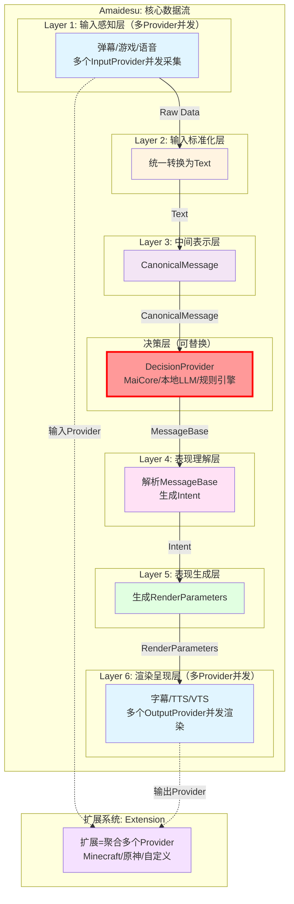

# Amaidesu 架构重构文档索引

> **版本**: v2.0
> **日期**: 2026-01-17
> **状态**: 设计阶段

---

## 📋 快速导航

### 我想了解...

**整体架构是什么？**
→ [设计总览](./design/overview.md)

**6层架构如何工作？**
→ [6层架构设计](./design/layer_refactoring.md)

**决策层如何可替换？**
→ [决策层设计](./design/decision_layer.md)

**多个Provider如何并发？**
→ [多Provider并发设计](./design/multi_provider.md)

**如何开发插件？**
→ [插件系统设计](./design/plugin_system.md)

**AmaidesuCore如何重构？**
→ [核心重构设计](./design/core_refactoring.md)

**如何实施重构？**
→ [实施计划总览](./plan/overview.md)

---

## 📁 文档结构

```
refactor/
├── README.md                       # 本文件 - 文档索引
├── design/                         # 设计文档
│   ├── overview.md                  # 架构总览
│   ├── layer_refactoring.md         # 6层架构设计
│   ├── decision_layer.md           # 决策层设计
│   ├── multi_provider.md           # 多Provider并发设计
│   ├── plugin_system.md            # 插件系统设计
│   └── core_refactoring.md          # AmaidesuCore重构设计
│
└── plan/                            # 实施计划
    ├── overview.md                  # 实施计划总览
    ├── phase1_infrastructure.md    # Phase 1: 基础设施
    ├── phase2_input.md             # Phase 2: 输入层
    ├── phase3_decision.md          # Phase 3: 决策层+Layer 3-4
    ├── phase4_output.md            # Phase 4: 输出层
    ├── phase5_extensions.md         # Phase 5: 扩展系统
    └── phase6_cleanup.md           # Phase 6: 清理和测试
```

---

## 🎯 重构核心要点

### 1. 6层核心数据流

```
Layer 1: 输入感知（多Provider并发）
    ↓
Layer 2: 输入标准化（统一转换为Text）
    ↓
Layer 3: 中间表示（CanonicalMessage）
    ↓
决策层（可替换DecisionProvider）
    ↓
Layer 4: 表现理解（解析MessageBase → Intent）
    ↓
Layer 5: 表现生成（生成RenderParameters）
    ↓
Layer 6: 渲染呈现（多Provider并发）
```

### 2. 决策层可替换

- ✅ **MaiCoreDecisionProvider**：默认实现，使用maim_message WebSocket
- ✅ **LocalLLMDecisionProvider**：可选实现，使用本地LLM API
- ✅ **RuleEngineDecisionProvider**：可选实现，本地规则引擎
- ✅ 支持运行时切换DecisionProvider

### 3. 多Provider并发

**输入层（Layer 1）**：
```
弹幕InputProvider ──┐
                    ├──→ 都生成RawData
游戏InputProvider ──┤
                    │
语音InputProvider ──┘
```

**输出层（Layer 6）**：
```
RenderParameters ──┐
                  ├──→ 分别渲染到不同目标
字幕Renderer ─────┤  (字幕窗口、TTS音频、虚拟形象）
                  │
TTSRenderer ───────┤
                  │
VTSRenderer ───────┘
```

### 4. AmaidesuCore彻底解耦

**删除职责**（约500行代码）：
- ❌ WebSocket连接管理
- ❌ HTTP服务器管理
- ❌ maim_message.Router相关
- ❌ send_to_maicore()方法
- ❌ _handle_maicore_message()方法

**保留职责**（约300行代码）：
- ✅ EventBus管理
- ✅ Pipeline管理
- ✅ Context管理
- ✅ Avatar管理器
- ✅ LLM客户端管理

**新增职责**（约50行代码）：
- ✅ DecisionManager集成

---

## 🗺️ 数据流图



---

## ✅ 关键设计特性

### 1. 决策层可替换

**配置示例**：
```toml
[decision]
default_provider = "maicore"  # 可切换为 local_llm 或 rule_engine

[decision.providers.maicore]
host = "localhost"
port = 8000

[decision.providers.local_llm]
model = "gpt-4"
api_key = "your_key"
```

### 2. 多Provider并发

**输入层配置**：
```toml
[perception]
inputs = ["danmaku", "game", "voice"]

[perception.inputs.danmaku]
type = "bilibili_danmaku"
room_id = "123456"

[perception.inputs.game]
type = "minecraft"
host = "localhost"
port = 25565

[perception.inputs.voice]
type = "microphone"
device_index = 0
```

**输出层配置**：
```toml
[rendering]
outputs = ["subtitle", "tts", "vts"]

[rendering.outputs.subtitle]
type = "subtitle"
font_size = 24

[rendering.outputs.tts]
type = "tts"
provider = "edge"
voice = "zh-CN-XiaoxiaoNeural"

[rendering.outputs.vts]
type = "virtual"
host = "localhost"
port = 8001
```

### 3. 扩展系统自动加载

**内置扩展**：`src/extensions/`（官方，自动启用）
**用户扩展**：`extensions/`（根目录，自动扫描）

**安装示例**：
```bash
# 方式1：从GitHub克隆
git clone https://github.com/xxx/genshin-extension.git extensions/genshin

# 方式2：下载后复制
cp -r ~/downloads/mygame-extension extensions/mygame

# 方式3：直接创建目录
mkdir extensions/my-custom-extension
# 然后创建扩展文件...

# 运行程序（自动识别）
python main.py
# 日志会显示：✅ 扩展加载成功: genshin, mygame
```

---

## 📊 重构成果

### 技术指标
- ✅ 所有现有功能正常运行
- ✅ 配置文件行数减少40%以上
- ✅ 核心功能响应时间无增加
- ✅ 代码重复率降低30%以上
- ✅ 服务注册调用减少80%以上
- ✅ EventBus事件调用覆盖率90%以上
- ✅ 扩展系统正常加载内置扩展和用户扩展

### 架构指标
- ✅ 清晰的6层核心数据流架构
- ✅ 决策层可替换（支持多种DecisionProvider）
- ✅ 多Provider并发支持（输入层和输出层）
- ✅ 层级间依赖关系清晰（单向依赖）
- ✅ EventBus为内部主要通信模式
- ✅ Provider模式替代重复插件
- ✅ 工厂模式支持动态切换
- ✅ 扩展系统支持社区开发

---

## 📝 Git历史保留

**强制要求**：所有文件迁移必须使用`git mv`命令

**正确做法**：
```bash
# ✅ 正确：使用git mv
git mv src/plugins/minecraft src/extensions/minecraft
git commit -m "refactor: migrate minecraft to extension"

# 查看完整历史（包括移动）
git log --follow src/extensions/minecraft/
```

**错误做法**：
```bash
# ❌ 错误：直接在文件系统移动文件
mv src/plugins/mainosaba src/extensions/mainosaba
git add src/extensions/mainosaba
git commit -m "refactor: move mainosaba"
# 结果：Git历史丢失！
```

---

## 🎉 重构完成

所有Phase完成后，架构重构结束！

**主要成果**：
1. ✅ 6层核心数据流架构
2. ✅ 可替换的决策层
3. ✅ 多Provider并发支持
4. ✅ Provider模式统一接口
5. ✅ 扩展系统支持社区开发
6. ✅ EventBus内部通信
7. ✅ 配置简化40%以上
8. ✅ Git历史完整保留

**下一步**：
- 部署到生产环境
- 监控性能指标
- 收集用户反馈
- 持续优化

---

## 🔗 相关链接

- [项目主页](../../README.md)
- [原始设计文档](./design.md)（已废弃，保留作为历史参考）
- [原始实施计划](./implementation_plan.md)（已废弃，保留作为历史参考）
