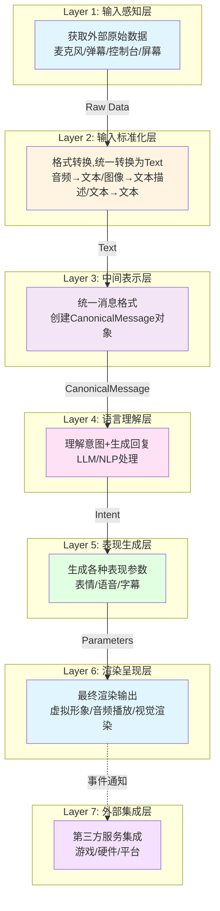

# Amaidesu 架构重构计划：基于数据流的7层架构设计

## 📋 核心问题

通过深入分析当前架构，发现以下关键问题：

### 1. 过度插件化导致"自我折磨"

**现状举例**：TTS功能有3个独立插件，通过配置切换

````
src/plugins/tts/           # Edge TTS
src/plugins/gptsovits_tts/ # GPT-SoVITS  
src/plugins/omni_tts/      # Omni TTS
````

**问题**：

- 同一功能重复实现，代码冗余
- 切换实现需要修改 `[plugins] enabled = [...]` 列表
- 配置分散在多个地方

### 2. 依赖地狱问题

**现状**：24个插件中有18个使用服务注册，形成复杂依赖链

```python
# 典型依赖链示例
vts_control_service = self.core.get_service("vts_control")
subtitle_service = self.core.get_service("subtitle_service")  
text_cleanup = self.core.get_service("text_cleanup")
```

**问题**：

- 启动顺序依赖（必须先启动被依赖的服务）
- "插件排列组合"调试困难
- 配置错误导致启动失败
- 难以单独测试插件

### 3. 模块定位模糊

**现状**：核心功能、可选扩展、测试工具都作为插件

**问题**：

- 插件系统承载了过多职责
- "伪插件"问题：console_input、keyword_action 实际无法禁用
- 不符合"插件=可拔插"的语义

## 🎯 重构目标

### 核心设计原则（源自设计讨论）

1. **消灭过度插件化**：核心功能不应是插件，而是模块
2. **统一接口收敛功能**：同一功能收敛到统一接口，用Provider模式/工厂动态切换实现
3. **消除依赖地狱**：推广EventBus通信，替代服务注册模式
4. **按数据流组织架构**：音输入→语言推理→表情动作→虚拟渲染→直播推流
5. **驱动与渲染分离**：驱动层输出参数，渲染层只管渲染（换引擎不用重写）

## 🏗️ 7层架构设计

### 核心理念

**按AI VTuber数据处理的完整流程组织层级，每层有明确的输入和输出格式。**

- **不按技术模式("Provider"、"工厂")组织目录**
- **每层输出格式统一且明确**
- **层级间单向依赖，消除循环耦合**

### 架构概览



### 7层架构详细设计

| 层级                | 英文名        | 输入格式         | 输出格式             | 核心职责          | 设计理由                                       |
| ------------------- | ------------- | ---------------- | -------------------- | ----------------- | ---------------------------------------------- |
| **1. 输入感知层**   | Perception    | -                | Raw Data             | 获取外部原始数据  | 按数据源(音频/文本/图像)分离输入源             |
| **2. 输入标准化层** | Normalization | Raw Data         | **Text**             | 统一转换为文本    | LLM只能处理文本，简化后续处理流程              |
| **3. 中间表示层**   | Canonical     | Text             | **CanonicalMessage** | 统一消息格式      | 标准化数据结构，易于扩展和传输                 |
| **4. 语言理解层**   | Understanding | CanonicalMessage | **Intent**           | 理解意图+生成回复 | AI VTuber的"大脑"，负责语言理解与生成          |
| **5. 表现生成层**   | Expression    | Intent           | **Parameters**       | 生成各种表现参数  | **驱动层只输出参数**，符合设计讨论中的分离原则 |
| **6. 渲染呈现层**   | Rendering     | Parameters       | **Frame/Stream**     | 最终渲染输出      | **渲染层只管渲染**，换引擎不用重写             |
| **7. 外部集成层**   | Integration   | -                | -                    | 第三方服务集成    | 保留插件系统，仅用于真正的扩展                 |

### 关键设计决策

#### 1. 统一转换为文本(Layer 2)

**决策**:所有输入统一转换为Text格式

**理由**:

- 简化后续处理流程
- LLM只能处理文本
- 图像/音频通过VL模型转换为文本描述
- 降低系统复杂度

#### 2. 驱动与渲染分离(Layer 5 & 6)

**设计初衷**："虽然都是虚拟形象，但**驱动层只输出参数，渲染层只管画图**。这都不分开，以后换个模型或者引擎难道要重写一遍？"

- **Layer 5 (Expression)**: 生成抽象的表现参数（表情参数、热键、TTS文本）
- **Layer 6 (Rendering)**: 接收参数进行实际渲染（VTS调用、音频播放、字幕显示）

#### 3. CanonicalMessage统一格式(Layer 3)

```python
# 核心概念（伪代码，完整实现见implementation_plan.md）
class CanonicalMessage:
    """统一消息格式 - Layer 3的核心数据结构"""
    # 包含：text(文本)、metadata(来源/时间戳/用户)、context(对话上下文)

class MessageMetadata:
    """消息元数据 - 存储消息的属性信息"""
    # 包含：source、timestamp、user_id、user_name等

class ConversationContext:
    """对话上下文 - 维护对话历史和当前轮次"""
    # 包含：history、current_turn、max_history等
```

#### 4. Intent意图对象(Layer 4输出)

```python
# 核心概念（伪代码，完整实现见implementation_plan.md）
class Intent:
    """意图对象 - Layer 4的输出格式"""
    # 包含：original_text、emotion、response_text、actions、metadata

class EmotionType:
    """情感类型枚举"""
    # NEUTRAL, HAPPY, SAD, ANGRY, SURPRISED等
```

#### 5. RenderParameters参数对象(Layer 5输出)

```python
# 核心概念（伪代码，完整实现见implementation_plan.md）
class RenderParameters:
    """渲染参数 - Layer 5的输出格式"""
    # 包含：expressions(表情)、tts_text(语音)、subtitle_text(字幕)、hotkeys等
```

## 🔄 模块化设计：消灭插件化

### 统一接口 + 动态选择设计

基于设计讨论中的要求："同一功能收敛到一个统一接口里，用Provider模式或者工厂动态选实现不就行了"

#### 核心概念

**1. 统一接口定义** - 为同一功能（如TTS、STT、LLM）定义标准接口  
**2. 多实现管理** - 每个实现类遵循统一接口，但内部逻辑不同  
**3. 工厂模式** - 根据配置动态选择实现，支持运行时切换  
**4. 统一模块** - 一个模块管理所有实现，替代原来的多个插件

#### 示例：TTS统一接口

**当前问题**：

- 3个独立插件：tts、gptsovits_tts、omni_tts
- 切换需要修改配置的`enabled`列表
- 代码重复，配置分散

**重构后**：

```python
# 核心概念（伪代码，完整实现见implementation_plan.md）
class TTSProvider:
    """TTS统一接口 - 所有TTS实现必须遵循"""
    async def synthesize_speech(self, text: str, **kwargs) -> bytes:
        """合成语音，返回音频数据"""

class TTSProviderFactory:
    """TTS提供者工厂 - 根据配置创建实现实例"""
    def create_provider(self, name: str, config: dict) -> TTSProvider:
        """动态创建TTS提供者"""

class UnifiedTTSModule:
    """统一TTS模块 - 替代3个插件"""
    async def initialize(self):
        """初始化默认TTS提供者"""

    async def switch_provider(self, new_provider: str):
        """运行时切换TTS提供者"""
```

#### 配置简化

```toml
# 当前：分散在多个插件配置
[plugins]
enabled = ["tts"]  # 只能启用一个
[tts]
voice = "zh-CN-XiaoxiaoNeural"

# 重构后：统一配置，支持多实现
[expression.tts]
default_provider = "edge"

[expression.tts.providers.edge]
voice = "zh-CN-XiaoxiaoNeural"

[expression.tts.providers.gptsovits]
host = "127.0.0.1"
port = 9880

[expression.tts.providers.omni]
api_key = "your_key"
```

## 🔄 事件驱动的并行架构

### EventBus完全替代服务注册

**核心目标**：消灭依赖地狱，所有模块间通信通过EventBus

#### 关键事件流定义

```python
from typing import TypedDict, Any

class EventData(TypedDict):
    """事件数据基类"""
    event: str
    timestamp: float
    source: str
    data: Dict[str, Any]

# 核心数据流事件
EVENT_DEFINITIONS = {
    # Layer 1 → Layer 2
    "perception.raw_data": Any,              # RawData
    
    # Layer 2 → Layer 3  
    "normalization.text_ready": str,            # Text
    
    # Layer 3 → Layer 4
    "canonical.message_created": "CanonicalMessage",  # CanonicalMessage
    
    # Layer 4 → Layer 5 ⭐ 核心事件
    "understanding.intent_generated": Intent,       # Intent
    
    # Layer 5 → Layer 6 ⭐ 核心事件
    "expression.parameters_generated": RenderParameters,  # RenderParameters
    
    # Layer 6 输出
    "rendering.audio_played": Dict[str, Any],    # 播放信息
    "rendering.expression_applied": Dict[str, Any], # 表情应用
    "rendering.subtitle_shown": Dict[str, Any],     # 字幕显示
}
```

#### EventBus通信模式

```python
# 核心概念（伪代码，完整实现见implementation_plan.md）
class EventBus:
    """事件总线 - 模块间解耦的核心通信机制"""
    async def emit(self, event_name: str, data: dict):
        """发布事件 - 发布者不关心谁在监听"""

    def on(self, event_name: str, handler: callable):
        """订阅事件 - 订阅者不关心谁是发布者"""

# 使用示例
class ExpressionModule:
    async def process_intent(self, intent: Intent):
        params = self.generate_parameters(intent)
        # 发布事件
        await self.event_bus.emit("expression.parameters_generated", {
            "parameters": params
        })

class RenderingModule:
    def setup(self):
        # 订阅事件
        self.event_bus.on("expression.parameters_generated", self.on_parameters)
```

### 消除服务注册的迁移

| 原服务注册                        | EventBus替代方案                              |
| --------------------------------- | --------------------------------------------- |
| `get_service("vts_control")`      | 监听 `"expression.parameters_generated"` 事件 |
| `get_service("subtitle_service")` | 发布 `"rendering.subtitle_shown"` 事件        |
| `get_service("text_cleanup")`     | 监听 `"normalization.text_ready"` 事件        |
| `get_service("tts_service")`      | 监听 `"expression.parameters_generated"` 事件 |

## 📁 新目录结构

````
amaidesu/
├── src/
│   ├── core/                              # 核心基础设施(保持不变)
│   │   ├── amaidesu_core.py               # 中央枢纽
│   │   ├── event_bus.py                   # 事件系统(主要通信方式)
│   │   ├── pipeline_manager.py            # 管道系统
│   │   ├── context_manager.py             # 上下文管理
│   │   ├── providers/                    # Provider基类
│   │   ├── factories/                     # 工厂模式实现
│   │   └── module_loader.py              # 模块加载器
│   │
│   ├── perception/                         # 【Layer 1】输入感知层
│   │   ├── audio/
│   │   │   ├── microphone.py              # 麦克风输入
│   │   │   └── stream_audio.py            # 流音频输入
│   │   └── text/
│   │       ├── console_input.py           # 控制台输入
│   │       └── danmaku/                    # 弹幕输入
│   │           ├── base_danmaku.py         # 弹幕基类
│   │           ├── bilibili_danmaku.py     # B站弹幕
│   │           └── mock_danmaku.py         # 模拟弹幕
│   │
│   ├── normalization/                      # 【Layer 2】输入标准化层
│   │   ├── text_normalizer.py             # 文本标准化
│   │   ├── audio_to_text.py               # 音频→文本(STT)
│   │   ├── image_to_text.py               # 图像→文本(VL)
│   │   └── implementations/
│   │       ├── edge_stt.py
│   │       └── openai_vl.py
│   │
│   ├── canonical/                          # 【Layer 3】中间表示层
│   │   ├── canonical_message.py           # CanonicalMessage定义
│   │   ├── message_builder.py             # 消息构建器
│   │   └── context_attacher.py            # 上下文附加器
│   │
│   ├── understanding/                       # 【Layer 4】语言理解层
│   │   ├── base_llm.py                    # LLM接口
│   │   ├── intent_analyzer.py             # 意图分析
│   │   ├── emotion_detector.py            # 情感检测
│   │   └── implementations/
│   │       └── openai_llm.py
│   │
│   ├── expression/                          # 【Layer 5】表现生成层
│   │   ├── tts_module.py                  # 统一TTS模块(替代3个插件)
│   │   ├── expression_generator.py         # 表情生成器
│   │   ├── action_mapper.py               # 动作映射器
│   │   └── subtitle_planner.py            # 字幕规划器
│   │
│   ├── rendering/                           # 【Layer 6】渲染呈现层
│   │   ├── virtual_rendering/             # 虚拟渲染
│   │   │   ├── base_renderer.py
│   │   │   └── implementations/
│   │   │       ├── vts_renderer.py
│   │   │       └── obs_renderer.py
│   │   ├── audio_rendering/               # 音频渲染
│   │   │   ├── playback_manager.py
│   │   │   └── implementations/
│   │   │       ├── edge_tts.py
│   │   │       ├── gptsovits_tts.py
│   │   │       └── omni_tts.py
│   │   └── visual_rendering/              # 视觉渲染
│   │       ├── subtitle_renderer.py
│   │       └── sticker_renderer.py
│   │
│   └── integration/                         # 【Layer 7】外部集成层(保留插件系统)
│       ├── game_integration/               # 游戏集成
│       ├── tools/                          # 工具插件
│       └── hardware/                       # 硬件集成
│
├── config/
├── config-template.toml
└── main.py
````

## 🔌 插件系统重新定位

### 保留为插件的功能(8个)

| 插件类型      | 数量 | 保留理由                   |
| ------------- | ---- | -------------------------- |
| **游戏集成**  | 4个  | 真正的外部集成，需要插件化 |
| **工具/硬件** | 4个  | 边缘功能，可选扩展         |

### 迁移到7层架构的插件(16个)

| 原插件                | 迁移到层级 | 迁移方式                        |
| --------------------- | ---------- | ------------------------------- |
| **TTS系列(3个)**      | Layer 5+6  | 统一为TTS模块，Provider模式实现 |
| **弹幕输入系列(4个)** | Layer 1    | 统一接口，工厂模式选择          |
| **虚拟渲染系列(3个)** | Layer 6    | 统一渲染器接口                  |
| **理解处理系列(2个)** | Layer 4    | 合并为语言理解模块              |

## ✅ 成功标准

### 技术指标

- ✅ 所有现有功能正常运行
- ✅ 配置文件行数减少40%以上
- ✅ 核心功能响应时间无增加
- ✅ 代码重复率降低30%以上
- ✅ **服务注册调用减少80%以上**
- ✅ **EventBus事件调用覆盖率90%以上**

### 架构指标

- ✅ 清晰的7层数据流架构
- ✅ 层级间依赖关系清晰(单向依赖)
- ✅ **EventBus为主要通信模式**
- ✅ **Provider模式替代重复插件**
- ✅ **工厂模式支持动态切换**

## 📚 设计优势

### 1. 解决核心问题

| 问题         | 解决方案              | 效果                           |
| ------------ | --------------------- | ------------------------------ |
| 过度插件化   | Provider模式+工厂模式 | 同一功能统一接口，动态切换实现 |
| 依赖地狱     | EventBus通信          | 模块间松耦合，无启动顺序依赖   |
| 配置分散     | 统一配置结构          | 集中管理，配置复杂度降低       |
| 模块定位模糊 | 按数据流分层          | 职责清晰，易于理解和维护       |

### 2. 符合设计初衷

- ✅ **"同一功能收敛到一个统一接口"**：Provider模式实现
- ✅ **"用Provider模式或者工厂动态选实现"**：工厂模式支持
- ✅ **"驱动层只输出参数，渲染层只管渲染"**：Layer 5&6分离
- ✅ **"以后换个模型或者引擎难道要重写一遍"**：通过Provider切换解决

### 3. 架构优势

1. **数据流清晰**: 7层架构，每层职责明确
2. **消除重复**: 统一接口替代重复插件实现
3. **松耦合**: EventBus通信，模块间无直接依赖
4. **易扩展**: 新实现只需实现Provider接口并注册
5. **易维护**: 分层清晰，问题定位准确

**本文档为Amaidesu项目的完整架构重构计划，聚焦于消灭过度插件化和依赖地狱，建立清晰的数据流架构。**