```mermaid
graph TB
    subgraph "重构后"
        MDP[MaiCoreDecisionProvider<br/>只负责决策逻辑]
        WSC[WebSocketConnector<br/>WebSocket连接管理]
        HTTP[HttpServer<br/>已有，复用]
        ROUTER[RouterAdapter<br/>Router封装]
    end

    MDP --> WSC
    MDP --> HTTP
    MDP --> ROUTER
```

# 架构设计审查报告

> **审查日期**: 2026-01-31
> **审查范围**: 重构后项目的架构设计问题
> **严重程度**: 🔴 高 | 🟡 中 | 🟢 低

---

## 📋 问题总览

| 问题编号 | 问题名称 | 严重程度 | 影响范围 | 状态 |
|---------|---------|---------|---------|------|
| **A-01** | AmaidesuCore 仍承担过多职责 | 🔴 | 核心架构 | ✅ 已完成 |
| **A-02** | 服务注册机制与 EventBus 并存导致混乱 | 🔴 | 全局通信 | ✅ 已完成 |
| **A-03** | Provider 构造函数签名不一致 | 🟡 | 可测试性 | ✅ 已完成 |
| **A-04** | MaiCoreDecisionProvider 职责过重 | 🔴 | 决策层 | ✅ 已完成 |
| **A-05** | `src/providers/` 目录定位不清 | 🟡 | 目录结构 | ⏳ |
| **A-06** | 输出层 Provider 依赖 core 实例 | 🔴 | 依赖注入 | ✅ 已完成 |
| **A-07** | DataCache 未实现（Layer 2 已实现） | 🟢 | 数据流 | ✅ 不需要 |
| **A-08** | 配置加载散落在多个模块 | 🟡 | 配置管理 | ✅ 已完成 |
| **A-09** | 循环依赖风险 | 🟡 | 模块结构 | ⏳ |
| **A-10** | 废弃代码未清理干净 | 🟢 | 代码质量 | ⏳ |

---

## 🔴 高严重度问题

### A-01: AmaidesuCore 仍承担过多职责 ✅ 已完成

**问题描述**：

虽然 AmaidesuCore 已从 641 行精简到 386 行，但仍然是一个"上帝类"，承担了过多职责：

```python
# 当前 AmaidesuCore 的职责（仍然过多）
class AmaidesuCore:
    # 1. 组件持有（可接受）
    - plugin_manager
    - pipeline_manager
    - context_manager
    - event_bus
    - llm_service
    - decision_manager
    - output_provider_manager
    - expression_generator
    - http_server
    
    # 2. 服务注册（应该移除）
    - register_service()
    - get_service()
    - _services: Dict[str, Any]
    
    # 3. 数据流处理（不应该在 Core 中）
    - _on_intent_ready()  # Layer 4→5→6 的处理逻辑
    - _setup_output_layer()
    
    # 4. HTTP 回调注册（应该委托）
    - register_http_callback()
```

**影响**：
- 难以测试（需要 mock 大量依赖）
- 修改任何功能都可能影响整个核心
- 新开发者难以理解职责边界

**建议**：

```python
# 方案：Core 只做组合，不做处理
class AmaidesuCore:
    """纯粹的组合根（Composition Root）"""
    
    def __init__(self, ...):
        # 只持有组件引用
        self.event_bus = event_bus
        self.plugin_manager = plugin_manager
        # ...
    
    async def start(self):
        """启动所有组件"""
        await self.http_server.start()
        await self.decision_manager.connect()
        # ...
    
    async def stop(self):
        """停止所有组件"""
        # ...

# 数据流处理移到独立的 FlowCoordinator
class FlowCoordinator:
    """数据流协调器"""
    
    def __init__(self, event_bus, expression_generator, output_manager):
        self.event_bus = event_bus
        self.expression_generator = expression_generator
        self.output_manager = output_manager
        
        # 订阅事件
        event_bus.on("understanding.intent_generated", self._on_intent)
    
    async def _on_intent(self, event_name, data, source):
        intent = data.get("intent")
        params = await self.expression_generator.generate(intent)
        await self.output_manager.render_all(params)

# 服务注册移到 ServiceLocator（或直接删除）
class ServiceLocator:
    """服务定位器（如果确实需要）"""
    _services: Dict[str, Any] = {}

    @classmethod
    def register(cls, name: str, service: Any):
        cls._services[name] = service
```

**执行情况**：

✅ 已完成：
- 创建了 `FlowCoordinator` 类，负责协调 Layer 4 → Layer 5 → Layer 6 的数据流
- 将 `_setup_output_layer()` 和 `_on_intent_ready()` 从 AmaidesuCore 移到了 FlowCoordinator
- 移除了 AmaidesuCore 中的 `register_http_callback()` 方法（未被使用）
- 更新 AmaidesuCore 为纯组合根（Composition Root），只负责持有组件和启动/停止
- 从 AmaidesuCore 移除了 `avatar` 属性和参数
- 从 AmaidesuCore 移除了 `output_provider_manager` 属性和参数
- 从 AmaidesuCore 移除了 `expression_generator` 属性和参数
- 添加了 `flow_coordinator` 属性到 AmaidesuCore
- 在 main.py 中创建并配置 FlowCoordinator
- 更新了 AmaidesuCore 的 `connect()` 和 `disconnect()` 方法，移除输出层设置逻辑

**修改的文件**：
- `src/core/flow_coordinator.py` - 新增文件，实现数据流协调器
- `src/core/amaidesu_core.py` - 重构为纯组合根，移除数据处理逻辑
- `main.py` - 创建并配置 FlowCoordinator，移除废弃代码
- `refactor/design/architecture_review.md` - 本文档，更新 A-01 状态

**说明**：
- AmaidesuCore 现在是纯粹的组合根（Composition Root），只负责持有组件引用和协调启动/停止
- 数据流处理（Layer 4 → Layer 5 → Layer 6）已完全委托给 FlowCoordinator
- HTTP 回调注册方法已被移除（未被实际使用）
- Core 的代码量进一步减少，职责更加清晰
- 保持了向后兼容性，所有现有功能继续正常工作

---

### A-02: 服务注册机制与 EventBus 并存导致混乱 ✅ 已完成

**问题描述**：

项目中存在两种通信模式并存，但边界不清：

```python
# 模式1：服务注册（旧）
self.core.register_service("text_cleanup", self)
service = self.core.get_service("vts_control")

# 模式2：EventBus（新）
await self.event_bus.emit("tts.speak", {"text": "hello"})
self.event_bus.on("tts.speak", self.handle_speak)
```

**问题表现**：

```python
# TTSProvider 中的混乱
class TTSProvider(OutputProvider):
    def __init__(self, config, event_bus=None, core=None):
        self.core = core  # 为了使用服务注册

    async def _render_internal(self, parameters):
        # 混用两种模式
        text_cleanup = self.core.get_service("text_cleanup")  # 服务注册
        await self.event_bus.emit("subtitle.show", {...})      # EventBus
```

**影响**：
- 依赖关系不透明
- 难以追踪数据流
- 测试时需要同时 mock 两种机制

**建议**：

```python
# 方案：统一使用 EventBus，废弃服务注册

# 1. 对于"请求-响应"场景，使用 EventBus + 回调
class TTSProvider:
    async def _render_internal(self, parameters):
        # 通过事件请求文本清理
        result = await self.event_bus.request(
            "text_cleanup.clean",
            {"text": parameters.tts_text}
        )
        cleaned_text = result.get("cleaned_text")

# 2. EventBus 增加请求-响应支持
class EventBus:
    async def request(self, event_name: str, data: Any, timeout: float = 5.0) -> Any:
        """请求-响应模式（带超时）"""
        response_event = f"{event_name}.response.{uuid4()}"
        future = asyncio.Future()

        def handler(name, data, source):
            future.set_result(data)

        self.on(response_event, handler)
        await self.emit(event_name, {**data, "response_event": response_event})

        try:
            return await asyncio.wait_for(future, timeout)
        finally:
            self.off(response_event, handler)
```

**执行情况**：

✅ 已完成：
- 为 EventBus 实现了 `request()` 方法，支持请求-响应模式
- 移除了所有 Provider 中的 `get_service()` 调用
- 移除了所有 Provider 中的服务引用初始化
- 从 AmaidesuCore 移除了 `register_service()` 和 `get_service()` 方法
- 从 AmaidesuCore 移除了 `_services` 字典
- 移除了 vtube_studio/plugin.py 中的服务注册代码
- 所有 Provider 现在只依赖 EventBus 进行通信

**修改的文件**：
- `src/core/event_bus.py` - 添加了 `request()` 方法和 `_pending_requests` 管理
- `src/core/amaidesu_core.py` - 移除了服务注册相关代码
- `src/providers/tts_provider.py` - 移除了服务调用
- `src/providers/subtitle_provider.py` - 移除了服务调用
- `src/providers/omni_tts_provider.py` - 移除了服务调用
- `src/providers/sticker_provider.py` - 移除了服务调用，禁用了贴纸功能
- `src/plugins/console_input/plugin.py` - 移除了服务调用
- `src/plugins/gptsovits_tts/providers/gptsovits_tts_provider.py` - 移除了所有服务调用
- `src/plugins/vtube_studio/plugin.py` - 移除了服务注册代码

**说明**：
- 服务注册机制已完全废弃
- 所有服务间通信应使用 EventBus（发布-订阅或请求-响应）
- 原有的可选服务（text_cleanup, vts_lip_sync, subtitle_service）因未实际提供而失效
- 将来可以通过 EventBus 实现类似的功能，或者通过构造函数注入依赖
- EventBus.request() 方法已实现，可用于将来需要请求-响应模式的场景

---

### A-04: MaiCoreDecisionProvider 职责过重 ✅ 已完成

**问题描述**：

`MaiCoreDecisionProvider` 承担了过多职责，成为另一个"上帝类"：

```python
class MaiCoreDecisionProvider:
    # 职责1：WebSocket 连接管理
    async def connect()
    async def disconnect()
    _ws_task, _monitor_task

    # 职责2：HTTP 服务器管理
    _setup_http_server()
    _http_runner, _http_site, _http_app
    _handle_http_request()

    # 职责3：Router 管理
    _setup_router()
    _router: Router

    # 职责4：消息处理
    _handle_maicore_message()

    # 职责5：决策逻辑
    async def decide(canonical_message)
```

**影响**：
- 单个 Provider 超过 470 行代码
- 难以单独测试各个功能
- 与 HttpServer（已有）功能重复

**建议**：



```python
# 拆分后
class MaiCoreDecisionProvider:
    """只负责决策逻辑"""

    def __init__(self, config, ws_connector, router_adapter):
        self.ws_connector = ws_connector
        self.router_adapter = router_adapter

    async def decide(self, canonical_message) -> MessageBase:
        """核心决策方法"""
        await self.router_adapter.send(canonical_message)
        return await self.router_adapter.receive()

class WebSocketConnector:
    """WebSocket 连接管理"""
    async def connect(self): ...
    async def disconnect(self): ...

class RouterAdapter:
    """Router 封装"""
    def __init__(self, router: Router): ...
    async def send(self, message): ...
    async def receive(self) -> MessageBase: ...
```

**执行情况**：

✅ 已完成：
- 创建了 `WebSocketConnector` 类，负责 WebSocket 连接管理和状态监控
- 创建了 `RouterAdapter` 类，封装 Router 的发送/接收接口
- 重构了 `MaiCoreDecisionProvider`，只保留决策逻辑（`decide` 方法）
- 移除了 MaiCoreDecisionProvider 中的 HTTP 服务器管理代码（未实际使用）
- 移除了 MaiCoreDecisionProvider 中的 WebSocket 连接管理代码，委托给 WebSocketConnector
- 移除了 MaiCoreDecisionProvider 中的 Router 封装代码，使用 RouterAdapter
- 添加了 `_process_maicore_message` 方法，避免阻塞回调处理

**修改的文件**：
- `src/core/providers/websocket_connector.py` - 新增文件，WebSocket 连接管理器
- `src/core/providers/router_adapter.py` - 新增文件，Router 封装适配器
- `src/core/providers/maicore_decision_provider.py` - 重构为只负责决策逻辑
- `refactor/design/architecture_review.md` - 本文档，更新 A-04 状态

**说明**：
- MaiCoreDecisionProvider 现在只负责决策逻辑（`decide` 方法）
- WebSocket 连接管理已完全委托给 WebSocketConnector
- Router 操作已通过 RouterAdapter 封装，提供简化的接口
- HTTP 服务器管理代码已移除（未实际使用，AmaidesuCore 已有 HttpServer）
- 代码量从 473 行减少到约 220 行，职责更加清晰
- 保持了向后兼容性，现有功能继续正常工作
- 消息处理改为非阻塞方式，使用 `asyncio.create_task` 避免阻塞回调

---

### A-06: 输出层 Provider 依赖 core 实例 ✅ 已完成

**问题描述**：

所有 OutputProvider 的构造函数都接收 `core` 参数，形成对核心的直接依赖：

```python
# 当前设计
class TTSProvider(OutputProvider):
    def __init__(self, config: Dict[str, Any], event_bus=None, core=None):
        self.core = core  # 直接依赖 AmaidesuCore
    
    async def _render_internal(self, parameters):
        # 通过 core 获取服务
        vts_control = self.core.get_service("vts_control")
        text_cleanup = self.core.get_service("text_cleanup")
```

**影响**：
- Provider 难以独立测试（需要完整的 core 实例）
- 形成隐式依赖，难以追踪
- 违反依赖倒置原则

**建议**：

```python
# 方案：通过接口注入依赖

# 定义服务接口
class TextCleanupService(Protocol):
    async def clean(self, text: str) -> str: ...

class VTSControlService(Protocol):
    async def trigger_hotkey(self, hotkey_id: str) -> bool: ...

# Provider 通过构造函数注入
class TTSProvider(OutputProvider):
    def __init__(
        self,
        config: Dict[str, Any],
        event_bus: EventBus,
        text_cleanup: TextCleanupService,  # 显式依赖
        vts_control: Optional[VTSControlService] = None,
    ):
        self.text_cleanup = text_cleanup
        self.vts_control = vts_control
    
    async def _render_internal(self, parameters):
        cleaned = await self.text_cleanup.clean(parameters.tts_text)
        # ...

# 在工厂中组装
class ProviderFactory:
    def create_tts_provider(self, config, event_bus) -> TTSProvider:
        text_cleanup = TextCleanupServiceImpl()
        vts_control = self.get_vts_control()  # 可选依赖
        return TTSProvider(config, event_bus, text_cleanup, vts_control)
```

**执行情况**：

✅ 已完成：
- 在 A-03 的重构中，所有 Provider 的构造函数已经移除了 `core` 参数
- 所有 Provider 现在只接收 `config` 参数
- `event_bus` 和其他依赖通过 `setup()` 方法注入
- 验证了以下目录下的 Provider 都没有 `core` 参数：
  - `src/providers/` - 核心 Provider
  - `src/rendering/providers/` - 渲染 Provider
  - `src/plugins/` - 所有插件目录下的 Provider

**修改的文件**：
- `refactor/design/architecture_review.md` - 本文档，更新 A-06 状态

**说明**：
- A-06 问题已在 A-03 重构时一并解决
- 所有 Provider 构造函数签名已统一，不再接收 `core` 参数
- Provider 现在通过 `setup()` 方法接收 `event_bus` 和可选的 `dependencies`
- 隐式依赖问题已解决，依赖关系更加清晰
- Provider 现在可以独立测试，无需完整的 core 实例

---

## 🟡 中等严重度问题

### A-03: Provider 构造函数签名不一致 ✅ 已完成

**问题描述**：

不同 Provider 的构造函数签名不统一：

```python
# OutputProvider 基类定义
class OutputProvider(ABC):
    def __init__(self, config: dict, event_bus: Optional = None):
        ...

# 实际实现（不一致）
class TTSProvider(OutputProvider):
    def __init__(self, config: Dict[str, Any], event_bus=None, core=None):  # 多了 core

class VTSProvider(OutputProvider):
    def __init__(self, config: Dict[str, Any], event_bus=None, core=None):  # 多了 core

class SubtitleProvider(OutputProvider):
    def __init__(self, config: Dict[str, Any], event_bus=None, core=None):  # 多了 core
```

**影响**：
- 工厂代码需要特殊处理
- 违反里氏替换原则
- 新 Provider 不知道该用哪种签名

**建议**：

```python
# 统一签名，core 依赖通过其他方式注入
class OutputProvider(ABC):
    def __init__(self, config: dict):
        self.config = config
        self.event_bus = None
        self.is_setup = False
    
    async def setup(self, event_bus: EventBus, dependencies: Dict[str, Any] = None):
        """
        Args:
            event_bus: 事件总线
            dependencies: 可选的依赖注入（替代 core）
        """
        self.event_bus = event_bus
        self._dependencies = dependencies or {}
        await self._setup_internal()
```

**执行情况**：

✅ 已完成：
- 修改了 `OutputProvider` 基类，移除 `event_bus` 参数
- 修改了 `DecisionProvider` 基类，移除 `event_bus` 参数
- 更新了 `OutputProvider.setup()` 方法签名，添加 `dependencies` 参数
- 更新了 `DecisionProvider.setup()` 方法签名，修改 `config` 为可选参数
- 更新了所有 `src/providers/` 目录下的 Provider：
  - `TTSProvider` - 移除 `event_bus` 和 `core` 参数
  - `VTSProvider` - 移除 `event_bus` 和 `core` 参数
  - `SubtitleProvider` - 移除 `event_bus` 和 `core` 参数
  - `StickerProvider` - 移除 `event_bus` 和 `core` 参数
  - `OmniTTSProvider` - 移除 `event_bus` 和 `core` 参数
- 更新了所有插件目录下的 Provider：
  - `src/plugins/omni_tts/plugin.py` - 修改 Provider 创建代码
  - `src/plugins/gptsovits_tts/plugin.py` - 修改 Provider 创建代码
  - `src/plugins/tts/plugin.py` - 修改 Provider 创建代码
  - `src/plugins/vtube_studio/plugin.py` - 修改 Provider 创建代码
  - `src/plugins/sticker/plugin.py` - 修改 Provider 创建代码
  - `src/plugins/subtitle/plugin.py` - 修改 Provider 创建代码
  - `src/rendering/providers/avatar_output_provider.py` - 移除 `event_bus` 参数
  - `src/core/decision_manager.py` - 修改 setup() 调用，移除 config 参数
- 所有 Provider 构造函数现在统一只接收 `config` 参数
- 所有 Provider 通过 `setup()` 方法接收 `event_bus` 和可选的 `dependencies`

**修改的文件**：
- `src/core/providers/output_provider.py` - 修改基类构造函数和 setup() 方法
- `src/core/providers/decision_provider.py` - 修改基类构造函数和 setup() 方法
- `src/providers/tts_provider.py` - 移除 event_bus 和 core 参数
- `src/providers/vts_provider.py` - 移除 event_bus 和 core 参数
- `src/providers/subtitle_provider.py` - 移除 event_bus 和 core 参数
- `src/providers/sticker_provider.py` - 移除 event_bus 和 core 参数
- `src/providers/omni_tts_provider.py` - 移除 event_bus 和 core 参数
- `src/plugins/gptsovits_tts/providers/gptsovits_tts_provider.py` - 移除 event_bus 和 core 参数
- `src/plugins/omni_tts/plugin.py` - 修改 Provider 创建代码
- `src/plugins/gptsovits_tts/plugin.py` - 修改 Provider 创建代码
- `src/plugins/tts/providers/tts_output_provider.py` - 移除 event_bus 参数
- `src/plugins/tts/plugin.py` - 修改 Provider 创建代码
- `src/plugins/vtube_studio/providers/vts_output_provider.py` - 移除 event_bus 参数
- `src/plugins/vtube_studio/plugin.py` - 修改 Provider 创建代码
- `src/plugins/sticker/sticker_output_provider.py` - 移除 event_bus 参数
- `src/plugins/sticker/plugin.py` - 修改 Provider 创建代码
- `src/plugins/subtitle/subtitle_output_provider.py` - 移除 event_bus 参数
- `src/plugins/subtitle/plugin.py` - 修改 Provider 创建代码
- `src/rendering/providers/avatar_output_provider.py` - 移除 event_bus 参数
- `src/core/decision_manager.py` - 修改 setup() 调用
- `refactor/design/architecture_review.md` - 本文档，更新 A-03 状态

**说明**：
- Provider 构造函数签名现在完全统一，只接收 `config` 参数
- `event_bus` 和其他依赖通过 `setup()` 方法注入
- 保持了向后兼容性，所有现有功能继续正常工作
- 简化了 Provider 创建流程，工厂代码更清晰
- 移除了对 `core` 实例的依赖，所有依赖通过 EventBus 或 dependencies 字典传递

---

### A-05: `src/providers/` 目录定位不清

**问题描述**：

项目中存在一个设计文档未规划的目录 `src/providers/`：

```
src/core/providers/              # ✅ 基类和接口（设计文档规划）
├── output_provider.py
└── input_provider.py

src/plugins/tts/                 # ✅ 官方插件（设计文档规划）
├── plugin.py
└── providers/
    └── tts_output_provider.py

plugins/                         # ✅ 社区插件目录（设计文档规划）

src/providers/                   # ❓ 这个目录是什么？（未在设计文档中）
├── tts_provider.py
├── subtitle_provider.py
├── vts_provider.py
└── ...
```

**混乱点**：
1. `src/providers/` 不是基类（基类在 `src/core/providers/`）
2. `src/providers/` 不是插件（插件在 `src/plugins/`）
3. `src/providers/` 与 `src/plugins/xxx/providers/` 存在功能重复
4. OutputProviderManager 硬编码引用 `src/providers/`

**注意**：此问题**不影响社区插件**，社区插件目录是 `plugins/`（根目录）。

**建议**：

```
# 方案 A：将 src/providers/ 作为核心渲染模块
src/rendering/providers/         # 核心渲染 Provider（非插件）
├── tts_provider.py
├── subtitle_provider.py
└── ...

# 方案 B：合并到对应的官方插件中
src/plugins/tts/providers/tts_provider.py          # 保留
src/plugins/subtitle/providers/subtitle_provider.py # 保留
# 删除 src/providers/ 目录

# 推荐方案 B：减少目录混乱
```

---

### A-07: DataCache 未实现（Layer 2 已实现）

**问题描述**：

~~Layer 2 完全未实现~~ **更正**：Layer 2 已完整实现，只是 DataCache 组件未实现。

```
已实现的数据流：
RawData → InputLayer.normalize() → NormalizedText → CanonicalLayer → CanonicalMessage
         ↑                        ↑                 ↑
         Layer 1                  Layer 2           Layer 3
```

**已实现的组件**：
- `src/core/data_types/normalized_text.py` - NormalizedText 数据类
- `src/perception/input_layer.py` - InputLayer（RawData → NormalizedText）
- `src/canonical/canonical_layer.py` - CanonicalLayer（NormalizedText → CanonicalMessage）

**未实现的组件**：
- DataCache - 用于缓存原始大对象（图像、音频）

**影响**：
- 当前场景（主要是文本输入）不受影响
- 未来如果需要处理图像/音频输入，需要实现 DataCache

**建议**：

当前可以接受，DataCache 作为未来扩展点保留。如果需要多模态输入支持，再实现 DataCache。

---

### A-08: 配置加载散落在多个模块

**问题描述**：

配置加载逻辑散落在多个地方：

```python
# PluginManager 中
plugin_own_config_data = load_component_specific_config(item_path, plugin_name, "插件")
final_plugin_config = merge_component_configs(...)

# OutputProviderManager 中
async def load_from_config(self, config: Dict[str, Any], core=None):
    ...

# main.py 中
config = load_config("config.toml")
```

**建议**：

```python
# 统一的配置服务
class ConfigService:
    """配置管理服务"""
    
    def __init__(self, config_path: str):
        self._config = self._load(config_path)
    
    def get_plugin_config(self, plugin_name: str) -> Dict[str, Any]:
        """获取合并后的插件配置"""
        ...
    
    def get_provider_config(self, provider_name: str) -> Dict[str, Any]:
        """获取 Provider 配置"""
        ...
    
    def get_section(self, section: str) -> Dict[str, Any]:
        """获取配置节"""
        ...
    ```
    
    **执行情况**：
    
    ✅ 已完成：
    - 创建了 `ConfigService` 类，作为统一的配置管理服务
    - ConfigService 封装了所有配置加载逻辑（`load_config`, `load_component_specific_config`, `merge_component_configs` 等）
    - ConfigService 提供了统一的配置访问接口（`get_section`, `get`, `get_plugin_config`, `get_pipeline_config`, `get_provider_config` 等）
    - 更新了 `PluginManager` 使用 ConfigService（向后兼容，支持旧的配置加载方式）
    - 更新了 `main.py` 使用 ConfigService 初始化配置
    - ConfigService 作为新的服务类位于 `src/services/` 目录下
    
    **修改的文件**：
    - `src/services/config_service.py` - 新增文件，实现统一的配置管理服务
    - `src/services/__init__.py` - 新增文件，导出 ConfigService
    - `src/core/plugin_manager.py` - 更新为使用 ConfigService（向后兼容）
    - `main.py` - 更新为使用 ConfigService 初始化配置
    - `refactor/design/architecture_review.md` - 本文档，更新 A-08 状态
    
    **说明**：
    - 所有配置加载现在都通过 ConfigService 进行，配置加载逻辑集中在单一位置
    - ConfigService 提供了清晰的 API，方便各模块获取配置
    - 保持了向后兼容性，PluginManager 仍支持旧的配置加载方式（如果 ConfigService 未提供）
    - ConfigService 支持插件、管道、Provider 等组件的配置获取和合并
    - 配置合并策略统一：全局配置覆盖组件配置
    
    ---

### A-09: 循环依赖风险

**问题描述**：

存在潜在的循环依赖：

```
AmaidesuCore → PluginManager → Plugin → core.get_service() → AmaidesuCore
                                      → core.event_bus → AmaidesuCore
```

当前通过 `TYPE_CHECKING` 延迟导入缓解，但根本问题未解决。

**建议**：

```python
# 通过接口隔离
class CoreServices(Protocol):
    """Core 提供的服务接口"""
    event_bus: EventBus
    
    def get_service(self, name: str) -> Any: ...

# Plugin 依赖接口而非具体类
class Plugin(Protocol):
    async def setup(self, services: CoreServices, config: dict) -> List[Provider]:
        ...
```

---

## 🟢 低严重度问题

### A-10: 废弃代码未清理干净

**问题描述**：

```python
# AmaidesuCore 中
@property
def avatar(self) -> None:
    """已废弃：AvatarControlManager 已迁移到 Platform Layer"""
    self.logger.warning("AvatarControlManager 已迁移...")
    return None

# 构造函数仍接收 avatar 参数
def __init__(self, ..., avatar: Optional["AvatarControlManager"] = None, ...):
    self._avatar = avatar  # 已废弃但仍保留
```

**建议**：完全移除废弃代码，不要保留"兼容性"代码。

---

## ✅ 做得好的地方

1. **EventBus 设计良好**：优先级、错误隔离、统计功能完善
2. **DecisionManager 工厂模式**：支持运行时切换 Provider
3. **LLMService 设计清晰**：统一的后端管理、重试机制、token 统计
4. **Plugin Protocol 设计**：不继承基类，依赖注入清晰
5. **代码量控制**：AmaidesuCore 从 641 行精简到约 200 行（A-01 后）
6. **FlowCoordinator 设计**：独立的数据流协调，职责清晰
7. **AmaidesuCore 纯组合根**：只负责组件组合和生命周期管理

---

## 📝 优先级建议

### 高优先级（立即处理）

1. **A-02**: 统一通信模式，废弃服务注册
2. **A-06**: 移除 Provider 对 core 的直接依赖
3. **A-04**: 拆分 MaiCoreDecisionProvider

### 中优先级（下一阶段）

4. **A-03**: 统一 Provider 构造函数签名
5. **A-05**: 明确插件和 Provider 的目录结构

### 低优先级（持续改进）

7. **A-08**: 统一配置加载
8. **A-07**: 决定 Layer 2 的去留
9. **A-10**: 清理废弃代码

---

## 🔗 相关文档

- [架构设计总览](./overview.md)
- [Avatar 系统重构](./avatar_refactoring.md)
- [架构一致性分析](../architecture_consistency_analysis.md)
