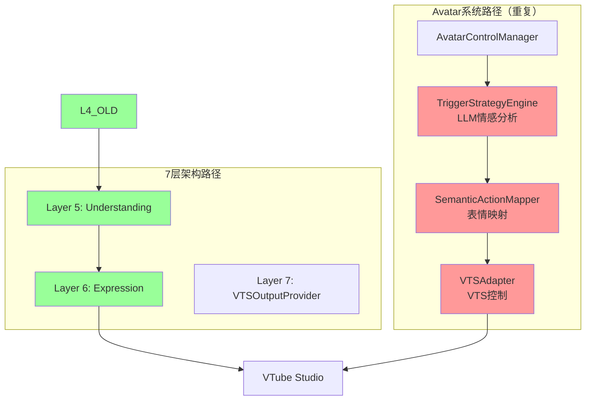
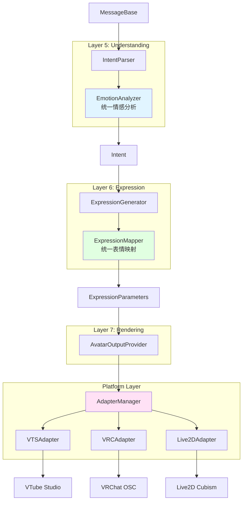
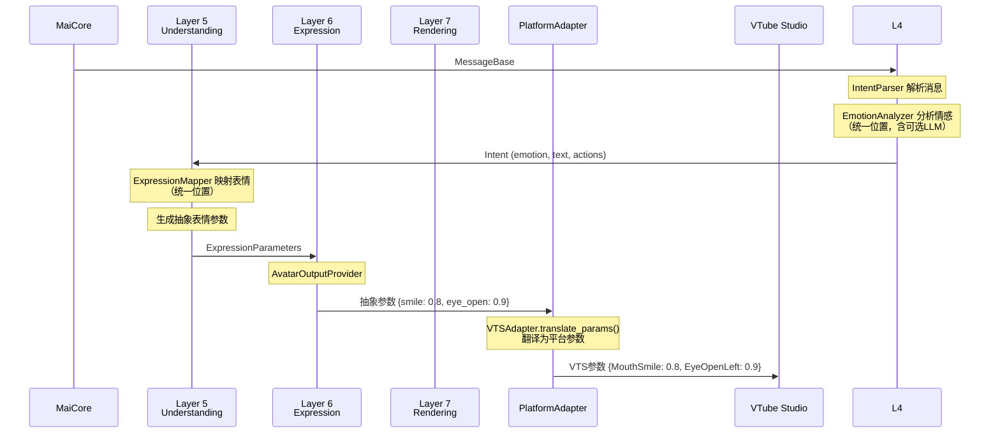

# Avatar 系统重构设计

## 📋 概述

本文档描述如何将旧的 Avatar 系统重构到 6 层架构中，消除职责重复，实现干净的架构设计。

---

## 🎯 重构目标

### 问题分析

当前 Avatar 系统（`src/core/avatar/`）与 6 层架构存在严重的职责重复：

| 功能 | Avatar 系统 | 7层架构 | 问题 |
|------|-------------|---------|------|
| **情感分析** | `TriggerStrategyEngine` (LLM) | Layer 5 `EmotionAnalyzer` | 两处都做情感分析 |
| **表情映射** | `SemanticActionMapper` | Layer 6 `EmotionMapper` | 两套映射逻辑 |
| **VTS控制** | `VTSAdapter` | `VTSOutputProvider` | 两套 VTS 控制代码 |

### 重构目标

1. **消除重复**：每个功能只在一处实现
2. **职责清晰**：分析归 Layer 5，映射归 Layer 6，执行归 Layer 7
3. **平台抽象**：保留多平台支持能力（VTS、VRChat、Live2D）

---

## 📊 架构对比

### 重构前（职责混乱）



**问题**：两条独立的数据流，功能重复，维护成本高。

### 重构后（职责清晰）



**优点**：单一数据流，每层职责明确，无重复代码。

---

## 🔗 核心设计

### 1. Layer 5: 情感分析（唯一位置）

将 Avatar 的 `TriggerStrategyEngine` 迁移到 Layer 5 的 `EmotionAnalyzer`。

```python
# src/understanding/emotion_analyzer.py
class EmotionAnalyzer:
    """统一的情感分析器
    
    合并原来的：
    - Layer 5 的情感判断逻辑
    - Avatar.TriggerStrategyEngine 的 LLM 分析
    """
    
    def __init__(self, config: Dict[str, Any], llm_service: Optional[LLMService] = None):
        self.config = config
        self.llm_service = llm_service
        
        # 可配置的分析策略
        self.use_llm = config.get("use_llm", False)
        self.use_rules = config.get("use_rules", True)
        
    async def analyze(self, text: str, context: Optional[Dict] = None) -> EmotionResult:
        """分析文本情感（唯一入口）"""
        
        # 1. 规则分析（快速、确定性）
        if self.use_rules:
            rule_result = self._analyze_by_rules(text)
            if rule_result.confidence > 0.8:
                return rule_result
        
        # 2. LLM 分析（可选、智能）
        if self.use_llm and self.llm_service:
            return await self._analyze_by_llm(text, context)
        
        return EmotionResult(emotion=EmotionType.NEUTRAL, confidence=0.5)
```

### 2. Layer 6: 表情映射（唯一位置）

合并 `EmotionMapper` 和 `SemanticActionMapper` 为统一的 `ExpressionMapper`。

```python
# src/expression/expression_mapper.py
class ExpressionMapper:
    """统一的表情映射器
    
    合并原来的：
    - Layer 6 的 EmotionMapper
    - Avatar 的 SemanticActionMapper
    
    输出平台无关的抽象参数，由 PlatformAdapter 翻译为平台特定参数。
    """
    
    DEFAULT_MAPPINGS: Dict[EmotionType, Dict[str, float]] = {
        EmotionType.NEUTRAL: {"smile": 0.0, "eye_open": 1.0},
        EmotionType.HAPPY: {"smile": 0.8, "eye_open": 0.9},
        EmotionType.SAD: {"smile": -0.3, "eye_open": 0.7},
        EmotionType.ANGRY: {"smile": -0.5, "eye_open": 0.6, "brow_down": 0.5},
        EmotionType.SURPRISED: {"smile": 0.2, "eye_open": 1.0, "mouth_open": 0.6},
    }
    
    def map_emotion(self, emotion: EmotionType, intensity: float = 1.0) -> Dict[str, float]:
        """情感 → 抽象表情参数"""
        base_params = self.mappings.get(emotion, self.mappings[EmotionType.NEUTRAL])
        return {k: v * intensity for k, v in base_params.items()}
```

### 3. Platform Layer: 平台适配（保留核心价值）

Avatar 系统的核心价值是多平台支持，将其精简为纯粹的平台抽象层。

```python
# src/platform/adapters/base.py
class PlatformAdapter(ABC):
    """平台适配器基类
    
    职责：仅做平台 API 封装，不包含业务逻辑
    原 AvatarAdapter 的精简版本
    """
    
    @abstractmethod
    async def connect(self) -> bool:
        """连接平台"""
        pass
    
    @abstractmethod
    async def set_parameters(self, params: Dict[str, float]) -> bool:
        """设置表情参数（接收抽象参数）"""
        pass
    
    @abstractmethod
    def translate_params(self, abstract_params: Dict[str, float]) -> Dict[str, float]:
        """翻译抽象参数为平台特定参数"""
        pass


# src/platform/adapters/vts/vts_adapter.py
class VTSAdapter(PlatformAdapter):
    """VTube Studio 适配器"""
    
    # 抽象参数 → VTS 参数映射
    PARAM_TRANSLATION = {
        "smile": "MouthSmile",
        "eye_open": "EyeOpenLeft",
        "mouth_open": "MouthOpen",
    }
    
    def translate_params(self, abstract_params: Dict[str, float]) -> Dict[str, float]:
        """翻译为 VTS 参数"""
        vts_params = {}
        for name, value in abstract_params.items():
            if name in self.PARAM_TRANSLATION:
                vts_params[self.PARAM_TRANSLATION[name]] = value
                # eye_open 同时设置左右眼
                if name == "eye_open":
                    vts_params["EyeOpenRight"] = value
        return vts_params
```

### 4. Layer 7: 渲染输出

`AvatarOutputProvider` 使用 `PlatformAdapter` 执行渲染。

```python
# src/rendering/providers/avatar_output_provider.py
class AvatarOutputProvider(OutputProvider):
    """虚拟形象输出 Provider"""
    
    def __init__(self, config: dict, event_bus: Optional = None):
        super().__init__(config, event_bus)
        self.adapter: Optional[PlatformAdapter] = None
        self.adapter_type = config.get("adapter_type", "vts")
    
    async def _setup_internal(self):
        """初始化适配器"""
        self.adapter = AdapterFactory.create(self.adapter_type, self.config)
        await self.adapter.connect()
    
    async def _render_internal(self, parameters: ExpressionParameters):
        """渲染表情参数"""
        if self.adapter and self.adapter.is_connected:
            # 直接使用抽象参数，适配器负责翻译
            await self.adapter.set_parameters(parameters.expressions)
```

---

## 📁 目录结构

### 删除的目录

```
src/core/avatar/                  # ❌ 整个删除
├── avatar_manager.py             # → 功能分散到各层
├── semantic_actions.py           # → 合并到 ExpressionMapper
├── trigger_strategy.py           # → 合并到 EmotionAnalyzer
├── tool_generator.py             # → 删除
├── llm_executor.py               # → 删除
└── adapter_base.py               # → 迁移到 Platform Layer
```

### 新增/修改的目录

```
src/
├── understanding/                 # Layer 5
│   ├── intent.py
│   ├── intent_parser.py
│   └── emotion_analyzer.py       # 统一的情感分析器
│
├── expression/                    # Layer 6
│   ├── expression_generator.py
│   ├── expression_mapper.py      # 统一的表情映射器（新）
│   ├── action_mapper.py
│   └── render_parameters.py
│
├── rendering/                     # Layer 7
│   └── providers/
│       ├── tts_output_provider.py
│       ├── subtitle_output_provider.py
│       └── avatar_output_provider.py  # 使用 PlatformAdapter
│
└── platform/                      # 平台抽象层（新）
    ├── __init__.py
    ├── adapter_factory.py        # 适配器工厂
    └── adapters/
        ├── base.py               # PlatformAdapter 基类
        ├── vts/
        │   └── vts_adapter.py
        ├── vrchat/
        │   └── vrc_adapter.py
        └── live2d/
            └── live2d_adapter.py
```

---

## 🔄 数据流



---

## ⚙️ 配置变更

### 重构前

```toml
# 分散在多处，配置混乱
[avatar]
enabled = true

[avatar.auto_expression]
enabled = true
min_text_length = 2
simple_reply_filter_enabled = true
time_interval_enabled = true
llm_judge_enabled = true

[avatar.llm]
enabled = true
type = "llm_fast"

[avatar.semantic_actions]
# ...大量配置

[plugins.vtube_studio]
# ...另一套配置
```

### 重构后

```toml
# 按层级组织，清晰简洁
[understanding]
# 情感分析配置（唯一位置）
[understanding.emotion_analyzer]
use_rules = true                    # 使用规则分析
use_llm = false                     # 使用 LLM 增强（可选）

[expression]
# 表情映射自定义（可选覆盖）
[expression.mappings.happy]
smile = 0.9
eye_open = 0.95

[rendering.avatar]
enabled = true
adapter_type = "vts"                # vts | vrchat | live2d

# 平台特定配置
[platform.vts]
host = "localhost"
port = 8001
plugin_name = "Amaidesu"
```

---

## ✅ 迁移检查清单

### Phase 1: 基础设施

- [ ] 创建 `src/platform/` 目录结构
- [ ] 迁移 `AvatarAdapter` → `PlatformAdapter`
- [ ] 实现 `VTSAdapter`（基于原有代码）
- [ ] 实现 `AdapterFactory`

### Phase 2: 业务逻辑迁移

- [ ] 合并 `EmotionMapper` + `SemanticActionMapper` → `ExpressionMapper`
- [ ] 迁移 `TriggerStrategyEngine` → `EmotionAnalyzer`
- [ ] 更新 `ExpressionGenerator` 使用新的 `ExpressionMapper`

### Phase 3: 渲染层重构

- [ ] 创建 `AvatarOutputProvider`（使用 `PlatformAdapter`）
- [ ] 删除旧的 `VTSOutputProvider`（或重构为使用 Adapter）
- [ ] 更新 `OutputProviderManager` 注册新 Provider

### Phase 4: 清理

- [ ] 删除 `src/core/avatar/` 目录
- [ ] 更新 `AmaidesuCore` 移除 avatar 属性
- [ ] 更新配置文件结构
- [ ] 更新文档

---

## 🔗 相关文档

- [7层架构设计](./layer_refactoring.md)
- [决策层设计](./decision_layer.md)
- [多Provider并发设计](./multi_provider.md)
