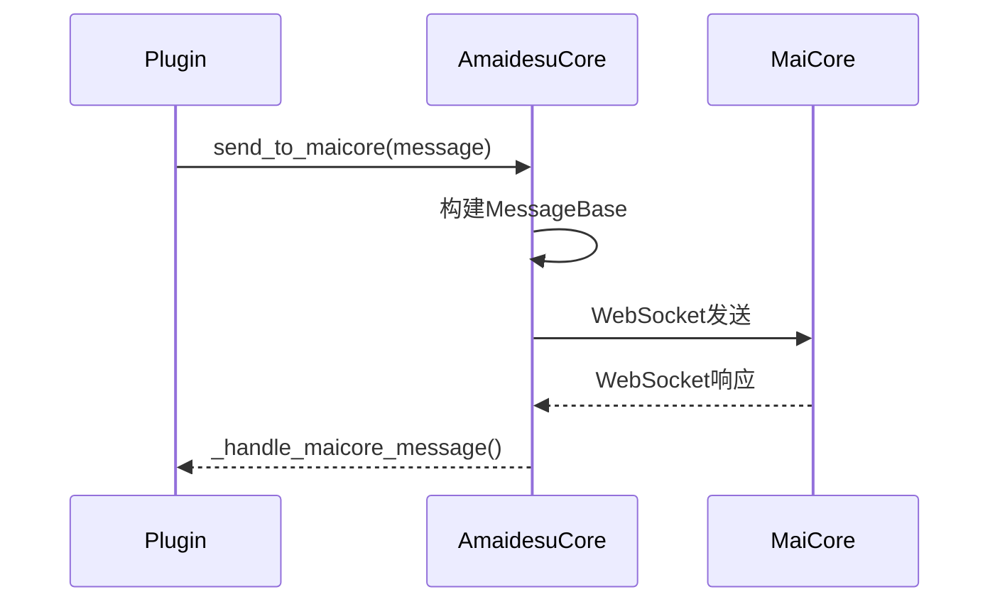
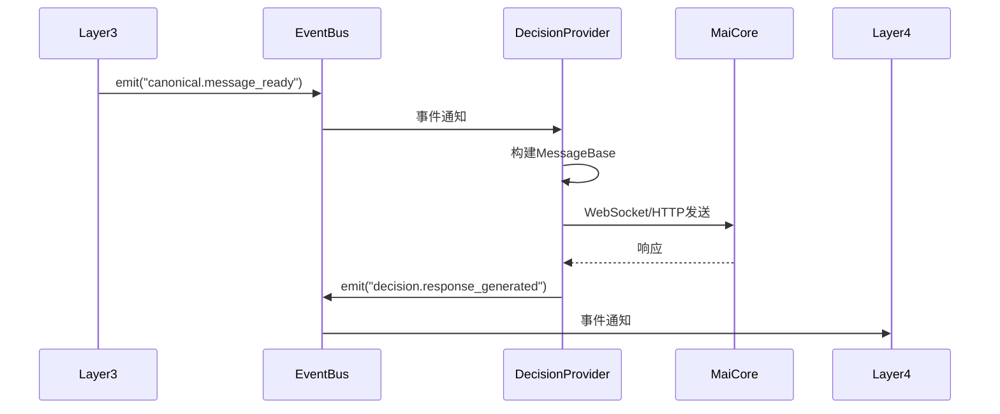
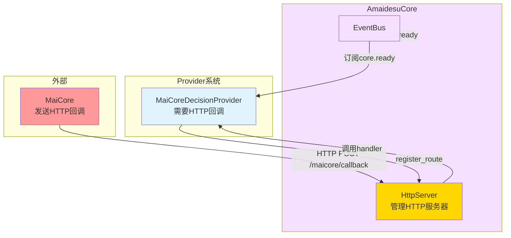

# AmaidesuCore重构设计

## 🎯 核心目标

AmaidesuCore从"管理外部通信"彻底解耦为"管理内部协调"，删除约500行WebSocket/HTTP代码，专注于EventBus、Pipeline、Context管理。

---

## 📊 重构概览

### 方案选择：完全解耦（方案1）

**决策原因**：
- 用户明确要求："让安装是最方便的，实现复杂性是可以接受的一次性努力"
- AmaidesuCore职责过重：同时管理外部通信和内部协调
- 解耦后：外部通信由DecisionProvider自己管理，AmaidesuCore只管内部协调

### 删除职责（约500行代码）

**删除的代码**：
- ❌ WebSocket连接管理（~150行）
- ❌ HTTP服务器管理（~100行）
- ❌ maim_message.Router相关（~150行）
- ❌ send_to_maicore()方法（~50行）
- ❌ _handle_maicore_message()方法（~50行）

### 保留职责（约300行代码）

**保留的代码**：
- ✅ EventBus管理（~100行）
- ✅ Pipeline管理（~100行）
- ✅ Context管理（~50行）
- ✅ Avatar管理器（~30行）
- ✅ LLM客户端管理（~20行）

### 新增职责（约50行代码）

**新增的代码**：
- ✅ DecisionManager集成（~50行）

---

## 🏗️ 重构后的AmaidesuCore

### 重构前 vs 重构后

#### 重构前（约800行代码）

```python
class AmaidesuCore:
    """核心模块 - 管理所有功能"""

    def __init__(self, config: dict):
        self.config = config
        self.plugins = []
        self.pipelines = []
        self.context = None
        self.event_bus = None

        # ❌ 外部通信管理
        self.router = None          # maim_message Router
        self.http_server = None     # HTTP服务器
        self.maicore_host = None    # MaiCore地址
        self.maicore_port = None    # MaiCore端口

    async def setup(self):
        """初始化所有功能"""
        # ✅ 内部协调
        self.event_bus = EventBus()
        self.pipeline_manager = PipelineManager()
        self.context_manager = ContextManager()

        # ❌ 外部通信管理
        await self._setup_maicore_connection()
        await self._setup_http_server()

    async def _setup_maicore_connection(self):
        """设置MaiCore连接（删除！）"""
        # WebSocket连接管理代码（~150行）
        pass

    async def _setup_http_server(self):
        """设置HTTP服务器（删除！）"""
        # HTTP服务器管理代码（~100行）
        pass

    async def send_to_maicore(self, message):
        """发送消息到MaiCore（删除！）"""
        # maim_message相关代码（~50行）
        pass

    async def _handle_maicore_message(self, message_data):
        """处理MaiCore消息（删除！）"""
        # 消息处理代码（~50行）
        pass
```

#### 重构后（约350行代码）

```python
class AmaidesuCore:
    """核心模块 - 只管内部协调"""

    def __init__(self, config: dict):
        self.config = config
        self.plugins = []
        self.pipelines = []
        self.context = None
        self.event_bus = None

        # ✅ 内部协调管理
        self.pipeline_manager = None
        self.context_manager = None
        self.avatar_manager = None
        self.llm_service = None

        # ✅ 决策层管理（新增）
        self.decision_manager = None

    async def setup(self):
        """初始化内部协调"""
        # ✅ 内部协调
        self.event_bus = EventBus()
        self.pipeline_manager = PipelineManager(self.event_bus)
        self.context_manager = ContextManager()
        self.avatar_manager = AvatarManager()
        self.llm_service = LLMService()

        # ✅ 决策层（新增）
        await self._setup_decision_layer()

    async def _setup_decision_layer(self):
        """设置决策层（新增！）"""
        # DecisionManager集成代码（~50行）
        provider_name = self.config.get("decision", {}).get("default_provider", "maicore")
        provider_config = self.config.get("decision", {}).get("providers", {}).get(provider_name, {})

        self.decision_manager = DecisionManager(self.event_bus)
        await self.decision_manager.setup(provider_name, provider_config)
```

---

## 🔄 通信模式变化

### 重构前：AmaidesuCore管理外部通信



**问题**：
- AmaidesuCore耦合外部通信细节
- 难以切换DecisionProvider
- 代码臃肿（800行）

### 重构后：DecisionProvider自己管理通信



**优势**：
- AmaidesuCore彻底解耦
- DecisionProvider可替换
- 代码精简（350行）

---

## 📁 AmaidesuCore目录结构

### 重构前

```
src/core/
├── amaidesu_core.py          # 800行，包含外部通信管理
├── plugin_manager.py
├── event_bus.py
├── pipeline_manager.py
├── context_manager.py
└── services/
    └── avatar_manager.py
```

### 重构后

```
src/core/
├── amaidesu_core.py          # 350行，只管内部协调
├── plugin_manager.py
├── event_bus.py
├── pipeline_manager.py
├── context_manager.py
├── decision_manager.py       # 新增：决策层管理
├── providers/                 # 新增：Provider基类
│   ├── input_provider.py
│   └── output_provider.py
└── services/
    ├── avatar_manager.py
    └── llm_client_manager.py
```

---

## 🔧 具体实现

### DecisionManager新增

```python
from typing import Dict, Optional
from src.core.event_bus import EventBus
from src.core.decision_provider import DecisionProvider, CanonicalMessage
from src.utils.logger import get_logger

class DecisionManager:
    """决策管理器 - 管理决策Provider"""

    def __init__(self, event_bus: EventBus):
        self.event_bus = event_bus
        self.logger = get_logger("DecisionManager")
        self._factory = DecisionProviderFactory()
        self._current_provider: DecisionProvider = None
        self._provider_name: str = None

    async def setup(self, provider_name: str, config: dict):
        """
        设置决策Provider

        Args:
            provider_name: Provider名称（maicore/local_llm/rule_engine）
            config: Provider配置
        """
        provider_class = self._factory._providers.get(provider_name)
        if not provider_class:
            raise ValueError(f"DecisionProvider not found: {provider_name}")

        if self._current_provider:
            await self._current_provider.cleanup()

        self._current_provider = provider_class(config)
        self._provider_name = provider_name
        await self._current_provider.setup(self.event_bus, config)

        self.logger.info(f"DecisionProvider已设置: {provider_name}")

    async def decide(self, canonical_message: CanonicalMessage):
        """
        进行决策

        Args:
            canonical_message: 标准化消息

        Returns:
            MessageBase: 决策结果
        """
        if not self._current_provider:
            raise RuntimeError("No decision provider configured")
        return await self._current_provider.decide(canonical_message)

    async def switch_provider(self, provider_name: str, config: dict):
        """
        切换决策Provider（运行时）

        Args:
            provider_name: 新Provider名称
            config: 新Provider配置
        """
        await self.setup(provider_name, config)
        self.logger.info(f"DecisionProvider已切换: {provider_name}")

    async def cleanup(self):
        """清理资源"""
        if self._current_provider:
            await self._current_provider.cleanup()
            self.logger.info("DecisionManager cleanup")
```

### AmaidesuCore重构后

```python
from typing import Dict, List, Optional
from src.core.event_bus import EventBus
from src.core.pipeline_manager import PipelineManager
from src.core.context_manager import ContextManager
from src.core.decision_manager import DecisionManager
from src.core.services.avatar_manager import AvatarManager
from src.core.llm_service import LLMService
from src.utils.logger import get_logger

class AmaidesuCore:
    """Amaidesu核心 - 只管内部协调"""

    def __init__(self, config: Dict):
        self.config = config
        self.logger = get_logger("AmaidesuCore")

        # 内部协调管理
        self.event_bus: Optional[EventBus] = None
        self.pipeline_manager: Optional[PipelineManager] = None
        self.context_manager: Optional[ContextManager] = None
        self.avatar_manager: Optional[AvatarManager] = None
        self.llm_service: Optional[LLMService] = None

        # 决策层管理（新增）
        self.decision_manager: Optional[DecisionManager] = None

    async def setup(self):
        """初始化内部协调"""
        # 初始化EventBus
        self.event_bus = EventBus()

        # 初始化内部协调管理器
        self.pipeline_manager = PipelineManager(self.event_bus)
        await self.pipeline_manager.setup(self.config.get("pipelines", {}))

        self.context_manager = ContextManager(self.event_bus)
        await self.context_manager.setup()

        self.avatar_manager = AvatarManager()
        await self.avatar_manager.setup(self.event_bus, self.config.get("avatar", {}))

        self.llm_service = LLMService()
        await self.llm_service.setup(self.config.get("llm", {}))

        # 初始化决策层（新增）
        await self._setup_decision_layer()

        self.logger.info("AmaidesuCore初始化完成")

    async def _setup_decision_layer(self):
        """设置决策层（新增！）"""
        decision_config = self.config.get("decision", {})
        provider_name = decision_config.get("default_provider", "maicore")
        provider_config = decision_config.get("providers", {}).get(provider_name, {})

        self.decision_manager = DecisionManager(self.event_bus)
        await self.decision_manager.setup(provider_name, provider_config)

        self.logger.info(f"决策层已初始化: {provider_name}")

    def get_event_bus(self) -> EventBus:
        """获取EventBus实例"""
        return self.event_bus

    def get_context_manager(self) -> ContextManager:
        """获取ContextManager实例"""
        return self.context_manager

    def get_avatar_manager(self) -> AvatarManager:
        """获取AvatarManager实例"""
        return self.avatar_manager

    def get_llm_service(self) -> LLMService:
        """获取LLM服务实例"""
        return self.llm_service

    def get_decision_manager(self) -> DecisionManager:
        """获取DecisionManager实例（新增）"""
        return self.decision_manager

    async def cleanup(self):
        """清理资源"""
        if self.decision_manager:
            await self.decision_manager.cleanup()

        if self.llm_service:
            await self.llm_service.cleanup()

        if self.avatar_manager:
            await self.avatar_manager.cleanup()

        if self.context_manager:
            await self.context_manager.cleanup()

        if self.pipeline_manager:
            await self.pipeline_manager.cleanup()

        self.logger.info("AmaidesuCore清理完成")
```

---

## 📋 配置变化

### 重构前配置

```toml
[core]
maicore_host = "localhost"
maicore_port = 8000
http_port = 8080
```

### 重构后配置

```toml
# 决策层配置（新增）
[decision]
default_provider = "maicore"  # 可切换为 local_llm 或 rule_engine

[decision.providers.maicore]
host = "localhost"
port = 8000

[decision.providers.local_llm]
model = "gpt-4"
api_key = "your_key"

[decision.providers.rule_engine]
rules_file = "rules.json"

# AmaidesuCore配置（简化）
[core]
# 不再需要maicore_host、maicore_port、http_port
```

---

---

## 🌐 HTTP服务器管理

### 1. 设计背景

**现状**：
- HTTP服务器在AmaidesuCore中管理
- 用于接收MaiCore的HTTP回调和提供Web API接口
- HTTP服务器与AmaidesuCore耦合

**问题**：
- HTTP服务器不应该属于AmaidesuCore的核心职责
- 多个Provider可能需要HTTP回调，职责不清晰
- 难以支持多个HTTP服务器实例

**解决方案**：
- HttpServer独立管理，作为AmaidesuCore的一部分
- AmaidesuCore管理HttpServer生命周期
- Provider通过register_route方法注册HTTP回调路由
- MaiCoreDecisionProvider通过EventBus获取AmaidesuCore实例

### 2. HttpServer接口

```python
from typing import Callable, Dict, Optional
from fastapi import FastAPI, Request, Response
from fastapi.responses import JSONResponse
import uvicorn

class HttpServer:
    """HTTP服务器（基于FastAPI）"""

    def __init__(self, host: str, port: int):
        self.host = host
        self.port = port
        self.app = FastAPI(title="Amaidesu HTTP Server")
        self.routes: Dict[str, Callable] = {}
        self._server_task = None
        self.logger = get_logger("HttpServer")

    def register_route(
        self,
        path: str,
        handler: Callable,
        methods: Optional[list] = None
    ):
        """
        注册路由

        Args:
            path: 路径（如 "/maicore/callback"）
            handler: 处理函数（签名为 async def handler(request: Request) -> Response）
            methods: 允许的HTTP方法（如 ["GET", "POST"]）
        """
        self.routes[path] = handler

        # 添加路由到FastAPI
        if methods:
            for method in methods:
                self.app.add_api_route(
                    path,
                    handler,
                    methods=[method],
                    response_class=JSONResponse
                )
        else:
            self.app.add_api_route(
                path,
                handler,
                response_class=JSONResponse
            )

        self.logger.debug(f"HTTP route registered: {path}")

    def add_health_check(self):
        """添加健康检查接口"""
        @self.app.get("/health")
        async def health_check():
            return {"status": "ok", "service": "amaidesu"}

    async def start(self):
        """启动HTTP服务器"""
        config = uvicorn.Config(
            self.app,
            host=self.host,
            port=self.port,
            log_level="info"
        )
        server = uvicorn.Server(config)
        self._server_task = asyncio.create_task(server.serve())
        self.logger.info(f"HTTP server started on {self.host}:{self.port}")

    async def stop(self):
        """停止HTTP服务器"""
        if self._server_task:
            self._server_task.cancel()
            try:
                await self._server_task
            except asyncio.CancelledError:
                pass
        self.logger.info("HTTP server stopped")
```

### 3. AmaidesuCore管理HttpServer

```python
class AmaidesuCore:
    """核心模块（管理HTTP服务器）"""

    def __init__(self, config: dict):
        self.config = config
        self.event_bus: Optional[EventBus] = None
        self.http_server: Optional[HttpServer] = None
        self.logger = get_logger("AmaidesuCore")

    async def setup(self):
        """初始化AmaidesuCore"""
        # 1. 初始化EventBus
        self.event_bus = EventBus()

        # 2. 启动HTTP服务器
        self.http_server = HttpServer(
            host=self.config.get("http_host", "0.0.0.0"),
            port=self.config.get("http_port", 8080)
        )

        # 3. 添加健康检查接口
        self.http_server.add_health_check()

        # 4. 将AmaidesuCore实例发布到EventBus（供Provider获取）
        await self.event_bus.emit("core.ready", {
            "core": self
        })

        # 5. 启动HTTP服务器任务
        await self.http_server.start()

    def register_http_callback(
        self,
        path: str,
        handler: Callable,
        methods: Optional[list] = None
    ):
        """注册HTTP回调路由"""
        if self.http_server:
            self.http_server.register_route(path, handler, methods)
            self.logger.debug(f"HTTP route registered: {path}")

    async def cleanup(self):
        """清理资源"""
        if self.http_server:
            await self.http_server.stop()
        if self.event_bus:
            await self.event_bus.cleanup()
```

### 4. MaiCoreDecisionProvider获取AmaidesuCore

```python
class MaiCoreDecisionProvider(DecisionProvider):
    """MaiCore决策提供者"""

    def __init__(self, config: dict):
        self.config = config
        self.core = None  # 将从EventBus获取
        self.router = None
        self.logger = get_logger("MaiCoreDecisionProvider")

    async def setup(self, event_bus: EventBus, config: dict):
        """初始化Provider"""
        self.event_bus = event_bus

        # 1. 订阅core.ready事件，获取AmaidesuCore实例
        event_bus.on("core.ready", self._on_core_ready)

        # 2. 等待AmaidesuCore就绪
        await self._wait_for_core()

        # 3. 注册HTTP回调路由
        if self.core:
            self.core.register_http_callback(
                path="/maicore/callback",
                handler=self._handle_http_callback,
                methods=["POST"]
            )

        # 4. 初始化WebSocket连接
        await self._setup_websocket()

    async def _on_core_ready(self, event: dict):
        """接收AmaidesuCore实例"""
        self.core = event.get("core")

    async def _wait_for_core(self):
        """等待AmaidesuCore就绪"""
        timeout = 30  # 等待30秒
        waited = 0
        while self.core is None and waited < timeout:
            await asyncio.sleep(0.1)
            waited += 0.1

        if self.core is None:
            raise RuntimeError("Failed to get AmaidesuCore instance")

    async def _handle_http_callback(self, request: Request) -> Response:
        """处理HTTP回调"""
        body = await request.json()
        self.logger.debug(f"Received HTTP callback: {body}")

        # 处理HTTP回调逻辑
        return JSONResponse({"status": "ok"})

    async def decide(self, canonical_message: CanonicalMessage) -> MessageBase:
        """决策"""
        # 实现决策逻辑
        pass

    async def cleanup(self):
        """清理资源"""
        if self.router:
            # 清理Router
            pass
```

### 5. HTTP服务器配置

```toml
[http]
host = "0.0.0.0"
port = 8080

[http.routes]
# 自动注册的路由（供参考）
health = "/health"
maicore_callback = "/maicore/callback"
```

### 6. HTTP服务器在新架构中的定位



### 7. HTTP服务器设计优势

**职责分离**：
- ✅ HttpServer独立管理，不属于AmaidesuCore的核心职责
- ✅ AmaidesuCore管理HttpServer生命周期，职责清晰
- ✅ Provider只负责业务逻辑，不关心HTTP服务器细节

**可复用性**：
- ✅ HttpServer可以被多个Provider使用
- ✅ HttpServer的生命周期由AmaidesuCore统一管理
- ✅ 易于扩展，支持Provider注册多个路由

**灵活性**：
- ✅ Provider只需注册HTTP回调路由，不关心HTTP服务器细节
- ✅ 支持多种HTTP方法（GET, POST, PUT, DELETE等）
- ✅ Provider可以通过EventBus获取AmaidesuCore实例

**现代化**：
- ✅ 基于FastAPI，支持类型验证
- ✅ 自动生成API文档（Swagger UI）
- ✅ 支持异步处理，性能优秀
- ✅ 社区活跃，生态系统完善

**易于测试**：
- ✅ HttpServer可以独立测试
- ✅ Provider的HTTP回调可以mock
- ✅ 支持单元测试和集成测试

### 8. 相关文档

- [HTTP服务器设计](./http_server.md) - 详细的HttpServer接口和实现

---

## ✅ 关键优势

### 1. 职责清晰
- ✅ AmaidesuCore只管内部协调
- ✅ DecisionProvider自己管理外部通信
- ✅ 代码结构更清晰

### 2. 代码精简
- ✅ 删除500行冗余代码
- ✅ 从800行精简到350行
- ✅ 维护成本降低

### 3. 可替换性
- ✅ DecisionProvider可替换
- ✅ 支持多种通信方式
- ✅ 运行时切换

### 4. 解耦性
- ✅ AmaidesuCore与外部通信彻底解耦
- ✅ 不关心WebSocket/HTTP细节
- ✅ 易于测试

---

## 🔗 相关文档

- [6层架构设计](./layer_refactoring.md)
- [决策层设计](./decision_layer.md)
- [多Provider并发设计](./multi_provider.md)
