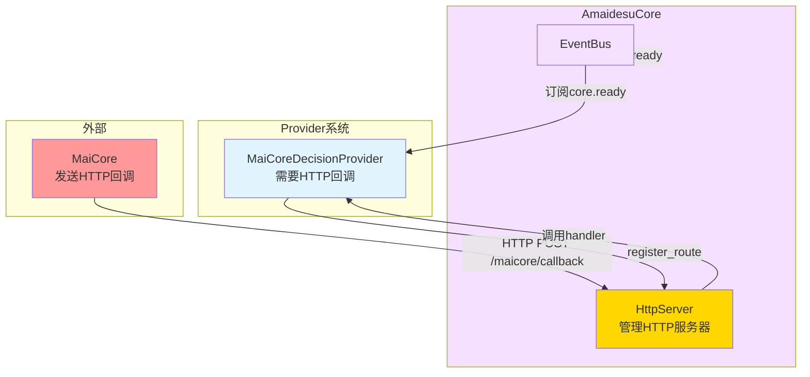
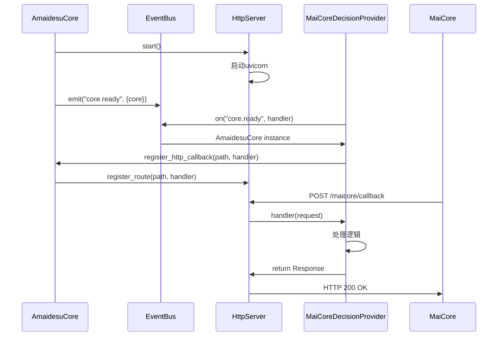

# HTTP服务器设计

## 🎯 核心目标

基于FastAPI构建独立的HTTP服务器，由AmaidesuCore管理生命周期，支持Provider注册HTTP回调路由，实现职责分离和可复用性。

---

## 📊 设计概览

### 1. 设计背景

**现状**：
- HTTP服务器在AmaidesuCore中管理
- 用于接收MaiCore的HTTP回调和提供Web API接口
- HTTP服务器与AmaidesuCore耦合

**问题**：
- HTTP服务器不应该属于AmaidesuCore的核心职责
- 多个Provider可能需要HTTP回调，职责不清晰
- 难以支持多个HTTP服务器实例

**解决方案**：
- HttpServer独立管理，作为AmaidesuCore的一部分
- AmaidesuCore管理HttpServer生命周期
- Provider通过register_route方法注册HTTP回调路由
- MaiCoreDecisionProvider通过EventBus获取AmaidesuCore实例

### 2. 设计原则

1. **职责分离**：HTTP服务器独立管理，Provider只负责业务逻辑
2. **可复用性**：多个Provider可以使用同一个HttpServer
3. **现代化**：基于FastAPI，支持类型验证和自动文档
4. **灵活性**：Provider只需注册路由，不关心HTTP服务器细节

---

## 🏗️ 接口设计

### HttpServer接口

```python
from typing import Callable, Dict, Optional
from fastapi import FastAPI, Request, Response
from fastapi.responses import JSONResponse
import uvicorn

class HttpServer:
    """HTTP服务器（基于FastAPI）"""

    def __init__(self, host: str, port: int):
        self.host = host
        self.port = port
        self.app = FastAPI(title="Amaidesu HTTP Server")
        self.routes: Dict[str, Callable] = {}
        self._server_task = None
        self.logger = get_logger("HttpServer")

    def register_route(
        self,
        path: str,
        handler: Callable,
        methods: Optional[list] = None
    ):
        """
        注册路由

        Args:
            path: 路径（如 "/maicore/callback"）
            handler: 处理函数（签名为 async def handler(request: Request) -> Response）
            methods: 允许的HTTP方法（如 ["GET", "POST"]）
        """
        self.routes[path] = handler

        # 添加路由到FastAPI
        if methods:
            for method in methods:
                self.app.add_api_route(
                    path,
                    handler,
                    methods=[method],
                    response_class=JSONResponse
                )
        else:
            self.app.add_api_route(
                path,
                handler,
                response_class=JSONResponse
            )

        self.logger.debug(f"HTTP route registered: {path}")

    def add_health_check(self):
        """添加健康检查接口"""
        @self.app.get("/health")
        async def health_check():
            return {"status": "ok", "service": "amaidesu"}

    async def start(self):
        """启动HTTP服务器"""
        config = uvicorn.Config(
            self.app,
            host=self.host,
            port=self.port,
            log_level="info"
        )
        server = uvicorn.Server(config)
        self._server_task = asyncio.create_task(server.serve())
        self.logger.info(f"HTTP server started on {self.host}:{self.port}")

    async def stop(self):
        """停止HTTP服务器"""
        if self._server_task:
            self._server_task.cancel()
            try:
                await self._server_task
            except asyncio.CancelledError:
                pass
        self.logger.info("HTTP server stopped")
```

### AmaidesuCore管理HttpServer

```python
class AmaidesuCore:
    """核心模块（管理HTTP服务器）"""

    def __init__(self, config: dict):
        self.config = config
        self.event_bus: Optional[EventBus] = None
        self.http_server: Optional[HttpServer] = None
        self.logger = get_logger("AmaidesuCore")

    async def setup(self):
        """初始化AmaidesuCore"""
        # 1. 初始化EventBus
        self.event_bus = EventBus()

        # 2. 启动HTTP服务器
        self.http_server = HttpServer(
            host=self.config.get("http_host", "0.0.0.0"),
            port=self.config.get("http_port", 8080)
        )

        # 3. 添加健康检查接口
        self.http_server.add_health_check()

        # 4. 将AmaidesuCore实例发布到EventBus（供Provider获取）
        await self.event_bus.emit("core.ready", {
            "core": self
        })

        # 5. 启动HTTP服务器任务
        await self.http_server.start()

        self.logger.info("AmaidesuCore initialization complete")

    def register_http_callback(
        self,
        path: str,
        handler: Callable,
        methods: Optional[list] = None
    ):
        """注册HTTP回调路由"""
        if self.http_server:
            self.http_server.register_route(path, handler, methods)
            self.logger.debug(f"HTTP route registered: {path}")

    async def cleanup(self):
        """清理资源"""
        if self.http_server:
            await self.http_server.stop()
        if self.event_bus:
            await self.event_bus.cleanup()
        self.logger.info("AmaidesuCore cleanup complete")
```

### MaiCoreDecisionProvider获取AmaidesuCore

```python
class MaiCoreDecisionProvider(DecisionProvider):
    """MaiCore决策提供者"""

    def __init__(self, config: dict):
        self.config = config
        self.core = None  # 将从EventBus获取
        self._core_ready_future = asyncio.Future()  # 使用Future避免竞态条件
        self.router = None
        self.logger = get_logger("MaiCoreDecisionProvider")

    async def setup(self, event_bus: EventBus, config: dict):
        """初始化Provider"""
        self.event_bus = event_bus

        # 1. 订阅core.ready事件，获取AmaidesuCore实例（同步）
        event_bus.on("core.ready", self._on_core_ready)

        # 2. 检查core是否已经ready（防止竞态条件）
        # 某些EventBus实现可能支持检查历史事件或查询当前状态
        # 如果EventBus不支持，则使用Future模式等待

        # 3. 等待AmaidesuCore就绪
        await self._wait_for_core()

        # 3. 注册HTTP回调路由
        if self.core:
            self.core.register_http_callback(
                path="/maicore/callback",
                handler=self._handle_http_callback,
                methods=["POST"]
            )

        # 4. 初始化WebSocket连接
        await self._setup_websocket()

        self.logger.info("MaiCoreDecisionProvider setup complete")

    async def _on_core_ready(self, event: dict):
        """接收AmaidesuCore实例"""
        core = event.get("core")

        # 如果Future已经set_result，说明core已经在其他地方设置过
        if not self._core_ready_future.done():
            self.core = core
            self._core_ready_future.set_result(core)
        else:
            # Future已经set_result，说明core已经在等待时设置过
            # 更新self.core
            self.core = core
        self.logger.info("Received AmaidesuCore instance")

    async def _wait_for_core(self):
        """等待AmaidesuCore就绪"""
        timeout = 30  # 等待30秒

        try:
            # 使用Future模式等待
            self.core = await asyncio.wait_for(self._core_ready_future, timeout=timeout)
        except asyncio.TimeoutError:
            raise RuntimeError("Failed to get AmaidesuCore instance within timeout")

        self.logger.info(f"AmaidesuCore ready after {waited}s")

    async def _handle_http_callback(self, request: Request) -> Response:
        """处理HTTP回调"""
        body = await request.json()

        # 处理HTTP回调逻辑
        self.logger.debug(f"Received HTTP callback: {body}")

        return JSONResponse({"status": "ok"})

    async def _setup_websocket(self):
        """初始化WebSocket连接"""
        # 复用现有Router代码
        from maim_message import Router, RouteConfig, TargetConfig

        ws_url = f"ws://{self.config.get('host', 'localhost')}:{self.config.get('port', 8000)}/ws"

        route_config = RouteConfig(
            route_config={
                "amaidesu": TargetConfig(url=ws_url, token=None)
            }
        )

        self.router = Router(route_config)
        self.router.register_class_handler(self._handle_maicore_message)

        self.logger.info(f"MaiCoreDecisionProvider WebSocket setup: {ws_url}")

    async def decide(self, canonical_message: CanonicalMessage) -> MessageBase:
        """决策"""
        # 实现决策逻辑
        pass

    async def cleanup(self):
        """清理资源"""
        if self.router:
            # 清理Router
            pass
        self.logger.info("MaiCoreDecisionProvider cleanup complete")
```

---

## 📊 HTTP服务器在新架构中的定位

### HttpServer数据流



### 通信时序图



---

## 📋 配置示例

### HTTP服务器配置

```toml
[http]
host = "0.0.0.0"
port = 8080

[http.routes]
# 自动注册的路由（供参考）
health = "/health"
maicore_callback = "/maicore/callback"
```

### MaiCoreDecisionProvider配置

```toml
[decision]
default_provider = "maicore"

[decision.providers.maicore]
host = "localhost"
port = 8000
http_enabled = true
http_callback_path = "/maicore/callback"
```

---

## ✅ 关键优势

### 1. 职责分离
- ✅ HttpServer独立管理，不属于AmaidesuCore的核心职责
- ✅ AmaidesuCore管理HttpServer生命周期，职责清晰
- ✅ Provider只负责业务逻辑，不关心HTTP服务器细节

### 2. 可复用性
- ✅ HttpServer可以被多个Provider使用
- ✅ HttpServer的生命周期由AmaidesuCore统一管理
- ✅ 易于扩展，支持Provider注册多个路由

### 3. 灵活性
- ✅ Provider只需注册HTTP回调路由，不关心HTTP服务器细节
- ✅ 支持多种HTTP方法（GET, POST, PUT, DELETE等）
- ✅ Provider可以通过EventBus获取AmaidesuCore实例

### 4. 现代化
- ✅ 基于FastAPI，支持类型验证
- ✅ 自动生成API文档（Swagger UI）
- ✅ 支持异步处理，性能优秀
- ✅ 社区活跃，生态系统完善

### 5. 易于测试
- ✅ HttpServer可以独立测试
- ✅ Provider的HTTP回调可以mock
- ✅ 支持单元测试和集成测试

---

## 🔗 相关文档

- [AmaidesuCore重构设计](./core_refactoring.md)
- [决策层设计](./decision_layer.md)
