# 5层架构设计

## 📋 核心概念

### 核心理念

**按AI VTuber数据处理的完整流程组织层级，每层有明确的输入和输出格式。**

- **不按技术模式("Provider"、"工厂")组织目录**
- **每层输出格式统一且明确**
- **层级间单向依赖，消除循环耦合**
- **保留原始结构化数据，不丢失信息**

---

## 🏗️ 5层架构详细设计

| 层级             | 英文名         | 输入格式             | 输出格式           | 核心职责                   | 设计理由                       |
| ---------------- | -------------- | -------------------- | ------------------ | -------------------------- | ------------------------------ |
| **1. 输入感知**  | Input          | 外部数据             | RawData           | 获取外部原始数据           | 按数据源分离输入源             |
| **2. 标准化**    | Normalization  | RawData              | NormalizedMessage | 提取文本+保留结构化数据     | 统一格式，为后续处理提供完整信息 |
| **3. 决策**      | Decision       | NormalizedMessage    | **Intent**        | 可替换的决策（异步返回）    | MaiCore/本地LLM/规则引擎      |
| **4. 参数生成**  | Parameters     | Intent               | RenderParameters  | 生成渲染参数               | 驱动层只输出参数              |
| **5. 渲染呈现**  | Rendering      | RenderParameters     | 输出              | 最终渲染输出               | 渲染层只管渲染                |

---

## 📊 架构图

```mermaid
graph TB
    subgraph "Amaidesu: 核心数据流"
        subgraph "Layer 1: Input（多Provider并发）"
            InputLayer[弹幕/游戏/语音<br/>多个InputProvider并发采集<br/>配置驱动启用]
        end

        subgraph "Layer 2: Normalization"
            Normalization[提取文本+保留结构<br/>NormalizedMessage]
        end

        subgraph "Pre-Pipeline"
            PrePipeline[限流/过滤/相似文本检测]
        end

        subgraph "Layer 3: Decision（可替换）"
            DecisionLayer[DecisionProvider<br/>MaiCore/本地LLM/规则引擎<br/>异步返回+LLM意图解析<br/>配置驱动切换]
        end

        subgraph "Post-Pipeline（可选）"
            PostPipeline[格式清理/安全检查]
        end

        subgraph "Layer 4: Parameters"
            ParametersLayer[生成RenderParameters]
        end

        subgraph "Layer 5: Rendering（多Provider并发）"
            Rendering[字幕/TTS/VTS<br/>多个OutputProvider并发渲染<br/>配置驱动启用]
        end
    end

    InputLayer -->|"RawData"| Normalization
    Normalization -->|"NormalizedMessage"| PrePipeline
    PrePipeline -->|"NormalizedMessage'"| DecisionLayer
    DecisionLayer -->|"Intent"| PostPipeline
    PostPipeline -->|"Intent'"| ParametersLayer
    ParametersLayer -->|"RenderParameters"| Rendering

    style InputLayer fill:#e1f5ff
    style Normalization fill:#fff4e1
    style PrePipeline fill:#ffd700
    style DecisionLayer fill:#ff9999,stroke:#ff0000,stroke-width:3px
    style PostPipeline fill:#ffd700
    style ParametersLayer fill:#e1ffe1
    style Rendering fill:#e1f5ff
```



---

## 📁 目录结构

```
src/
├── data_types/
│   ├── raw_data.py
│   └── normalized_message.py
│
├── layers/
│   ├── input/                   # Layer 1: 输入感知
│   │   ├── input_layer.py
│   │   └── providers/
│   │       ├── console_input_provider.py
│   │       └── bili_danmaku_provider.py
│   │
│   ├── normalization/           # Layer 2: 标准化
│   │   ├── normalization_layer.py
│   │   ├── normalized_message.py
│   │   ├── content/            # StructuredContent类型
│   │   │   ├── base.py
│   │   │   ├── text_content.py
│   │   │   ├── gift_content.py
│   │   │   └── super_chat_content.py
│   │   └── parsers/            # ContentParser
│   │       └── content_parser.py
│   │
│   ├── decision/                # Layer 3: 决策
│   │   ├── decision_manager.py
│   │   ├── intent_parser.py    # LLM意图解析器
│   │   └── providers/
│   │       ├── maicore_decision_provider.py
│   │       ├── local_llm_decision_provider.py
│   │       └── rule_engine_decision_provider.py
│   │
│   ├── parameters/              # Layer 4: 参数生成
│   │   ├── parameters_layer.py
│   │   ├── emotion_mapper.py
│   │   ├── action_mapper.py
│   │   └── expression_mapper.py
│   │
│   └── rendering/               # Layer 5: 渲染呈现
│       ├── rendering_manager.py
│       └── providers/
│           ├── tts_provider.py
│           ├── subtitle_provider.py
│           └── vts_provider.py
│
└── core/
    └── pipelines/               # 3类Pipeline系统
        ├── pre/                 # Pre-Pipeline（处理NormalizedMessage）
        │   ├── rate_limit_pipeline.py
        │   ├── filter_pipeline.py
        │   └── similar_text_pipeline.py
        ├── post/                # Post-Pipeline（处理Intent，可选）
        │   └── format_cleanup_pipeline.py
        └── render/              # Render-Pipeline（处理Intent，可选）
            └── emotion_smoothing_pipeline.py
```

---

## 💎 NormalizedMessage设计

### 核心改进

**问题**：原设计Layer 2提取文本后丢弃结构化数据，导致信息丢失

**解决**：NormalizedMessage同时保留文本和原始结构化数据

### 数据结构

```python
from dataclasses import dataclass
from typing import Any, Dict, Optional
import time

@dataclass
class NormalizedMessage:
    """标准化消息（Layer 2: Normalization的输出）

    核心改进：
    - text: 用于LLM处理的文本描述
    - content: 保留原始结构化数据（不丢失信息）
    - importance: 预计算的重要性（0-1）
    """
    text: str                    # "张三 送出了 1 个 火箭"
    content: StructuredContent    # 原始结构化数据
    source: str                  # "bili_danmaku"
    data_type: str               # "gift"
    importance: float            # 0.6 (自动计算)
    metadata: Dict[str, Any]
    timestamp: float = field(default_factory=time.time)

    def to_message_base(self) -> Optional["MessageBase"]:
        """转换为MessageBase（仅MaiCoreDecisionProvider需要）"""
        # 转换逻辑...
```

### StructuredContent类型化设计

```python
from abc import ABC, abstractmethod
from typing import Optional

class StructuredContent(ABC):
    """结构化内容基类（方法多态）"""
    type: str

    @abstractmethod
    def get_importance(self) -> float:
        """获取重要性（0-1）"""
        pass

    @abstractmethod
    def get_display_text(self) -> str:
        """获取显示文本"""
        pass

    def get_user_id(self) -> Optional[str]:
        """获取用户ID（可选重写）"""
        return None

    def requires_special_handling(self) -> bool:
        """是否需要特殊处理（可选重写）"""
        return self.get_importance() > 0.8

@dataclass
class TextContent(StructuredContent):
    """文本内容"""
    type: str = "text"
    text: str
    user: Optional[str] = None
    user_id: Optional[str] = None

    def get_importance(self) -> float:
        return 0.3  # 文本消息的基础重要性

    def get_display_text(self) -> str:
        return self.text

@dataclass
class GiftContent(StructuredContent):
    """礼物内容"""
    type: str = "gift"
    user: str
    user_id: str
    gift_name: str
    gift_level: int
    count: int
    value: float
    importance: float = 0.0

    def __post_init__(self):
        # 自动计算重要性
        base = min(self.gift_level / 10, 1.0)
        value_boost = min(self.value / 10000, 0.3)
        count_boost = min(self.count / 10, 0.2)
        self.importance = min(base + value_boost + count_boost, 1.0)

    def get_importance(self) -> float:
        return self.importance

    def get_display_text(self) -> str:
        return f"{self.user} 送出了 {self.count} 个 {self.gift_name}"

    def get_user_id(self) -> Optional[str]:
        return self.user_id

    def requires_special_handling(self) -> bool:
        # 高价值礼物需要特殊处理
        return self.importance > 0.7

@dataclass
class SuperChatContent(StructuredContent):
    """醒目留言内容"""
    type: str = "super_chat"
    user: str
    user_id: str
    amount: float
    content: str

    def get_importance(self) -> float:
        return min(self.amount / 100, 1.0)  # 100元=1.0

    def get_display_text(self) -> str:
        return f"醒目留言: {self.content}"
```

### 方法多态示例（避免isinstance）

```python
# ✅ 好的做法：方法多态
class ImportanceFilterPipeline(PrePipeline):
    async def process(self, message: NormalizedMessage) -> Optional[NormalizedMessage]:
        # 不需要 isinstance
        importance = message.content.get_importance()
        if importance < 0.3:
            return None  # 丢弃
        return message

class HighValueAlertPipeline(PrePipeline):
    async def process(self, message: NormalizedMessage) -> Optional[NormalizedMessage]:
        # 直接调用方法
        if message.content.requires_special_handling():
            await self.trigger_alert(
                user_id=message.content.get_user_id(),
                text=message.content.get_display_text()
            )
        return message

# ❌ 不好的做法：isinstance
if isinstance(message.content, GiftContent):
    # 处理礼物...
```

---

## 🔧 Pipeline系统

### 3类Pipeline

| 类型 | 位置 | 处理对象 | 示例 | 必需 |
|------|------|---------|------|------|
| **Pre-Pipeline** | Layer 2之后 | NormalizedMessage | 限流、敏感词过滤、相似文本检测 | ✅ 是 |
| **Post-Pipeline** | Layer 3之后 | Intent | 格式清理、安全检查 | ⚠️ 可选 |
| **Render-Pipeline** | Layer 4之后 | Intent | 情感平滑、动作控制 | ⚠️ 可选 |

### Pre-Pipeline接口

```python
class PrePipeline(Protocol):
    """预处理Pipeline（Layer 2之后）"""

    priority: int
    enabled: bool = True

    async def process(
        self,
        message: NormalizedMessage
    ) -> Optional[NormalizedMessage]:
        """
        处理标准化消息

        Returns:
            处理后的消息，或None表示丢弃
        """
        ...
```

### 实现示例

```python
class ImportanceFilterPipeline(PrePipeline):
    """基于重要性的过滤"""
    priority = 100

    async def process(self, message: NormalizedMessage) -> Optional[NormalizedMessage]:
        if message.importance < 0.3:
            return None  # 丢弃低价值消息
        return message

class HighValueAlertPipeline(PrePipeline):
    """高价值提醒"""
    priority = 200

    async def process(self, message: NormalizedMessage) -> Optional[NormalizedMessage]:
        if message.content.requires_special_handling():
            await self.trigger_alert(message)
        return message
```

---

## 🔑 核心概念

### 1. Provider（提供者）

| 类型 | 位置 | 职责 | 示例 |
|------|------|------|------|
| **InputProvider** | Layer 1 | 接收外部数据，生成RawData | ConsoleInputProvider, MinecraftEventProvider |
| **OutputProvider** | Layer 5 | 接收渲染参数，执行实际输出 | VTSRenderer, SubtitleRenderer, TTSRenderer |

### 2. Intent意图对象（Layer 3输出）

```python
@dataclass
class Intent:
    """意图对象（Layer 3: Decision的输出）"""
    original_text: str           # 原始输入文本
    response_text: str           # AI回复文本
    emotion: EmotionType         # 情感（NEUTRAL/HAPPY/SAD/ANGRY/SURPRISED/LOVE）
    actions: List[IntentAction]  # 动作列表
    metadata: Dict[str, Any]     # 元数据

class EmotionType(Enum):
    NEUTRAL = "neutral"
    HAPPY = "happy"
    SAD = "sad"
    ANGRY = "angry"
    SURPRISED = "surprised"
    LOVE = "love"
```

### 3. RenderParameters渲染参数（Layer 4输出）

```python
@dataclass
class RenderParameters:
    """渲染参数（Layer 4: Parameters的输出）"""
    expressions: Dict[str, float]  # 表情参数
    tts_text: Optional[str]         # TTS文本
    subtitle_text: Optional[str]    # 字幕文本
    hotkeys: List[str]              # 热键列表
```

---

## 🔑 关键设计决策

### 1. 合并Layer 2和Layer 3

**决策**: 将原7层架构的Layer 2（Normalization）和Layer 3（Canonical）合并

**理由**:
- 原设计Layer 2提取文本后丢弃结构，Layer 3重新构建，造成信息丢失
- 新设计Layer 2直接输出NormalizedMessage，同时保留文本和结构化数据
- 消除职责重复，简化架构

### 2. DecisionProvider直接返回Intent

**决策**: DecisionProvider接口返回Intent，而不是MessageBase

**理由**:
- "决策"本身就应该返回"意图"，而不是需要进一步解析的消息
- MaiCoreDecisionProvider内部负责MessageBase → Intent的转换
- 去掉UnderstandingLayer，简化架构

### 3. LLM意图解析

**决策**: 使用小参数LLM解析MaiCore的文本回复为Intent

**理由**:
- MaiCore是群聊机器人，不适合直接输出JSON
- LLM解析比正则表达式和关键词匹配更智能、更灵活
- 成本可控（小LLM成本约$0.0001/1K tokens）

详见：[决策层设计 - LLM意图解析](./decision_layer.md#llm意图解析)

### 4. 驱动与渲染分离（Layer 4 & 5）

**设计初衷**："虽然都是虚拟形象，但**驱动层只输出参数，渲染层只管渲染**。这都不分开，以后换个模型或者引擎难道要重写一遍？"

- **Layer 4 (Parameters)**: 生成抽象的表现参数（表情参数、热键、TTS文本）
- **Layer 5 (Rendering)**: 接收参数进行实际渲染（VTS调用、音频播放、字幕显示）

---

## ✅ 成功标准

### 技术指标
- ✅ 所有现有功能正常运行
- ✅ 配置文件行数减少40%以上
- ✅ 核心功能响应时间无增加
- ✅ 代码重复率降低30%以上
- ✅ 服务注册调用减少80%以上
- ✅ EventBus事件调用覆盖率90%以上

### 架构指标
- ✅ 清晰的5层核心数据流架构
- ✅ 层级间依赖关系清晰（单向依赖）
- ✅ EventBus为内部主要通信模式
- ✅ Provider模式替代重复插件
- ✅ 工厂模式支持动态切换
- ✅ 结构化消息保留原始数据（不丢失信息）
- ✅ 方法多态替代isinstance
- ✅ LLM意图解析（比规则更智能）

---

## 🔗 相关文档

- [设计总览](./overview.md)
- [决策层设计](./decision_layer.md)（含LLM意图解析）
- [多Provider并发设计](./multi_provider.md)
- [核心重构设计](./core_refactoring.md)
- [Pipeline重新设计](./pipeline_refactoring.md)

**已移除的文档**：
- [插件系统设计](./plugin_system.md) - 已完全移除，插件系统不再存在
