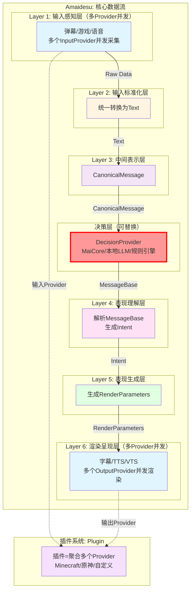

# 6层架构设计

## 📋 核心概念

### 核心理念

**按AI VTuber数据处理的完整流程组织层级，每层有明确的输入和输出格式。**

- **不按技术模式("Provider"、"工厂")组织目录**
- **每层输出格式统一且明确**
- **层级间单向依赖，消除循环耦合**

---

## 🏗️ 6层架构详细设计

| 层级                | 英文名        | 输入格式         | 输出格式             | 核心职责          | 设计理由                                       |
| ------------------- | ------------- | ---------------- | -------------------- | ----------------- | ---------------------------------------------- |
| **1. 输入感知层**   | Perception    | -                | Raw Data             | 获取外部原始数据  | 按数据源(音频/文本/图像)分离输入源             |
| **2. 输入标准化层** | Normalization | Raw Data         | **Text**             | 统一转换为文本    | 为决策层准备标准化输入                         |
| **3. 中间表示层**   | Canonical     | Text             | **CanonicalMessage** | 统一消息格式      | 标准化数据结构，发送给决策层进行决策         |
| **4. 表现理解层**   | Understanding | MessageBase       | **Intent**            | 解析决策层返回      | 接收DecisionProvider返回，理解表现意图和渲染需求         |
| **5. 表现生成层**   | Expression    | Intent             | **RenderParameters**  | 生成各种表现参数  | **驱动层只输出参数**，符合设计讨论中的分离原则 |
| **6. 渲染呈现层**   | Rendering     | RenderParameters | **Frame/Stream**     | 最终渲染输出      | **渲染层只管渲染**，换引擎不用重写             |

---

## 📊 架构图



---

## 📁 目录结构

```
src/
├── perception/                    # Layer 1: 输入感知
│   ├── text/
│   │   ├── console_input.py
│   │   └── danmaku/
│   ├── audio/
│   └── input_factory.py
│
├── normalization/                 # Layer 2: 输入标准化
│   ├── text_normalizer.py
│   ├── audio_to_text.py
│   └── normalizer_factory.py
│
├── canonical/                     # Layer 3: 中间表示
│   ├── canonical_message.py
│   ├── message_builder.py
│   └── maicore_adapter.py
│
├── understanding/                 # Layer 4: 表现理解
│   ├── response_parser.py
│   ├── text_cleanup.py
│   └── emotion_judge.py
│
├── expression/                    # Layer 5: 表现生成
│   ├── expression_generator.py
│   ├── tts_module.py
│   └── action_mapper.py
│
└── rendering/                     # Layer 6: 渲染呈现
    ├── subtitle_renderer.py
    ├── audio_renderer.py
    └── virtual_renderer.py
```

---

## 🔑 核心概念

### 1. Provider（提供者）

**定义**：标准化的原子能力，分为两类：

| 类型               | 位置    | 职责                       | 示例                                         |
| ------------------ | ------- | -------------------------- | -------------------------------------------- |
| **InputProvider**  | Layer 1 | 接收外部数据，生成RawData  | ConsoleInputProvider, MinecraftEventProvider |
| **OutputProvider** | Layer 6 | 接收渲染参数，执行实际输出 | VTSRenderer, MinecraftCommandProvider        |

**特点**：
- ✅ 标准化接口：所有Provider都实现统一的接口
- ✅ 可替换性：同一功能的不同实现可以切换
- ✅ 易测试性：每个Provider可以独立测试
- ✅ 职责单一：每个Provider只负责一个能力

### 2. Intent意图对象(Layer 4输出)

**定义**：Layer 4的输出格式，用于传递表现意图

```python
# 核心概念（伪代码，完整实现见implementation_plan.md）
class Intent:
    """意图对象 - Layer 4的输出格式"""
    # 包含：original_text、emotion、response_text、actions、metadata

class EmotionType:
    """情感类型枚举"""
    # NEUTRAL, HAPPY, SAD, ANGRY, SURPRISED等
```

**注意**：即使MaiCore返回的是MessageBase，我们内部仍然需要"意图"的概念。Layer 4的职责是：
1. 接收MessageBase（来自决策层）
2. 解析文本内容和元数据
3. 生成内部统一的Intent对象

### 3. RenderParameters渲染参数(Layer 5输出)

**定义**：Layer 5的输出格式，用于传递渲染参数

```python
# 核心概念（伪代码，完整实现见implementation_plan.md）
class RenderParameters:
    """渲染参数 - Layer 5的输出格式"""
    # 包含：expressions(表情)、tts_text(语音)、subtitle_text(字幕)、hotkeys
```

---

## 🔑 关键设计决策

### 1. 统一转换为文本(Layer 2)

**决策**:所有输入统一转换为Text格式

**理由**:

- 简化后续处理流程
- 为决策层准备标准化输入
- 图像/音频通过VL模型转换为文本描述
- 降低系统复杂度

### 2. 驱动与渲染分离(Layer 5 & 6)

**设计初衷**："虽然都是虚拟形象，但**驱动层只输出参数，渲染层只管渲染**。这都不分开，以后换个模型或者引擎难道要重写一遍？"

- **Layer 5 (Expression)**: 生成抽象的表现参数（表情参数、热键、TTS文本）
- **Layer 6 (Rendering)**: 接收参数进行实际渲染（VTS调用、音频播放、字幕显示）

---

## ✅ 成功标准

### 技术指标
- ✅ 所有现有功能正常运行
- ✅ 配置文件行数减少40%以上
- ✅ 核心功能响应时间无增加
- ✅ 代码重复率降低30%以上
- ✅ 服务注册调用减少80%以上
- ✅ EventBus事件调用覆盖率90%以上

### 架构指标
- ✅ 清晰的6层核心数据流架构
- ✅ 层级间依赖关系清晰(单向依赖)
- ✅ EventBus为内部主要通信模式
- ✅ Provider模式替代重复插件
- ✅ 工厂模式支持动态切换

---

## 🔗 相关文档

- [设计总览](./overview.md)
- [决策层设计](./decision_layer.md)
- [多Provider并发设计](./multi_provider.md)
- [插件系统设计](./plugin_system.md)
- [核心重构设计](./core_refactoring.md)
