# 7层架构设计

## 📋 核心概念

### 核心理念

**按AI VTuber数据处理的完整流程组织层级，每层有明确的输入和输出格式。**

- **不按技术模式("Provider"、"工厂")组织目录**
- **每层输出格式统一且明确**
- **层级间单向依赖，消除循环耦合**

---

## 🏗️ 7层架构详细设计

| 层级                | 英文名        | 输入格式         | 输出格式             | 核心职责         | 设计理由                                         |
| ------------------- | ------------- | ---------------- | -------------------- | ---------------- | ------------------------------------------------ |
| **1. 输入感知层**   | Perception    | -                | Raw Data             | 获取外部原始数据 | 按数据源(音频/文本/图像)分离输入源               |
| **2. 输入标准化层** | Normalization | Raw Data         | **Text**             | 统一转换为文本   | 为决策层准备标准化输入                           |
| **3. 中间表示层**   | Canonical     | Text             | **CanonicalMessage** | 统一消息格式     | 标准化数据结构，发送给决策层进行决策             |
| **4. 决策层**       | Decision      | CanonicalMessage | **MessageBase**      | 可替换的决策     | MaiCore/本地LLM/规则引擎，输出回复与表现指令     |
| **5. 表现理解层**   | Understanding | MessageBase      | **Intent**           | 解析决策返回     | 接收DecisionProvider返回，理解表现意图和渲染需求 |
| **6. 表现生成层**   | Expression    | Intent           | **RenderParameters** | 生成各种表现参数 | **驱动层只输出参数**，符合设计讨论中的分离原则   |
| **7. 渲染呈现层**   | Rendering     | RenderParameters | **Frame/Stream**     | 最终渲染输出     | **渲染层只管渲染**，换引擎不用重写               |

---

## 📊 架构图

```mermaid
graph TB
    subgraph "Amaidesu: 核心数据流"
        subgraph "Layer 1: 输入感知层（多Provider并发）"
            Perception[弹幕/游戏/语音<br/>多个InputProvider并发采集]
        end

        subgraph "Layer 2: 输入标准化层"
            Normalization[统一转换为Text]
        end

        subgraph "Layer 3: 中间表示层"
            Canonical[CanonicalMessage]
        end

        subgraph "Layer 4: 决策层（可替换）"
            DecisionLayer[DecisionProvider<br/>MaiCore/本地LLM/规则引擎]
        end

        subgraph "Layer 5: 表现理解层"
            Understanding[解析MessageBase<br/>生成Intent]
        end

        subgraph "Layer 6: 表现生成层"
            Expression[生成RenderParameters]
        end

        subgraph "Layer 7: 渲染呈现层（多Provider并发）"
            Rendering[字幕/TTS/VTS<br/>多个OutputProvider并发渲染]
        end
    end

    subgraph "插件系统: Plugin"
        Plugins[插件=聚合多个Provider<br/>Minecraft/自定义]
    end

    Perception -->|"Raw Data"| Normalization
    Normalization -->|"Text"| Canonical
    Canonical -->|"CanonicalMessage"| DecisionLayer
    DecisionLayer -->|"MessageBase"| Understanding
    Understanding -->|"Intent"| Expression
    Expression -->|"RenderParameters"| Rendering

    Perception -.输入Provider.-> Plugins
    Rendering -.输出Provider.-> Plugins

    style Perception fill:#e1f5ff
    style Normalization fill:#fff4e1
    style Canonical fill:#f3e5f5
    style DecisionLayer fill:#ff9999,stroke:#ff0000,stroke-width:3px
    style Understanding fill:#ffe1f5
    style Expression fill:#e1ffe1
    style Rendering fill:#e1f5ff
    style Plugins fill:#f5e1ff
```



---

## 📁 目录结构

```
src/
├── perception/                    # Layer 1: 输入感知
│   ├── text/
│   │   ├── console_input.py
│   │   └── danmaku/
│   ├── audio/
│   └── input_factory.py
│
├── normalization/                 # Layer 2: 输入标准化
│   ├── text_normalizer.py
│   ├── audio_to_text.py
│   └── normalizer_factory.py
│
├── canonical/                     # Layer 3: 中间表示
│   ├── canonical_message.py
│   ├── message_builder.py
│   └── maicore_adapter.py
│
├── understanding/                 # Layer 5: 表现理解
│   ├── response_parser.py
│   ├── text_cleanup.py
│   └── emotion_judge.py
│
├── expression/                    # Layer 6: 表现生成
│   ├── expression_generator.py
│   ├── tts_module.py
│   └── action_mapper.py
│
└── rendering/                     # Layer 7: 渲染呈现
    ├── subtitle_renderer.py
    ├── audio_renderer.py
    └── virtual_renderer.py
```

---

## 💾 元数据和原始数据管理

### 1. 设计背景

**问题**：
- Layer 2统一转Text，但某些场景（如图像输入）需要保留原始数据
- EventBus传递原始大对象（图像、音频）会影响性能
- 需要按需加载，避免内存浪费

**解决方案**：
- NormalizedText包含data_ref（引用）而非原始数据
- 原始数据存储在DataCache中
- 通过引用按需加载

### 2. NormalizedText结构

```python
from dataclasses import dataclass
from typing import Optional, Any, Dict

@dataclass
class NormalizedText:
    """标准化文本"""
    text: str                    # 文本描述
    metadata: Dict[str, Any]      # 元数据（必需）
    data_ref: Optional[str] = None  # 原始数据引用（可选）

    # 示例：图像输入
    # NormalizedText(
    #     text="用户发送了一张猫咪图片",
    #     metadata={
    #         "type": "image",
    #         "format": "jpeg",
    #         "size": 102400,
    #         "timestamp": 1234567890
    #     },
    #     data_ref="cache://image/abc123"  # 引用，不是实际数据
    # )

    # 示例：文本输入（不需要保留原始数据）
    # NormalizedText(
    #     text="用户说：你好",
    #     metadata={
    #         "type": "text",
    #         "source": "danmaku",
    #         "timestamp": 1234567890
    #     },
    #     data_ref=None
    # )
```

### 3. Layer 2使用DataCache

```python
class Normalizer:
    """输入标准化层"""

    def __init__(self, event_bus: EventBus, data_cache: DataCache):
        self.event_bus = event_bus
        self.data_cache = data_cache  # 数据缓存服务

    async def normalize(self, raw_data: RawData) -> NormalizedText:
        """标准化原始数据"""

        # 1. 转换为文本
        text = await self._to_text(raw_data.content)

        # 2. 如果需要保留原始数据，放入缓存
        data_ref = None
        if raw_data.preserve_original:
            data_ref = await self.data_cache.store(
                data=raw_data.original_data,
                ttl=300,  # 5分钟
                tags={
                    "type": raw_data.type,
                    "source": raw_data.source
                }
            )

        # 3. 创建NormalizedText
        normalized = NormalizedText(
            text=text,
            metadata={
                "type": raw_data.type,
                "source": raw_data.source,
                "timestamp": raw_data.timestamp
            },
            data_ref=data_ref
        )

        # 4. 发布事件（只传递NormalizedText，不传递原始数据）
        await self.event_bus.emit("normalization.text.ready", {
            "normalized": normalized
        })

        return normalized
```

### 4. Layer 5 访问原始数据

```python
class Understanding:
    """表现理解层"""

    def __init__(self, event_bus: EventBus, data_cache: DataCache):
        self.event_bus = event_bus
        self.data_cache = data_cache

    async def on_text_ready(self, event: dict):
        """处理文本就绪事件"""
        normalized: NormalizedText = event.get("normalized")

        # 1. 处理文本
        text = normalized.text
        metadata = normalized.metadata

        # 2. 如果需要访问原始数据，通过引用获取
        image_features = None
        if normalized.data_ref:
            try:
                original_data = await self.data_cache.retrieve(normalized.data_ref)
                # 使用原始数据进行多模态处理
                image_features = await self._extract_image_features(original_data)
            except NotFoundError:
                # 数据已过期，使用文本处理
                self.logger.warning(f"Original data expired: {normalized.data_ref}")
                image_features = None

        # 3. 生成Intent
        intent = await self._generate_intent(text, metadata, image_features)

        # 4. 发布事件
        await self.event_bus.emit("understanding.intent.ready", {
            "intent": intent
        })
```

### 5. DataCache配置

```toml
[data_cache]
# TTL默认5分钟
ttl_seconds = 300

# 最大100MB
max_size_mb = 100

# 最多1000个条目
max_entries = 1000

# 淘汰策略：TTL或LRU任一触发
eviction_policy = "ttl_or_lru"  # ttl_only | lru_only | ttl_or_lru | ttl_and_lru
```

### 6. 关键优势

**性能优化**：
- ✅ EventBus传递轻量级的NormalizedText对象
- ✅ 原始数据存储在DataCache中，不占用EventBus带宽
- ✅ 按需加载，只有需要时才从缓存中获取

**生命周期管理**：
- ✅ DataCache自动管理原始数据的生命周期（TTL过期自动删除）
- ✅ 避免内存泄漏
- ✅ 可配置的TTL，适应不同场景

**灵活性**：
- ✅ 不需要保留原始数据时，data_ref=None，不占用缓存
- ✅ 需要保留时，通过data_ref按需加载
- ✅ 支持多种数据类型（bytes, Image, Audio等）

**可测试性**：
- ✅ DataCache可以mock，易于单元测试
- ✅ NormalizedText是纯数据结构，易于验证

### 7. 相关文档

- [DataCache设计](./data_cache.md) - 详细的DataCache接口和实现
- [多Provider并发设计](./multi_provider.md)
- [插件系统设计](./plugin_system.md)

---

## 🔑 核心概念

### 1. Provider（提供者）

**定义**：标准化的原子能力，分为两类：

| 类型               | 位置    | 职责                       | 示例                                         |
| ------------------ | ------- | -------------------------- | -------------------------------------------- |
| **InputProvider**  | Layer 1 | 接收外部数据，生成RawData  | ConsoleInputProvider, MinecraftEventProvider |
| **OutputProvider** | Layer 7 | 接收渲染参数，执行实际输出 | VTSRenderer, MinecraftCommandProvider        |

**特点**：
- ✅ 标准化接口：所有Provider都实现统一的接口
- ✅ 可替换性：同一功能的不同实现可以切换
- ✅ 易测试性：每个Provider可以独立测试
- ✅ 职责单一：每个Provider只负责一个能力

### 2. Intent意图对象(Layer 5输出)

**定义**：Layer 5的输出格式，用于传递表现意图

```python
# 核心概念（伪代码，完整实现见implementation_plan.md）
class Intent:
    """意图对象 - Layer 4的输出格式"""
    # 包含：original_text、emotion、response_text、actions、metadata

class EmotionType:
    """情感类型枚举"""
    # NEUTRAL, HAPPY, SAD, ANGRY, SURPRISED等
```

**注意**：即使MaiCore返回的是MessageBase，我们内部仍然需要"意图"的概念。Layer 5的职责是：
1. 接收MessageBase（来自决策层）
2. 解析文本内容和元数据
3. 生成内部统一的Intent对象

### 3. RenderParameters渲染参数(Layer 6输出)

**定义**：Layer 6的输出格式，用于传递渲染参数

```python
# 核心概念（伪代码，完整实现见implementation_plan.md）
class RenderParameters:
    """渲染参数 - Layer 5的输出格式"""
    # 包含：expressions(表情)、tts_text(语音)、subtitle_text(字幕)、hotkeys
```

---

## 🔑 关键设计决策

### 1. 统一转换为文本(Layer 2)

**决策**:所有输入统一转换为Text格式

**理由**:

- 简化后续处理流程
- 为决策层准备标准化输入
- 图像/音频通过VL模型转换为文本描述
- 降低系统复杂度

### 2. 驱动与渲染分离(Layer 5 & 6)

**设计初衷**："虽然都是虚拟形象，但**驱动层只输出参数，渲染层只管渲染**。这都不分开，以后换个模型或者引擎难道要重写一遍？"

- **Layer 6 (Expression)**: 生成抽象的表现参数（表情参数、热键、TTS文本）
- **Layer 7 (Rendering)**: 接收参数进行实际渲染（VTS调用、音频播放、字幕显示）

---

## ✅ 成功标准

### 技术指标
- ✅ 所有现有功能正常运行
- ✅ 配置文件行数减少40%以上
- ✅ 核心功能响应时间无增加
- ✅ 代码重复率降低30%以上
- ✅ 服务注册调用减少80%以上
- ✅ EventBus事件调用覆盖率90%以上

### 架构指标
- ✅ 清晰的7层核心数据流架构
- ✅ 层级间依赖关系清晰(单向依赖)
- ✅ EventBus为内部主要通信模式
- ✅ Provider模式替代重复插件
- ✅ 工厂模式支持动态切换

---

## 🔗 相关文档

- [设计总览](./overview.md)
- [决策层设计](./decision_layer.md)
- [多Provider并发设计](./multi_provider.md)
- [插件系统设计](./plugin_system.md)
- [核心重构设计](./core_refactoring.md)
