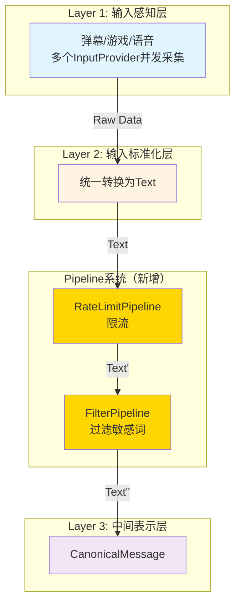

# Pipeline重新设计

> **⚠️ 实现状态**  
> 本文档描述的是**目标架构**。当前实现**未完成**：  
> - 现有管道均为 **MessagePipeline**（处理 MessageBase），未迁移到 **TextPipeline**（处理 Text）。  
> - **TextPipeline** 未被注册到 PipelineManager，CanonicalLayer 调用 `process_text()` 时无管道可执行，限流/过滤等未接入 6 层数据流。  
> - MessagePipeline 的 `process_inbound_message` / `process_outbound_message` 在 6 层架构中**无调用点**。  
> 详见 [架构设计审查 B-01：管道系统未重构成功](./architecture_review.md#b-01-管道系统未重构成功--待修复)。

---

## 🎯 核心目标

重新设计Pipeline系统，从处理MessageBase改为处理Text，位于Layer 2和Layer 3之间，用于Text的预处理和过滤。

---

## 📊 设计概览

### 1. 设计背景

**现状**：
- 现有Pipeline系统处理MessageBase
- Pipeline位于AmaidesuCore中，用于消息预处理和后处理
- 新架构中，MaiCore作为DecisionProvider，Pipeline失去触发点

**问题**：
- Pipeline处理的数据格式与Provider系统不匹配
- Pipeline在新架构中的定位不明确
- CommandRouterPipeline、RateLimitPipeline、FilterPipeline的实际使用场景需要重新评估

**解决方案**：
- 重新定位Pipeline：处理Text，位于Layer 2和Layer 3之间
- TextPipeline接口：process(text, metadata) -> Optional[str]
- 保留RateLimitPipeline和FilterPipeline
- 移除CommandRouterPipeline（用Provider替代）

### 2. 设计原则

1. **数据格式匹配**：Pipeline处理Text，与Provider系统匹配
2. **职责清晰**：Pipeline用于Text的预处理和过滤
3. **可扩展性**：易于添加新的Pipeline
4. **容错性**：单个Pipeline失败不影响其他Pipeline

---

## 🏗️ 接口设计

### TextPipeline接口

```python
from typing import Optional, Dict, Callable, Any
from dataclasses import dataclass
from enum import Enum

class PipelineErrorHandling(str, Enum):
    """Pipeline错误处理策略"""
    CONTINUE = "continue"  # 记录日志，继续执行
    STOP = "stop"          # 停止执行，抛出异常
    DROP = "drop"          # 丢弃消息，不执行后续Pipeline

@dataclass
class PipelineConfig:
    """Pipeline配置"""
    priority: int
    enabled: bool = True
    error_handling: PipelineErrorHandling = PipelineErrorHandling.CONTINUE
    timeout_seconds: int = 5  # 超时时间

@dataclass
class PipelineStats:
    """Pipeline统计"""
    processed_count: int = 0   # 处理次数
    dropped_count: int = 0     # 丢弃次数
    error_count: int = 0       # 错误次数
    avg_duration_ms: float = 0  # 平均处理时间（毫秒）

class PipelineException(Exception):
    """Pipeline处理异常"""
    def __init__(self, pipeline_name: str, message: str, original_error: Optional[Exception] = None):
        self.pipeline_name = pipeline_name
        self.message = message
        self.original_error = original_error
        super().__init__(f"[{pipeline_name}] {message}")

class TextPipeline(Protocol):
    """文本处理管道"""

    priority: int
    enabled: bool = True
    error_handling: PipelineErrorHandling = PipelineErrorHandling.CONTINUE
    timeout_seconds: int = 5

    async def process(
        self,
        text: str,
        metadata: Dict[str, Any]
    ) -> Optional[str]:
        """
        处理文本

        Args:
            text: 待处理的文本
            metadata: 元数据

        Returns:
            处理后的文本，或None表示丢弃

        Raises:
            PipelineException: Pipeline处理失败（根据error_handling策略）
        """
        ...

    def get_stats(self) -> PipelineStats:
        """获取Pipeline统计信息"""
        ...

    async def reset_stats(self):
        """重置统计信息"""
        ...
```

---

## 💾 实现示例

### PipelineManager实现

```python
import asyncio
import time
from typing import List, Optional, Dict, Any

class PipelineManager:
    """Pipeline管理器"""

    def __init__(self, config: Dict[str, Any]):
        self.config = config
        self.pipelines: List[TextPipeline] = []
        self._lock = asyncio.Lock()  # 添加锁保护并发处理
        self.logger = get_logger("PipelineManager")

    async def register_pipeline(self, pipeline: TextPipeline):
        """注册Pipeline"""
        self.pipelines.append(pipeline)
        # 按优先级排序
        self.pipelines.sort(key=lambda p: p.priority)
        self.logger.info(f"Pipeline registered: {pipeline.get_info()['name']} (priority={pipeline.priority})")

    async def process_text(self, text: str, metadata: Dict[str, Any]) -> Optional[str]:
        """
        按优先级处理文本

        Args:
            text: 待处理的文本
            metadata: 元数据

        Returns:
            处理后的文本，或None表示被某个Pipeline丢弃
        """
        # 使用锁保护并发处理
        async with self._lock:
            current_text = text

            for pipeline in self.pipelines:
                if not pipeline.enabled:
                    continue

                try:
                    # 记录开始时间
                    start_time = time.time()

                    # 处理文本
                    current_text = await asyncio.wait_for(
                        pipeline.process(current_text, metadata),
                        timeout=pipeline.timeout_seconds
                    )

                # 记录处理时间
                duration_ms = (time.time() - start_time) * 1000
                self._update_pipeline_stats(pipeline, duration_ms, success=True)

                # 如果返回None，丢弃消息
                if current_text is None:
                    self.logger.debug(f"Pipeline {pipeline.get_info()['name']} dropped the message")
                    self._update_pipeline_stats(pipeline, 0, dropped=True)
                    return None

            except asyncio.TimeoutError:
                error = PipelineException(
                    pipeline.get_info()['name'],
                    f"Timeout after {pipeline.timeout_seconds}s"
                )
                self.logger.error(f"Pipeline timeout: {error}")

                # 根据错误处理策略
                if pipeline.error_handling == PipelineErrorHandling.STOP:
                    raise error
                elif pipeline.error_handling == PipelineErrorHandling.DROP:
                    self._update_pipeline_stats(pipeline, 0, dropped=True)
                    return None
                # CONTINUE: 记录日志，继续执行
                self._update_pipeline_stats(pipeline, 0, error=True)

            except Exception as e:
                error = PipelineException(
                    pipeline.get_info()['name'],
                    f"Processing failed",
                    original_error=e
                )
                self.logger.error(f"Pipeline error: {error}", exc_info=True)

                # 根据错误处理策略
                if pipeline.error_handling == PipelineErrorHandling.STOP:
                    raise error
                elif pipeline.error_handling == PipelineErrorHandling.DROP:
                    self._update_pipeline_stats(pipeline, 0, dropped=True)
                    return None
                # CONTINUE: 记录日志，继续执行
                self._update_pipeline_stats(pipeline, 0, error=True)

        return current_text

    def _update_pipeline_stats(self, pipeline: TextPipeline, duration_ms: float, **kwargs):
        """更新Pipeline统计"""
        stats = pipeline.get_stats()
        stats.processed_count += 1

        if kwargs.get('dropped'):
            stats.dropped_count += 1
        elif kwargs.get('error'):
            stats.error_count += 1
        elif kwargs.get('success'):
            # 更新平均处理时间
            stats.avg_duration_ms = (
                (stats.avg_duration_ms * (stats.processed_count - 1) + duration_ms)
                / stats.processed_count
            )
```

### RateLimitPipeline实现

```python
class RateLimitPipeline(TextPipeline):
    """限流Pipeline"""

    priority = 100
    enabled = True
    error_handling = PipelineErrorHandling.CONTINUE
    timeout_seconds = 1

    def __init__(self, config: PipelineConfig):
        self.config = config
        self.logger = get_logger("RateLimitPipeline")
        self._rate_limiter = RateLimiter(
            max_requests_per_minute=config.get("max_rpm", 60)
        )
        self._stats = PipelineStats()

    async def process(self, text: str, metadata: Dict[str, Any]) -> Optional[str]:
        # 获取用户
        user = metadata.get("user", "anonymous")

        # 检查是否限流
        if self._rate_limiter.is_rate_limited(user):
            self.logger.debug(f"User {user} is rate limited")
            return None  # 丢弃

        # 记录请求
        self._rate_limiter.record_request(user)

        return text

    def get_stats(self) -> PipelineStats:
        return self._stats

    async def reset_stats(self):
        self._stats = PipelineStats()

class RateLimiter:
    """简单限流器"""

    def __init__(self, max_requests_per_minute: int):
        self.max_rpm = max_requests_per_minute
        self._requests: Dict[str, List[float]] = {}

    def is_rate_limited(self, user: str) -> bool:
        """检查用户是否被限流"""
        if user not in self._requests:
            return False

        # 清理1分钟前的请求
        now = time.time()
        self._requests[user] = [
            t for t in self._requests[user]
            if now - t < 60
        ]

        return len(self._requests[user]) >= self.max_rpm

    def record_request(self, user: str):
        """记录用户请求"""
        now = time.time()
        if user not in self._requests:
            self._requests[user] = []
        self._requests[user].append(now)
```

### FilterPipeline实现

```python
class FilterPipeline(TextPipeline):
    """过滤Pipeline"""

    priority = 200
    enabled = True
    error_handling = PipelineErrorHandling.CONTINUE
    timeout_seconds = 1

    def __init__(self, config: PipelineConfig):
        self.config = config
        self.logger = get_logger("FilterPipeline")
        self._sensitive_words = config.get("sensitive_words", [])
        self._stats = PipelineStats()

    async def process(self, text: str, metadata: Dict[str, Any]) -> Optional[str]:
        # 检查敏感词
        for word in self._sensitive_words:
            if word.lower() in text.lower():
                self.logger.debug(f"Message contains sensitive word: {word}")
                return None  # 丢弃

        return text

    def get_stats(self) -> PipelineStats:
        return self._stats

    async def reset_stats(self):
        self._stats = PipelineStats()
```

---

## 📊 Pipeline在新架构中的定位

### Pipeline数据流



### Pipeline与Provider的职责对比

| 维度 | Pipeline | Provider |
|------|----------|----------|
| **位置** | Layer 2和Layer 3之间 | Layer 1（输入）/ Layer 6（输出） |
| **处理数据** | Text | RawData / RenderParameters |
| **职责** | 文本预处理和过滤 | 数据采集和渲染 |
| **并发** | 顺序处理（按优先级） | 并发处理 |
| **示例** | RateLimit、Filter | ConsoleInput、VTSRenderer |

---

## 📋 配置示例

### Pipeline配置

```toml
[pipelines]
# 启用的Pipeline列表
enabled = ["rate_limit", "filter"]

# Pipeline配置
[pipelines.rate_limit]
priority = 100
enabled = true
error_handling = "continue"  # continue | stop | drop
timeout_seconds = 1

[pipelines.rate_limit.config]
max_rpm = 60  # 每分钟最多60条消息

[pipelines.filter]
priority = 200
enabled = true
error_handling = "continue"
timeout_seconds = 1

[pipelines.filter.config]
sensitive_words = ["禁词1", "禁词2", "禁词3"]
```

---

## ✅ 关键优势

### 1. 职责清晰
- ✅ Pipeline处理Text，Provider处理RawData/RenderParameters
- ✅ 职责不重叠，各司其职
- ✅ 易于理解和维护

### 2. 数据格式匹配
- ✅ Pipeline处理Text，与Provider系统匹配
- ✅ 位于Layer 2和Layer 3之间，位置明确
- ✅ 数据流向清晰

### 3. 可扩展性
- ✅ 易于添加新的Pipeline
- ✅ 支持多种错误处理策略
- ✅ 支持超时控制

### 4. 容错性
- ✅ 单个Pipeline失败不影响其他Pipeline
- ✅ 可配置的错误处理策略
- ✅ 记录详细的错误日志

### 5. 性能优化
- ✅ Pipeline按优先级顺序处理
- ✅ 支持超时控制，避免长时间阻塞
- ✅ 统计信息完善，便于性能调优

---

## 🔗 相关文档

- [6层架构设计](./layer_refactoring.md)
- [多Provider并发设计](./multi_provider.md)
- [插件系统设计](./plugin_system.md)
- [AmaidesuCore重构设计](./core_refactoring.md)
