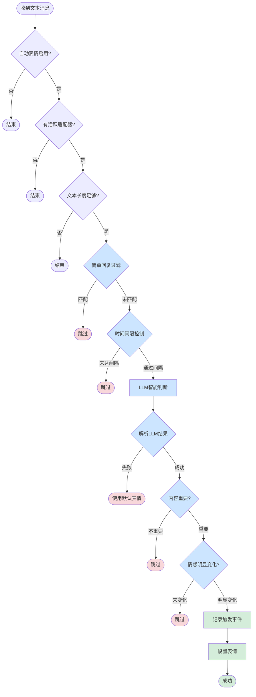
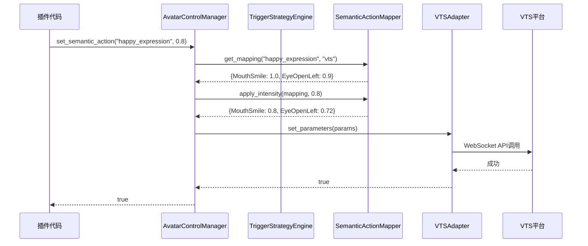
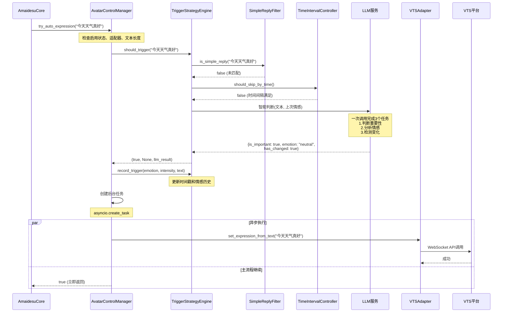
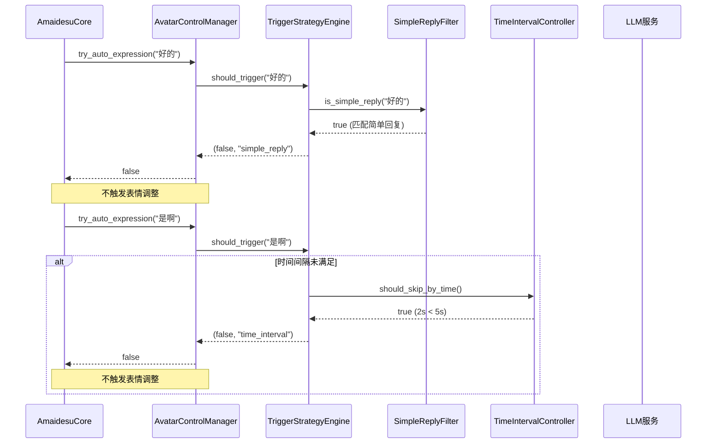
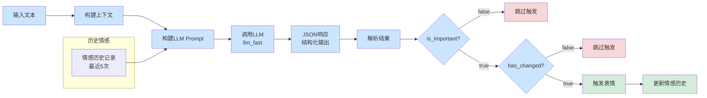

# Avatar 模块 - 通用虚拟形象控制系统

**一个统一的虚拟形象控制抽象层，支持 VTube Studio、VRChat、Live2D 等多个平台。**

[]()
[]()
[]()

---

## 📖 概述

Avatar 模块提供了一个统一的抽象层，让你可以用**相同的代码**控制不同的虚拟形象平台。它内置了**LLM 驱动的智能表情分析**，可以根据文本自动选择合适的表情。

### 核心特性

- ✅ **平台无关** - 一套代码支持 VTS、VRChat、Live2D 等多个平台
- ✅ **类型安全** - 完整的类型提示，IDE 自动补全支持
- ✅ **智能分析** - LLM 自动分析文本并选择合适的表情
- ✅ **智能触发** - 三层过滤机制（简单回复、时间间隔、LLM判断），避免频繁调整
- ✅ **易于扩展** - 添加新平台只需实现适配器接口
- ✅ **语义映射** - 高层次的语义动作（如"开心"）自动映射到平台参数
- ✅ **向后兼容** - 与现有代码完全兼容

---

## 🚀 快速开始

### 最简单的使用方式

```python
from src.core.plugin_manager import BasePlugin

class MyPlugin(BasePlugin):
    async def handle_text(self, message):
        text = message.message_segment.data

        # 一行代码：自动分析文本并设置表情
        result = await self.core.avatar.set_expression_from_text(text)

        if result["success"]:
            print(f"表情设置成功: {result['message']}")
```

### 手动控制表情

```python
# 设置开心表情，强度 0.8
await self.core.avatar.set_semantic_action("happy_expression", 0.8)

# 闭眼
await self.core.avatar.set_semantic_action("close_eyes", 1.0)
```

### 自动表情（Auto Expression）

启用自动表情后，Avatar 模块会自动分析来自 MaiCore 的消息并设置表情，无需手动调用：

```toml
# config.toml
[avatar.auto_expression]
enabled = true  # 启用自动表情
min_text_length = 2  # 最小文本长度

# ========== 智能触发配置 ==========

# 简单回复过滤（优先级最高，快速本地判断）
# 过滤"好的"、"嗯"等简单确认语
simple_reply_filter_enabled = true
simple_reply_patterns = [
    "^[好的好的]$", "^[好呀]$", "^[好的]$",
    "^[嗯嗯]$", "^[嗯]$", "^[收到]$",
    "^[知道了]$", "^[明白]$", "^[OK]$", "^[ok]$",
    "^(好|行|可以)[呀啊嘛。！!]*$"
]

# 时间间隔控制（快速本地判断）
# 避免频繁调整表情
time_interval_enabled = true
min_time_interval = 5.0  # 秒

# LLM智能判断（重要性 + 情感分析 + 变化检测）
# 注意：通过前两层过滤后才执行，使用小模型成本低
# 一次调用完成3个任务：判断内容重要性、分析情感、检测情感变化
llm_judge_enabled = true

# 情感历史记录（用于情感变化检测）
max_emotion_history = 5

# 调试配置
debug_mode = false
log_filtered_messages = true
```

**工作原理**：
```
文本输入
    ↓
1. 简单回复过滤（正则匹配） ──→ 匹配则跳过
    ↓
2. 时间间隔控制（最小5秒） ──→ 未达间隔则跳过
    ↓
3. LLM智能判断（一次调用完成3个任务）
   ├─ 判断内容是否重要
   ├─ 分析当前情感
   └─ 对比情感是否明显变化
    ↓
通过所有检查 → 触发表情设置
```

**三层过滤机制**：
1. **简单回复过滤**：快速本地判断（正则匹配），过滤"好的"、"嗯"等确认语
2. **时间间隔控制**：快速本地判断（时间戳比较），确保两次触发之间有最小间隔
3. **LLM智能判断**：一次LLM调用完成3个任务
   - 判断内容是否重要（有实际内容 vs 简单确认）
   - 分析当前情感（开心/悲伤/惊讶等）
   - 检测情感是否明显变化（与上次情感对比）

**优势**：
- ✅ **零代码** - 启用后自动工作，无需修改插件代码
- ✅ **不阻塞** - 异步执行，不影响消息处理速度
- ✅ **智能过滤** - 避免频繁调整，让虚拟形象表现更自然
- ✅ **可配置** - 通过配置文件轻松开关每个过滤器
- ✅ **效果优先** - LLM判断比简单规则更准确

---


## 🏗️ 架构设计

### 系统架构图

```mermaid
graph TB
    subgraph "插件层"
        Plugin[你的插件代码<br/>await core.avatar.set_expression_from_text]
    end

    subgraph "核心层"
        Core[AmaidesuCore<br/>@property avatar_control]
    end

    subgraph "Avatar控制层"
        Manager[AvatarControlManager<br/>中央控制器]

        Manager --> LLM[LLM集成<br/>自动分析文本]
        Manager --> Mapper[语义动作映射<br/>开心 → 参数]
        Manager --> AdapterMgr[适配器管理<br/>管理所有平台]
    end

    subgraph "触发策略层"
        Strategy[TriggerStrategyEngine<br/>智能触发策略]

        Strategy --> Filter1[简单回复过滤<br/>正则匹配]
        Strategy --> Filter2[时间间隔控制<br/>时间戳比较]
        Strategy --> Filter3[LLM智能判断<br/>重要性+情感+变化]
    end

    subgraph "适配器层"
        Adapter[AvatarAdapter<br/>适配器基类]
        VTS[VTSAdapter]
        VRC[VRCAdapter]
        Live2D[Live2DAdapter]
    end

    subgraph "平台层"
        Platform[实际平台<br/>VTS / VRChat / Live2D]
    end

    Plugin --> Core
    Core --> Manager
    Manager --> Strategy
    Manager --> LLM
    Manager --> Mapper
    Manager --> AdapterMgr
    AdapterMgr --> Adapter
    Adapter --> VTS
    Adapter --> VRC
    Adapter --> Live2D
    VTS --> Platform
    VRC --> Platform
    Live2D --> Platform

    classDef pluginLayer fill:#e1f5ff
    classDef coreLayer fill:#fff4e6
    classDef avatarLayer fill:#f3e5f5
    classDef strategyLayer fill:#e8f5e9
    classDef adapterLayer fill:#fff9c4
    classDef platformLayer fill:#fce4ec

    class Plugin pluginLayer
    class Core coreLayer
    class Manager,LLM,Mapper,AdapterMgr avatarLayer
    class Strategy,Filter1,Filter2,Filter3 strategyLayer
    class Adapter,VTS,VRC,Live2D adapterLayer
    class Platform platformLayer
```

### 自动表情触发流程图



### 时序图：手动控制表情



### 时序图：自动表情触发（含智能过滤）



### 时序图：被过滤的场景



### 数据流图：LLM智能判断



---

## 📁 目录结构

```
avatar/
├── __init__.py              # 模块导出
├── adapter_base.py          # 适配器基类
├── avatar_manager.py        # 核心管理器
├── semantic_actions.py      # 语义动作映射器
├── trigger_strategy.py      # 智能触发策略引擎
├── tool_generator.py        # LLM 工具生成器
└── llm_executor.py          # LLM 工具执行器
```

### 文件说明

| 文件 | 职责 | 需要修改？ |
|------|------|----------|
| `adapter_base.py` | 定义适配器接口 | ✅ 不需要 |
| `avatar_manager.py` | 核心管理器，LLM 集成 | ✅ 不需要 |
| `semantic_actions.py` | 语义动作定义和映射 | ⚠️ 可选（添加新表情） |
| `trigger_strategy.py` | 智能触发策略（三层过滤） | ✅ 不需要 |
| `tool_generator.py` | 生成 LLM 工具定义 | ✅ 不需要 |
| `llm_executor.py` | 执行 LLM 工具调用 | ✅ 不需要 |

---

## 📚 核心概念

### 1. AvatarControlManager

整个系统的大脑，负责：
- 🧠 **LLM 交互**：自动分析文本，决定用什么表情
- 🗺️ **映射管理**：将"开心"映射到具体的参数
- 🔌 **适配器管理**：管理所有已注册的平台适配器

**位置**：[avatar_manager.py](avatar_manager.py)

### 2. AvatarAdapter

所有平台适配器的基类，定义了统一的接口。

**核心方法**：
```python
class AvatarAdapter(ABC):
    async def connect() -> bool              # 连接平台
    async def set_parameter(name, value)     # 设置单个参数
    async def set_parameters(params)         # 批量设置
    async def trigger_action(name)           # 触发动作
```

**位置**：[adapter_base.py](adapter_base.py)

### 3. SemanticActionMapper

将高层次的语义动作翻译成平台特定的参数：

```python
"happy_expression"
  → VTS 平台
{MouthSmile: 1.0, EyeOpenLeft: 0.9}
  → VRChat 平台
{"/input/face/eyes": 1.0, "/input/face/mouth_smile": 1.0}
```

**位置**：[semantic_actions.py](semantic_actions.py)

### 4. TriggerStrategyEngine

智能触发策略引擎，负责判断是否应该触发表情调整。

**核心功能**：
- 🔍 **简单回复过滤**：使用正则表达式匹配"好的"、"嗯"等确认语
- ⏱️ **时间间隔控制**：确保两次触发之间有最小时间间隔（默认5秒）
- 🧠 **LLM智能判断**：一次调用完成3个任务
  - 判断内容是否重要
  - 分析当前情感
  - 检测情感是否明显变化

**工作流程**：
```
文本输入 → 简单回复过滤 → 时间间隔控制 → LLM判断 → 触发/跳过
```

**优势**：
- ✅ 避免频繁调整，让虚拟形象表现更自然
- ✅ 前两层是快速本地判断（不调用LLM）
- ✅ 只有通过前两层后才调用一次LLM
- ✅ 完全可配置，每个过滤器都可独立开关

**位置**：[trigger_strategy.py](trigger_strategy.py)

### 5. 具体适配器（如 VTSAdapter, VRCAdapter）

负责：
- 注册平台参数（如 `MouthSmile`）
- 调用平台 API

**位置**：
- VTS: [src/plugins/vtube_studio/adapters/vts_adapter.py](../plugins/vtube_studio/adapters/vts_adapter.py)
- VRC: [src/plugins/vrchat/adapters/vrc_adapter.py](../plugins/vrchat/adapters/vrc_adapter.py)

---

## 🎯 使用方式

### 方式1：自动文本分析（推荐）

系统会自动分析文本并选择合适的表情。

```python
result = await self.core.avatar.set_expression_from_text(
    "今天天气真好！"
)

# 返回结果
# {
#     "success": true,
#     "expression": "happy_expression",
#     "message": "表情设置成功"
# }
```

**参数**：
- `text` (str): 要分析的文本
- `adapter_name` (str, optional): 指定适配器，默认使用活跃适配器
- `fallback_expression` (str): LLM 失败时的备用表情，默认 `"neutral"`

### 方式2：手动控制表情

直接指定表情，不使用 LLM。

```python
await self.core.avatar.set_semantic_action(
    "happy_expression",
    intensity=0.8
)
```

**可用的语义动作**：
- `happy_expression` - 开心
- `sad_expression` - 悲伤
- `surprised_expression` - 惊讶
- `angry_expression` - 生气
- `close_eyes` - 闭眼
- `open_eyes` - 睁眼
- `neutral` - 中性

### 方式3：完全控制（高级）

手动调用 LLM 并处理结果。

```python
# 1. 获取工具定义
tools = await self.core.avatar.generate_llm_tools()

# 2. 调用 LLM
llm_client = self.get_llm_client()
result = await llm_client.chat_completion(
    prompt="选择合适的表情",
    tools=tools
)

# 3. 执行工具调用
if result.get("tool_calls"):
    for tool_call in result["tool_calls"]:
        await self.core.avatar.execute_tool_call(
            tool_call["function"]["name"],
            json.loads(tool_call["function"]["arguments"])
        )
```

---

## 🔌 创建适配器

如果你想支持一个新的平台（例如 VRChat），只需创建一个适配器：

### 步骤1：实现适配器类

```python
from src.core.avatar.adapter_base import AvatarAdapter, ParameterMetadata

class VRCAdapter(AvatarAdapter):
    """VRChat OSC 适配器"""

    def __init__(self, vrc_plugin):
        super().__init__("vrc", vrc_plugin.config)
        self.vrc_plugin = vrc_plugin
        self._setup_parameters()

    def _setup_parameters(self):
        """注册 VRChat 参数"""
        self.register_parameter(ParameterMetadata(
            name="/input/face/eyes",
            display_name="眼睛开合",
            param_type="float",
            min_value=0.0,
            max_value=1.0,
            description="控制眼睛开合",
            category="face",
            tags=["eye"]
        ))

        # 注册更多参数...

    async def connect(self) -> bool:
        """连接到 VRChat OSC"""
        # 建立 OSC 连接
        return True

    async def disconnect(self) -> bool:
        """断开连接"""
        return True

    async def set_parameter(self, name: str, value: float) -> bool:
        """通过 OSC 发送参数"""
        # 发送 OSC 消息
        self.vrc_plugin.send_osc(name, value)
        return True

    async def set_parameters(self, params: dict) -> bool:
        """批量设置"""
        for name, value in params.items():
            await self.set_parameter(name, value)
        return True

    async def get_parameter(self, name: str):
        # VRChat OSC 不支持读取
        return None

    async def trigger_action(self, name: str, **kwargs) -> bool:
        """触发动作"""
        # 触发 Gesture
        return True
```

### 步骤2：在插件中注册

```python
class VRChatPlugin(BasePlugin):
    async def setup(self):
        # 创建适配器
        adapter = VRCAdapter(self)

        # 注册到核心
        avatar_control = self.core.avatar
        if avatar_control:
            avatar_control.register_adapter(adapter)
            avatar_control.set_active_adapter("vrc")
```

**就这么简单！** 现在 VRChat 已完全集成到系统中。

---

## ⚙️ 配置

在 `config.toml` 中配置 Avatar 模块。

### 基础配置

```toml
[avatar]
# 启用 Avatar 模块
enabled = true

# 默认活跃适配器
default_adapter = "vts"
```

### 自动表情配置

```toml
[avatar.auto_expression]
# 是否启用自动表情功能
enabled = false  # 改为 true 启用

# 最小文本长度（少于这个长度的文本不会触发）
min_text_length = 2

# ========== 智能触发配置 ==========

# 简单回复过滤（优先级最高，快速本地判断）
simple_reply_filter_enabled = true
simple_reply_patterns = [
    "^[好的好的]$", "^[好呀]$", "^[好的]$",
    "^[嗯嗯]$", "^[嗯]$", "^[收到]$",
    "^[知道了]$", "^[明白]$", "^[OK]$", "^[ok]$",
    "^(好|行|可以)[呀啊嘛。！!]*$"
]

# 时间间隔控制（快速本地判断）
time_interval_enabled = true
min_time_interval = 5.0  # 秒

# LLM智能判断（重要性 + 情感分析 + 变化检测）
llm_judge_enabled = true

# 情感历史记录（用于情感变化检测）
max_emotion_history = 5

# 调试配置
debug_mode = false
log_filtered_messages = true
```

### LLM 配置

```toml
[avatar.llm]
enabled = true
type = "llm_fast"  # "llm", "llm_fast", 或 "vlm"

# 自定义 LLM 配置（可选）
# model = "deepseek-chat"
# api_key = ""
# base_url = "https://api.siliconflow.cn/v1"
# temperature = 0.1
# max_tokens = 100
```

### 语义动作配置

```toml
[avatar.semantic_actions.happy_expression]
description = "开心的表情"

# VTS 平台特定映射
[avatar.semantic_actions.happy_expression.platforms.vts]
MouthSmile = 1.0
EyeOpenLeft = 0.9
EyeOpenRight = 0.9

# VRChat 平台特定映射
[avatar.semantic_actions.happy_expression.platforms.vrc]
"/input/face/eyes" = 1.0
"/input/face/mouth_smile" = 1.0
```

---

---

## 📖 API 参考

### AvatarControlManager

#### `try_auto_expression(text)`
尝试根据文本自动设置表情（内部判断是否触发）。

此方法封装了所有自动触发的判断逻辑，由 AmaidesuCore 调用。

**参数**：
- `text` (str): 输入文本

**返回**：`bool` - 是否成功触发（如果触发条件不满足，返回 False 但不算错误）

**判断条件**（按顺序）：
1. 自动表情功能是否启用（`[avatar.auto_expression].enabled`）
2. 是否有活跃的适配器
3. 文本长度是否达到最小要求（`min_text_length`）
4. **智能触发策略**（三层过滤）：
   - 简单回复过滤：匹配"好的"、"嗯"等确认语
   - 时间间隔控制：距离上次触发的时间是否满足最小间隔
   - LLM智能判断：
     - 内容是否重要（有实际内容 vs 简单确认）
     - 情感是否明显变化（与上次情感对比）

**特点**：
- 异步执行，包含LLM调用
- 自动捕获错误，不影响主流程
- 通常不需要手动调用，由 AmaidesuCore 自动调用
- 智能过滤，避免频繁调整

---

#### `set_expression_from_text(text, adapter_name=None, fallback_expression="neutral")`
根据文本自动分析并设置表情。

**参数**：
- `text` (str): 输入文本
- `adapter_name` (str, optional): 目标适配器
- `fallback_expression` (str): LLM 失败时的备用表情

**返回**：`{"success": bool, "expression": str, "message": str}`

---

#### `set_semantic_action(action_name, intensity=1.0, adapter_name=None)`
手动设置语义动作。

**参数**：
- `action_name` (str): 动作名称（如 `"happy_expression"`）
- `intensity` (float): 强度 (0.0-1.0)
- `adapter_name` (str, optional): 目标适配器

**返回**：`bool`

---

#### `register_adapter(adapter)`
注册适配器。

**参数**：
- `adapter` (AvatarAdapter): 适配器实例

**返回**：`bool`

---

#### `set_active_adapter(adapter_name)`
设置活跃适配器。

**参数**：
- `adapter_name` (str): 适配器名称

**返回**：`bool`

---

#### `get_active_adapter()`
获取当前活跃的适配器。

**返回**：`AvatarAdapter | None`

---

#### `get_adapter(adapter_name)`
获取指定的适配器。

**参数**：
- `adapter_name` (str): 适配器名称

**返回**：`AvatarAdapter | None`

---

#### `list_adapters()`
列出所有已注册的适配器。

**返回**：`List[str]`

---

#### `generate_llm_tools()`
生成 LLM 工具定义（用于高级用法）。

**返回**：`List[Dict]` - OpenAI 工具格式

---

#### `execute_tool_call(function_name, arguments, adapter_name=None)`
执行 LLM 工具调用（用于高级用法）。

**参数**：
- `function_name` (str): 函数名称
- `arguments` (dict): 函数参数
- `adapter_name` (str,optional): 目标适配器

**返回**：`{"success": bool, "message": str, ...}`

---

### AvatarAdapter

适配器基类，所有平台适配器必须继承此类。

#### 必须实现的方法

```python
async def connect(self) -> bool:
    """连接到平台"""
    pass

async def disconnect(self) -> bool:
    """断开连接"""
    pass

async def set_parameter(self, param_name: str, value: float) -> bool:
    """设置单个参数"""
    pass

async def set_parameters(self, parameters: Dict[str, float]) -> bool:
    """批量设置参数"""
    pass

async def get_parameter(self, param_name: str) -> Optional[float]:
    """获取参数值"""
    pass

async def trigger_action(self, action_name: str, **kwargs) -> bool:
    """触发动作"""
    pass
```

#### 辅助方法

```python
def register_parameter(metadata: ParameterMetadata):
    """注册参数元数据"""

def register_action(metadata: ActionMetadata):
    """注册动作元数据"""

def get_registered_parameters() -> Dict[str, ParameterMetadata]:
    """获取已注册的参数"""

def get_registered_actions() -> Dict[str, ActionMetadata]:
    """获取已注册的动作"""
```

---

## 🔧 扩展指南

### 添加新的语义动作

1. 编辑 `semantic_actions.py`

```python
DEFAULT_SEMANTIC_ACTIONS = {
    # ... 现有的...

    "thinking_expression": {
        "description": "思考的表情",
        "default_mapping": {
            "EyeOpenLeft": 0.7,
            "EyeOpenRight": 0.7,
            "MouthSmile": 0.1,
        }
    },
}
```

2. 在配置文件中覆盖（可选）

```toml
[avatar_control.semantic_actions.thinking_expression.platforms.vts]
MouthSmile = 0.2
EyeOpenLeft = 0.8
```

### 添加平台特定的参数覆盖

在配置文件中定义。

```toml
[avatar_control.semantic_actions.happy_expression.platforms.vrc]
"/input/face/eyes" = 1.0
"/input/face/mouth_smile" = 1.0
"/input/face/eyebrow" = 0.5
```

---

## ❓ 常见问题

### Q: Avatar 模块会自动启用吗？

A: 不会。你需要确保有至少一个适配器插件（如 VTS）启用并注册了适配器。

### Q: 为什么有些消息不会触发表情？

A: 智能触发机制会过滤以下情况：
- **简单回复**："好的"、"嗯"、"收到"等确认语会被跳过
- **时间间隔**：距离上次触发不足5秒的消息会被跳过
- **LLM判断**：
  - 内容不重要（简单确认、重复内容）
  - 情感未明显变化（与上次情感相同或相似）

查看日志了解详细原因：
```bash
python main.py --filter TriggerStrategyEngine
```

### Q: LLM 调用会很慢吗？

A: 使用 `llm_fast` 配置时，通常 100-300ms。系统有完善的回退机制，即使 LLM 失败也能工作。智能触发机制会先进行快速本地过滤（正则+时间戳），只有通过后才调用LLM，大大减少了LLM调用次数。

### Q: 如何调整智能触发的敏感度？

A: 在配置文件中调整以下参数：

```toml
[avatar.auto_expression]
# 调整时间间隔（默认5秒）
min_time_interval = 3.0  # 更频繁触发

# 禁用某些过滤器
simple_reply_filter_enabled = false  # 不过滤简单回复
llm_judge_enabled = false  # 不使用LLM判断

# 启用调试模式查看详细日志
debug_mode = true
```

### Q: 可以禁用 LLM 功能吗？

A: 可以。

```python
# 禁用 LLM
self.core.avatar.disable_llm()

# 之后只会使用 fallback_expression
```

或在配置中：

```toml
[avatar.llm]
enabled = false
```

或者在自动表情配置中禁用LLM判断：

```toml
[avatar.auto_expression]
llm_judge_enabled = false  # 只使用简单回复过滤和时间间隔控制
```

### Q: 如何同时控制多个平台？

A: 所有已注册的适配器都会收到指令，但只有活跃适配器会执行。

```python
# 设置活跃适配器
avatar_control.set_active_adapter("vts")
await avatar_control.set_semantic_action("happy", 1.0)  # 控制 VTS

avatar_control.set_active_adapter("vrc")
await avatar_control.set_semantic_action("happy", 1.0)  # 控制 VRChat
```

### Q: 可以用不同的适配器吗？

A: 可以！在调用时指定：

```python
await avatar_control.set_expression_from_text(
    "你好！",
    adapter_name="vrc"  # 使用 VRChat 适配器
)
```

### Q: 为什么 LLM 返回了错误？

A: 检查以下几点：
1. LLM 配置是否正确（API key、base URL）
2. LLM 是否支持工具调用（function calling）
3. 网络连接是否正常

查看日志获取详细信息。

```bash
python main.py --debug --filter AvatarControlManager
```

---

## 📝 完整示例

### 示例1：聊天表情插件

```python
from src.core.plugin_manager import BasePlugin

class ChatExpressionPlugin(BasePlugin):
    """自动根据聊天内容设置表情"""

    async def setup(self):
        # 注册消息处理器
        self.core.register_websocket_handler("text", self.handle_chat_message)

        # 确保 avatar_control 可用
        if not self.core.avatar:
            self.logger.warning("AvatarControlManager 未初始化")
            return

        self.logger.info("聊天表情插件已启用")

    async def handle_chat_message(self, message):
        """处理聊天消息"""
        text = message.message_segment.data

        if not text or not text.strip():
            return

        # 自动分析文本并设置表情
        result = await self.core.avatar.set_expression_from_text(text)

        if result["success"]:
            self.logger.info(f"设置表情: {result.get('expression', 'unknown')}")
        else:
            self.logger.warning(f"设置失败: {result.get('error', 'unknown')}")
```

### 示例2：手动表情控制

```python
class ManualExpressionPlugin(BasePlugin):
    """手动表情控制"""

    async def setup(self):
        self.core.register_websocket_handler("expression", self.handle_expression)

    async def handle_expression(self, message):
        """处理表情指令"""
        command = message.message_segment.data

        # 解析命令，例如："happy 0.8"
        parts = command.split()
        expression = parts[0]
        intensity = float(parts[1]) if len(parts) > 1 else 1.0

        # 设置表情
        success = await self.core.avatar.set_semantic_action(
            f"{expression}_expression",
            intensity
        )

        if success:
            self.logger.info(f"已设置表情: {expression} ({intensity})")
```

---

## 🌌 VRChat 插件使用示例

### 安装依赖

```bash
pip install python-osc
```

### 配置插件

在 `config.toml` 中启用 VRChat 插件。

```toml
[plugins]
enabled = [
    "console_input",
    "llm_text_processor",
    "vrchat",  # 启用 VRChat 插件
]

[plugins.vrchat]
enabled = true

# VRChat OSC 配置
vrc_host = "127.0.0.1"
vrc_out_port = 9000
vrc_in_port = 9001
```

### VRChat OSC 设置

1. 打开 VRChat
2. 进入 `Settings` → `OSC`
3. 启用 OSC：
   - **Enabled**: ✓
   - **In Port (Receive)**: 9000 (Amaidesu 发送到此端口)
   - **Out Port (Send)**: 9001 (Amaidesu 监听此端口，可选)

### 使用示例

#### 自动文本分析

```python
from src.core.plugin_manager import BasePlugin

class VRChatExpressionPlugin(BasePlugin):
    """VRChat 聊天表情插件"""

    async def setup(self):
        self.core.register_websocket_handler("text", self.handle_text)

    async def handle_text(self, message):
        text = message.message_segment.data

        # 为 VRChat 设置表情
        result = await self.core.avatar.set_expression_from_text(
            text,
            adapter_name="vrc"  # 指定使用 VRChat 适配器
        )

        if result["success"]:
            print(f"设置 VRC 表情: {result['expression']}")
```

#### 触发手势

```python
# 触发 VRChat 手势
await core.avatar.execute_tool_call(
    "trigger_avatar_action",
    {"action_name": "Wave"},
    adapter_name="vrc"
)
```

#### 多平台控制

```python
# 同时控制 VTS 和 VRChat
await core.avatar.set_expression_from_text(
    "大家好！",
    adapter_name="vts"  # 先设置 VTS
)

await core.avatar.set_expression_from_text(
    "大家好！",
    adapter_name="vrc"  # 再设置 VRChat
)
```

---

## 🤝 贡献

欢迎贡献新的适配器或功能。

### 添加新平台支持

1. 实现适配器（继承 `AvatarAdapter`）
2. 注册到系统中
3. 测试功能
4. 提交 PR

---

## 📄 许可证

本项目遵循相同的许可证作为主项目。

---

## 🔗 相关链接

- [主项目文档](../../README.md)
- [开发指南](../../docs/)
- [插件开发](../../docs/plugin_development.md)

---

## 💬 联系方式

如有问题或建议，请提交 Issue 或 Pull Request。

---

**Made with ❤️ by Amaidesu Team**
