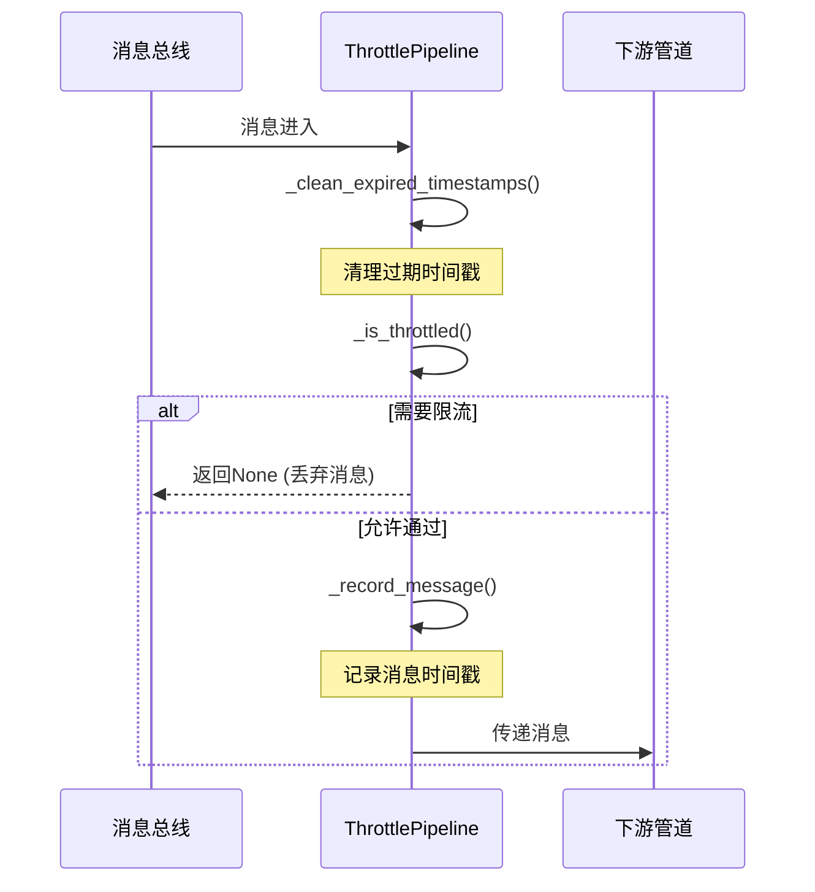

# ThrottlePipeline 限流管道

限流管道基于滑动时间窗口算法实现了消息处理的频率控制功能，用于防止MaiCore过载。

## 功能特性

- **全局消息频率限制**：控制整个系统每分钟处理的消息总量
- **用户级别频率限制**：控制单个用户每分钟可发送的消息数量
- **滑动时间窗口**：实时计算消息频率，提供平滑的限流体验

## 滑动窗口算法原理

滑动窗口算法是一种高效的限流方法，它通过维护一个时间窗口内的事件计数来控制事件处理频率。以下是该算法在ThrottlePipeline中的具体实现原理：

### 核心概念

1. **时间窗口**：一个固定长度的时间段（如60秒），作为计数的基准周期
2. **滑动机制**：窗口随时间推移而移动，保证窗口总是覆盖"当前时刻"之前的固定时长
3. **事件记录**：每个通过管道的消息都会在对应的时间戳队列中记录
4. **过期清理**：定期移除窗口外（即超过窗口时长）的过期记录

### 工作流程

1. **初始化**：创建全局消息队列和用户级别消息队列（均为双端队列）
2. **消息到达**：当新消息进入管道时，获取当前时间戳
3. **窗口维护**：
   - 计算窗口截止时间点（当前时间 - 窗口大小）
   - 从队列头部移除所有早于截止时间的记录
4. **限流判断**：
   - 统计当前窗口内的消息数量
   - 将数量与设定的阈值（全局/用户级别）进行比较
5. **决策处理**：
   - 若窗口内消息数量未超过阈值，记录当前消息并放行
   - 若超过阈值，拒绝该消息并记录日志

### 算法优势

1. **精确控制**：与固定时间窗口相比，滑动窗口能更精确地限制任意时间段内的消息数量
2. **平滑限流**：避免了固定窗口在边界处可能出现的突发流量问题
3. **内存高效**：仅保存必要的时间戳记录，定期清理过期数据
4. **多级限流**：同时支持全局限流和用户级别限流，灵活应对不同场景

### 数据结构选择

- 使用**双端队列**（`collections.deque`）存储时间戳，支持O(1)时间复杂度的两端操作
- 使用**默认字典**（`defaultdict`）管理用户级别队列，自动创建新用户的记录
- 使用**异步锁**（`asyncio.Lock`）确保并发环境下清理操作的线程安全

## 消息处理流程

1. 消息进入管道
2. 清理过期的时间戳记录（维护滑动窗口）
3. 检查是否需要限流（全局限流和用户级别限流）
4. 对于未限流的消息，记录其时间戳并允许继续传递
5. 对于被限流的消息，丢弃并记录日志

## 代码实现说明

### 核心数据结构

- `_global_timestamps`: 全局消息时间戳队列（双端队列）
- `_user_timestamps`: 用户级别消息时间戳队列（嵌套双端队列）

### 核心算法

```python
# 滑动窗口算法核心实现
async def _clean_expired_timestamps(self, current_time: float) -> None:
    async with self._cleanup_lock:
        # 计算截止时间点
        cutoff_time = current_time - self._window_size

        # 清理全局队列中的过期时间戳
        while self._global_timestamps and self._global_timestamps[0] < cutoff_time:
            self._global_timestamps.popleft()

        # 清理各用户队列中的过期时间戳
        for user_id, timestamps in list(self._user_timestamps.items()):
            while timestamps and timestamps[0] < cutoff_time:
                timestamps.popleft()

            # 优化内存: 如果用户队列为空，则从字典中移除
            if not timestamps:
                del self._user_timestamps[user_id]
```

限流判断逻辑：
```python
def _is_throttled(self, user_id: str) -> bool:
    # 检查全局限流
    global_count = len(self._global_timestamps)
    if global_count >= self._global_rate_limit:
        return True

    # 检查用户级别限流
    user_timestamps = self._user_timestamps.get(user_id)
    if user_timestamps and len(user_timestamps) >= self._user_rate_limit:
        return True

    return False
```

## 时序图


