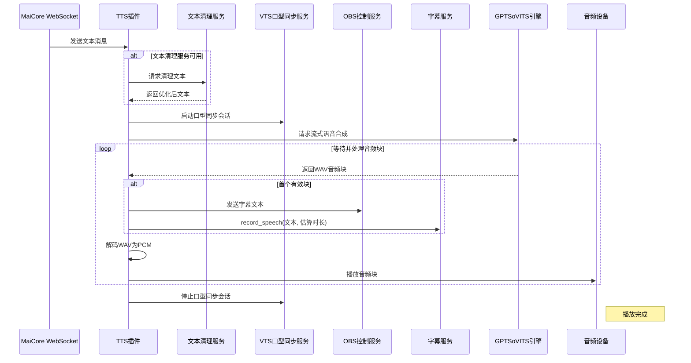

# Amaidesu GPTSoVITS TTS 插件

TTS（语音合成）插件是 Amaidesu VTuber 项目的核心组件，负责将文本消息转换为语音并播放给用户。插件使用 GPTSoVITS 引擎实现高质量语音合成，并支持与其他插件如文本清理服务、字幕服务、VTS 口型同步服务及 OBS 控制服务的深度集成。

## 功能特点

- 接收并处理 WebSocket 文本消息  
- 使用 GPTSoVITS 进行 **流式语音合成**  
- 支持选择不同语音角色和输出音频设备  
- 支持预设角色配置（包括参考音频和提示文本）  
- 集成 **文本清理服务（可选）**  
- **在首个有效音频块到达时触发字幕显示**（兼容 Subtitle 服务与 OBS）  
- 支持 **VTS 口型同步会话管理**（启动/停止）  
- 智能错误处理和资源管理  

## 依赖

### 必需依赖

- `GPTSoVITS`：AI语音克隆引擎  
- `sounddevice`: 音频播放  
- `numpy`: 用于音频数据处理  

### 可选服务依赖

- `text_cleanup`: 优化 TTS 输入文本（由 LLM Text Processor 插件提供）  
- `subtitle_service`: 显示字幕（由 Subtitle 插件提供）  
- `vts_lip_sync`: 控制 VTS 模型口型同步（由 VTS Lip Sync 插件提供）  
- `obs_control`: 向 OBS 推送字幕文本（由 OBS Control 插件提供）  

## 消息处理流程

TTS 插件处理流程如下：

1. **消息接收**：监听 MaiCore 的 WebSocket 文本消息  
2. **文本清理**（可选）：通过 `text_cleanup` 服务优化文本  
3. **启动口型同步**（若服务可用）：调用 `vts_lip_sync.start_lip_sync_session(text)`  
4. **发起流式 TTS 请求**：调用 `tts_model.tts_stream(text)`  
5. **等待首个音频块**：不提前预估时长，**在收到首个有效音频块时才触发字幕**  
   - 向 `obs_control` 发送字幕  
   - 调用 `subtitle_service.record_speech(text, estimated_duration)`  
6. **音频流处理**：逐块解码 WAV 为 PCM 并缓冲  
7. **实时播放 + 口型同步**：音频播放同时维持口型会话  
8. **清理阶段**：播放结束后调用 `vts_lip_sync.stop_lip_sync_session()`  

## 时序图



## 核心服务使用

### VTS 口型同步集成

```python
vts_lip_sync_service = self.core.get_service("vts_lip_sync")
if vts_lip_sync_service:
    await vts_lip_sync_service.start_lip_sync_session(text)
    # ... 播放中 ...
    await vts_lip_sync_service.stop_lip_sync_session()
```

### 字幕与 OBS 推送（在首个音频块时触发）

```python
# 仅在收到第一个有效音频块时执行
obs_service = self.core.get_service("obs_control")
if obs_service:
    await obs_service.send_to_obs(text)

subtitle_service = self.core.get_service("subtitle_service")
if subtitle_service:
    estimated_duration = max(3.0, len(text) * 0.3)
    asyncio.create_task(subtitle_service.record_speech(text, estimated_duration))
```

## 核心代码解析

### 1. 消息处理函数

```python
async def handle_maicore_message(self, message: MessageBase):
    """处理从 MaiCore 收到的消息，如果是文本类型，则进行 TTS 处理。"""
    if message.message_segment and message.message_segment.type == "text":
        original_text = message.message_segment.data
        if not isinstance(original_text, str) or not original_text.strip():
            self.logger.debug("收到非字符串或空文本消息段，跳过 TTS。")
            return

        original_text = original_text.strip()
        self.logger.info(f"收到文本消息，准备 TTS: '{original_text[:50]}...'")

        final_text = original_text

        # (可选) 清理文本
        cleanup_service = self.core.get_service("text_cleanup")
        if cleanup_service:
            try:
                cleaned = await cleanup_service.clean_text(original_text)
                if cleaned:
                    final_text = cleaned
            except Exception as e:
                self.logger.error(f"调用 text_cleanup 服务时出错: {e}")

        # 执行 TTS
        await self._speak(final_text)
```

### 2. 更新后的 TTS 执行函数 `_speak`

```python
async def _speak(self, text: str):
    self.logger.info(f"请求播放: '{text[:30]}...'")

    vts_lip_sync_service = self.core.get_service("vts_lip_sync")
    if vts_lip_sync_service:
        try:
            await vts_lip_sync_service.start_lip_sync_session(text)
        except Exception as e:
            self.logger.debug(f"启动口型同步会话失败: {e}")

    try:
        # 发起流式请求（不阻塞，但首 chunk 可能延迟）
        audio_stream = self.tts_model.tts_stream(text)
        self.logger.debug("TTS 流已创建，等待首音频块...")

        # 确保音频播放流已启动
        if self.stream and not self.stream.active:
            self.stream.start()

        # 标记是否已发送字幕（避免重复）
        subtitle_sent = False

        # 开始消费音频流
        for chunk in audio_stream:
            if not chunk:
                self.logger.debug("收到空音频块，跳过")
                continue

            # 👇 第一次收到有效音频块时，立即发送字幕
            if not subtitle_sent:
                self.logger.debug("收到首个音频块，触发字幕显示")
                
                # 发送 OBS 字幕
                obs_service = self.core.get_service("obs_control")
                if obs_service:
                    try:
                        await obs_service.send_to_obs(text)
                    except Exception as e:
                        self.logger.error(f"向 OBS 发送字幕失败: {e}", exc_info=True)

                # 通知字幕服务
                subtitle_service = self.core.get_service("subtitle_service")
                if subtitle_service:
                    try:
                        # 动态估算时长
                        estimated_duration = max(3.0, len(text) * 0.3)
                        asyncio.create_task(
                            subtitle_service.record_speech(text, estimated_duration)
                        )
                    except Exception as e:
                        self.logger.error(f"调用 subtitle_service 出错: {e}", exc_info=True)

                subtitle_sent = True  # 只发一次

            # 处理音频（播放 + 口型同步）
            await self.decode_and_buffer(chunk)

        self.logger.info(f"音频播放完成: '{text[:30]}...'")

    except Exception as e:
        self.logger.error(f"TTS 播放出错: {e}", exc_info=True)
    finally:
        if vts_lip_sync_service:
            try:
                await vts_lip_sync_service.stop_lip_sync_session()
            except Exception as e:
                self.logger.debug(f"停止口型同步失败: {e}")
```

### 3. 音频流处理函数

```python
async def decode_and_buffer(self, wav_chunk):
    """异步解析分块的WAV数据，提取PCM音频并缓冲"""
    try:
        # 解析WAV数据，提取PCM部分
        if isinstance(wav_chunk, str):
            wav_data = base64.b64decode(wav_chunk)
        else:
            wav_data = wav_chunk
            
        async with self.input_pcm_queue_lock:
            is_first_chunk = len(self.input_pcm_queue) == 0
            
        # 解析WAV头并提取PCM数据
        # ...处理WAV头和PCM数据提取逻辑...
        
        # PCM数据缓冲处理
        async with self.input_pcm_queue_lock:
            self.input_pcm_queue.extend(pcm_data)
            
        # 按需切割音频块进行播放
        while await self.get_available_pcm_bytes() >= BUFFER_REQUIRED_BYTES:
            raw_block = await self.read_from_pcm_buffer(BUFFER_REQUIRED_BYTES)
            self.audio_data_queue.append(raw_block)
            
    except Exception as e:
        self.logger.error(f"处理WAV数据失败: {str(e)}")
```

## 配置说明

插件通过 `config.toml` 文件进行配置，主要配置项包括：

```toml
[tts]
# 服务器配置
host = "127.0.0.1"
port = 9880

# 参考音频配置
ref_audio_path = "path/to/reference.wav"
prompt_text = "这是一段参考音频的文本提示"
aux_ref_audio_paths = []

# 语言设置
text_language = "zh"
prompt_language = "zh"

# 媒体类型和流模式
media_type = "wav"
streaming_mode = true

# 模型控制参数
top_k = 20
top_p = 0.6
temperature = 0.3
batch_size = 1
batch_threshold = 0.7
speed_factor = 1.0
text_split_method = "latency"
repetition_penalty = 1.0
sample_steps = 10
super_sampling = true

[models]
# 模型路径
gpt_model = "path/to/gpt_model.ckpt"
sovits_model = "path/to/sovits_model.pth"

# 角色预设
[models.presets.default]
name = "默认角色"
ref_audio = "path/to/reference.wav"
prompt_text = "我是一个默认角色"

[models.presets.other]
name = "其他角色"
ref_audio = "path/to/other_reference.wav"
prompt_text = "我是另一个角色"
gpt_model = "path/to/specific_gpt.ckpt"
sovits_model = "path/to/specific_sovits.pth"

[pipeline]
# 默认使用的预设
default_preset = "default"

[plugin]
# 输出设备名称，留空使用默认设备
output_device = ""
# 是否使用LLM清理文本
llm_clean = true
```

## 优化与扩展

1. **精准字幕时机**：避免因提前预估时长导致字幕与语音不同步  
2. **多服务协同**：VTS + OBS + Subtitle 三端同步支持  
3. **流式低延迟**：首块音频即触发下游服务，提升响应感  
4. **会话生命周期管理**：口型同步会话自动启停，避免残留状态  
5. **动态时长估算**：`max(3.0, len(text) * 0.3)` 平衡短句与长句显示时间  

## 开发注意事项

1. `subtitle_sent` 标志确保字幕只触发一次，防止重复  
2. 所有服务调用均包裹在 `try-except` 中，避免单点故障中断 TTS  
3. VTS 会话必须在 `finally` 块中关闭，确保资源释放  
4. 字幕时长估算为启发式策略，可根据实际语音速度进一步优化（如结合 GPTSoVITS 的 token 长度）  
5. 若 GPTSoVITS 首块延迟较高，可考虑预加载或静音填充以维持口型同步同步性  
