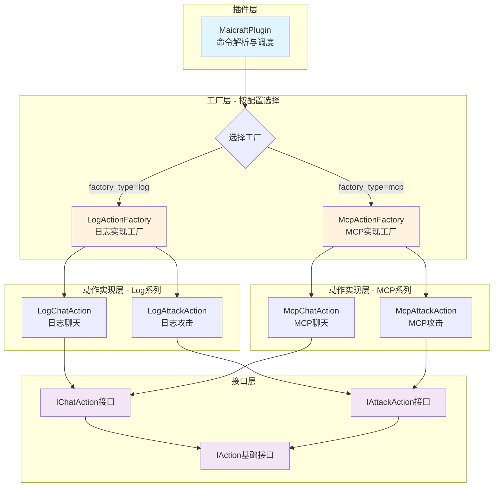
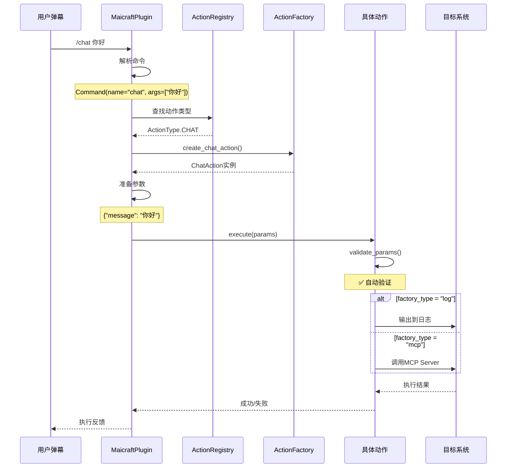
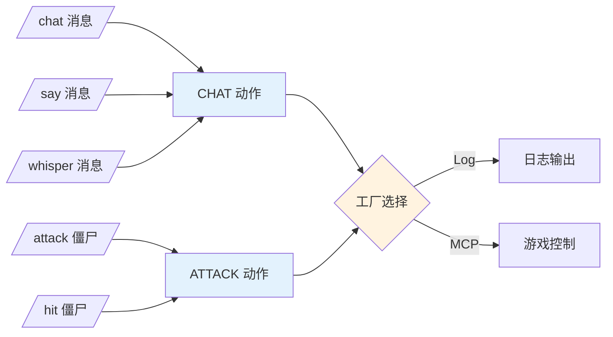
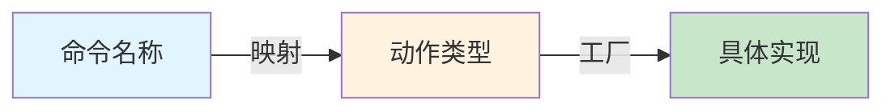

# Maicraft 插件

基于**抽象工厂模式**的弹幕互动游戏插件，支持通过配置切换不同的动作实现系列。

## ✨ 核心特性

- 🏭 **抽象工厂模式** - 通过配置一键切换整套动作实现
- 🔒 **类型安全** - TypedDict 提供完整的类型提示和 IDE 支持
- ✅ **自动验证** - 基于 TypedDict 的自动参数验证
- 🧩 **模块化设计** - 接口、实现、工厂完全解耦
- 🔄 **易于扩展** - 添加新动作只需实现接口
- 🧪 **易于测试** - Log 实现用于测试，MCP 实现用于生产

---

## 🎯 快速开始

### 配置文件

```toml
# src/plugins/maicraft/config.toml

[maicraft]
enabled = true

# 选择工厂类型
factory_type = "log"  # "log" 用于测试，"mcp" 用于真实游戏

# 命令映射（多个命令可映射到同一动作）
[command_mappings]
chat = "chat"
say = "chat"
whisper = "chat"

attack = "attack"
hit = "attack"
```

### 使用示例

```bash
# 发送弹幕命令
/chat 你好世界     # 聊天动作
/say 大家好        # 同样是聊天动作（不同命令名）
/attack zombie     # 攻击僵尸
```

---

## 🏗️ 架构设计

### 设计模式：抽象工厂模式（Abstract Factory Pattern）



### 工作流程



---

## 📁 目录结构

```
maicraft/
├── actions/                          # 动作系统
│   ├── interfaces/                   # 接口定义
│   │   ├── base.py                   # IAction 基础接口
│   │   ├── chat_action.py            # IChatAction + ChatActionParams
│   │   ├── attack_action.py          # IAttackAction + AttackActionParams
│   │   └── __init__.py
│   ├── impl/                         # 动作实现
│   │   ├── log/                      # Log 系列实现
│   │   │   ├── chat_action.py        # LogChatAction
│   │   │   ├── attack_action.py      # LogAttackAction
│   │   │   └── __init__.py
│   │   ├── mcp/                      # MCP 系列实现
│   │   │   ├── chat_action.py        # McpChatAction
│   │   │   ├── attack_action.py      # McpAttackAction
│   │   │   └── __init__.py
│   │   └── __init__.py
│   ├── param_validator.py            # 自动参数验证工具
│   └── __init__.py
│
├── factories/                        # 工厂模块
│   ├── abstract_factory.py           # 抽象工厂接口
│   ├── log_factory.py                # Log 工厂实现
│   ├── mcp_factory.py                # MCP 工厂实现
│   └── __init__.py
│
├── mcp/                              # MCP Client
│   ├── client.py                     # MCP 客户端实现
│   └── mcp_servers.json              # MCP 服务器配置
│
├── action_types.py                   # ActionType 枚举
├── action_registry.py                # 命令映射管理
├── command_parser.py                 # 命令解析器
├── command.py                        # Command 数据类
├── plugin.py                         # 插件主入口
└── config.toml                       # 配置文件
```

---

## 🔧 核心组件

### 1. 动作接口（Action Interfaces）

定义抽象的动作类型，每个接口包含：
- **TypedDict 参数定义** - 提供类型安全
- **自动参数验证** - 继承 `ValidatedAction`
- **统一的 execute 方法** - 接收 TypedDict 参数

```python
# interfaces/chat_action.py
from typing import TypedDict
from .base import IAction
from ..param_validator import ValidatedAction

class ChatActionParams(TypedDict):
    """聊天动作参数"""
    message: str

class IChatAction(IAction, ValidatedAction):
    """聊天动作接口"""
    PARAMS_TYPE = ChatActionParams  # ✅ 自动验证
    
    async def execute(self, params: ChatActionParams) -> bool:
        ...
```

**优势：**
- ✅ IDE 代码补全和类型检查
- ✅ 自动参数验证（无需手写）
- ✅ 参数定义即文档

### 2. 抽象工厂（Abstract Factory）

定义创建所有动作的接口：

```python
class AbstractActionFactory(ABC):
    @abstractmethod
    def create_chat_action(self) -> IChatAction:
        """创建聊天动作"""
        pass
    
    @abstractmethod
    def create_attack_action(self) -> IAttackAction:
        """创建攻击动作"""
        pass
    
    async def initialize(self) -> bool:
        """初始化工厂（如连接 MCP Server）"""
        return True
    
    async def cleanup(self):
        """清理资源"""
        pass
```

### 3. 具体工厂（Concrete Factories）

#### LogActionFactory

用于测试和调试，所有动作仅输出日志：

```python
class LogActionFactory(AbstractActionFactory):
    def create_chat_action(self) -> IChatAction:
        return LogChatAction()  # 输出到日志
    
    def create_attack_action(self) -> IAttackAction:
        return LogAttackAction()  # 输出到日志
```

**使用场景：**
- 🧪 开发测试
- 🐛 调试命令解析
- 📝 验证业务逻辑

#### McpActionFactory

用于生产环境，通过 MCP Server 控制游戏：

```python
class McpActionFactory(AbstractActionFactory):
    async def initialize(self) -> bool:
        # ✅ 连接 MCP Server
        self.mcp_client = MCPClient()
        return await self.mcp_client.connect()
    
    def create_chat_action(self) -> IChatAction:
        action = McpChatAction()
        action.mcp_client = self.mcp_client  # 注入客户端
        return action
```

**使用场景：**
- 🎮 真实游戏控制
- 📡 通过 MCP 协议通信
- 🔄 支持自动重连

### 4. 自动参数验证

基于 TypedDict 的自动验证，无需手写验证逻辑：

```python
# ✅ 只需定义参数类型
class ChatActionParams(TypedDict):
    message: str

# ✅ 接口继承 ValidatedAction
class IChatAction(IAction, ValidatedAction):
    PARAMS_TYPE = ChatActionParams  # 指定参数类型

# ✅ 实现类自动获得验证
class LogChatAction(IChatAction):
    async def execute(self, params: ChatActionParams) -> bool:
        # ✅ 自动验证（类型、必需字段等）
        if not self.validate_params(params):
            return False
        
        # ✅ IDE 知道 params["message"] 是 str
        message = params["message"]
        self.logger.info(f"发送消息: {message}")
        return True
```

**验证内容：**
- ✅ 必需字段检查
- ✅ 类型检查
- ✅ 可选字段支持
- ✅ 自动错误日志

### 5. 命令映射系统

支持多命令映射到同一动作：



---

## 📝 使用指南

### 配置切换

#### 测试模式（Log 工厂）

```toml
factory_type = "log"
```

**效果：**
- 所有动作输出到日志
- 不连接 MCP Server
- 适合测试命令解析

**日志示例：**
```
[MAICRAFT-CHAT] 发送聊天消息: '你好世界'
[MAICRAFT-ATTACK] 攻击生物: 'zombie'
```

#### 生产模式（MCP 工厂）

```toml
factory_type = "mcp"
```

**效果：**
- 插件启动时连接 MCP Server
- 动作通过 MCP 协议执行
- 支持真实游戏控制

**日志示例：**
```
开始初始化 MCP 工厂...
正在连接到 MCP Server...
✅ MCP Server 连接成功
```

### 添加命令映射

```toml
[command_mappings]
# 格式：命令名 = "动作类型"

# 聊天动作
chat = "chat"
say = "chat"
msg = "chat"

# 攻击动作
attack = "attack"
hit = "attack"
kill = "attack"
```

---

## 🚀 扩展开发

### 添加新动作（完整流程）

以添加 `move` 动作为例：

#### 步骤 1：定义接口和参数

```python
# actions/interfaces/move_action.py
from __future__ import annotations
from typing import TypedDict
from .base import IAction
from ..param_validator import ValidatedAction

class MoveActionParams(TypedDict):
    """移动动作参数"""
    x: float
    y: float
    z: float

class IMoveAction(IAction, ValidatedAction):
    """移动动作接口"""
    PARAMS_TYPE = MoveActionParams
    
    async def execute(self, params: MoveActionParams) -> bool:
        ...
```

#### 步骤 2：添加动作类型枚举

```python
# action_types.py
class ActionType(Enum):
    CHAT = "chat"
    ATTACK = "attack"
    MOVE = "move"  # ✅ 新增
```

#### 步骤 3：实现 Log 版本

```python
# actions/impl/log/move_action.py
from __future__ import annotations
from src.utils.logger import get_logger
from ...interfaces import IMoveAction
from ...interfaces.move_action import MoveActionParams

class LogMoveAction(IMoveAction):
    def __init__(self):
        self.logger = get_logger("LogMoveAction")
    
    def get_action_type(self) -> str:
        return "move"
    
    async def execute(self, params: MoveActionParams) -> bool:
        if not self.validate_params(params):  # ✅ 自动验证
            return False
        
        x, y, z = params["x"], params["y"], params["z"]
        self.logger.info(f"[MAICRAFT-MOVE] 移动到: ({x}, {y}, {z})")
        return True
```

#### 步骤 4：实现 MCP 版本

```python
# actions/impl/mcp/move_action.py
from __future__ import annotations
from src.utils.logger import get_logger
from ...interfaces import IMoveAction
from ...interfaces.move_action import MoveActionParams
from ....mcp.client import MCPClient

class McpMoveAction(IMoveAction):
    def __init__(self):
        self.logger = get_logger("McpMoveAction")
        self.mcp_client: MCPClient = None
    
    def get_action_type(self) -> str:
        return "move"
    
    async def execute(self, params: MoveActionParams) -> bool:
        if not self.validate_params(params):
            return False
        
        x, y, z = params["x"], params["y"], params["z"]
        
        try:
            await self.mcp_client.call_tool("move", {
                "x": x, "y": y, "z": z
            })
            return True
        except Exception as e:
            self.logger.error(f"移动失败: {e}")
            return False
```

#### 步骤 5：更新工厂

```python
# factories/abstract_factory.py
class AbstractActionFactory(ABC):
    @abstractmethod
    def create_move_action(self) -> IMoveAction:  # ✅ 新增
        pass

# factories/log_factory.py
def create_move_action(self) -> IMoveAction:
    return LogMoveAction()

# factories/mcp_factory.py
def create_move_action(self) -> IMoveAction:
    action = McpMoveAction()
    action.mcp_client = self.mcp_client
    return action
```

#### 步骤 6：更新插件逻辑

```python
# plugin.py
def _create_action(self, action_type: ActionType):
    if action_type == ActionType.MOVE:  # ✅ 新增
        return self.action_factory.create_move_action()
    # ...

def _prepare_action_params(self, action_type: ActionType, args: list[str]):
    if action_type == ActionType.MOVE:  # ✅ 新增
        if len(args) < 3:
            return None
        try:
            x, y, z = float(args[0]), float(args[1]), float(args[2])
            return {"x": x, "y": y, "z": z}
        except ValueError:
            return None
    # ...
```

#### 步骤 7：更新配置

```toml
[command_mappings]
move = "move"
tp = "move"
goto = "move"
```

#### 步骤 8：测试

```bash
# Log 模式测试
factory_type = "log"

/move 100 64 200
# 预期输出：[MAICRAFT-MOVE] 移动到: (100.0, 64.0, 200.0)

# MCP 模式测试
factory_type = "mcp"

/move 100 64 200
# 预期：在 Minecraft 中移动
```

---

## 🎨 设计优势

### 1. 类型安全

```python
# ✅ IDE 完整支持
params: ChatActionParams = {"message": "你好"}
message = params["message"]  # IDE 知道这是 str

# ❌ 类型错误会被检测
params: ChatActionParams = {"message": 123}  # 类型检查器报错
```

### 2. 自动验证

```python
# ❌ 旧方式：每个动作都要写验证
def validate_params(self, params):
    if "message" not in params:
        return False
    if not isinstance(params["message"], str):
        return False
    return True

# ✅ 新方式：自动验证
class IChatAction(IAction, ValidatedAction):
    PARAMS_TYPE = ChatActionParams  # 搞定！
```

### 3. 易于切换

```toml
# 一行配置切换所有动作
factory_type = "log"  # → 全部日志
factory_type = "mcp"  # → 全部 MCP
```

### 4. 完全解耦



**优势：**
- 命令可以自由修改
- 动作类型稳定
- 实现可以替换

---

## 📊 当前状态

| 组件 | 状态 | 说明 |
|------|------|------|
| 抽象工厂架构 | ✅ 完成 | 支持 Log 和 MCP 工厂 |
| Log 系列实现 | ✅ 完成 | Chat, Attack |
| MCP 系列实现 | ✅ 完成 | Chat, Attack + MCP Client |
| TypedDict 参数 | ✅ 完成 | 类型安全 + 自动验证 |
| 自动参数验证 | ✅ 完成 | ValidatedAction 基类 |
| 接口文件拆分 | ✅ 完成 | interfaces/ 目录 |
| MCP 连接管理 | ✅ 完成 | 延迟初始化 + 自动清理 |
| 命令映射系统 | ✅ 完成 | ActionRegistry |

---

## 📚 相关文档

- **设计模式对比** - 查看设计方案的权衡
- **TypedDict vs 其他方案** - 类型安全的实现方式
- **参数验证原理** - ValidatedAction 的工作机制

---

## 🔮 未来计划

- [ ] 添加更多动作类型
  - [ ] 移动动作 (move)
  - [ ] 挖掘动作 (mine)
  - [ ] 建造动作 (build)
  - [ ] 物品动作 (give, take)
  
- [ ] 功能增强
  - [ ] 动作执行结果反馈
  - [ ] 动作队列和调度系统
  - [ ] 动作执行历史记录
  - [ ] 动作权限系统
  
- [ ] 可靠性
  - [ ] 动作重试机制
  - [ ] 动作超时控制
  - [ ] 错误恢复策略

---

## 💡 常见问题

### Q: Log 模式和 MCP 模式如何切换？

A: 修改 `config.toml` 中的 `factory_type`，重启插件即可。

### Q: 如何添加新命令？

A: 在 `config.toml` 的 `[command_mappings]` 中添加即可，无需修改代码。

### Q: MCP 连接失败怎么办？

A: 检查：
1. MCP Server 是否运行
2. `mcp/mcp_servers.json` 配置是否正确
3. 网络是否正常
4. 查看 `logs/maicraft/plugin_error.log`

### Q: 如何测试新动作？

A: 先用 `factory_type = "log"` 测试命令解析和参数处理，确认无误后再切换到 `factory_type = "mcp"`。

---

## 🙏 贡献

欢迎贡献新的动作实现或工厂实现！

**贡献流程：**
1. Fork 项目
2. 创建特性分支
3. 实现并测试
4. 提交 Pull Request

---

## 📄 许可证

[项目许可证]

---

**Enjoy! 🎮**
